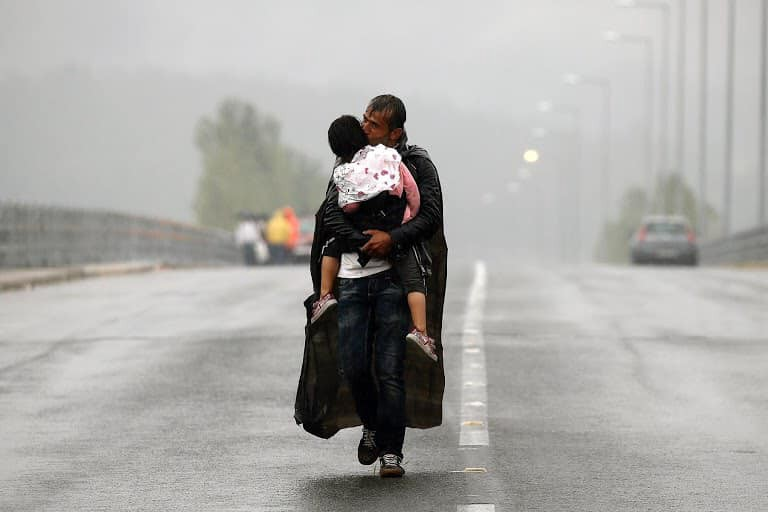
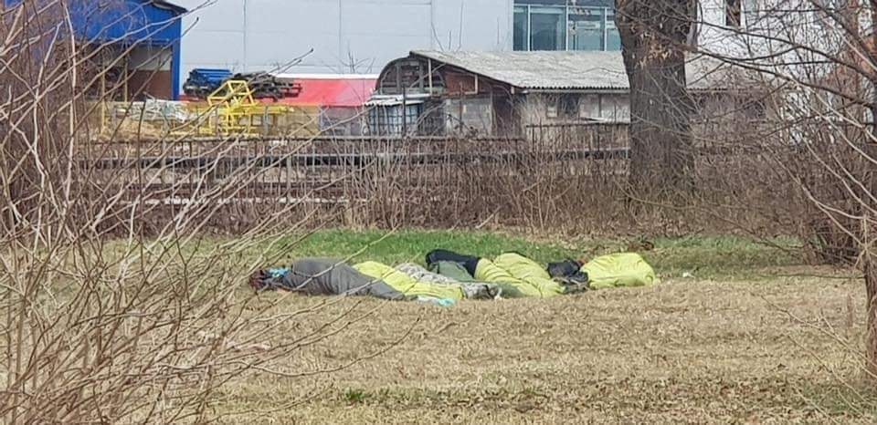
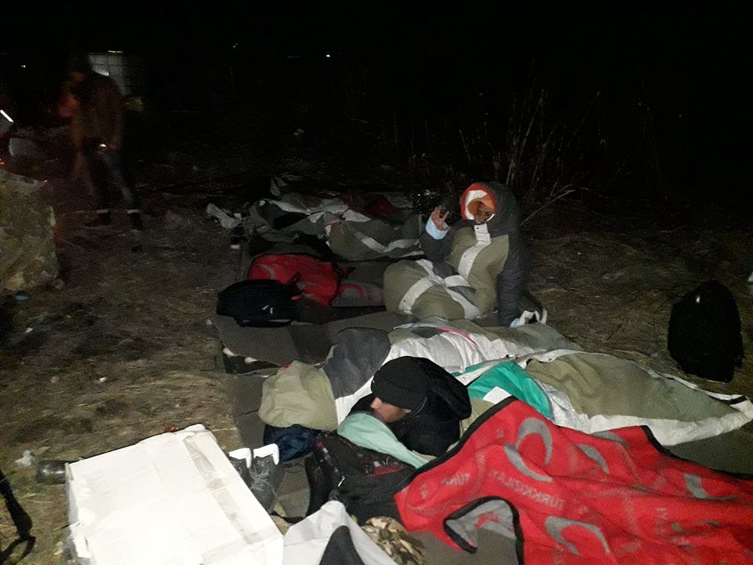
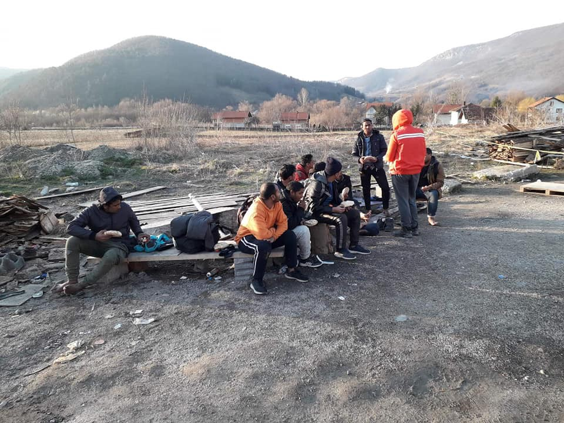
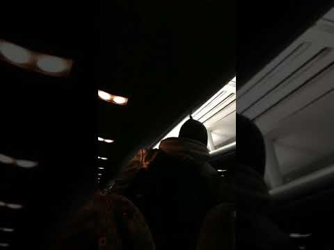

### AYS Weekend Digest 2–3/3/19: Minors Tortured in Libya’s Triq al Sikka detention centre

Report from deported refugees in Kabul // Deliberate overcrowding of camps on Greek islands // Arrivals to Spain // Police restrict freedom of movement in Bosnia // Huge protests against racism in Italy and more…\.

](assets/a31c8581894e/1*f663UTa6hboEhQt-Sqq9YQ.png)

“According to the government statistics, there are more than 15 000 registered refugees on the Greek islands\. Strangely, the same data indicates that there are no makeshift camps on the islands\. Following this logic, the Olive Grove settlings next to Moria camp on Lesvos, a place known as “a jungle”, would have to be counted as official accommodation provided by the authorities\.” Text and image credit: [ReFOCUS Media Labs\.](https://www.instagram.com/p/Bud6V4rnqSp/?utm_source=ig_share_sheet&igshid=1ugy5tho3hnv3&fbclid=IwAR2iG2BpeE2HIlIpuwoUTt5H3g59dTdOcOqv6gWLmxx6Rl-K5hK5xYp-zvY)
### Libya

[Sally Hayden has reported](https://twitter.com/sallyhayd/status/1102303214567862278) on the harsh and horrifying treatment of those who took part in a protest at Libya’s Triq al Sikka detention centre on Tuesday 26th Feb\. The protest by detainees at the detention centre demanded a visit from the UN Refugee Agency to shine a light on the constant violence they face at the hands of the guards\. She reports that many are locked inside 24 hours a day, with no sunlight or fresh air for months on end\. It is this same centre where one man [burnt himself to death in October](https://www.aljazeera.com/news/2018/11/libyan-detention-hell-refugee-burned-alive-181110102329706.html) \. The detention centre is the “de facto headquarters of Libya’s Department for Combatting Illegal Migration”, and therefore the Libyan government is fully aware of what really happens in the centre, yet does nothing to stop it\. This is the same government that the EU is currently funding to control migration to Europe\. This is where the money is going, paying guards who torture and humiliate all those returned to Libya by the EU funded coastguard\. Infact, most of those who took part in the protest had previously been returned to Libya following attempts to reach Italy by boat\. Unsurprisingly the protest was met with harsh measures\.

> They were surrounded by c\.100 guards who began to beat them brutally with metal & sticks\. “There were about four who fainted when they beat them in their head with metal,” a witness told me\. 

](assets/a31c8581894e/1*pR0oArHmtlbLV9gtmnUojQ.png)

Picture from the protests on Tuesday: Photo credit, [Sally Haydon](https://twitter.com/sallyhayd/status/1102303214567862278)

The repurcussions for those who took part have been severe\. Haydon states that around 30 protestors — including around 6 minors — are now locked in an underground cell where they are subject to cruel and violent treatment to punish them for speaking out against the conditions in the detention centre\. When she made the situation clear to the UNHCR, they replied with the following message:

](assets/a31c8581894e/1*HiPJdORT-XCGTMpIGnu6Pg.jpeg)

UNHCR repsone: Credit [Sally Haydon](https://twitter.com/sallyhayd/status/1102311628555632640)

It is clear that the UNHCR continues to stand by and become complicit in huge violations of people’s human rights\. Whilst they decry their efforts to provide blankets and clothes, they allow for the torture of minors to continue unchallenged\. The EU, through funding both these centres and the Libyan coastguard, by denying people the right to seek asylum in Europe, and by returning people to these horrific conditions have blood on their hands\. These detention centres are widely known not to “meet international humanitarian standards”, with countless images and videos showing the very opposite to be true, yet they continue to serve a useful purpose for the racist, anti\-migrant rhetoric that echoes across Europe; keeping migration numbers down and the faces of those who suffer hidden from European eyes\.
### Afghanistan
#### Report from Deported Refugees in Kabul

The [Afghani Migrants Advice and Support Organization in Denmark released a short report](https://www.facebook.com/AmasoAfg/?__tn__=%2CdkCH-R-R&eid=ARAIxlQYDWM-Ue-n48_6UR02Z5rQKu-whviWJe0zIjDVaj51l5FmmB-0twCADwyM8VPY6poxU5bjTh0k&hc_ref=ARTUl6Ddf7g6gDtET27yZlN0n8NiI5M3D_exMSPXaqTfIVo6z36lLuB5-tyrNqe2jII&fref=nf) based on their interviews with two men who had been forcibly deported\. The group has been regularly publishing these reports based on their interviews\. AMASO wrote that the two men were in a very precarious situation after arriving in Afghanistan, and do not have any means to support themselves or return to their families in Iran\.

> Both of the returnees are living and surviving with no support at all\. They have been living in different locations in Kabul with friends and relatives and soon will be out of place\. Their families live in Iran and they do not have any way to get to their families unless they receive the in kind support from ACE\. 

> They were promised to be given the support after 10 days of the documents submission, but it has passed almost a month and yet they haven’t received the support\. 

### Sea

[Missing Migrants Project reports](https://reliefweb.int/report/world/mediterranean-migrant-arrivals-reach-8956-2019-deaths-reach-224?fbclid=IwAR2aCCaWRW9C3wU-DeSPHznDEPsoOeqi9nGHe9vtFSFArR7z8F0iuWdfcDg) that so far this year Mediterranean migrant arrivals reach 8,956, whilst deaths reach 224 — a 12% decrease form arrivals in the same time frame for 2018, and around half as many deaths as this time last year\.
### Greece
#### New Arrivals and Interceptions \(numbers via [Aegean Boat Report](https://www.facebook.com/AegeanBoatReport/posts/534230837100025?hc_location=ufi) \)

On Friday morning \(01\.03\) a boat headed towards Chios was stopped around 9:20 by the Turkish Coast Guard north of Süngükaya island\. 44 people \(12 children, 5 women and 27 men\) were arrested\.

Two boats have arrived on the Aegean islands on 03\.03\. The first boat landed on Lesvos, carrying 25 children, 10 women and 7 men\. The second boat arrived on Samos, carrying 50 people\. No breakdown currently available\.
#### Photo Journalist Yannis Behrakis Passes Away

Greek photo journalist Yannis Behrakis died this week from cancer\. He reported on the refugee crisis in Greece, and tried to give voice to those who were often denied one for many years\. He will be remembered for his moving images and stories\.

A father kisses his daughter while walking towards the Greek\-Macedonian border\. Photo Credit: Yannis Behrakis
#### Signs the Greek Authorities are Deliberately Keeping Aegean Camps Overcrowded

So far, the number of arrivals on the Aegean islands in the first months of 2019 have been lower than previous years\. As the volunteer behind the Aegean Boat Report \(ABR\) noted, the average has been 434 new arrivals per week in 2019\. At the same time, there has been an average of only 394 people per week leaving, meaning the camp populations are still increasing, despite the drop in arrivals\. As ABR wrote;

> If the Greek government was seriously trying to reduce population, they would at least have kept the transfer rate from the last 8 week of 2018, when they reduced population by 400 people per week\. This would have resulted in a reduction of 3200 people in only 8 weeks, instead they reduced transfers\. This can only be seen as a deliberate act, a political game at the expense of vulnerable people\. 

> ABR believes that the Greek government intends to keep approximately 16\.000 people on the islands, to maintain pressure on the EU, and at the same time try to discourage people from coming to the islands\. The result of this political game, we can see on the islands, where people are living under inhuman conditions\. We can no longer say we didn’t know, humanity seems to have lost it’s way\. 

It seems these cramped conditions continue to breed tensions in the camps, with [continued reports](https://www.facebook.com/groups/763313107147281/permalink/1711918765620039/?hc_location=ufi) of violence breaking out in Moria on Lesvos between different groups living there\. On top of this, the Greek Migration Minister [predicts the number of refugees across Greece will exceed 90 000 by the end of 2019](http://www.ekathimerini.com/238146/article/ekathimerini/news/number-of-migrants-in-greece-expected-to-top-90000-by-year-end-minister-says?fbclid=IwAR1fOgFjvilLKDnT3JdEaBAjc-iW1sAtvJU5RWti4y1B3xQ_SNVRtUwhEDU) , with roughly 75 000 currently accounted for\. He states Greece only has the capacity to process 20 000 asylum applicants per year, and faces an overwhelming and impossible task due to the current mechanisms within The Dublin regulation, which stipulates the first member state to register an asylums seeker is responsible for their asylum claim\.
#### Updates on Forthcoming UNHCR Evictions and Cash Card Programme in Greece

Following announcements that on 31st March 2019 any refugee who was granted asylum in Greece before 31st July 2017 will be evicted from their UNHCR apartment and no longer receive their cash card — unless particuarly vulnerable, [Refugees Movements for Freedom and Rights](https://www.facebook.com/RefugeesMovementforRightsandJustice/?__tn__=kCH-R&eid=ARD_obQ2myFNveEootc6mMAE4ianylVKvXFeWh7iW4lLDc4AJ0CQeX3r-6U5j80TbahtzCCStKtdzG3w&hc_ref=ARRprZaN3OmLXcK10f9oCPL6mbEPsf7O_eT3sKxfClRfoox75a9ZSPcrW6269FD4RR4&fref=nf&__xts__[0]=68.ARABelvcBSjkFjtXLS_iqZ33EgFTLD3hJo_tOf5onFbH1s3AWjH024yVRnUlcTjOHwGApKaLXuLH9CqlRDbGNEAgKSleFBOi2MfsMecjIZKharW4sIB0Yc7uL-mLhxH5lsPTCepuEGt7KRDafqc_BRSvkZrXhR0bjgdZiFgpKzTMT9Tm13T4lpMegBoduxFtaWHG0MddoS4ffyYuo2MxFZsZtzXBXYUcQc9kuRL1zltoXiAA_qc58wAUxQsUtpXyLzf4GtPXRjPUiXu59CtYWHu6iOxJC9Ek0bIgfsW02URWRtPjbxILKrtxX3Vo81ksAkytSPm6iHoZVj0txHwTbUP2X9Ri7IvlWfR5KIVIFIMKdS8rJRyMM4BRoIrnGcKkMtWXbxDI0Tp0qtrZnws19M25dsA7_spa9PfpkXMu7Z-aMyCwgDiwKQUhgv94upvh8Z9KMV3WwO0pcDL70S-DhyCMziRRiiBJf4mOPNoA0Prg2-_tRrLKCgNT9Q) have taken to the streets to make sure everyone who may be affected knows the situation\.

> The statement was discussed today with refugees communities and Greek activists and called on them to engage actively and extensively with the movement in its fights for refugees’ rights\.
 

>  [\#FightBack](https://www.facebook.com/hashtag/fightback?source=feed_text&epa=HASHTAG&__xts__%5B0%5D=68.ARD1YnC2TVk3uEW0DPSE2Kd1QwX_GuU-uyir7_FdkN0CQ0v8UFq6ioCAgwzpiMAlDbxJRkW2SdP-S2ugtB28ceuVUoQF9h68ESpeVDh-79VxWxqK08THrNftjYblkpLm59KDnRSZKxCS8t0Lvtgd24rDCQkks9oqpNkrxhdKLg_iadppIyZBR5vYTZdJlIiBaT8D4avxGd1AQ-nxmUKPbV0oM1KDoFcF6cJ14drzKfMHCBwKD_gJHpm6HEx28LUhNZGnPGKwYq8eQpCLmHMfAk31PxOPeLpTcQLbtvd-4J8iYap-YWAEjQwrehxuuNxtJJTG3S7dXxB9D6OefhV0NeA&__tn__=%2ANK-R) 

#### Protest Against 3 Years of the EU\-Turkey Deal

[A protest has been called in Athens on 16th March](https://www.facebook.com/events/454875468384640/) , 2pm in Victoria Square, marking 3 years of the [EU\-Turkey Deal,](http://europa.eu/rapid/press-release_MEMO-16-963_en.htm) which effectively trapped thousands in hotspots on the islands, instantly criminalising those who arrive via boats on the Aegean and leading to inhumane and deplorable conditions in the overcrowded camps\.

> We must stop the racist and inhumane policies of the European Union against refugees and migrants\.
 

> We must stay together and fight for our lives and our rights together\. 

#### False Rumours About a “Convoy of Hope”

> [Athens Volunteers Information and Co\-ordination Group](https://www.facebook.com/groups/AthensVolunteersInformation/?fref=mentions) have released the following statement regarding rumours that a ‘convoy of hope’ will be making its way from Turkey to Greece\.
 

>  For some weeks now there have been rumours which have been circulating within refugee groups about ‘a caravan \(or convoy\) of hope’ starting from Turkey towards Greece, with a Greece Convoy joining and heading towards the borders into Europe\. 

> Those that are leading this action are now using whatever means they can to urge families to participate, preying on their vulnerabilities and even suggesting that marching to the borders enmasse with international NGOs will increase their chance of success\. The momentum is being increased with these messages \(there is even a google form asking people to sign up\) \. 

> The messaging around this rumour suggests that international NGOs and volunteers \(including medics\) are leading the efforts to organise this convoy\. One group even has the UNHCR logo \(suggesting misleadingly that UNHCR is behind the action\) \. 

> PLEASE NOTE THAT THIS INFORMATION BEING CIRCULATED ON SOCIAL MEDIA IS FALSE… 

> Participating in this action is also NOT AN ALTERNATIVE to losing the ESTIA accommodation\. 

The group urge volunteers to share this information and warn any who are considering joining such a convoy to be sensible and not participate\.

> Volunteers, if you know your friends are thinking about joining this convoy, please urge them to be sensible and not to participate in an event that could:
 

>  1\) be dangerous for their families if they attempt to march towards and break through borders as they will be detained when they cross the borders; 

> 2\) potentially result in them losing their recognised refugee status if they have been given international protection; or 

> 3\) potentially lose their right to asylum if they have a pending application\. 

Please [see here](https://www.facebook.com/groups/AthensVolunteersInformation/permalink/1633655560100068/?hc_location=ufi) for Arabic, and Farsi will follow shortly\.
#### Deportations

[Border Monitoring Aegean have reported](https://dm-aegean.bordermonitoring.eu/2019/03/02/28-february-lesvos-turkey/?fbclid=IwAR2wWujP0CZb2lL5f8TAAeXf9My67sIp9BDMh8kwjI2qqddQIn-U-pNjskM) 2 deportations — 1 person from Samos and 1 person from Chios, on 28th February\.
#### Awaiting Appeal Decisions 3 Years Later

[Reports have shown](https://www.efsyn.gr/ellada/dikaiomata/185443_xana-sto-simeio-miden-3000-aitimata-asyloy) that around 3000 people who submitted appeals against their asylum decision between September 2015 and April 2016 have still received no answer, due to to the Appeals Committee not working during this period\. There seems to be no suggestion as to how much longer they will have to wait\.

Food Kind are calling out for volunteers for March to come and join their community kitchen workshop, which also provides children’s activities and sports and exercise programs in two camps north of Athens\. [Please see here for details](http://www.foodkind.org/get-involved.html?fbclid=IwAR2pWIo7HwyRX9_aAf6b38oMjCkbbLWpRjFrcjO-H9HfoFVLZt5YVc4slFI) \.
### Spain
#### Arrivals

The arrival of 49 Sub\-Saharan migrants to the port of Motril, in Granada has [been reported](https://twitter.com/telediario_tve/status/1101883976095072256?fbclid=IwAR3fR9X3ArKrg3V94Imserfx0NIC7M4xnby0QdprBvInubOzFYRdg8liXgw) \. The people on board were rescued near the island of Alborán\.

■■■■■■■■■■■■■■ 
> **[Telediarios de TVE](https://twitter.com/telediario_tve) @ Twitter Says:** 

> > .@[salvamentogob](https://twitter.com/salvamentogob) ha trasladado al puerto de Motril, en Granada, a 49 personas de origen subsahariano que fueron rescatadas de una patera, cerca de la isla de Alborán @[RTVEAndalucia](https://twitter.com/RTVEAndalucia) https://t.co/cQfqSjxs7A 

> **Tweeted at [2019-03-02 16:36:26](https://twitter.com/telediario_tve/status/1101883976095072256).** 

■■■■■■■■■■■■■■ 

Alongside this, the Spanish coastguard [has been criticised](https://twitter.com/scandura/status/1101813751550861312?fbclid=IwAR3py_Rjm4RAiElIlfV8dvVm6Z7PUrGjPzVVKveN1Kp5avhPSyuy4Jziypg) for not providing sufficient updates on their Search and Rescue Missions, and photos have emerged highlighting the tragedies that too often take place in the stretch of sea between Spain and Morocco\.

](assets/a31c8581894e/1*cyNIIBBY6i6HaRuqDGVkPg.jpeg)

An abandoned rubber boat on a Spanish beach: Photo by [Lalia Glez\-Santiago](https://twitter.com/Laliags)
### Bosnia

People on the move continue to arrive in Bosnia daily\. Many are coming via Serbia to the city of Tuzla, intending to continue towards Sarajevo and further on to the Croatian border\. There are almost no resources or aid for these people, and the people who are arriving are relying almost wholly on assistance from locals in Bosnia\.

Refugees sleeping in a field in Tuzla, Bosnia\. Photo Credit: AYS\.

Sleeping rough in Kljuc\. Photo Credit: AYS\.

The UNHCR in Bosnia released a statment today in response to the continued arrivals in Bosnia, and the efforts of Bosnian police to restrict freedom of movement for refugees arriving in the country:

> Despite unfavourable weather for travelling, refugees and migrants continued to arrive to BiH, with 732 detected arrivals in January 2019 compared to 237 in January 2018\. There is a significant chance of increased arrivals in the spring with milder weather and improved travel conditions\. The majority arrive overland in an irregular manner \(i\.e\. at non\-official border crossings\) \. It is estimated that between 5,000 and 5,500 refugees and migrants remain in BiH in need of a range of types of humanitarian assistance at various locations, in particular in Sarajevo and Una\-Sana Canton \(USC\) \. 

> Measures put in place by government authorities in USC in October to limit the freedom of movement of asylum seekers and migrants in USC remained in effect throughout January\. This includes both movement to USC and movement within USC; police checks of buses and trains continue\. In January, calls were made for further restrictions on movement\. More specifically, calls were made to restrict entrance and exit from TRCs in USC to a limited range of hours — these restrictions were not put in place\. Restrictions placed on freedom of movement, inter alia, inhibit access to rights such as access to the asylum procedure, healthcare, and activities as basic as purchasing groceries, as well as cause family separation\. The UN in BiH advocates for these restrictions to be removed and the situation is continually monitored\. 

Refugees in Kljuc, Bosnia\. Photo Credit: Red Cross Kljuc

These measures continue to have devastating consequences on those affected\. This weekend a bus from Sarajevo to Bihac \(near the Croatian border\), was stopped by the police close to Kljuc, located in the Una Sana Canton, at the border with Republika Srpska\. The policemen came on board and started to ask for passports only to those that were considered migrants\.

The conversation was standard:
“passport?”
“no”
“out”

Among those on the bus, five guys without a passport were told to get off, and were left along the road, in the middle of fields\. All of them followed the order of the policeman without showing resistance, apart from one person, who asked the policeman if he could continue the journey, which they would not allow\. At the other side of the road, some people were starting a fire to warm themselves\. In the five minutes of this interaction, the others passengers remained silent and indifferent\. Actions such as this represent the ongoing passive violence through the use of tools of humiliation and discrimination\.

### Morocco

[Association Marocaine des Droits Humains — Section Nador](https://www.facebook.com/AmdhNador/?tn-str=k%2AF) have released a video showing a migrant camp outside of Nador where Moroccan Auxiliary forces routinely attack the camp and seize migrants phones, money, clothes and other belongings\. In this way the Moroccan Auxiliary forces attack the camps of migrants in Nador\.

> Amdh Nador that requires the stop of these illegal attacks also asks to stop tackling the business and the goods of migrants\. 

### Italy
#### Demonstrations Against Racism in Milan

Over 250 000 people took part in protests in Milan on 2nd March to show their solidarity with migrants and against the racist policies and attitudes in Italy — drawing attention to the ongoing state violence against migrants across the country\. L’Altra Voce shared pictures of the protest [here](https://www.facebook.com/permalink.php?story_fbid=2133640040062284&id=1245970425495921&hc_location=ufi) \.

> Italians from all parts of the country today say: FIRST THE PEOPLE, YES to the reception, YES to the multicultural, multireligious, free, just society, and where the rights of all are respected\.
 

> Here is the Italy we want\. A country without discrimination, without walls, without barriers\. 

](assets/a31c8581894e/1*x-o9iqvonrXREdfHDAK4uw.jpeg)

Protest in Milan: Photo by [L’Altra Voce](https://www.facebook.com/1245970425495921/photos/a.1266360583456905/2133921683367453/?type=3&theater)

■■■■■■■■■■■■■■ 
> **[Mediterranea Saving Humans](https://twitter.com/RescueMed) @ Twitter Says:** 

> > Ieri la Mare Jonio ha navigato a Milano in un fiume di umanità. Grazie #People per averci ricordato che i recinti, i muri e il filo spinato saranno travolti se essa si mette in cammino. #Primalepersone 

(video Francesco Malingri) https://t.co/K3maPUSWmi 

> **Tweeted at [2019-03-03 08:49:01](https://twitter.com/rescuemed/status/1102128732884606976).** 

■■■■■■■■■■■■■■ 

### Belgium

A workshop to help refugee and immigrant women to have access to education and to get professional opportunities in Belgium has been planned for Monday 18th March in Brussels\. For more info — also in other languages — please [follow this link](https://www.facebook.com/events/2347194632202664/) \.
### Denmark
#### Syrians Lose Automatic Eligibility for Asylum

The Danish national immigration service has [changed the official status for Syrians seeking asylum](https://www.thelocal.dk/20190228/new-danish-assessment-makes-future-uncertain-for-syrian-asylum-seekers?fbclid=IwAR0gVZCRsMnpz5xHv_DhdCLWNt2RviSkoIEYIYDguhRRKMBvWHndl30-XIA) \. Syrians are no longer automatically eligible for asylum, based on the Danish government’s assesssment that the “security situation” in government\-held areas of Damascus has improved\. There are a number of problems with this finding — simply because overt acts of violence are declining in some areas, it does not mean that these government\-held areas are safe for many refugees to return to, as there are still threats of imprisonment, torture, and forced conscription from the Assad regime\.
### France
#### Conditions in Paris Remain Awful

[Koussay Maraudes](https://www.facebook.com/koussay.maraudes?__tn__=%2CdC-R-R&eid=ARBlL-ethOQwzRnbQLw1n34XuyQSqajpCe7XzvvcRVii2oB0Y3xQM5ome6ARQbzQ1cyCPI3OY2HYfwTA&hc_ref=ARS7yAL1D2qYNBqgr9j8wjMnv9HqOnE2VDYWLhItHBE3uAiTdMgrARR4vZr39u1SX-I&fref=nf) has published photos of the group camped out in the doors of a chapel in Paris, with roughly 650 reportedly sleeping there — some in tents and some without\.

](assets/a31c8581894e/1*IfmLtaonJKU8mvetpJuz0w.jpeg)

Sleeping Rough in Paris: Photo by [Koussay Maraudes](https://www.facebook.com/koussay.maraudes?__tn__=%2CdC-R-R&eid=ARBlL-ethOQwzRnbQLw1n34XuyQSqajpCe7XzvvcRVii2oB0Y3xQM5ome6ARQbzQ1cyCPI3OY2HYfwTA&hc_ref=ARS7yAL1D2qYNBqgr9j8wjMnv9HqOnE2VDYWLhItHBE3uAiTdMgrARR4vZr39u1SX-I&fref=nf)
#### Call Outs for Donations and Volunteers

The Refugee Info Bus is looking for books in Farsi, Arabic, Oromo, Kurdish, Tigrinya, Pashto, Amharic, Urdi, Dari, English and French\.

> If you would like to donate any books, please drop us a Facebook message or email abby@refugeeinfobus\.com 

[First Aid Support Team — FAST](https://www.facebook.com/FASTFirstAidSupportTeam/photos/a.646833725751987/646833275752032/?type=3&theater) are asking for supplies and fundraising to improve their services and support their long term and much needed volunteers\. Please follow the link for details on where to donate\.

[Collectif ASUAD](https://www.facebook.com/collectifasuad/posts/2089552264453884?hc_location=ufi) \(Activists Sudanese United Against Dictatorships\), a group of Sudanese refugees in France, need continued support and donations to continue their actions denouncing the treatment of migrants in France as well as highlighting the ongoing situation in Sudan\. [Follow this link to donate\.](https://www.leetchi.com/fr/c/wpxxBRxw?fbclid=IwAR3JnhIRzRYLaQrt3fOV7QL9EqhdVlQifqje7x1HD3CbMDkTt8sXU1sWvD8)

[Calais Laundry](https://www.facebook.com/permalink.php?story_fbid=323573688296407&id=155985555055222&hc_location=ufi) are back in operation following a fire in February, but are asking for donations to cover their running costs of around 200€ per week,
### Balkans
#### Weather Forecast

MONTENEGRO

Predominantly sunny and increasingly cloudy towards the end of the day\. During the morning chance of fog or low clouds in the north\. Wind weak to moderate, in the north moderate to amplified in the afternoon, blowing from the south\. Lowest temperatures from \-4 to 8 and highest daily from 7 to 9 degrees\.

SERBIA

Predominantly sunny and warmer\. During the morning short periods of fog in the basins\. Wind before noon weak and becoming stronger in the afternoon, blowing from the south and southwest\. Lowest temperatures from \-2 to 7 and highest daily from 15 to 22 degrees\.

BiH

Sunny and lightly to moderately cloudy\. In the basins of central and eastern Bosnia chance of fog in the morning\. Wind weak to moderate, with strong gusts from time to time, blowing from the southwest\. Lowest temperatures from 0 to 9 and highest daily from 13 to 20 degrees\.

CROATIA

Predominantly sunny and windy\. Locally cloudy with chance of rain or showers\. Moderate to strong southwestern wind, with strong gusts locally and southern wind along the coast\. Temperatures from 4 to 11 and highest daily from 17 to 20 degrees\.

**We are an entirely volunteer\-run media team, and we rely on our supporters to share our news\. So please share, and never forget to ACT\!**

**Apart from daily news in English, we also publish weekly summaries in [Arabic](%D8%A7%D9%84%D9%85%D8%AE%D9%8A%D9%85%D8%A7%D8%AA-%D8%A7%D9%84%D9%85%D9%83%D8%AA%D8%B8%D8%A9-%D9%88%D8%A7%D9%84%D8%B9%D8%AF%D9%8A%D8%AF-%D9%85%D9%86-%D9%85%D8%B1%D8%A7%D9%83%D8%B2-%D8%A7%D9%84%D8%A7%D8%AD%D8%AA%D8%AC%D8%A7%D8%B2-9f7b7169811b) and [Persian](%D8%A7%D8%B2%D8%AF%D8%AD%D8%A7%D9%85-%D8%AC%D9%85%D8%B9%DB%8C%D8%AA-%D8%AF%D8%B1-%D9%85%D8%B1%DA%A9%D8%B2%D9%87%D8%A7-%D9%88-%D8%B2%D9%86%D8%AF%D8%A7%D9%86-%D9%87%D8%A7%DB%8C-%D9%BE%D9%86%D8%A7%D9%87%D9%86%D8%AF%DA%AF%DB%8C-f15b98efbd26) \. Click on those links to check out the ones from the week February 25 to March 3\.**

**We strive to echo correct news from the ground through collaboration and fairness\. Every effort has been made to credit organisations and individuals with regard to the supply of information, video, and photo material \(in cases where the source wanted to be accredited\) \. Please notify us regarding corrections\.**

**If there’s anything you want to share or comment, contact us through Facebook or write to: areyousyrious@gmail\.com**

_Converted [Medium Post](https://medium.com/are-you-syrious/ays-weekend-digest-2-3-3-19-minors-tortured-in-libyas-triq-al-sikka-detention-centre-a31c8581894e) by [ZMediumToMarkdown](https://github.com/ZhgChgLi/ZMediumToMarkdown)._
