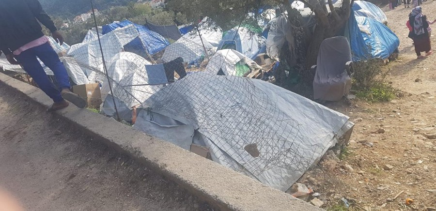
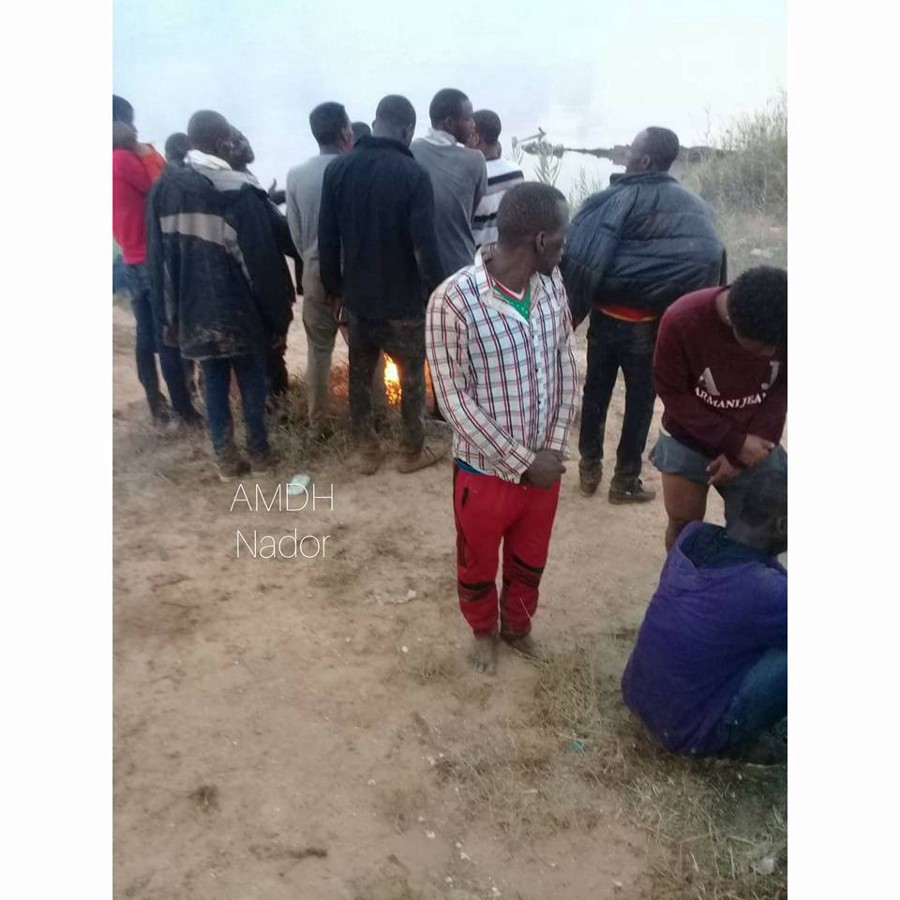
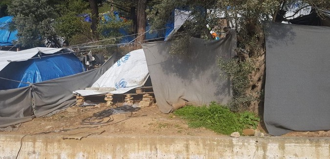
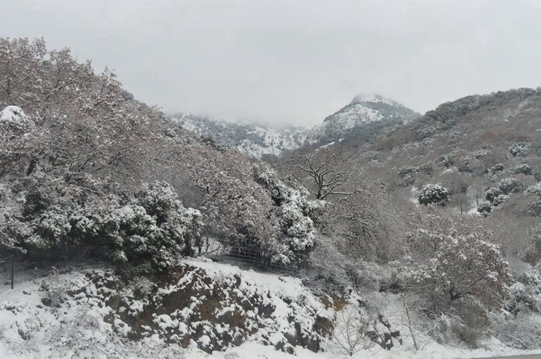
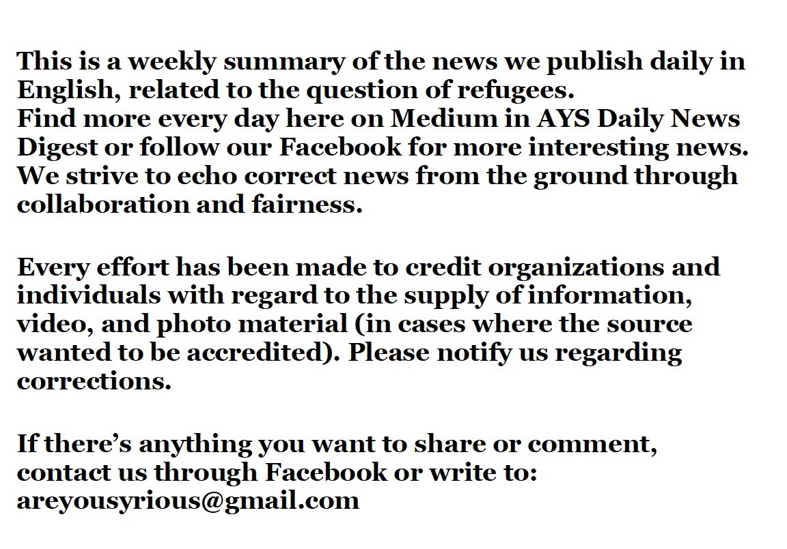

### ازدحام جمعیت در مرکزها و زندان‌های پناهندگی
#### AYS Weekly News Summary in Persian, February 25–March 3

Aegean Boat Report
### **دادگاه اروپایی**
#### **حکم دادگاه اروپا علیه اقدام بازداشت کودکان**

تعدادی از موارد نقض حقوق بشر در عمل نوجوانان پناهنده بدون همراهی که در شرایط تحقیر آمیز در پاسگاه‌های پلیس یونان بازداشت شده‌اند ، یافت می‌شود \. حکم دادگاه اروپایی حقوق بشر در مورد ه\.آ و سایرین \. در میان چیزهای دیگر، یونان اظهار داشت

> _· کشورهای عضو اتحادیه اروپا ملزم هستند که شرایط ، روش‌ها و اطلاعات را برای کودکان فراهم کنند تا دسترسی موثر به حقوقشان داشته باشند \._ 

> _· فرزندان بدون همراه و تنها در شناسایی و ثبت‌نام سریع در یک روش خاص کودک اولویت دارند \._ 

> _· کودکان و نوجوانان باید آزادانه به یک نماینده قانونی واجد شرایط دسترسی داشته باشند_ 

> _· در موارد بسیار نادر قرار گرفتن در یک بازداشتگاه به عنوان معیاری برای آخرین راه و برای کوتاه‌ترین زمان مناسب، همچنین باید به آموزش نظارت شده مرتبط باشد که باید فورا ً آن را دنبال کند_ 

> _· دولت باید اطمینان حاصل کند که کودک به طور کامل دلایل بازداشت را بداند که ضرورتا ً به انتصاب یک نگهبان صلاحیت دار، کمک از نماینده قانونی و ترجمه نیاز دارد_ 

دادگاه اروپایی حقوق بشر این هفته، فرانسه را به خاطر رفتار تحقیر آمیز علیه یک افغانی ۱۲ ساله که شش ماه را در جنگل کاله ،بدون پشتیبانی خدمات اجتماعی سپری کرده بود محکوم کرد \. اطلاعات بیشتری در مورد این به زبان انگلیسی در اخبارهای اخیر پیدا کنید

### **مراکش**
#### مقامات، محموله‌های مهاجران را متوقف کردند

دو گروه از مردم جنوب ساحاران، توسط پلیس در شهر ساحلی آرکمانه متوقف شدند

یک گروه ۳۰ نفر و دیگری ۴۰ نفر بودند
### **اردن**

نخست‌وزیر اردنی , عثامه التکریتی , به سیاستمداران اروپایی هشدار داد که شرایط متفاوتی دارند \. در حال حاضر ما وارد مرحله جدیدی از بحران سوریه هستیم , با این حال , این تاثیر همچنان ادامه دارد

به طور رسمی , تنها در حدود 10000 هزار پناهنده از مجموع 103 میلیون نفر در اردن , از زمانی که دو کشور در اکتبر گذشته گذرگاه حیاتی فرامرزی — جابر را افتتاح کردند , باقی مانده‌اند

شما می‌توانید در اینجا بیشتر در مورد وضعیت پناهندگان سوری در اردن بدانید
### **اتحادیه اروپا**

طبق داده‌های ارائه‌شده توسط سازمان آی\.ا\.ام ، ۸۹۵۰ نفر تا ۲۴ فوریه وارد اروپا شده‌اند\. دویست و بیست و سه نفر این سفر را به پایان نرساندند و در دریا جان سپردند

همین سازمان‌ها گزارشی درباره جابجایی منتشر کردند مبنی بر اینکه ۱۴۴۱۶۶ تازه‌ وارد در اروپا بین ژانویه تا دسامبر ۲۰۱۸ ثبت‌ نام کرده‌اند \. از این تعداد ۹۶ درصد افرادی بودند که در حال فرار از جنگ‌هایی در سوریه ، افغانستان ، عراق ، یا اوضاع وخیم تونس و مراکش بودند

گزارش مشابه نشان می‌دهد که در سال گذشته بیش از ۲۰۰،۰۰۰ نفر در ایتالیا ، یونان ، شمال مقدونیه ، صربستان ، کرواسی ، بوسنی و هرزگوین ، بلغارستان ، قبرس، کوزوو و رومانی مقدار قابل‌توجهی وارد شده اند \. ۱۱۶۶ در مقابل ۲۳،۸۴۸ و مونته نگرو ۸۰۷ در مقابل ۴۶۴۵ در سال ۲۰۱۷ و ۲۰۱۸
### **جزایر یونانی**
#### هیچ تغییری در جزایر یونانی رخ نداده است

علی‌رغم ادعاهای مداوم دولت یونان و مقامات اتحادیه اروپا ، و در حالی که هنوز اظهارات شرم‌آور نخست‌وزیر یونانی الکسیس تسیپراس را به خاطر می‌آورد که به شرایط زندگی پناهندگان در این جزایر می‌بالد ، به نظر می‌رسد هیچ چیز تغییری در آنجا رخ نداده است

براساس آمار ملی ، مردم هنوز در این جزایر به سر می‌برند : ۷۲۵۲ در لیسووس ، ۱۷۴۱ در چیوس ، ۴۲۹۴ در جزیره ساموس ، ۱۱۷۳ بر روی لروس ، ۹۹۵ نفر در کوس و ۷۲ نفر در جزایر دیگر

ما یاد گرفتیم که به چنین آماری اعتماد کنیم ، به خصوص در ۲۵ فوریه — آن‌ها هنوز اظهار کرده‌اند که هیچ‌کس در کمپ‌های موقت زندگی نمی‌کند

Aegean Boat Report Photos

روز یکشنبه در لیسووس برف می‌بارید و هنوز حدود ۷۰۰۰ نفر در شرایط غیر انسانی زندگی می‌کنند

در حالی که دولت ۴۲۹۴ نفر در جزیره ساموس را شمارش می‌کنند، ABR اطلاع می‌دهند که این احتمال وجود دارد که بیش از ۵۰۰۰ نفر در جزیره زندگی کنند و بیش از ۱۰۰۰ کودک بدون دسترسی به تحصیلات رسمی یا خدمات پایه زندگی کنند
### **فرانسه**

پاریس برای بسیاری از مردم دشوار است \. نه تنها مردان نمی‌توانند در خیابان‌ها بخوابند ، حتی خانواده‌هایی که توسط دولت فرانسه در شهر پایتخت رها شده‌اند هم در شرایط بسیار سختی هستند\. گزارشی از خانواده ای با بچه های خردسال ، مقامات وزارت دفاع اعلام کردند که شش قایق مجهز به گارد ساحلی لیبی را به مدت ۳ سال در لیبی گذراندند و به سواحل ما رسیدند\. در همان زمان وزارت دفاع اعلام کرد که شش قایق مجهز به گارد ساحلی لیبی را که به خاطر برگرداندن و نیز رفتارهای غیر انسانی با مردم که در حال فرار هستند، اعزام خواهد کرد\. ایتالیا نیز چهار قایق برای خود خواهد فرستاد

### **آلمان**

یک زن اهل افغانستان که در بازداشت به سر می‌برد باید به بیمارستان منتقل شود و رفتار غیر انسانی با او شده است \. در طول یک هفته اقامت در بیمارستان , این زن افغانی — بیست و چهار ساله افغانی به طور دائم توسط دو افسر امنیتی محافظت می‌شد

افزون بر آن, بنا به گفته وکیل او , پیتر تمپلتون , او به مدت سه روز و شب با یک غذا به بس‌تر بیمارستان بسته شده‌بود \. او از شرایط قرون‌وسطایی سخن می‌گوید

> افزون بر آن , دادگاه منطقه‌ای، اکنون حکم داده‌است که بازداشت او کاملا غیرقانونی است 

_Converted [Medium Post](https://medium.com/are-you-syrious/%D8%A7%D8%B2%D8%AF%D8%AD%D8%A7%D9%85-%D8%AC%D9%85%D8%B9%DB%8C%D8%AA-%D8%AF%D8%B1-%D9%85%D8%B1%DA%A9%D8%B2%D9%87%D8%A7-%D9%88-%D8%B2%D9%86%D8%AF%D8%A7%D9%86-%D9%87%D8%A7%DB%8C-%D9%BE%D9%86%D8%A7%D9%87%D9%86%D8%AF%DA%AF%DB%8C-f15b98efbd26) by [ZMediumToMarkdown](https://github.com/ZhgChgLi/ZMediumToMarkdown)._
