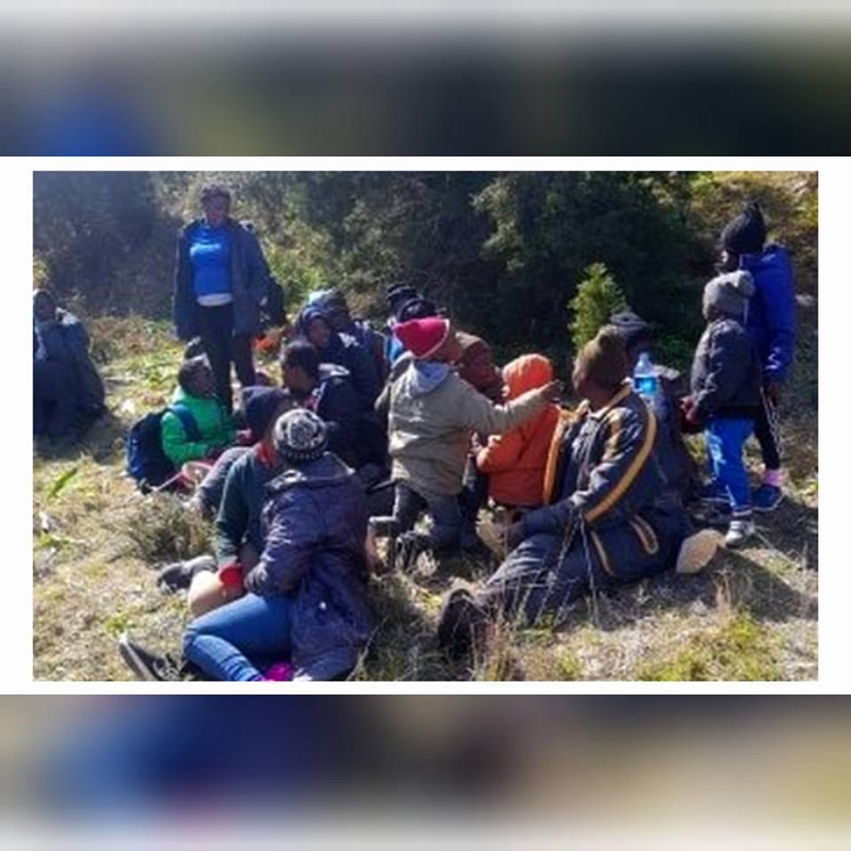
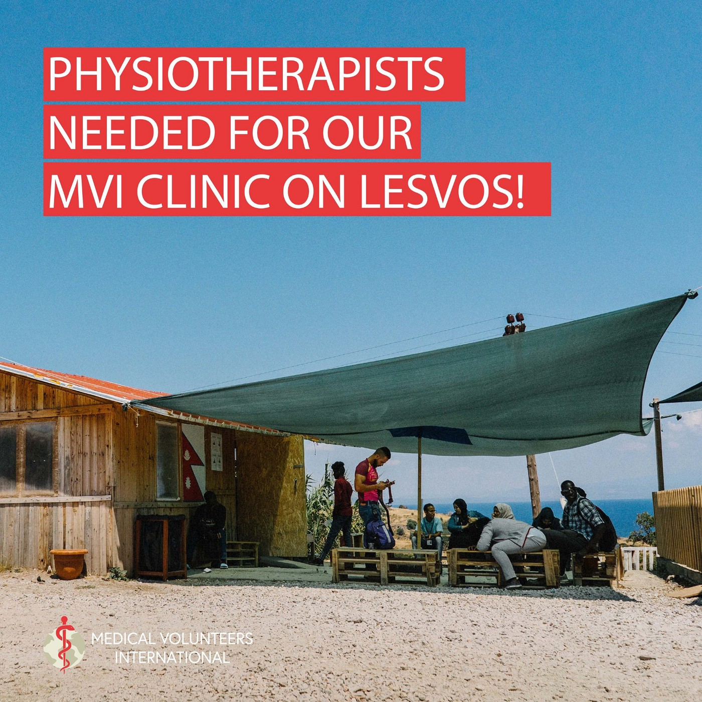
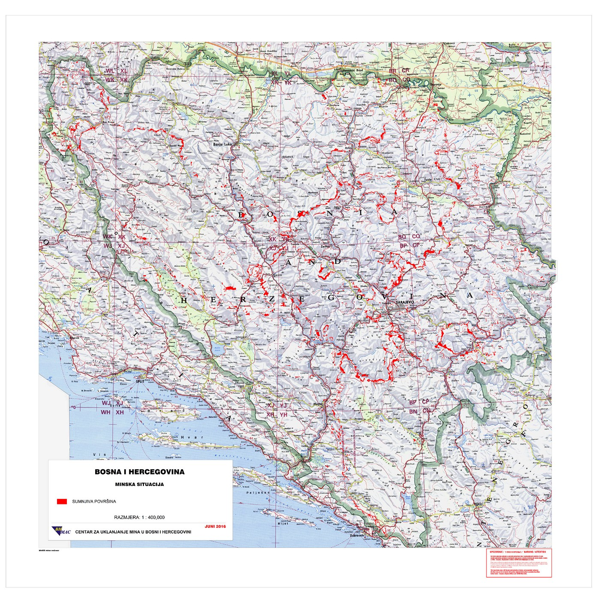
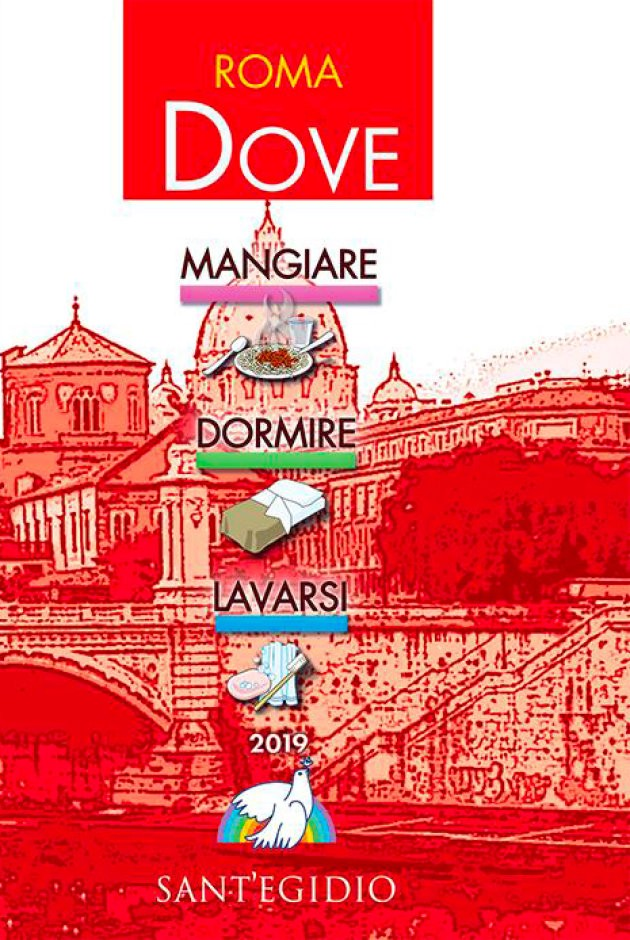
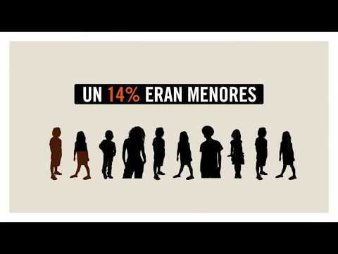
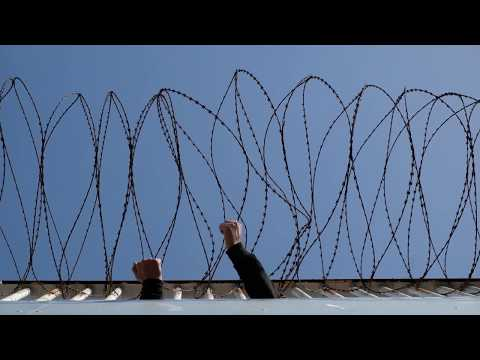

### AYS Daily Digest 5/3/19: Today’s Europe criminalizes human rights defenders — 20 years for saving human lives?
#### Real state of things in European countries contrary to created political climate / On the lack of protection for refugee and migrant children in Spain / Hunger strikes in France / Morocco: officials frisking minors in Nador and engaging in push backs to Casablanca / Aid is needed across the continent, join some of the initiatives / More news

](assets/587e177edbcf/1*hsPGtAkzqpKPOnrY9MFZFA.jpeg)

Photo by: [Watch The Med — Alarmphone](https://www.facebook.com/watchthemed.alarmphone/?__xts__%5B0%5D=68.ARAcd0p4JvOKz54M52nboDgA2kn0b27fUH-nY8Hn655AXD-sLkbEJc9RboTknDS8aY7mQJBO7r3DF07gm46d7bHxQ9aBo_22s4MgCoiG4wys1Ac-Egeh56i00SvVwwkvk0PaRT_rn8Fwp3TI5oI9gEhsskWE57jkkqGVwhihai77FWvy2i4WAa_cgIZZFRg9W3uc2Gep__quQzjy2ZMKpaCvVi4pwWLZDsFvvFz8VvC35BBE3wnU02O2c0lBM8PLg_lV7TZ_u9hXQLwIhJxQ6XLS8EbdJV1TPLNv2pHzW6f9r8baeikSqsw3QU4uLKx7v85Pmj1l6sxaLOMKCjvm4yOLnkJXBBgJgVJvRcY0Ge3HDLGCJLC8efi4mf9P_c63iR5Cc2PVkYDIgxJHAAOOWGmwElciJ8-z7k40IzJDEFyp6AF43y5sCvFxG322r_SgiM4YErrTWkCs6RpiMhhGBy4U1W8CqQ6kTTGAeQTsSP6DzxOpSU17LYaAUg&__tn__=k%2AF&tn-str=k%2AF)
#### FEATURE — “I went to save lives and I could see myself twenty years behind bars”

A Spanish firefighter Miguel Roldan participated in a solidarity mission in the Mediterranean in 2017\. Now, Italy is accusing him of the crime of human trafficking\. He faces legal proceedings in Italy on charges that could warrant him up to twenty years in prison for saving migrants on the IUVENTA ship of the German NGO Jugend Rettet, which we’ve previously reported about many times\.

“For the mere fact of removing a person from the water and taking them to a ship they have accused us,” Roldán said to the [Spanish media](https://www.diariodesevilla.es/sevilla/bombero-Sevilla-carcel-rescate-inmigrantes_0_1332167006.html) \. “Everything is kept under wraps and we do not know what we have done wrong, but to come out with this a year later seems strange\.”

He was a part of the previously registered group of volunteers whose mission was to save those in danger from the waters — and he did so during his vacation, reportedly feeling proud “because they rescued many people\.” Dangerous situations occurred regularly, for the people being rescued but also for Miguel and his colleagues\. While Miguel continues to work as a firefighter, he awaits for the mysterious Italian court action to show its real face and to see how the justice system and society sees humanitarian workers, volunteers extending humanity to other humans\.

The kind of people that used to get streets named after them are branded criminals in today’s Europe\.
#### NIGER

African countries are taking on the lion’s share of the refugee crisis on behalf of Europe, welcoming returned Libyan asylum seekers \(people previously staying in Libyan detention centres\) who have been waiting for their asylum requests to be answered by the EU for more than a year now\.

> “We left our country to find peace and freedom, but we never get durable solution by the UN Refugees agency\. Why EU resettlement promises are not respected?” 

They protested against this situation and ongoing practice and, reportedly, when they tried to reach the American and French embassies to deliver their call, tear gas was used against the protesters\.

■■■■■■■■■■■■■■ 
> **[Sara Creta](https://twitter.com/saracreta) @ Twitter Says:** 

> > #Niger refugees ask justice
One of the poorest countries in the world has accepted to host temporarily refugees evacuated from #Libya while while EU countries process their asylum cases. Refugees from #Eritrea #Somalia #Sudan &amp; #Ethiopia have been waiting for more than 1 year now https://t.co/sS5YfXIydX 

> **Tweeted at [2019-03-05 11:19:36](https://twitter.com/saracreta/status/1102891407419887621).** 

■■■■■■■■■■■■■■ 

■■■■■■■■■■■■■■ 
> **[Sally Hayden](https://twitter.com/sallyhayd) @ Twitter Says:** 

> > Refugees who were evacuated from Libya to Niger more than a year ago, &amp; are still waiting for resettlement to other countries, say police used tear gas to disperse their protest today. https://t.co/4UZTpQbMBp 

> **Tweeted at [2019-03-05 09:47:59](https://twitter.com/sallyhayd/status/1102868349401350144).** 

■■■■■■■■■■■■■■ 

■■■■■■■■■■■■■■ 
> **[Sara Creta](https://twitter.com/saracreta) @ Twitter Says:** 

> > ⬇ ⬇ Refugees in #Niger prepared this letter asking for solutions. Men, women and children who have survived from Libya are now kept in limbo without being able to start their lives. Why EU countries like #France, #Germany or #Sweden are not respecting their agreement? https://t.co/aA3omW3MML 

> **Tweeted at [2019-03-05 11:20:41](https://twitter.com/saracreta/status/1102891676664717314).** 

■■■■■■■■■■■■■■ 

■■■■■■■■■■■■■■ 
> **[Sally Hayden](https://twitter.com/sallyhayd) @ Twitter Says:** 

> > More footage of police, who seem to have arrived to break up the refugee protest in Niamey. I'm being told by attendees that two women and one man were arrested. https://t.co/cNK1QZJCnZ 

> **Tweeted at [2019-03-05 10:43:55](https://twitter.com/sallyhayd/status/1102882425187774464).** 

■■■■■■■■■■■■■■ 

#### MOROCCO

The number of departures from Morocco has increased five\-fold\. Most of the migrants taking this route last year came from sub\-Saharan countries, but the number of Moroccan nationals attempting to reach Europe also increased significantly\.
### Who gave the order to harass unaccompanied minors?

[Association Marocaine des Droits Humains — Section Nador](https://www.facebook.com/AmdhNador/?__tn__=%2CdkCH-R-R&eid=ARDX9CydrJSePMwTTh0MOHox37wbc1INtfbdY2vyigC2FjDomtPeCraAssbwMsb2mWw_sGqi6L3RPg9K&hc_ref=ARRKrz2Epl8irI2NjOdxaywv8OpYks6iiZ7CAw8oICSjmDzChPWUAXXpu0yYQGJ4OIY&fref=nf&hc_location=group) reports that it’s been a week that the authorities of Nador \(Police, auxiliary forces and authorities\) have been chasing and stopping dozens of Moroccan unaccompanied minors in Nador and Beni Ensar\.

“They stop them, not to offer them the protection, aid and necessary assistance, but simply to insult them and ‘push \(them\) back’ to Casablanca, even if their families do not reside in the city\.”

When [Association Marocaine des Droits Humains](https://www.facebook.com/AmdhNador/?__tn__=%2CdkCH-R-R&eid=ARDX9CydrJSePMwTTh0MOHox37wbc1INtfbdY2vyigC2FjDomtPeCraAssbwMsb2mWw_sGqi6L3RPg9K&hc_ref=ARRKrz2Epl8irI2NjOdxaywv8OpYks6iiZ7CAw8oICSjmDzChPWUAXXpu0yYQGJ4OIY&fref=nf&hc_location=group) protested in front of a police commissioner who was stopping minors by saying he had no right to stop and repress Moroccan minors who are in a Moroccan city, he reportedly responded: “Those are the instructions\.”

About 58 Sub Saharan migrants, among them women and children, were arrested at the beach of Temsamane \(60 km west of Nador\) this Monday, [Association Marocaine des Droits Humains](https://www.facebook.com/AmdhNador/?__tn__=%2CdkCH-R-R&eid=ARDX9CydrJSePMwTTh0MOHox37wbc1INtfbdY2vyigC2FjDomtPeCraAssbwMsb2mWw_sGqi6L3RPg9K&hc_ref=ARRKrz2Epl8irI2NjOdxaywv8OpYks6iiZ7CAw8oICSjmDzChPWUAXXpu0yYQGJ4OIY&fref=nf&hc_location=group) reports\. 
A pregnant woman from the group, who is very close to giving birth, was transported to the hospital of Driouch\.
#### SEA

> Today, we remember the 414 migrants who lost their lives crossing borders in the first two months of 2019\. These numbers are certainly underestimates, failing to account for the loss of life of hundreds of people\. 

](assets/587e177edbcf/1*WvGvzlO4Licf_sOt1eBX5w.png)

[Missing Migrants Project](https://www.facebook.com/MissingMigrants/?tn-str=k%2AF&hc_location=group_dialog)

Deaths on the three main Mediterranean Sea routes through almost seven weeks of the new year have reached 223 individuals — or about half the 437 deaths that occurred during the same period in 2018, IOM reports\.

The Frontex report _Risk Analysis for 2019_ presents various indicators related to the EU’s external borders and migration in 2018\. These include:
- 190 930 refusals of entry \(up 4%\)
- 148 121 effective returns by member states \(down 5%\)
- 13 728 returns coordinated or organised by Frontex \(down 3%\)
- 10 642 detections of people smugglers/facilitators \(up 4%\)

In the midst of a political climate that increasingly aims to manufacture panic and compel EU citizens to close themselves off against a nonexistent surge of migrants reaching their shores, even Frontex reports that “in 2018, the number of detections of illegal border crossings reached its lowest level in five years\.”
We have spread the most salient facts regarding the migration flow across the various country topics in this digest, and you can find the full report [**here**](https://frontex.europa.eu/assets/Publications/Risk_Analysis/Risk_Analysis/Risk_Analysis_for_2019.pdf) \.
#### GREECE
### Islands

The UNHCR has reported that the past week, 192 people arrived on the Aegean islands, a decrease from last week’s 803 arrivals and from last year’s 432 arrivals during the same period\.

According to their report, 15,000 refugees and migrants reside currently on the Aegean islands\. The majority are from Afghanistan \(45%\), Iraq \(13%\) and the State of Palestine \(9%\) \. Women account for 21% of the population and children for 32%, of whom more than 60 percent are younger than 12 years old\.

17% of the children are unaccompanied or separated from their families, mainly from Afghanistan\. Some 41% are men between 18 and 39 years old\.

](assets/587e177edbcf/1*7Xg0QL_cWgQdCSRg-7iDVA.jpeg)

Original UNHCR infographics available [**here\.**](https://data2.unhcr.org/en/documents/download/68240)
### Lesvos

[Medical Volunteers International e\.V\.](https://www.facebook.com/medicalvolunteersinternational/?tn-str=k%2AF&hc_location=group_dialog) are looking for medical professionals to join their team on Lesvos\.

> Are you a trained physiotherapist and looking for a volunteer opportunity in Greece? WE NEED YOU\! As we have so many new patients in our brand new massage and physio room in our clinic on Lesvos, we would love to see two patients at a time to cover the big need\. Therefor we are looking for physiotherapists joining us during March and from May onwards\.
 

> Fill in the application form on their website today and book your flight to the island tomorrow\. We are looking forward for you to join our team\.
 

> [https://medical\-volunteers\.org/contact/](https://medical-volunteers.org/contact/?fbclid=IwAR17fDTQYy8CSWzUjUbc6FzP9S4aXCfZd-nyUAmxh9MJinSeE0JFXbkb_Sc) 

### Samos

■■■■■■■■■■■■■■ 
> **[Marianna Karakoulaki](https://twitter.com/Faloulah) @ Twitter Says:** 

> > Latest: Greek Coast Guard transferred 40 #refugeesGR to the island of Samos after a rescue mission. There is no break down of ethnicities/gender yet. 

> **Tweeted at [2019-03-05 20:19:56](https://twitter.com/faloulah/status/1103027385937657857).** 

■■■■■■■■■■■■■■ 

479 people arrived on the island during the past month, making the total number of refugees staying on the island 4985\. According to these statistics, 22% of these people are female\. The team of [Glocal Roots](https://www.facebook.com/GlocalRoots/?__tn__=%2CdkCH-R-R&eid=ARCSqNTNIefcC_ln2QBScRIkwrB_1lIAVDQvvuOgo7SvOW5FLy-lYHwSmIUOtzEdxiCpD3doCU1c00mz&hc_ref=ARS3wSKNrafeOFhHyrGtvd46KrnO8UF15fn9UCwcg1PZBZlmr80u2IX7mvAJQ5XdK98&fref=nf) is preparing a special space dedicated to them, which they are “hopeful to open before the end of the month\! Information on how you can support our new centre will follow shortly\!”

> Here we will welcome women to get away from the camp, sip a chai, participate in our «We Are One» program \(a support program for refugee women\) and take a moment to nurture themselves\. 

### Entrepreneurship consulting for refugees and migrants

In March 2019, a new action by Generation 2\.0 RED will begin, providing counseling to people of migrant origin interested in the creation of a business or social enterprise\. With the appropriate guidance from a business consultant, you can develop your own business idea, draw up the plan you need, and organise your steps towards its implementation\.

If you want to make an appointment with the business consultant, please send us an email \( **k\.kapnisi@g2red\.org** \) with your name, phone number and language in which you may need interpretation, with a few words about your specific request\.
#### Learning while waiting…

An accomplishment achieved through shared work — here’s something from the [Second Tree](https://www.facebook.com/SecondTree/?tn-str=k%2AF) team:

### Athens

**Collective kitchen for financial support for Ebuka’s family will be organised this Saturday at 13h, address: Tsamadou 15 \(garden\), Exarcheia**

> On February the 8th Ebuka, an immigrant from Nigeria, lost his life under uncertain circumstances at the Omonoia police station, after being taken in\. The police station kept his death a secret from his family for 3 whole days\. This fact is undeniable proof that the police is trying since the first moment to conceal the true causes, that led to Ebuka’s death\.
 

>  His wife is left alone with two little children, 5 years old and 6 years old\. The mother and her two children need our support, since our family has been left without income\. We stand by their side for as long as it’s needed\. As a first step, we’re organizing on Saturday 9th of March a collective kitchen, the incomes of which will be given to them\. 
 

>  Aside from the dark and the wilderness, the people of resistance and solidarity is sending a strong message\. Nobody is alone\. These people, our people, need to live with dignity\. To these kids, and to this woman we owe a better world\. A world with freedom, social justice and equal rights for all people\. For this kind of world we will never stop fighting, solidarity is our weapon, our most valued weapon\.
 

>  Justice for Ebuka\. His family is not alone\. 

[Elpída Home](https://www.facebook.com/elpidahome/?__tn__=%2CdkCH-R-R&eid=ARA1S--Usn9G9GiXrBYzXwXX5GFIOZnT5BjHqXpM4drYJZTX3j8ijHX_zAlw3uLvhN6rXMmVfKLD67a5&hc_ref=ARTJSBF7cMX9L5LB_ZCnQ77fUGI3B5aw3UZRSZt7CuaHdW8ruGYCxSX0kT-TIV7yKE8&fref=nf) announces the beginning of group sessions starting with a **psychological first aid training & support group** for the LGBTQIA\+ community starting **Thursday 14th March from 15:30–16:30** \.

[Kofinou We Care — Volunteers’ Support](https://www.facebook.com/kofinou/?__tn__=%2CdkCH-R-R&eid=ARCiIi0sjJPXWWrWe83p2IjHZKaVnBBEcYy4JWmo3ckNaHzKyaXSiA2JE3FOz8Rrrz829W2wzM8Y_1Ly&hc_ref=ARRQYA0dV6hH2kFCwEDjQMDTPdoru997k2nddU6ULbcMsdzu5xOnfINdC_F6ZHSBtyw&fref=nf) needs support:
There is a great lack of infant clothes and other basic needs\.
We are gathering:
**\- Baby clothes** \(0 to 3 months\)
\- **Carrycots** \(for the new mothers to use when they leave the hospital\)
\- **Baby Strollers** \(for new\-borns\)
\- **Playpens** \(they use playpens as beds since the rooms are very small and they cannot have both\)
Contact them for more info or to donate\.
#### BALKAN WEATHER for March 6

MONTENEGRO

Lightly to moderately cloudy with longer sunny intervals\. Wind blowing from the south weak to moderate during the day and amplified during the night\. Lowest temperatures from \-2 to 9 and highest daily from 8 to 19 degrees\.

SERBIA

Predominantly sunny with fog in low\-lying areas and alongside the rivers in the morning\. In the far east and in the southeast moderately cloudy with chances of rain\. Wind weak to moderate from the west and northwest, in the afternoon from the south and southeast\. Lowest temperatures from 0 to 6 and highest daily from 14 to 18 degrees\.

BiH

Moderately cloudy in Bosnia, with a gradual decrease in clouds as the day progresses\. Predominantly sunny in Herzegovina\. Wind weak to moderate blowing from the south\. Lowest temperatures from 0 to 7 and highest daily from 12 to 19 degrees\.

CROATIA

Mostly dry and sunny and warmer during the day\. Locally fog in the morning and increasingly cloudy in the evening\. Wind moderate from the southwest, possibly with stormy gusts towards the evening\. Alongside the coast a moderate southern wind, with strong wind in the afternoon but especially later in the evening\. Lowest temperatures from \-1 to 7 and highest daily from 14 to 18 degrees\.
#### BOSNIA AND HERZEGOVINA
### Tightening border control

The Ministry of Security of Bosnia and Herzegovina plans to deploy Hungarian border forces on the border with Serbia and Montenegro “in order to strengthen control and prevent announced plight of migrants” \(sic\! \), Serbian [media](https://www.blic.rs/vesti/republika-srpska/veca-kontrola-ulaska-migranata-na-granici-bih-prema-srbiji-i-crnoj-gori-u-ispomoc/njg20h5?fbclid=IwAR0Rk_ADS0MJdA-Zwc5jFzgrpBOPUx8tfjVz6OCzGqfLruCC4XWiWzOFtWg) have reported\.

The minister has said the Hungarians won’t have the authority of border police of Bosnia and Herzegovina, nor will they carry guns, but “they will perform monitoring of the border, which would contribute to better control and stop migrants from illegal crossing\.”
### Beware of mine fields\!

A reminder to all people on the move — Bosnia and Herzegovina is still one of the most mine\-contaminated countries in the Southeast Europe region\. Pay attention and stay safe\.

### Need for aid and support in border areas of Bosnia

Experienced volunteers are needed to help locals providing aid to people on the move in the area of Velika Kladuša and Tuzla\. The situation there is highly specific and the need for help differs from month to month as it changes, but help is always needed\. If you are willing to help and commit for a week or more, please contact us to put you in touch with those who can give you detailed information on the situation and what can be done\.

An [International team](https://www.facebook.com/aidbrigade/?__tn__=%2CdkCH-R-R&eid=ARDvvOxaPIe7HXYy6J8Xle1ExmsevI0jwb7WaMu1wKamBbXlW_g2LjA6jRWgZ9AdUIL9ESsUt9OwNrnQ&hc_ref=ARSrD3ZY9VgwjvPiQzbKswfwCqnI6vj1BTpBykxMFg6XOH_zhNKs0YF6Cr6jfadI3Ug&fref=nf) of volunteers currently present in Ušivak refugee camp in Sarajevo, where around 700 people are staying, is also calling for volunteers to join their already formed groups\. “We provide daily activities such as sports, arts, games and cinema for all as well as special activities for women and children\. We also assist with hygiene and clothes distributions\. People are often transiting fast, so we can provide the stuff they most desperately need and add a little bit of relief before people try to cross the dangerous Croatian border\.”
#### ITALY

See [UNHCR’s Italy weekly snapshot — 03 Mar 2019](http://Dead and missing in 2019 - Central Med) , containing the documented number of arrivals, average daily arrivals in March 2019 so far, and the number of dead and missing in 2019 in the Central Mediterranean\.
### Rome

Salvini’s security degree and the lack of reception or sensibility from the side of the Roman mayor have made it even more difficult for many homeless people in the capital, the Globalist [reports](https://www.globalist.it/news/2019/03/05/effetto-raggi-salvini-rifugiati-costretti-a-dormire-sul-greto-del-tevere-in-centro-2038281.html?fbclid=IwAR1eg9xlLzDKriX_OrRVdp-sRe_8X2M0GXNyfe1tYefQDxGo4g7tDKo0WCc) , documenting more and more people sleeping on the banks of the Tiber in the city, which could easily drown them one of these days if the water rises…

> All this after the events of the last few months when many poor and abandoned people have died of cold\. 
 

> What to say? These things happen in the capital, while the only ones who are ending up being criminalized are those who try to help the least ones\. 

Help by and for those who practice solidarity is in the heart of the 29th edition of the [Guide for the city of Rome: Where to eat / sleep / wash](https://www.santegidio.org/pageID/30144/langID/en/Where-the-Guides.html) , edited by the Sant’Egidio Community\.

A guide was recently published with the intention of trying to provide information for the many problems that homeless people experience, offering some solutions and addresses: where to eat, sleep, wash, get care; orientation centers, reception centers; very useful social and personal services; health care, judicial offices, work, training, retirement, housing\. This is information that unfortunately proves equally useful for those refugees and asylum seekers caught in the jaws of the asylum system\(s\) and affected by the recent Salvini decree\.

> Thinking of improving your language skills? 
 

> If you live in the Rome area and hold a valid Italian permesso di soggiorno, the Social Network project might be a good option for you: 

Read more [**here**](https://www.facebook.com/groups/540605839646145/permalink/753686885004705/) \.
#### FRANCE
### Dunkirk

It is estimated there are around 500 displaced people currently living in the Dunkirk area\. The emergency centre continues to operate at maximum capacity, meaning the number of people camping outside its doors has continued to grow, [Mobile Refugee Support](https://www.facebook.com/MobileRefugeeSupport/?__tn__=%2CdkCH-R-R&eid=ARDcJfLwKy5z3YBL9iCuhdY1eiyJhfqlX9a7Kf33QuTDUQ--u4C-fwVWl4w0f808XVtbl9pa0BMI9SlW&hc_ref=ARS_D-36BAmoyusbAaCfEyhysmRzf54M8ylr8bmoHcQl9MXE3Mguu9tX8vs6NR19fGQ&hc_location=group) reports\.
“Over 200 people currently reside in tents outside the centre, with nearly 100 more in smaller camps scattered throughout the surrounding woodland\. Although those living inside are protected from the elements, they still rely on independent organisations for almost all basic essentials\.” Support their efforts if you can\.

](assets/587e177edbcf/1*azg8DwnY0JRytp_0XVQ9Mw.jpeg)

Photo: [Mobile Refugee Support](https://www.facebook.com/MobileRefugeeSupport/?tn-str=k%2AF&hc_location=group_dialog)
### Lyon

On Friday and Saturday, the detainees of the CRA of Lyon St\-Exupéry went on a hunger strike to protest against the CRA system, the poor conditions of detention centres, and the police repression they experience on a daily basis\.

As we’ve reported previously, precarious conditions across the country have led many to protest and demand that their rights be respected in all regards\.

Please, take time to see what their realities are and what they are demanding and share this with your French friends so thatthey too can put pressure on those responsible\.

#### SPAIN

The Western Mediterranean became the most frequently used route into Europe\. The pressure on Spain has been rising over the last years, and the number of detections in 2018 reached 57 034, double the number from 2017\.
### Los mas solos

Faced with the growing number of young migrants who prefer to live on the streets or in parks rather than return to the official centers that house unaccompanied minors, as well as a rash of suicides and instances of sexual abuse, Save the Children proposes concrete solutions for a system that is failing refugee children everywhere in their in a new report titled “Los mas solos\.”Read the report [**here**](https://www.savethechildren.es/los-mas-solos) \.

In a recent report, UNICEF also identified several problems, including:
- the lack of mediators who know the language of those residing in the reception centers
• the lack of legal assistance
• cases of abuse
• the presence of only one psychologist on average for every 600 minors 
• difficulties in accessing the educational system
• limitations often revealed in juvenile court supervision, especially in determining the age of the minors\.

**We strive to echo correct news from the ground through collaboration and fairness\.**

**Apart from daily news in English, we also publish weekly summaries in [Arabic](%D8%A7%D9%84%D9%85%D8%AE%D9%8A%D9%85%D8%A7%D8%AA-%D8%A7%D9%84%D9%85%D9%83%D8%AA%D8%B8%D8%A9-%D9%88%D8%A7%D9%84%D8%B9%D8%AF%D9%8A%D8%AF-%D9%85%D9%86-%D9%85%D8%B1%D8%A7%D9%83%D8%B2-%D8%A7%D9%84%D8%A7%D8%AD%D8%AA%D8%AC%D8%A7%D8%B2-9f7b7169811b) and [Persian](%D8%A7%D8%B2%D8%AF%D8%AD%D8%A7%D9%85-%D8%AC%D9%85%D8%B9%DB%8C%D8%AA-%D8%AF%D8%B1-%D9%85%D8%B1%DA%A9%D8%B2%D9%87%D8%A7-%D9%88-%D8%B2%D9%86%D8%AF%D8%A7%D9%86-%D9%87%D8%A7%DB%8C-%D9%BE%D9%86%D8%A7%D9%87%D9%86%D8%AF%DA%AF%DB%8C-f15b98efbd26) \. Click on those links to check out the ones from the week February 25 to March 3\.**

**Every effort has been made to credit organizations and individuals with regard to the supply of information, video, and photo material \(in cases where the source wanted to be accredited\) \. Please notify us regarding corrections\.**

**If there’s anything you want to share or comment, contact us through Facebook or write to: areyousyrious@gmail\.com**

_Converted [Medium Post](https://medium.com/are-you-syrious/ays-daily-digest-5-3-19-todays-europe-criminalizes-human-rights-defenders-20-years-for-saving-587e177edbcf) by [ZMediumToMarkdown](https://github.com/ZhgChgLi/ZMediumToMarkdown)._
