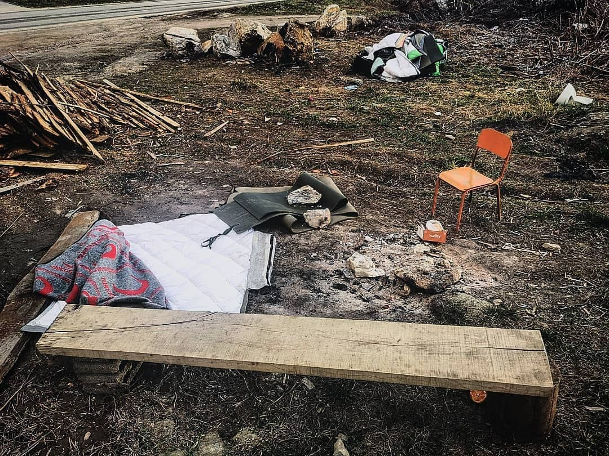
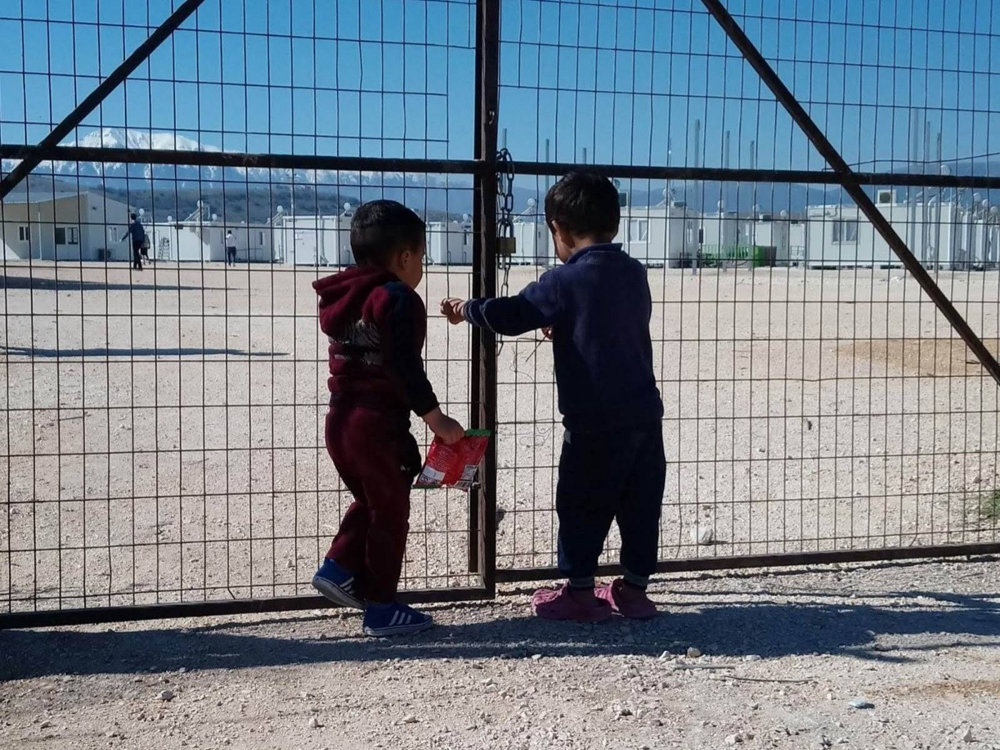
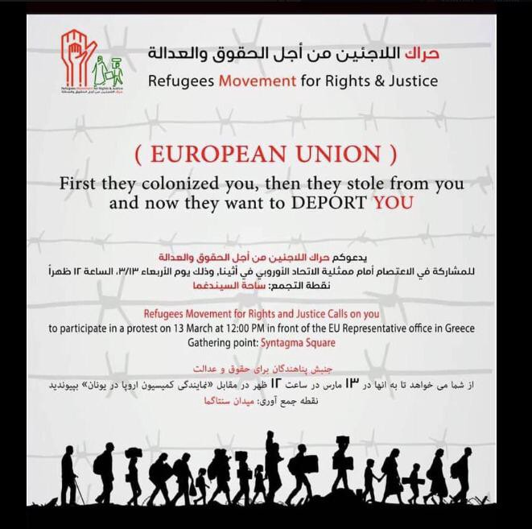
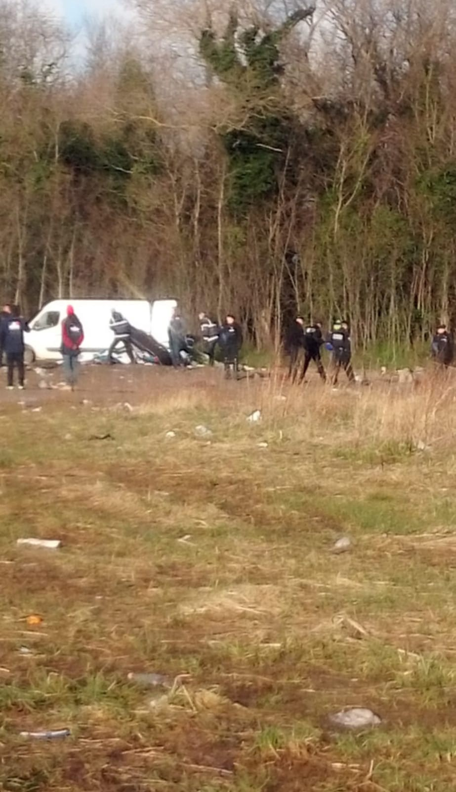

### AYS Daily Digest 6/03/19: Ten key failures of the EU

_What others call failure, is achievement for the EU // Only 1\.4 percent of Syrian refugees are enrolled in secondary schools in Lebanon // First border crossing opened between Turkey and Syria // Eviction in San Bernardino camp // Daily evictions in Calais // Bosnian police illegally restrict freedom of movement of potential asylum seekers_

The place where the law does not exist, illigal check point in Kljuc, made by the local police, with the aim to prevent people on the move from traveling to the north of the country and fiurther on toward the EU\. Photo by Clowns Withouth Borders, USA\.
### Feature: Ten Key failures

On Wednesday, the European Commission released a statement, praising the “efforts” of the European Agenda on Migration\. The EU “needs to sustain the progress made over the past four years,” it says\.

In fact, this is the [progress of](https://www.robert-schuman.eu/en/european-issues/0472-european-union-african-cooperation-the-externalisation-of-europe-s-migration-policies) [externalizing](https://reliefweb.int/report/world/expanding-fortress-policies-profiteers-and-people-shaped-eus-border-externalisation) [borders](https://www.researchgate.net/publication/324780431_The_Externalization_of_European_Borders) and [humanitarian aid](ays-special-about-turkey-between-caution-and-intransparency-f8bb8cb0dd) , pretending that \( [financial](https://www.theguardian.com/world/2018/jun/08/un-accuses-libyan-linked-to-eu-funded-coastguard-of-people-trafficking) \) [support](https://www.infomigrants.net/en/post/15395/italy-strengthens-libya-accord-another-four-patrol-boats) to [countries which do not respect human rights](https://reliefweb.int/report/libya/desperate-and-dangerous-report-human-rights-situation-migrants-and-refugees-libya) and use the support for military reinforcement means supporting people in need\. In its [factsheet](https://ec.europa.eu/home-affairs/sites/homeaffairs/files/what-we-do/policies/european-agenda-migration/20190306_managing-migration-factsheet-step-change-migration-management-border-security-timeline_en.pdf) , the Commission lists ten key achievements, of which some are easy to tackle\. Here we go:
- **Irregular arrivals down** , but more people have drowned\. At a time when the world is seeing an increasing number of displaced people every year \(the biggest number since World War II\), the Commission is proud, that the number of people making it to Europe is at the lowest level in five years\.
- **Protecting migrants,** does not really need further explanation\. Is it really an achievement to say that the EU helped 37,000 \(in a non\-specified period of time\) to return from Libya \( \! \) to their home countries, while thousands end up in slavery, torture or die? Not to speak of the situation the people face after they return\. This is really about protection from migrants\.
- **Protecting our borders,** 10,000 border guards, yeah\. Unfortunately, some of them \(as well as police officers\) don’t really care much about international law\. See [Croatia,](https://www.theguardian.com/global-development/2018/nov/14/didnt-give-a-damn-refugees-film-croatian-police-brutality-bosnia) [Hungary,](https://www.independent.co.uk/news/world/europe/refugee-crisis-hungary-border-police-guards-fence-beating-asylum-seekers-migrants-serbia-push-back-a7610411.html) [Greece](https://www.theguardian.com/world/2018/dec/18/greek-police-accused-beating-migrants-trying-to-enter-from-turkey) , [France](https://www.politico.eu/article/migration-french-border-police-abuse-detain-migrants-before-sending-them-back-to-italy-oxfam/) , [Italy](https://www.politico.eu/article/migration-french-border-police-abuse-detain-migrants-before-sending-them-back-to-italy-oxfam/) and other countries\.
- **Integration,** costs money, yes\. €140 million was distributed between 2015 and 2017 through the Asylum, Migration and Integration Fund\. But tens of thousands of people are still living in Greece in dire conditions without access to proper support\. At the same time EU member countries are deporting well\-integrated people, separating families\.
- **Responsibility\-sharing** , what a great term\. 35,000 people were relocated from Greece and Italy to other EU countries\. Remember the [big announcement](http://europa.eu/rapid/press-release_STATEMENT-15-5664_en.htm) , that [160,000 people](http://europa.eu/rapid/press-release_IP-16-829_en.htm) will be relocated \(most of them within two years\)? No? That was in 2015\.
- **Saving lives,** according to their own account: 730,000 people since 2015 \(no further details given for the number\) \. We remember the 226 people, who are recorded as not having been saved in 2019 alone — and another [14,635 since 2015](http://missingmigrants.iom.int/region/mediterranean) \.
- **Fighting smugglers,** but supporting other criminals\.
- **Stepping up returns,** as if Afghanistan or Nigeria are safe countries\.
- **Safe and legal pathways,** vs\. border fences and the criminalization of sea rescue\. And 50,000 resettled vulnerable people is not such a high number\. In fact, it’s more than the 20,000 promised within two years from 2015 on\.
- **Solidarity abroad,** 5\.3 million vulnerable people benefited from basic support under the EU Emergency Trust Fund for Africa, says the Commission\. But: “More than 80 percent of the latter are migration management measures, backed up by military deployments to Libya and Niger,” says the [German Institute for International and Security Affairs](https://www.swp-berlin.org/en/publication/eu-trust-fund-for-africa/#en-d17371e1205) \.

However, the Commission states:

> But the fact that the number of irregular arrivals has been reduced is no guarantee for the future, considering the likely continuation of migratory pressure\. It is therefore essential to pursue a comprehensive approach to migration management and border protection\. 

Their proposed measures can be found [here](http://europa.eu/rapid/press-release_IP-19-1496_en.htm?fbclid=IwAR2YQzxpkfxGas5EwtVNH-dtiCESIvdAv-Q3M1QLJoUiKI-AxnBNRN4um9c) \.
### Lebanon

According to [Albawaba](https://www.albawaba.com/editorchoice/only-14-refugees-attend-secondary-school-lebanon-why-1261056?fbclid=IwAR34Qs0IrStzco6k5dfqNAtlwoylMjLhUTkgd-bXdqCJ7DxOJ2nyRrx2eGw) , only 1\.4 percent of eligible Syrian refugees are enrolled in secondary school\. Referring to the Abdulla al\-Ghurair Foundation for Education, [Albawaba](https://www.albawaba.com/editorchoice/only-14-refugees-attend-secondary-school-lebanon-why-1261056?fbclid=IwAR34Qs0IrStzco6k5dfqNAtlwoylMjLhUTkgd-bXdqCJ7DxOJ2nyRrx2eGw) says that funding is often directed to younger people\.
### Turkey

Turkey opened another border crossing with Syria, as Freedom of Choice [reports](https://www.facebook.com/freedomofchoicetso/posts/595601927609529) \. It is said to be the Kassab Crossing, which was closed in 2014\.

“Turkey has reopened two Syrian border crossing this week, marking the first time in several years that Ankara has made Syria’s Latakia and Aleppo governorates accessible to the public\.”
### Sea

The Mediterranea crew [announced](https://www.facebook.com/Mediterranearescue/photos/a.275129016441663/334979070456657/?type=3&theater) , that the team is ready for departure\. The Ionian Sea ship will leave for its mission on 13 March\.

Meanwhile, the Armed Forces of Malta \(AMF\) rescued 87 people off Lampedusa, the Times of Malta [reported](https://www.timesofmalta.com/articles/view/20190306/local/afm-rescues-87-migrants-bringing-them-to-malta.703733?fbclid=IwAR29We62h8k2GunlB9TKwhcYjjb6gZryt_InyaZZd3TM-AQt4PybuFk0Gi8) \.

The Sea Eye crew [arrived](https://sea-eye.org/alan-kurdi-erreicht-palma-de-mallorca/?fbclid=IwAR16M3On-ykrmAkOj-T2_lMuHFVd4UZ1GwV8ZM9nUVvESBsbXoIv3eslz4k) at Mallorca\. In its first mission the ship, named after Alan Kurdi, was not involved in any rescue operations\. In one case, they say they were cut off from the information flow when a boat was, reportedly, in distress\. The ship will stay in Mallorca for ten days\.
### Italy

More than 1500 people have been evicted from the San Ferdinando camp\. Around 1000 paramilitary police officers participated in the action, [writes](https://www.theguardian.com/global-development/2019/mar/06/salvini-crackdown-bulldozers-clear-italian-camp-housing-1500-refugees?CMP=share_btn_tw&fbclid=IwAR35DjHkbsVWNsiIPrSyEZdhjWjeJi0hKuq9wol2uQAfmjFM34w5hzfpLvc) The Guardian\.
### Greece

Protesting against refugee children being educated in the same school building, some parents in Vathy, Samos, have not sent their kids to school for four days now, ERT [reports](http://www.ert.gr/eidiseis/ellada/kinonia/samos-apofasisan-na-min-steiloyn-ta-paidia-toys-sto-scholeio-video/) \(via [RSA](https://twitter.com/rspaegean/status/1103270414317486081?s=19&fbclid=IwAR3gEyGQkSrfsHylbyMX2uB-1cS0HnMGjrRuH-EMauaJylnIJn_RUSNoGVU) \) \. In the meantime, 47 people arrived on the island, Aegean Boat Report [found out](https://www.facebook.com/AegeanBoatReport/photos/a.285312485325196/535862226936886/?type=3&theater) \.

The public prosecutor in Greece [began](https://www.cbc.ca/news/world/greek-prosecutor-investigating-allegations-of-systematic-violence-against-migrants-at-evros-river-1.5043460?fbclid=IwAR0vJoq16NewEckavQpmBHBKm92g_o3cLIRFf588f9ykOW_0kfIXqeSasDM) an investigation on pushbacks at the Evros River\.

The Refugee Support Europe group has been kicked out of the Katsikas camp after 14 months by the local government\. “Unbelievably, the Greek authorities have no plans to replace any of the services that we are delivering on Katsikas camp,” RSE states in their FB post\.

Camp Katsikas, by RSE

Safe Passage and Praxis released a report addressing the inadequacies of family reunification in Greece\.

> Unaccompanied child refugees are waiting for 16 months\. While they wait they are living in squalor without state provision and at the constant risk of trafficking and abuse\. 

On 13 March, at noon there will be a [protest](https://www.facebook.com/events/2311211112539210/) at Syntagma Square in Athens against the racist policies of the Greek government\.

One of the Khora volunteers is running a half marathon in Athens in just over a week to help raise money for their new kitchen and cafe space\! [Please donate to support](https://www.gofundme.com/phillysdinnerdash4khorakitchen?fbclid=IwAR0jAFHCJW3RFLDUSWuN_nvZG4tnPOj26umvD-M9QzEAeCoc_-W3yeCziRs) , if you can\!

More info on on services and support for lgbtq\+ refugees in Samos can be found [here](https://m.facebook.com/story.php?story_fbid=2134923746599464&id=909457255812792&fs=0&focus_composer=0) \.
### BALKAN WEATHER, 7 Mar
#### MONTENEGRO

Predominantly to partly sunny\. In the north possible fog in the low\-lying areas\. Wind moderate to strong from the south\. Low temperatures from 0 to 8 C° and highs from 9 to 20 C°\.
#### SERBIA

Predominantly sunny and warmer with temperatures above average for this time of the year\. Wind light to moderate from the south, locally moderate to strong and in some places stormy at times\. Low temperatures from 1 to 9 C° and highs from 15 to 23 C°\.
#### BH

Light to moderate cloud cover, locally increased cloudiness during the day\. More clouds in the south\. Wind moderate, sometimes amplified, from the south\. Low temperatures from 3 to 14 C° and highs from 14 to 20 C°\.
#### CROATIA

Partly sunny windy and even warmer\. Locally more clouds with a chance of rain\. Wind moderate to strong from the southwest, locally with stormy gusts\. Along the coast strong to stormy southern wind\. Low temperatures from 4 to 14 C° and highs from 16 to 24 C°\.
### Bosnia

[Volunteers from Clowns Without Borders, USA](https://m.facebook.com/story.php?story_fbid=10155763046586580&id=679266579) report that approximately 1600 people have been passing through a place near Bihać over the last months — sometimes more than one hundred per night\. On their tour in the Balkans, they stopped in Ključ, the check point where the local police are illegally stopping buses and taking off refugees, leaving them by the road\. Often among those left by the road there are families, including those with small babies\.

“Every bus and car on its way from Sarajevo to Bihać is searched, and any migrants are removed by the police and left here with no resources,” writes Dustin J Allen, adding that the only help is provided by the local Red Cross\.

Only basic assistance is provided in Kljuc\. The fact that the police is breaking the law and limiting the freedom of the movement, is not being addressed in Bosnia or by the international organizations involved in providing help\. Photo by Dustin J\. Allen\.

In Velika Kladuša, a city on the border, around 1000 people are still staying in the camp or squats around the city\. Read our [special report](ays-special-vivir-en-squats-life-in-squats-27a4c078a65c) about the daily life of people in this border area\.
### France

Human Rights observers of the Refugee Info Bus [speak](https://www.facebook.com/RefugeeInfoBus/posts/2349354945299920) about evictions happening every two days at each place where they are living in Calais\.

By Refugee Info Bus

_“It has been reported that the biggest living space in Calais where approximately 150–200 displaced persons are living will be fenced off permanently following an upcoming eviction,”_ they state\.

Meanwhile, no adequate alternative accommodation is being provided by authorities\.
### UK

According to [stv\.tv](https://stv.tv/news/west-central/1436021-asylum-seekers-may-be-given-right-to-work-in-glasgow/?fbclid=IwAR1pMn9xtSeVHonqfBt_qZ2yWSdA-BVmRjCVUEwrpbErYx9ZClbhoI3iBq4) , Glasgow hosts the highest number of asylum seekers at any local authority area in the UK\. An Asylum Task Force for the city has now made recommendations to assist vulnerable groups\. This includes allowing asylum seekers to work, starting six months after their asylum claim until they are given a final decision\.

At the same time, the Glasgow\-based Destitute Asylum Seeker Service published a [report](http://www.scottishrefugeecouncil.org.uk/assets/0001/8406/From_Pillar_to_Post.pdf) , showing that people face problems when “trying to exercise their rights including accessing education, health and social care services\. It also highlights the need for national guidance for public sector staff who work with people who are destitute\.”

The Helping Hands Foodbank in Lewisham is [looking](https://www.afril.org.uk/article/helping-hands-foodbank/?fbclid=IwAR2OkaWvXi6Y8KtYuumcbZbhI3xZJlOK1ZZykwn5bCVCDDp6RpXYniGj0Co) for donations\.
### Latvia

The Council of Europe Commission against Racism and Intolerance \(ECRI\) [issued the report](https://www.coe.int/en/web/european-commission-against-racism-and-intolerance/latvia) on racism in Latvia noticing that the country had made progress on the integration of refugees and those benefiting from subsidiary protection, but said that more measures were necessary\.

**We strive to echo correct news from the ground through collaboration and fairness\.**

**Apart from daily news in English, we also publish weekly summaries in [Arabic](%D8%A7%D9%84%D9%85%D8%AE%D9%8A%D9%85%D8%A7%D8%AA-%D8%A7%D9%84%D9%85%D9%83%D8%AA%D8%B8%D8%A9-%D9%88%D8%A7%D9%84%D8%B9%D8%AF%D9%8A%D8%AF-%D9%85%D9%86-%D9%85%D8%B1%D8%A7%D9%83%D8%B2-%D8%A7%D9%84%D8%A7%D8%AD%D8%AA%D8%AC%D8%A7%D8%B2-9f7b7169811b) and [Persian](%D8%A7%D8%B2%D8%AF%D8%AD%D8%A7%D9%85-%D8%AC%D9%85%D8%B9%DB%8C%D8%AA-%D8%AF%D8%B1-%D9%85%D8%B1%DA%A9%D8%B2%D9%87%D8%A7-%D9%88-%D8%B2%D9%86%D8%AF%D8%A7%D9%86-%D9%87%D8%A7%DB%8C-%D9%BE%D9%86%D8%A7%D9%87%D9%86%D8%AF%DA%AF%DB%8C-f15b98efbd26) \. Click on those links to check out the ones from the week February 25 to March 3\.**

**Every effort has been made to credit organizations and individuals with regard to the supply of information, video, and photo material \(in cases where the source wanted to be accredited\) \. Please notify us regarding corrections\.**

**If there’s anything you want to share or comment, contact us through Facebook or write to: areyousyrious@gmail\.com**

_Converted [Medium Post](https://medium.com/are-you-syrious/ays-daily-digest-05-03-19-ten-key-failures-of-the-eu-584dd8d9074a) by [ZMediumToMarkdown](https://github.com/ZhgChgLi/ZMediumToMarkdown)._
