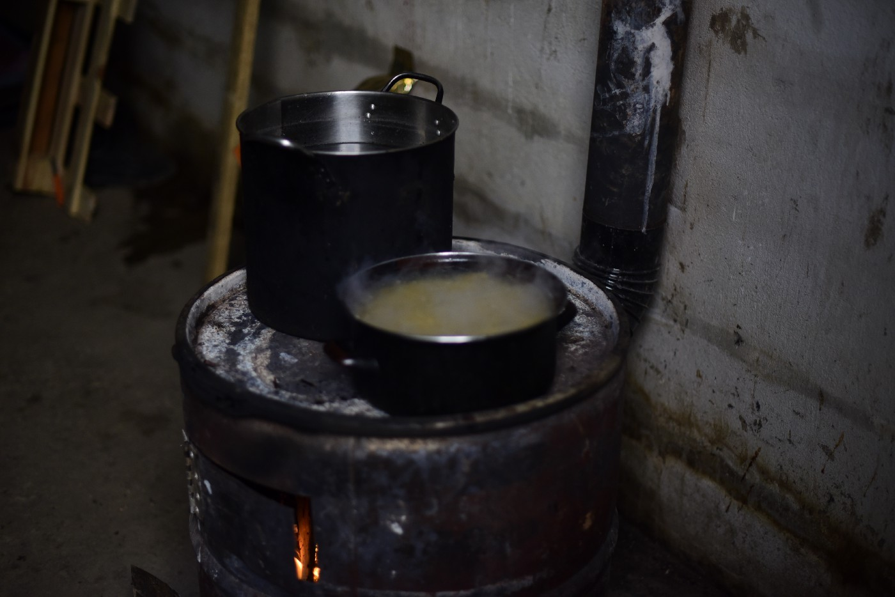

### AYS SPECIAL: Vivir en squats \(Life in squats\)

_Desde que a finales del pasado año 2018 se abriese el campamento de Miral, en Polje, a 5 kilómetros de Velika Kladusa, es como si el derecho de libre circulación de las personas refugiadas por la ciudad, ya no existiera\. Ahí comenzó el acoso\. ¡Id al campo\!, les gritan los agentes cuando caminan por la calle//_ 
Since the opening of camp Miral in Polje, 5 kilometres from Velika Kladuša, in late 2018, it is as if the right of refugees to move freely around the city no longer existed\. This is when the harassment started\. ‘Go to the camp\!’, the police officers shout at them when they are walking down the street\.

— scroll down for English —

Hace una noche fría y Hassan ha invitado a dos amigos a cenar a su ‘casa’\. La comparte con otros 4 amigos\. Paredes, suelo, techo y ventanas\. La puerta siempre abierta porque en el agujero donde debía ir, nunca se rellenó\. En el suelo, mantas, que apiladas acolchan y hacen olvidar la dureza del cemento\. Y encima de las mantas hechas colchón, unas pocas más para abrigarse\.

No hace frío, aunque sí hay mucho humo\.

Hassan, sus 4 amigos, y los dos invitados de esta noche, están en una casa abandonada no lejos del centro de Velika Kladusa\. Los dueños de ese inmueble que nunca llegó a acabarse por falta de ganas, dinero y tiempo, saben que sus paredes abandonadas sirven de cobijo para un grupo de chicos muy educados que han decidido dejar atrás las condiciones de vida de sus países para buscar un futuro mejor más allá del Mediterráneo\.

Ríen y conversan sentados en círculo\. La estancia huele a carne y verduras\. A guiso\. A cocinado lento\. Tan lento como lo que permite la leña dentro de una estufa hecha con barriles de gasolina\. Un tubo largo lleva el humo hasta un agujero de la pared que da al exterior, pero mucho de ese humo se queda en la estancia, dejando su olor en la ropa de los jóvenes\.

Es fácil saber quiénes viven en el campo y quiénes no\. Los que viven fuera, huelen a humo y fogata\. A pollo guisado\. Y pasan más tiempo en la ciudad de Velika Kladusa\. Tienen a la policía, que los persigue cuando caminan por la calle para recordarles que se vayan al campo, a veces los meten en el coche para llevarlos ellos mismos\. Se esconden para entrar a su casa, donde hablan bajo para no llamar la atención\. El dueño de la casa sabe que viven allí y no le importa\. Algunos vecinos también\. Pero si la policía se enterase, los echaría\. Los llevaría al campamento\.

Desde que a finales del pasado año 2018 se abriese el campamento de Miral, en Polje, a 5 kilómetros de Velika Kladusa, es como si el derecho de libre circulación de las personas refugiadas por la ciudad, ya no existiera\. Ahí comenzó el acoso\. ¡Id al campo\!, les gritan los agentes cuando caminan por la calle\.

Khaled se acabó yendo\. Es una persona a la que le gusta seguir las normas\. Romperlas le pone nervioso\. Es una persona disciplinada\. Aún así, siguió viviendo en su contenedor de obra hasta que no le quedó más remedio\. Hasta que la policía se lo llevó a la fuerza\. Ahora es más infeliz, dentro del campo Miral\. Y la intranquilidad de estar rompiendo una norma no se le ha quitado, en realidad\. Porque las normas van apareciendo de la nada\. La vida de Khaled, como la de los otras tantas personas a las que llaman ‘refugiadas’ y se meten a vivir en campos oficiales, ha pasado a depender de las decisiones que IOM, gobierno y Europa toman\. El sábado pasado, por ejemplo, se despertó de un susto\. De repente, había mucha policía por el campo obligando a gente a subirse a unos autobuses que allí había\. Para [trasladar a las personas a Sarajevo sin su consentimiento](ays-weekend-digest-23-24-02-2019-iom-complicit-in-mistreatment-of-people-on-the-move-in-bosnia-560d47feb0d) \. Según cuentan los residentes de Miral, aquellos elegidos para irse, que no querían subirse a los autobuses, fueron golpeados\. Khaled, como muchos otros, se escondió para no ser el elegido para abandonar su cama e irse lejos\.

No quiere romper normas, pero las normas que se van creando para decidir sobre su vida son demasiado absurdas y aparecen de la nada\.

Nadie dijo que no se pudiera volver de noche al campo\. Pero un conocido suyo un día lo hizo: estuvo cenando en el ‘squat’ donde viven unos amigos y a las 11 de la noche volvió para su cama\. Una buena hora para él\. Era en aquellos momentos en los que cientos de hombres compartían las instalaciones, en literas pegadas unas a otras , tapada con mantas para preservar cierta intimidad\. Entre el insomnio que sufre, que la luz del recinto no se apagaba en toda la noche y los ruidos de otras de las cientos de personas que allí dormían, normalmente no conseguía dormir hasta las 6 o las 7 de la mañana, cuando ya caía rendido\. Pero, la seguridad privada que custodia el recinto, le denegó la entrada\. No lo dejan vivir en squats, pero no le permiten entrar en el campo\. Acabó saltando la valla por detrás\. Las normas se van inventando sobre la marcha, y cuando vives en un campamento, tu vida deja de pertenecerte\. Y, seas disciplinado o no, hay veces que no hay más remedio que romper las normas, porque muchas van contra tu dignidad\.

Antes Khaled, vivía en un contenedor de obra\. Madrugaba\. Cogía sus tres botellas de Coca cola arrugadas y vacías y las rellenaba de agua en un grifo cercano a su ‘casa’\. Se iba a comprar pan a su ‘pekara’ favorita, iba a la tiendita de un señor muy amable a comprar vegetales y pasaba por la carnicería a por pollo\. Llegaba a su ‘casa’, que compartía con otros tres chicos, limpiaba y recogía, partía leña en pequeños pedazos, y encendía su estufa\. Cuando el fuego comenzaba a arder, él se ponía a cocinar\. Y durante las horas de la mañana preparaba su guiso que siempre compartía con algún amigo o amiga diferente a quien invitaba a comer con él\. Una organización independiente presente en Kladusa, ofrecía dinero para comida\. Y otra, leña y estufas\. Así lo habían acordado\. Klaled pidió a las voluntarias que prefería que le dieran la leña sin cortar y un hacha\. Cuando eres refugiado en tránsito, no tienes derecho a trabajar ni a estudiar\. Europa te despoja de derechos y prácticamente no hay mucho que puedas hacer Khaled quería ser al menos el dueño de sus tareas\. Que le dieran la leña partida para que el fuego encendiera mejor, le parecía muy paternalista\. Prefería encargarse él\.

Desde que lo obligaron a irse a vivir a Miral, su vida ha dejado de pertenecerle\. Su vida es parte de las decisiones que quieran tomar otros sobre su vida\. Tiene que hacer cola, tres veces al día, con cientos de personas, para poder comer\. No le permiten cocinar y se ve obligado a consumir esos platos de comida que no le gustan, a veces incluso escasos\. Tiene dinero ahorrado, de todos sus años de trabajo, pero prefiere no gastarlo, porque no sabe cuántos años más tendrá que vivir así, sin derecho a trabajar\. No puede invitar a amigos a su ‘casa’ \(un contenedor de obra que comparte con otras siete personas que él no ha escogido como compañeros\) \. Sí puede salir del campamento, obviamente, pero quien no tiene tarjeta del campo no puede entrar a verlo\. También puede pasar, que de repente unos autobuses lleguen para llevarlo a otra ciudad, porque alguien, autoridades sentadas en sus despachos, hayan decidido, dónde Khaled debe vivir y dónde no\.

Es comprensible que los habitantes de Velika Kladusa y las autoridades locales no quieran a personas viviendo en casas abandonadas porque quieran tener un mayor control sobre la cientos de personas que residen en la localidad sin documentación alguna\. Pero nos encontramos, sobre todo, desde que se abrió el campo de Miral, que incluso la policía persigue a los ciudadanos locales que alquilan o prestan sus casas a personas refugiadas, aunque estas personas sean familias con niños pequeños, que han preferido vivir ‘una vida normal’ dentro de ese limbo en el que se encuentran, donde se les ha despojado de todo derecho por querer escapar de una guerra\.

The night is cold and Hassan has invited two friends over to his ‘house’ for dinner, a place he shares with four other friends\. Walls, floor, ceiling and windows\. The door is always open because the space where there should have been one was never filled in\. On the floor, stacked blankets to soften and make forget the hardness of the floor\. And on top of the blankets that serve as mattress, more blankets to keep them warm\.

It is not cold, but there is certainly a lot of smoke\.

Hassan, his four friends and the two guests are in an abandoned house not far from Velika Kladuša’s centre\. The owners of this building — that was never completed due to the lack of will, money and time — are aware that these abandoned walls provide shelter to a group of guys who decided to leave behind the living conditions in their countries to seek for a better future beyond the Mediterranean\.

They laugh and chat, sitting in a circle\. The room smells of meat and vegetables\. A slow\-cooked stew — cooked as slowly as the wood that feeds the stove consisting of a petrol drum allows\. A long tube drives the smoke outside through a hole on the wall, but much of that smoke stays in the room and the smell lingers in the young boys’ clothes\.

It is easy to guess who lives in the camp and who doesn’t\. Those who live outside the camps smell of smoke and fire; and of chicken stew\. They also spend more time in the city of Velika Kladuša\. The police there are constantly harassing them when they are walking down the street, reminding them that they should go back to the camp and even getting them into their cars and driving them there themselves sometimes\. The young boys sneak inside their house and speak low to avoid attracting attention\. The owner of the building knows that they are living there, but he does not mind\. Some of the neighbours are also aware\. However, if the police found out, they would be thrown out — and taken to the official camp\.

Since the opening of camp Miral in Polje, 5 kilometres from Velika Kladuša, in late 2018, it is as if the right of refugees to move freely around the city no longer existed\. This is when the harassment started\. ‘Go to the camp\!’, the police officers shout at them when they are walking down the street\.

Khaled finally ended up going to the camp\. He is a person who likes to follow the rules\. Breaking the rules makes him feel uneasy\. He is well\-behaved\. Still, he continued to live in a shipping container until he had no other choice; until the police forced him to go\. Now he is unhappier, living in Miral camp, and the uneasiness he felt because he was breaking the rules has actually not disappeared\. This is because rules keep appearing out of the blue\. Khaled’s life — like the life of the many other people whom they call ‘refugees’ and moved into official camps — has come to depend on decisions made by the IOM, the government in Bosnia and Europe\. Last Saturday, for example, Khaled woke up with a start\. Suddenly, the camp was full of police officers forcing people to get on to some buses that were waiting outside to [move them to Sarajevo without their consent](ays-weekend-digest-23-24-02-2019-iom-complicit-in-mistreatment-of-people-on-the-move-in-bosnia-560d47feb0d) \. According to the residents of Miral, the people who had been selected to leave and refused getting on to the buses were beaten\. Khaled, like many others, hid himself so as to avoid being selected and forced to leave somewhere far\.

He does not want to break the rules, but the rules that are being made to decide about his life are too absurd and come out of the blue\.

Nobody said that arriving at the camp at night was not allowed\. But one of his acquaintances arrived late once\. He was having dinner in a squat where some of his friends are living and returned to the camp at 11 p\.m\. It was a good moment for him; the moment when hundreds of men share the camp’s facilities and get into rooms cramped with bunk beds separated by blankets to try preserve some privacy\. He suffers from insomnia, worsened by the fact that the lights are not turned off during the night and that there are the noises of hundreds of people sleeping there, so he hardly ever manages to get some sleep until 6 or 7 in the morning, when he finally falls exhausted\. But he was denied entry by the private security guards who control the building\. He is not allowed to live in squats, but he is denied entry to the camp\. He ended up jumping over the fence at the back of the building\. Rules are invented on the fly and if you live in a camp, your life no longer belongs to you\. Whether you are well\-behaved or not, there are times when there is no other choice but to break the rules because many of these rules go against your dignity\.

Khaled used to live in a shipping container\. He used to get up early in the morning, took his three creased and empty Coca Cola cans and went to fill them up with water in a tap near his ‘home’\. Then he went to buy bread in his favourite “pekara”, passed by the little shop of a very king man to buy vegetables and stopped by the groceries to buy chicken\. He arrived to his ‘house” — which he shared with three other young boys –, cleaned and tidied up the place, chopped wood into little pieces and lit up his stove\. When the fire began to burn, he started cooking\. He spent all the morning preparing his stew, which he would always share with a different friend he would invite over for lunch\. An independent organization working in Kladuša provided money for the food; another organization, wood and stoves\. This is how it was agreed\. Khaled told the volunteers he would prefer if they could give him the logs and an axe so he could chop the wood himself\. Refugees on the move don’t have the right to work or study\. Europe strips them of their rights and there are really not many things they can do\. Khaled wanted to be, at least, the owner of his tasks and felt that being given the wood already chopped so that the fire would burn better was too patronizing\. He preferred doing it himself\.

Since he was forced to go live in Miral his life stopped belonging to him\. It is now a part of the decisions that others make on his life\. He has to queue three times a day with hundreds of people for his helping of food\. He is not allowed to cook and has to eat food he does not like — and which is sometimes even scarce\. He has saved money from all the years he has worked, but he prefers not to spend it because he does not know how many more years he will have to live deprived of his right to work\. He cannot invite friends over to his ‘house’ — a shipping container he shares with seven other people which he has not chosen as ‘housemates’\. He can certainly leave the camp, but people who do not have the camp’s card cannot come in to visit\. Moreover, the buses can appear at any time to take him to another city just because someone — authorities who are sitting in their offices — have decided where Khaled shall live and where he shall not\.

It is easy to understand that the citizens and local authorities of Velika Kladuša do not want people living in abandoned houses and that they want to better control the hundreds of people who are living in the town without papers of any kind\. But what we are seeing is that, especially since the Miral camp opened, the police are even hunting down local people who rent or lend their houses to refugees — even when they lend them to families with small children who have preferred to live “a normal life” within the limbo in which they are trapped, stripped of all their rights for wanting to flee from war\.

**_\(Written by Bárabra Bécares, translation edited by Clemen Talvy and photos by Angelica Sánchez, volunteers\)_**

**We are an entirely volunteer\-run media team, and we rely on our supporters to share our news\. So please share, and never forget to ACT\!**

**Apart from daily news in English, we also publish weekly summaries in [Arabic](%D8%A7%D9%84%D9%85%D8%AE%D9%8A%D9%85%D8%A7%D8%AA-%D8%A7%D9%84%D9%85%D9%83%D8%AA%D8%B8%D8%A9-%D9%88%D8%A7%D9%84%D8%B9%D8%AF%D9%8A%D8%AF-%D9%85%D9%86-%D9%85%D8%B1%D8%A7%D9%83%D8%B2-%D8%A7%D9%84%D8%A7%D8%AD%D8%AA%D8%AC%D8%A7%D8%B2-9f7b7169811b) and [Persian](%D8%A7%D8%B2%D8%AF%D8%AD%D8%A7%D9%85-%D8%AC%D9%85%D8%B9%DB%8C%D8%AA-%D8%AF%D8%B1-%D9%85%D8%B1%DA%A9%D8%B2%D9%87%D8%A7-%D9%88-%D8%B2%D9%86%D8%AF%D8%A7%D9%86-%D9%87%D8%A7%DB%8C-%D9%BE%D9%86%D8%A7%D9%87%D9%86%D8%AF%DA%AF%DB%8C-f15b98efbd26) \. Click on those links to check out the ones from the week February 25 to March 3\.**

**We strive to echo correct news from the ground through collaboration and fairness\. Every effort has been made to credit organisations and individuals with regard to the supply of information, video, and photo material \(in cases where the source wanted to be accredited\) \. Please notify us regarding corrections\.**

**If there’s anything you want to share or comment, contact us through Facebook or write to: areyousyrious@gmail\.com**

_Converted [Medium Post](https://medium.com/are-you-syrious/ays-special-vivir-en-squats-life-in-squats-27a4c078a65c) by [ZMediumToMarkdown](https://github.com/ZhgChgLi/ZMediumToMarkdown)._
