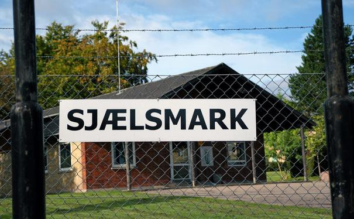

### AYS SPECIAL — Denmark Weekly: “Something is Rotten in the State of Denmark\.”

_The political environment in the country formerly known as ‘fairyland’ is changing radically one small step at a time\. Over the past few years, there has been a steady increase in hostile and discriminatory policies and a dehumanizing rhetoric towards people with non\-western backgrounds, particularly Muslims and refugees\. This is characterized by deportations camps, so called “ghetto\-laws”, and an ever\-increasing focus on deportations, just to name a few\. The phrase “we will go as far as we can without actually breaking the conventions” seems to be the motto of the current Danish immigration minister\. In AYS, we will try to write a weekly update on what is actually going on in Denmark\. This to ensure that we can give you information which is as clear as possible\._

 \)](assets/e67fab2c2184/1*riWs0MayBHvJ-f4lbpmrwA.jpeg)

Shadow of refugees, by Delawer Omar \(Via FB page [ArtAgainst](https://www.facebook.com/artagainstproject/) \)

The [Danish Immigration Office](https://nyidanmark.dk/en-GB) \(udlændingestyrelsen\) and [Refugee Board](https://www.fln.dk) \(flygtningenævnet\) announced last week that they will [change the asylum processing procedure for Syrians](https://www.nyidanmark.dk/da/Nyheder/2019/02/Udl%c3%a6ndingestyrelsen-%c3%a6ndrer-praksis-i-sager-vedr%c3%b8rende-de-generelle-forhold-i-Syrien?fbclid=IwAR2gm8W6oT9ZGRdpidXe6gxVlqo_SUVPlxXvqjqYvqVyJYZC0t_5_-QaEJs) from the Damascus province, a group that up until now has automatically been granted asylum due to the general conditions in Syria \(§7 article 3\) \.

This decision follows a newly published report by the Danish immigration office, which claims that Assad\-controlled areas in the Damascus province are safe\. In practice it means that Syrians from the Damascus province will no longer be granted asylum automatically\.

Moreover, the Refugee Board will begin to re\-open cases with the possibility to revoke temporary residency, and thus commence deportations back to Syria\.

The process of revoking temporary residencies, when the security situation in the home country is starting to improve, was made possible [after a law change](https://www.dr.dk/.../forstaa-sagen-derfor-kan-somaliere...) in 2015 by the then Social\-Democrats\-led coalition government\.

The Danish security report on Syria does, however, conflict with the conclusions in the [UN security report on Syria](http://UNs security report on Syria) , published only a few days after the Danish one\. UN officials say it is “ _an illusion_ ” to believe in the safe and sustainable repatriation of refugees to Syria, due to the conditions in the country, characterized by “ _violence and war crimes committed on all sides, combined with the destruction of crucial infrastructure and the lack of functioning public services etc\._ ”

It is however, not the first time the Danish government has revoked residencies and deported people back to unstable countries, based upon very questionable country security reports\.

In 2016, a [report produced and published](https://www.dr.dk/.../forstaa-sagen-derfor-kan-somaliere...) by the Danish immigration office on the security situation in Mogadishu, in Somalia, concluded that Mogadishu was a safe place to return to for individuals not personally persecuted\. It was later discovered that the officials writing the report had not left the airport in Mogadishu due to ‘security reasons’, and that the Danish government had made an agreement with the Somali government offering to train Somali police in exchange for accepting 12 deportations from Denmark a year\.

In spite of the criticism the report has received, as well as knowledge of the shady agreement with a country known for being “amongst the world’s most corrupt”, the Danish Immigration Office has proceeded in their effort to deport Somalians\.

By sn\.dk

Denmark has two deportation camps — Sjælsmark and Kærshovedgård — both opened in 2015 and 2016\. As reported by different media and human rights organizations, the conditions in the camps are “deliberately as unpleasant as possible”, while some are calling these places open prisons\.

\(Read [report](http://refugees.dk/media/1757/stop-killing-us_uk.pdf) _Stop Killing us Slowly_ by _Freedom of Movement Research Collective_ on condition in the camps\) \.

This week an attempted deportation happened in Deportation Center Sjælsmark\. [The Bridge Radio](https://www.facebook.com/TheBridgeRadioDK/?__tn__=%2CdkCH-R-R&eid=ARB0PvWD77ZZf46BHfkb2aKJvJv6AYgvzX6Jgn0YxJMK_Ph_clpY2yYAAjhnGpwPqvkEt9oCUmXtFpmu&hc_ref=ARShTfbsQxPDEwmhHhf0bx-osc2qC7b2SC4fJ3HPu8wQkaWJLlOnuhTeptLl8AgocaE&fref=nf) published on their FB page a video by [Sjælsmark Børn](https://www.facebook.com/Sjalsmark?__tn__=%2CdKH-R-R&eid=ARA0fyHi64N6rX6wGYxlK_dSbEewM4V6592ZQ5UeLD1qbaEd6E4SANsHn2hjQsOu9CMkVmE3N6wLZF4Z&fref=mentions) of a woman lying on the floor after she had fainted out of fear\. The police was visibly present everywhere in the Center, and were trying to take an Iranian family and their kids to the airport to try to deport them\. However, due to the woman’s medical condition, the deportation was delayed, and she was taken to hospital\.

“ _This is trauma for everyone living in the camp\. The brutality of these deportations is real for all women, men and children living in this camp\. It is not only bad food, lack of schooling or poor health care that people in Deportation Center Sjælsmark are fighting\. It is the real fear of being sent back to a country where their lives are in danger,_ ” the Radio reports\.

\(You can find more info on how to stop deportations [here](http://www.gettingthevoiceout.org/how-to-stop-a-deportation/) \)

Also, if you live in Denmark, you can [sign the petition](https://www.borgerforslag.dk/se-og-stoet-forslag/?Id=FT-02060&fbclid=IwAR1fIQGlW5t8Klf9hVRkd9dC0Ee9iDrCuJ5Dav9MZF3rHcmgUm0cpX51xeg) \. To reach the Parliament, 50,000 signatures are needed\. The petition calls for better living conditions for asylum\-seeking children in the deportation centers\.

**We strive to echo correct news from the ground through collaboration and fairness\.**

**Apart from daily news in English, we also publish weekly summaries in [Arabic](%D8%A7%D9%84%D9%85%D8%AE%D9%8A%D9%85%D8%A7%D8%AA-%D8%A7%D9%84%D9%85%D9%83%D8%AA%D8%B8%D8%A9-%D9%88%D8%A7%D9%84%D8%B9%D8%AF%D9%8A%D8%AF-%D9%85%D9%86-%D9%85%D8%B1%D8%A7%D9%83%D8%B2-%D8%A7%D9%84%D8%A7%D8%AD%D8%AA%D8%AC%D8%A7%D8%B2-9f7b7169811b) and [Persian](%D8%A7%D8%B2%D8%AF%D8%AD%D8%A7%D9%85-%D8%AC%D9%85%D8%B9%DB%8C%D8%AA-%D8%AF%D8%B1-%D9%85%D8%B1%DA%A9%D8%B2%D9%87%D8%A7-%D9%88-%D8%B2%D9%86%D8%AF%D8%A7%D9%86-%D9%87%D8%A7%DB%8C-%D9%BE%D9%86%D8%A7%D9%87%D9%86%D8%AF%DA%AF%DB%8C-f15b98efbd26) \. Click on those links to check out the ones from the week February 25 to March 3\.**

**Every effort has been made to credit organizations and individuals with regard to the supply of information, video, and photo material \(in cases where the source wanted to be accredited\) \. Please notify us regarding corrections\.**

**If there’s anything you want to share or comment, contact us through Facebook or write to: areyousyrious@gmail\.com**

_Converted [Medium Post](https://medium.com/are-you-syrious/ays-weekly-overview-there-is-something-rotten-going-on-in-denmark-e67fab2c2184) by [ZMediumToMarkdown](https://github.com/ZhgChgLi/ZMediumToMarkdown)._
