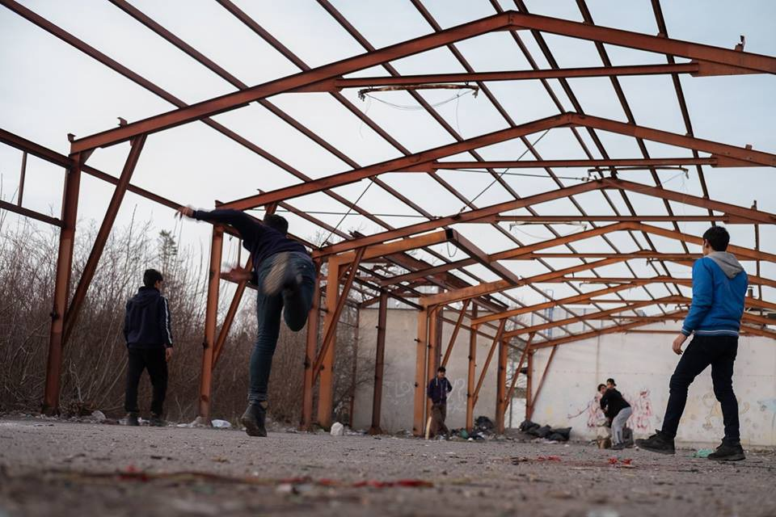

### AYS Daily Digest 07/03/2019 Italy: makeshift camp in San Ferdinando evicted

More reports from Afghanistan /// Tragic death in the Aegean Sea /// Statement from Refugees Movement for Rights and Justice /// Racist attack in Greece /// Is the EU spreading disinformation? /// Deportation from Sweden /// Protest in Reykjavik /// New arrivals in Lampedusa /// Push\-backs on the Serbian/Hungarian border /// Much more…

 — [ArtAgainst](https://www.facebook.com/artagainstproject/photos/a.639651369417634/2103939822988774/?type=3&theater) \)
[\#noborders](https://www.facebook.com/hashtag/noborders?epa=HASHTAG)](assets/87b6acb6f885/1*HSeRIspjb9Ha0jH9t3fa7Q.jpeg)

Calabria, Italy 6 March 2019
1,000 paramilitary police evicted more than 1,500 people from the San Ferdinando camp, Southern Italy\.
In the photograph, A\.A\., refugee from Nigeria, before the eviction, under a tent he lived in for five years\.
\(Photograph by [Simone Padovani](https://twitter.com/SimonPadovani) — [ArtAgainst](https://www.facebook.com/artagainstproject/photos/a.639651369417634/2103939822988774/?type=3&theater) \)
[\#noborders](https://www.facebook.com/hashtag/noborders?epa=HASHTAG)
#### Makeshift camp in San Ferdinando evicted

As we reported yesterday, [the makeshift camp in San Ferdinando, nearby Rosarno in Southern Italy, has been evicted and demolished in the last couple of days\.](http://campagneinlotta.org/sgombero-della-tendopoli-di-san-ferdinando-quello-che-nessuno-dice/)

 \)](assets/87b6acb6f885/1*86xGd59HKEepYV8MGNr7XQ.jpeg)

Excavator during the eviction \( [Comitato Lavoratori delle Campagne](https://www.facebook.com/comitatolavoratoridellecampagne) \)

Other evictions and demolition operations have also been carried out in past years \(2013 and 2017\) \. This time, more than 1,000 police agents intervened, and it became one of the centrepieces of the never ending electoral campaign of Italian interior minister Salvini, who promoted it as an act of humanity and legality…

 \)](assets/87b6acb6f885/1*M7HrXcVmgGnxbkPGWrLy5g.jpeg)

More than 1,000 police agents intervened \( [Comitato Lavoratori delle Campagne](https://www.facebook.com/comitatolavoratoridellecampagne) \)

The camp was home to around 1,500 people, among them around 200 women, many of whom are victims of sex trafficking\.

Before the eviction, the inhabitants of the makeshift camp released a [statement](https://hurriya.noblogs.org/post/2019/03/04/san-ferdinando-appello-di-chi-vive-nella-tendopoli-per-lo-sgombero-del-6-marzo/) :

> **TO ALL THOSE WHO FIGHT AGAINST EXPLOITATION AND REPRESSION: WE CAN’T KEEP QUIET ANY LONGER\! NO TO THE EVICTION OF THE TENDOPOLI\!** 

> To the satisfaction of too many people, the government’s announcements have become a reality\. On Wednesday, the 6th of March, by order of the Municipality, we, the people living in the old tendopoli of San Ferdinando, will be evicted from the place where we live, the place we have built in all these years, with much effort and money, simply because we had no other place to stay\. We want to let everyone know that we will not accept to stay in other tents, being controlled day and night, nor will we accept to be transferred to camps \(centri di accoglienza\), which are not only controlled but also far away from where we work\. And we do not want to end up on the streets if we don’t have documents\. We want to live free and we want to live in houses, regardless of having a document or not\. Our presence in this territory is not an emergency, rather it is crucial for this country’s economy, and has been for many years\. 

Residents of the camp and their supporters denounce the widespread consensus for the eviction, from both locals and authorities but also from many associations and trade unions, which too often make decisions and act in the name of people on the move without their consent\.

> NOW, THE TIME HAS COME TO SAY: ENOUGH\! We will not be intimidated by those who threaten us and wish we be calm and silent, so that the police can evict us more easily\. We will not accept compromises if they do not give us houses where we can live\. We ask all our allies, all those who think of themselves as anti\-racists and anti\-fascists, all those fighting against repression and exploitation, all of you, do not keep quiet any longer, in the face of this brutal act of violence\! 

 \)](assets/87b6acb6f885/1*c0RMZrfm9TfZvMcUlYaUdQ.jpeg)

During the eviction \( [Comitato Lavoratori delle Campagne](https://www.facebook.com/comitatolavoratoridellecampagne) \)

[Comitato Laovatori delle Campagne](https://www.facebook.com/comitatolavoratoridellecampagne/posts/2371226852943426) denounced the lack of provisions for the evicted people:

> Many people waited for the entire night to access the new tents but, due to overcrowding, those with humanitarian protection and 6\-month\-long permits have been sent away\. 

> \[…\] Many people are now on the streets, and many left Rosarno on the train\. Among the few who got the buses for the reception centres — authorities say 200 people, actually they are a bit more than 30 \[…\] — many have already come back, because they cannot leave as they are still working in the areas or waiting to be paid for their work\. 

> \[…\] Those who can are moving towards other makeshift migrant labourers camps in the area, or in other farming districts\. 

 \)](assets/87b6acb6f885/1*IctNzq5GT8qbTny60V0O9g.jpeg)

The camp after the eviction \( [Comitato Lavoratori delle Campagne](https://www.facebook.com/comitatolavoratoridellecampagne) \)

As we previously reported, since December houses have been built using EU funds to house people on the move, but they have still not been used having been kept in bureaucratic limbo\. Following the rise of racist discourse in the country, local authorities are asking for these houses to be used for “Italians too” \(read: Italian first\) \.

AFGHANISTAN
#### Report on Conditions for Children in Afghanistan

[Unicef Netherland published an update to their Child Notice Afghanistan, previously published in 2015\.](https://www.unicef.nl/nieuws/2019-03-06-nieuw-rapport-over-leefomstandigheden-van-kinderen-in-afghanistan?fbclid=IwAR28Ah6omDXrPo9BdKvKigYLPNqsrUsayhaDVTC19siTC_RNuQCzV_3U5Ts)

They remark on the harsh conditions for children in the country:

](assets/87b6acb6f885/1*nu7-zXALcCdFuDhZ43Kutg.png)

[Unicef NL](https://www.unicef.nl/nieuws/2019-03-06-nieuw-rapport-over-leefomstandigheden-van-kinderen-in-afghanistan?fbclid=IwAR28Ah6omDXrPo9BdKvKigYLPNqsrUsayhaDVTC19siTC_RNuQCzV_3U5Ts)

> Children are at great risk of becoming victims of the armed conflict, domestic violence, child abuse or \(sexual\) exploitation\. In 2018, the Afghan government has made extra budget available for child protection programs\. **Nevertheless, the Afghan government can not offer children adequate protection against violence and abuse\.** 

Read the full report [HERE](https://www.unicef.nl/files/UNC%20Rapport%20Child%20Notice_Afghanistan%20EN%20(2018)%20FINAL.pdf) \.

[Abdul Ghafoor of AMASO](https://kabulblogs.wordpress.com/2019/03/07/why-should-no-one-be-deported-to-afghanistan/?fbclid=IwAR2aN1oiqcS1upioGTYwJurS8AhokEqRFsOt936AybdQdPN25-6nnkfUm-A) has received further worrying reports from young people recently deported to Afghanistan as political gatherings continue to be attacked in Kabul\.

> I was sitting in the front row when the first rocket landed close to the entrance and the main gate, with few seconds’ difference, more rockets started landing in different parts of the venue where hundreds of people had gathered\. I was too far to reach the main gate to escape, I ran towards the stage to find safety\. More rockets started landing closer to us, I had no option but to climb up the wall and jump from there\. I lost all my money and my clothes were full of dirt\. Luckily I didn’t suffer any injury from the explosions\. 

The young people deported from Northern European countries have often never been to Afghanistan before\. To suddenly find yourself in such a dangerous situation would be terrifying; yet Sweden is planning another charter flight deportation on the 12th of March\. The number of those who will be on board is not yet known\.

MOROCCO
#### 9 people rescued at Sea

[AMDH — Nador report](https://www.facebook.com/AmdhNador/photos/a.1693125780899690/2286371811575081/?type=3&theater&ifg=1) that on Wednesday, at around 10 PM, the local hospital received nine people from the Sub\-Saharan region in a serious condition\. They had been rescued off the coast near Melilla\.

AMDH has no information as to whether they had been pushed back towards Morocco by the Spanish Navy or rescued by the Moroccan Navy\.

AMDH also report that 32 migrants arrested by the Moroccan gendarmerie have been transferred to the detention centre in Arekmane\.

GREECE

ISLANDS
#### Another Tragedy in the Aegean

Three people died at sea last night\. Two small children, twin brothers age four, and their father lost their lives when their boat sank off the east coast of Samos according to [Aegean Boat Report](https://www.facebook.com/AegeanBoatReport/photos/a.285312485325196/536379066885202/?type=3&theater) \. The boat was thought to be carrying 12 people\. 11 people were rescued and rushed to a hospital, but for the twins, it was too late\. Their father’s body was found this morning close to shore\.

The family were from Afghanistan\. It is unclear why the boat sunk and what led to the accident\. Our thoughts are with the remaining family members\.

■■■■■■■■■■■■■■ 
> **[Marianna Karakoulaki](https://twitter.com/Faloulah) @ Twitter Says:** 

> > The EU declared the end of the crisis. But #refugeesGR will not stop coming. Europe's increased control of the border, militarization of the waters and securitization of the crisis means more risk for those who cross.
#violentborders 

> **Tweeted at [2019-03-07 09:27:14](https://twitter.com/faloulah/status/1103587904650207232).** 

■■■■■■■■■■■■■■ 

How many more children have to die at Europe’s borders before we achieve safe passage?
#### Greek Government Island Statistics

The Greek Government states that there are currently 15,376 people present on the islands in hotspots and alternative accommodation and are clearly maintaining that the makeshift camps on Samos and Lesvos either do not exist or do in fact meet the standards of official government accommodation\. All we can say is that either their standards are very low or that they are purposefully lying\.

[Look at the PDF here\.](http://mindigital.gr/index.php/%CF%80%CF%81%CE%BF%CF%83%CF%86%CF%85%CE%B3%CE%B9%CE%BA%CF%8C-%CE%B6%CE%AE%CF%84%CE%B7%CE%BC%CE%B1-refugee-crisis/3661-national-situational-picture-regarding-the-islands-at-eastern-aegean-sea-06-03-2019?fbclid=IwAR1HYNELrutfBBe8QSTXCFLC1w_MNEQKnx94Tm8F4oY6RNctFPhX-4GRMmk)
#### Samos Volunteers Need Books

To find out how to donate and what languages are most useful look [here](https://www.facebook.com/samosvolunteers/photos/pcb.1193209104190581/1193208967523928/?type=3&theater) \.

MAINLAND
#### Statement from Refugees Movement for Rights and Justice

> Important statement to all refugees in Greece: 

> A few days ago, the Greek government, through the Ministry of Migration Policy, made a decision backed by the European Union — DG Home Fund Agency to **cut financial and housing aid to the refugees\. This decision is intended as a first stage for over 600 people and families on Greek territory\.** 

> The implementation of this unjust and hasty decision will create a new crisis that will only add to the ongoing suffering of the refugees\. Hundreds of families, children and youth will be displaced to the streets, where neither shelter nor food will be found\. This unjust decision is also a result of the Turkey\-EU agreement in 2016, which resulted in the conversion of the Greek Islands from refuge to mass prisons and detention camps until this moment\. In addition, such decisions only encourage and incite political forces on the extreme right in Greece and throughout Europe to exploit the living conditions of the Greek people, suffering from a suffocating financial crisis\. This is also the result of the reckless, profit\-seeking European policies that come at the expense of human rights and international law\. 

> It is our duty as refugees of various nationalities and social backgrounds to stand together collectively to confront these racist decisions, peacefully and in unity, in order to raise our voices high, pressure the concerned parties to shoulder their responsibilities, and obtain all of our rights, which have so far been violated and denied\. Our first goal is to not allow the implementation of this decision or any similar resolutions that violate our rights as refugees\. 

> In response to this situation, we are duty\-bound to shoulder our responsibilities toward our people, all of the poor and the refugees\. We are a group of refugee youth of different nationalities who have come together to form the Refugee Movement for Rights and Justice to confront these decisions and develop a series of actions and activities to challenge these machinations of political interest on the part of the Greek government and the European Union\. We know very well that the justifications expressed by international organizations, alongside the Greek government and the European Union, are nothing but deception and an attempt to cover up the failure of their programs\. The disbursement of hundreds of millions of Euros on temporary projects has failed to provide a real, radical solution to refugees’ suffering\. 

> Those who can spend astronomical sums to finance wars and create our crisis and our suffering must take responsibility in finding a solution\. This financial and housing assistance is insufficient and does not meet our needs, but it is one of our rights that we will not abandon\. 

> Stopping this unjust decision depends on our participation and the spirit of solidarity among the refugee population\. This decision is only a first step in targeting all refugees and their rights, contrary to justice and international law\. 

As we have previously published they call for participation on the [13th](https://www.google.com/url?sa=t&rct=j&q=&esrc=s&source=web&cd=1&cad=rja&uact=8&ved=2ahUKEwiNppSIk_LgAhXKUJoKHQtnANIQFjAAegQIARAB&url=https%3A%2F%2Fathens.indymedia.org%2Fevent%2F78598%2F&usg=AOvVaw1mh0JhNh5kdQ54qSqH_332) and [16th](https://www.google.com/url?sa=t&rct=j&q=&esrc=s&source=web&cd=1&cad=rja&uact=8&ved=2ahUKEwjuwvjwk_LgAhWMw6YKHWD4D4AQFjAAegQIBxAB&url=https%3A%2F%2Fwww.facebook.com%2F17m18actionday%2Fposts&usg=AOvVaw044K1cnI_NZ2KZpH3IBUl9) of March\.
#### Open Assembly Callin Response to Estia Eviction and Cessation of Cash Support

Next assembly: 6 PM Monday 11th of March in Gini Building, Politechneio\.

The following working groups are open to join\. If you want to be added to a working group please contact \+30 698 7518865‬\.
- COMMUNICATIONS
- LEGAL
- PRESSURE ON DECISION MAKERS
- PRACTICAL SUPPORT

#### Racist Attack

[Melissa Network](https://www.facebook.com/Melissanetworkgreece33/posts/1199245446918006?hc_location=ufi) reports that they had a glass bottle thrown into their garden today\. Luckily it just missed two women and a seven year old child\.

We stand in solidarity with all the women and children who use and run this space\.
#### Evros Push Backs

[Media report](https://www.cbc.ca/news/world/greek-prosecutor-investigating-allegations-of-systematic-violence-against-migrants-at-evros-river-1.5043460?fbclid=IwAR24FVRKk2G-zSreiCKUvDnIeX-Z7dSjeFsn2HKmBnTLPmZLn1MU0Y8T3fk) that a Public Prosecutor has begun an investigation into push backs by both Greek Police and unidentifiable military forces of people trying to cross from Turkey into Greece over the Evros River\. Many damning testimonies have already been collected, and this could lead to a case being brought against the Greek Authorities\. As we have [reported](https://www.google.com/url?sa=t&rct=j&q=&esrc=s&source=web&cd=2&cad=rja&uact=8&ved=2ahUKEwjvrYvRjfLgAhXJ8qYKHcvPDdkQFjABegQIARAB&url=https%3A%2F%2Fmedium.com%2Fare-you-syrious%2Fays-special-witnessing-a-pushback-c52523048b2f&usg=AOvVaw1T9bE8xNBYPUtIgbksuFfQ) so many times, when pushed back from EU countries, people on the move are often beaten, have their phones and money stolen, and have even been forced to strip, by individuals paid by the state in question, in places far from witnesses\.
#### [Refugee Info](https://www.facebook.com/refugee.info/photos/a.1063678090359004/2173641119362690/?type=3&eid=ARDo89I-hi17xJwcIl-7k4YRTb56u2KescZw5GJ04lYVhvGc4Qp_Bj8mmFkhAof966ZT5Tewcx4tEQHb&__xts__%5B0%5D=68.ARBt1gARlyf_da8YLbwZXdv_OIN0J41ZMN-bluW0aSL6aUkabWvdrtHLKq7DptO997dqlUn2xzZen-oT1SaVJjKmx9_U8bca0Ju1WD_ZUkEgY4DZmQjCr0aOEprXt5Jz8kg_CsBPQdQ9c7QE51fGd9ewMjetUxgow8OzcRmHEIDNYP-z-JiBpzskBfJkYVZ6ArfnjAYZsBfq7XBDXG0Oa2yqwRCLphrhWBKRKxOp-IW0pRUQU4E-C02nSoszWBz4K56qogfmdT1rD7_UI9--wsA4S5hi7qnlc2pTJ8G16isBeQofXwamG9IcfX8YEzYZp3mYv4KJpaMdplaIhUXFo4o-dA&__tn__=EHH-R&hc_location=ufi) Update on Residence Permits

Does your Residence Permit in Greece expire by the 30th of June 2019? The Greek Asylum Service says you can now apply to renew it by the 30th of April 2019\.

[HERE](http://bit.ly/2SLPaCb) is how to renew online\.
#### Jobs in Greece

Generation 2\.0 has published its latest [jobs bulletin](https://l.facebook.com/l.php?u=https%3A%2F%2Fg2red.org%2Fjob-adverts-07-03-2019%2F%3Ffbclid%3DIwAR3D2DPGjbcs38F6cvrxgRnGJaMrxvEKDccGSw_FA64M-v0itvUmjUhbOcQ&h=AT2qzocwGksj4yDVkfWgRA8RT9DcQnyCFwuuCCvYzgsvDh6872BBfrFZ2trk4A11ynGDrQNGfamEenswycBpirlCQnEDScjQAe9PvfL88mDfKoTwWhRGPaibCEoe3O_p) \.

ITALY
#### Arrivals

40 people were rescued by the coast guard 14 miles south\-east of Lampedusa\.

Among them were six women and two children\. According to humanitarian sources, they are from Somalia, Senegal and other Sub\-Saharan countries\.

■■■■■■■■■■■■■■ 
> **[Sergio Scandura](https://twitter.com/scandura) @ Twitter Says:** 

> > #migranti BREAKING via Radio Radicale 10:05 🔴 40 SBARCATI A LAMPEDUSA ALLE 03:00. PARTITI DALLA LIBIA, SALVATI da una unità della Guardia Costiera ⚓️🇮🇹 in evento SAR. 6 donne e 2 bambine di tre anni circa, tra i 40. Subsahara, Somalia, Senegal (fonti umanitarie e sanitarie). 

> **Tweeted at [2019-03-07 09:07:37](https://twitter.com/scandura/status/1103582966012358657).** 

■■■■■■■■■■■■■■ 

BALKANS
#### Weather forecast for Friday the 8th of March\.

MONTENEGRO — Lightly to moderately cloudy with longer sunny intervals\. Towards the end of the day and during the night, increasingly cloudy\. Wind from the South, locally moderate to strong\. Highest daily temperatures from 9 to 21 degrees\.

SERBIA — Warm, during the day predominantly sunny, in the north and west predominantly cloudy\. Locally short periods of rain with thunder\. Wind weak to moderate, locally strong from time\-to\-time in some places\. In the evening, the wind turns to western and northwestern directions\. Lowest temperatures from 0 to 13 and highest daily from 18 to 22 degrees\.

BiH — Moderately to predominantly cloudy\. In the afternoon rain in the west and north of the country which will spread throughout the country during the night\. Wind moderate from the south and southwest\. Highest daily temperatures from 16 to 22 degrees\.

CROATIA — Cloudy and relatively windy and above average temperature for the time for the year\. In the south, mainly cloudy with rain and thunder during the first part of the day and in the afternoon in the rest of the country, too\. Wind moderate, at some places strong blowing from the south, alongside the coast strong southern wind\. Highest daily temperatures fro 16 to 21 degrees\.

BOSNIA AND HERZEGOVINA
#### Increase in Security

Bosnia & Herzegovina will increase security forces on the eastern border in order to prevent people from crossing over from Serbia\. According to official migration monitoring sources, B&H had 2,260 new arrivals in January and February 2019, which is a significant increase in comparison with 2018\. The defense of the 600km long border with Serbia is considered a top priority for Bosnian security forces in 2019, [Info Park reports](https://www.google.com/url?sa=t&rct=j&q=&esrc=s&source=web&cd=1&cad=rja&uact=8&ved=2ahUKEwjTyLP_nvLgAhVoysQBHYjzAJ4QFjAAegQIBxAB&url=https%3A%2F%2Fwww.facebook.com%2Finfoparkserbia%2F&usg=AOvVaw2dk9dccBdIbpvIFc7Yp66i) \.

CROATIA
#### Arrests in Sisak

According to the Croatian daily [Jutarnji list](https://www.google.com/url?sa=t&rct=j&q=&esrc=s&source=web&cd=1&cad=rja&uact=8&ved=2ahUKEwipke_KnfLgAhUz8KYKHVyoD44QFjAAegQIABAC&url=https%3A%2F%2Fwww.jutarnji.hr%2F&usg=AOvVaw3IpmLYNAWqAGl9oWga0f7p) , the police in Sisak arrested 11 people on the move on Wednesday\. The individuals had hidden in two fuel tanks that came from Serbia to refuel at the Sisak Refinery\. Drivers only saw them when the pumps began to fill with fuel when in panic they jumped out of the vehicles\. In one tank there were five people and in the other six\. The drivers claim that they did not notice anything suspicious and that these people probably entered the vehicles in Serbia\.

SERBIA
#### Updates from Sid

No Name Kitchen published an update following from the eviction of a squat carried out on the 20th of February\. Around 70 people were living there and most of them were arrested and have since being transferred to Adasevici camp\. Most of the donations for the squat were thrown away by the police\.

> Far from stopping, volunteers resumed activities the next day\. 

No Name Kitchen — Sid is continuing to provide daily breakfasts and dinners, water, showers, clothes, shoes, blankets, tents, sleeping bags, and medical assistance\.

> Police officers typically take away the shoes from the people who try to cross the border so that they do not attempt to cross again\. We are also constantly in
 

> touch with Doctors without Borders to have them come to the squat once a week in order to provide medical assistance to the young boys\. 

> \[…\] Rather than having been defeated by fear — which was the objective of the police action on 20th February — we are now stronger\. The situation is back to normal in the squat, people are still playing the “game,” and the volunteers are here to support them and provide them with the basic needs everyone requires\. 

HUNGARY
#### Push Backs to Serbia

According to [Info Park’s](https://www.google.com/url?sa=t&rct=j&q=&esrc=s&source=web&cd=1&cad=rja&uact=8&ved=2ahUKEwjTyLP_nvLgAhVoysQBHYjzAJ4QFjAAegQIBxAB&url=https%3A%2F%2Fwww.facebook.com%2Finfoparkserbia%2F&usg=AOvVaw2dk9dccBdIbpvIFc7Yp66i) sources, Hungarian authorities have prevented 27 irregular entries to the country and returned all the individuals to Serbia\. As usual, most of them \(24\) were intercepted within the Hungarian territory where they had a right to claim asylum\. Push backs of this kind remain illegal under international law\.

FRANCE
#### Host citizens needed in Paris

[Utopia56 Paris et Ile\-de\-France](https://www.facebook.com/U56ParisIDF/photos/pcb.2058782204421229/2058782141087902/?type=3&ifg=1&__tn__=HH-R&eid=ARB4QVuWgz-UxbG39Sk2MZ3r7BTCxq3HVkWCWsJVNGA502FiW-g_vJbnfnkTy4lV9TT_zu2GDF4GNqvP) is reporting again on the difficult situation of people on the move in the French capital\.

 \)](assets/87b6acb6f885/1*ZT6PNp9VqQlVR0AZo40wZg.jpeg)

Paris \(Photo by [Utopia56 Paris et Ile\-de\-France](https://www.facebook.com/U56ParisIDF) \)

> These men, women and children are asking for asylum in France after a difficult journey\. \[The\] asylum offices are saturated and the authorities do not put in place enough efforts to welcome them with dignity\. 

> Result: they find themselves on the street\! 

Utopia56 is calling out for hosts and help:

> ✅ If you can host a family temporarily for one night, become a citizen host\! Registration [HERE](http://www.utopia56.com/fr/accueillons-hebergement-citoyen) \.
 

> ✅ If you sometimes have time in the evening, help us to accompany families to their accommodation solution\! Membership and registration [HERE](http://www.utopia56.com/fr/user/register) \. 

THE NETHERLANDS

Following the publication of the [Child Notice Afghanistan 2018 Report](https://www.unicef.nl/files/UNC%20Rapport%20Child%20Notice_Afghanistan%20EN%20(2018)%20FINAL.pdf) , [UNICEF is urging the Dutch authorities](https://www.unicef.nl/nieuws/2019-03-06-nieuw-rapport-over-leefomstandigheden-van-kinderen-in-afghanistan?fbclid=IwAR28Ah6omDXrPo9BdKvKigYLPNqsrUsayhaDVTC19siTC_RNuQCzV_3U5Ts) to take into account the difficult living conditions for children in Afghanistan when assessing asylum requests from Afghan children and their families and also when deciding to deport families and minors back to Afghanistan\.

> The asylum procedure does not sufficiently take into account the rights and interests of children, as laid down in international child rights treaties\. As a result, it is not always possible to assess well and substantiated whether it is safe for children and families to return _\(Majorie Kaandorp, migration expert at UNICEF Netherlands\) \._ 

ICELAND

[Refugees in Iceland](https://www.facebook.com/refugeesiniceland) and [No Borders Iceland](https://www.facebook.com/nobordersiceland) published a [video](https://www.facebook.com/nobordersiceland/videos/vb.164044083662060/294652191202678/?type=2&theater) , rebuking police accusations over the demonstrations in front of the asylum office in Reykjavik held on the 5th of March\.

> This is our perspective of the protest in front of immigration that happened two days ago\. 

> We did not threaten the police, although we did “threaten” the closed and mocking building of immigration with a pack eggs of which the police heroically removed as if it was a bomb\. 

> Then they took up the teargas, pushed us around, filmed us, encircled us and prevented us in every way to enter the only office in Iceland that is supposed to take care of our issues\. 

> What should we do when no one listens? 

EU
#### Debunking myths or spreading more fake news?

Following up on yesterday’s feature, the EU is committed to continuing current trends towards militarisation while increasing border controls and bringing in stricter rules on migration\.

The [European Commission](https://medium.com/u/960f4c0ad987) published “ [Facts Matter: Dubinking myths about migrations](https://ec.europa.eu/home-affairs/sites/homeaffairs/files/what-we-do/policies/european-agenda-migration/20190306_managing-migration-factsheet-debunking-myths-about-migration_en.pdf?fbclid=IwAR0k3IGAdsvXUBD3DhzIdEu1RrUiIFflasLZkyPK88eXI0CfCo35AnzBwEY) \.” As it was reported in [media outlets](https://www.theguardian.com/world/2019/mar/06/eu-declares-migration-crisis-over-hits-out-fake-news-european-commission) , reading such a document, the impression is that **new myths are used to _debunk_ old ones** \.

Among many other questionable truths, the ‘factsheet’ claims that the EU does not send people back to Libya nor support the Libyan government in their treatment of migrants in the detention centres of the country\. It is interesting how, a few lines later, they also claim that — better than supporting the rescue vessels of NGOs — “it’s preferable to work with the Libyan Coast Guard to enhance their capacity to carry out search and rescue operations in their zone of responsibility,” and that, “migration has become firmly embedded in overall relations with external partners\.”

**We ask: is it debunking a myth or spreading more disinformation claiming that, “not a single cent goes into the hands of authoritarian regimes,” while a billions\-euro\-deal with Turkey has been the centrepiece of curbing migration flows to Greece? And while “ [since December 2017, the EU Trust Fund for Africa’s project ‘Support to Integrated Border and Migration Management in Libya’\(3\) \(EUR 46 million\) supports the capacity of relevant Libyan authorities](http://www.europarl.europa.eu/doceo/document/E-8-2018-004603-ASW_EN.html) ”?**

GENERAL
#### Tarjimly — Translating for Humanity

If you know another language or work with refugees, download the new [Tarjimly App](http://www.tarjimly.org) for your phone or tablet\.
**Tarjimly lets you volunteer as a translator or interpreter for refugees and NGOs around the world\.** 
Millions of people in need of humanitarian assistance are struggling with language barriers — you can volunteer your bilingual skills to help refugees in immediate need, with no commitment, right from your phone\.
**Some languages we urgently need: Arabic, Turkish, Pashto, Greek, Farsi, Burmese, Swahili, German, Italian, Amharic, and Kurdish\.**
#### Online Interpreting Course

IRC — International Rescue Committee is holding an online course to develop basic interpreting skills\.

The course is offered in English and you will earn a certificate of completion after passing a final quiz\.

Check it out and register [HERE](https://www.refugee.info/greece/services/preview/2676/?fbclid=IwAR303XT-1LsVQcXnJl-8Zu8UJrPo3yGuU5N8jwWKDAgUr9qdt5DywErB378) \.
#### Free Book on Migration

A recent book is now available as a free downloadable PDF — [Critical Perspectives on Migration in the Twenty\-First Century](https://www.e-ir.info/publication/critical-perspectives-on-migration-in-the-twenty-first-century/) \. The book looks at recent migration trends in Europe and beyond, solidarity initiatives, Syrian displacement, and the problematic political and legal framework which has created this situation\.

**We strive to echo correct news from the ground through collaboration and fairness\.**

**Apart from daily news in English, we also publish weekly summaries in [Arabic](%D8%A7%D9%84%D9%85%D8%AE%D9%8A%D9%85%D8%A7%D8%AA-%D8%A7%D9%84%D9%85%D9%83%D8%AA%D8%B8%D8%A9-%D9%88%D8%A7%D9%84%D8%B9%D8%AF%D9%8A%D8%AF-%D9%85%D9%86-%D9%85%D8%B1%D8%A7%D9%83%D8%B2-%D8%A7%D9%84%D8%A7%D8%AD%D8%AA%D8%AC%D8%A7%D8%B2-9f7b7169811b) and [Persian](%D8%A7%D8%B2%D8%AF%D8%AD%D8%A7%D9%85-%D8%AC%D9%85%D8%B9%DB%8C%D8%AA-%D8%AF%D8%B1-%D9%85%D8%B1%DA%A9%D8%B2%D9%87%D8%A7-%D9%88-%D8%B2%D9%86%D8%AF%D8%A7%D9%86-%D9%87%D8%A7%DB%8C-%D9%BE%D9%86%D8%A7%D9%87%D9%86%D8%AF%DA%AF%DB%8C-f15b98efbd26) \. Click on those links to check out the ones from the week February 25 to March 3\.**

**Every effort has been made to credit organizations and individuals with regard to the supply of information, video, and photo material \(in cases where the source wanted to be accredited\) \. Please notify us regarding corrections\.**

**If there’s anything you want to share or comment, contact us through Facebook or write to: areyousyrious@gmail\.com**

_Converted [Medium Post](https://medium.com/are-you-syrious/ays-daily-digest-07-03-2019-italy-makeshift-camp-in-san-ferdinando-evicted-87b6acb6f885) by [ZMediumToMarkdown](https://github.com/ZhgChgLi/ZMediumToMarkdown)._
