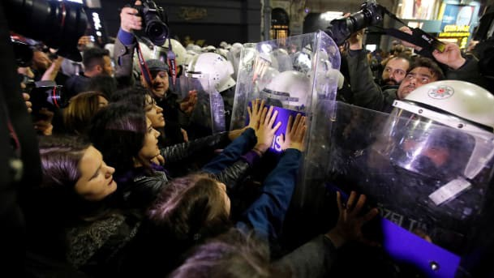

### AYS Daily Digest 08/03/2019: 54 persons granted refugee status and 74 subsidiary protection in Serbia since 2008

> 24 asylum applications were upheld in Serbia in 2018 // Under 10,000 people on the move arrived in Europe via sea this year // Hate speech and fear mongering in Bosnia // One person found dead in France … 

Istanbul, March 8th\. Photo by Reuters\.
### Feature

In the period 1 January — 30 November 2018, 7,651 persons expressed in\- tention to seek asylum and to submit an asylum application, according to the official number obtained by the Belgrade Centre for Human Rights \(BCHR\) for their annual [report](http://azil.rs/en/wp-content/uploads/2019/02/Right-to-Asylum-2018.pdf) on the right to asylum in the Republic of Serbia\.

This represents an increase compared to 2017, when 5,702 persons were registered as potential asylum seekers\.

“Of the number of persons who expressed intention to seek asylum and to submit an asylum application in Serbia in 2018, 6,776 were men and 875 were women\. According to the age structure, 2,200 were children of whom 666 unaccompanied and separated children,” the reports claims\.

The BCHR noticed that the figure of 7,651 issued certificates “does not reflect a realistic number of persons who genuinely wish to start an asylum pro\- cedure in Serbia”\. Out of this number, only 292 applied for asylum in Serbia, while the Asylum Office managed to conduct 151 interviews\.

> In all, 24 asylum applications were upheld, while 10 people were granted refugee status \(people from Afghanistan and Iran\), and 14 subsidiary protection \(Libya, Bangladesh, Pakistan, Syria and Somalia\) \. 

Based on these figures, the BCHR assumes that Serbia continues to be a country of transit for many people who formally express the intention to seek asylum\.

_“Often times, registration certificates are used for temporary regulation of legal status of these persons as well as for accommodation purposes\. In other words, the intention to seek asylum is also expressed by the foreigners who do not wish to seek asylum in Serbia, but legalise their stay pending departure to some other country\.”_

This practice, according to BCHR, _“puts an excessive burden on the asylum system and makes it impossible for the competent bodies to deal, without delay, with the cases of asylum\-seekers who perceive Serbia as a country where they wish to be granted asylum, take up residence and integrate in”\._

They call for the better system, stating that _“foreigners who do not see Serbia as a country of asylum certainly need to be assisted on humanitarian grounds, but need not necessarily be taken into the asylum procedure”\._

Additionally, 38 applications for 45 persons were dismissed on merits \(mostly for the people from Pakistan and Ghana\), and 20 asylum applications for 21 persons were rejected \(mostly for people from Afghanistan and Pakistan\) \.

The procedures were suspended in 126 cases for 176 persons, most often because the asylum\-seekers had left Serbia or the place of residence in that time\.

> “The Asylum Office granted refugee status to 54 persons and subsidiary protection to 74 persons since establishment of the national asylum system in 2008 and until 30 November 2018\.” 

During 2018, an increase in the number of people coming from Iran and India was noticable in Serbia, as well as the rest of the Balkans\. The main reason for this is the decision by the government of Serbia to abolish visas for the nationals of these two countries, which came into effect in September 2017\. However, on 25 October 2018, the government abolished a visa\-free system with Iran, with the explanation that the visa\-free regime was violated\.

The report is based on information the BCHR team collected while providing advice to asylum\-seekers and has been published with the support of the UN Refugee Agency\. It summarizes relevant figures and offers analyses of access to asylum for children, the application of the ‘Safe Third Country’ concept and material reception conditions in Serbia\.

Sonja Tošković, Director of the BCHR, [points out](http://www.bgcentar.org.rs/bgcentar/eng-lat/presentation-reports-human-rights-serbia-2018-right-asylum-republic-serbia-2018/) that the most important development in 2018 was the adoption of new laws on Asylum and Temporary Protection, on Foreigners and on Border Control\. The endorsement of the Asylum and Temporary Protection law has given persons under subsidiary protection the same rights as those with refugee status, the report says\.

The BCHR, which made proposals for the drafting of the new legislation, finds that the new laws have achieved an improvement of the asylum system\. However, they note that most of the actions taken by the government in the field of refugee protection are focused on humanitarian aid and accommodation, whereas structural solutions and clear migration policies have not been implemented\.

According to the latest data from Serbia, in February, 819 people were registered as new arrivals in Serbia, includuing 153 unaccompanied/ separated children\. At the moment, 3,898 people are living in 19 centers, while it is estimated that the total number of refugees and migrants in Serbia at the end of February was 4,330\.
#### GENERAL

IOM reports that since the beginning of the year, just under 10,000 people on the move arrived in Europe via sea\. This is 13% less than the same time period last year\. 229 people have already lost their life attempting the journey

[ECRE reports](https://mailchi.mp/ecre/ecre-weekly-bulletin-08032019?e=c131869ccd&fbclid=IwAR3Qb3YkCxEtYcDKjxLqYUEjwBKJ26G-fn7ujXjoTMSNacmKkW_HC-8LFuY) on a discussion of the EU Turkey agreement at EU agenda on Migration\. It is believed that 322 people have been returned to Turkey from Greece since the deal was signed in March 2016\. It is believed approximately 5000 people were assisted to return ‘voluntarily’\. In agreement on the conditions of the deal, the EU has accepted 7000 Syrian refugees from Turkey\. Despite 1\.5 million Syrian refugees currently residing in turkey, only 143000 of them are living in camps\.

The EU is supporting 1\.5 million Syrian refugees who reside outside of camps with ‘a social safety net’ of a mere 20 euros per month\.
#### SEA

_Converted [Medium Post](https://medium.com/are-you-syrious/ays-daily-digest-08-03-2019-54-persons-granted-refugee-status-and-74-subsidiary-protection-in-28a0068ee5c3) by [ZMediumToMarkdown](https://github.com/ZhgChgLi/ZMediumToMarkdown)._
