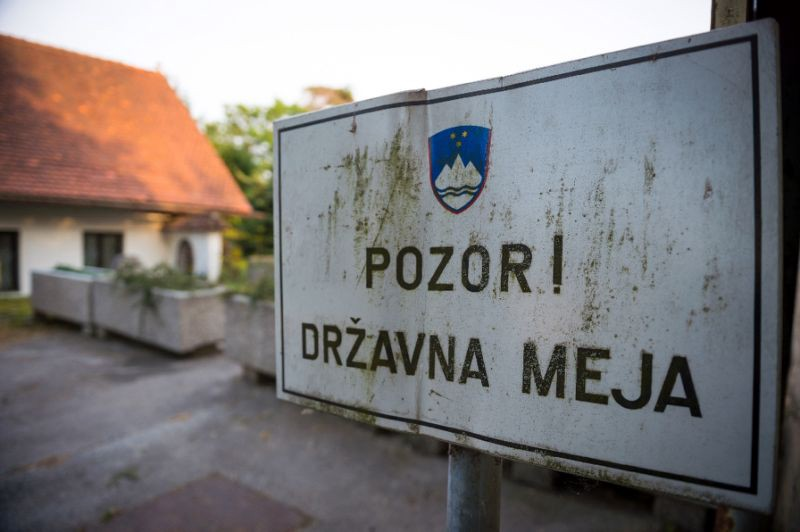

### **AYS SPECIAL: Slovenia faced with serious irregularities and corruption accusations in its politics of border control**

_Since 1995, Slovenia granted 818 people with asylum status\. Today, people from Iran or Afghanistan do get asylum in Slovenia, but for people from Algeria, Morocco or Pakistan, rejection rate is 100 percent\._

State border, Slovenia\. By PBS Slovenia\.

A recently published [report](https://www.asylumineurope.org/news/01-03-2019/aida-2018-update-slovenia) on asylum in Slovenia, prepared by the Legal Informational Center for NGOs \(PIC\), shows a significant increase in the rejection rate in asylum procedures in the country, rising from 36 percent in 2017 to 51 percent in 2018\. While the number of people seeking asylum in 2018 also doubled in comparison to 2017 \(while still remaining relatively low with 2875 applications\), the increase in rejection rate indicates that the country continues with its historically restrictive asylum policy which brought asylum status to only 818 people between 1995 and 2018\.

If today for people from Iran or Afghanistan getting asylum in Slovenia is still a possibility, this is out of reach for those coming from Algeria, Morocco or Pakistan, where rejection rate is 100 percent\.

If obtaining asylum in Slovenia is difficult, so is access to the asylum procedure\. Since the summer 2018 numerous reports have been published by the media and the NGOs which expose migrants’ testimonies of being sent to Croatia after being denied access to asylum procedure in Slovenia, a practice illegal under international law\.

While the police and the Ministry of the Interior have continuously denied these allegations, the available statistical data also raises numerous doubts, showing a significant decrease in the number of people seeking asylum between May and June 2018\. For example: while in May 2018 the police station in the town Črnomelj processed 379 persons out of which 371 expressed intent to seek asylum \(97,88 percent\) this number falls to only 13 persons out of 412 in June 218 \(3,15 percent\), a trend which has continued till the end of the year\.

This statistical data is of concern also to the Slovenian Human Rights Ombudsman which in mid\-February 2019 presented a long awaited [report](http://www.varuh-rs.si/medijsko-sredisce/sporocila-za-javnosti/novice/detajl/varuh-o-zahtevi-za-oceno-ustavnosti-uredbe-o-hrupu-in-ravnanju-policistov-na-juzni-meji/?cHash=01f3753d10cfc268a8ef4d79dce85363) on the conduct of the police with people seeking international protection at the southern Slovenian border\.

Although the report did not officially neither confirm nor reject the allegations against the police, it nevertheless pointed out that _“there may have been irregularities in some police procedures, including the implementation of collective expulsions prohibited under Article 4 of Protocol №4 in the European Convention for the Protection of Human Rights and Fundamental Freedoms\.”_

> The Human Rights Ombudsman expressed concern over the lack of information and transparency in the police documentation which could confirm that individuals’ circumstances were sufficiently taken into account during the border procedure, and that the person’s intent to seek asylum was not denied\. 

The police expressed surprise over the conclusions of the report and continued to deny the allegations, pointing out that their work is transparent and done in accordance with the law\. The question therefore remains why are they not willing to disclose the instructions sent by the former police director in May 2018, just before the decrease in the number of asylum seekers?

Although the Information Commissioner instructed the police to disclose all the documents used for processing of migrants and asylum seekers at the border, police is currently challenging this decision in court\.

Despite all the existing reports which seriously question the legality of the border procedures it seems that since the last summer the police practice \(based on the instructions coming from the state institutions\) has not significantly changed\.

The testimonies of people being denied access to asylum in Slovenia continue to be reported by the media and by [the organizations in Velika Kladuša](https://www.nonamekitchen.org/en/violence-reports/) \. In no way do these reports challenge the country’s migration and asylum policies, nor does the change of government after the elections in the summer 2018\.

> The current government continues with the politics of border control and migration management, which in practice translates to the closing of the borders, to the on\-going irregularities in police procedures and to the increase in public spending for reinforcement of border protection, such as the new equipment for the police or the construction of a new fence — the latter which started just before the end of last year\. 

This is merely the extension of the fence set up already in 2015 as part of the government’s strategy to stop irregular migration to Slovenia and the EU\. However, the fence’s main results were creation of the new and more dangerous migration routes, the increase in number of migrants dying in the border river Kolpa, the flourishing of smuggling networks and the destruction of the natural and animal habitat\. Nevertheless, this has not prevented the government to proceed with the construction of the fence, nor have the recent reports which point to the possible corruption behind its public procurement\.

A week ago, the organization Transparency International Slovenia filed a court case against Anton Zakrajšek, the director of the Agency of the Republic of Slovenia for Commodity Reserves, who was responsible for the procurement of the fence in 2015, in cooperation with the head of the government at the time Miro Cerar, the former Minister of the Interior, Vesna Gyerkeš Žnidar, and the Minister of the Economic Development and Technology, Zdravko Počivalšek\. The contract, worth more than a million euro, and signed between the agency and at the time a relatively unknown company Minis, was classified as secret, leaving the public without any information about the procurement procedure and the spending of the public funds\.

Following the decision of the Information Commissioner, however, Transparency International Slovenia was able to gain access to the contract, exposing numerous irregularities\.

Not only was Minis a small and unknown company with an average annual income of no more than 10\.000 euro, but it was registered at the same address as the local branch of the leading political party \.

Moreover, the details of the contract reveal that the company was to receive a 70 percent of the financial advance if they would deliver the fence on the same day the contract was signed\. This shows that the deal was most probably made in advance, as having this amount of fence in stock would have been a huge financial risk for a small company\.

Despite numerous doubts raised by the media already in 2015, this was not the only contract signed between Minis and the agency\.

According to the news reports, in the last three years, Minis received more than 9 million euro from state institutions\.

A court case against the company has also been filed but for now, none of the ministers involved in the procurement procedures have been called to court\. Meanwhile, the construction of the fence continues\.

**_\(By Barbara V\. , an independent volunteer in Slovenia\)_**

**Apart from daily news in English, we also publish weekly summaries in [Arabic](%D8%A7%D9%84%D8%AA%D8%BA%D9%8A%D9%8A%D8%B1%D8%A7%D8%AA-%D9%81%D9%8A-%D9%82%D8%A7%D9%86%D9%88%D9%86-%D8%A7%D9%84%D9%84%D8%AC%D9%88%D8%A1-%D9%81%D9%8A-%D8%A7%D9%84%D8%AF%D9%86%D9%85%D8%A7%D8%B1%D9%83-b99e429d54ad) and [Persian](%D8%B9%D9%88%D8%B6-%D8%B4%D8%AF%D9%86-%D9%82%D9%88%D8%A7%D9%86%DB%8C%D9%86-%D9%BE%D9%86%D8%A7%D9%87%D9%86%D8%AF%DA%AF%DB%8C-%D8%AF%D8%B1-%D8%AF%D8%A7%D9%86%D9%85%D8%A7%D8%B1%DA%A9-7b984cac7a86) \. Follow the links to read and share the ones from the week of March 4–10\.**

**We strive to echo correct news from the ground through collaboration and fairness\. Every effort has been made to credit organizations and individuals with regard to the supply of information, video, and photo material \(in cases where the source wanted to be accredited\) \. Please notify us regarding corrections\.**

**If there’s anything you want to share or comment, contact us through Facebook or write to: areyousyrious@gmail\.com**

_Converted [Medium Post](https://medium.com/are-you-syrious/ays-special-slovenia-faced-with-serious-irregularities-and-corruption-accusations-in-its-politics-8aecebd6b102) by [ZMediumToMarkdown](https://github.com/ZhgChgLi/ZMediumToMarkdown)._
