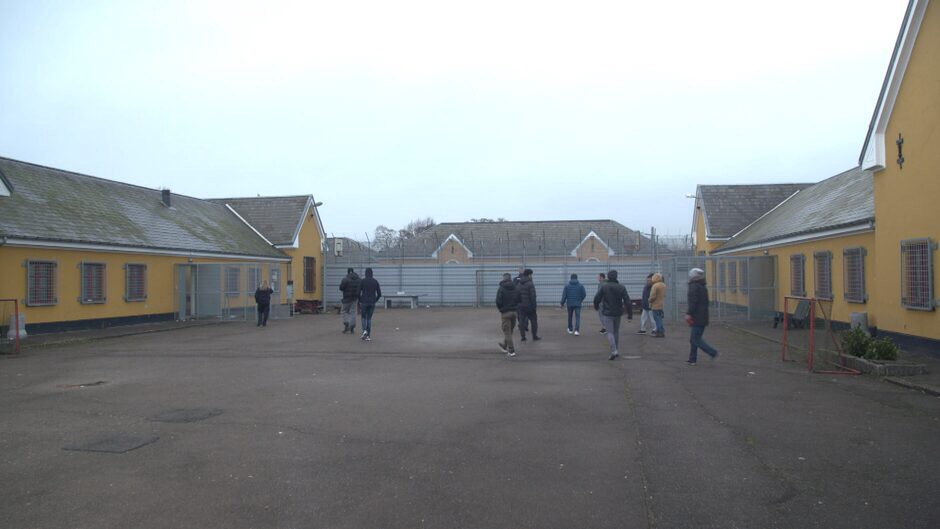
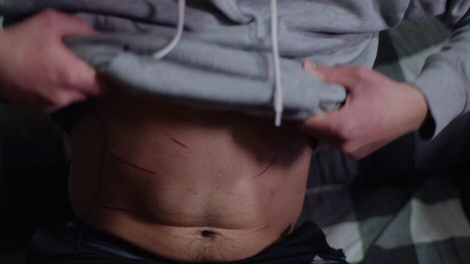
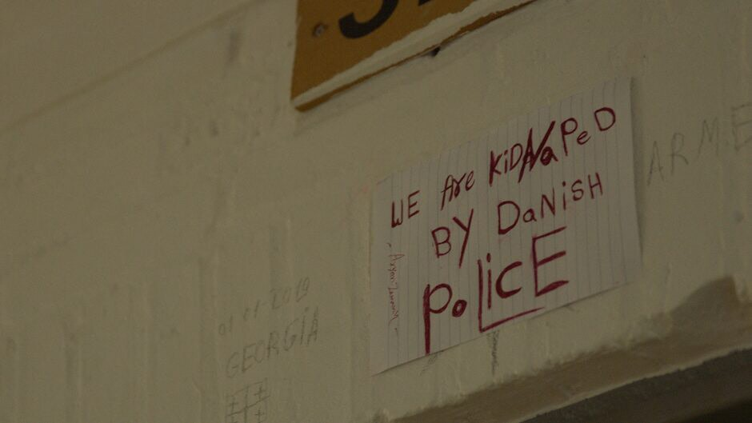

### AYS SPECIAL FROM **ELLEBÆK DEPORTATION CAMP: Denmark’s forgotten, closed prison**

_For the first time ever a large Danish mainstream news channel TV2 was granted permission to film inside Ellebæk prison where, at the moment, 109 people are waiting deportation\._

The court yard in Ellebæk where residents have a right to spend time 3 times a day\. Ph _oto: Ole Jakobsen / TV 2_

Ellebæk is a closed deportation camp for rejected asylum seekers where currently 109 people are incarcerated\. The majority of them spend only a short period of time in the center, while the others are staying several months, and some more than a year\. The time limit is a 1,5 years\.

Due to the little publicity and lack of common knowledge of this ‘migrant prison’ Gert Hansen, union representative for the prison guards, is referring to Ellebæk as a [“forgotten closed prison”\.](http://nyheder.tv2.dk/2019-03-10-afviste-sidder-indespaerret-i-ellebaek-i-op-til-halvandet-aar-det-her-havde-jeg-aldrig?cid=tv2.dk:Afviste%252520sidder%252520indesp%2525C3%2525A6rret%252520i%252520Elleb%2525C3%2525A6k%252520i%252520op%252520til%252520halvandet%252520%2525C3%2525A5r%25253A%252520-%252520Det%252520her%252520havde%252520jeg%252520aldrig%252520troet%252520om%252520Danmark:article)

Nevertheless, local TV station menaged to have access and to publised series about the life inside of this prison in the TV show [“Ellebæk: the rejected that will not return” \(Ellebæk: de afviste der ikke vil hjem\)](https://play.tv2.dk/programmer/nyheder/serier/minidoks/ellebaek-de-afviste-der-ikke-vil-hjem-183205/?cid=tv2.dk:Minidoks%25253A%252520Elleb%2525C3%2525A6k%252520-%252520De%252520afviste%25252C%252520der%252520ikke%252520vil%252520hjem:article) \. [The documentary made by TV2](http://nyheder.tv2.dk/2019-03-10-afviste-sidder-indespaerret-i-ellebaek-i-op-til-halvandet-aar-det-her-havde-jeg-aldrig?cid=tv2.dk:Afviste%252520sidder%252520indesp%2525C3%2525A6rret%252520i%252520Elleb%2525C3%2525A6k%252520i%252520op%252520til%252520halvandet%252520%2525C3%2525A5r%25253A%252520-%252520Det%252520her%252520havde%252520jeg%252520aldrig%252520troet%252520om%252520Danmark:article) portrays decaying physical conditions of the prison\.

Up to four people share the same room\. Rooms with holed walls and electrical wires sticking out of them\. People are served heated microwave dishes, mobile phones are banned, and they are only allowed outside in the courtyard three times a day\. [There is an increasing number of documented use of force by prison guards and use of several days’ long isolation of detainees\.](http://nyheder.tv2.dk/samfund/2019-03-10-tv-2-fik-adgang-til-udlaendingecenter-som-de-foerste-her-bor-de-afviste-og-det)

Most worrying is the psychological torture the residents endure whilst incarcerated\. Often they do not understand the reason for the incarceration in the first place\. Being separated from friends and family, and the constant stress of not knowing when the police forcefully might put you on an airplane and deport them, is psychological torture\.

_Self\-harming: Cuts from razorblades\. Photo: Ole Jakobsen / TV 2_

Researchers, Suarez\-Krabbe, Lindberg and Arce\-Bayona, behind the report on Danish deportations centres “Stop Killing Us Slowly”, writes:

_“Deportation centres in Denmark should be understood as an expression of state\-sanctioned racism implemented by law: they produce the slow death of rejected asylum seekers\. Additionally, the Danish legislation is increasingly being used to deprive specific groups of citizens and non\-citizens of their basic rights, or to establish hierarchical differences between Danish first and second\-class citizens by law_ ” \( [p\. 48 Stop killing us slowly](http://refugees.dk/media/1757/stop-killing-us_uk.pdf?fbclid=IwAR3ANKsrrqJg5UzcaZiyEAv77Qk0kQfIci76DX6xU1V_6x93-6zxoAJJG-0) \)

**Officially, imprisoning rejected asylum seekers in Denmark holds two main objectives:**
1. _To enforce deportation of people that are deemed to be in risk for absconding_

This includes: people facing a forced deportation, people whose deportation case is being decided upon, people the police judge as being ‘non\-collaborative’ in regards to the investigation of their case, people who refuse deportation\.

Rejected asylum seekers are living in Denmark under the constant fear of being detained in Ellebæk, without understanding when, how and why\.

2\. _To ‘motivate’ people to collaborate on their deportation to the country they have fled_

The idea of ‘motivating’ people to return to they so\-called “country of origin” is the logic used in the entire deportation discourse and policies led by immigration minister Inger Støjberg\. Støjberg repeatedly states the need to make the conditions for rejected asylum seekers as intolerable as possible\. [As research has shown](http://refugees.dk/en/focus/2016/april/asylum-seekers-locked-up-like-criminals/?fbclid=IwAR3LFdxWhn9vr_vNOt-eB9dO1a-XUGvRXqE2ppjLpS0pJOPNV-_TX5R_JzA) this strategy does not make people who have fled for their lives sign their own deportation to a country where there lives could be in danger\. Instead, people are mentally broken down whilst waiting years in Denmark\.

**Especially, the incarceration of survivors of torture and people already suffering mental health issues has received criticism from several human rights organisations, including [Amnesty International](https://amnesty.dk/media/1874/frihedsber__vede_asylans__gere_i_elleb__k_2013.pdf?fbclid=IwAR0NMmMRvomSGPmEepnGHKUIBvN-YBJuU9NKeD4XdTyUeuZbOTAngC0ZmaA) and [Danish institute for human rights](https://menneskeret.dk/files/media/dokumenter/udgivelser/status/2014-15/status_uk_2015.pdf)**

In 2013, a [report produced by Amnesty International](https://amnesty.dk/media/1874/frihedsber__vede_asylans__gere_i_elleb__k_2013.pdf?fbclid=IwAR0NMmMRvomSGPmEepnGHKUIBvN-YBJuU9NKeD4XdTyUeuZbOTAngC0ZmaA) following a study on detainees inside Ellebæk conducted by a group of Danish doctors states, _“the current legislation and guidelines do not ensure, that particularly vulnerable groups are not incarcerated in Ellebæk_ ”\. This has not changed\.

The founder and chairwoman of Refugees Welcome\.dk, Michaela Bendixen, wrote [a report on the Danish detention centres in 2016\.](http://refugees.dk/en/focus/2016/april/asylum-seekers-locked-up-like-criminals/?fbclid=IwAR3LFdxWhn9vr_vNOt-eB9dO1a-XUGvRXqE2ppjLpS0pJOPNV-_TX5R_JzA) The report includes a series of witness statements highlighting the mental health consequences closed detention centres have on the human beings locked up in them\. People who did not show signs of mental health issues prior to entering detention, developed serious signs of anxiety and stress in Ellebæk prison\.

**_“This place plays with your mind\. You come in as normal and you leave as crazy,_** _”_ Amine Chebane, detained in Ellebæk Prison said\.

Earlier this week, prison priest, Per Bohlbro [said in an interview with TV2](http://nyheder.tv2.dk/samfund/2019-03-12-faengselspraest-gennem-10-aar-staar-frem-for-foerste-gang-folk-gaar-langsomt-i?fbclid=IwAR2JMlQDQxoQ4-51mFnRaCiVi7o5QM4AQl2N8v8j44OraraiiDHODuHs-iM) concluding that ”i _f the rejected asylum seekers are not already mentally ill when they arrive to Ellebæk, there is a high risk that they are so, when they leave the controversial deportation camp”\._

The documentary showen this week in denmark is a clear portrait, backed by witness statements, activists and people employed in the prison, that the conditions have not improved in spite of the criticism directed to the authorities from the human rights organisations\. Rather the conditions have deteriorated\. Just one example: as a response to a high number of attempted suicides, with people trying to hang themselves in the water pipes, [the water pipes were merely sealed off](http://nyheder.tv2.dk/2019-03-10-afviste-sidder-indespaerret-i-ellebaek-i-op-til-halvandet-aar-det-her-havde-jeg-aldrig?cid=tv2.dk:Afviste%252520sidder%252520indesp%2525C3%2525A6rret%252520i%252520Elleb%2525C3%2525A6k%252520i%252520op%252520til%252520halvandet%252520%2525C3%2525A5r%25253A%252520-%252520Det%252520her%252520havde%252520jeg%252520aldrig%252520troet%252520om%252520Danmark:article) \.

Whilst detention inside Ellebæk cannot extend 1\.5 years, life in Danish detention centres has no time limit\. Some of the people inside Ellebæk prison, cannot be deported as long as they do not ‘collaborate’\. This includes people from Iran, Iraq and stateless people\.

_‘We are kidnapped by danish police’\. Photo: Ole Jakobsen / TV 2_

The term “to collaborate” means to agree to voluntarily return to the country of origin, which you have fled\. The fact that Denmark does not acknowledge a need for protection for a specific human being does not necessarily mean that the individual does not have a need for protection\. Why should a human give up fighting for the life by signing a deportation agreement?

It is worth mentioning that [the acceptance rate for asylum seekers from Iraq, Afghanistan and Somalia is significantly lower than in many other European countries\.](http://nyheder.tv2.dk/2019-03-10-afviste-sidder-indespaerret-i-ellebaek-i-op-til-halvandet-aar-det-her-havde-jeg-aldrig?cid=tv2.dk:Afviste%2520sidder%2520indesp%25C3%25A6rret%2520i%2520Elleb%25C3%25A6k%2520i%2520op%2520til%2520halvandet%2520%25C3%25A5r%253A%2520-%2520Det%2520her%2520havde%2520jeg%2520aldrig%2520troet%2520om%2520Danmark:article)

The other two deportations camps, Sjælsmark and Kærshovedgård, function as open prisons\. The residents here are in theory free to leave the centre as they please, yet obliged to sleep at the centre every night and register themselves in between 3–5 times a week\. Those the Danish authorities do not manage to forcefully deport will be ‘released’ to either Kærshovedgård or Sjælsmark\. Here they will carry on a life with a constant threat of being returned back to the detention center Ellebæk\.

[")](https://vimeo.com/322860048)

In order to ‘motivate’ people to ‘collaborate’, it is common procedure to separate families\. Often it is the father who is detained in Ellebæk, while the remaining family member stay in Sjælsmark deportation camp\. TV2 documentary reports about Rashed Alenazi who is stateless Kuwaiti\. He has spent 3 months detained in Ellebæk prison, whilst his wife and their 6 children live in Sjælsmark\. As they are stateless they cannot be deported, yet Danish authorities believe them to be Iraqi, which Rashed and the Iraqi authorities refuses\.

“ _In a way, residents who are legally stranded in Denmark, are also physically stranded there\. Even if they leave the deportation centres, they risk detention for failure to register with authorities; and should they cross its borders, they risk being deported back, and Denmark effectively becomes their ‘open prison’\.”_ \(p\. 23 [; Stop killing us slowly](http://refugees.dk/media/1757/stop-killing-us_uk.pdf?fbclid=IwAR3ANKsrrqJg5UzcaZiyEAv77Qk0kQfIci76DX6xU1V_6x93-6zxoAJJG-0) \)

**The local refugee rights activist and the refugees themselves are trying with the momentum of the media coverage of the otherwise silenced and collectively forgotten prison Ellebæk to mobilize widely\.**

**Follow the links to see the upcoming actions and events\.**

**_\(Written by E\. Kass and C\. Lynge, AYS Info Team volunteers\)_**

**We strive to echo correct news from the ground through collaboration and fairness\.**

**Every effort has been made to credit organizations and individuals with regard to the supply of information, video, and photo material \(in cases where the source wanted to be accredited\) \. Please notify us regarding corrections\.**

**If there’s anything you want to share or comment, contact us through Facebook or write to: areyousyrious@gmail\.com**

_Converted [Medium Post](https://medium.com/are-you-syrious/ays-special-from-elleb%C3%A6k-deportation-camp-denmarks-forgotten-closed-prison-bc7b5aa587f8) by [ZMediumToMarkdown](https://github.com/ZhgChgLi/ZMediumToMarkdown)._
