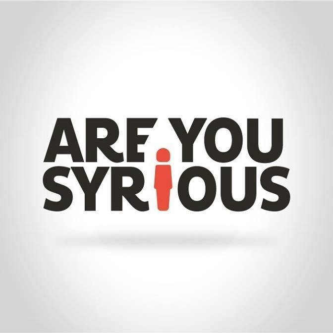
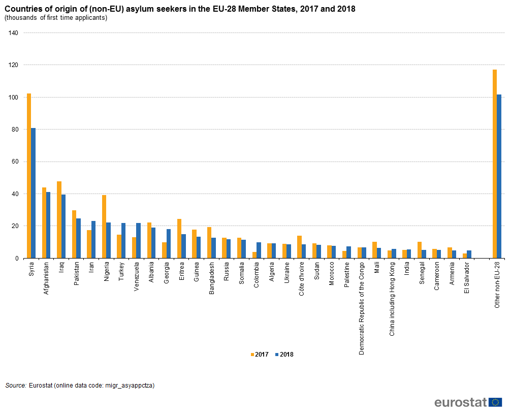
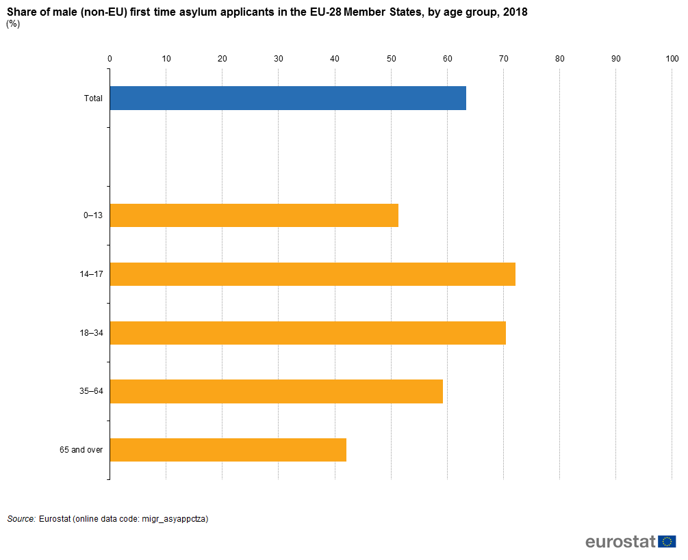
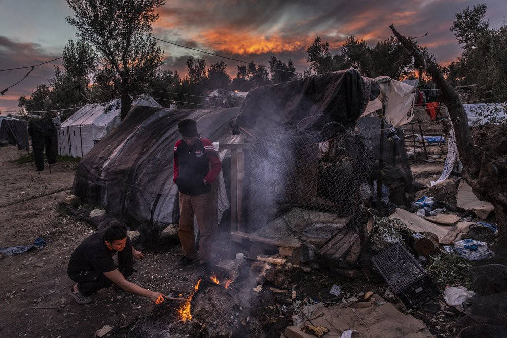
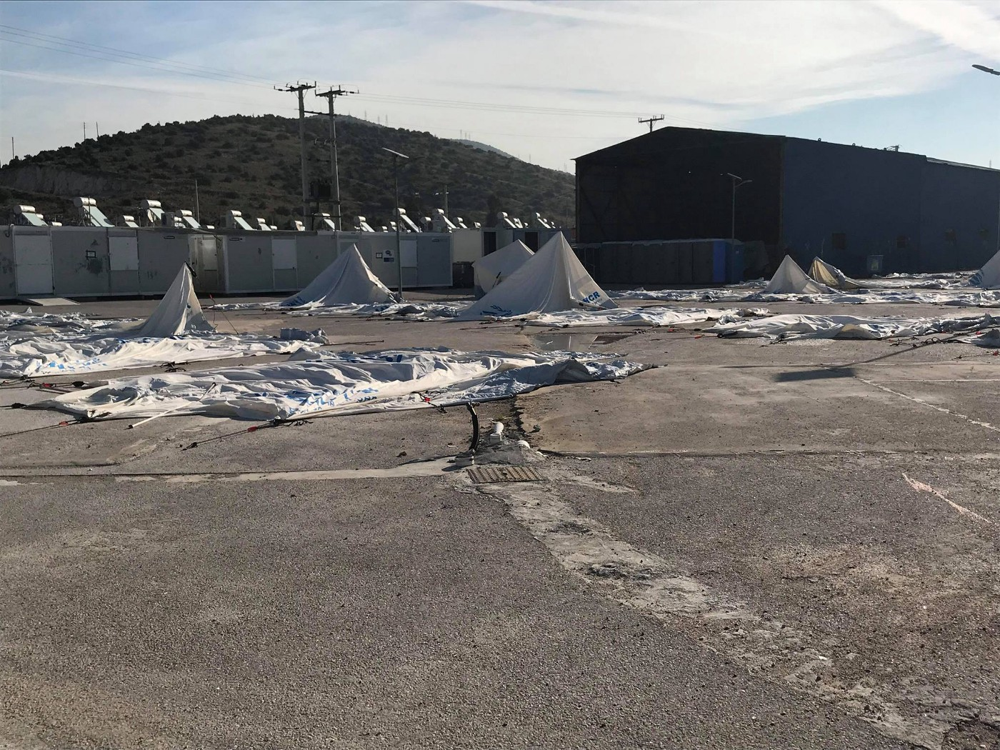

### DAILY DIGEST 14/3/2019: 122,000 people granted refugee status in EU in 2018

[Are You Syrious?](https://medium.com/@AreYouSyrious)

Mar 15

_The highest number of positive first instance decisions were recorded in Ireland and Luxembourg // Protests in Algeria are still going on // 45 people died while crossing the Mediterranean to Spain // Another money transfer from the EU to Turkey, a day before another anniversary of the controversial deal// Pushback from Bosnia// Evictions in France_

 \.](assets/ebb62d11ad2d/1*gF8pyh4X3eQ0Vo9lVqbg3g.jpeg)

Lesvos\. ReFOCUS Artists of the Week: REZA ADIB & JAVAD MOUSAVI\. [1976km](https://www.facebook.com/refocusmedialabs/photos/pcb.2474334386130109/2474334206130127/?type=3&theater) \.
### Feature

The [latest statistics by the EU statistical office Eurostat](https://ec.europa.eu/.../eca81dc5-89c7-4a9d-97ad...) show that in 2018, a total of 122,000 people were granted refugee status; 63,000 were given subsidiary protection status; and 33,000 authorisation to stay for humanitarian reasons\.

In percentage terms, 37 per cent of EU first instance asylum decisions resulted in positive outcomes\.

In the same period of time, during 2018, a total of 580,800 first\-time asylum applications were filed in the EU\.

_The highest number of positive first instance decisions were recorded in Ireland \(86 %\) and Luxembourg \(72 %\), while France, Estonia, Spain, Latvia, Poland and Czechia each recorded first instance rejection rates between 71 % \(France\) and 89 % \(Czechia\) \._

Asin previous years, since 2014, the main country of origin of asylum seekers is Syria \(14%\), a country where war is stil raging\.

Germany is still the country where applications for asylum are lodged most often \(28 per cent of all first\-time applications\), followed by France, Greece, Spain and Italy\.

_While the number of asylum applications across Europe has dropped, the number of asylum applications filed in Greece has increased\. In Lesvos alone, the number of asylum applications more than tripled between 2016 \(5,000 applications\) and 2018 \(17,270 applications\) \._

Nevertheless, during 2018, many people applied in Cyprus \(8,805, which is the highest number of first time applications relative to the population\), as well as in Belgium and the Netherlands\.

The lowest number of first time applications relative to the population is in Slovakia \(28\), Poland \(63\), Hungary \(65\), Estonia \(68\), and Latvia \(91\) \.

At the end of last year, there were fewer than 900,000 asylum applications made at any time still under consideration by the national authorities\. Germany had the largest share of applications pending in the EU \(384,800\), ahead of Italy \(103,000\), Spain \(78,700\) and Greece \(76,300\) \.

Among the most numerous groups of citizenship of first\-time asylum applicants in the EU were Venezuelans, Georgians, Turks, Iranians and Colombians\. Some 19 thousand Venezuelans applied for protection in Spain\.

Four in five \(79 per cent\) of first\-time asylum seekers were under the age of 35\. Of the total number of applicants, nearly one\-third of the total number were minors\. It is interesting that in the case of Hungary, Austria, Germany and Poland, a higher proportion of asylum applicants under the age of 18 was recorded\.

Additionally, statistical data show that among first\-time asylum applicants there were more men than women\.

### Algeria

Protests in Algeria are still going on, and are spreading not only inside the country, but in countries where the Algerian diaspora lives, mainly France\.

Algerians are protesting against President Abdelaziz Bouteflika, who has been ruling the country for 20 years and plans to continue\. This week, the 82\-year\-old Bouteflika abandoned plans to seek a fifth term but also cancelled next month’s presidential election without setting a new date\. People called this deal unconstitutional, and continue with the protests demanding that he step down now, or at the latest when his current term ends next month\.

However, France, as well as other EU countries, are very quiet about what is happening in Algeria\. We have to remind our readers that the number of people fleeing this country and seeking asylum is very high in Europe, but only rarely are they granted asylum or legal status\.

While the number of people who are leaving Algeria is rising, the EU member states are reluctant to grant asylum or even allow their stay and more and more rejected asylum\-seekers are being sent back to Algeria\.
### Morocco

Last night, 45 people died while crossing the Mediterranean to Spain\. A pregnant woman is among the dead\.

Moroccan marines rescued 22 survivors, all of whom are in a critical state\.

_“Survivors told me they had about 13 women on board\. Many were pregnant,”_ Helena Maleno, who runs the Tangiers\-based group Walking Borders told the media\. _“There was also one young girl, between 12 and 14 years old, who didn’t survive\.”_

> 226 people have died crossing the Mediterranean into Europe so far this year\. 

> 2,277 people died making the crossing last year\. 

> The UN says crossing the Mediterranean has become more dangerous after Italy blocked rescue ships from docking\. 

### Turkey

After Turkey threatened again to open its border for refugees who aim to reach the EU, Brussels announced the transfer of an additional 1\.5 billion euro grant for Syrians in this country\.

_“I would like to confirm that we will transfer a 1\.5 billion euro grant out of the second 3 billion euro for Syrians in Turkey,”_ EU foreign policy chief Federica Mogherini said\.

Mogherini announced this at the opening of a conference on Syria organized by the EU and the UN in Brussels\.

Turkey hosts more than 3\.5 million Syrian refugees, more than any other country in the world\.

Financial support to Turkey is part of the so\-called EU\-Turkey deal signed in March 2016, which sealed the European borders and made the journey for all the people on the move even more difficult\.

The EU is obliged to pay Turkey 6 billion euros in financial aid\. The agreement also envisages acceleration in Turkey’s EU accession talks and visa\-free travel for its citizens\.
### Italy

The [UN human rights experts are warning](https://www.ohchr.org/EN/NewsEvents/Pages/DisplayNews.aspx?NewsID=24323&LangID=E) that Italy must act urgently to protect hundreds of migrant workers evicted from an informal settlement called San Ferdinando in Calabria\.

The informal settlement, which housed about 2,000 people, was cleared by the authorities between 6 and 8 March\. \(See [AYS report about the eviction](ays-daily-digest-07-03-2019-italy-makeshift-camp-in-san-ferdinando-evicted-87b6acb6f885) \)

_“There is no doubt that conditions did not conform to human rights standards, and were abysmal and completely unsustainable, but we are deeply concerned about the absence of adequate alternative options for the people who were living in the informal settlement,”_ the experts said\.

**“The authorities failed to explore all alternative options to avoid the evictions, as required under international human rights law\.”**

[**Kesha Niya**](https://www.facebook.com/358467077831499/posts/857546141256921?sfns=mo) is looking for volunteers to drive cars, cut veggies and wash dishes \(plus chat in front of a fire at night, play music etc…\)

_“As usual our main language is English but we speak French and German as well\. Send us a message if you have 3 days, 2 weeks or even more than a month ahead of you and would consider joining us\!”_
### Greece

[**Aegean Boat Report**](https://www.facebook.com/285298881993223/posts/540375076485601?sfns=mo) records the arrivals of two boats on the Greek Aegean Islands\. The first boat arrived on Samos before first light with 48 people on board\. The second boat landed outside the university, Lesvos south, at 06\.30 with 45 people on board\.

Lesvos Photo by: Anna Pantelia/MSF

This week, more people were transferred from Lesvos to the mainland\. However, most of them are being sent to the existing camps where living conditions are not much better\. One of the camps that received people from Moria is Skaramangas, near Greece\.

Skaramangas by Trude Jacobsen

Volunteer with Dråpen i Havet [Trude Jacobsen writes on her FB](https://www.facebook.com/trude.jacobsen) about a huge riot police bus full of police with guns and protection, and at least eight buses with people from Lesvos who arrived on Thursday in the camp\.

“ _They probably dreamt of a different welcome\. They probably hoped for something else than tents on a cold and hard concrete ground\._

_It took several hours to move the buses with the people into the camp\._

_People should not have to live in refugee camps, in tents in Europe in 2019\. This is so fundamentally wrong\. We need to change the way people are treated like animals NOW\! \! \!”_
### Bosnia/Serbia

**Info Park mobile team** provided accurate information to a newly arrived family from Syria, comprising a woman, her 8\-month\-old daughter and a man\. They were sent to Serbia from Bosnia, although Serbia has never been their transit country\.

At the same time, AYS recived several items of information about push\-backs from Bosnia to Montenegro\. In some cases, people are forced to walk back over 40 kilometars, over the mountains that are still covered with snow\.

Additionaly, on Thursday, Info Park provided support to five boys from Afghanistan, two of them returned from Hungary and three from Croatia, after they failed to cross the borders irregularly\.
### Austria

Another deportation to Afghanistan from Austria has been announced for Tuesday, 19\.03\.2019\.

Current information about who is at risk and who is not at [fluechtlingsrat\-bayern\.de](http://fluechtlingsrat-bayern.de)
### France

Another eviction in Calais\.

This time, police have cleared the two largest settlements in Calais located near the Verrotieres Road\.

Like before, police tore up tents and shelters, forced people onto buses, and made preparations to seal off the area with metal fencing\.

The **Care4Calais** statement said:

“ _All roads and exits were blocked, people were rounded up and put on coaches, and tents and possessions cleared\. The police presence was heavy and intimidating\. This was the first area where people began to gather when they returned, months after the closure of the main ‘jungle’ camp in 2016\. Yesterday it was home to hundreds of refugees, with Africans predominantly on one side and Iranians predominantly on the other\.”_

[Read more](https://socialistworker.co.uk/art/48031/Police+clear+refugee+settlements+in+northern+France?fbclid=IwAR3J-9W2WJmCfyVTgsoqMAGCw1CAbC0X7ur3DpOdJxkCt0gZX2ATFeZu76o) about the eviction, and protests for open borders in the UK next week\.

Despite all the information about the terrifying living conditions for people on the move in Libya, the EU member states do not want to give up on supporting this system of oppression\. This week, French Defence Minister Florence Parly announced that her government would give six boats to the Libyan Coast Guard \(LCG\) \.

The boats will be used to intercept people attempting to cross the Mediterranean Sea\.

> “The EU’s efforts to prevent migrants leaving Libya for Europe significantly increase the risk that migrants will be exposed to abusive detention in Libya\. Providing material support to the LCG while being fully aware of these consequences implicates France’s responsibility for serious human rights violations\. 

> France should suspend delivery of its boats until Libyan authorities end the arbitrary detention and abuse of migrants\. And instead of fuelling a relentless cycle of abuse, France should work with the other EU Member States to maintain rescue operations at sea and allow disembarkation in a safe port as vulnerable people will continue to flee Libya’s horrors\.” [HRW states](https://www.hrw.org/news/2019/03/13/france-gifts-boats-abusive-libyan-coast-guard) \. 

[**Les Ami\.e\.s de la Roya**](https://www.facebook.com/261449857548269/posts/825902157769700?sfns=mo) announced on Thursday that seven people from the Roya Valley have been arrested after being picked up simultaneously at dawn at their home that has been raided\. These people are known for their volunteer activity to welcome migrants\.

[Donations needed](https://www.facebook.com/1756144974620923/posts/2354045071497574?sfns=mo) to bring back to Ethiopia the dead body of a man who died in Calais
### UK

Agroup of European NGOs, led by Baobab Women’s Project in collaboration with Refugee Rights Europe and TRP Solicitors, released an [updated report looking at the real\-life experiences of asylum\-seeking women in the UK](http://www.ein.org.uk/news/ngos-highlight-real-life-problems-faced-asylum-seeking-women-uk?fbclid=IwAR2GoQc154q7Y4okIzaXQ5fcVscsEGF0-200pyKHl2WUErhD-G0tW07dS44) \.

The report states: _“Asylum seeking women in the UK typically face a continuum of discrimination and violence\. Structural inequalities brought on by the current immigration system leave many women marginalised, destitute, and exposed to various forms of abuse\. Indeed, nationality and immigration status supersede women’s rights\. In this report, we aim to highlight why it is important for women to be recognised as people first and a nationality second\.”_
### General

Agroup of organizations in Europe has released a [joint statement](http://refugeerights.org.uk/…/Open-Letter-around-the-EU-Tur…) in anticipation of the 3rd anniversary of the EU\-Turkey Deal, on March 20th\.

They call on European leaders “to live up to Europe’s human rights foundation and values”, and to “urgently agree on fair and sustainable arrangements for sharing responsibility for asylum seekers arriving in Europe, that will ensure member states’ ability to provide decent and dignified conditions for people in need of protection”\.

[**Kiron**](https://kiron.ngo/navigator//?_ga=2.109870533.1918006505.1552636908-1037770616.1552636908) is a service provider in the field of education and tech that helps refugees to start or continue their studies with online courses\. At the moment, Kiron is supporting students living in our focus countries: Germany, Jordan and Lebanon\.

Kiron offers online courses in five study tracks on a Bachelor level as well as language and prep courses\.

**We strive to echo correct news from the ground through collaboration and fairness\.**

**Every effort has been made to credit organizations and individuals with regard to the supply of information, video, and photo material \(in cases where the source wanted to be accredited\) \. Please notify us regarding corrections\.**

**If there’s anything you want to share or comment, contact us through Facebook or write to: areyousyrious@gmail\.com**

_Converted [Medium Post](https://medium.com/are-you-syrious/daily-digest-14-3-2019-122-000-people-granted-refugee-status-in-eu-in-2018-ebb62d11ad2d) by [ZMediumToMarkdown](https://github.com/ZhgChgLi/ZMediumToMarkdown)._
