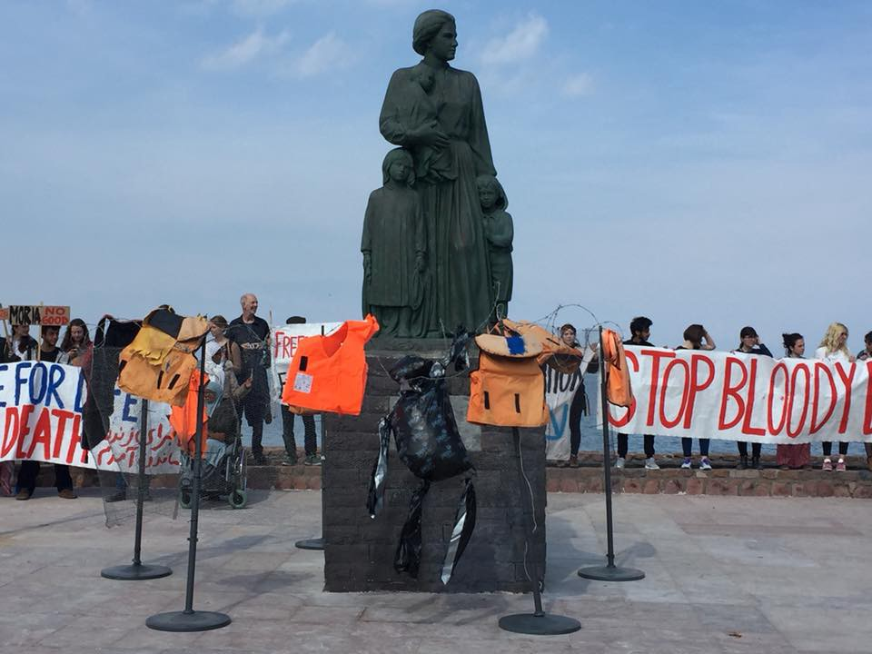
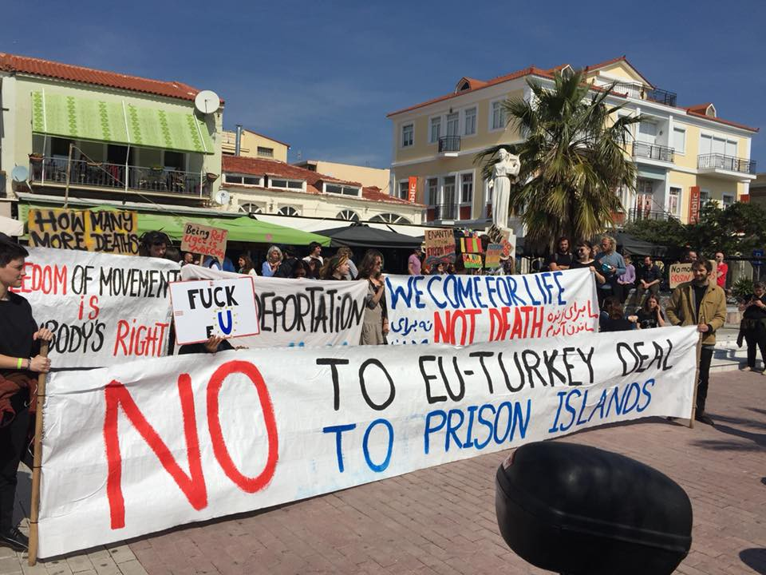
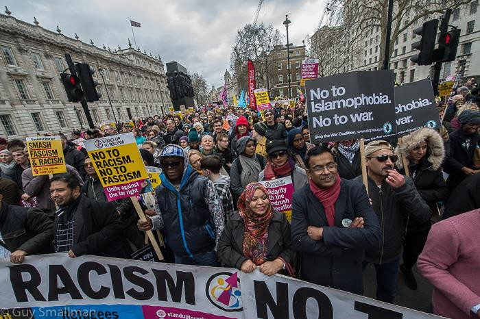
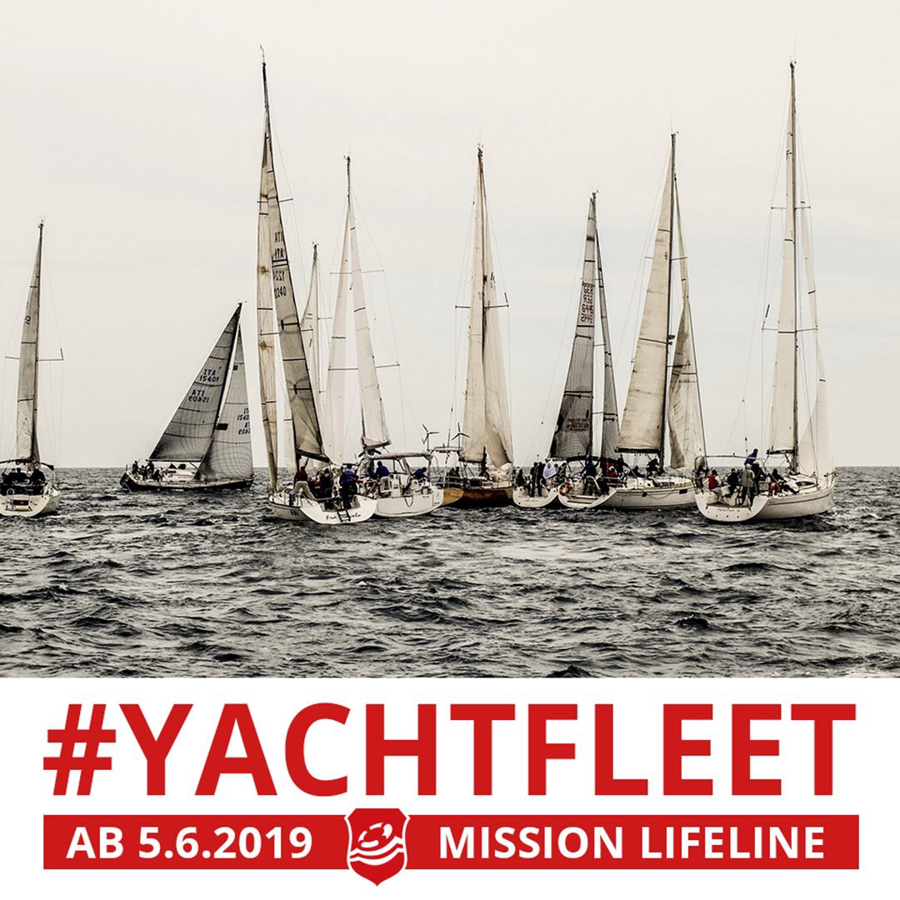
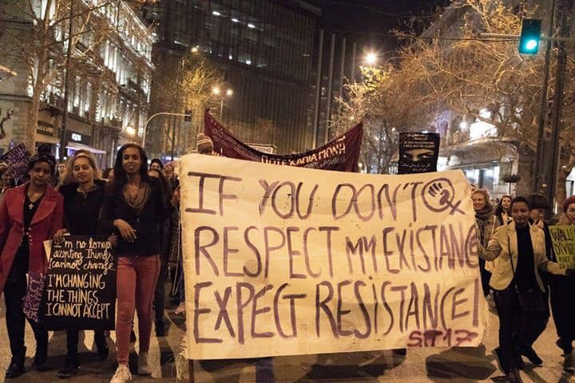
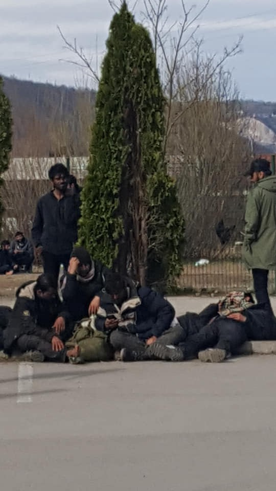
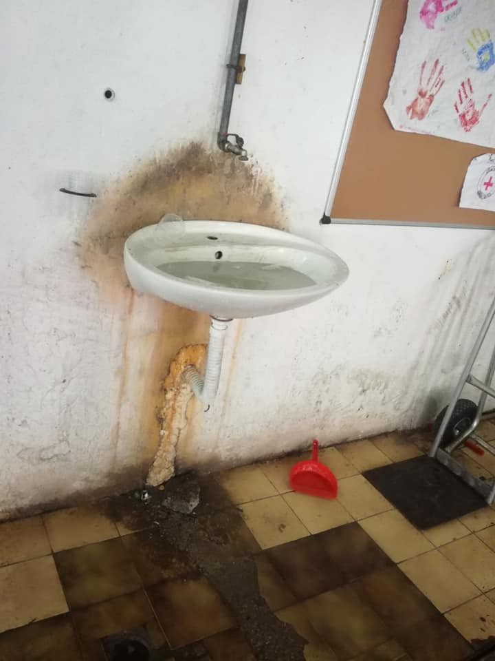
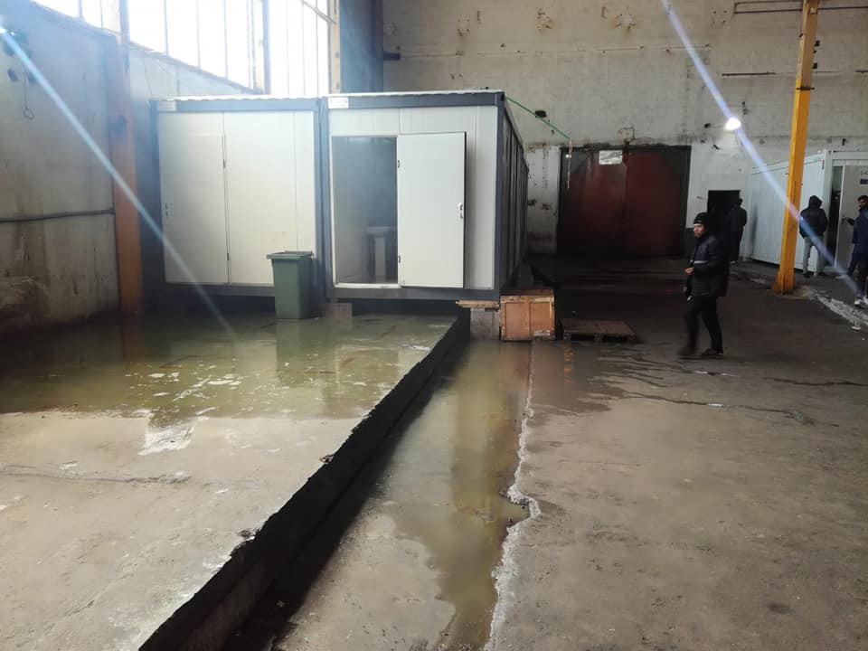
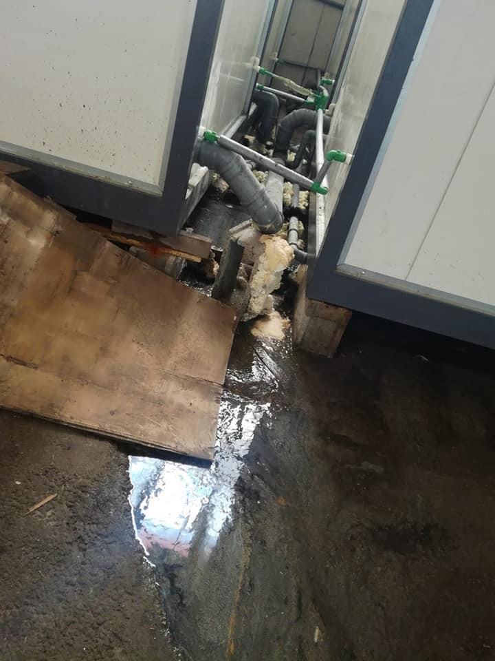

### AYS Weekend Digest 16–17/03/2019 Protest of detainee in Italian CPR silenced

Protests all over Europe /// 3 deaths and many people still missing in the Western Mediterranean /// 4 people are reported dead in Libyan detention centres /// IOM stop people from accessing camps in Bosnia /// Another racist attack in Greece ///

 and [Menti Libere](https://www.facebook.com/MentiLibere/)](assets/a7af490f819b/1*xabpgvZvSHVqyjp0tofwyA.jpeg)

THE SKY HAS NO BORDERS: Camp Borici, Bihac\. About 200 people, families, unaccompanied children and vulnerable individuals are living there currently\. The camp is run by IOM and they decide who can access the camp\. Last week artists and a clown came to visit children there — By [La Carovana Artistica](https://www.facebook.com/lacarovanaartistica/) and [Menti Libere](https://www.facebook.com/MentiLibere/)
#### Feature story — 37th day of hunger strike for T, imprisoned in Italian detention centre

[Macerie published an update](https://www.autistici.org/macerie/) on the protest and the condition of T, a detainee in Italian CPRs \(detention centres\), on his 37th day of hunger strike\. For weeks now he has been in touch with Radio Black Out, an activist radio based in Turin\. Listen to his testimonies: [1](https://radioblackout.org/podcast/diretta-con-un-recluso-nel-cpr-di-torino/) , [2](https://radioblackout.org/podcast/diretta-con-due-reclusi-nel-cpr-di-torino-25-02-19/) \(in Italian and English\) \.

AYS recently published [a special about his story and the conditions in Italian detention centres](ays-special-about-cpr-italian-pre-deportation-centres-an-administrative-hell-c7ce07502561) \.

At the weekend, after more than a month of hunger strike and in a serious health condition, and after several days of protest held by people in solidarity in Turin, T was suddenly transferred from the centre to the CPR in Bari\. In his demands he states that he would prefer to be deported to Algeria than being in the CPR, but the deportation has been halted for bureaucratic reasons\.

T is protesting against the inhumane conditions in the CPRs and in order to re\-gain his freedom\. After 37 days of hunger strike his condition is very serious, he is weak and he needs a wheelchair to move\.

Last week he was moved to the hospital wing of the CPR\. Even there, rooms look more like those of a prison than of a hospital\. Detainees are often left there for hours or even days after all too frequent self\-harm, or after being beaten by the guards\. This is also the area where many people are taken before being deported, in order to be sedated before travelling\.

T was beaten by the guards and then transferred to a city hospital, where doctors refused to talk with him and asked about his condition only through the agents who were escorting him\. Doctors ignored the physical signs of the beatings, and declared that he was in a fit condition to be brought back into the CPR\.

People in solidarity organised two protests\. In one, they gathered in front of the hospital to protest against the complicity of the medical staff in the detention of a seriously ill person, and marched from there to the CPR\. A second protest was organised in front of the council office for social policies\. The spokesperson of the local council commented that “if \[T\] dies, it’s the doctors’ fault, not ours\.”

Now T is 1,000 km from Turin\. The authorities took his phone from him, but T memorised the activists’ numbers and managed to keep them updated on what was happening to him, who then activated local networks of solidarians\.

**Detention centres — throughout Europe and the wider Mediterranean — are a centrepiece of the European border regime introduced in the last few years\. With push backs and deportations they are the proof of the illegal and criminal nature of EU policies towards people on the move\. Administrative detention is the way EU states ignore and bend laws and rights, imprisoning people who did not commit any crime, without any legal safeguard, with no access to information on their future or decent healthcare\.**

\#if you are not angry, you are not paying attention\#
#### PROTESTS IN EUROPE — Anti\-Racism Day and calls to end EU\-Turkey deal

There were protests all over Europe this weekend against racism, often citing the attack in Christchurch, New Zealand, and calling for an end to the EU\-Turkey deal which has now kept thousands of people trapped on the islands of Greece for the last three years\.

Together we are strong\!

Mytilene, Lesvos \(Greece\):

 \)](assets/a7af490f819b/1*flEmOH7GBqRYI0SmVD3LNA.jpeg)

Sapphos Square, Mytilene, Lesvos, Saturday 16/03/2019 \( [Photos by Lesvos Solidarity — Pikpa](https://www.facebook.com/pikpalesvos/?__tn__=kCH-R&eid=ARBjLu_sChVn5agj2I8GRiRoIIGMv02IXqeieppirdrJS0uH7JuDJOGU3A_o1CeFuj-bDNiIA8oTkQ0A&hc_ref=ARQfBY-k4_NZicI3WSl2QzeC2_lXBX21vx1TiTOZPyStWdECiXa6SMf7OPOISWnSzSU&fref=nf&__xts__[0]=68.ARD-KkTWYaLFMbYnJdfoY_HPmml5FRPlIh-ujX0Kkx1h-1JYh6qHuFKtTvbZ35KOYryO_hBx2s6XY9HVNwB9jkvPfu8SRPVfjz9ClOR-Ztgc4kAIw8vARCfqKjOqeUSAaDEF-VJHPtZUHm9w7m5s70PKZtZnBDhPTwTAjBQ7a2D1CGydkAQfTJJC8tlFRKCOXAdK914vxw1DFEn5_qHToXMUuD3Pe4UB0eeePdQd2ZM_EFEqnv3pbXJcOhrC7CEx0ILNubYqIMbhi4-5cZU3yQrH1QUBA0C1_6n46LN2tRN5iFyl2R_wKiUjbKAm0dzJI6BqbdYfHrfWK93Q_suWK-F5Je2YwZVGfutl_5yq23xhVDZMz_qSwE9niEDNj_UwKKFmIZJ9PJ7MZfigvyfAaIbPXOQc79gA_65D_XkUdkYcN1b2IcOk6_bDRRiJXV2A3EfwVPSazwscKIAyT1uyuW_mOLbEF4uRhAMhYGROFCWcMA5xbGYPass) \)

Athens \(Greece\):

■■■■■■■■■■■■■■ 
> **[lolos marios](https://twitter.com/lolosmarios) @ Twitter Says:** 

> > Διεθνής ημέρα ενάντια στον φασισμό και τον ρατσισμό. 
Απλά οι φασίστες στις τρύπες τους 16-3-19
#refugeesgr https://t.co/HnBWOi6Xp7 

> **Tweeted at [2019-03-16 16:37:00](https://twitter.com/lolosmarios/status/1106957547351740422).** 

■■■■■■■■■■■■■■ 

Caserta \(Italy\):

 \)](assets/a7af490f819b/1*Lpl-Wfs3--VVcwz4omKakA.jpeg)

Caserta: Demonstration in solidarity with the Ex\-Canapificio, home to the local SPRAR, recently evicted \(photo by [CSA Ex Canapificio Caserta](https://www.facebook.com/Csa-Ex-Canapificio-Caserta-527886284018191/?__tn__=kCH-R&eid=ARDJEB05pHIQxdwtqpKEn63jv7uJkEU5F2b_bKetIhG66tMUGe9_FV3J4LpqtvVxk3aSjAQWhSL_PXu_&hc_ref=ARSQlECdyoecFt3vHyOOr9aJZPSA0fY9tGf-p9MzLp1TnqFVEbVVMAQLI7-5IYnayjY&fref=nf&__xts__[0]=68.ARAuBQrwap5QYSp_Cp6pB_aNMTWN_LJPK45j_aS_johqD7EEY7yH2Y6H970KW6ApS9BpF9Dd9XoCF-wNW8W-7DVYkkYIc7ctUYySJFuGxeu98Xx4fbg7Q38SlIa8TC2TfitihtfmKQoiEHaVNzCP86XgwhCpCfu6sO5uetaFY1txY3h7t9d8RFIntdfP6ddyfu8Z1cU3yRsXHWkErN1Y2-6AbbwpYXM-SL8TIaiH9dWJxoOCZi3WTXk5L-Hf2jeMPreCU-zz-JMAd7DmM0xRdC_O7qylEqSGpeyytmE9VcKbgkYGKuzWg6rGS6dkklKPlHaHGx_lmElSb07HOtbTwYrUrPLvaY-KNAfJvIyLAOo8JyCPdOr76MMpWly0z1Vt-rPt5OV1rQxepRg22bBlM7Av20PEe_AWD1q8pRXfT_C0px_n4nBesnXurMRDPGfgOF0NEic91NnXex5xVUsYlWdG-ByprrZXeDFmmz1Akn8TUyRJf7vyhWCw) \)

Padua \(Italy\):

Barcelona \(Spain\):

■■■■■■■■■■■■■■ 
> **[Fotomovimiento](https://twitter.com/Fotomovimiento) @ Twitter Says:** 

> > Avui a #Barcelona contra el racisme, la islamofòbia, la xenofòbia, el feixisme. 
#23MStopVOX #StopIslamofobia https://t.co/jhZEdUHWiq 

> **Tweeted at [2019-03-16 20:46:38](https://twitter.com/fotomovimiento/status/1107020368810819584).** 

■■■■■■■■■■■■■■ 

London \(UK\):

 \)](assets/a7af490f819b/1*U18weWWAvqkMn6ABWkfNeQ.jpeg)

\(Photos by [Guy Smallman](https://www.facebook.com/photo.php?fbid=10155900779236968&set=pcb.10155900786016968&type=3&theater) \)

Glasgow \(UK\):

Cardiff \(UK\):

 \)](assets/a7af490f819b/1*aVzMWj1E5Liw71WoOxoNYw.jpeg)

\(Photo by [Brian Osweta](https://twitter.com/BrianOsweta/status/1106879119999098880) \)

Protests are continuing in Reykjavik \(Iceland\):

 \)](assets/a7af490f819b/1*Ie_4dhwjS3q_2fSlHPsa9Q.jpeg)

Protest in front of the parliament, Reykjavik \(Photo by [Refugees in Iceland](https://www.facebook.com/refugeesiniceland/?eid=ARDN-ByMWbl0rPIIs5FqLfQ1yFA62itjXJzG6SmyAHre8ioEF0_7cjMCZhTktRZF4zA-klu6ACqzcR6a) \)

This weekend after [one week of occupation](https://www.facebook.com/events/380566482797266/) in front of the parliament with no reaction from the government people spent Sunday writing letters to the minister of justice and prime minister\.

The letters make the five demands refugees have made:

1\. No more deportations — 2\. Substantial review for everyone — 3\. Equal access to health care — 4\. Work permit — 5\. Closing down of the refugee camp in Ásbrú\.

> The occupation in Austurvöllur will continue until authorities agree to the request of starting negotiations series with representatives from refugees in Iceland about these five demands\. The second request is to temporarily stop all deportations while negotiations are ongoing\. 

LIBYA
#### Four people dead in detention

[Sally Hayden reports](https://twitter.com/sallyhayd/status/1107305859967868929?fbclid=IwAR295Q_rcoI7WBJmzxzALVn_yGCut-cj9NJ59gXAx-yr9eZ5uilxGBgT4CM) that detainees have told her of the deaths of four people in Gharyan detention centre\. They say 28 detainees were forcibly moved there from Zintan yesterday\.

> Libyan guards apparently lied to some, saying they were going to Tripoli for medical treatment\. 

It is not known how these individuals lost their lives\. What is clear is that their deaths are on Europe’s hands\.

MOROCCO
#### Bodies not identified, families not informed

A new [report by Platforme National de Protection Migrants \(PNPM\)](http://www.pnpm.ma/wp-content/uploads/2019/03/Rapport-Morts-aux-Frontieres-PNPM28-2-2019-Version-Finale.pdf) states that identification rates for bodies found along the Moroccan coast line ranges from 2% in Tangier and 18% in Nador\. The report suggests that survivors should be allowed to help in the identification of the dead instead of being immediately detained and that families should not face detainment or imprisonment when they come to identity the body of a loved one\.

International law obliges states to respect the dead, the first step of which is identification\. What is also highlighted is the emotional impact of never knowing what happened to your family member or friend and the practical implications for inheritance\.

WESTERN MEDITERRANEAN ROUTE
#### Widespread exploitation and abuse on the Western Mediterranean route

A [survey](https://www.iom.int/news/western-mediterranean-nearly-half-recent-spain-migrant-arrivals-report-exploitation-abuse?fbclid=IwAR1uv_wYQIO12hYpL7JErbEJBiqDrJB3sURwTFPIL4ITbPhll0RPqSZBWq4) was conduced by IOM in 2018 during which they interviewed more than 1,300 migrants and refugees who had arrived in Spain\.

Nearly half of them \(48%\) “indicated having at least one direct experience related to human trafficking, exploitation or abuse while travelling on the Western Mediterranean Route\.”

63,325 arrived to Spain through such routes in 2018, making it the main point of entrance into Europe\. The most common route is through Mali \(Bamako\) to Algeria \(Algiers, Oran, Tamanrasset\) and then to Morocco \(Casablanca or Rabat and then Nador or Tangier\) \.

> “The results of this survey show an alarming incidence of reported exploitation and abuse of migrants and refugees along the route\. It is striking how varied their motivations and experiences are, and we do not always realize the very high levels of vulnerability in play\.” \( _Maria Jesus Herrera, IOM Chief of Mission in Spain_ \) 

As we already reported, no evidence of a significant shift from the Central Mediterranean to the Western Mediterranean has been shown\. Only 1\.3% of the people surveyed “indicated that they had changed their route and headed towards Niger or Algeria after time spent in Libya”\.

Read the full report [HERE](https://migration.iom.int/reports/europe-%E2%80%94%C2%A0flow-monitoring-surveys-analysis-profile-and-reported-vulnerabilities-migrants) \.

SEA
#### 3 people died and many are still missing in the Western Mediterranean

[Ali Zoubeidi reports](https://twitter.com/alzoubeidi/status/1107329875013193731?fbclid=IwAR29sLluVopzhFdsRMTHsb2JczGI0T8fZgKcrhECAL7KrN3WdpnVHunTdMQ) that 19 people are missing after a shipwreck in Sidi Ifni, south Morocco\. One person has already been rescued\. They were trying to reach Spain from Sidi Warzeg\.

A boat with 56 people [has been rescued by the Moroccan Navy](https://twitter.com/HelenaMaleno/status/1107542506781265920) early on Monday morning\. 3 dead bodies have been found on board\. The alarm was raised yesterday by human rights defenders\.

Helena Maleno Garzon [reported on Sunday](https://twitter.com/HelenaMaleno/status/1107179959146242048) that 2 more boats were missing in the Gibraltar strait, carrying 8 and 10 people\.

SEA
#### NGO boat back at sea

[Mediterrannea Saving Humans](https://twitter.com/RescueMed/status/1106862569631961089?fbclid=IwAR25HJe7kHvzEEI47KazzYSw6GaJMqV5GHlrCQdIqLb3Bpo5ZVpCNxkaGss) are finally back to sea\.

> We worked late, passed four inspections of the Harbour office, resisted months of frustration, in the face of the barbarism of the closure of borders\. 

> Today finally the Mare Jonio returns to the Mediterranean\. 

#### More deaths at sea predicted

Andalusian organisation [Pro Derechos Humanos](https://twitter.com/APDHA/status/1106881609389748224?fbclid=IwAR182PJMaCOSdPtAsXc_EmX2DP2U0ryLNCO6ToI1Jc-Y-7LoDoIgArcN2PY) predict an increase in deaths at sea following the new agreements with Morocco regarding the coordination of sea rescue operations\. 45 people have already died since Morocco took over coordination and the group states that the Moroccan government do not have the human resources or materials to do this task competently\.

Alarm Phone have confirmed their concerns as they try to locate 6 people lost at sea\.

■■■■■■■■■■■■■■ 
> **[Alarm Phone](https://twitter.com/alarm_phone) @ Twitter Says:** 

> > 6 lives at risk! 2 days ago 45ppl died off the coast of Morocco. Today, we’re alerted to 6ppl in distress in the same region. Contact was lost already 8h ago. @[salvamentogob](https://twitter.com/salvamentogob) is informed but refuses a SAR operation, Moroccan Navy refuses to confirm SAR operation. Will anyone help? 

> **Tweeted at [2019-03-16 14:14:23](https://twitter.com/alarm_phone/status/1106921658546339841).** 

■■■■■■■■■■■■■■ 

#### FRONTEX Map — A Sanitised State Lie

FRONTEX have [published a map](https://frontex.europa.eu/along-eu-borders/migratory-map/) , stating it depicts the current migratory map of Europe\. What it does not show is the pain and suffering along the routes, it does not list the deaths, it does not show the bodies which wash up on both sides of the Mediterranean\. It describes everyone as ‘migrants’ to suggest that they have all chosen this journey in life, have chosen to risk their lives and potentially lose their loved ones\. It does not show torture in Libya\. It does not show the repercussions of EU funding to the Libyan coast guard or the real life impacts of the EU\-Turkey deal\. It is a state funded lie to ease the consciences of governments and politicians throughout the EU who continue to militarise borders, legitimise dictatorial regimes and endanger people’s lives\.
#### Yacht Fleet Call Out

The [Yacht Fleet](https://twitter.com/ClausReisch/status/1107205283007344640?fbclid=IwAR071zOo114lMetoSpBFhDZs0Rmw9FhZFai8DSEivHRgc8dRzcF741Hb2D0) need IT Professionals and Electricians to help network their boats for effective rescue operations\.

GREECE
#### Arrivals

According to the Aegean Boat Report two boats arrived on the Greek islands at the weekend\.

[One boat arrived on Samos](https://www.facebook.com/AegeanBoatReport/posts/541542903035485) on Sunday morning, carrying 35 people \(no breakdown available\) \.

[A second boat](https://www.facebook.com/AegeanBoatReport/posts/541955919660850) arrived in the night on Lesvos, with 42 people onboard\. It was picked up outside Tsonia, on the north\-eastern coast at 03\.20 by Frontex\. No breakdown is available\.
#### Vaccination campaign in Vathy, Samos

Over the weekend MSF operated a [vaccination campaign](https://twitter.com/MSF_Sea/status/1107226472182415361?fbclid=IwAR3-eXq6F-_RjWB_8_fA1qkEJ6v347CJPna4ctLUv6JX_yPh-sy55_M07PI) in Vathy camp, in Samos in which there are “more than 800 children who live under inhumane and unhygienic conditions”\.
#### More attacks on refugees

After last week’s racist attack on refugees on Chios, Alarm Phone report another attack near Athens:

■■■■■■■■■■■■■■ 
> **[Alarm Phone](https://twitter.com/alarm_phone) @ Twitter Says:** 

> > Attacks on #refugees in #Greece continue:
The Alarm Phone was contacted today by a group of people that was attacked by a mob outside Athens. With #Greek police presence, the mob used petrol bombs, stones and batons to attack the whole group - men, women and children. https://t.co/vuwJVkDy8i 

> **Tweeted at [2019-03-15 20:22:08](https://twitter.com/alarm_phone/status/1106651815859417089).** 

■■■■■■■■■■■■■■ 

According to Alarm Phone \( [1](https://twitter.com/alarm_phone/status/1106651820498305024) , [2](https://twitter.com/alarm_phone/status/1106654410246156294) \), “the group was specifically moved out of the camp and resettled in a hotel outside of Athens because of their precarious situation\. Just 2 hours after their arrival to the hotel, the mob attacked them and barged into their rooms\. \[…\] The man in the video was in his room when three men broke the door\. They rammed a fire extinguisher into his chest and scared his children\. The group reached out to Alarm Phone because none of them dare to step outside the hotel\. They are asking for help and protection\.”
#### More on International Women’s Day in Athens

The [Spirou Trikoupi Squat for Refugees and Migrants](https://www.facebook.com/spiroutrikoupi17/?__tn__=%2Cd%2CP-R&eid=ARCVcy1h-ith6TUiATtFVOG0dGWn432mi-Y_b9BiAxtiM28h7kAlMBSsvQb_VkjsvF1sxdJDBkRtoVVv) have posted about their participation in the March for International Women’s Day on March 8th\.

> It has taken us some days to post about what we lived on the 8th March, but that is only because we are still digesting what has happened\. It was an amazing, very emotional and unique feeling that we experienced all together\. We have proved again that women working together are stronger than divided\. That we fight, celebrate and live not just on the Women’s Day, but every day of the year\. And that every single day for us is a struggle and a ground for raising our figure\. From S\.T 17 we are working for our empowerment by fighting against the heteropatriarchal capitalistic system and by looking for new alternative ways of life, with feminism always as one of our main principles\.
 

> Together we stand for the manifesto that we read and together we protested in the march\. We were happy and excited to share the space with other people who fight for the same ideas\. 

> All of us together, we support the women struggle and we shout: 

> WE ARE FEMINISTS\. 

ITALY
#### Arrivals

UNHCR published [arrivals data for February 2019](https://data2.unhcr.org/en/documents/download/68422) \.

> Between 1 January and 28 February 2019, 262 refugees and migrants arrived in Italy by sea, compared to 5,247 and 13,439 in the same period in 2018 and 2017, respectively\. In February 2019, 60 persons reached Italian shores\. During the month, there were five disembarkation events of comparatively small groups — ranging from 8 to 14 sea arrivals on the islands of Lampedusa, Pantelleria, and Sardinia\. 

According to [IOM figures](https://www.iom.int/news/mediterranean-migrant-arrivals-reach-10308-2019-deaths-reach-234?fbclid=IwAR2lawIB-CVJlAzPL_nazVzT452uCWN3N5l_vtusrWjfE1A_KnBHGQgMvsg) , by the 13th of March 2019, 335 people have arrived in Italy \(and 136 in Malta\) since the beginning of the year\. 153 people are reported dead or missing on the Central Mediterranean route\.

SPAIN
#### Arrivals

Local press report that [four people were transferred to Cadiz](https://www.europapress.es/andalucia/cadiz-00351/noticia-trasladan-algeciras-cadiz-cuatro-personas-ser-rescatadas-patera-entraba-agua-20190316102902.html) after water entered their boat at sea, that another [10 people reached the coast](https://cadenaser.com/emisora/2019/03/17/radio_cadiz/1552816201_894536.html?ssm=tw) on a wooden boat in the same area and managed to flee before the arrival of the police, and that [42 more were rescued](https://www.europapress.es/andalucia/cadiz-00351/noticia-rescatadas-42-personas-ellas-ocho-menores-patera-quedo-parada-combustible-estrecho-20190317143032.html) on Sunday and are now in Algeciras\.

UNHCR published [arrivals figures for the first two months of the year](https://data2.unhcr.org/en/documents/download/68429) : between the 1st of January and the end of February 5,978 people arrived \(compared to 3,659 for the same period in 2018\) \. 80 people were reported dead or missing \(112 in 2018\) \. Boats were reported as leaving not only from the Moroccan shores but also from Algeria\.

BALKANS

Weather Forecast for Monday 18th:

MONTENEGRO — Partly cloudy with sunny intervals, and occasionally rainy in the southwest and west\. The wind is moderate\. Lowest temperature 2 to 13, highest daily 8 to 20 degrees\.

BiH — Mostly cloudy in both Bosnia and Herzegovina\. Rain expected in Krajina area and it will move Eastward by the end of the day\. Snow is expected in the highest areas\. The wind is weak to moderate\. The highest daily air temperature is between 13 and 20 °C\.

SERBIA — Generally warm and mostly sunny\. In the north and west afternoon and evening it is expected to be cloudy with low rainfall\. The wind is weak and moderate\. The lowest temperatures are from 2 to 11, the highest daily from 14 in the northwest to 24 degrees in the southeast\.

CROATIA —Rain in the west, with abundant precipitation and storms on the northern part of the coast\. Occasional snow\. Wind is moderate to strong from north\-east\. Strong Bura on the coast towards the end of the day\. Temperatures in the Adriatic and in the east from 12 to 17, and elsewhere between 2 and 7\.

BOSNIA AND HERZEGOVINA
#### Families forced to sleep rough due to illegal police check\-points

 \)](assets/a7af490f819b/1*2xmjnVna9DcMYs1Plt4csg.jpeg)

Kljuc \(Photo by [Crveni Križ Općine Ključ](https://www.facebook.com/profile.php?id=100009318317491&__tn__=%2CdlC-R-R&eid=ARC0xZksQoizmI6jEFBjfbJgqUrIyYFpy-cPLS5PoIw_ImAR91S6k0F14Em0feB0BkXh6uHTZuZOwy8b&hc_ref=ART0idDSQP1XSR1wz8rx9_byyVWCXMSxgYWQJwErZ3Ow0050ZCFCdrv17eESPtk24ks) \)

Two families from Syria and other groups of people [spent a weekend sleeping rough](https://www.facebook.com/photo.php?fbid=2299424380378150&set=a.2299423927044862&type=3&fref=gs&dti=1652972374920129&hc_location=group) , by the road, close to city of Kljuc, Bosnia\. They, like all other people travelling from Sarajevo to Bihac by bus, were stopped by the local police at irregular and illegal check points, forced to leave the bus, and left by the road\.

 \)](assets/a7af490f819b/1*E6t6dObiK-7GaezGr5XbSA.jpeg)

Kljuc, Sunday 17/03/2019 \(Photo by [Sanella Lepirica](https://www.facebook.com/sanela.lepirica/posts/2334886156562601?hc_location=ufi) \)

[IOM](https://medium.com/u/664cb26312d4) , [UN Refugee Agency](https://medium.com/u/75f2bdd89854) , DRC and other international agencies are aware that this has been happening since October 2018, but have done nothing to pressure local authorities to change this practice\. Additionally, the government, which is responsible for taking care of people on the move in Bosnia, is completely ignoring this situation\.
#### IOM refuses to allow people into BIRA and other camps

Due to rules that are never clearly explained, [IOM \- UN Migration](https://medium.com/u/664cb26312d4) do not allow people to enter camps and register\. As a consequence, about 100 people are sleeping rough around BIRA camp\. People are left outside Miral, Velikla Kladusa, too\.

Outside Bira Camp \(Photo taken by people who are sleeping outside the camp\)

According to such rules, if somebody leaves the camps, they have 48 hours to come back\. If they come after this period of time, they cannot enter the camp\. Many people go to cross the border and sometimes they came back after several days \(fore example those who are pushed back from Slovenia\) and often they are injured, tired and hungry, but IOM leaves them outside\.

Additionally, they do not intend to register new people in the camp, and all new arrivals are left outside\. People who are outside cannot get food or any kind of help\.

This behaviour is hard to understand from an international organization involved in providing assistance to people on the move in Bosnia\. Why are they helping only those who are inside camps?

More people are arriving daily, and many get no help at all\. In Bihac, only small groups of local volunteers are able to work outside the camp and to help, as well as in Kladusa\.

The conditions within the camps are dreadful as always:

 \)](assets/a7af490f819b/1*rizj-yPzdmB2j3ESy5s6tA.jpeg)

Bira Camp \(Photos by [Udruženje Solidarnost — Bosnia](https://www.facebook.com/solidarnostbosnia/?__tn__=kC-R&eid=ARAbFIA2Qdm0gpDPM7_bQWHSfDHKQ8dqQULhxlG8cTZf9JSKLgC1m5ZiO6LdEKBZKwnbj8eViovmdVOR&hc_ref=ARR9L5Ni6TM2frz9h4gBG5ajiJtioKqzDPHp5TGFnKCxmpcr4PPlEO2TGV-dY5G2hxw&fref=nf&__xts__%5B0%5D=68.ARChsuCdGM9MtjXhimbTor5H3FHAgc7cYcCcr9FYcQZOYlz7IT9-ckzn7JYVt7lAawOxr1BTBQ58t3eSl1VJyjwhvWWFX-ugjnkfPxR_86ceZNrKDpGqwdoBIYROEXXBIMsxv89kpBZVrIdPQTgeJns-TAFg8smstXfJGOD-csGW2mXhrYntKZ77QGuDte5vENMF9nSgOfeht8yEBpTbB5AyVYpAf2-jN1pOsZrlIJKXJPDvsPjgfmNBFxGJnRSd4g0LXWA-yK37YhDR3RRRE83EDiYzxbmHa810c_92At15-4w4V8Z5oCedmjbhbJwHhxtVvvOWLk9oN1bQOAB7kADHEg) \)

SERBIA
#### Asylum Protection Centre \(APC/CZA\) seeks volunteers

Asylum Protection Centre \(APC/CZA\) invites all those who want to assist asylum seekers and migrants, to contribute to the creation of a more tolerant and open society and counter prejudices and xenophobia to join the APC/CZA volunteer network\.
Volunteering activities do not require particular competencies and cover various fields of work, such as: distribution of humanitarian help or leaflets to migrants and asylum seekers; participation in street activities; teaching Serbian to asylum seekers and refugees; assistance to APC/CZA psychologist in psychological counselling in the field; assistance to APC/CZA pedagogues in preparation of workshops realised in asylum centres and schools in Serbia; assistance to APC/CZA lawyer in legal counselling; translation of various professional texts; design of promotional materials; organisation of humanitarian events, conferences and training; research activities and many more\.

If you have the wish to help and the time to actively participate in the regular APC/CZA activities, contact us for further information\.
E\-mail: jovana\.vincic@apc\-cza\.org

ROMANIA
#### 2018 country report published

[AIDA — Asylum Information Database](http://www.asylumineurope.org/) published their yearly Country Report on Romania\.

Read it [HERE](https://www.asylumineurope.org/sites/default/files/report-download/aida_ro_2018update.pdf?utm_source=ECRE+Newsletters&utm_campaign=2d252e85c3-EMAIL_CAMPAIGN_2019_03_14_03_01&utm_medium=email&utm_term=0_3ec9497afd-2d252e85c3-422320969&fbclid=IwAR2FCx4YjTvUSCzj1DRwub37sykfLAmG1AYm_llrE5uuLrruvAMJ87raYs0ù) \.

POLAND
#### 2018 country report published

[AIDA](http://www.asylumineurope.org/) published their yearly Country Report on Poland\.

Read it [HERE](https://www.asylumineurope.org/sites/default/files/report-download/aida_pl_2018update.pdf?utm_source=ECRE+Newsletters&utm_campaign=2d252e85c3-EMAIL_CAMPAIGN_2019_03_14_03_01&utm_medium=email&utm_term=0_3ec9497afd-2d252e85c3-422320969&fbclid=IwAR3vATq9jIljTCtdHU4Nb4pPCkDUEvl3yOCMEPpyBcrwiohbRIoX-Z0jE6I) \.

GERMANY
#### Refugee Foundation seeks donation for a convoy headed to Greece

[Refugee Foundation is organising a convoy that will leave in April for Greece](https://www.facebook.com/RefugeesFoundationSfRotR/posts/1236238946535366?hc_location=ufi) \.

They need donations of clothes, cookware and first\-aid items\. They are collecting donations in Kölner Südstadt \(Alteburgerstraße 15\), every day after 5PM until the 24th of March\.

Find their needs\-list and how to contact them [HERE](https://www.facebook.com/RefugeesFoundationSfRotR/posts/1236238946535366?hc_location=ufi) \.

FRANCE
#### Post eviction update from RCK

UK
#### RacistVan hub shut down for a day in London

[Haringey Anti\-Raids](https://www.facebook.com/HaringeyAR/?) report that on Friday activists have SHUT DOWN one of London’s Home Office depots near Heathrow airport, from where immigration vans leave to try and locate people wanted for deportation\.

](assets/a7af490f819b/1*t53Yz9MvNjeOTfIHyeVXhg.jpeg)

Photo by [Haringey Anti Raids](https://www.facebook.com/HaringeyAR/?)

> The immigration raid vans can’t get out to harass migrants today 

> It’s been closed for 6 hours and counting 

There are four other depots — at London Bridge, Croydon, Stansted and Gatwick\.
#### 2018 country report published

[AIDA](http://www.asylumineurope.org/) published their yearly Country Report on the United Kingdom\.

Read it [HERE](http://www.asylumineurope.org/sites/default/files/report-download/aida_uk_2018update.pdf?utm_source=ECRE+Newsletters&utm_campaign=2d252e85c3-EMAIL_CAMPAIGN_2019_03_14_03_01&utm_medium=email&utm_term=0_3ec9497afd-2d252e85c3-422320969&fbclid=IwAR2BWpzXoKVF-dUSx38D2lvrxzlk2E3c3TmFssRriQzf_jzZ89335eZneIc) \.

**We strive to echo correct news from the ground through collaboration and fairness\.**

**Apart from daily news in English, we also publish weekly summaries in [Arabic](https://medium.com/are-you-syrious/%D8%A7%D9%84%D8%AA%D8%BA%D9%8A%D9%8A%D8%B1%D8%A7%D8%AA-%D9%81%D9%8A-%D9%82%D8%A7%D9%86%D9%88%D9%86-%D8%A7%D9%84%D9%84%D8%AC%D9%88%D8%A1-%D9%81%D9%8A-%D8%A7%D9%84%D8%AF%D9%86%D9%85%D8%A7%D8%B1%D9%83-b99e429d54ad?source=collection_category---4------0---------------------) and [Persian](https://medium.com/are-you-syrious/%D8%B9%D9%88%D8%B6-%D8%B4%D8%AF%D9%86-%D9%82%D9%88%D8%A7%D9%86%DB%8C%D9%86-%D9%BE%D9%86%D8%A7%D9%87%D9%86%D8%AF%DA%AF%DB%8C-%D8%AF%D8%B1-%D8%AF%D8%A7%D9%86%D9%85%D8%A7%D8%B1%DA%A9-7b984cac7a86?source=collection_category---4------1---------------------) \. Click on those links to check out the ones about the week from the 4th to the 10th of March\.**

**Every effort has been made to credit organisations and individuals with regard to the supply of information, video, and photo material \(in cases where the source wanted to be accredited\) \. Please notify us regarding corrections\.**

**If there’s anything you want to share or comment, contact us through Facebook or write to: areyousyrious@gmail\.com\.**

_Converted [Medium Post](https://medium.com/are-you-syrious/ays-weekend-digest-16-17-03-2019-protest-of-detainee-in-italian-cpr-silenced-a7af490f819b) by [ZMediumToMarkdown](https://github.com/ZhgChgLi/ZMediumToMarkdown)._
