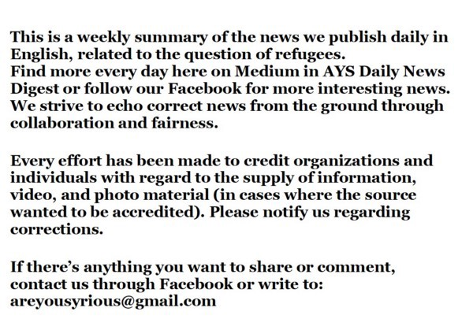

### مع زيادة عدد الوافدين إلى أوروبا يرتفع عدد عمليات الطرد أيضًا
#### AYS Weekly News Summary in Arabic, March 11–17

 \)](assets/f20d1e8f3229/1*W3cauJrZ7HDpuCDzQGkdWQ.jpeg)

Ključ, BiH by [Crveni Križ Općine Ključ](https://www.facebook.com/profile.php?id=100009318317491&__tn__=%2CdlC-R-R&eid=ARC0xZksQoizmI6jEFBjfbJgqUrIyYFpy-cPLS5PoIw_ImAR91S6k0F14Em0feB0BkXh6uHTZuZOwy8b&hc_ref=ART0idDSQP1XSR1wz8rx9_byyVWCXMSxgYWQJwErZ3Ow0050ZCFCdrv17eESPtk24ks) \)
### **تركيا**

بعد أن هددت تركيا مرة أخرى بفتح حدودها للاجئين الذين يرغبون في الوصول إلى الاتحاد الأوروبي ، أعلنت بروكسل نقل منحة إضافية بقيمة ٥\-١ مليار يورو للسوريين في هذا البلد\.

> وقالت فيديريكا موغيريني مسؤولة السياسة الخارجية بالاتحاد الأوروبي “أود أن أؤكد أننا سنحول ٥\-١ مليار يورو من المنحة الثانية البالغة ٣ مليارات يورو للسوريين في تركيا”\. 

أعلن موغريني هذا في افتتاح مؤتمر حول سوريا نظمه الاتحاد الأوروبي والأمم المتحدة في بروكسل\.

تستضيف تركيا أكثر من ٥\-٣ مليون لاجئ سوري ، أي أكثر من أي دولة أخرى في العالم\.

يعد الدعم المالي لتركيا جزءًا مما يسمى بالصفقة الأوروبية الأوروبية الموقعة في مارس ٢٠١٦، والتي أغلقت الحدود الأوروبية وجعلت الرحلة لجميع الناس أثناء التنقل أكثر صعوبة\.

الاتحاد الأوروبي ملزم بدفع تركيا ٦ مليارات يورو كمساعدات مالية\. كما تنص الاتفاقية على تسريع محادثات انضمام تركيا إلى الاتحاد الأوروبي والسفر بدون تأشيرة لمواطنيها\.
### **الجبل الأسود**

عدد الأشخاص الذين يعبرون الجبل الأسود آخذ في الازدياد ، وكذلك خطاب الكراهية وتشجيع الخوف في وسائل الإعلام المحلية\. كما هو الحال في البلدان الأخرى ، تتهم وسائل الإعلام الناس بالانتقال من أجل كل شيء سيء يحدث ، قائلين إن الناس يخشون اللاجئين والمهاجرين\. وغالبًا ما يستخدمون مصطلح “المهاجرين غير الشرعيين” وهو تمييز\.
### **صربيا**

يبلغ مشروع مراقبة عنف الحدود أنه في ٢٤\-٢\-٢٠١٩ ، تم ترحيل ثلاثة فتيان مراهقين تتراوح أعمارهم بين ١٣و ١٥عامًا من المجر إلى صربيا مستخدمين “العنف البدني: الضرب والركل والضرب بالعصي وسكب الماء البارد ؛ العنف النفسي: إهانة “\. لمزيد من هنا\.
### البوسنة والهرسك

هناك عدد من الأشخاص الذين يصلون إلى البوسنة في طريقهم نحو الاتحاد الأوروبي \. وفقا للأرقام الرسمية ، دخل أكثر من ٢٥٠٠شخص البلاد هذا العام\. يأتي كثيرون من اليونان عبر ألبانيا والجبل الأسود ، أو عبر كوسوفو ومقدونيا وصربيا\.

في الوقت نفسه ، يغادر العديد من الأشخاص ، وتشير التقديرات إلى أن حوالي ٣٩٠٠ شخص موجودون في البلاد في الوقت الحالي \(أكثر من ٢٤٠٠٠دخلوا في عام ٢٠١٨ \) \. ومع ذلك ، لا يمكن الاعتماد على هذه الأرقام على الرغم من أنها تأتي من مصادر رسمية\. تظل المشكلة هي عملية التسجيل والوصول إلى اللجوء ، فضلاً عن عمليات الاسترداد الداخلية\.

نقطة تفتيش في كلوج ، في الطريق من سراييفو إلى بيهاتش\. توقف الشرطة المحلية الحافلات على هذا الطريق ، وتخرج الناس وتتركهم على الطريق\. يتم تقديم المساعدة من قبل متطوعي الصليب الأحمر المحليين\. صور الصليب الأحمر كلوج\.

منذ بداية هذا العام ، تلقت \( ا ي س\) عدة تقارير عن عنف الشرطة داخل البوسنة ، بما في ذلك تقارير من فيليكا كلادوسا ومؤخرًا في موستار\. على ما يبدو ، تقوم الشرطة المحلية بشكل عشوائي بإيقاف الناس في الشوارع ونقلهم إلى المكان الذي يضربونهم فيه ، بما في ذلك مراكز الشرطة أو المناطق المخفية في المدن

](assets/f20d1e8f3229/1*USBAhlqjfPvRNBXk8WwwYw.jpeg)

[Sanella Lepirica](https://www.facebook.com/sanela.lepirica?__tn__=%2Cd%2AF%2AF-R&eid=ARB_I5mUi8o0vZYp7fZoFvYmeyzItOB6kbyu7LYftvvKQMN68f8ZO5DFOwnyXNI5VulXK91qv5IhDWgF&tn-str=%2AF)
### **كرواتيا**

رداً على تقرير منظمة العفو الدولية حول العنف على الحدود الذي ترتكبه السلطات الكرواتية ، قالت المتحدثة باسم المفوضية الأوروبية مينا أندريفا إنها “قلقة دائمًا بشأن تقارير إساءة معاملة المهاجرين واللاجئين”\.

إنهم يتوقعون أن تتابع كرواتيا المزاعم وستواصل مراقبة الوضع \(مهما كان ذلك\) \. يمكن العثور على البيان الكامل هنا ، على الرغم من أنه لا يستحق المشاهدة أو السماع\. ابحث عن تقرير العفو عن العنف وسوء المعاملة ضد اللاجئين والمهاجرين على طول طريق البلقان هنا\.

### **إيطاليا**

بين ١ و ١٠مارس ، وصل ٧٤شخصًا إلى إيطاليا ، ٣٣٦ منذ بداية العام\. تم الإبلاغ عن مائة وخمسين شخص ميتين أو مفقودين
### **فرنسا**

اجتمعت خمس منظمات معاً للتنديد والاحتجاج على تجريم السلطات الفرنسية على الحدود الفرنسية الإيطالية للنشطاء الذين يقدمون المساعدات\. هذا يشكل خطرا كبيرا على الناس على هذه الخطوة ، بسبب التضاريس الجبلية\.

وتشمل المنظمات منظمة العفو الدولية ، وسيماد ، وأطباء العالم ، ومنظمة أطباء بلا حدود ، وسكوريس كاثوليك\.

> “يزداد الوضع سوءًا لأن الحدود تتم مراقبتها بشكل متزايد\. تقوم الشرطة بدوريات كل ليلة وتجبر المهاجرين على العودة إلى إيطاليا دون أن يتمكنوا من المطالبة بحقهم في طلب اللجوء\. ونتيجة لذلك ، فإن المنفيين يتحملون المزيد من المخاطر للهروب 

### **ألمانيا**

هناك أسباب للاعتقاد بأنه من المتوقع أن يتم الترحيل القادم إلى أفغانستان في بداية الأسبوع المقبل ، وفقًا لتقارير باي غيشا

ليس لدينا تاريخ محدد بعد ، ولكننا نعتقد أن ميثاقًا سينطلق يو **م الاثنين ١٨ مارس أو الثلاثاء ١٩ مارس** \. المعلومات حول المغادرة ليست متاحة بعد\. ننصح جميع الأفغان بزيارة مركز استشاري أو محام\.

العثور على مزيد من المعلومات هنا
### **المملكة المتحدة**

أوامر من المحكمة العليا بإيقاف تكتيك “عدم التحذير” ا [لذي تستخدمه سلطات الهجرة على الفور](https://www.bbc.com/news/uk-47577266?SThisFB&fbclid=IwAR3dKK0ZBDYo5sliLCoju4C0cRKzBTi95FhDTeZxybjCjZoEYosSpSPFGv8) ، وإلغاء ٦٩عملية ترحيل مخطط لها\.

زُعم أن العديد من العائلات اليائسة حُرمت من الأموال التي يحق لها الحصول عليها لترك مدينتها “المسموح بها”\. علاوة على ذلك ، في المملكة المتحدة ، يُسمح لطالبي اللجوء بالعمل فقط في وظائف مدرجة في قائمة المملكة المتحدة\. هذه الوظائف في مجالات متخصصة للغاية ، مثل راقصات الباليه
### **الدنمارك**

أعلنت مصلحة الهجرة الدانمركية أنها ستبدأ إعادة تقييم تصاريح الإقامة للاجئين السوريين من دمشق في أواخر فبراير\. ويشير المسؤولون إلى أن الوضع الأمني ​​في المدينة قد تحسن وأن العديد من الأشخاص منحوا حق اللجوء بناءً على “الوضع العام” في سوريا بدلاً من الأسباب الشخصية للجوء\.

“يحذر الخبراء من أن تغيير سياسة مصلحة الهجرة يجعل الدنمارك أول دولة أوروبية تبدأ حتى في التفكير في العودة غير الطوعية للسوريين — وهي سابقة يحتمل أن تكون خطرة مع تزايد عدد الدول الأوروبية غير المضيافة للاجئين … لقد تم ترك الآلاف من السوريين في جميع أنحاء الدنمارك ، اليأس على مستقبل غير مؤكد “\.

يدير التلفزيون الدنماركي ٢ سلسلة أفلام على مدار الأسبوع تركز على مركز الاحتجاز الشبيه بالسجن \(البيك\) \. في تقرير صدر يوم الثلاثاء ، يشرح القسيس المحلي على مدى ١٠ سنوات كيف شهدت الآثار المدمرة المتزايدة من الاحتجاز على البشر في \(البيك\) \.

تواصل الدانمرك فصل أفراد الأسرة بدافع دفعهم إلى مغادرة البلاد

**يتوفر الكثير من الأخبار باللغة الإنجليزية يوميًا على صفحتنا في موقع الميديوم**

**في حال كان لديك أسئلة أو ترغب في نشر معلومات معينة ذات صلة بإجراءات اللجوء أو بلد اخباره مهمة ، يرجى عدم التردد في الكتابة إلينا — إما عن طريق إرسال رسالة إلينا على فيسبوك أو إرسال بريد إلكتروني إلى [areyousyrious@gmail\.com](mailto:areyousyrious@gmail.com)**

_Converted [Medium Post](https://medium.com/are-you-syrious/%D9%85%D8%B9-%D8%B2%D9%8A%D8%A7%D8%AF%D8%A9-%D8%B9%D8%AF%D8%AF-%D8%A7%D9%84%D9%88%D8%A7%D9%81%D8%AF%D9%8A%D9%86-%D8%A5%D9%84%D9%89-%D8%A3%D9%88%D8%B1%D9%88%D8%A8%D8%A7-%D9%8A%D8%B1%D8%AA%D9%81%D8%B9-%D8%B9%D8%AF%D8%AF-%D8%B9%D9%85%D9%84%D9%8A%D8%A7%D8%AA-%D8%A7%D9%84%D8%B7%D8%B1%D8%AF-%D8%A3%D9%8A%D8%B6%D9%8B%D8%A7-f20d1e8f3229) by [ZMediumToMarkdown](https://github.com/ZhgChgLi/ZMediumToMarkdown)._
