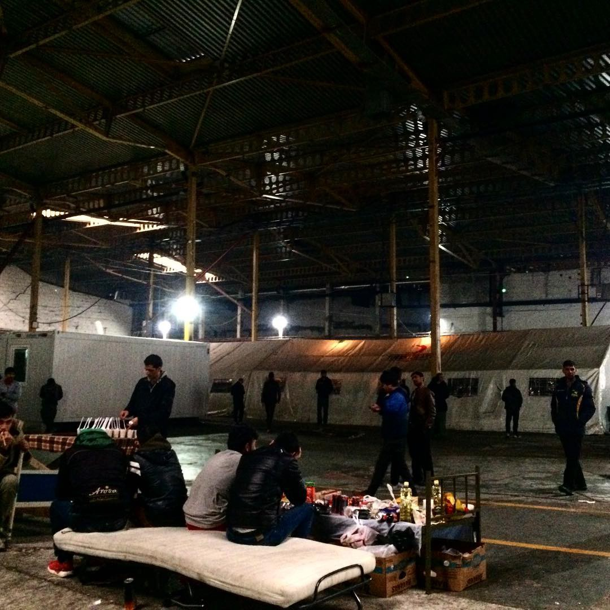
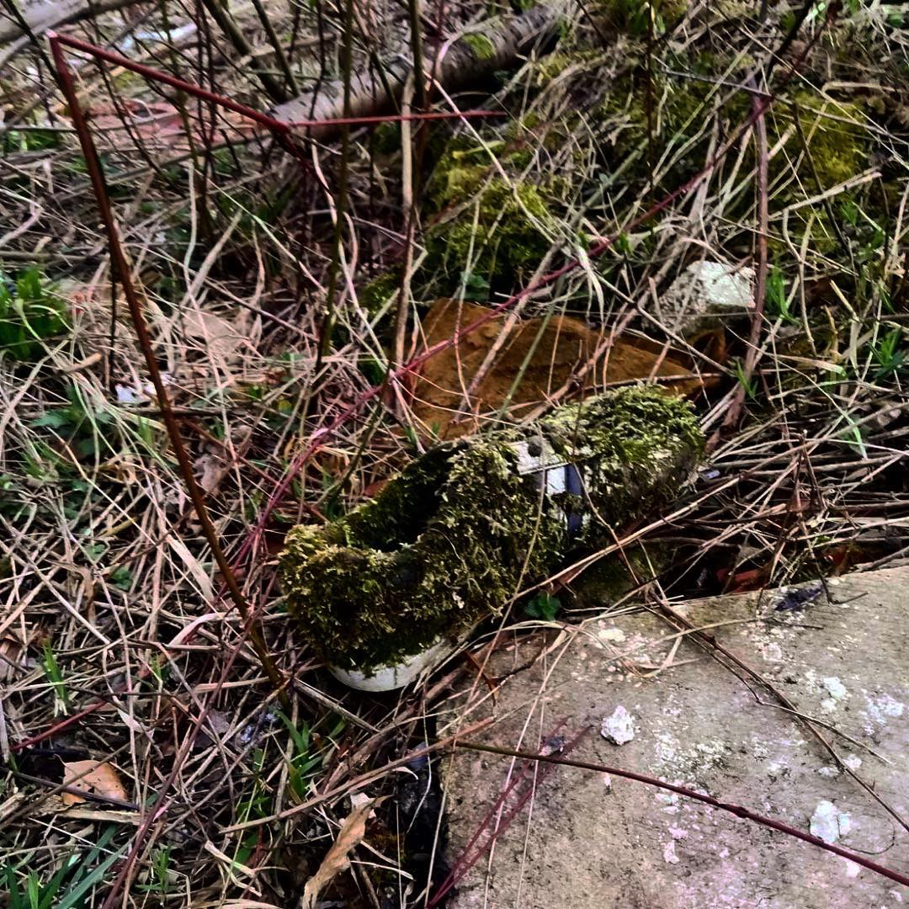
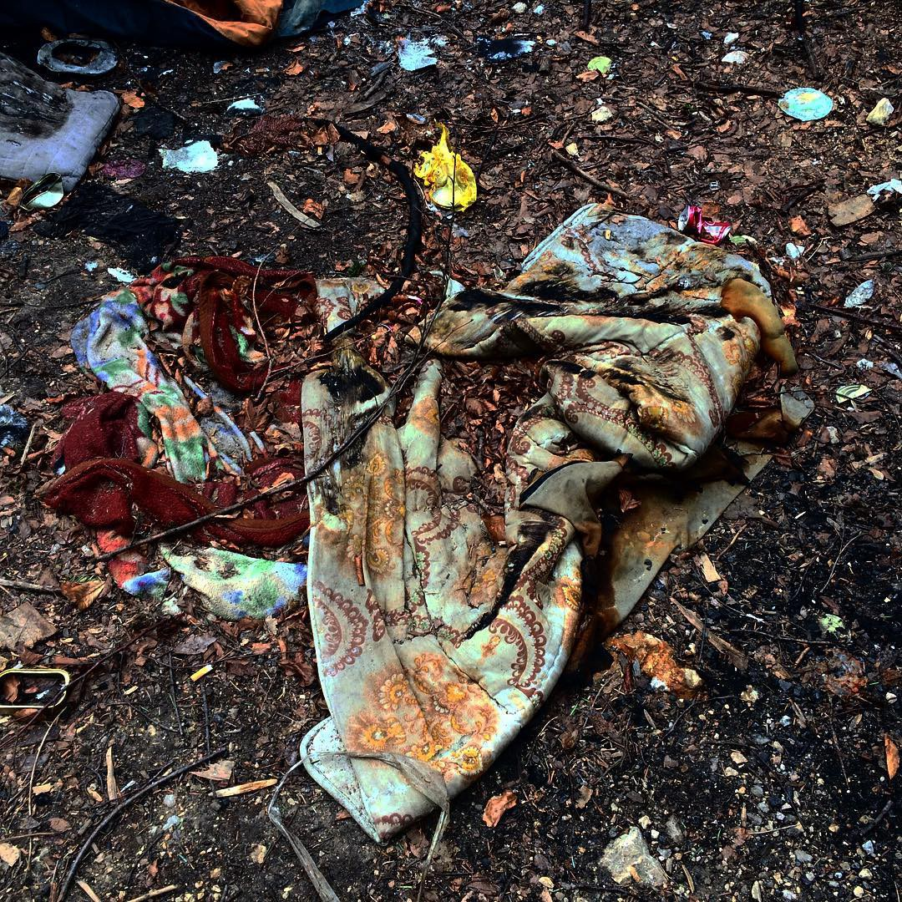

### AYS Daily Digest 20/3/19: More than 220 people arrived on Greek islands over the last 24 hours
#### _Three years of the EU\-Turkey deal and nothing new to say / Over 6,600 people arrived in Spain this year / New racist attacks in Greece and new big assembly in Athens / More people passing through Serbia again / Germany to cut the budget for refugees as of 2020 / Police pressure on people sleeping rough in Paris_

](assets/f56bd03cd359/1*Q-hZlyVKKV7m47rMPaVCqA.jpeg)

Photo by [Alarm Phone](https://alarmphone.org/en/2019/03/20/the-european-refoulement-industry-at-sea-alarm-phone/?post_type_release_type=post)
### Feature

It has been three years since the EU signed a deal with Turkey\. Over these three years, every day AYS has reported on the consequences of the deal that sealed the borders and put peoples’ lives in extreme danger\. So far, the ones who have benefited the most from the deal are the smugglers and other criminal networks who are profiting from the current situation\.

Because of the deal, thousands of people are trapped in camps where life is unbearable in Greece\. Because of the deal, people who do not have a “lucky” passport have to pay up to €4000 to reach Italy from Bosnia; because of the deal, over 200 people died in the sea so far this year, including many children, and at least four teenage girls who tried to reach Europe from Turkey on the boats…

■■■■■■■■■■■■■■ 
> **[Samos Volunteers](https://twitter.com/samosvolunteers) @ Twitter Says:** 

> > We see the effects of the deal every day.

Our colleagues and friends, our students and beneficiaries, they are all trapped in the bureaucratic nightmare the deal has created.

This cannot be the welcome Europe offers those fleeing war and persecution. 

#EUTurkeyDeal 

> **Tweeted at [2019-03-20 09:22:20](https://twitter.com/samosvolunteers/status/1108297711416152069).** 

■■■■■■■■■■■■■■ 

The deal has allowed the EU to ignore border violence reports\. In that way, the EU encourages border violence at the borders against people who are dreaming just about getting the chance for a better, new life\. AYS and a number of other organizations have been reporting on the violence at the Croatian and Hungarian border\. Also many reports have been coming recently from the border between Turkey and Greece\.

[@GCRefugees](http://twitter.com/GCRefugees) and [@CEARefugio](http://twitter.com/CEARefugio) , with the support of the Municipality of Madrid, have published a video on refugee pushbacks in the Evros region\.

On Wednesday, MSF concluded that for the past three years the EU\-Turkey deal has “trapped” thousands of men, women and children in “overcrowded, unsanitary, unsafe and degrading conditions\.”

_‘’Greece has become a dumping ground for the men, women and children that the European Union has failed to protect,”_ stated MSF’s Head of Mission in Greece Emmanuel Goué\.

> “The EU and Greek authorities continue to rob vulnerable people of their dignity and health, seemingly in an effort to deter others from coming\. This policy is cruel, inhumane and cynical, and it needs to end\.” 

The EU regards everything that has happened over the last three years as a success\. The biggest success, according to the EU, is that the number of asylum applications is dropping all over the member states\. At the same time, the number of rejections is increasing, as are the deportations\.

Some did not even reach a place where they could seek asylum\. At least 2,300 people died crossing the Mediterranean Sea in 2018\.

Every day we report on the brutal consequences of the EU\-Turkey deal\. Citizen of the EU countries, but also the neighbouring countries, see people who are suffering because of the closed border and the consequences of the deal\.

We need more solidarity and to find a way to say that no deals which are taking the life of the people on the move may be made\.

Can we do this? Can we find the voice and take action?

■■■■■■■■■■■■■■ 
> **[MSF Sea](https://twitter.com/MSF_Sea) @ Twitter Says:** 

> > Meet Farida. She fled #Afghanistan with her husband and kids. They arrived in #Samos in early March and have been living in this poor excuse for a tent outside #Vathy ever since. Come one, it's 3 years after the #EUTurkeydeal kids should NOT be sleeping in tents like this. https://t.co/CwtqX3ZTOV 

> **Tweeted at [2019-03-18 14:19:55](https://twitter.com/msf_sea/status/1107647825930870785).** 

■■■■■■■■■■■■■■ 

### Sea

There are threats to seize the Mare Jonio ship after they successfully rescued 49 people in urgent distress\. The recent case of the Italian SAR vessel trapped by the politically restrictive system has prompted many to voice concerns, calling for a change in policies:

■■■■■■■■■■■■■■ 
> **[SOS MEDITERRANEE](https://twitter.com/SOSMedIntl) @ Twitter Says:** 

> > We hope for a prompt release of #MareJonio and for its return at sea soon.
Dedicated Search &amp; Rescue assets are desperately needed in the #Mediterranean, while people are still dying at sea. @[RescueMed](https://twitter.com/RescueMed) 
#SaveRescueAtSea 

> **Tweeted at [2019-03-20 16:47:14](https://twitter.com/sosmedintl/status/1108409674666262528).** 

■■■■■■■■■■■■■■ 

■■■■■■■■■■■■■■ 
> **[vincent cochetel](https://twitter.com/cochetel) @ Twitter Says:** 

> > Seizing NGO ships, withdrawing naval assets from Sophia Ops, training Libyan Coast Guards cannot be the only European response to shared rescue-at-sea responsibilities in the Central Mediterranean Sea! 

> **Tweeted at [2019-03-20 13:11:47](https://twitter.com/cochetel/status/1108355456475516929).** 

■■■■■■■■■■■■■■ 

At a recent meeting in Spain, representatives of many organizations have raised the question of whether now is the time to set up a civilian rescue centre, because the official Maritime Rescue Coordination Centres of Europe, in particular the centres in Italy and Malta, have ceased to fulfil their mandate and are rejecting their responsibility to coordinate rescue operations\. Though a range of initiatives such as ‘welcome to Europe’, ‘sea bridge’ and ‘solidarity city’ and the action of representatives of progressive municipalities who are pushing for a better policy for saving lives in the Mediterranean, the problem is there and concerns all of us\.

> We can speak of a veritable ‘refoulement industry’ that has emerged in the Central Mediterranean, where a range of authorities collude to abduct those escaping at sea and return them to inhumane camps where severe atrocities are being committed daily\. 

The WatchTheMed Alarm Phone was engaged over the past six weeks in 29 distress cases, of which 11 took place in the Western Mediterranean, 15 in the Aegean Sea, and three in the Central Mediterranean\. Find detailed reports with short summaries and links to the individual reports [here\.](https://alarmphone.org/en/2019/03/20/the-european-refoulement-industry-at-sea-alarm-phone/?post_type_release_type=post&fbclid=IwAR24EK-4mK4ycKYlZvKXxCy9ex9Zt_Gof6vaiRVfhSc0kfuMIA4-mqk5uUw)
### Greece

In Greece, since last night, six boats arrived with 239 people altogether, according to the [Aegean Boat Report](https://www.facebook.com/.../a.285312.../543141022875673/...) \.

The first boat arrived last night on Farmakonisi, and 19 people were transported to Leros\. The next one arrived on Lesvos and was picked up outside Korakas with 44 people; the second boat landed on Lesvos at Neon Kydonion with 41 people; two boats arrived on Samos during the night, carrying a total of 118 people\.

As of March 20, [236 had been officially registered on the islands](https://data2.unhcr.org/en/documents/details/68454) \. By last night this number doubled\.

At the moment, over 15,000 people are living on the islands\. Women account for 20% and children for 33%, of whom more than six out of 10 are younger than 12\.

Approximately 16% of the children are unaccompanied or separated\.

Doctors Without Borders \(MSF\) has called on European leaders to end “the harmful policy of containment on the Greek islands’ ‘hotspots’\. The organization also asked to guarantee the “immediate evacuation of all vulnerable people, especially children, from these locations to suitable accommodation on the Greek mainland or in the other EU Member States\.”

Over the last several weeks, the number of racist attacks has increased in Greece, reaching an alarming level\. On Wednesday, another attack was committed at the [Melissa Network centre in Athens](https://www.facebook.com/483189245190300/posts/1207468152762402/) \.

“Another bottle was thrown at us, yesterday afternoon, for the third time this month\. This time it hit the half\-open sliding glass ceiling of our play\-room, at a time when children were playing and drawing inside\. The incident happened at exactly the same time as the previous two\.”

An a [nti\-racist organization in Athens reports](https://www.facebook.com/657905327610696/posts/2182430331824847?sfns=mo) on the case of Ali Souari \(20\), a refugee from Guinea\. Ali is a victim of torture, who was found in Athens in October 2018 after spending two years at the Moria camp\. He was receiving a provision of €90 with a cash card, but this has been stopped by the UN High Commissioner for Refugees\.

“He visited the Greek Cash Alliance helpline on Monday, 18 March, at 10 am to request help to continue receiving the €90\. He had gone to the same office several times and was unable to come up with a solution\. When he insisted on a solution, the police were summoned by the officer, possibly to have him removed\. He came to an Instant Action vehicle with two cops and they arrested him, exercising physical violence\. They threw him down on the road, kicked him in his leg where he had an old trauma, punched him in the face and back and handcuffed him\.”

Another attack was registered against a translator for the Greek Council for Refugees on Monday 18 March around midnight at the Metaxourgeio area in Athens\. Apparently, a [group of seven–eight men](https://www.facebook.com/1139425856083615/posts/3174488729243974?sfns=mo) attacked a man and his friend, kicking and yelling, and then stabbed him in the hand\.

NoBorder Greece have kept track of recent attacks and mobilizations by racists and neo\-Nazis in Greece at Samos, Lesvos \(two\) Konitsa \(two\), Metaxourgio, Athens \(the police against a refugee\), Villa, Salamina Island\.

At the same time as the racist attacks, a number of activists noticed that many Airbnb owners will not show a home to a refugee\.

■■■■■■■■■■■■■■ 
> **[NoBorders](https://twitter.com/Refugees_Gr) @ Twitter Says:** 

> > Οι ιδιοκτήτες στη μαζική πλειοψηφία δε δέχονται καν να δείξουν σπίτι σε πρόσφυγα.Ενώ το κράτος ετοιμάζει εξώσεις. Οι άνθρωποι έχουν ελάχιστα δικαιώματα.Υπάρχει ήδη μεγάλο ποσοστό άστεγους και ελάχιστοι χώροι προσωρινής διαμονής.Πρέπει να παλέψουμε αυτή την αθλιότητα. #refugeesgr 

> **Tweeted at [2019-03-20 22:34:09](https://twitter.com/refugees_gr/status/1108496979976441856).** 

■■■■■■■■■■■■■■ 

[Against Refugee Evictions Greece](https://www.facebook.com/531581440347802/posts/1111465425692731/)

ESTIA EVICTIONS RESISTANCE OPEN ASSEMBLY 6 PM THURSDAY 21 MARCH POLITECHNEIO, GKINI BUILDING\.

STAND UP, RAISE YOUR VOICE, NO MORE PEOPLE IN THE STREET\.
### Serbia

Info Park reports having registered 30 new arrivals, among whom is a group of 15 Afghan men\. Five men from the group in need of medical assistance were referred to and taken to the MSF clinic\. Lately, Info Park says, new arrivals often prefer to continue their trip without unnecessary stops\. They have also met with eight and then another three young boys \(UAC\) from Afghanistan whom they referred to the social care workers ahead of their placement in AC Krnjača\.
### Bosnia

No good news from Bosnia\. Living conditions are deteriorating rapidly, and those who are responsible, the local government and NGOs present in the field, are not doing enough to protect the people who are on the move, looking for safe places to start a new life\.

“You don’t even have to open your eyes to know you arrived in a place where humanity has been abandoned\.” This is how they described camp BIRA in Bihac where about 2000 people are trapped\.

“The first thing picked up by your senses is the noise\. The reverberating echo of voices jumping back and forth across the cold walls of the huge factory halls\. You can tell there’s never silence\. You can tell Bira never sleeps\. Then comes the smell\. It is pungent and strong and immediately invades your nose and mouth\. As I enter the camp, an IOM operator gives me a mask and gloves to wear\. It’s protocol\. All visitors and operators wear them\. It’s for security\. I sense the plastic cover on my skin and on my face and I realise that this treatment is my privilege as a European woman entering a refugee camp\. They are responsible for me, they have the duty to protect me\. They don’t want me to talk to the people there, they don’t want me to be near them\. The plastic barrier is imposed upon me and them, tracing the perimeter that divides my skin from the 2000 bodies that are walking around me\.”

[Benedetta Zocchi and Gabriele Proglio](https://m.facebook.com/story.php?story_fbid=10216405740367696&id=1581444444) encountered many people who left for “the game”, another attempt to cross the EU border\. They followed their trail only to find traces of life\.

“Shoes, clothes, sleeping bags, and hundreds of empty cans of energy drinks\. Detritus that trace the pattern to a denied dreamland\. The skeletons of a commanded exodus\. They remain\. They are stuck among the trees in their awkward misplacement\. They don’t belong here\. They tell a story that shall not be told, they hold a secret that must not be shared…
But in this game, the players are not entitled to play by the rules\. The continuum between life and death, hope and desperation, fear and courage finds no space for logic\. They must go\. There is no other choice\.”
### Italy

In Italy, 349 people arrived this year, including 87 who arrived in March, [registered UNHCR](https://data2.unhcr.org/en/documents/details/68453) \.
### France
#### No recognition, but rather — deportation

Utopia 56 and others are protesting the recent decision to deport a young Senegalese man who came to France in 2015, finished his studies, and is ready to start a new life\. He has now been sent to a pre\-deportation centre ahead of deportation in 45 days\. The organisations denounce this practice that defies everything this country stands for\.
#### Paris

Around 1000 people around Porte de la Chapelle, and ongoing police harassment\. the situation is truly miserable\. There are barricades everywhere and people can barely move, it seems, trapping them, especially those at the level of the river bank, reports [Solidarité migrants Wilson](https://www.facebook.com/Solidarit%C3%A9-migrants-Wilson-598228360377940/?__tn__=kC-R&eid=ARAc-h1ksEjf2bD6H7KC-XNpGMujYdxsL8HjTac1titlgUC6ObDze6d650NgmUu6dM8xbnA3TEtbJNq_&hc_ref=ARTovqrs8V_BqI7sUAvoQ3aZSmJJpfUPvLimjy-kNuKMQMJuwNfN9AcWEj08sE6Wz7Q&fref=nf&__xts__%5B0%5D=68.ARDzI_txPmv05diJVcYsvyDZtU8lyhV67RRrr98w-5LWG2EsE-AZEQubKDJfAW2e7ydh7jJ29ZSXTq8q0k8ZsJc9WlivJ-iKZwzmGy9bUSm7a00qT4IRh_NbTYabQoIqeEbC-cpcs_qGn1PX6gkT1Nv7hnpoCgXpK1lsacftFUWQqCIPfb6ChlNa0OJRV7lQjmxzWxRqItZ71BKqUuRPDTrPS49r9EdPeQZINMY8ZIIqqHerZqeabZ2s2DYwhOrEnolJvhe6k_qVXOcZEuirgZqbgwoyGx_pjg7WbO5vFFMDtOCMgCJxHAc5PxemNVpahvnKkcG2J9Ir0ga51jUjXLcvKw) \.

The police in the area of Saint\-Denis come through every morning to wake up the people sleeping in the area of Wilson Avenue near the church; asking them to leave\. There were about 30 people, according to the locals, last time during the meal\. Without offering them a place to stay or reception during the day, they just instruct them to leave\. Last Thursday, the volunteers also saw the municipal police come at the same time as the national police\.
In addition to this, the fountains of the neighbouring squares \(which are the only water points in the sector\) are still not running, even though with the present weather conditions they would normally be turning them on by now, they say\.

Volunteers are calling for gatherings at the level of the 139 Avenue of President\-Wilson between 7 and 9 pm on Thursdays in order to support the people sleeping rough who are wakened and disturbed by the police\.

> So what’s the idea? Since there is no shelter or day reception proposed for refugees, no help, no “breakfast” \(except the ones organized by citizens\)…
 

> Harass people just to make their life a little more hellish? It’s also a terrible waste of police forces\. Mobilized there unnecessarily for weeks when in Saint\-Denis they might be useful elsewhere\! 

 ‎](assets/f56bd03cd359/1*HCec_5qtJVJpDSrSaq7CWQ.jpeg)

Photo: [Paris Refugee Ground Support](https://www.facebook.com/PRGS.team/?ref=gs&tn-str=k%2AF&fref=gs&dti=1006253006128240&hc_location=group_dialog) ‎

Since the large street camp evacuations in January and February, the ‎ [Paris Refugee Ground Support](https://www.facebook.com/PRGS.team/?ref=gs&__tn__=%2CdkCH-R-R&eid=ARDuRFA5BtlOaQX2mkeLLL06t6QK-zYUQJ5CxX-BqqeVAZlxpHFMQRz26A4fEc9uL01kqgvkEAWAQPb1&hc_ref=ARTAmNPv6XZ4azBRtrCEDUPMJHivjT9G-LeFKn9weSLvt3G6H0pkhT_kv7rKr1dBvoA&fref=gs&dti=1006253006128240&hc_location=group) teams have continued night distributions to those who are left with no options other than living rough on Paris streets\. They also report to have collected over 2000 blankets, 100 pop\-up tents and over 120 pole tents that would have otherwise have been discarded in landfill\.
#### Mobile repair service

[Mobile Refugee Support](https://www.facebook.com/MobileRefugeeSupport/?__tn__=kC-R&eid=ARAgxazR3rJQLnjroF5Yve-vKe-m9tJvRz8cnNmbNXukoplWyxxrmO6i9iwkd0r6f6XLqQzX8aHzQxs5&hc_ref=ARQ7HLXfqU2O3-zWjfopnzXtfaX2Y7PG17RpkUaJBnWZ-6Jrx6uXzTmRPSQKZ4T-f8Y&fref=nf&__xts__%5B0%5D=68.ARBTs8Z7iqilwavNC1NfWWHxU700oc5cFcrRqiPIxtPBQB2yUYF0Na8m8dIHlnlohrLPBeTZinb_NfMeoL_9fN7z9sG2Lop-wDd5CLu2LMSxEiRr68PcY3xGd-Nhg1uZ9BZ5ozdYprRH5NIHLS8gssmovpgsTvI8hy3LgXuftfeAvz9Ea3JGY3lZzUeJxE9PXCbtIXTEC4eW8jlB2ryvjEqvCg-qam9-GtSJ8obb2zSXgR4FJGECXfAoCJCUAMmAdo4iJLE8QiNXlRfkcWLE_EVVUlVVxSlvXBJ9bkJlKLA8PV7Vx8SXe4k0cycqZCRRxfYHyp1AX3YIz-d1QTrFdW8) ’s engineers keep repairing people’s phones and power banks\. They report recently having acquired other talented volunteers who lend their skills to the same service, doubling the amount of repairs for the period\.

> We are always looking for volunteers who have experience working in this field\. If you have ever worked on repairing computers, phones and other hardware and are interested in volunteering with MRS, please get in touch\. We are very interested in hearing from you\. 

> Whether broken screens, water damage or charging issues, our engineers strive to diagnose and resolve the problem\. We buy a majority of the parts in\-bulk direct from wholesale suppliers and source specific parts from sellers worldwide\. 

### Spain

So far this year, 6,647 people have arrived in Spain, [according to official figures](https://data2.unhcr.org/en/documents/download/68466) \. Only this week, 111 people came by sea, mostly landing on Ceuta and Melilla\.
### Germany

As we [previously reported](ays-daily-digest-19-3-19-violence-with-the-blessing-of-authorities-cc8216fd5ea) , a young man with mental disabilities from Afghanistan was arrested on Wednesday morning by police and special forces in Nuremberg and they were very violent toward him and others\.

Activists who reported on the incident claim that the police disregarded his medical condition and used unnecessary force\.

“It is absolutely disproportionate and irresponsible to use such a massive effort to enforce the deportation of a mentally handicapped man,” [reports Johanna Böhm from the Bavarian Refugee Council](https://www.facebook.com/…/a.11127881222…/2287943307893376/…) \.

German Finance Minister Olaf Scholz has announced plans to reduce refugee funding by €1\.3 billion as of 2020, bringing it down from the current €4\.7 billion budget, [reported DPA](https://www.thelocal.de/.../germany-to-cut-refugee...) \.

[Moabit Hilfe in Berlin](https://www.facebook.com/Moabithilft/posts/1755569771209190?__xts__%5B0%5D=68.ARDkBaBmTkoLpyz7DGuDjz_PR9rsNHVNTQvWx8grOmlqrwo5cF30U9aBuftz7LZs2Hxk8yYnLPUmxdbaON03SA920VTPMI4tyafl0Ybz2CjcBZWS-ToRA7lU7afgh8xWIX61KU-AQ7_ciOPCPtjKXKXTz1LOUHpOFwIXDp7SELKIlnnx9ZTEMD2y5n3UFycnc15Bj0lZBtlyRpJlXj56NClCoB1FgNeBxdWZBqTeFrdLeSBfrWGQPKVBchFLYribNzw_Of-t_8DpPTAvd8k8rcmNY7eFIKvitZ0_Nw-MKwXO_-IAoHDOw_Kh1p88vePcJTsW_kcNDFkiyfAAvlyr-W_pIQ&__tn__=-R) is in need of men’s clothing\!
### Sweden

Sweden will grant refugee status to Uighur Turks coming from China’s Xinjiang Autonomous Region, as well as any other Muslim minority group members, [AA reports](https://www.aa.com.tr/en/europe/sweden-to-grant-direct-refugee-status-to-uighur-turks/1422073?fbclid=IwAR1eaNq-_nFY9vVNIE3Fa8qn267QaSuENec-6HfItiy8cvFoJbdguYOlbYI) \.

The Swedish Migration Board said it will view asylum\-seekers coming from the region as refugees\. It added that the applications of these people will be accepted directly and they will not be deported\.

Over a million Uighur are being held in camps in China, according to the UNHCR\.

China’s Xinjiang region is home to around 10 million Uighur\. Up to one million people, or about 7% of the Muslim population in Xinjiang, have been incarcerated in an expanding network of “political re\-education” camps, according to U\.S\. officials and UN experts\.

In September, Human Rights Watch accused the Chinese government of a “systematic campaign of human rights violations” against Uighur Muslims in Xinjiang\.
### Why not ask the people concerned?

Often, more than not, when speaking about the issues people face in international protection, asylum and integration systems, it is theoreticians \(at best\), politicians from the governing point of view, and people involved with statistics who do all the talking\. Recently, the European Migrant Advisory Board \(EMAB\) published the results of its consultation with over 500 migrants and refugees in seven EU countries\. They organised this to gain first\-hand insights from people concerned regarding the impact that migration and integration policies have on them and would potentially have on anyone in a similar position, be it currently people on the move, asylum seekers, refugees who are now without status or those granted international protection in any form\. One of the main goals of the consultation is to show that these people have the experience and expertise to actively contribute to public debate and should be consulted and involved in policymaking in migration and integration\.

The consultation focused on eight areas — integration, labour market access, housing, higher education, participation in decision\-making, unaccompanied minors, access to microcredit and the EU Action Plan on Return\. Participants in the consultation survey lived in Finland, Germany, Greece, Italy, the Netherlands, Portugal, and Spain\. Here are some of the main findings:
- Employment opportunities and integration are severely undermined when migrants are allocated housing far from city centres with limited access to public services and transport\.
- Most respondents were dissatisfied with integration services provided in their host country, as well with the quality of skills assessment services and both access to and quality of vocational and on\-the\-job training\.
- Many respondents indicated that unaccompanied minors were not sufficiently protected and noted that age assessment procedures could be discriminatory, racist, subjective and/or invasive\.
- Very few newcomers are aware of opportunities to obtain financing to start a new business\. When this information is available, it is often difficult to understand\.

**Apart from daily news in English, we also publish weekly summaries in [Arabic](%D9%85%D8%B9-%D8%B2%D9%8A%D8%A7%D8%AF%D8%A9-%D8%B9%D8%AF%D8%AF-%D8%A7%D9%84%D9%88%D8%A7%D9%81%D8%AF%D9%8A%D9%86-%D8%A5%D9%84%D9%89-%D8%A3%D9%88%D8%B1%D9%88%D8%A8%D8%A7-%D9%8A%D8%B1%D8%AA%D9%81%D8%B9-%D8%B9%D8%AF%D8%AF-%D8%B9%D9%85%D9%84%D9%8A%D8%A7%D8%AA-%D8%A7%D9%84%D8%B7%D8%B1%D8%AF-%D8%A3%D9%8A%D8%B6%D9%8B%D8%A7-f20d1e8f3229) and [Persian](%D8%A8%D8%A7-%D9%88%D8%B1%D9%88%D8%AF-%D8%A8%DB%8C%D8%B4%D8%AA%D8%B1-%D8%A8%D9%87-%D8%A7%D8%B1%D9%88%D9%BE%D8%A7-%D8%AA%D8%B9%D8%AF%D8%A7%D8%AF-%D8%A7%D8%AE%D8%B1%D8%A7%D8%AC-%D9%87%D8%A7-%D9%86%DB%8C%D8%B2-%D8%A7%D9%81%D8%B2%D8%A7%DB%8C%D8%B4-%D9%85%DB%8C-%DB%8C%D8%A7%D8%A8%D8%AF-5d4e3d41c7f6) \. Click on those links to check out the ones about the week from the 11th to the 17th of March\.**

**We strive to echo correct news from the ground through collaboration and fairness\. Every effort has been made to credit organizations and individuals with regard to the supply of information, video, and photo material \(in cases where the source wanted to be accredited\) \. Please notify us regarding corrections\.**

**If there’s anything you want to share or comment, contact us through Facebook or write to: areyousyrious@gmail\.com\.**

_Converted [Medium Post](https://medium.com/are-you-syrious/ays-daily-digest-20-3-19-more-than-220-people-arrived-on-greek-islands-over-the-last-24-hours-f56bd03cd359) by [ZMediumToMarkdown](https://github.com/ZhgChgLi/ZMediumToMarkdown)._
