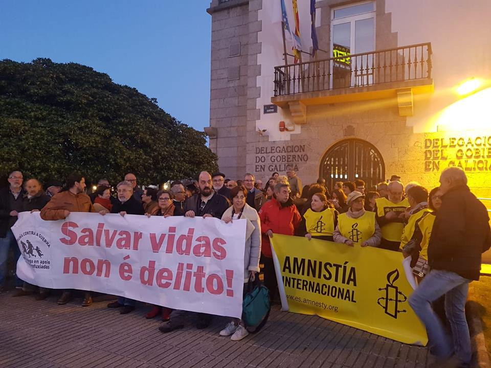
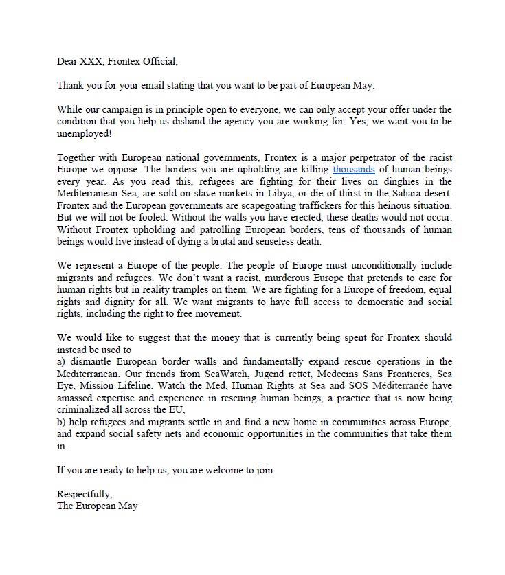

### AYS Daily Digest 22/03/2019: Outpour of Solidarity For Brave and Noble Captain — Pierto Marrone
#### 70,000 Arrests made in Morocco in 2018// Protesters in Libya facing torture for over 2 weeks// Refugees in Greece may soon be kicked out of subsidized housing// Man dies in Fire in Italy// And more news from Spain, Malta, Germany and France

](assets/4f7271ba31cd/1*_t3geWCVfikR78j26Udn5A.jpeg)

Open the Ports — [Iasonas Apostolopoulos](https://www.facebook.com/iasonas.apos?__tn__=%2CdCH-R-R&eid=ARDSTRbh1WMT7mP16VTOf3XRkWPqPdRnnaMzpDOEXp2OZDg2Hbl1azKm04VVMb74US60kEDoR8VKcqMM&hc_ref=ARRcum45q8Ni9XcTSctdntlGUO_m579phhLDVz1S62tCqFbkLffhjaNq1n03bKHGJU0&fref=nf)
#### Feature:

Messages of support have been spreading for the captain Pietro Marrone of Mare Jonio, who is currently under investigation for the crime of ‘facilitating the illegal immigration’ and ‘the violation of Italian Navigation code because the captain refused to stop at the order of a military ship\.’

On the way back to Italy, \(12 miles\) from Lampedusa, the military police ordered the Pierto Marone to stop the vessel which had 70 people on board and turn off its’s engines\. However, at the time the sea was extremely rough with 3 meter waves, and the captain refused to follow these orders, in the fear that it would bring the ship into a critical situation endangering the lives of everyone on board\. A truly heroic and noble decision\.

](assets/4f7271ba31cd/1*cqAXHciQ2Iqei6j8OktHCA.jpeg)

[Iasonas Apostolopoulos](https://www.facebook.com/iasonas.apos?__tn__=%2CdCH-R-R&eid=ARDSTRbh1WMT7mP16VTOf3XRkWPqPdRnnaMzpDOEXp2OZDg2Hbl1azKm04VVMb74US60kEDoR8VKcqMM&hc_ref=ARRcum45q8Ni9XcTSctdntlGUO_m579phhLDVz1S62tCqFbkLffhjaNq1n03bKHGJU0&fref=nf)

He has been quotes saying that he would do it all again to sae the peoples lives\. _“What was I supposed to do, let them die?”_ he said\.

Luca Casarini, the mission chief of the migrant rescue NGO Mediterraneo, has also been placed under investigation for complicity in the rescue efforts of captain Pierto\. The Search and Rescue vessel in question ‘Mare Jonio’ is run by the Rome based NGO Mediterranea — Which is also under investigation for rescuing people from a sinking boat off the coast of Libya\.

> The rest of the crew, we are free of investigation\. Salvinis cries for the immediate arrest of everyone on board Mare Jonio didn’t work out\. There are protests and solidarity actions taking place all around Italy against Salvini s policy of “Closed Ports” and we are already planning the return of Mare Jonio, committed not to tolerate the political decisions that turn the Mediterranean Sea into a huge graveyard\. — [Iasonas Apostolopoulos](https://www.facebook.com/iasonas.apos?__tn__=%2CdCH-R-R&eid=ARDSTRbh1WMT7mP16VTOf3XRkWPqPdRnnaMzpDOEXp2OZDg2Hbl1azKm04VVMb74US60kEDoR8VKcqMM&hc_ref=ARRcum45q8Ni9XcTSctdntlGUO_m579phhLDVz1S62tCqFbkLffhjaNq1n03bKHGJU0&fref=nf) 

■■■■■■■■■■■■■■ 
> **[Sea-Watch International](https://twitter.com/seawatch_intl) @ Twitter Says:** 

> > “Myself and the crew would like to deliver a strong message of support to captain Pietro of #MareJonio for doing the right thing and for rescuing people at sea, getting them to a safe place”.

Captain Joe, #SeaWatch3

@[RescueMed](https://twitter.com/RescueMed) #United4Med https://t.co/NpFLmS7GTq 

> **Tweeted at [2019-03-22 16:11:53](https://twitter.com/seawatch_intl/status/1109125553720885257).** 

■■■■■■■■■■■■■■ 

■■■■■■■■■■■■■■ 
> **[InfoMigrants](https://twitter.com/InfoMigrants) @ Twitter Says:** 

> > 50 people saved by @[RescueMed](https://twitter.com/RescueMed)'s #MareJonio migrant rescue ship told stories of violence and torture after they had arrived on #Lampedusa. One migrant said he crossed the Strait of Sicily and was sent back to #Libya 5 times. 🇮🇹 #Mediterranean #migrants [infomi.gr/13ul.T](http://infomi.gr/13ul.T) 

> **Tweeted at [2019-03-22 13:33:58](https://twitter.com/infomigrants/status/1109085815047626752).** 

■■■■■■■■■■■■■■ 

■■■■■■■■■■■■■■ 
> **[Sea-Watch](https://twitter.com/seawatchcrew) @ Twitter Says:** 

> > Solidarität von Bord der Sea-Watch 3 mit der #MareJonio.
"Bürgerkrieg ist kein sicherer Hafen!"
#FreeMareJonio

Credit: Paul Lovis Wagner https://t.co/voVZkLC2Eh 

> **Tweeted at [2019-03-22 18:43:59](https://twitter.com/seawatchcrew/status/1109163831463415808).** 

■■■■■■■■■■■■■■ 

■■■■■■■■■■■■■■ 
> **[Baobab Experience](https://twitter.com/BaobabExp) @ Twitter Says:** 

> > https://t.co/8hHnLwih1C 

> **Tweeted at [2019-03-22 20:54:30](https://twitter.com/baobabexp/status/1109196678396026885).** 

■■■■■■■■■■■■■■ 

■■■■■■■■■■■■■■ 
> **[OrangeVestMovement](https://twitter.com/theorangevests) @ Twitter Says:** 

> > #OrangeVest sostiene @Rescuemed, unica nave battente bandiera italiana ad operare nel Mediterraneo Centrale. Dona al progetto @Rescuemed per aiutare la nave Mare Jonio a navigare 
👉 [mediterranearescue.org/dona/](https://mediterranearescue.org/dona/)
#mediterraneasavinghumans
#FreeMareJonio 
#SavingHumans
#Apriteiporti https://t.co/xaDqaSWT58 

> **Tweeted at [2019-03-21 19:31:22](https://twitter.com/theorangevests/status/1108813369199472640).** 

■■■■■■■■■■■■■■ 

#### TUNISIA

Two people have been deported from Tunisia to Morocco according to a joint press release made by FTDES and Alarm Phone\. They report that the men of Senegalese nationality were arbitrarily detained by Tunisian authorities upon their entry to the country, where their documents were confiscated and the authorities prepared the proceedings of their deportation\.

■■■■■■■■■■■■■■ 
> **[Alarm Phone](https://twitter.com/alarm_phone) @ Twitter Says:** 

> > Our comrades of Senegalese nationality were deported from #Tunisia and are involuntarily on their way back to Morocco. Our intervention at the airport failed. We condemn these unfounded measures in the strongest terms! 

> **Tweeted at [2019-03-21 16:48:08](https://twitter.com/alarm_phone/status/1108772290639077376).** 

■■■■■■■■■■■■■■ 

Generally, Senegalese nationals are not required to apply for a visa before travelling to Tunisia\. The two individuals were invited by the Tunisian association FTDES\.

■■■■■■■■■■■■■■ 
> **[Alarm Phone](https://twitter.com/alarm_phone) @ Twitter Says:** 

> > Update: After our comrades got deported back to Morocco yesterday evening they have been in airport custody in Morocco the whole night. Now we can announce that they were safely released. 

> **Tweeted at [2019-03-22 12:27:01](https://twitter.com/alarm_phone/status/1109068964267782145).** 

■■■■■■■■■■■■■■ 

#### MOROCCO

A Mediterranean fishing vessel rescued a number of peoples whose boat began to capsize\. The survivors are from sub\-Saharan Africa and were at great risk of drowning in the sea\.

According to [the a report](https://www.infomigrants.net/en/post/15867/ngo-accuses-morocco-of-campaign-of-targeted-repression) , the [Moroccan Association for Human Rights](http://www.amdh.org.ma/) \(AMDH\) has disclosed that in the year 2018m Moroccan authorities were responsible for 340 ‘irregularities’ that negatively impacted people on the move\. AMDH also reports that 9,100 foreign nationals were jailed in Nador \(650 minors that were subsequently released in other areas of Morocco and left without any assistance\) and a further 15,000 were jailed in Tangiers in what they label a ‘campaign of targeted repression\.’

AMDH also explains that Nador has become a ‘migrant free zone’ where people on the move are only tolerated if they remain in reception camps — where they are generally ‘collected’ until they are expelled from the country\. Over 70,000 arrests were made in 2018\.
#### LIBYA

Sally Hayden reports that 22 people, including minors, who were arrested following a protest against the abhorrent conditions in Libyan detention center over three weeks ago are still not released\. They remain locked underground in Triq al Sikka detention center as punishment for protesting\.

■■■■■■■■■■■■■■ 
> **[Sally Hayden](https://twitter.com/sallyhayd) @ Twitter Says:** 

> > I'm starting a new thread about the urgent situation at Libya's Triq al Sikka detention centre. As many as 30 refugees, incl 4-6 minors, are currently believed to be in an underground cell, where they may have been tortured as punishment for protesting.
[aljazeera.com/news/2019/03/r…](https://www.aljazeera.com/news/2019/03/refugees-libya-tortured-breaking-detention-centre-190302181557583.html) https://t.co/U3X1kqb2zW 

> **Tweeted at [2019-03-03 20:19:13](https://twitter.com/sallyhayd/status/1102302428618285056).** 

■■■■■■■■■■■■■■ 

MSF reports that the number of people missing from the shipwreck near Sabratha has risen to at least 30\. Seventeen have been rescued but will be returned to detention in Libya\.
#### GREECE
#### Arrivals

One boat arrived on Samos this morning carrying 65 persons\.

[Refugees in Greece may soon find themselves cut off from a subsidized ‘rent\-free’ housing program called Emergency Support to Integration and Accommodation program \(ESTIA\) \.](https://www.middleeasteye.net/news/syrian-refugees-live-fear-greece-prepares-take-some-housing-support?fbclid=IwAR3wX-GuXPzj4KDl5wQdRH2MmT4qMBGaR3jMBnUaIkixrvPSjHs21oo6CUo) A policy which was made in 2017 which would enforce that any person with refugee status or subsidiary protection who had been living in Greece for over 6 months would slowly start being cut of from the program\.

Currently over 22,800 poeople are acoomodated by ESTIA\. The removal from ESTIA housing is anticipated to occur in stages\. All people in ESTIA housing who arrived before August 2017 will be affected by the first round of cut\-offs\.

[Portugal will accept up to 1000 asylum seekers from Greece by the end of this year, provided that their pilot program in which 100 asylum seekers will be transferred from Greece first is successful](https://blog.refugee.info/portugal-will-accept-up-to-1-000-asylum-seekers-from-greece-fa/?fbclid=IwAR2bqZPLX-4FQFuOXfc1He09EQqiJWUis1M0PIT475eVfqkRF0vR0ZVHhTw) \. Although it is unclear who will be chosen for this program,however it appears that the focus will be on vulnerable people and families who are already in the process of gaining asylum or already have asylum status\.

Reports of a racist and violent incident carried out by Greek police toward a 20 year\-old refugee from Guinea have surfaced\.

The young man left his country after being subject to horrific torture practices and an attempt to have him murdered, experiences which still make him suffer from a sleep disorder — Enough 14 reports\. The i

> Ali was pushed on the street and kicked on the leg where he has an old wound\. He was punched on his face and back by the cops who wanted to put him in handcuffs\. As a result, the man was injured\.When Ali asked to be taken to a hospital because of the pain he was feeling due to the injuries, one of the cops threatened him that ‘you will die here, not at a hospital’\. When he asked ‘Why are you hitting me?’, the cop responded by saying ‘negro go back to your country’\. 

#### ITALY

A 32 year old man has died from a fire that broke out this morning in the new tent city of San Ferdinando\. The man was transferred to the facility on the seventh of March, around two weeks ago\. The cause of the fire remains unclear\.

](assets/4f7271ba31cd/0*q8plNJVUY6kdVHtq)

Source: [MEDU — Medici per i Diritti Umani](https://www.facebook.com/MEDUonlus/?__tn__=%2CdkCH-R-R&eid=ARBwmfM3ziMCJmMx1hS_BWCFXt60_DryIbqrXrCUtVdkwPVtZb0ZCzKFLIu81v3caSIG7odxy3B6XVRU&hc_ref=ARQAZlJryAxE_VsajT22vNmigT77JFds7sZq2DoDxFIDOjZEktjoAhVB4KKWuJ54oC8&fref=nf)
#### MALTA

It [is reported that](https://theshiftnews.com/2019/03/22/asylum-seekers-living-in-rat-infested-conditions/?fbclid=IwAR3F3hMQ1wloAxjJdPdzMD6OJGJF4f9dylb5fiKjEPh0yiSoCpz2MZNgNdk) asylum seekers, refugees and detainees in Malta are living in squalid conditions are experiencing discrimination from public officials\.

NGOs who access the centers have described that the money allowance is too low to cover basic needs and the centers lack adequate hygiene facilities, are overcrowded and have poor infrastructure and security\. Some are reported to also be infested with rats and cockroaches\. Access to mental health professionals is not available and of concern\.

Only very limited NGOs, lawyers and UNHCR are allowed entry into camps — Everyone else including media is refused\. Refugees have a difficult time accessing work opportunities, and discrimination and exploitation appear to be widespread\.

People who are granted refugee status have reported discrimination and disrespect from public officials, when attempting to apply for their three year renewable residence permit\.
#### SPAIN

A demonstration in Spain yesterday against the detainment of Proactiva Open Arms and other Search and Rescue

#### GERMANY

Info Migrants has reported that nearly 50 percent of refugees in Germany fail the integration and language classes\.

■■■■■■■■■■■■■■ 
> **[InfoMigrants](https://twitter.com/InfoMigrants) @ Twitter Says:** 

> > Close to half of #migrants and #refugees currently fail Germany's #integration and language classes, up from 40 percent in 2017. Germany's migration office has been criticized for the quality of the courses. 🇩🇪🏛 @[BAMF_Dialog](https://twitter.com/BAMF_Dialog) @[nicolegoebel72](https://twitter.com/nicolegoebel72)
[infomi.gr/13uq.T](http://infomi.gr/13uq.T) 

> **Tweeted at [2019-03-22 12:20:35](https://twitter.com/infomigrants/status/1109067346801508353).** 

■■■■■■■■■■■■■■ 

#### FRANCE

Care 4 Calais reports that police have increased their efforts to make life difficult for asylum seekers in Calais\. Clearances are occurring twice a week for months, not allowing any sort of tent to be set up to shelter through the night\.

> In the last two weeks there have been increased forcible clearances and arrests, more smashed mobile phones, and the refugees are tired, battered, confused and scared\. The atmosphere has been increasingly tense following the death on 9 March of a 20 year old man in a lorry, and the terrifying deportation of a Sudanese man back to Sudan this week, where he may well face torture or even death\. 

[The Constitutional Council has ruled](https://www.lemonde.fr/societe/article/2019/03/21/le-conseil-constitutionnel-valide-les-tests-osseux-pour-les-jeunes-migrants_5439373_3224.html?fbclid=IwAR0x4IV-AbK8bk5FtqtiZ_8Y6KtbuOt8GOawalDM5CkbgwdBSUcsQQP4q_E) that the law allowing the use of bone tests in the bid to determine the age of young asylum seekers is in line with the constitution\. This ruling was made despite the admittance that the tests have a ‘margin of error’ and are not always accepted in the courts\.
#### GENERAL

A very nicely written letter to Frontex :\- \) enjoy \!

**Apart from daily news in English, we also publish weekly summaries in [Arabic](%D9%85%D8%B9-%D8%B2%D9%8A%D8%A7%D8%AF%D8%A9-%D8%B9%D8%AF%D8%AF-%D8%A7%D9%84%D9%88%D8%A7%D9%81%D8%AF%D9%8A%D9%86-%D8%A5%D9%84%D9%89-%D8%A3%D9%88%D8%B1%D9%88%D8%A8%D8%A7-%D9%8A%D8%B1%D8%AA%D9%81%D8%B9-%D8%B9%D8%AF%D8%AF-%D8%B9%D9%85%D9%84%D9%8A%D8%A7%D8%AA-%D8%A7%D9%84%D8%B7%D8%B1%D8%AF-%D8%A3%D9%8A%D8%B6%D9%8B%D8%A7-f20d1e8f3229) and [Persian](%D8%A8%D8%A7-%D9%88%D8%B1%D9%88%D8%AF-%D8%A8%DB%8C%D8%B4%D8%AA%D8%B1-%D8%A8%D9%87-%D8%A7%D8%B1%D9%88%D9%BE%D8%A7-%D8%AA%D8%B9%D8%AF%D8%A7%D8%AF-%D8%A7%D8%AE%D8%B1%D8%A7%D8%AC-%D9%87%D8%A7-%D9%86%DB%8C%D8%B2-%D8%A7%D9%81%D8%B2%D8%A7%DB%8C%D8%B4-%D9%85%DB%8C-%DB%8C%D8%A7%D8%A8%D8%AF-5d4e3d41c7f6) \. Click on those links to check out the ones about the week from the 11th to the 17th of March\.**

**We strive to echo correct news from the ground through collaboration and fairness\. Every effort has been made to credit organizations and individuals with regard to the supply of information, video, and photo material \(in cases where the source wanted to be accredited\) \. Please notify us regarding corrections\.**

**If there’s anything you want to share or comment, contact us through Facebook or write to: areyousyrious@gmail\.com\.**

_Converted [Medium Post](https://medium.com/are-you-syrious/ays-daily-digest-22-03-2019-outpour-of-solidarity-for-brave-and-noble-captain-pierto-marrone-4f7271ba31cd) by [ZMediumToMarkdown](https://github.com/ZhgChgLi/ZMediumToMarkdown)._
