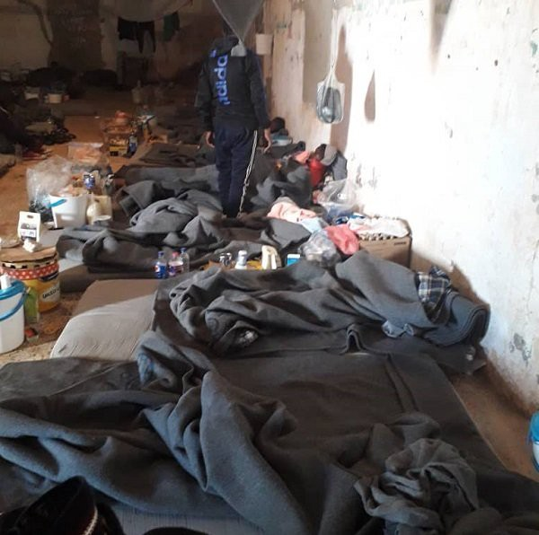
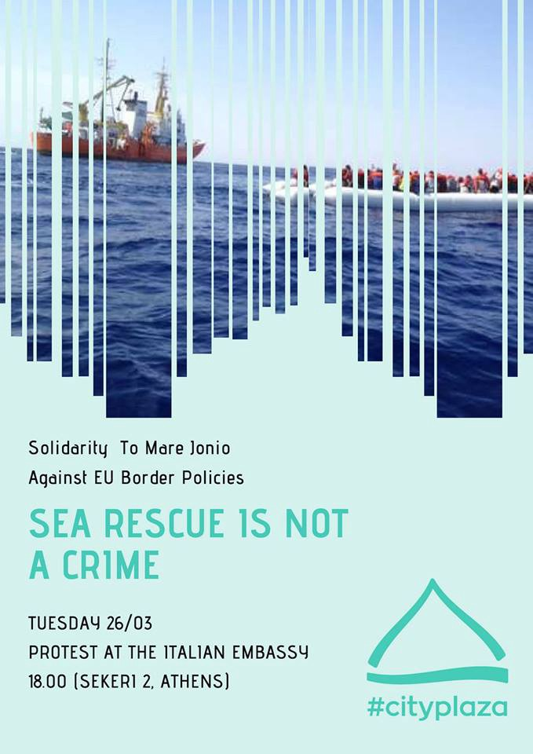

### AYS Weekend Digest 23–24/03/2019 Institutional racism in the EU

Borders keep killing in Calais, in Libyan detention, in the Western Med and on the Evros River /// Boat in distress in the Central Med /// Demonstration on Tuesday in Athens against Italian policies of criminalisation of sea rescue /// Advice to resist deportation in Switzerland /// France complicit with Sudanese dictatorship, claim ASUAD /// Updates from Italy, Croatia, France

 / [ArtAgainst](https://www.facebook.com/artagainstproject/photos/a.639651369417634/2111772902205466/?type=3&theater)](assets/1f1bf33bbeff/1*AO5tji5DVUuLDoxVXyUTmQ.jpeg)

\#NoBorders — \#OpenEUborders — An immigrant drowned\! by [Ali Divandari](https://www.facebook.com/ali.divandari.official/) / [ArtAgainst](https://www.facebook.com/artagainstproject/photos/a.639651369417634/2111772902205466/?type=3&theater)
#### FEATURE — INSTITUTIONAL RACISM IN THE EU

AYS has reported many times about the fallacies and the abusive nature of European migration policies\. National governments are no less criminal, and often introduce policies that are blatantly illegal and against the human rights of people on the move\.

We are getting used to hearing about push\-backs and refoulements, boats in distress at sea, tragedies and drownings, police brutality at the borders and people dying in their attempts to cross the borders — be it in the Mediterranean, on the Evros river between Turkey and Greece, on the fences that protect Spanish colonial outspots in Morocco, or within Europe, on the Balkan route or in the Italian\-French Alps or in Calais, or again where the EU is externalising the repression against people on the move, such as in Libyan detention centres\.

From both left and right, European politicians and mainstream media keep promoting the idea that all we need are more secure borders, and not all lives are worth the same\.

Again, in this digest we will list deaths at our borders, all the way from starvation in Libyan detention to the lifeless body of a young man in the back of a truck in Calais\. These borders kill, but they do not do so indiscriminately, they target vulnerable people, people who flee war, persecution and poverty, people who are not white Europeans, people who are not voters for the next EU or national election, people who are constantly denied their voice and rights\.

Helena Maleno Garzon, a Spanish human rights advocate, calls it institutional racism, reporting on the difference in coverage between the rescue of a Spanish surfer, covered by several national newspapers, and the disappearance of another dinghy between Morocco and Spain, already silenced and forgotten\.

■■■■■■■■■■■■■■ 
> **[Helena Maleno Garzón](https://twitter.com/HelenaMaleno) @ Twitter Says:** 

> > Un surfista desaparece y su rescate es noticia. Una patera desaparece y la tragedia se oculta. Esto tiene nombre y se llama RACISMO INSTITUCIONAL. 

> **Tweeted at [2019-03-24 13:01:57](https://twitter.com/helenamaleno/status/1109802530383556608).** 

■■■■■■■■■■■■■■ 

In similar tones, Sergio Scandura, Italian journalist, summarises this last weekend:

> We have 1,373 people on a cruise saved by the Norwegian Navy, of whom we know everything in detail, their ‘terrifying experience’ included; and we have 41 people on a dinghy in the Mediterranean, sighted by the Italian Navy, of whose fate we don’t know s\* \*t\.” 

■■■■■■■■■■■■■■ 
> **[Sergio Scandura](https://twitter.com/scandura) @ Twitter Says:** 

> > Riassumendo. Abbiamo 1.373 crocieristi salvati dalla Marina norvegese ⚓️🇳🇴 di cui sappiamo tutto nei dettagli, inclusa "l'esperienza agghiacciante"; e 41 persone su un gommone fatiscente nel Mediterraneo, segnalato dalla Marina italiana ⚓️🇮🇹, della cui sorte non sappiamo un c. https://t.co/ikSwbekSZZ 

> **Tweeted at [2019-03-24 19:24:13](https://twitter.com/scandura/status/1109898733683118082).** 

■■■■■■■■■■■■■■ 

LIBYA
#### Deaths from starvation in Zintan detention centre

InfoMigrants have written [a short report](https://www.infomigrants.net/en/post/15815/warning-strong-images-in-libya-s-zintan-center-migrants-starve-to-death?ref=tw&fbclid=IwAR2CCf8QIkaucxJTu6DZ_pZ0xxocovUPYP6jczrQyFMjNl6lYVVp6w_wiQ0) having received photographs of emaciated bodies and testimonies stating that several people have died from starvation in Zintan detention centre in the last weeks\. NGOs have repeatedly raised the alarm about the situation in Libyan detention and [MSF reported](https://www.msf.org/alarming-rates-malnutrition-and-inhumane-conditions-tripoli-detention-centre-libya) on high levels of malnutrition only last week\.

 \)](assets/1f1bf33bbeff/1*H1VnhyDXVihUd2BWDWkCUA.jpeg)

1\. The crammed Zintan center in March, 2019\. Photo: DR — 2\. A starved migrant depicted in Libya’s Zintan center\. Photo: DR \(Source: [InfoMigrants](https://www.infomigrants.net/en/post/15815/warning-strong-images-in-libya-s-zintan-center-migrants-starve-to-death?ref=tw&fbclid=IwAR2CCf8QIkaucxJTu6DZ_pZ0xxocovUPYP6jczrQyFMjNl6lYVVp6w_wiQ0) \)

> According to \*Jon, a migrant who has spent several months in the detention centre, the camp lacks both food and water\. “Migrants have starved to death here recently\. Since September, 14 people have died\. Some have died of tuberculosis, while others have died because they haven’t had enough to eat,” he explains\. “We don’t have enough food, and not enough water\.” 

■■■■■■■■■■■■■■ 
> **[Sea-Watch International](https://twitter.com/seawatch_intl) @ Twitter Says:** 

> > "In 30 years of work, the most harrowing accounts I have ever heard.“
@GilmourUN about the situation of Refugees in Libya.
Europe is responsible for the torture, enslavement and murder of thousands of people in #Libya and the #Mediterranean, because it is funding it. 

> **Tweeted at [2019-03-23 09:41:58](https://twitter.com/seawatch_intl/status/1109389817463427072).** 

■■■■■■■■■■■■■■ 

MOROCCO
#### The bodies of three people wash up on beach

■■■■■■■■■■■■■■ 
> **[Ali Zoubeidi](https://twitter.com/DrAZoubeidi) @ Twitter Says:** 

> > 3 migrants  wash up dead ,this week , on #Sidifni beach after boat disaster attempting to cross #Atlantic to reach  #Spain .
#migration #morocco #safepassage #deadlybusiness https://t.co/5JN0h8inMb 

> **Tweeted at [2019-03-23 17:20:47](https://twitter.com/alzoubeidi/status/1109505281057349633).** 

■■■■■■■■■■■■■■ 

[Reports from Morocco](https://twitter.com/alzoubeidi/status/1109505281057349633?fbclid=IwAR02EnurDgOLPyxTp0zx12PfvWjAoZrgF1C-F4hppTFIElcWtGhzn3cAUgs) state that 3 bodies were found last week\. Unfortunately, these people will most likely never be identified, nor their families informed\. As we [recently reported](https://medium.com/are-you-syrious/ays-weekend-digest-16-17-03-2019-protest-of-detainee-in-italian-cpr-silenced-a7af490f819b?source=collection_category---5------9---------------------) Platforme National de Protection Migrants \(PNPM\) states that identification rates for bodies found along the Moroccan coast line ranges from 2% in Tangier and 18% in Nador\.
#### New laws introduced for migrants

■■■■■■■■■■■■■■ 
> **[Ali Zoubeidi](https://twitter.com/DrAZoubeidi) @ Twitter Says:** 

> > « New »Preventive measures to stop migration flows from subsaharian countries to #morocco and #europe . It will be benefit to #smugglers , prices  will be higher and routes more dangerous . 
#migration #irregularmigration #EU #afrique https://t.co/YS0z6FKNd8 

> **Tweeted at [2019-03-23 12:24:50](https://twitter.com/alzoubeidi/status/1109430802587238402).** 

■■■■■■■■■■■■■■ 

This document states that The Ministry of Foreign Affairs and International Co\-operation — Directorate of Consular and Social Affairs, in accordance with the provisions of Law 02\- 03 on the entry and residence of foreigners in Morocco, will now ask non\-resident foreign nationals, both those from countries subject to the visa requirement for access to the national territory and those exempt from it, to submit to the competent Moroccan authorities the tickets for their return, as well as evidence of possession of sufficient means of subsistence during their stay in Morocco\. A requirement that many, especially those from sub Saharan regions, will not be able to fulfil, further illegalising people on the move and leaving them open to increased police harassment and detention\.

TURKEY
#### Another death feared on the Evros river

A young political refugee from Turkey [is reported](https://www.efsyn.gr/ellada/koinonia/188479_agnoeitai-20hronos-toyrkos-prosfygas-ston-ebro?fbclid=IwAR3dxQw5jWerEOeRTlTI1O5DqXyhZ2u1ZftXRrtDqEdoXhyG-kJc59J5lt4) to have gone missing on Sunday while trying to cross the Evros river in bad weather\. His travelling companion reported the incident and managed to claim asylum\. That Turkey has just received another payment from the EU under the EU\-Turkey deal while at the same time the country’s own citizens flee in fear for their lives, is unfortunately in no way surprising\.

SEA
#### 41 people in distress in the central Med

](assets/1f1bf33bbeff/1*FNH1Kz0UZX4l257x4QbK0A.jpeg)

by [Mediterranea — Saving Humans](https://twitter.com/RescueMed/status/1109538464427577346)

Since MRCC Rome first notified about it and asked to report any information to the Libyan coast guard, these 41 people have been stranded at sea for about 48 hours and counting\.

With Mediterranea vessel impounded in Lampedusa, Sea\-Watch stuck in Malta and the Sea Eye’s ‘Alan Kurdi’ having just left Spain, no rescue boat is in the area\.

GREECE
#### Athens, Tuesday 26/03 — Demonstration in front of the Italian Embassy

[Refugee accommodation and solidarity space City Plaza](https://www.facebook.com/sol2refugeesen) is organising a [demonstration in front of the Italian Embassy](https://www.facebook.com/events/649131245538048/) \(Sekeri 2\) in Athens, in solidarity with the \#MareJonio, impounded by Italian authorities after the rescue of 49 people last week\.
#### Police identifies racist attackers in Konitsa

Local media [report](https://www.keeptalkinggreece.com/2019/03/24/konitsa-afghan-minors-attackers/?fbclid=IwAR3csLRW1xiOHanoVYMBM17MPt1-Zcc4CDRJOvM_KCu01OLfC_JeIqEtEmE) that 4 people have been identified and charged for the racist attacks against a group of Afghan kids in Konitsa last week\. One of them, a 30\-year\-old man is reportedly a member of the Nazi organisation Golden Dawn\.

As we reported, he and three teenagers attacked the group of kids in the reception centre for unaccompanied migrants in Konitsa, northern Greece, breaking the arm of one of them\.
#### Donation needed for Our House, Athens

> As we served food in Victoria tonight, we were very happy to see again Ghania and her team\. They gave solidarity with the homeless a short while ago and great to welcome them back\.
 

> This kind of support gives great morale to everyone involved, come join us if you can spare a little time\.
 

> Yesterday and today we house a young couple with a small child where the wife is ill\.
 

> Also 2 single women for 2 days where the squats can’t take them and we don’t yet find a women’s shelter who can help\.
 

> We now are on zero in the donation fund, these people must face the street again tomorrow\! \! 

If you can help [Our House](https://www.facebook.com/ourhousegr/) , donate via Paypal here: [https://www\.paypal\.me/Helphumaninneed](https://www.paypal.me/Helphumaninneed?fbclid=IwAR1LD2Y_Xq4nE4tQWQnxIEPwPhzB65LPwKPHWhjZbl3fGnjLFRXKmPO0-r0)

ITALY
#### People rescued by Mare Jonio vessel transferred to Porto Empedocle hotspot

ASGI [sent official requests to Italian authorities](https://www.asgi.it/asilo-e-protezione-internazionale/lampedusa-mare-jonio-detenzione-hotspot/?fbclid=IwAR1QdJuzSXAB4MozuJ0nlcAnwvnA3mgmSuxXuh9kTHKqfv9YEFQBXz4Z9GM) to gain information about the conditions of the 49 people rescued in the last days by the Rescue vessel Mare Jonio, now impounded by Italian authorities\. Fears of arbitrary detention rose from several reports on the conditions of the hotspot in Lampedusa and the long delays people on the move face before being allowed to leave\. On Sunday morning, [they have been reportedly transferred](https://twitter.com/Medhope_FCEI) from Lampedusa to the hotspot in Porto Empedocle, Sicily\.
#### 25 people rescued in south\-eastern Italy

Local media [report](https://www.rainews.it/tgr/puglia/video/2019/03/pug-sbarchi-migranti-salento-minori-donne-Guardia-Finanza-Croce-Rossa-2f38212a-4b83-4b8f-8a85-61a596bd2a33.html?wt_mc=2.www.fb.tgrpuglia_ContentItem-2f38212a-4b83-4b8f-8a85-61a596bd2a33.&wt&fbclid=IwAR0wHlLppDOTk9AT7YKRosA0hbDhhWfbQLhidEpv3sCpKyR6mPl5nGMT1c0) that 25 people \(among them 4 women — one pregnant — and six minors\) have been rescued off the coast in the area of Lecce, south\-eastern Italy\. They are from Turkey, Iraq and Kurdistan and spent more than 5 days in the sea before reaching Italy\. It is reported that two traffickers were also on board\.

SPAIN

**Country report published by AIDA**

AIDA, Asylum Information Database, published their [2018 update to the country report on Spain](http://www.asylumineurope.org/news/20-03-2019/aida-2018-update-spain-france) \.

In 2018 55,570 asylum seekers were registered in Spain\. People are forced to wait up to 6 months to lodge their claim, and some have been given “appointments as late as December 2020”\.

According to the report, new resources have been allocated to manage rising numbers of people arriving, especially for the identification of people’s vulnerabilities in the first days of arrival\. New facilities have been created: Centres for the Temporary Reception of Foreigners \( _Centros de Acogida Temporal de Extranjeros_ , CATE\) and Centres for Emergency Reception and Referral \( _Centros de Acogida de Emergencia y Derivación_ , CAED\) \.

AIDA notes that — according to media outlets — several people and entire families, who were returned to Spain under the Dublin Regulation, have been excluded from the reception system and rendered homeless, on the basis that they had renounced their entitlement to accommodation upon leaving Spain\. Only in January 2019 the Superior Court of Madrid forced the government to take action and ensure that all those “returned under Dublin regulation are guaranteed access to reception”\.

Read the [full country report here](http://www.asylumineurope.org/sites/default/files/report-download/aida_es_2018update.pdf) \.

CROATIA
#### More people to arrive in Croatia through resettlement programme

According to the [Welcome Initiative](https://welcome.cms.hr/index.php/en/category/news/) weekly digest another group of refugees from Syria will arrive in Croatia through the resettlement scheme next month\. Approximately 150 people have already come to Croatia through this scheme, but 30% of these people have left the country\.

The reason for this are thought to be two fold\. Firstly, Croatia needs to improve its integration system, providing language courses and social support as required by law\. Secondly, Croatian police officers must cease denying people the right to seek asylum at the borders with Bosnia and Herzegovina and Serbia, through violent push backs\. This practice results in refugees being stuck in Bosnia and Herzegovina, where camps are declared full, and where refugees are forced to sleep outside in summer camping tents\.

> In this way, Croatia backs and participates in the EU policies of externalization of migration which can be found not only in the African countries but along the border areas of the European Union\. 

#### 15 people rescued from Plljesevica Mountain

[Local media report](https://www.jutarnji.hr/vijesti/hrvatska/foto-dramaticna-operacija-spasavanja-na-pljesevici-policajci-su-na-nepristupacnom-terenu-nasred-planine-pronasli-15-osoba-medu-njima-bila-i-trudnica/8642426/?fbclid=IwAR11HINJra9c8WQJY8rYqbVL4y7OVDGUCJnzMs2Sw_X-S_bIIMgzNBFB2_w) that 15 people, including one pregnant women, were rescued from Plljesevica mountain\. They crossed irregularly from Bosnia and got lost in the mountains\. While the woman was taken to the hospital, the other people were taken straight to the police station\. It is not clear if they will be allowed to ask for asylum, or if police will push them back to Bosnia\.

SWITZERLAND
#### Advice for people in fear of deportation

Welcome to Europe have publish an [explanation of the deportation system](https://w2eu.info/switzerland.en/articles/switzerland-deportation.en.html?fbclid=IwAR0HgYyAmTrFuf-dEJ6KIIi2_LWOZG9PwvypZCyy0V1CClYTjh1GA1J-knw) in Switzerland including advice on what to do if you wish to resist a deportation\.

FRANCE
#### 2018 Report by AIDA

AIDA, Asylum Information Database, [published their 2018 update to the country report on France](http://www.asylumineurope.org/news/20-03-2019/aida-2018-update-spain-france) \.

139,330 asylum seekers were registered in France\. Many report to be facing obstacles to accessing the orientation platform \(PADA\)and to obtaining an appointment with the Prefecture single desk \(GUDA\) \. Appointment system in the Paris area received harsh critics from both NGOs and courts\.

The report highlights the practice of systematic push\-backs and refusal of entry at the Italian land border continues\. Similar measures of push backs have been introduced on the Spanish land border\. The reform of asylum law of September 2018, limited further the rights of the people coming via the land border, abolishing the “right to a ‘full day’ \( _jour franc_ \), protecting the person against removal can no longer be claimed at land borders\.

The new law introduced ‘accelerated procedure’ for people deemed to be a ‘threat to public order’ or people from a ‘safe country of origin’: they lose any right to remain in the country from the moment they receive the notification of a negative decision\. “They may nevertheless request a suspension before the Administrative Court for their appeal before the CNDA\.” Furthermore, asylum seekers are obliged to remain and report to authorities in the region they are ‘allocated to’, even when no housing is granted, losing their rights to reception if they fail doing so\.

Read the [full country report here](http://www.asylumineurope.org/sites/default/files/report-download/aida_fr_2018update.pdf) \.
#### Another death in Calais

](assets/1f1bf33bbeff/1*YJSkwstR8OuQYBEfSC_QAg.jpeg)

[Photo by Refugee Rights Europe](https://www.facebook.com/RefugeeRightsEurope/posts/2005944256379076)

Refugee Rights Europe [report](https://www.facebook.com/RefugeeRightsEurope/posts/2005944256379076) that on the 8th of March a young man called Kiyar lost his life in Calais\. He was only 19 years old and was trying to get to his extended family who are living in the UK\. This is the first recorded border death in Calais this year\. As always, we wish it to be the last, but as long as these violent border policies continue it is likely there will be more\.
#### Open letter from ASUAD Collective on deportations to Sudan

The ASUAD Collective \(Sudanese Activists United Against Dictatorships\) published [an open letter about the latest deportation from France to Sudan](https://www.facebook.com/collectifasuad/posts/2117307508345026?__tn__=K-R) \.

> **/// WE DESERVE TO LIVE FREE AND EQUAL IN DIGNITY AND RIGHTS\! ///** 

> Few days ago, we learned about the deportation of Jibril, escorted by the French police to Sudan\. For safety measure, he has probably been tied up , not to run away, gagged not to scream, then covered with a helmet to stay anonymous\. Probably also drugged to become a simple package to deliver, because this is how the deportations happen\. Similar to the treatment of criminals on death row\.
 

> By delivering Sudanese nationals to their executioner, France becomes an accomplice of the Sudanese dictatorship\! 

> We accuse France of the non respect of the European Convention of Human Rights Article 3 :
 

> “No one shall be exposed to torture or to inhuman or degrading treatment or punishment”\. 

> We accuse France of the non respect of the Universal Declaration of Human Rights for some Sudanese asylum seekers: 

> \-Article 1: “All human beings are born free and equal in dignity and rights”
 

> \-Article 14: “In the face of persecution, everyone has the right to seek asylum and to benefit from asylum in other countries\. This right can not be invoked in the case of actual prosecution based on a crime of common law or on acts contrary to the purposes and principles of the United Nations\. ” 

> We condemn this complicity, we ask France to stop immediately any expulsion to Sudan\! 

> We demand the release of Sudanese awaiting deportation\! 

> We call on the French people to rise up with us and challenge the authorities\! 

SWEDEN
#### Baby Strollers collection for Greece

[Team Sweden](https://www.facebook.com/teamswedenvolunteers) is collecting baby strollers for people on the move stranded in Greece\.

If you can help, contact them [HERE](https://www.facebook.com/teamswedenvolunteers) or read more [HERE](https://www.svt.se/nyheter/lokalt/orebro/samlar-in-barnvagnar-till-flyktingar-i-sodra-europa?fbclid=IwAR1zEEYX-tOd4FvNaEm790iuucP6OwZ8qYWGEqERrEuOvvYQPD8TPqR-qwc) \(from Swedish media\) \.

**Apart from daily news in English, we also publish weekly summaries in [Arabic](%D9%85%D8%B9-%D8%B2%D9%8A%D8%A7%D8%AF%D8%A9-%D8%B9%D8%AF%D8%AF-%D8%A7%D9%84%D9%88%D8%A7%D9%81%D8%AF%D9%8A%D9%86-%D8%A5%D9%84%D9%89-%D8%A3%D9%88%D8%B1%D9%88%D8%A8%D8%A7-%D9%8A%D8%B1%D8%AA%D9%81%D8%B9-%D8%B9%D8%AF%D8%AF-%D8%B9%D9%85%D9%84%D9%8A%D8%A7%D8%AA-%D8%A7%D9%84%D8%B7%D8%B1%D8%AF-%D8%A3%D9%8A%D8%B6%D9%8B%D8%A7-f20d1e8f3229) and [Persian](%D8%A8%D8%A7-%D9%88%D8%B1%D9%88%D8%AF-%D8%A8%DB%8C%D8%B4%D8%AA%D8%B1-%D8%A8%D9%87-%D8%A7%D8%B1%D9%88%D9%BE%D8%A7-%D8%AA%D8%B9%D8%AF%D8%A7%D8%AF-%D8%A7%D8%AE%D8%B1%D8%A7%D8%AC-%D9%87%D8%A7-%D9%86%DB%8C%D8%B2-%D8%A7%D9%81%D8%B2%D8%A7%DB%8C%D8%B4-%D9%85%DB%8C-%DB%8C%D8%A7%D8%A8%D8%AF-5d4e3d41c7f6) \. Click on those links to check out the ones about the week from the 11th to the 17th of March\.**

**We strive to echo correct news from the ground through collaboration and fairness\. Every effort has been made to credit organizations and individuals with regard to the supply of information, video, and photo material \(in cases where the source wanted to be accredited\) \. Please notify us regarding corrections\.**

**If there’s anything you want to share or comment, contact us through Facebook or write to: areyousyrious@gmail\.com\.**

_Converted [Medium Post](https://medium.com/are-you-syrious/ays-weekend-digest-23-24-03-2019-institutional-racism-in-the-eu-1f1bf33bbeff) by [ZMediumToMarkdown](https://github.com/ZhgChgLi/ZMediumToMarkdown)._
