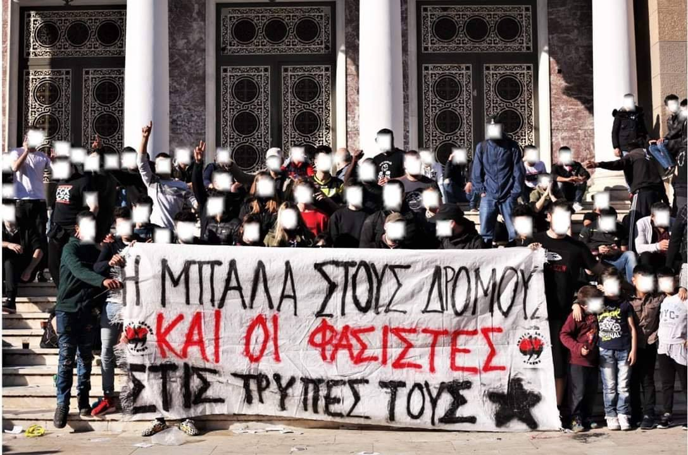

### AYS Daily Digest 25/3/19: More children have died in the Aegean
#### Greece: more lives lost and risked at sea; Report on the status of children asylum seekers; Prepare for the interview / Serbia: Possible eviction in Šid / France: 23 evictions took place during last week in Calais / Living conditions in Bosnian camps, according to UNHCR / UK: five days’ notice people would be removed by charter flight / more news

[Are You Syrious?](https://medium.com/@AreYouSyrious)

Mar 26

 \)](assets/2224c8fb2b3e/1*sE3rck6e1-k6mYbGBOR8zg.jpeg)

Lesvos, Greece \(Photo by [Lighthouse Relief](https://twitter.com/LighthouseRR) \)
#### FEATURE — Another Aegean tragedy

A baby and three women died when a boat carrying a group of people sank off Turkey’s Aegean coast at 3 am this morning, the [Aegean Boat Report](https://www.facebook.com/AegeanBoatReport/?__tn__=kC-R&eid=ARDog7uby5qU6yeUUXQxt3yn3VEKXXzVHcG-BImlAP_X9ma__LF-5c-idN6UeIbStVtH7sHYnWSkZPki&hc_ref=ARRRWGSZsvwUVqcSvXfBlKTtNBIO5Eu-g4-DoTNtLhIofCVT_cFdh-dwUkMu4NzcV3g&fref=nf&__xts__%5B0%5D=68.ARA0el8JRhgKe3sKlS_QcGfJwr9OQQ_2UzG_n8IythhdcxUQDSHo7pOUjEfQprXnKpiHaiL8f_D6Cb1J_BbK5bHxm1jomtNMr46bVenj6w-xyRDnBjBpu4SqQY2c9Lb4y_aZLwWEgEdBO7sc-AVTNMTyJQXTh-hg1IgHBZ78bxZDZ-FbdX4LFhQn37N6ppiJzYPrZSaQhqn-CwbdtjqEh05ntbYnPEVLRgybX4_RPCnhngmYWS6peM8VqNRHJJH-yQyWbI-nVeGjxfZmzNWe_7qoEvGOoPflPhWrHs61cgY9lC9EbyFyKX_Sf3t8uvs7_5irShwM9PWHfUEsfTNr6Oc) team reported\. Additionally, 11 people from the same vessel were rescued, among them also children\.

Reportedly, about 30 percent of the deaths during the first year in which there was a greater number of crossings, 2015, have been of children\. Today, the situation is increasingly worrying, as the situation for people in camps and refugee settlements has been deteriorating, and they are doing the only thing they can do for their children — trying to get them to a better place\.

■■■■■■■■■■■■■■ 
> **[Lighthouse Relief](https://twitter.com/LighthouseRR) @ Twitter Says:** 

> > So far today we have received 3 boats along the north shore of Lesvos, with a total of 128 new arrivals. Our team at cape Korakas spotted and responded to the first dinghy this morning, with the other two boats being intercepted by the coast guard. #lesvos #greece #safepassage https://t.co/RDUNzlrusm 

> **Tweeted at [2019-03-25 07:28:07](https://twitter.com/lighthouserr/status/1110080908919558144).** 

■■■■■■■■■■■■■■ 

62children were among those who arrived on board the four boats that landed on Lesvos during the day, carrying a total of **188 people, the** [Aegean Boat Report](https://www.facebook.com/AegeanBoatReport/?__tn__=kC-R&eid=ARDog7uby5qU6yeUUXQxt3yn3VEKXXzVHcG-BImlAP_X9ma__LF-5c-idN6UeIbStVtH7sHYnWSkZPki&hc_ref=ARRRWGSZsvwUVqcSvXfBlKTtNBIO5Eu-g4-DoTNtLhIofCVT_cFdh-dwUkMu4NzcV3g&fref=nf&__xts__%5B0%5D=68.ARA0el8JRhgKe3sKlS_QcGfJwr9OQQ_2UzG_n8IythhdcxUQDSHo7pOUjEfQprXnKpiHaiL8f_D6Cb1J_BbK5bHxm1jomtNMr46bVenj6w-xyRDnBjBpu4SqQY2c9Lb4y_aZLwWEgEdBO7sc-AVTNMTyJQXTh-hg1IgHBZ78bxZDZ-FbdX4LFhQn37N6ppiJzYPrZSaQhqn-CwbdtjqEh05ntbYnPEVLRgybX4_RPCnhngmYWS6peM8VqNRHJJH-yQyWbI-nVeGjxfZmzNWe_7qoEvGOoPflPhWrHs61cgY9lC9EbyFyKX_Sf3t8uvs7_5irShwM9PWHfUEsfTNr6Oc) team reports\. \(See their page for detailed information on each vessel\. \) A recent [UNICEF](https://www.unicef.org/) report registers an 18% increase in child sea arrivals in Greece in January and February of 2019, compared to the same period during 2018\. As many as 39% of the total sea arrivals in 2019 were children\.

Among the total sea arrivals, 6% were unaccompanied children\. [Here](https://reliefweb.int/sites/reliefweb.int/files/resources/Children_General_data_February_2019.pdf) ’s what happened after they entered the international protection system as asylum seekers:

3531of the 28,000 children UNHCR estimates are currently in Greece are unaccompanied\.

555children received international protection in Greece on first instance in January 2019, including **37 children who are unaccompanied\.**

88accompanied children have been returned to Turkey, in the framework of the EU — Turkey statement, according to the report\.
#### TUNISIA
### “We have to find solutions to allow migrants and refugees to live with dignity”

This is what the Tunisian minister for relations with constitutional instances, civil society and human rights said when he announced that the Medenine migrant center would be closed due to overcrowding and deplorable conditions for those being hosted there, InfoMigrants [reported](https://www.infomigrants.net/en/post/15890/tunisia-announces-closure-of-medenine-migrant-centre?ref=tw) \. Currently the number of people staying in this IOM\-run centre continues to grow daily due to the increase in migrant flows from Libya\. The Tunisian Red Crescent and some local NGOs have long denounced the critical conditions at the Medenine center\.
#### MOROCCO

Deportations of Sub\-Saharan migrants from the Arekmane detention centre continue, the [Association Marocaine des Droits Humains — Section Nador](https://www.facebook.com/AmdhNador/?__tn__=%2CdkCH-R-R&eid=ARBHf3ALIborPeGX3vUbTLpuJL0y6fF8s5L12GK3GnXC8wzLc6izz6W-sS_QZZZNgNGgDMBk_AvyL0V5&hc_ref=ARTdM-irOC3si4s0S5VrUEptD0xhpSF0wiXFsp18XMTsJZ9IUIWhGAIPusPfsQCW9Cs&fref=nf&hc_location=group) reports\.

2buses parked in front of this center transported some 40 people to Casablanca\. The centre had been illegally detaining those people for weeks\. During that time they have literally had no contact with the outside world\.

](assets/2224c8fb2b3e/1*EzdFM-BbqRTjq7K5FzyFNw.jpeg)

Photo: [Association Marocaine des Droits Humains — Section Nador](https://www.facebook.com/AmdhNador/?tn-str=k%2AF&hc_location=group_dialog)
#### TURKEY
### Missing young activist

A 21\-year old computer studies student at Bilkent University has not been heard from since the boat in which he was attempting to cross the Evros River from Turkey to Greece capsized on the morning of March 24\.

Due to his involvement with Liseli Dev Genç, an organization of left\-wing Turkish activist youth, he was jailed for 10 months in 2017 and was released five months ago, but [reportedly](https://gazeteyolculuk.net/meric-uzerinden-yunanistana-gecmeye-calisan-mahir-mete-kuldan-2-gundur-haber-alinamiyor?fbclid=IwAR3bmQPITs37oQCx27P2yCTuA_3mGseEbu2xwKDyTZfHSowT4xM0qflMTPQ) has a travel ban from Turkey\. That is why he attempted to cross into Greece through the Evros River route\.

The young man’s mother is appealing to the Turkish authorities to start a search mission, as she has information that the last place he was seen was in fact the river\.

> “He called and informed us by telephone\. He is currently in a Greek police station\. He said he had seen my son fall in the river\. Despite all this and despite my pleas, a search operation has not yet begun\.” 

■■■■■■■■■■■■■■ 
> **[Onur Dalar](https://twitter.com/onurdlar) @ Twitter Says:** 

> > Mahir Mete Kul satranç şampiyonu pırıl pırıl bir genç. Liseli Dev-Genç'in açıklamalarına katıldığı için 'gizli tanık' ifadesiyle 10 ay hapis yattı.5 ay önce tahliye olmuştu.Yunanistan'a Meriç üzerinden geçmeye çalışırken kayboldu.Bu ülkenin zeki, onurlu gençlerinin sonu bu mu? https://t.co/v6OxmQoJJo 

> **Tweeted at [2019-03-25 21:41:24](https://twitter.com/onurdlar/status/1110295643619278852).** 

■■■■■■■■■■■■■■ 

#### GREECE
### Asylum information

[Mobile Info Team for refugees in Greece](https://www.facebook.com/mobileinfoteam/?__xts__%5B0%5D=68.ARAuzRDL1dKOEaqigZw00FUy5tj3hnpX7e3Q_TvPlfw-edAohEk2XL_CYaXbp4NOijMZxSdKZzzq0imfKyTGqHdCZJZiqiDQtkbwgmIixXZ8XCIHs4uuThLtrb8qXQSjrwrGOOMBMNyStE8o3_h7WLFQNDWddh3fyMbydIsUfWSR5bTImksdNnXs06EWzPJ_I7CClmGgvNe3m4eJAJBibUUS4E6JGgsG1rXAkNc3x-BaFAQmrhRxltMxqLL0bdAOXhIsvCfGoV8itDVuTz3Vgs0dURygR_5vBkbf3QxAm28gDAaXqyh_oJgUlFOiEaDLgP6NX97p4FSz-4X8FpNWOnmBzmCi4U8tT_25zIIsWvM&__tn__=%2CdkCH-R-R&eid=ARBVIcYxO-FN8YQllE-C2OW2NpYR4fJ74oA4Ck0SuxbhszMxN9ekV-bMHvGAFbmIfUtb7opEw07zwk7E&hc_ref=ARQz1M91feTqIyDSfGx9NbxhZDuup2aDd-H8jTTZ4pAdojgylRBQJtocfiwCh4_sraQ&fref=nf&hc_location=group) posted new and important directions for asylum seekers to prepare for the interview, please share with those concerned:

“The by far most important part in your asylum procedure is your big asylum hearing \(asylum interview\) \. The coherence of what you say in your asylum interview is very important\. Remember that **your story will be verified** with family members and other available information including the database of the Greek police, international news and information you gave in previous interviews\. If your story is not consistent with any of these sources your claim will be deemed unreliable and will probably be rejected\.
Make sure you **explain in detail your reasons for leaving your country\.** 
If you were persecuted, then explain clearly why you personally fear persecution on the basis of your race, religion, nationality, political opinion or membership of a particular social group\. If you have any proof of this, show it at the interview\. If not, explain in detail the persecution you have faced\.
**Tip:** Writing down your story before the interview, including all its details, can help you to memorize everything that is important for your case\.
**Important things to mention** are:
\- Dates and times: when things happened which made you leave your country
\- Places: where things happened
\- People: if you remember the names of people involved, it makes it easy for the Asylum Service to verify your claims
Remember again, that it is not vague answers that they ask for, but very **detailed statements** \. If you are asked why you left your home country, try not to use general phrases like “I want to have a better future”\. 
Try to be **very specific and tell your individual story** : why did YOU not have a future? Where did your life take place and what threats were you facing?”
### Athens

Near Agios Panteleimonas in Athens, an area attacked by Nazi groups many times in the past, where hundreds of refugees live, the Distomo anarchists group gathered in a common action of patrol, while playing football and giving out toys for children\.

](assets/2224c8fb2b3e/1*edg74ul0PuG8KAH5HNoJ6w.jpeg)

Athens, photo by: [Αντιρρησίες Συνείδησης](https://www.facebook.com/antirisiessinidisis/?__tn__=kC-R&eid=ARDGBDN1cx0YLzfpuTR1EffBospZdYjIH3tVu4rDY3mVRhJBl5bXQ0ftgG4eS9jsyznv9fLQrZ5OrlmY&hc_ref=ARRyUPGrRUwjeBxRAUZsWXJSVH_YcHmDvw3Bb-1iasrHD1UTIypmcY68KOqo-3u9N-8&fref=nf&__xts__%5B0%5D=68.ARA9TGuz3dKW18zt8scyq7irAp2DZWKGjyfwTtPfHw5H0WRR6_4UmBlMiq39RX1aZbxkB3GP-D6J844IFyUkYH17M0kIOatpJSay3jHYzDVj8rXdQpbxLc3sE5nCPve1BBkJucT9DeSdUKIb-Lagg-TUmUQpi4lNVmFsvJlYO58n4ah_a0MKPzVl9SOhR2y_BWxBtAqz7dklhVGtQ4nJXzOMlisekTcBCo_u3fYq8lPQOIQZeaQv7lX7I9DRRJzSq8_YilDHFbFo3VHENd1fzakHPEUo7SDPWstFoqgd0Bt2a8PyqQCtToTBL8gAnryzGYhk5mo6M2mahwPbGywpQVQ)

> Demonstration of solidarity on Tuesday 26/3 at 18\.00 in front of the Italian embassy \(Sekeri 2, Kolonali\) 

“From our side, we express our solidarity to the crew of Mare Jonio and all the movements that are in the front line of solidarity with immigrants & refugees who are in danger\.

We owe it to them to trample underfoot the politics of exclusion and racism and shout: 
No charges against any of the crew members of Mare Jonio\!
The immediate release of Mare Jonio\!
Sea rescue is not a crime\!”
### Get involved

On Monday evening, about 300 people arrived in Victoria Square, Athens, for hot food\. Volunteers from [Our House](https://www.facebook.com/ourhousegr/?__tn__=kC-R&eid=ARDr121bofWbMu-qmlL0lSaB5wxEJQoGB36XVLiV9fbLFV0tWBDs7Rc6U6r1vMJZS0fWF5IuAtdzFxnD&hc_ref=ARQuvFGbBc5szJF0HX95sXPD56O0sEeZcSR8m7ICZLT2t70oncTcLxryS7-cL2KWlHk&fref=nf&__xts__%5B0%5D=68.ARDFGi2_rRqtRNXRoMy1mz3UZNT9TEtPD-K5K4ek6S29ivPfCPmUo0x0-b5qn8RbYPTzZktzIkHFst7ZzvA7vT6OY-RVvGrbm6WPwu4thgF9xLFaq_aim8QlOBuE2alqew8LGGfKtUpufAn9dn9IbM1vYu3FEpFciWmJC9RN7k14Y3ZFjn63ApzYej6OGWzxDJXDRLjSHf6JfMSISO3UmfM9kFm_a1qtwx2AEVujMV8HsEWbaMELB6i075AXnQTzwnj7DkPLlpaPRaj4_Dw3f4HVGsQ8CKqL6O-NdSBz-5HAo75VUAxqQ8r6-4ax5je2zbpeQUyRxNVlyyRe5XbVNE9QF9-o) had only 130 meals to share\.

In less than a year, the demand has grown from 20 meals to this level each day, they say, and help is needed\. Find their PayPal link on the Facebook website and donate if you can\.

\* \* \*

[Jafra Foundation for Relief and Youth Development](https://www.globalgiving.org/donate/50727/jafra-foundation-for-relief-and-youth-development/) is organizing **food baskets** distribution for refugees in Athens\. They will start distributing food baskets in the informal squats and camps, one basket each week during the month of Ramadan\. Food basket contents: sugar, rice, salt, lentils, bulghur wheat, cooking oil, pasta, tomato paste, tea, milk, ground lintels, fava beans\.
[Join their action](https://www.globalgiving.org/projects/food-baskets-distribution-for-refugees-in-athens/?fbclid=IwAR0LLr91tWxGY2qCmhRGK3ze0uAwfH0ZRKOrIuOfC0z6fEaaNSWVmSizJAU) if you can\.

\* \* \*

**‘Project Esteghlal’** aims to raise money to support refugees and asylum seekers in Athens, who are looking to start their own businesses based on their preexisting skills\. Join the action [here](http://'Project Esteghlal' aims to raise money to support refugees and asylum seekers in Athens, who are looking to start their own businesses based on their preexisting skills.) \.

\* \* \*

Are you a woman who would like to join a team as an **assistant swimming instructor for unaccompanied minor girls** this summer?
They would be happy to hear from you\.
Please contact: michele@refugeeeducationandlearning\.org

> As she read daily updates about this humanitarian disaster, University of San Francisco Masters swimmer Michele Cobble decided she needed to do something\. In visiting the school and meeting some of the 10,000 refugees who live in the Moria Camp on Lesbos while they await entry to other countries, Cobble found that many of the girls “were always quiet and despondent,” and some were resorting to self\-harm\. “It wasn’t until later that I discovered that they had really no outdoor activities available to them,” she says\. 

> Not only would swimming lessons help keep them safe on their island home, it would also help them deal with some of the trauma they endured in getting there\. 

#### SERBIA
### Possible eviction in Šid

No Name Kitchen has warned about the high possibility of refugees being evicted from the squat in Šid during this week\. Some people who have been in contact with the local authorities shared this information with NNK’s volunteers:

> People in the squat have been living on the alert these past weeks and bearing high levels of psychological stress\. Their already critical situation — trapped and suffering constant police harassment at the European Union’s borders — is further worsened by the fact of not having a safe place of shelter\. The continuous criminalization of the people who flee their homes in search of a better future is a reflection of the European Union’s racist policies\. 

> Moreover, if the eviction finally takes place, many of the donations which No Name Kitchen uses daily in the squat to carry on with their work will probably be destroyed — something that already happened during the last eviction on February 20\. 

> The volunteers are ready to act if the eviction takes place and they have made it clear that despite difficulties, they will keep fighting for the right to free movement\. 

](assets/2224c8fb2b3e/1*pYs3MqzbK3O37_phnk0wRg.jpeg)

Photo and info source: [No Name Kitchen](https://www.facebook.com/NoNameKitchenBelgrade/?tn-str=k%2AF&hc_location=group_dialog)
#### BOSNIA AND HERZEGOVINA

A family from Yemen with a sick four\-month\-old child and another who is three years old were on their way to Sarajevo because they were not getting treatment for their child in the Borići camp in Bihać, where they were registered, because there is an ongoing strike of medical workers\. Coming back from Sarajevo, their trip was ended in Velčevo, where the local Red Cross workers provided assistance and basics, and in the end they report they managed to get them back to the IOM, which is running the refugee camp\.

This is just one out of many horrible situations people are facing while in their legal limbo and lodged in the insufficiently organized reception centres in northern Bosnia\.

](assets/2224c8fb2b3e/1*T3FxYOfqTxNwy5MLih5TAQ.jpeg)

Photo: [Crveni Križ Općine Ključ](https://www.facebook.com/profile.php?id=100009318317491&__tn__=%2Cd%2AF%2AF-R&eid=ARDzR45yO3dfgKQznLuznKw-0vcy0hLLqFD5TPaoLJGpHfHiu5NPch7WewoJ-uJQW0IDfn4ILpQAe0wM&tn-str=%2AF)

An investigation is under way into a case where members of the Gradiška Border Police Unit apprehended a Dutch citizen, born in 1969, on the grounds of suspicion that he had attempted to smuggle a person of African\-Asian origin into the European Union countries, the authorities reported, more info [here](http://www.granpol.gov.ba/Publication/Read/937513?title=Holan%C4%91anin%20poku%C5%A1ao%20prokrijum%C4%8Dariti%20migranta%20u%20prtlja%C5%BEniku%20&pageId=57&fbclid=IwAR3TT0r6t9W2rCxXURo75md9Xses6m3f8sv_Q4Gpv6D_KMRzxjMlun_Enp4) \.
### February report by UNHCR

UNHCR has published a [report](https://l.facebook.com/l.php?u=https%3A%2F%2Fdata2.unhcr.org%2Fen%2Fdocuments%2Fdownload%2F68558%3Ffbclid%3DIwAR2MZQ8BcMErxXKfEBiVtj-lkVfYPzm56lfHGB8mvjRkiqCKPdHq7wKJqLo&h=AT3RImCce3gE2Vkl7FAWqjhl8hHbyiMzSC5Z7vBVn7_cYQjeHxH3O8uXNK4tAFXxZLUJRqwSgmzbhROtrkPxQOYVViHFQHeYiQuX7GpgXxIChx6ytZXIHFwqMWUaz6XNkvlEgVNwffYM4nO2jKGEMk13aDVsauZcrgg) on the situation as it was documented in February\. Some of the circumstances have changed, but some realities are the same\. Here are the few we underline:

At the start of the month, a decision made by the USC authorities restricted the entry of newly arriving single men into the Bira and Miral camps, effectively reducing the overall capacity in the country and in USC \(Bira TRC has 2,250 beds but a maximum approved capacity of 1,500 set by the authorities in the Bihać area\) \.

The Sedra TRC provides accommodation for families with children who are prioritized for voluntary relocation from other sites\. The very poor conditions of the building’s structure and water, electricity and heating infrastructure are particularly affecting one part of the facility\. People have a restriction on the use of electricity, other amenities are also basic, if any at all\. As the report states: “The Sedra TRC continues to face challenges with the number of toilets and showers, and the provision of sufficient hot water\. Additionally, challenges pertaining to the drinking water continued in February and refugees and migrants are provided with drinking water through water coolers placed in the TRC, while tap water is used for showers and the laundry\.”

The report also underlines the serious breach of human rights in regards to freedom of movement:

“Police checks of buses and trains continue\. Restrictions placed on freedom of movement, inter alia, inhibit access to rights such as access to the asylum procedure, healthcare, and activities as basic as purchasing groceries, as well as causing and prolonging family separation\. The UN in BiH advocates for these restrictions to be removed and the situation is continually monitored\.”

However, until this report, we did not see any public and straightforward objections from the UNHCR regarding these restrictions\. Links to such statements are welcome under the comments section below\.
#### CROATIA
### “Nobody claimed asylum”

Once again, the Croatian media published \(most likely a PR statement by the police\) a text saying that the police has ‘rescued’ a group of people who crossed the green borders into Croatia\. These sorts of stories always come out in public where rescue teams need to be employed, medical teams, mountain rescue etc\. According to the Croatian police, a pregnant woman was ‘handed over’ to the medical team, who transported her to the general hospital in Gospić, while the others were detained at the police station, where the police would establish their identity and deal with them “according to the national and European laws”\.

However, we wrote to the police to ask for information about what had happened to them \(as the minister had announced they would be allowed to ask for international protection\), and we also called to check what had been done\. The police department of the Lika\-Senj county said the people were given the possibility of asking for asylum, but nobody claimed it, and therefore they would later be transferred to the Transit centre in Trilj, from where they usually deport people back to Bosnia and Herzegovina\. AYS always follows up on these cases, demanding information and trying to get as much information as possible and eventually establishing direct contact with the people involved\. We will publish any further developments to this story\.
#### ITALY

**Arrivals**

Four boats arrived in Italy in about three days, even with NGO SAR vessels prohibited from operating\. This goes against the claims of minister Salvini regarding accusations by the NGOs\. 
A boat with 15 people on board arrived on Lampedusa:

■■■■■■■■■■■■■■ 
> **[Mediterranean Hope](https://twitter.com/Medhope_FCEI) @ Twitter Says:** 

> > Intorno alle 17.30, un barchino con 15 persone a bordo è arrivato nel porto di #Lampedusa, accompagnato da una motovedetta dei Carabinieri. Le persone arrivano da Tunisia e Africa subsahariana, tra loro 2 donne e un bambino. 

#Welcome https://t.co/10GUtTdlAk 

> **Tweeted at [2019-03-25 18:02:23](https://twitter.com/medhope_fcei/status/1110240524638797833).** 

■■■■■■■■■■■■■■ 

■■■■■■■■■■■■■■ 
> **[angela caponnetto](https://twitter.com/AngiKappa) @ Twitter Says:** 

> > 25 #migranti a Leuca (Puglia) 13 a Teulada (Sardegna) e ora altri 16 a Lampedusa (Sicilia). Tutti da soli, in perfetta autonomia. Totale oggi 54 [ilsitodisicilia.it/lampedusa-16-m…](https://www.ilsitodisicilia.it/lampedusa-16-migranti-arrivano-con-una-barca-nella-zona-della-madonnina/) 

> **Tweeted at [2019-03-25 17:34:08](https://twitter.com/angikappa/status/1110233419458465792).** 

■■■■■■■■■■■■■■ 

Also, 25 people arrived in the southern region of Puglia, and 13 in Sardinia\.
### The invisible residences — a report

This Tuesday, MEDU will present the report “The invisible residences\. Survey on housing emergencies in Florence”\. The report stems from a strong need to investigate in depth what has become in the last few years for MEDU operators and operators in Florence: the people assisted by the mobile clinic live in dire conditions, marginalized and excluded due to bureaucratic procedures that effectively prevent the full access to fundamental rights\.

#### FRANCE
### Calais

[Refugee Info Bus](https://www.facebook.com/RefugeeInfoBus/?__tn__=kC-R&eid=ARCa7OemD25oKvh5iek2J-EKdcLPIrNNhIKRWiIk4bz5RObUnVAEC1Ut_QlZDZiRtt9pK4inMe2c_S7c&hc_ref=ARSM-TBYaW4VQQebUwvEz5yOQAofwBC-V97oc88Ocf92jXXwAqj1rNQ9OcmciyD68ps&fref=nf&__xts__%5B0%5D=68.ARAZ9SR0cJTB2CcTzWTJiF8w3msSADG8QK18DQR_0HqXbXGa63elKVuKHDTdYPbtC1U-8M6FLBnWmFOtOdukru_QylQukFHKdGwRTMTaiPqsVbb-nUscaypYfnDb367ruLiJKVYssl5lzWhcsuhieBea3sYcLbECu-092_fwPE_RHRLpHwiCjzqvEqdqi5jYMeCdQy-v0MUHhNfNzQvJQSnC76v4zp30GS-YegUNoQ8o_bUt9z19jeiaT_RyWGDuT1CC4wTenRbNMKGFga1ZPB8BfviCJxxGATEZpXOkGOQXKGHFLWLegCKSMGqzL9d3X9Ni0xqOcnjBJp3SAQ-DUySg3MgV) reports that 23 evictions took place during the past week\. 
Since the start of this year this rounds up the number of evictions to 229\. 
They constantly report and document such evictions, stating that tents, clothes and personal items are continually confiscated\.

 \)](assets/2224c8fb2b3e/1*3gIz2HER6dy55HT-M8bcqg.jpeg)

Police evictions taking place in the Calais area \(Photo: [Refugee Info Bus](https://www.facebook.com/RefugeeInfoBus/?__tn__=kC-R&eid=ARCa7OemD25oKvh5iek2J-EKdcLPIrNNhIKRWiIk4bz5RObUnVAEC1Ut_QlZDZiRtt9pK4inMe2c_S7c&hc_ref=ARSM-TBYaW4VQQebUwvEz5yOQAofwBC-V97oc88Ocf92jXXwAqj1rNQ9OcmciyD68ps&fref=nf&__xts__%5B0%5D=68.ARAZ9SR0cJTB2CcTzWTJiF8w3msSADG8QK18DQR_0HqXbXGa63elKVuKHDTdYPbtC1U-8M6FLBnWmFOtOdukru_QylQukFHKdGwRTMTaiPqsVbb-nUscaypYfnDb367ruLiJKVYssl5lzWhcsuhieBea3sYcLbECu-092_fwPE_RHRLpHwiCjzqvEqdqi5jYMeCdQy-v0MUHhNfNzQvJQSnC76v4zp30GS-YegUNoQ8o_bUt9z19jeiaT_RyWGDuT1CC4wTenRbNMKGFga1ZPB8BfviCJxxGATEZpXOkGOQXKGHFLWLegCKSMGqzL9d3X9Ni0xqOcnjBJp3SAQ-DUySg3MgV) \)

There are growing fears that the emergency centre will soon be evicted as the weather conditions improve, [Mobile Refugee Support](https://www.facebook.com/MobileRefugeeSupport/?__tn__=kC-R&eid=ARDGyRGQgjMNhvEoXU29O2pMVd4DEcLu5fg6hdx74bclU0xHGJ0-TOiH7a24N-_2-wE1W7ufn5Vq3xYi&hc_ref=ARRnOHdrkR5oQ3L5JZc_jBh_U6Amx4h1njxuF62M71Li7El8kWFHVYnJEnXN9yKYiB8&fref=nf&__xts__%5B0%5D=68.ARC2uK1XtXDdIKiCogSbdWVLhglsGniIq3WFrRAzr-ZfXjpP1f-Z_VonC3Wo20lhNVuKs-DxwY7tZGVUCbO_wjFwPK-AreQPiPuLZu6xi6YGWDLyirGgQ4ViQiJFCKDp-js8qJnuZrh4Vt5Y65HffPdADM5CaNFU_Q9R-4JOzXnePkk8VDo57hasGx8fsKeVENUmcLZB3uBvgg-rIGZKdzVHQ8h8QVf1k2kYIUDQ8w4Sx2Am2LSfHFXO6B-kJvGK1740gH6jTtKxgbPnsyYYWW20jTGkTVa3GsqhlB6ATqxOCTeu1bZqk9s2zAAvojP2CgHktMWr_dOjGxB9Ut6ytJaMwp5QPLj6vC01qq_vsglUVGsUMl9icA) warns, so the organisations present on the ground call for donations and support — they publish what is needed on their website\.

](assets/2224c8fb2b3e/1*4f5RboBZisckSbyFZ8Ao3Q.jpeg)

Photo: [Mobile Refugee Support](https://www.facebook.com/MobileRefugeeSupport/?__xts__%5B0%5D=68.ARC2uK1XtXDdIKiCogSbdWVLhglsGniIq3WFrRAzr-ZfXjpP1f-Z_VonC3Wo20lhNVuKs-DxwY7tZGVUCbO_wjFwPK-AreQPiPuLZu6xi6YGWDLyirGgQ4ViQiJFCKDp-js8qJnuZrh4Vt5Y65HffPdADM5CaNFU_Q9R-4JOzXnePkk8VDo57hasGx8fsKeVENUmcLZB3uBvgg-rIGZKdzVHQ8h8QVf1k2kYIUDQ8w4Sx2Am2LSfHFXO6B-kJvGK1740gH6jTtKxgbPnsyYYWW20jTGkTVa3GsqhlB6ATqxOCTeu1bZqk9s2zAAvojP2CgHktMWr_dOjGxB9Ut6ytJaMwp5QPLj6vC01qq_vsglUVGsUMl9icA&__tn__=k%2AF&tn-str=k%2AF)

Very useful app for people on the move who are in France:

At 7 pm this Monday, in front of the commisariat building of the 12th arrondissement in Paris, there was a gathering in solidarity with the two people who were arrested at the detention centre in Vincennes\.

A petition is out, intended for the French Ministry of Health, calling for the recognition of the psychological trauma of refugees\. 
Find and sign it here:

#### UK

The [Movement for Justice By Any Means Necessary](https://www.facebook.com/movementforjustice/?__tn__=%2CdkCH-R-R&eid=ARDYP13-wB1tpm29trnPYsj9s6QWZ0q10yeXO4EekZM1-1Y6alOfkyAyKUkC5a9rgvoAhc1j4xPCrZl2&hc_ref=ARSNVC7CGzl9qqkD2hAr04VYSdSxANP2dlWkZrZ0IW4RHqMOTjqWcxbGr0yd2BLeOsc&fref=nf&hc_location=group) group has published that Nigerian and Ghanaian people were taken in from signing with the Home Office last Monday/Tuesday \(some at the start of March\) — on the same day they were given **five days’ notice** that they would be removed by charter flight TOMORROW\. They have published some of their stories: [here\.](https://www.facebook.com/movementforjustice/posts/2652862454756107)

**Apart from daily news in English, we also publish weekly summaries in [Arabic](%D8%A3%D9%84%D9%85%D8%A7%D9%86%D9%8A%D8%A7-%D9%85%D8%A4%D9%87%D9%84%D8%A9-%D9%84%D8%AA%D8%B1%D8%AD%D9%8A%D9%84-%D8%A7%D9%84%D9%84%D8%A7%D8%AC%D8%A6%D9%8A%D9%86-%D8%A5%D9%84%D9%89-%D8%AF%D9%88%D9%84-%D8%A7%D9%84%D8%A7%D8%AA%D8%AD%D8%A7%D8%AF-%D8%A7%D9%84%D8%A3%D9%88%D8%B1%D9%88%D8%A8%D9%8A-%D8%A7%D9%84%D8%AA%D9%8A-%D8%AA%D8%B9%D8%A7%D9%86%D9%8A-%D9%85%D9%86-%D8%B8%D8%B1%D9%88%D9%81-%D9%85%D8%B9%D9%8A%D8%B4%D9%8A%D8%A9-%D8%B3%D9%8A%D8%A6%D8%A9-72e5eeb62e92) and [Persian\.](ays-weekly-news-summary-in-persian-march-18-24-154b61d8f8e0) Click on those links to check out the ones about the week from the 18th to the 24th of March\.**

**We strive to echo correct news from the ground through collaboration and fairness\. Every effort has been made to credit organizations and individuals with regard to the supply of information, video, and photo material \(in cases where the source wanted to be accredited\) \. Please notify us regarding corrections\.**

**If there’s anything you want to share or comment, contact us through Facebook, Twitter or write to: areyousyrious@gmail\.com\.**

_Converted [Medium Post](https://medium.com/are-you-syrious/ays-daily-digest-25-3-19-more-childrean-have-died-in-the-aegean-2224c8fb2b3e) by [ZMediumToMarkdown](https://github.com/ZhgChgLi/ZMediumToMarkdown)._
