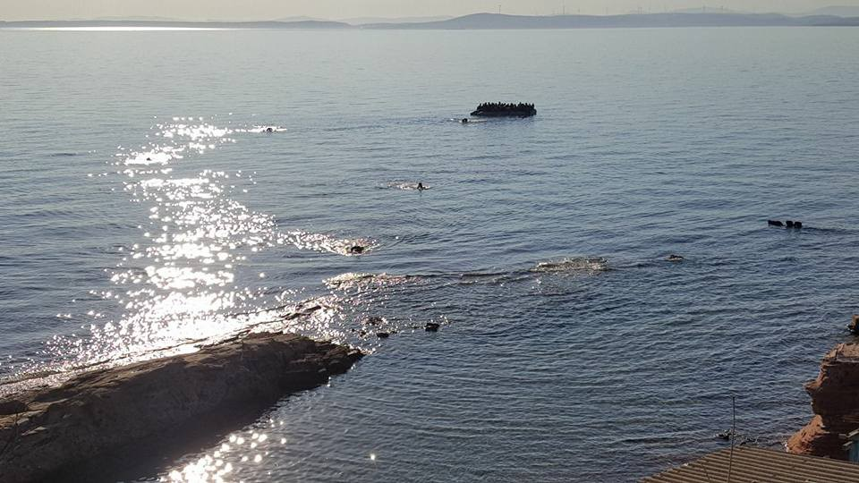
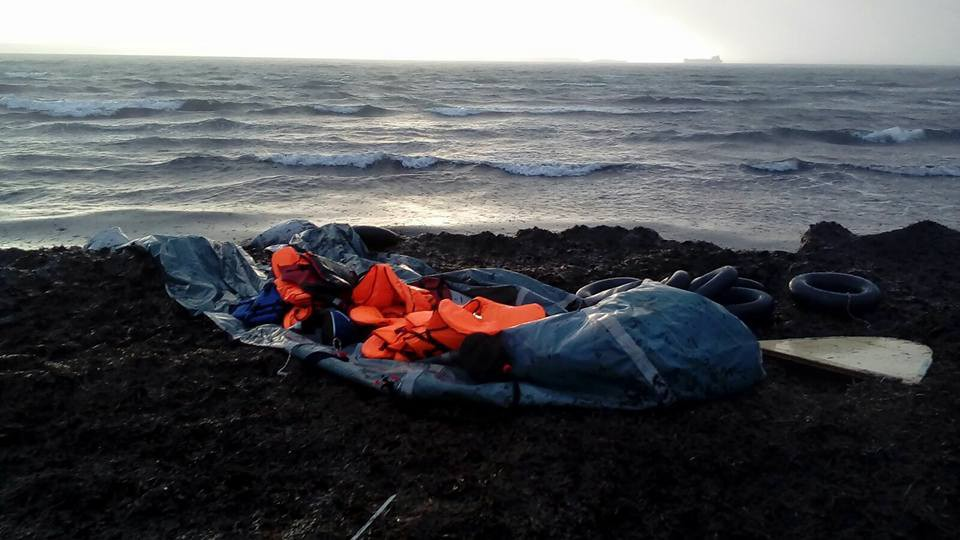

### AYS SPECIAL from Samos: An\(other\) landing

_According to Aegean Boat Report, over 4700 people so far this year made the dangerous crossing over the Aegean Sea from Turkey to the Greek islands\. In March alone, 1512 people arrived\. Additionally, 6860 people were stopped by the Turkish Coastguards before they reached European waters\._

I woke up in the early morning due to the sound of loud thunder and rain pattering on the roof of the house\. Minutes later my friend and I received a message: “There is a boat”\. As we didn’t know the exact location we headed down the road along the sea\. We saw the Hellenic Coastguard boat close to the shore\. “This is very unusual”, I thought\. Normally, they patrol further outside on the Aegean Sea\.

Next to the vessel of the coastguards we saw a black shape\. First, we thought it was just a shadow or a rock in the middle of the water\. But as we waited, we noticed that it is moving\. The black shape was floating towards the island\. It was the boat full of people moving up and in the heavy swell\.

The wind increased, rain was falling from the sky\. We saw that the boat had difficulties to reach the shore because of the wave heights\. Trying to keep track of the rubber dinghy we headed south\. The boat was coming closer to the shore\.

We stopped the car and ran down a stony path towards the sea\. We could hear the people screaming: “Hello\! Help\! We are down here”\! Some of the younger people ran off, along the cliffs\. A man with one leg stumbled up the rocks on his broken crutches\. He slipped on the muddy ground and fell over\. Somebody helped him up\.

As we were running down the hill more people were coming in our direction\. Their expressions were anxious, helpless, panicky\. When we reached the water there was no sign of the boat\. We walked in the direction from which the people were coming\. The boat was further south in the water\. We had to walk over some rocks through the waves to reach it\. On the way down, I called the police to tell them where the boat arrived\.

As we reached it we saw that not everybody was able to walk up to the beach\. An elderly woman was sitting in the water next to the grey rubber dinghy\. She couldn’t get up by herself\. The friend who attend the landing with me and a man who had just lifted his three children out of the boat helped the woman to get up\.

We walked her over the rocks\. Thunder, lightning and rain were accompanying us\. The children were leading us the way up to the beach\. We all sought shelter in a small hut\. Everybody was soaking wet, shivering from the cold\. The woman found a place on the wall\. As soon as she sat down she fainted\. She lost her consciousness over and over\.

Unsure what to do next we kept on looking for the police and the ambulance\. They should have arrived already\. But nobody was in sight\.

It felt like hours until they finally showed up\. The doctors examined the elderly woman and apparently, she was in shock\. Together with the new arrivals we walked up the muddy the path to the street\. 35 people had arrived with that boat amongst them 14 children\.

The thunderstorm was still going on, lightning streak in the sky\. We could see the waves breaking on the rocks\. It wasn’t a ‘safe’ crossing not that such thing exists\. But in these weather conditions everybody was very lucky that nothing worse happened\.

I looked at the water in the direction of Turkey: “Seven kilometres away, 25 € back and forth by ferry, a holiday paradise for some\. For others Turkey means 600–1000€ per person for an unsafe rubber dinghy towards Greece, makeshift shelters in the middle of nowhere, police violence and political arbitrariness”\.

I looked at the children, their parents, I saw the women and men, soaking wet, freezing in the rain\. Some children looked dizzy and numb\. Sometimes they get sedated to process the crossing easier\. All of these people had just risked their lives and the lives of their beloved to find peace and safety in Europe\. Unfortunately, they went from an unsafe stay in Turkey through a perilous journey on the Aegean Sea to find themselves in a refugee camp in Greece\.

After a while the police bus arrived and took the people into the camp\.

According to Aegean Boat Report 4764 people so far this year made the dangerous crossing over the Aegean Sea from Turkey to the Greek islands of Lesvos, Chios, Samos, Kos and Leros\. In March alone 1512 people arrived via boat on the islands\. Additionally, 6860 people were stopped by the Turkish Coastguards before they reached European waters\.

Unfortunately, not everybody survived the dangerous crossing as Aegean Boat Report states: _“This morning, a headless body washed ashore in Vatera Lesvos south\. The body is believed to belong to a 9 year old girl who went missing on February 13, when a boat carrying 51 refugees from Turkey sank outside Tsonia, Lesvos north east\.”_

Another tragedy occurred on March the 7th when a small rubber boat carrying 12 people sank close to the east coast of Samos\. Four\-year\-old twins and their father drowned\.

Two days ago, at least four people, a baby and three women, died when a boat carrying refugees sank off Turkey’s Aegean coast\. 11 people amongst them many children were rescued\.

Since I have arrived on the island a look on the sea is always a look out for a boat\. There hasn’t been a single moment in which I just enjoyed the view\. The sea is a wall, a border and a death\-trap\.

A week later I met some of the guys from the landing outside of the camp\. They remembered my friend and me from that day\. They told us that they were the ones running off on the cliffs\. They didn’t know where they were and where to go\. They were cold, wet and all alone in a foreign place\.

Safe passage for all \!

**_\(By Emmi Chinaski volunteering on Samos\)_**

**Apart from daily news in English, we also publish weekly summaries in [Arabic](%D8%A3%D9%84%D9%85%D8%A7%D9%86%D9%8A%D8%A7-%D9%85%D8%A4%D9%87%D9%84%D8%A9-%D9%84%D8%AA%D8%B1%D8%AD%D9%8A%D9%84-%D8%A7%D9%84%D9%84%D8%A7%D8%AC%D8%A6%D9%8A%D9%86-%D8%A5%D9%84%D9%89-%D8%AF%D9%88%D9%84-%D8%A7%D9%84%D8%A7%D8%AA%D8%AD%D8%A7%D8%AF-%D8%A7%D9%84%D8%A3%D9%88%D8%B1%D9%88%D8%A8%D9%8A-%D8%A7%D9%84%D8%AA%D9%8A-%D8%AA%D8%B9%D8%A7%D9%86%D9%8A-%D9%85%D9%86-%D8%B8%D8%B1%D9%88%D9%81-%D9%85%D8%B9%D9%8A%D8%B4%D9%8A%D8%A9-%D8%B3%D9%8A%D8%A6%D8%A9-72e5eeb62e92) and [Persian\.](ays-weekly-news-summary-in-persian-march-18-24-154b61d8f8e0) Click on those links to check out the ones about the week from the 18th to the 24th of March\.**

**We strive to echo correct news from the ground through collaboration and fairness\. Every effort has been made to credit organizations and individuals with regard to the supply of information, video, and photo material \(in cases where the source wanted to be accredited\) \. Please notify us regarding corrections\.**

**If there’s anything you want to share or comment, contact us through Facebook, Twitter or write to: areyousyrious@gmail\.com\.**

_Converted [Medium Post](https://medium.com/are-you-syrious/ays-special-from-samos-a-nother-landing-b7e7842441b3) by [ZMediumToMarkdown](https://github.com/ZhgChgLi/ZMediumToMarkdown)._
