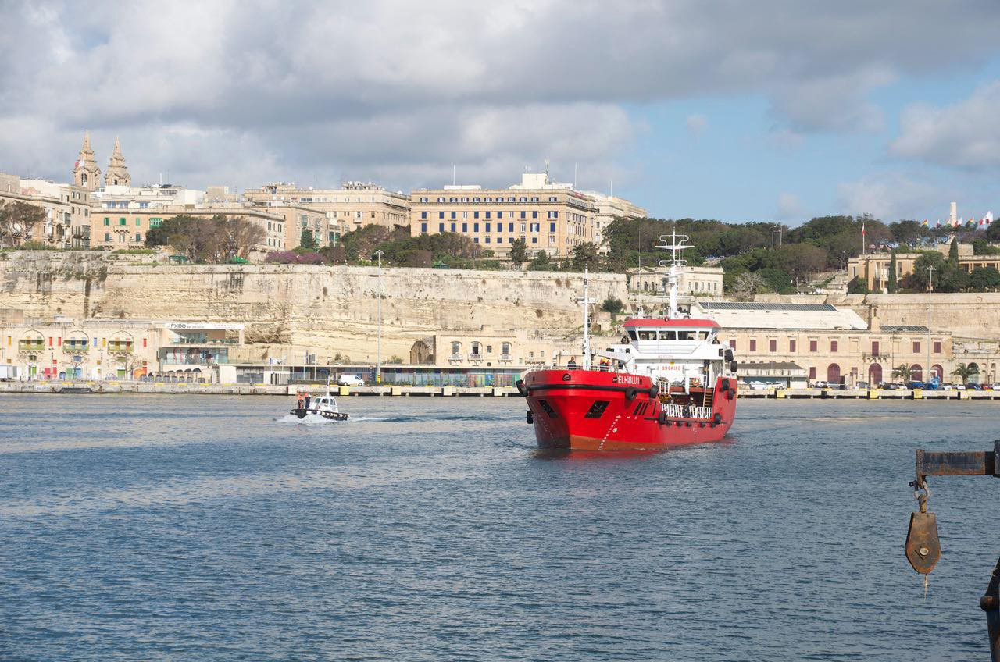
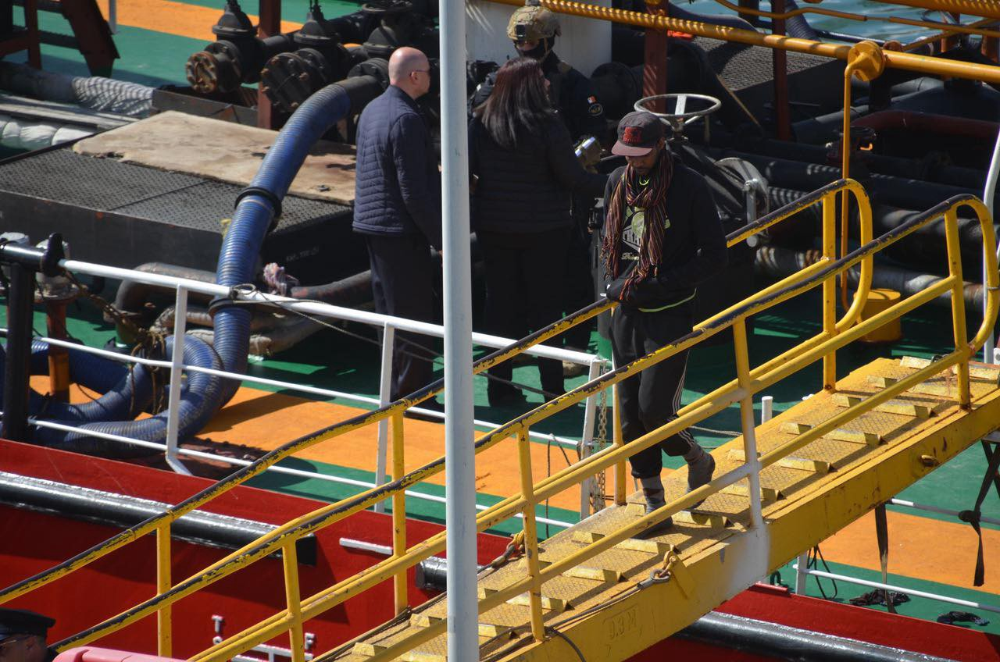
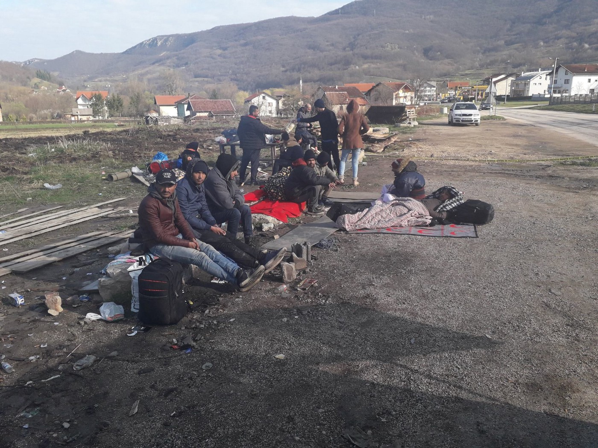

### AYS DAILY DIGEST 28/3/2019: Another bad day in Europe

_Malta, Balkans, Italy, France, Greece… no good news from any of these countries when it comes to people on the move and people who are assisting them\._

 photographed by Matthias Peuker](assets/9601bb71bdc3/1*GShU1M9n5R19gfjSzxsdow.jpeg)

They dream about freedom, but the dreams are intercepted by violence and unwelcoming attitudes\. Photo [LIFELINE](https://www.facebook.com/seenotrettung/posts/538105289929348?__tn__=-R) photographed by Matthias Peuker
### Feature

It is hard today to choose which is the worst news of the day, unfortunately\. We would like to report about positive developments for the people on the move, but the EU border regime and its politicians, as well as those from some other countries who are willing to follow policies made in Brussel, make this difficult\.

A big story we’ve followed these past few days is the status of a merchant vessel with 108 people on board, including at least 12 children and 19 women, which was heading toward Malta\. The ship had rescued these people in the Central Med, off the Libyan coast, and was returning them to a Libyan port on Wednesday when the bridge was taken over and the crew was then ordered to set course towards Malta\.

Photo LIFELINE photographed by Matthias Peuker

People on board did not see an alternative to reach a place where they could feel safe and ask for asylum, so they captured the ship and tried to disembark in some EU country\. And they rerouted toward Malta\. However, they were called pirates, hijackers, and similar names by some politicians and part of the media\. One such politician is Salvini, Italy’s interior minister, who described what is happening as, “the first act of piracy on the high seas with migrants\.”

After a short odyssey, the ship docked at Boiler Wharf on Thursday around 8\.30 am\. People disembarked, but five of them were arrested and taken away in handcuffs\. Apparently they are responsible for what happened\. They are expected to face charges of using force to illegally take over command of the ship and diverting it from its course\.

No weapons were used and no one was injured, but the outnumbered crew members said they were threatened with assault unless they followed orders\.

Photo LIFELINE photographed by Matthias Peuker

A special operations unit team supported by patrol boats and a helicopter then boarded and secured the vessel, handing the control of the ship back to its captain\. [Media reports](https://www.timesofmalta.com/articles/view/20190328/local/hijacked-ship-stormed-by-afm-heading-to-malta.705780?fbclid=IwAR1Dcgjp_ikC2syFxK1VYgHCPd-kUkgTeSqUW8PWOVJr-yKSA5FOj5eSekk) add that, “armed soldiers in battle fatigues and flak jackets,” could be seen guarding people as the ship entered the harbor\.

People on board were desperate not to go back to Libya where living conditions are hellish\.

It is had to say what will happen now to these 108 people\. According to some sources, since they reached European soil, there is little chance they will be sent back to Libya\. According to some sources, people were taken to a detention centre\.

■■■■■■■■■■■■■■ 
> **[Mediterranea Saving Humans](https://twitter.com/RescueMed) @ Twitter Says:** 

> > Immaginate di fuggire da un campo di concentramento. Durante la fuga vi catturano e vi vogliono riportare indietro. Vi ribellereste? Così hanno fatto i “pirati” del cargo #Elhiblu1, per salvare se stessi e i loro bambini. Immaginate, poi giudicate. https://t.co/Kyxbksmtak 

> **Tweeted at [2019-03-28 10:25:46](https://twitter.com/rescuemed/status/1111212780613455873).** 

■■■■■■■■■■■■■■ 

> Imagine fleeing from an internment camp\. During the escape, you get caught and threatened to be brought back? Would you rebel against it? That’s what the ‘pirates’ of the Elhibu1 tanker did to save themselves and their children\. Imagine it, then judge\. 

### Sea

Good news is that there are people in the European institutions who think differently\. One of them is Dunja Mijatovic, the Council of Europe Commissioner for Human Rights, who issued a statement expressing her concern about the decision made by the EU’s Political and Security Committee with regards to Operation Sophia:

> I regret that this will lead to even fewer naval assets in the Mediterranean, which could assist the rescue of persons in distress at sea\. Lives are continuing to be lost in the Mediterranean\. This should remind states of the urgency to adopt a different approach, one that should ensure a sufficiently resourced and fully operational system for saving human lives at sea and to safeguard rescued migrants’ dignity\. 

Furthermore:

> \[…\] the decision to continue only with aerial surveillance and training of the Libyan Coast Guard further increases the risks that EU member states, directly or indirectly, contribute to the return of migrants and asylum seekers to Libya, where it is well\-documented, in particular recently by the United Nations, that they face serious human rights violations\. So far, calls to ensure more transparency and accountability in this area, including by publishing human rights risk assessments and setting up independent monitoring mechanisms, have not been heeded\. The onus is now on EU member states to show urgently that the support to the Libyan Coast Guard is not contributing to human rights violations, and to suspend this support if they cannot do so\. 

Read the full statement [here](https://www.coe.int/en/web/commissioner/-/commissioner-calls-for-more-rescue-capacity-in-the-mediterranean?fbclid=IwAR3A4U4vlSaudzHLrnskX3D_MYhfJDBqn_rNWAJ9if9U8jGDrBhooN1VZs8)
### Lebanon

[Bad news](http://www.arabnews.com/node/1458601/middle-east) comes from Lebanon, too\. Lebanese President Michel Aoun started spreading fear about “another wave” of Syrian refugees heading toward Europe, while expressing his willingness to start with the process of “safe return” for Syrian refugees\.

He said this after the meeting with the EU’s foreign policy chief, Federica Mogherini, in Beirut\.

> Lebanon will continue to work to ensure the return of Syrian refugees to safe areas in Syria, and we will not wait for a political solution to the Syrian crisis as it may take long\. We have received information in Beirut indicating that returning refugees are being cared for by the Syrian authorities, who have provided them with prefabs, infrastructure and schools — the EU and other international organisations can verify this\. 

After the meeting, Mogherini and Lebanese prime minister Hariri inaugurated a new EU building, “the best symbol of friendship and family atmosphere linking the EU with Lebanon,” Mogherini described\.

“Lebanon may be the most European country among Arab countries, and I hope that European students would continue their education in Lebanon,” they concluded at the meeting\.

Lebanon hosts about 1,5 million Syrian refugees, who are often stripped of their basic rights\.

But [this is not all](http://www.arabnews.com/node/1473496/middle-east) \. The prime minister decided to use eastern EU states’ model when it comes to dealing with people on the move as an example for Lebanon\. As it is well known, countries like Czech Republic, Hungary, Poland and Slovakia have largely rejected refugees as a way of resolving their own refugee crisis\.
### Greece

At least two people disappeared after a boat hit a rock in the sea near Chios island, Greece\. 36 were rescued, and search operations are underway\.

 \.](assets/9601bb71bdc3/1*xN15bIZNJtVId0jX4DD5Dw.jpeg)

By [Aegean Boat Report](https://www.facebook.com/AegeanBoatReport/posts/547054842484291?__tn__=-R) \.

According to the available reports, the inflatable boat crashed into the rocks and the passengers fell into the sea in the early morning hours of Thursday\.

Missing people are from Yemen and Palestine\.

There are currently strong north winds blowing with intensity of more than 6 Beaufort\.

Local media [astraparis\.gr](https://astraparis.gr/to-chroniko-tis-tragodias-sto-mersinidi/) reports that none of the boat passengers were wearing a life vest, and there were no life vests in the boat either\.

The Greek government continues sending people from the islands to the mainland, and opening old\-new camps\. On Thursday, 350 left Samos\.

■■■■■■■■■■■■■■ 
> **[Samos Volunteers](https://twitter.com/samosvolunteers) @ Twitter Says:** 

> > Today we said goodbye to 350 people from the camp that moved on to the next step on their journey. We will miss them dearly 💙🧡 https://t.co/echqUHvFZt 

> **Tweeted at [2019-03-28 13:49:41](https://twitter.com/samosvolunteers/status/1111264096823980032).** 

■■■■■■■■■■■■■■ 

As [Samos Volunteers also note](https://twitter.com/samosvolunteers/status/1111264391918469120) , “despite this big transfer, people keep arriving every day, and the amount of people living in deplorable conditions only keeps growing\.”

Mobile Info Team has released a statement titled “ [Don’t Let Humanity Drown](https://www.mobileinfoteam.org/statement-migration) ”\. The text calls for a change of the European migration policies in a way which will respect fundamental European values, like human dignity, equality, democracy, and respect for human rights\. It is addressed to Members of European Parliament to express grave worries about how European leaders have tried to keep migrants away at all costs and how human rights have been increasingly marginalized in the recent past\.
#### HELP NEEDED

[Refugees4Refugees](https://www.facebook.com/.../a.317155.../883120115364998/...) needs volunteers\.

Farsi speaker cultural mediator needed for [Thessaly project ASAP\!](https://www.facebook.com/.../a.256091.../824452891226434/...)

[Khora](https://www.facebook.com/.../a.53525.../1116454331860507/...) is in need of case workers\.
#### Elpida Home is relaunching its operations in Thessaloniki

> “We are very happy to announce that the [Elpida Home has opened a community centre](https://www.facebook.com/elpidahome/) at the beginning of 2019 in the heart of downtown Thessaloniki\. 

> \[…\] Our team is currently providing the following services from our new space: 

> \- LEGAL PROGRAM in partnership with Equal Rights Beyond Borders and the International Refugee Assistance Project\. 

> \- MENTAL HEALTH PROGRAM — Individual & group psychologicl support 

> \- MOBILE HEALTH CONSULTATION PROGRAM 

> In the future they will be adding more services\. For any inquiries, questions or referrals please feel free to email us at [info@elpidahome\.org](mailto:info@elpidahome.org) 

### Balkans

As more people are heading toward the Balkans — some are even talking about an organised walk of couple of thousand of people in a so called Convoy of Hope \(hard to follow what is really happening and who is behind this\) — Frontex announce that they are coming to the region\.

As [EU Observer reports](https://euobserver.com/migration/144521?fbclid=IwAR33TU4UqCa1PLrJYqO2sptS7A4fZ3U1RvSHvFLXvtdd7mZnO26kaMtvdCo) , in the future, people who have had their asylum applications rejected in countries such as Serbia may end up being deported home by the EU’s border agency\.

Italian media are reporting about a big arrest of the alleged members of a trafficking network operating in the region:

> About 21 people have reportedly been arrested as part of the months\-long operation, including 17 in Montenegro, three in Bosnia\-Herzegovina and one in Croatia\. Two police officers were among the suspects detained in Montenegro\. _\( [Italian news agency ANSA](http://www.ansa.it/english/news/2017/05/10/suspected-traffickers-with-pro-jihad-contacts-arrested_5733a751-8475-445b-ad0f-07880046f87c.html) \)_ \. 

### Bosnia

Police continue using illegal practices to prevent people from travelling from one part of the country to another\. Families are left by the road near the city of Kljuc with nothing\. The local population is still helping, bringing donations and spending time with people\. Last night families from Syria and Iraq were among those left on the side of the road\.

](assets/9601bb71bdc3/1*eGqJHjkGKb36EJiS7FVgVQ.jpeg)

[Red Cross Kljuc](https://m.facebook.com/story.php?story_fbid=2305917509728837&id=100009318317491)
### France

[Update from St\. Denis in Paris](https://www.facebook.com/permalink.php?story_fbid=1103660926501345&id=598228360377940&__tn__=-R) :

> \[…\] several [\#exiles](https://www.facebook.com/hashtag/exiles?hc_location=ufi) are anticipating a possible arrival of the authorities to evict them\. And in order not to risk losing all their personal belongings like last Tuesday, they leave very early every morning\. 

Around 15 tents were set up last night in avenue Wilson, and only three or four were still there in the morning\.

While last week police came to evacuate the area, this week, thanks to the presence of several residents of the neighbourhood standing in solidarity with people on the move, the police did not come

> “We are encouraging everyone to keep their eyes open on what’s happening on the step of their door\. And never accept the unacceptable\!” 

[**Utopia 56 Lille**](https://www.facebook.com/utopia56lillecollecte/?__tn__=%2CdkCH-R-R&eid=ARC9gP_IFDZjTjfzYYYciygnZ8l5o6tqWhlEL7OxpALSB3y4-RsBtQswKrv8UOowYs2D8uRTxRcHMj6n&hc_ref=ARQQgJSARZGCvmCi8EKc9M-qhTYAeORz0NLDmYi8Dar3i57fjKMfC5nWE0bFwAO29QY&fref=nf&hc_location=group) needs help\.

[SAJE](https://www.facebook.com/lesajeparis/posts/434758983767626?__tn__=-R) continues to feed people in paris and is raising funding for two vulnerable people staying in a hotel\.
### Germany

There is a [petition](https://www.change.org/p/kein-geordnetes-r%C3%BCckkehr-gese…) against the recent draft from the Ministry of Interior for a new law facilitating deportations, criminalising solidity\.

Demonstrations against the tightening of asylum rights are announced for March 30th\. ‘Heimathorst’ Seehofer calls his new legislative initiative the “Ordered Return Act” \(Geordnete\-Rückkehr\-Gesetz\) \. However, the term “Ruthless Deportation and Deprivation Law” would be more fitting\. The act restricts the rule of law, fair procedures, and civil society commitment\. It is an attack on all of us and on our diverse society\!

For more info on this, [see](https://www.fluechtlingsrat-bayern.de/.../sollte-dr...) \. \(In German only\. \)
### Netherlands

We received an information about two racist attacks in Nijmegen against a house where a group of Syrian asylum holders are living\. The attackers had weapons and fired several shots after they broke into the house\.

Police came, but the residents do not feel safe any longer in the area and are asking for more protection measures\.

The collective “ [We Are Here](https://www.facebook.com/WijZijnHier/posts/2353650418001841?__xts__%5B0%5D=68.ARDNJf-cvN18F7Xfk1zTsAqsHzE1LT25ylGjcpaVRjhwhOuRmApXhB3KJfH3TRhOxsrpEHfOWv-ZkEK6NOmIZKzkh0RwUU1T9yYiodBqaAe0QgC2vRtD4-G71WtS2eyd7UZXaVFQPMT8618RfJMsHXchVCd7fUkSBWFS6U5VmF7Cbjr0UE7NMrWta1tjnV1yScY-WFqrXohlr6E0LMAERU0ssQmFU7ytdbEtFDYFJYxa8YeQa46S-P0T6dUWCgWm59iWE-MA7LDyTOYEtt5lX_Aafv8RsnTTP1fkgZ6ivUGog09Pra_XjWpqnneTQiris2TJC8o5FohacC_FHDplIg&__tn__=-R) ,” that have temporarily occupied the unused building at Bijlmerplein 96 in Amsterdam, invite all to come on Sunday to meet with them and to provide the opportunity to ask questions about the situation\.

> With this invitation we hope to take away any concerns and raise attention for our situation\. We want to live peacefully with our neighbours and therefore invite you to visit us\. You are welcome from 16:00 o’clock and we will provide coffee and tea, but feel free to bring something along\. 

For more information, feel free to contact:

Abdhel Hakim: 0613795591

Fortune: 06842788219
### General

Help Refugees has opened small grant applications which will close on March 31st, 2019\.

The Spring ‘Choose Love’ Pot can be used to fund work in any humanitarian sector\. They will not be able to fund any political activities\.

If you are interested, please download and fill out the form [here](https://helprefugees.org/…/help-refugees-open-call-for-fu…/…) , then email it at: projects@helprefugees\.org with the title ‘Spring Choose Love Pot Application’\.

**Apart from daily news in English, we also publish weekly summaries in [Arabic](%D8%A3%D9%84%D9%85%D8%A7%D9%86%D9%8A%D8%A7-%D9%85%D8%A4%D9%87%D9%84%D8%A9-%D9%84%D8%AA%D8%B1%D8%AD%D9%8A%D9%84-%D8%A7%D9%84%D9%84%D8%A7%D8%AC%D8%A6%D9%8A%D9%86-%D8%A5%D9%84%D9%89-%D8%AF%D9%88%D9%84-%D8%A7%D9%84%D8%A7%D8%AA%D8%AD%D8%A7%D8%AF-%D8%A7%D9%84%D8%A3%D9%88%D8%B1%D9%88%D8%A8%D9%8A-%D8%A7%D9%84%D8%AA%D9%8A-%D8%AA%D8%B9%D8%A7%D9%86%D9%8A-%D9%85%D9%86-%D8%B8%D8%B1%D9%88%D9%81-%D9%85%D8%B9%D9%8A%D8%B4%D9%8A%D8%A9-%D8%B3%D9%8A%D8%A6%D8%A9-72e5eeb62e92) and [Persian\.](ays-weekly-news-summary-in-persian-march-18-24-154b61d8f8e0) Click on those links to check out the ones about the week from the 18th to the 24th of March\.**

**We strive to echo correct news from the ground through collaboration and fairness\. Every effort has been made to credit organizations and individuals with regard to the supply of information, video, and photo material \(in cases where the source wanted to be accredited\) \. Please notify us regarding corrections\.**

**If there’s anything you want to share or comment, contact us through Facebook, Twitter or write to: areyousyrious@gmail\.com\.**

_Converted [Medium Post](https://medium.com/are-you-syrious/ays-daily-digest-28-3-2019-another-bad-day-in-europe-9601bb71bdc3) by [ZMediumToMarkdown](https://github.com/ZhgChgLi/ZMediumToMarkdown)._
