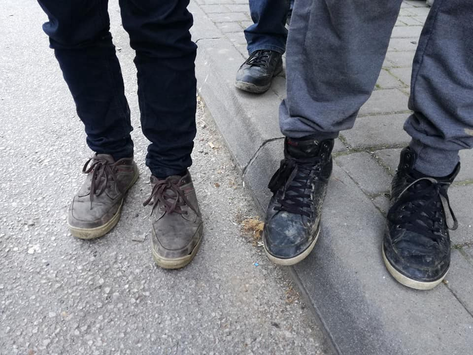
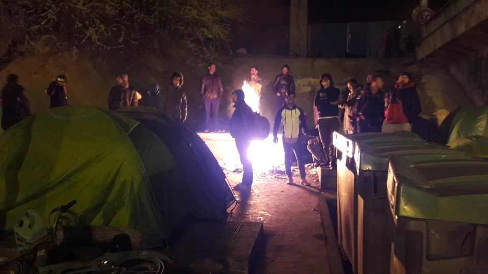
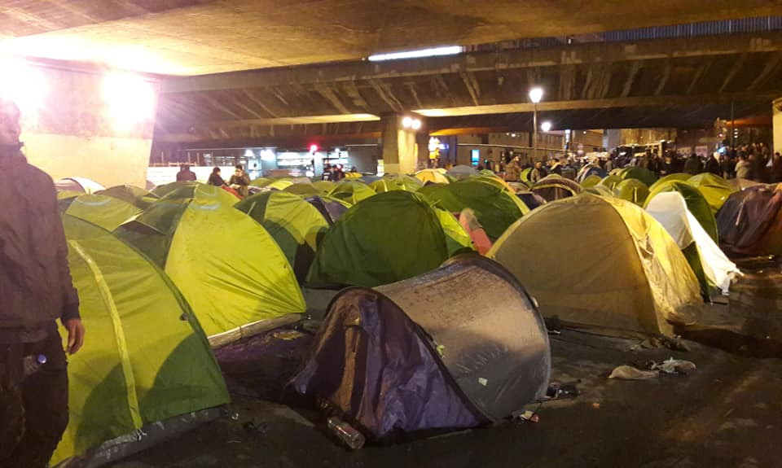

### AYS DAILY DIGEST 2/4/2019: Small victories worth celebrating

_Major of Riace found not guilty // Devastating effects of the floods in Syria // Report on refugee workers in Turkey // 50 people missing in the sea // Police violence in Bosnia // Two deaths in the Balkans this week //_

### Feature

The judges of Reggio Calabria concluded that the mayor of Riace \(Calabria, Italy\), Domenico Mimmo Lucano, is not guilty of scams, robberies, or “marriages of convenience” for immigration purposes\.

The investigation by the prosecution was launched in October last year, while Lucano was placed under house arrest and removed from the city\. The whole investigation was seen by many as the attempt to destroy the “Riace model” — or, as many people knew it, the “town of solidarity\.”

The whole case is just one manifestation of a broader strategy of tougher migration enforcement from Italy’s populist government\.

For over 14 years, Riace has been considered a fully functional model of reception and integration\. The model has been developed since 1998, and since then, hundreds of new residents have joined the small town of about 2,000 people\.

Lucano, who became mayor in 2004, developed this model while trying to solve two pressing issues occurring in his area: the increasing number of arrivals on Italian shores and the worrying depopulation of his town in the past years\. In the arrival of migrants, he saw an opportunity to revive his municipality\.

He created a place where people lived alongside one another — and his policies have proven hugely effective in terms of urban renewal and socio\-economic development\.

Lucano calls Riace an “utopia of normality,” based on the simple concept of integrating those who arrived, using abandoned buildings and providing job opportunities and language classes \(with the support of regional government funding\) \.

Now, the people of Riace are waiting for their mayor to return to their city\.

Unfortunately, the actions of the Italian government in the past year have put the people of Riace in a difficult situation\. After Lucano was arrested, many people had to leave or were transferred\. At the moment, about forty migrants and refugees are housed by the city\. The money to support them is collected mainly through the Network of Solidarity Municipalities\.

Recently, a new fundraising initiative was launched with crowdfunding\.

_“We need everything now in Riace\. New accounts, bills, medicines, the costs are many and the funds are now running out\. We need everyone’s help at this difficult time\.”_

If you can help, please read and share [the appeal](https://comune-info.net/…/insieme-per-la-rinascita-di-ria-/) \.
### Syria

The situation for displaced people in Syria who are living in camps in the northwest of the country remains very difficult after the area have been hit with severe flooding over the weekend\.

More than 8,000 families are affected, according to the Response Coordination Group, a local NGO\.

Since 2012, camps in Syria have been negatively affected by rainstorms\. The last one started early on March 30th and is the fourth to hit the camps since the winter\.
### Turkey

HarekAct brings a new overview of the situation in Turkey, focusing on refugee workers and a recently released Turkish\-language report\.

“The report finds that wages for migrant workers begin from 200 TL weekly but vary according to age and working experience\. Child labourers earn around 20 TL per day in gathering recycling materials and up to 250 TL per week in furniture workshops\.”

Additionally, HarekAct examines the last elections in Turkey, reporting that AKP politicians Recep Tayyip Erdoğan and Binali Yıldırım stressed their pledge to resettle Syrians in Syria, particularly in the border areas\.

Read the full report [here](https://harekact.bordermonitoring.eu/2019/04/02/harekacts-weekly-digest-02-04-2019/?fbclid=IwAR3v51QQMK7EKhHaTZEBHzU-hNsxuWH94BoAHZZzqGzZlXlo_EwwbpVnAlE) \.
### Sea

[Watch The Med — Alarmphone](https://www.facebook.com/1525906057683632/posts/2340787089528854?sfns=mo) reports that a boat carrying around 50 people, including men, women and children, is missing somewhere off the Libyan coast\.

The Alarm Phone received a call on Tuesday at approx\. 10 pm CEST\.

“Since then,” Alarm Phone reports, “we tried to reach the so\-called \#Libyan coastguards tirelessly on several phone numbers\. When we informed \#MRCC Rome about the unavailability of the Libyan authorities, a number was passed on which we had already tried several times, without reaching anyone\! The satellite phone of the migrant group is not being picked up for now about 12 hours\. We are very worried, and no authority seems willing to rescue\. \#MRCC Rome is not giving us any information about this distressing case, not even if they have reached the Libyan authorities\.”
### Italy

On Tuesday morning, with no previous announcement, Italian police entered Park Roya, a Ventimiglia\-based centre run by the Red Cross, [media are reporting](https://la-riviera.it/cronaca/blitz-dei-nas-al-campo-roya-4-ore-di-ispezione-ecco-cosa-e-successo/?fbclid=IwAR2ipOSaMz4idEqLcnMW_VNsSfgukhi5XIgVN948s8q6h7AjDAC2yTM89P0) \.

The raid lasted nearly four hours\. Apparently, police justified their behavior by pointing to irregularities related to conditions in the bathrooms and storage\.
### Malta

■■■■■■■■■■■■■■ 
> **[aditus foundation](https://twitter.com/aditusNGO) @ Twitter Says:** 

> > Save the date for the #lifeline judgement in the case against the captain @[ClausReisch](https://twitter.com/ClausReisch): 14 May at 10am! Let’s cross all fingers (and toes) for a judgement upholding the duty to save lives at sea. #DontLetThemDrown 

> **Tweeted at [2019-04-02 11:15:35](https://twitter.com/aditusngo/status/1113037253864034305).** 

■■■■■■■■■■■■■■ 

### Greece

On Wednesday morning one boat arrived on Nero Island, northeast of Agathonisi\. The 32 people who are rescued will most likely be transported to Samos\.

Another boat was spotted near Kos with 9 people on it, according to the Aegean Boat Report\.

On Tuesday, another assembly was held in Athens to talk about the upcoming mass evictions of people with official refugee status\. It is believed that roughly 12,000 will be affected by the end of the year\.

“We believe that everyone has a right to housing and a dignified means of living\. We stand against the decision to evict and view it as an extension of the discriminatory and violent EU border regime\. We condemn the ministry’s PR exercise that attempts to dismiss justified concerns and win over voters while solving none of the problems caused by the EU, exacerbated by a capitalist system that has already brought Greece to its knees, and compounded by the Greek government,” is one of the conclusions from the Anti\-Eviction Assembly\.

See their statement [here](https://www.facebook.com/svemko/posts/2366148823641914?__tn__=K-R) \.

**Stand up\! Raise your voice\! No more refugees on the street\!**

[No Name Kitchen](https://www.facebook.com/NoNameKitchenBelgrade/photos/a.312076942523930/694620300936257/?type=3&theater) in Patras needs help\.

_“During the first two months of work in Patras, we had the help of a nurse who accompanied us to all food deliveries\. She was responsible for caring for people living in factories and squats\. A few days ago she returned to her house and now we need another person to join our team in order to provide medical help again\.”_

Since Campfire Innovation was founded in 2016, the organization has been collecting [data on grassroots organizations throughout Greece](https://www.campfireinnovation.org/mapping?fbclid=IwAR3hG8fzx2kUa5eXxO9HXanOLP4Exs9x6rR3_FRbx7zNVKOukTPZEExaVzE) and has created a map of services\. Though not a full depiction of all active projects, the map is continuously updated\.

Listings contain the first phase of organizations in Athens and will expand to other geographies in future iterations\.
### Spain

Miguel Roldán, a 32\-year\-old firefighter from Málaga, is facing the possibility of 20 years of imprisonment for “aiding illegal immigration and working with human traffickers”, [El Pais reports](https://elpais.com/elpais/2019/03/27/inenglish/1553678880_692129.html?id_externo_rsoc=FB_CM_EN&fbclid=IwAR1SXnhFn3y56SnGNOX_Gn3qKqAw6696FGMkeKHuCNoOyaL5qtHy_KctaIw) \.

Seven Germans and two Scots who were also aboard the Iuventa, an old fishing vessel that was converted into a rescue ship by the German NGO Jugend Rettet, are also under investigation\.

The boat was seized on August 2, 2017, when Italian authorities launched an investigation into the crew for “facilitating illegal immigration\.”

According to information provided by Jugend Rettet, the investigation phase of the case will end in the summer, and if there is to be a trial, it will begin at the end of the year\.
### Macedonia

One dead and 14 injured refugees were found on March 30on the Udovo — Demir Kapija, the main road near the Vodisir River, organisation [Legis reports](https://www.facebook.com/ngolegis/posts/1974590126000200?__xts__[0]=68.ARCh0ebpEBBP-fB_qMmw5obI6AEd8i7GiT-n7VpG2J4K94-GHcEZuUNXv9mbfTVgOTyVetu80YSUbNR75iyjY-EcOZ7sZ1I2GKZWOH_uCKSllPoH7MnLHx3_eJHwGK3lgp4wUFRL7GR437j2fIMvK0zG_8TuM93Vpa_XJoHDi4Q_E8Sj2kvbb7Z1YS1tDqdkNevxJHHEjnH_JQK_4M7KaGNdFKx9W7UQco-L5YKoNIcAJ5VwRxIblDZASZu2OwRwFz7GlMVelGWU7DaNRA1Vo9b0kOArfYLRysPRbz9X3EDftDRbmUMbNa1gIvn-iPf-PK3j81b490SSJ8SeEXUFcrrCfFwovg&__tn__=C-R) \.

Police Officers from the Regional Center for Border Affairs “South” found the deceased 27\-year\-old S\.I\., a refugee from Bangladesh, and another 14 refugees from Pakistan and Bangladesh, six of them with severe injuries\.

_“From the testimony of the refugees themselves, the driver ordered them to jump from the transport vehicle, because of the police control down the main road\. The jump caused one to be killed on the spot and several injuries for the others\._

_The injured were transferred to the hospitals in Gevgelija and Kavadarci\.”_
### Montenegro

People on the move are still arriving daily in Montenegro — specifically, the town of Pljevlja, close to the Bosnian border\. Some are coming from the direction of Greece, via Albania, heading toward the EU via Bosnia\. However, according to the reports from the field AYS is receiving, The Bosnian border police are engaging in frequent pushbacks, which often turn violent\.

In Pljevlja, the small feminist organization [Bona Fide](https://www.facebook.com/bonafide.pljevlja/) continues providing aid\. However, they face many problems and need your help\.

If you can, get in touch with them and help out however you can\.
### Bosnia

732 arrivals were recorded in Bosnia in January 2019, according to the lastest figures from the UNHCR\. However, the true number could be much higher since large numbers of people goes unregistered\. A q [uarterly ACAPS Risk Analysis report](https://acaps.org/sites/acaps/files/products/files/acaps_crisisinsight_quarterly_risk_analysis_march_2019_final_0.pdf) estimates that up to 50,000 people arrived in Bosnia during the last year\.

For people stuck in Bosnia or making their way through the country, new problems arise every day\.

This weekend, over 100 people arrived in Sarajevo, including many children and at least one pregnant women\. IOM and UNHCR did not provide accommodation for any of them\. IOM claims that camp Usivak, run by the organization, is full and cannot accept new people at the moment\. It is not clear what they envision as a solution, since more and more people are arriving daily\.

Hundreds of people arrived to Tuzla, city close to the border with Serbia, this year\. Help is provided by the locals\. Photo Nihad Suljic\.

At the same time, for people who reached Bihac and Velika Kladusa, both cities close to the EU border, the situation is becoming unbearable\. IOM also refuses to accept new people in the camps, while the police continue their unlawful practices of limiting freedom of movement\.

What’s more, AYS continues to receive reports about police violence, especially in Kladusa, but also in Bihac\. In more than one case, police raided squats where people were staying, telling them they had to go to the camps instead\. Then, when they arrived at the camps, they were refused entry and sent back onto the street\. In Velika Kladusa on at least one occasion, police used force against people, forcing them to stay on the street\.

The following is a short report by a person who claims that he was taken to the police station in the city and badly beaten, in his own words\.

After police beating in Kladusa\. Photo AYS

_“Catch me Police in the night take me to the Camp \(Miral\) \. But because I don’t have a registration card, the security tell me_ go\! _When I returned to the centre the police caught me again and started fighting with me and my friend\. They took me to the police station and beat me all night\. Now I can not walk\.”_
### Croatia

One person was badly injured in what appeared to be incident in a hunting area near Jasenovac\. Apparently, a hunter shot one person who later was taken to the hospital with injuries that could prove fatal, [local media are reporting](https://www.vecernji.hr/vijesti/lovac-u-noci-propucao-stranog-drzavljanina-1310625?fbclid=IwAR2LGwZzwJz83z0JMo9UI95EaUf-zCoaDh1BtydUbN91NBKmQRzLUxw6lHA) \.

The injured person was together with 15 others, including children, and was hiding in the bushes by the road\. After the shooting, police arrested everyone in the group\.
### The Netherlands

Starting from Tuesday, a new policy imposed by the Dutch Ministry of Infrastructure and Water Management that has severe [implications on Sea\-Watch](https://sea-watch.org/en/dutch-government-blocks-sea-watch-3/?fbclid=IwAR2z7rGNtyfk28ncgJUqiUCTTl_l51TM-O2eNWOIdgvBJAYbdEx70MAhHKI) and other NGOs operating ships under the Dutch flag will take effect\.

Here you can find a summarized and annotated version of the information Sea Watch got through the Dutch Freedom of Information Act, as well as the original file: Dropbox\-Link\.

■■■■■■■■■■■■■■ 
> **[MSF Sea](https://twitter.com/MSF_Sea) @ Twitter Says:** 

> > The #Mediterranean remains more deadly than ever, with people over 4 times more likely to die attempting the crossing compared to last year. 

Today the #Dutch Gov’t blocks #SeaWatch 3 and other #NGO ships from rescuing, citing concerns for “safety” of the people… 

> **Tweeted at [2019-04-02 15:19:05](https://twitter.com/msf_sea/status/1113098535904391168).** 

■■■■■■■■■■■■■■ 

### France

Solidarité migrants [Wilson reports](https://www.facebook.com/598228360377940/photos/a.599438026923640/1107063572827747/?type=3&theater) on the death of an elderly woman, “in the mud, close to a soiled mattress and a tent between two highway ramps” in Paris\.

### Germany

[Moabit Hilfe](https://www.facebook.com/…/a.68628858813…/1772981499468017/…) in Berlin is in need of donations\!

**We strive to echo correct news from the ground through collaboration and fairness\. Every effort has been made to credit organizations and individuals with regard to the supply of information, video, and photo material \(in cases where the source wanted to be accredited\) \. Please notify us regarding corrections\.**

**If there’s anything you want to share or comment, contact us through Facebook, Twitter or write to: areyousyrious@gmail\.com\.**

_Converted [Medium Post](https://medium.com/are-you-syrious/ays-daily-digest-2-4-2019-small-victories-worth-celebrating-495004722b0f) by [ZMediumToMarkdown](https://github.com/ZhgChgLi/ZMediumToMarkdown)._
