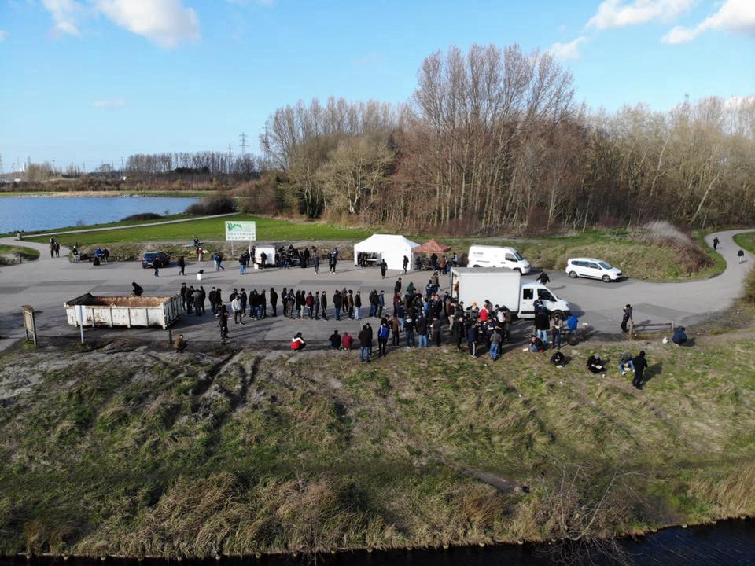

### تم الإبلاغ عن عدد متزايد من عمليات الإرجاع من قبل على الحدود اليونانية
#### AYS Weekly News Summary in Arabic, March 25–31

](assets/cc1329fc0ca9/1*Ru9pqmG7eNLXfmNnPLCQAg.jpeg)

[Samos](ays-special-prison-island-surviving-another-winter-on-samos-72ead10d5096)
#### **الخاصية**
### إذا نظرنا إلى الوراء على التطورات \(وعدم وجود\) في اليونان في عام ٢٠١٨…

تم إصدار أحدث تقرير سنوي عن عايده لليونان ، والاتجاهات التي تم العثور عليها مثبطة للآمال على أقل تقدير\.

تم الإبلاغ عن عدد متزايد من عمليات الإرجاع من قبل الشرطة اليونانية على الحدود اليونانية التركية لمدينة يفروس\.

كان متوسط ​​وقت المعالجة في عام ٢٠١٨من اللحظة الأولى على الأرض اليونانية ٨,٥أشهر\. علاوة على ذلك ، من بين ٥٨٧٩٣طلب لجوء تم تسجيلها في عام ٢٠١٨ ، كان ٨٠,٥٪ منهم لم يجرِ مقابلة معهم بعد\.

من بين جميع الطلبات التي تم استئنافها ، اعتبر ٩١٪ سلبيًا مرة أخرى بعد إجراء مقابلة ثانوية\.

لا يزال يتم رفض الأشخاص الذين يتقدمون للحصول على اللجوء في الجزر اليونانية على أساس عدم المقبولية \(يُنظر إلى تركيا كدولة ثالثة آمنة لهم\) ما لم يتم تحديدهم على أنهم “ضعفاء”\. لذلك تستمر عملية اللجوء في الفشل في تقييم طلبات اللجوء بشكل فردي\.

ملحوظة: بدأت القرارات المتخذة على أساس عدم المقبولية في منتصف عام ٢٠١ ٦وتواصل التأثير على السوريين ، والكثير منهم من الأكراد ومن مناطق مثل عفرين وتركيا ليست آمنة لهم\. تجدر الإشارة أيضًا إلى أن تركيا لا تلتزم بمبدأ عدم الإعادة القسرية ، وبالتالي فهي ليست آمنة لأي شخص يفر من الحرب أو الفقر أو الاضطهاد\.

عدم وجود مؤهلين لتقييم “الضعف” بشكل مناسب وفعال في الجزر اليونانية
### **لبنان**

الأخبار السيئة تأتي من لبنان أيضا\. بدأ الرئيس اللبناني ميشال عون نشر الخوف من “موجة أخرى” من اللاجئين السوريين المتجهين إلى أوروبا ، معربًا عن استعداده للبدء بعملية “العودة الآمنة” للاجئين السوريين\.

قال ذلك بعد الاجتماع مع رئيسة السياسة الخارجية للاتحاد الأوروبي ، فيديريكا موغريني ، في بيروت\.

سيستمر لبنان في العمل على ضمان عودة اللاجئين السوريين إلى مناطق آمنة في سوريا ، ولن ننتظر حلاً سياسياً للأزمة السورية قد يستغرق وقتاً طويلاً\. لقد تلقينا معلومات في بيروت تشير إلى أن اللاجئين العائدين يتم الاعتناء بهم من قبل السلطات السورية ، التي زودتهم بأبنية جاهزة وبنية تحتية ومدارس — يمكن للاتحاد الأوروبي ومنظمات دولية أخرى التحقق من ذلك\.

بعد الاجتماع ، افتتح مغريني ورئيس الوزراء اللبناني الحريري مبنى جديد للاتحاد الأوروبي ، “أفضل رمز للصداقة وأجواء الأسرة التي تربط الاتحاد الأوروبي بلبنان” ، على حد وصف موغريني\.

“قد يكون لبنان أكثر الدول الأوروبية بين الدول العربية ، وآمل أن يواصل الطلاب الأوروبيون تعليمهم في لبنان” ، واختتموا في الاجتماع\.

يستضيف لبنان حوالي ١,٥مليون لاجئ سوري ، وغالبًا ما يتم تجريدهم من حقوقهم الأساسية\.

لكن هذا ليس كل شيء\. قرر رئيس الوزراء استخدام نموذج دول شرق الاتحاد الأوروبي عندما يتعلق الأمر بالتعامل مع الأشخاص أثناء التنقل كمثال للبنان\. كما هو معروف ، فقد رفضت دول مثل جمهورية التشيك والمجر وبولندا وسلوفاكيا اللاجئين إلى حد كبير كوسيلة لحل أزمة اللاجئين الخاصة بهم\.
### **ليبيا**

[ظهرت تقارير](https://twitter.com/sallyhayd/status/1110987454180401152) تزعم أن حارسًا أمنيًا ليبيًا حطم ودمر المراحيض والأنابيب في الزنتان ، تاركًا نحو ١٠٠لاجئ دون الوصول إلى المراحيض ومياه الشرب\. كثير من هؤلاء الأشخاص مرضوا بالفعل بسبب نقص المرافق الصحية المناسبة\. مجرد مثال فظيع آخر على سبب استمرار ليبيا في معاملة قاسية ومهينة لمعتقليه
### **البحر**

وبحسب ما ورد تم الاستيلاء على قارب بواسطة ١٠٨شخصا تم إنقاذهم في البحر بواسطة سفينة تجارية عندما اكتشفوا أنهم كانوا عائدين إلى ليبيا يوم الأربعاء\. على الرغم من أن الناس تصرفوا في يأس من عدم العودة إلى ليبيا ، إلا أن هذه قضية قرصنة من الناحية القانونية\. توجهوا إلى مالطا ، حيث من المرجح أن يتم القبض عليهم\. يعتبر سالفيني الإيطالي القضية “اختطافًا” ، وهو أمر مثير للسخرية بالنظر إلى الأخبار الواردة في قسم إيطاليا اليوم

■■■■■■■■■■■■■■ 
> **[Mark Micallef](https://twitter.com/mmic78) @ Twitter Says:** 

> > Alleged piracy case of El-Hiblu today follows incident in #Misrata in November when #migrants rescued off #Libya by the Nivin refused to disembark, saying they'd rather die than go back to #Libya. Both desperate acts by #migrants that'll ward commercial crews off rescues. 

> **Tweeted at [2019-03-27 16:20:08](https://twitter.com/mmic78/status/1110939570609238016).** 

■■■■■■■■■■■■■■ 

**مالطا**

٣\-٢٢

ذكرت ايتس أن طالبي اللجوء واللاجئين والمحتجزين في مالطا يعيشون في ظروف قاسية ويتعرضون للتمييز من الموظفين العموميين\.

أفادت المنظمات غير الحكومية التي تصل إلى المراكز أن مخصصات النقود منخفضة للغاية بحيث لا تغطي الاحتياجات الأساسية وتفتقر المراكز إلى مرافق النظافة الكافية وتكتظ بالسكان وتفتقر إلى البنية التحتية والأمن\. وتفيد التقارير أن بعضها مصاب بالفئران والصراصير\. الوصول إلى المتخصصين في الصحة العقلية غير متوفر: نقطة مثيرة للقلق\.

يُسمح فقط للمنظمات غير الحكومية والمحامين ومفوضية الأمم المتحدة لشؤون اللاجئين بدخول المخيمات فقط — كل شخص آخر بما في ذلك وسائل الإعلام مرفوض\. يواجه اللاجئون صعوبة في الوصول إلى فرص العمل ، ويبدو أن التمييز والاستغلال واسع الانتشار\.

أبلغ الأشخاص الذين مُنحوا وضع اللاجئ عن تمييز وعدم احترام من الموظفين العموميين ، عند محاولة التقدم للحصول على تصريح إقامة لمدة ثلاث سنوات قابلة للتجديد
### **مالطا**

ذكرت ايتس أن طالبي اللجوء واللاجئين والمحتجزين في مالطا يعيشون في ظروف قاسية ويتعرضون للتمييز من الموظفين العموميين\.

أفادت المنظمات غير الحكومية التي تصل إلى المراكز أن مخصصات النقود منخفضة للغاية بحيث لا تغطي الاحتياجات الأساسية وتفتقر المراكز إلى مرافق النظافة الكافية وتكتظ بالسكان وتفتقر إلى البنية التحتية والأمن\. وتفيد التقارير أن بعضها مصاب بالفئران والصراصير\. الوصول إلى المتخصصين في الصحة العقلية غير متوفر: نقطة مثيرة للقلق\.

يُسمح فقط للمنظمات غير الحكومية والمحامين ومفوضية الأمم المتحدة لشؤون اللاجئين بدخول المخيمات فقط — كل شخص آخر بما في ذلك وسائل الإعلام مرفوض\. يواجه اللاجئون صعوبة في الوصول إلى فرص العمل ، ويبدو أن التمييز والاستغلال واسع الانتشار\.

أبلغ الأشخاص الذين مُنحوا وضع اللاجئ عن تمييز وعدم احترام من الموظفين العموميين ، عند محاولة التقدم للحصول على تصريح إقامة لمدة ثلاث سنوات قابلة للتجديد
### **البوسنة والهرسك**

كانت عائلة من اليمن لديها طفل مريض يبلغ من العمر أربعة أشهر وأخرى تبلغ من العمر ثلاث سنوات في طريقها إلى سراييفو لأنهم لم يتلقوا علاجًا لطفلهم في مخيم بوريتشي في بيهاتش ، حيث تم تسجيلهم بسبب وجود إضراب مستمر للعاملين الطبيين\. بعد عودتهم من سراييفو ، انتهت رحلتهم في فيليسيفو ، حيث قدم العاملون في الصليب الأحمر المحلي المساعدة والأساسيات ، وفي النهاية أفادوا أنهم تمكنوا من إعادتهم إلى المنظمة الدولية للهجرة ، التي تدير مخيم اللاجئين\.

هذه ليست سوى حالة واحدة من بين العديد من المواقف الرهيبة التي يواجهها الناس أثناء وجودهم في مأزق قانوني ويقيمون في مراكز استقبال غير منظمة في شمال البوسنة\.

لا يزال التحقيق جارياً في قضية قام فيها أفراد من وحدة شرطة الحدود كرادشكا

بإلقاء القبض على مواطن هولندي من مواليد عام ١٩٦٩، للاشتباه في أنه حاول تهريب شخص من أصل أفريقي آسيوي إلى دول الاتحاد الأوروبي ، ذكرت السلطات ، مزيد من المعلومات هنا\.
### **كرواتيا**

هناك زيادة ملحوظة في عدد الوافدين ، وخاصة العائدين ، بين سكان مركز الاستقبال في زغرب ، حيث وصل عدد الوافدين الجدد في يوم واحد\. سيصل أكثر من ١٠٠شخص عبر إعادة التوطين إلى كرواتيا وسيتم تقديمهم في كوتينا خلال الفترة الأولى من الوقت\. \. يذهب الرقم المعلن لتأكيد أنه من المرجح أن تصل الأسر\. حتى الآن ، لم يثبت أنه ممارسة ناجحة ، على سبيل المثال مع العائلات التي أعيد توطينها في زادار ، حيث لا يكاد متوسط ​​الراتب يغطي تكاليف الإيجار والتكاليف الأساسية ، حيث أنه أحد المواقع السياحية المرغوبة على ساحل البحر الأدرياتيكي\. ليس لديهم أيضًا أي دعم مناسب للتكامل ، ولا يوجد أي شخص يمكن الاعتماد عليه بأي معنى تنظيمي أو شخص يمكنه متابعة ما بدأوه\. نأمل أن نشهد تغييرًا مع المجموعة التالية من الأشخاص الذين أعيد توطينهم والذين من المقرر أن يصلوا خلال شهري أبريل ومايو\. في غضون ذلك ، أعادت المنظمة الدولية للهجرة تنشيطها في مركز الاستقبال في زغرب ، حيث عملت بالطبع على المساعدة في العودة الطوعية وإعادة الإدماج\.
### **فرنسا**
#### كاليه

تفيد حافلة باص معلومات اللاجئين أن 23 عملية إخلاء تمت خلال الأسبوع الماضي\.

منذ بداية هذا العام ، يصل هذا العدد من عمليات الإخلاء إلى 229\.

إنهم يقومون باستمرار بالإبلاغ عن مثل هذه الإخلاءات وتوثيقها ، مشيرين إلى أن الخيام والملابس والأغراض الشخصية يتم مصادرتها باستمرار\.

 \-صور](assets/cc1329fc0ca9/1*7gJOuGiIv8uy4omJQ9gZWQ.jpeg)

[Refugee Info Bus](https://www.facebook.com/RefugeeInfoBus/?__tn__=kC-R&eid=ARCa7OemD25oKvh5iek2J-EKdcLPIrNNhIKRWiIk4bz5RObUnVAEC1Ut_QlZDZiRtt9pK4inMe2c_S7c&hc_ref=ARSM-TBYaW4VQQebUwvEz5yOQAofwBC-V97oc88Ocf92jXXwAqj1rNQ9OcmciyD68ps&fref=nf&__xts__%5B0%5D=68.ARAZ9SR0cJTB2CcTzWTJiF8w3msSADG8QK18DQR_0HqXbXGa63elKVuKHDTdYPbtC1U-8M6FLBnWmFOtOdukru_QylQukFHKdGwRTMTaiPqsVbb-nUscaypYfnDb367ruLiJKVYssl5lzWhcsuhieBea3sYcLbECu-092_fwPE_RHRLpHwiCjzqvEqdqi5jYMeCdQy-v0MUHhNfNzQvJQSnC76v4zp30GS-YegUNoQ8o_bUt9z19jeiaT_RyWGDuT1CC4wTenRbNMKGFga1ZPB8BfviCJxxGATEZpXOkGOQXKGHFLWLegCKSMGqzL9d3X9Ni0xqOcnjBJp3SAQ-DUySg3MgV) \-صور

هناك مخاوف متزايدة من أن يتم طرد مركز الطوارئ قريبًا مع تحسن الأحوال الجوية ، كما يحذر دعم موبايل دعم اللاجئين ، لذا فإن المنظمات الموجودة على الأرض تطالب بالتبرع والدعم — تنشر ما هو مطلوب على موقعها على الإنترنت\.

في تمام الساعة السابعة من مساء الاثنين ، أمام مبنى اللجنة الثانية عشرة في باريس ، كان هناك تجمع تضامني مع الشخصين اللذين تم اعتقالهما في مركز الاعتقال في فينسينس\.

تم تقديم عريضة موجهة إلى وزارة الصحة الفرنسية تدعو إلى الاعتراف بالصدمة النفسية للاجئين\.

ابحث عنه

وقم بتوقيعه هنا

### **المملكة المتحدة**

تم إلغاء أكثر من نصف عمليات الترحيل من المملكة المتحدة: ١٥٢٠٠ من ٢٤٦٧٤ قرارًا بنقلهم في عام ٢٠١٨\. يثير الناس مخاوف بشأن شدة المعاملة غير المتساوية تجاه أولئك الذين اضطروا إلى المغادرة ولماذا\. اقرأ المزيد هنا\.

**يتوفر الكثير من الأخبار باللغة الإنجليزية يوميًا على صفحتنا في موقع الميديوم**

**في حال كان لديك أسئلة أو ترغب في نشر معلومات معينة ذات صلة بإجراءات اللجوء أو بلد اخباره مهمة ، يرجى عدم التردد في الكتابة إلينا — إما عن طريق إرسال رسالة إلينا على فيسبوك أو إرسال بريد إلكتروني إلى**

[**areyousyrious@gmail\.com**](mailto:areyousyrious@gmail.com)

_Converted [Medium Post](https://medium.com/are-you-syrious/%D8%AA%D9%85-%D8%A7%D9%84%D8%A5%D8%A8%D9%84%D8%A7%D8%BA-%D8%B9%D9%86-%D8%B9%D8%AF%D8%AF-%D9%85%D8%AA%D8%B2%D8%A7%D9%8A%D8%AF-%D9%85%D9%86-%D8%B9%D9%85%D9%84%D9%8A%D8%A7%D8%AA-%D8%A7%D9%84%D8%A5%D8%B1%D8%AC%D8%A7%D8%B9-%D9%85%D9%86-%D9%82%D8%A8%D9%84-%D8%B9%D9%84%D9%89-%D8%A7%D9%84%D8%AD%D8%AF%D9%88%D8%AF-%D8%A7%D9%84%D9%8A%D9%88%D9%86%D8%A7%D9%86%D9%8A%D8%A9-cc1329fc0ca9) by [ZMediumToMarkdown](https://github.com/ZhgChgLi/ZMediumToMarkdown)._
