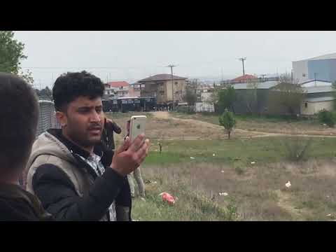

### AYS DAILY DIGEST 5/4/2019: Police Aggression Escalates, as Protests Continue Across Greece

Conflict Escalating in Libya// Malta and Italy refuse to allow disembarkation of 64 people rescued by Sea\-Eye ship ‘Alan Kurdi’ //Fears of homelessness and destitution for people kicked out of ESTIA accommodation in Greece// Children are suffering in deportation camp Sjælsmark in Denmark\.

](assets/c86db68996a/0*aBdZ0LdtE8aKGDfX)

By [Daphne Tolis](https://www.facebook.com/daphne.tolis?__tn__=%2Cd%2AF%2AF-R&eid=ARByWjk7bHv1hUL23PIckCr3ihuABKJL72MI7TT3vkVuO_0ndBRCAiey-KcahoeWmPucKGZodFXhaKZl&tn-str=%2AF)

**What is going on in Greece?**

People continue arriving and attempting to arrive in Diavata from places around Greece, with a desire to join the ‘convoy of hope\.’ Between 1200–1500 people are currently congregated in what has become a large outdoor camp, reminiscent of Idomeni\.

On Friday, a large group of people attempted to move closer towards the border, but were stopped by heavy police presence and aggression which resulted in chaotic scenes\. Police used tear gas, stun grenades and excessive force against everyone who attempted to move towards the border, including women and children\.

It should be noted that Diavata is still approximately 60km away from the closest international border, a fact that has been left out of the majority of reports on the unfolding situation\.

> ‘From the bus stop you can hear the shouts from the people outside the camps\. The police presence is heavy everywhere, people just continue to wait at the side of the road in the dust as things continue\. \.Now these families have been beaten and arrested\. They are being held on a police bus\. 

> At the southern border of Macedonia special police forcses are deployed\. Presence of the medical services provides and INGOs is visible, too — **AYS Info Team Volunteer** 

Amnesty International Greece have called on police to show restraint and respect for human rights in Diavata\. They report that these conflicts are a direct consequence of the failed European asylum policies that hopelessly leave refugees trapped in Greece\.

■■■■■■■■■■■■■■ 
> **[idiotypos](https://twitter.com/idiotypos) @ Twitter Says:** 

> > Κυρία @[olgagerovasili](https://twitter.com/olgagerovasili) θα έπρεπε να ντρέπεστε γι' αυτές τις εικόνες. https://t.co/BWs5cEKG4o 

> **Tweeted at [2019-04-05 13:15:38](https://twitter.com/idiotypos/status/1114154629904908288).** 

■■■■■■■■■■■■■■ 

**Why are people going there?**

It remains largely disputed in public discourse what is motivating people to move from camps throughout the mainland of Greece to Diavata\.

Mainstream media and government officials, as well as many large NGOS/agencies, have been quick to label the events unfolding as a result of people falling victim to ‘false rumours’ and ‘fake news’ of borders opening, that are being maliciously spread\.

Other organisations and individuals, including people on the move, suggest that the protests are self determined and born out of peoples’ sheer desperation against the unbearable living conditions in Greece, [which you can read about in Last Friday’s Digest](ays-daily-digest-29-03-2019-disillusioning-statistics-a-look-at-greece-in-2018-6a9ed7702b0b) \.

These groups and individuals report that people on the move are aware that the borders remain closed, but they feel like they have nothing to lose by joining the protests, which are an attempt to bring change and draw attention to their situation\.

Whatever may be the case \(which is not as black and white as it is made to seem in mainstream media\), people should be made aware of the risks involved in participating in this protest and the fact that the borders remain closed\.

> The risk for anyone in Diavata or attempting to reach Diavata, or other border areas remains extremely high\. It should be expected that any attempt to reach the border will be met with police aggression, which is likely to escalate if attempts do not cease\. 

**Are people still coming?**

People continue attempting to reach Diavata from various places around Greece, however attempts to stem mobilization toward the Northern borders of Greece have been made by authorities\. All trains from Athens to Thessaloniki will not be operational until further notice\.

■■■■■■■■■■■■■■ 
> **[Teacher Dude](https://twitter.com/teacherdude) @ Twitter Says:** 

> > "it should be noted that nearly all the #refugeesGr who have occupied the Larisa railway station (Athens) have paid for tickets, however, they have not allowed to travel north to Thessaloniki as a result of a call to gather and head towards the border" #Greece 

> **Tweeted at [2019-04-05 12:00:39](https://twitter.com/teacherdude/status/1114135761912258560).** 

■■■■■■■■■■■■■■ 

Dozens of people spent the day waiting in Larissa for trains to resume so they could reach Diavata\. It is reported that police were present on the scene but they do not appear to have intervened as of yet\.

**Are people wanting to leave from Diavata?**

It is reported that IOM has arranged buses to take people away from Diavata if they so choose\. IOM and UNHCR issued several statements describing the protests as “fake news”, and calling people not to take part in them\.

In addition, the Ministry is offering reimbursement of tickets to people who want to return from Thessaloniki back to where they were residing\.

> **It is important to repeat that the border will — unfortunately — stay closed\. At the same time it is also important to remind people in Europe about freedom of movement, as well as freedom of assembly and protest\. All of this is being completely abandoned at the moment in Diavata and Greece, especially by authorities and NGOs/Agencies that claim to “support refugees and asylum seekers” but apparently only in certain circumstances\.** 

> **AYS do not want to encourage, or discourage people from joining this protest\. However, even now, we stand in solidarity with people on the move, regardless of whether they choose to stand firm in fighting for their — and our — basic rights and freedoms, or whether they choose not to participate at all\. Judgement for or against compromises their right to self\-determination, which we stand against\.** 

#### LIBYA

UN chief António Guterres visited Ain Zara detention centre in Tripoli where he was shocked by the level of suffering he found of the 600 people trapped inside\.

This should not be ‘shocking’ to the UN chief, as the violence and torture endured by thousands in Libya's official and unofficial detention centres has been reported consistently over the last months\.

■■■■■■■■■■■■■■ 
> **[MSF Sea](https://twitter.com/MSF_Sea) @ Twitter Says:** 

> > "In the present circumstances that we are living, it would be very difficult to argue that disembarkation in #Libya is disembarkation in a safety situation" - UN Chief @[antonioguterres](https://twitter.com/antonioguterres) after visiting detention centre in #Tripoli.

[france24.com/en/20190404-un…](https://www.france24.com/en/20190404-un-head-shocked-suffering-migrant-camp-libya) 

> **Tweeted at [2019-04-05 05:51:14](https://twitter.com/msf_sea/status/1114042792521736193).** 

■■■■■■■■■■■■■■ 

IOM reports that military convoys have approached Tripoli as conflicts continue to escalate\. IOM reports that they fear for the safety of not only people detained but also Libyan civilians if military actions should escalate\.

■■■■■■■■■■■■■■ 
> **[Sally Hayden](https://twitter.com/sallyhayd) @ Twitter Says:** 

> > via @[emmevilla](https://twitter.com/emmevilla) 
"BREAKING #Libya: unconfirmed reports say #Tripoli airport has fallen to #LNA forces.
If so, currently the JRCC for search and rescue at sea is not active anymore, leaving the Libyan SAR zone completely unattended." 

> **Tweeted at [2019-04-05 18:26:29](https://twitter.com/sallyhayd/status/1114232857856303104).** 

■■■■■■■■■■■■■■ 

Meanwhile, Europe continues to send people back to Libya, which is an active war\-zone\. This year IOM reports that 1073 people have been intercepted at sea and placed in arbitrary detention in Libya\.

■■■■■■■■■■■■■■ 
> **[Sally Hayden](https://twitter.com/sallyhayd) @ Twitter Says:** 

> > Here's a clip of a voice memo I was sent last night, showing the noise of weapons from a migrant detention centre in Tripoli. This was sent by one of the thousands of refugees/migrants who have been returned to a warzone under EU policy. [soundcloud.com/user-60656923/…](https://soundcloud.com/user-60656923/war-sounds-from-a-tripoli-migrant-detention-centre-040419) 

> **Tweeted at [2019-04-05 09:20:44](https://twitter.com/sallyhayd/status/1114095515229216768).** 

■■■■■■■■■■■■■■ 

#### SEA

64 people remain stranded at sea, after they were rescued at sea by the Sea\-Eye ship ‘Alan Kurdi,’ following a distress call issued to Alarmphone\. They are currently bracing for storms to hit\. Malta and Italy refuse to provide a port for disembarkation despite repeated requests by Sea\-Eye’s head of operations Jan Ribbeck\.

Sea\-Eye also reports that Italy has proposed that they will evacuate only the women and children who are on board — which would undeniably result in the forced separation of families — something Sea\-Eye rejects\.

> We share this view and protest\! We do not want to perform an active family separation without reasonable reasons\! — Sea Eye 

■■■■■■■■■■■■■■ 
> **[Sea-Watch International](https://twitter.com/seawatch_intl) @ Twitter Says:** 

> > Not only babies and mothers but all people rescued by @[seaeyeorg](https://twitter.com/seaeyeorg) on the #AlanKurdi have to be disembarked in #Lampedusa straight away as this is the closest safe port. Redistribution has to be negotiated after disembarkation and not at the expense of people in maritime distress. 

> **Tweeted at [2019-04-05 16:02:47](https://twitter.com/seawatch_intl/status/1114196694147764225).** 

■■■■■■■■■■■■■■ 

Sea\-Eye spokesperson Gorden Isler explains that despite numerous calls to Tripoli, the Libyan Coast Guard could not be reached and therefore did not comply with their responsibility to coordinate this call of distress\.

The first version of the inaugural ‘ **Geneva Declaration on Human Rights at Sea’** was published today by Human Rights at Sea\.

[Access it here\.](https://www.humanrightsatsea.org/wp-content/uploads/2019/04/HRAS_GENEVA_DECLARATION_ON_HUMAN_RIGHTS_AT_SEA_5_April_2019_Version_1_LOCKED.pdf)
#### GREECE
#### Arrivals:

One boat arrived at 11\.30pm last night on Lesvos\. 28 people were on board\.

A weather warning has been issued for Central and Southern Greece, with heavy storms and hail expected to hit\. The weather deterioration sets in late Friday afternoon in the South\-West

**An acronym glossary to help volunteers in Greece:**

[RSA reports that people who received international protection before March 2017 in Greece, who are now facing the eviction from their ESTIA accommodation,](https://rsaegean.org/en/evictions-of-recognized-refugees-from-accommodation-will-lead-to-homelessness-and-destitution/?fbclid=IwAR3MD6CxjTQ9DSkcXNnGe-3-gIlDvkd3Xi5DWKOOqwayU53hOIz_GgiAGiw) are likely to find themselves in trouble\.

Their report explains that those impacted by this policy of “gradual” termination of support, will likely face homelessness and destitution as a result\.

> Refugee Support Aegean \(RSA\) reiterates that despite the recently presented national [integration strategy](http://www.opengov.gr/immigration/?p=801) , beneficiaries of international protection did not and do not yet have access to a [comprehensive plan and programme for their integration](https://rsaegean.org/wp-content/uploads/2019/01/Recognized-Report_UPDATE_Publication_ENG_Published-Jan.-2019.pdf) that would provide Greek language learning and their participation in training or job seekers’ programmes\. [\[3\]](https://rsaegean.org/en/evictions-of-recognized-refugees-from-accommodation-will-lead-to-homelessness-and-destitution/?fbclid=IwAR3MD6CxjTQ9DSkcXNnGe-3-gIlDvkd3Xi5DWKOOqwayU53hOIz_GgiAGiw#post-5117-footnote-3) This results in beneficiaries of international protection finding themselves in a disadvantaged position in comparison to the local population seeking employment\. 

_Converted [Medium Post](https://medium.com/are-you-syrious/ays-daily-digest-5-4-2019-police-aggression-escalates-as-protests-continue-across-greece-c86db68996a) by [ZMediumToMarkdown](https://github.com/ZhgChgLi/ZMediumToMarkdown)._
