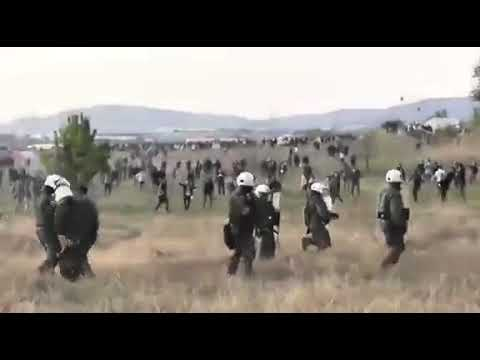
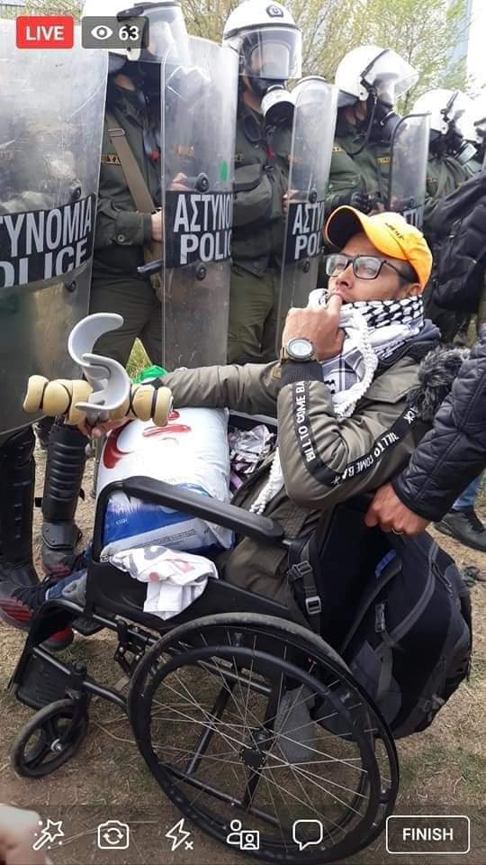
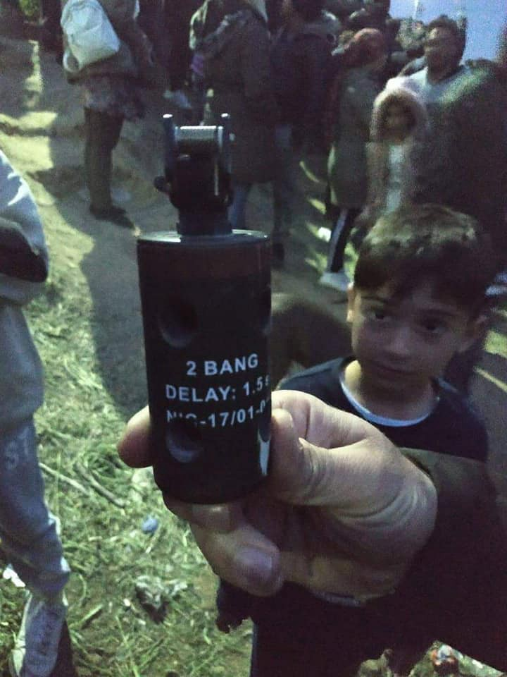
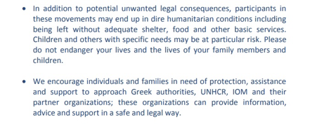
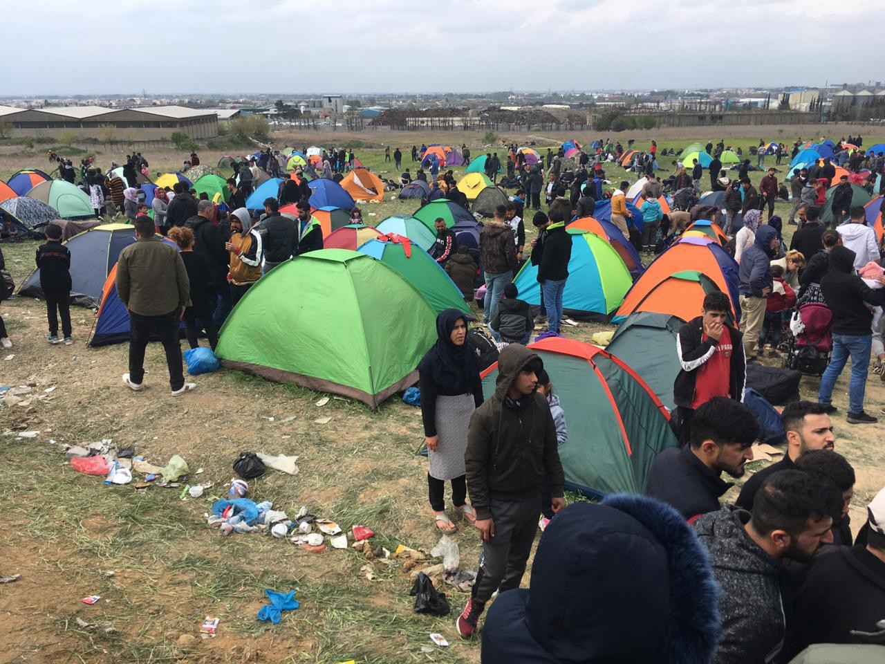

### AYS SPECIAL: A right to hope is one of the basic human rights

_After two days, the Caravan of Hope is over\. Whatever the views of individuals and organisations that forewarned people against joining the movement, we should focus our attentions on [denouncing](https://twitter.com/AmnestyGreece/status/1114218937963700229) the disproportionate and systematic violence against people trying to exercise their right to freedom of movement within a territory\. At the very least, we must remember why people are mobilising and from what they are trying to escape\. The concerted effort by the state to silence refugees desperate for proper living conditions is unsurprising but deserves our solidarity\._

 \.](assets/f769e27db018/1*4xQCvoRhRc118-_TwCxgsQ.jpeg)

Photo curtesy of Konstantinos Tsekalidis, by [SOOC](https://www.facebook.com/soocimages/?__tn__=%2Cd%2CP-R&eid=ARBRW8bl2059c0xPw_ovBrJzmSJGnqS5bpSbMlgWYns7MtvnSndAGfmjra8gQOJ6wfjXOXMcD9NGkzRi) \.

**No Hope in Greece**

On 4th April 2019, [over 1000 refugees gathered](https://www.facebook.com/ourhousegr/posts/2269438546641312) outside Diavata camp near Thessaloniki, with the hope of journeying across Greece’s northern border to Macedonia, and onwards into Northern Europe\. This mobilisation is known as the ‘Caravan of Hope’, and it has been met with [intense violence from police](https://enoughisenough14.org/2019/04/05/noborders-greek-territory-police-violence-against-protesting-refugees-in-diavata/) \. By 5th April there were approximately [2000 people](https://www.facebook.com/ourhousegr/posts/2270002996584867) \.

The mobilisation has been dismissed by many as being instigated by [“fake news”](https://www.bbc.com/news/world-europe-47826607) \. It is understood that information circulated on social media falsely claimed that the borders would be open for refugees to pass, as the Balkan route was in 2015/2016\. But what caused refugees to leave what little they have and travel hundreds of kilometres, many with small children, is that they truly feel there is no hope left in Greece\.

Many refugees that we met on the country roads near Diavata are families that we know from [Oinofyta camp](ays-special-the-case-of-oinofyta-from-one-hell-to-another-island-to-mainland-5e7fcf3d190e) , where many vulnerable people, including children live in [unbearable conditions](https://medium.com/@the.crisis.isnt.over/a-message-from-oinofyta-camp-8f00f4fb8574) \. People are expected to remain in places like this for years whilst awaiting asylum interviews, understandably many do not consider this a plausible option\. People’s demands are simple — they want safe accommodation, education for their children and employment prospects for themselves\. Many have languished multiple years in Greece, some having come via the hell of the island ‘hotspots’\.

> _“I just want a house, a home for my wife and our children\. A place of safety\. There is nothing else we want,” is what we hear so often from people who are left to live in unbearable conditions\._ 

**Risk to Children**

Families stick together, for fear they [might not be able to reunite later](https://www.mobileinfoteam.org/blog/2018/12/18/if-you-separate-voluntarily-you-may-not-be-able-to-do-family-reunification) , and because no parent wants to leave their child, no partner wants to leave their love\. Many looking online are righteous: “why are they putting their children at risk?”, “they’re using their babies as shields\!” Such moralising does nothing but feed racist right\-wing narratives, and such moralising is not humane or fair\.

People do not hold up their children in the hope that police will beat them instead, people hold up their children in the hope that the police will show mercy\. But in response, the police have nothing but tear gas and stun grenades to offer refugees in Diavata\. People do not take babies on such journeys unless they truly believe that the future they will find is better than the conditions in which they’ve been dwelling\.

The question on our lips should not be “why have refugees brought their children into such a violent situation?” It should be “why are the police creating such a violent situation with children present?”

> _“This is like Iraq, just the same”_ agree a group of young families sitting by the roadside\. _“We came to Europe to be safe, but our children’s eyes are stinging”_ 

**Domestic Push\-backs — Divide and Conquer**

It is clear that the people on the move who made up the Caravan were just a small proportion of those who intended to be present\. Significant efforts have been made by the Greek government to ensure that people did not join together and did not reach the border\.

Those lucky enough to have [UNHCR cash assistance](https://www.refugee.info/greece/cash-assistance-in-greece--greece/the-cash-program?language=en) found that cash had not been loaded onto their cards as expected in the last days — though as yet unconfirmed by UNHCR, it is understood that it was a conscious decision to withhold people’s meagre stipends, in anticipation of the Caravan to ensure that refugees could not purchase travel tickets or supplies to join it\.

Curtesy of participants of the Caravan

Those who did purchase tickets to travel towards the border found that public transport between Athens and Thessaloniki was [suspended](https://www.facebook.com/artagainstproject/posts/2144020312314058) on 5th April 2019\. This caused many refugees to be left stranded at Larissa station\. Upset at the injustice they [occupied the station’s tracks](https://youtu.be/uG7Y1KRhic4) , in a powerful display of frustration\.

Those who did manage to gather outside Diavata camp were systematically picked up by police and dispersed\.

We were called by Rami\* on the evening of 5th April, who we had met earlier in the day with his wife and children\. Rami explained that the families he had gathered with together by the roadside were forced violently onto a police bus and driven to a police station on the outskirts of Thessaloniki\.

Held there for around 3 hours, seemingly only to isolate people and dissipate energy — they were later released with orders not to return, to leave Thessaloniki, but had no idea where to go\.

They were the lucky ones — Mahmoud called us even later that night\. He was alone, the sound of cars audibly rushing by him\. He was with his young daughter, to whom he is a single father\. They had been taken in the back of a police van and driven for hours, then ejected in a remote area\. Mahmoud and his daughter walked along the busy road in search of transport, they were shaken, though Mahmoud tried to keep his cool and find somewhere to set up camp for the two of them\.

In a bid to divide people further, on 6th April there were reports that [drinking water and food within Diavata camp was being withheld](https://www.facebook.com/ourhousegr/posts/2270498726535294) until those gathered outside the camp left\.

Knowing that refugees would be tiring from the tear gas, the Greek Ministry for Migration together with IOM [chartered buses](https://www.facebook.com/ourhousegr/posts/2270528006532366) , especially to return people back to Athens or to the camps from which they came\.

Curtesy of people who participated in the Convoy

If by some miracle, refugees were to triumph against the authorities’ orchestrated attack and reach the border, police in Macedonia were on standby — most likely to greet them in a similar manner\.

**Open Borders are the Only Solution**

Intergovernmental organisations, namely UNHCR and IOM, have also put significant efforts into discouraging refugees from joining the ‘Caravan of Hope’ _\._ In a [joint statement](https://www.voria.gr/elfinder/Messages-GH_English.pdf) , they warn that participants may end up _“without adequate shelter, food and other basic services”\._ They implore refugees to approach _“Greek authorities, UNHCR, IOM and their partner organisations”_ who they say _“can provide information, advice and support in a safe and legal way”\._

This statement is an insult — it ignores the fact that thousands of refugees in Greece are already living without accommodation or proper sustenance and lack access to essential services\. If such support from the authorities and INGOs were tangible, people would not have travelled the length of the country to escape their living conditions\.

Most people have approached such agencies, even multiple times, but are repeatedly ignored\. The truth is that the Greek authorities have nothing to offer and UNHCR and IOM exist to serve the EU’s agenda — keeping the borders closed and the refugees contained in Greece\.

> _“Greece does not want us\!”_ exclaims Ishmail\*, _“so why don’t they let us leave?\!”_ 

While in Diavata, we were in constant contact with Ahmed\*, who we know from Oinofyta camp\. He was sending us videos, images and messages and implores us to share them so the world can see\. In an attempt to lift his spirits, we sent him links from the British news media, so he can see that the news is spreading\. _“But why do they not help?”_ is his reply\.

We do not know how to phrase the fact that Europe’s arms are not open to refugees\.

**No way forward but no way back**

_“I won’t go back there”_ says Mahmoud\*, when talking of the camp that he has come from\. He cannot cope without support, which he has not found in Greece\. He says he will not give up, though it seems unlikely things will improve\.

As darkness fell on 5th April, [hundreds remained in the fields](https://www.facebook.com/daphne.tolis/videos/10156312612002371/) , enveloped in clouds of teargas as rainclouds also formed\. It was people’s pure determination and strength that kept them there so long\.

But by the evening of the 6th April, the authorities’ attempts had been successful\. [Crowds have dispersed](https://www.facebook.com/daphne.tolis/posts/10156315842817371) \. Soon only smoldering fires and empty tear gas canisters will remain of the Caravan of Hope\.

Moving forward to the border is not an option, but nor is going back to a life of misery in Greece\.

**_\(Written by AYS team members on the ground in Diavata\)_**
- **all names have been changed to protect people**

**If you think you could contribute to the work of our info team, write us\.**

**We strive to echo correct news from the ground through collaboration and fairness\. Every effort has been made to credit organizations and individuals with regard to the supply of information, video, and photo material \(in cases where the source wanted to be accredited\) \. Please notify us regarding corrections\.**

**If there’s anything you want to share or comment, contact us through Facebook, Twitter or write to: areyousyrious@gmail\.com\.**

_Converted [Medium Post](https://medium.com/are-you-syrious/ays-special-a-right-to-hope-is-one-of-the-basic-human-rights-f769e27db018) by [ZMediumToMarkdown](https://github.com/ZhgChgLi/ZMediumToMarkdown)._
