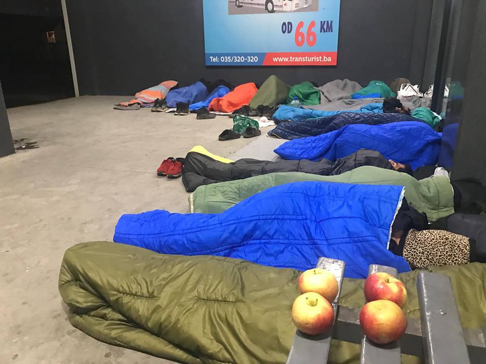

### AYS Weekend Digest 6–7/4/2019 — Border regime or human rights?

[Are You Syrious?](https://medium.com/@AreYouSyrious)

Apr 8

Conflict escalates in Libya /// People gathered in Northern Greece are returning to their accommodation /// 950 people arrested in Turkey /// Updates from the Central Med /// A man took his own life in Turin, Italy /// Statement from people on the move in Calais /// Report on the criminalisation of aid workers

 \)](assets/8c5fcfcdc818/1*IevaRaieXXsbNXPhV4-ekw.jpeg)

‘An infinite pain — For the innocent victims of wars, terrorism and migration’ was the book Gaye Demba was reading\. He took his own life in Turin, while living in an underfunded reception centre, with no healthcare services provided \(Photo by [Federico Maria Savia](https://www.facebook.com/photo.php?fbid=10218305216004438&set=a.4365295893220&type=3&theater) \)
#### FEATURE — BORDER REGIME OR HUMAN RIGHTS?

Media [report](https://defence-point.com/2019/04/06/secret-meeting-between-frontex-americans-and-europeans-in-fear-of-mass-migrant-flows-from-evros/?fbclid=IwAR27TGFmQBz9zVNPj0P9iWupaRyUyomrEp2Y7nE4uyKzuyDW4ed9V86I_qk#.XKmDVP3-2Hs.facebook) that over 50 executives from European countries and the United States as well as actors present in the Evros region — FRONTEX, the Greek Police, the Border Guards, the Ministry of Migration Policy, and Intracom \(which has undertaken electronic border surveillance with various systems\) have met this weekend\. It is thought that this was in response to the rumour that people have been gathering in the Adrianople Region in Turkey in preparation to cross into Greece\. This must have been a good chance for them to get together and discuss in detail their illegal push back policy, which is currently being [investigated by a Greek Prosecutor](https://www.cbc.ca/news/world/greek-prosecutor-investigating-allegations-of-systematic-violence-against-migrants-at-evros-river-1.5043460) and has [led to many deaths](http://www.hurriyetdailynews.com/another-migrant-found-dead-after-greece-pushback-to-turkey-139514) \.

Meanwhile, as we recently reported, The Council of the EU has been continuing with its plans to further militarise the EU’s borders\. [Politico](https://www.publico.es/internacional/finde-ue-blinda-fronteras-refuerzo-ejercito-10000-efectivos.html?fbclid=IwAR3adwG4fdYn-iNTxP8M1PjH4fnwJHXvPZ44AftZm3aLKF4arEzj7gbyFdo) reports on some of the more alarming features of this development:

> These additional technical teams are, for example, airplanes and ships as well as border personnel with specific training\. Now the agency will have a permanent body that aims to reach 10,000 troops before 2027, which will include the members of the rapid response reserve, for crisis situations\. 

In the original [Press Release from the council](https://www.consilium.europa.eu/en/press/press-releases/2019/02/20/european-border-and-coast-guard-council-agrees-negotiating-position/) there are further causes for concern\.

> Under the proposed new rules, staff of the standing corps deployed to a member state will be able to exercise some executive powers to carry out border controls or return tasks, always subject to the authorisation of the host member state, including the use of force and weapons\. 

What happens when border guards are armed? They kill innocent people, as has been shown time and time again at the [Mexico/US](https://www.southernborder.org/deaths_by_border_patrol) , the [India/Pakistan,](https://www.samaa.tv/news/2019/02/pakistani-woman-dies-after-indian-forces-shoot-her-for-crossing-the-border/) the [Spanish/Moroccan](http://www.statewatch.org/news/2005/oct/01spain-morocco.htm) borders and other borders throughout the world\.

> With this new decision, the EU hardens its position towards a common migration policy by dissolving it in its security proposals\. Something totally contrary to what is reflected in the Treaty on the Functioning of the EU \(TFEU\) regarding asylum, where it speaks of a common protection system for both asylum\-seekers and people from third countries who, without having obtained asylum, also need international protection \. Attached to its obligations as guarantor of the values ​​and rights contained in the Universal Declaration of Human Rights\. _\( [Politico](https://www.publico.es/internacional/finde-ue-blinda-fronteras-refuerzo-ejercito-10000-efectivos.html?fbclid=IwAR3adwG4fdYn-iNTxP8M1PjH4fnwJHXvPZ44AftZm3aLKF4arEzj7gbyFdo) \)_ 

It must be terribly upsetting to discover that you have created too many human rights and enshrined them in law, and even more so when you realise that the only way to continue with the military border regime of Europe is to ignore them, but this does not change the fact that those who die at Europe’s internal and external borders lose their lives as a direct result of these policies\.

TURKEY
#### 950 people arrested in Edirne

Local media have [reported](https://www.cnnturk.com/video/turkiye/edirnede-950-gocmen-yakalandi?fbclid=IwAR2Wq23vS7nto1ad4bRB8v_P4-Vob0sqsdPYoirztkUffDHap9yV5NFacdM) that 950 people on the move, most of them from Afghanistan and Iran, were arrested in Edirne\. In parallel to the “caravan of hope” movement that claimed Greece would open its border to Macedonia, they had followed news spread through internet groups \(dubbed the “Edirne journey of hope”\) claiming that Turkey would open its border to Greece\.
Seeing that preventative measures had been taken along the highways, many chose to travel by rail\. Those arrested at the Edirne train station last night included 40 children\.
#### More boats returned to Turkey

Aegean Boat Report [inform](https://www.facebook.com/AegeanBoatReport/?__tn__=%2CdkCH-R-R&eid=ARCBKJAIoJW5ToFsWXCQa5FeRlAJ5wvMdnWlh8rI7ekuNw3LJcJNXDzuMmkoVd6W0ihcdD1lFoEuwcP5&hc_ref=ARTOvgy-HFYwQXOqMf-8w_mmCmMuqfK72nkH7zKS51eBAUGZwrOK_n0W6gnHkaOIlT8&fref=nf&hc_location=group) s us that a speedboat carrying 16 people capsized outside Salihleraltı, north of Dikili, Turkey, on Friday night at 22\.00\. The Turkish coast guard rescued 16 people from the sea \(10 children, 2 women and 4 men\) \. Most of them were wearing life jackets, and that combined with rubber rings, most likely saved their lives\. The condition of those taken to hospital is unknown\. The boat was heading towards Lesvos south\.

On Friday morning, at 08\.00, a boat was stopped by the TCG outside Demircili, Turkey\. The boat was carrying 60 people \(14 children, 28 women and 18 men\) and was heading towards Samos\. They were all arrested\.

LIBYA
#### Clashes escalate in ‘safe’ Libya

According [to media reports](https://www.irishtimes.com/news/world/africa/gen-khalifa-haftar-s-forces-close-in-on-tripoli-1.3851141?fbclid=IwAR3HNpPZqyVRfrNSIgTz0zhzseIE9hiTzkqM1meJNDUC81FqAjidaHWTQFQ) dozens of migrants and refugees in a Tripoli detention centre were dressed in old military uniforms and ordered to begin packing weapons this week, as the situation in Libya continues to escalate\.

Sally Hayden reports on the deaths which have resulted from the clashes\.

■■■■■■■■■■■■■■ 
> **[Sally Hayden](https://twitter.com/sallyhayd) @ Twitter Says:** 

> > At least 37 dead or wounded in and around Tripoli due to escalating clashes. Meanwhile, refugees &amp; migrants locked in detention centres are still powerless &amp; wondering what will happen to them. Here are some of the messages I've received in the last few hours. #libya https://t.co/4r3TIR8xdz 

> **Tweeted at [2019-04-07 08:53:30](https://twitter.com/sallyhayd/status/1114813436058308608).** 

■■■■■■■■■■■■■■ 

The conditions in detention have left a one month old baby dead\.

■■■■■■■■■■■■■■ 
> **[Andrea Gagne](https://twitter.com/AndreaGagne) @ Twitter Says:** 

> > Armed militias in Libya have reached the Qaser Bin Gashir detention center outside Tripoli. Yesterday a 1 month old baby died from the harsh conditions, but due to the dangers they weren't able to bury the body until tonight. The refugees there say they fear for their lives. https://t.co/GaRrC2EpCm 

> **Tweeted at [2019-04-06 00:17:36](https://twitter.com/andreagagne/status/1114321219057266689).** 

■■■■■■■■■■■■■■ 

**How will Salvini explain away an entire civil war in his next racist diatribe on why people should be returned to Libya? We are unsure, it will be difficult even for him, but the sad thing is, he will definitely try\.**

SEA
#### 64 people still on the ‘Alan Kurdi’ after 5 days and no further contact with the ship lost at sea with 50 people on board

While a new conflict is escalating in Libya, Italian authorities still refuse access to territorial waters to the 64 people rescued 5 days ago by the [Sea\-Eye vessel ‘Alan Kurdi’](https://sea-eye.org/en/) \.

■■■■■■■■■■■■■■ 
> **[sea-eye](https://twitter.com/seaeyeorg) @ Twitter Says:** 

> > ⚠️ Sea-Eye spokeswoman Carlotta Weibl gives statement in #Rome. https://t.co/gFQEmJMoPi 

> **Tweeted at [2019-04-07 11:42:36](https://twitter.com/seaeyeorg/status/1114855994364973056).** 

■■■■■■■■■■■■■■ 

Italian MRCC warned that entrance into territorial waters would be considered “ [to be prejudicial to the peace, good order or security](https://twitter.com/seaeyeorg) ” of the state\.

No further news has been given on the 50 people lost in the Central Mediterranean\. Tragedy is feared\.

GREECE
#### Arrivals

From [Aegean Boat Report](https://www.facebook.com/AegeanBoatReport/) :

Two boats arrived on Saturday:

The first landed in Skala Mistegnon, Lesvos east, at 07\.00 AM, carrying 16 people \(No breakdown available\) \. The second boat was found in distress outside Oinousses, due to wind and high waves, and was picked up by a local fishing boat at 20\.30, and transported to port Kardamyla, Chios north\. On board there were 24 people \(10 children, 6 women, 8 men\) \.

On Sunday one boat was brought to the port of Chios at 17\.50\. It was carrying 27 people \(6 children, 3 women, 18 men\) \.
#### Three men’s bodies found on the beach in Rhodes

[Aegean Boat Report](https://www.facebook.com/AegeanBoatReport/?__tn__=%2CdkCH-R-R&eid=ARCBKJAIoJW5ToFsWXCQa5FeRlAJ5wvMdnWlh8rI7ekuNw3LJcJNXDzuMmkoVd6W0ihcdD1lFoEuwcP5&hc_ref=ARTOvgy-HFYwQXOqMf-8w_mmCmMuqfK72nkH7zKS51eBAUGZwrOK_n0W6gnHkaOIlT8&fref=nf&hc_location=group) informs that the bodies were found on the beaches of Rhodes the last 24 hours\.

> The first corpse was found yesterday afternoon between Afandou and Kolymbia, this morning another one was found in the Glystra Afandou area, and the last one at Faliraki, near the Pegasus Hotel\. The man who was found this morning in Faliraki was wearing a black jacket and a black suit, while the one found in Afandou was wearing a typical college\-type blouse with green sleeves and a blue trunk, jeans and socks\. 

> The investigations have been taken over by the Central Port Authority of Rhodes, while their bodies will be transferred for examination by the Coroner\. Age and nationality are unknown\. 

#### The “caravan of hope” is over

After two days, the Caravan of Hope is over\. Most of the people who had gathered in the area of Diavata have returned to their accommodation, or are doing so right now\.

T [he ministry of migration released a statement](https://twitter.com/HumanityCrew/status/1114487636360617984) assuring them that everyone will be able to return to their accommodation without consequence, no one will be fingerprinted or deported, no one will lose their housing or financial support and transportation has also been provided for some destinations\.

[Other reports](https://www.facebook.com/arashampay/videos/850234281989326/?hc_location=ufi) warn instead that police are preventing people from returning to Athens\.

Whatever the views of individuals and organisations that forewarned people against joining the movement, we should focus our attention on [denouncing](https://twitter.com/AmnestyGreece/status/1114218937963700229) the disproportionate and systematic violence against people trying to exercise their right to freedom of movement within a territory\.

■■■■■■■■■■■■■■ 
> **[Philippa Metcalfe](https://twitter.com/philippamet) @ Twitter Says:** 

> > The police violence used against families at #Diavata is horrific, disproportionate and inhumane. People are trying find a way out of the squalid conditions many are forced to live in in #Greece, the situation stems from harmful #EU #Asylum policies - not 'Fake news" #refugeesGr https://t.co/OwdvoqE3Vh 

> **Tweeted at [2019-04-06 15:41:18](https://twitter.com/philippametcal2/status/1114553675429613569).** 

■■■■■■■■■■■■■■ 

In Diavata, special forces of the Greek police have used [rubber bullets, teargas and stunt grenades](https://twitter.com/phoeberamsay/status/1114754294152982528) against hundreds of people, children included\. Reports of beatings are widespread and [journalists covering the situation have been targeted as well](https://twitter.com/xandra_photo/status/1114895470080479235) \.

At the very least, we must remember why people are mobilising and from what they are trying to escape\. The concerted effort by the state to silence refugees desperate for proper living conditions is unsurprising, but the refugees deserve our solidarity\.

Instead the response of the volunteer community has been for the large part focused on the [condemnation & disavowal of the caravan of hope](https://twitter.com/phoeberamsay/status/1114752818865299456) , on the paternalistic urge to correct disinformation and prevent people from taking “wrong decisions”\.

■■■■■■■■■■■■■■ 
> **[phoebe](https://twitter.com/phoeberamsay) @ Twitter Says:** 

> > ....Addendum: Can't not mention the UNHCR/IOM statement being shared everywhere, which, which a stunning lack of self awareness, urges refugees to "Ask us for help" instead of joining the #CaravanOfHope. Christ. 7/ 

> **Tweeted at [2019-04-07 04:52:39](https://twitter.com/phoeberamsay/status/1114752824036823047).** 

■■■■■■■■■■■■■■ 

As [Watch the Med — Alarmphone](https://www.facebook.com/watchthemed.alarmphone/posts/2343836339223929?hc_location=ufi) states:

> Hundreds of refugees residing in Greece left in the last four days the infamous hotspots, mainlands’ camps, IOM\-hotels and ESTIA flats, the refugees squats and other places they were temporarily staying, taking down to the streets in what they called ‘march of hope’\. 

> \[…\] What gets forgotten in the whole discussion around “fake news” or “false rumors” and the search for the organisers of the march, is that, hundreds of refugees took a decision to participate in this and try to get out of Greece, however initiated, in order to flee the misery and improve their families’ situation\. **The containment policy Greece is upholding by any means and under the pressure of the EU, paired with a mere emergency approach to reception and an overloaded asylum system inspired fathers and mothers, sisters and brothers to find a better solution for their kids, to seek for more than “being kept alive”, to follow their hope…** 

Please read [A right to hope is one of the basic human rights](ays-special-a-right-to-hope-is-one-of-the-basic-human-rights-f769e27db018) , our Special on the situation, written by members of the AYS Info Team on the ground in Diavata\.
#### On Estia evictions

[Refugee Support Aegean](https://rsaegean.org/en) published a statement on the announced eviction of recognised refugees from accommodation in ESTIA flats and official refugee camps\.

Very few practical steps have been taken so far by the Greek authorities to secure the refugees’ autonomous living and equal integration into Greek society\. Read more [HERE](https://rsaegean.org/en/evictions-of-recognized-refugees-from-accommodation-will-lead-to-homelessness-and-destitution/?fbclid=IwAR0sbJ_uU4md2l_U8yJaW2sebPsbIbaPy5fQfgD7XMEHrDuB2ruOdbmGmiE) \.

ITALY
#### 28\-year\-old man from Gambia took his own life in Turin

As local media [report](https://www.globalist.it/news/2019/04/06/la-pacchia-di-gaye-demba-migrante-disperato-che-si-e-tolto-la-vita-2039775.html?fbclid=IwAR1m4ZS2OeKiIrF9zJLa2mtC_0zGVLl4Gs83nKSAv_kpmsiVH9dHtc43hlY) , Gaye Demba, 28\-year\-old man from Gambia took his own life in Turin\. He had lived in the squatted basements of the ex\-Olympic Village up until the first eviction in December 2017, and was now hosted in a reception centre managed by the local church\.

An ex\-operator of the centre where Demba was living [report](https://www.facebook.com/federico.savia/posts/10218303884971163) s that he had already tried to kill himself and once dismissed from the hospital, no specific services were available for him\. Due to the change in policies and funding, the church structure was short of operators and no healthcare was provided\.

BOSNIA

On April 4th, the state government issued a statement announcing the possibility that the Army will be deployed at the eastern border, between Bosnia and Serbia, as well as more police officers\.

According to official numbers, in March this year, 482 people registered with the state authorities\. At the same time, 459 expressed their intention to seek asylum in Bosnia, while 5 people submitted their asylum request\. So far this year, over 3,800 people have entered Bosnia\.

Sunday night at the bus station in Senad Cupo, Tuzla\. \(Photo by AYS\)

People who are arriving are only given basic attention, and sometimes not even that\. On Sunday afternoon, [IOM](https://medium.com/u/664cb26312d4) , the organisation in charge of dealing with the current situation in Bosnia, refused to help a group of minors who arrived in Tuzla, after crossing from Serbia\. The state is also doing little to nothing, and people are expected to find their own way, while big organisations and the state are expecting volunteers and citizens to provide basic help\.

Nevertheless, it is becoming harder and harder for local volunteers to work in Bosnia, and they face pressure from the authorities every day\. Additionally, they do not have enough food and donations to distribute\.

It has become a daily struggle for all, people on the move and the locals who help them\.

FRANCE
#### Collectif Appel d’air have share [a text written by people in exile](https://www.facebook.com/410515849777705/photos/a.411337703028853/417250585770898/?type=3) in Calais\.

 \)](assets/8c5fcfcdc818/1*xhZPhrIOBH0vak9Q-zQS-A.jpeg)

Calais \(Photo by [Collectif Appel d’air](https://www.facebook.com/410515849777705/photos/a.411337703028853/417250585770898/?type=3&theater) \)

> Refugees come to Calais with the hope of reaching the UK\. Upon arrival, we are confronted with inhuman conditions\. 

> \[…\] The French government has pushed us out more and more with the use of police hostility\. We have been moved out of all areas where peaceful coexistence was possible despite the rough conditions, and we now find ourselves surrounded and restricted by aggressive fencing, barbed wire and walls — a constant reminder of how Europe feels towards us\. 

> \[…\] During the daily expulsions we are subject to, we are repeatedly forced to move from our living areas\. Our belongings are destroyed or confiscated and people are mistreated, insulted or arrested\. 

> \[…\] Refugees flee their countries out of fear and for opportunity and freedom but still seem to do so when arriving in Europe\. They don’t necessarily mind where they end up but because of the way the Dublin agreements work many have considered the UK as their last option\. It’s the treacherous terms of the reforms that push people to risk their lives at the border\.” 

Read the full text [HERE](https://www.facebook.com/410515849777705/photos/a.411337703028853/417250585770898/?type=3) \.

THE NETHERLANDS
#### Protest against French arms company, Thales\.

> The company profits from war in two ways: firstly it delivers weapons to dictatorships; and then it militarises European borders to stop refugees\. 

GENERAL

A very comprehensive report has been published entitled [Saving Lives is Not a Crime](https://l.facebook.com/l.php?u=https%3A%2F%2Fwww.ohchr.org%2FDocuments%2FIssues%2FExecutions%2FA_73_42960.pdf%3Ffbclid%3DIwAR3-lQ2X2mxyonqYvX_q0f1GVz2jENPDciXswxyyFMDMrYWBdE3UmPw4PeY&h=AT3MYHCyKeaRL64Fpsbrr-m3gqi93dX6_Y57JjCcgp0b641yVKbEwdIZv-Cv-Owy_ZTd3thAHajOjRgc9954U-fr-1Yda82OVIlExipDbazBOUtez7e-Ta822DQOBDDT) by the Special Rapporteur on extrajudicial, summary or arbitrary executions, Agnes Callamard\.

> **By failing to clearly and practically exempt humanitarian actors from antiterrorism statutes, governments are knowingly reducing life\-saving aid to desperate people\.** 

> \[…\] By criminalising, stigmatising or otherwise inhibiting provision of sexual and reproductive services, States are knowingly depriving individuals, foremost women, girls and LGBTI persons, of life\-saving care\. 

> In all these actions, governments are violating their obligations to respect and protect the right to life, under international human rights and humanitarian law\. 

> \[…\] Humanitarian exemptions from prosecution, adopted by some states, and recommended by international bodies, must be implemented as a matter of urgency\. Harassment and stigmatisation must cease\. **Saving lives is not a crime\.** 

#### World Health Day

The [World Health Organisation](https://www.who.int/migrants/en/?fbclid=IwAR1d9qTamt1aFWpoa1rGz7XiWsG9tPg7ETRntKwlVz6pArcK4L0kitBPv4w) celebrates World Health Today, but in a time when 1 in every 7 people on the planet is displaced, they recognise there is a very long way to go until it is possible for everyone to access adequate health care\.

> The right of everyone to enjoy the highest attainable standard of physical and mental health is established in the WHO Constitution of 1948\. Ratified international human rights standards and conventions exist to protect the rights of migrants and refugees, including their right to health\. Nevertheless, many refugees and migrants often lack access to health services and financial protection for health\. 

Refucomm has information about health and social services for people on the move on their [website](https://l.facebook.com/l.php?u=http%3A%2F%2Fwww.refucomm.com%2F%3Ffbclid%3DIwAR1R1ernxC1mp72eurrOPLyIXX-fqd7mwhCA2tlbOEJO9UGMmJ1_gnVA1wY&h=AT0RorMo7EviAZRKrqSPfOyc73nceWC7d8Nu17oKe33jjIbpXkPXhyvclyD7EgVtZHiV0PAwFhAxBo-I4dBhES4tixcB2fA7CHQzR90q2GLD6VIV1WjxojpBiWOi0Vj1Ztco2RpWbbHmj3F53SfT66_dmeKVNk57TU_4Wo4EeCdu9iN1c_-93cra51yBwbAbY3Cf_N88pcDA1g2aGoDsLkjZpybJqwrKMyN6-tHPNcGkAJikJ1KBeWE2Ff6dEk80XnqPyIoVoxQdm-9KUOxrAmBe2RnDVWdq-dAJ4P28eahMzLdXJs9WFo8ba5N0JPN3xYnSjhl4m9iaObRqd-oxojdFdIMctRQNLXUKvV9ZKscv3KBX2iaEw49KhvvcjRQhIBLzJSrwwZ2RApgllF2QNsZkXxEWFx2tV5ah2OLKBmsB32t7PsfhyDwDnzmV4g87y5763wm1eEzjIgIJqGiLolQeDJzlSd_qplzPgevqAzOORRmxQN5L_1I1nFopvRAKyMeM2MHROr3z5dw-SYQpQIWHzEcOmzfq0liddRDC8ajaii2fccS7P5MCcVZ3zBq4czAnbeWSng4WWUg9Ej1wdu4SDMr6i0sxl1QmMB4--eY4cejxYEJvxx07aSvX) \.

**Apart from daily news in English, we also publish weekly summaries in [Arabic](%D8%AA%D9%85-%D8%A7%D9%84%D8%A5%D8%A8%D9%84%D8%A7%D8%BA-%D8%B9%D9%86-%D8%B9%D8%AF%D8%AF-%D9%85%D8%AA%D8%B2%D8%A7%D9%8A%D8%AF-%D9%85%D9%86-%D8%B9%D9%85%D9%84%D9%8A%D8%A7%D8%AA-%D8%A7%D9%84%D8%A5%D8%B1%D8%AC%D8%A7%D8%B9-%D9%85%D9%86-%D9%82%D8%A8%D9%84-%D8%B9%D9%84%D9%89-%D8%A7%D9%84%D8%AD%D8%AF%D9%88%D8%AF-%D8%A7%D9%84%D9%8A%D9%88%D9%86%D8%A7%D9%86%D9%8A%D8%A9-cc1329fc0ca9) and Persian\. Click on those links to check out the ones about the week from the 25th to the 31st of March\.** 
**If you think you could contribute to the work of our info team, write us\.**

**We strive to echo correct news from the ground through collaboration and fairness\. Every effort has been made to credit organizations and individuals with regard to the supply of information, video, and photo material \(in cases where the source wanted to be accredited\) \. Please notify us regarding corrections\.**

**If there’s anything you want to share or comment, contact us through Facebook, Twitter or write to: areyousyrious@gmail\.com\.**

_Converted [Medium Post](https://medium.com/are-you-syrious/ays-weekend-digest-6-7-4-2019-border-regime-or-human-rights-8c5fcfcdc818) by [ZMediumToMarkdown](https://github.com/ZhgChgLi/ZMediumToMarkdown)._
