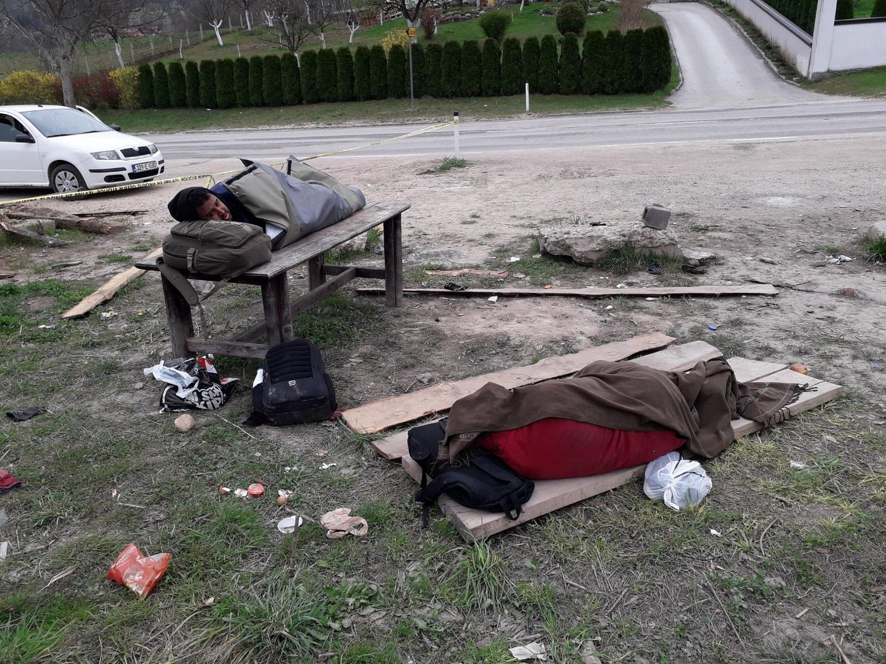
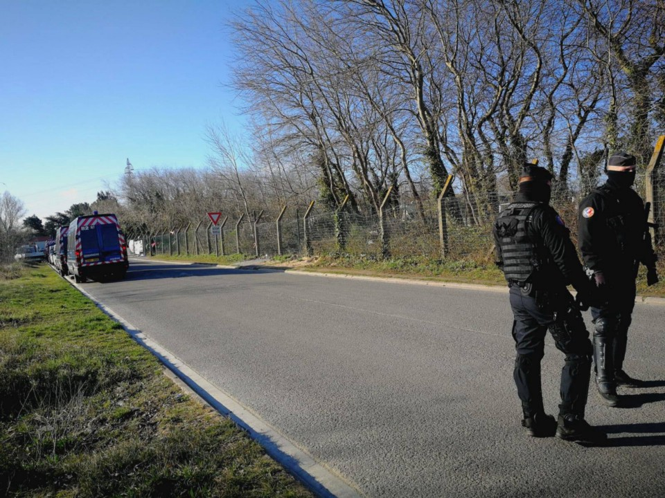
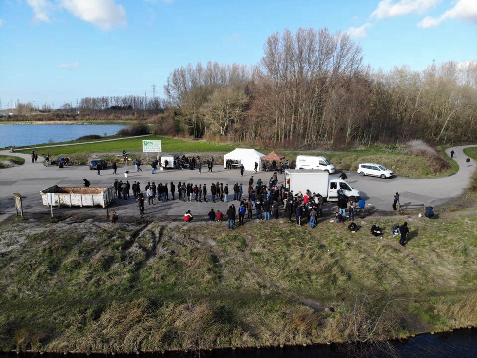

### که تعداد رو به افزایشی از فشار وارده توسط پلیس یونان در مرز یونان و ترکیه گزارش شده‌است
#### AYS Weekly News Summary in Persian, March 25–31

](assets/7ec19ba3aa79/1*Ru9pqmG7eNLXfmNnPLCQAg.jpeg)

[Samos](ays-special-prison-island-surviving-another-winter-on-samos-72ead10d5096)
#### **مشخصه**
### با نگاه به تحولات \( و عدم وجود \) در یونان در سال ۲۰۱۸ …

آخرین گزارش سالیانه سال ۲۰۰۸ برای یونان منتشر شده‌است و گرایش‌ها یافت‌شده ، دلسرد کننده هستند \.

گزارش شده‌است که تعداد رو به افزایشی از فشار وارده توسط پلیس یونان در مرز یونان و ترکیه گزارش شده‌است

متوسط زمان پردازش در سال ۲۰۱۸ — از اولین لحظه در زمین‌های یونان ۸ / ۵ ماه بود \. علاوه بر این ، سیر شده‌است که از برنامه‌های پناهندگی ۵۸، ۷۹۳ که در سال ۲۰۱۸ ثبت‌نام کرده‌اند ، تاکنون ۴۵ درصد اولین مصاحبه خود را انجام داده‌اند

بعد از یک مصاحبه ثانویه ، از همه برنامه‌هایی که درخواست ۹۱ % را داشتند ، باز هم منفی تلقی شدند

افرادی که درخواست پناهندگی در جزایر یونان دارند هنوز به دلیل اجازه ندادن به ترکیه به عنوان یک کشور سوم ایمن در نظر گرفته می‌شوند مگر اینکه آن‌ها به عنوان “ آسیب‌پذیر “ شناخته شوند \. بنابراین فرآیند پناهندگی به طور انفرادی ادعاهای پناهندگی را ارزیابی می‌کند

توجه : تصمیمات اتخاذ شده بر پایه اجازه ندادن به اواسط سال ۲۰۱۶ آغاز شده و همچنان بر سوریه تاثیر می‌گذارند که بسیاری از آن‌ها کردها و مناطقی چون Afrin و ترکیه برای آن‌ها ایمن نیستند \. لازم به ذکر است که ترکیه به اصول of پایبند نیست و بنابراین برای کسانی که در حال فرار از جنگ ، فقر و آزار هستند ، ایمن نیست

عدم صلاحیت مناسب و کارآمد آسیب‌پذیری “ آسیب‌پذیری “ در جزایر یونانی
### **لبنان**

خبره‌ای بد از لبنان هم می‌آید \. میشل Aoun ، رئیس‌جمهور لبنان ، شروع به گسترش ترس از “ موج دیگری “ از پناهندگان سوری به سمت اروپا کرد ، در حالی که ابراز تمایل خود برای شروع با فرآیند “ بازگشت ایمن “ برای پناهندگان سوری را ابراز کرد

وی این مطلب را پس از دیدار با رئیس سیاست خارجی اتحادیه اروپا ، Federica Mogherini ، در بیروت گفت

لبنان به تلاش خود برای تضمین بازگشت پناهندگان سوری به مناطق امن در سوریه ادامه خواهد داد و ما منتظر یک راه‌حل سیاسی برای بحران سوریه نخواهیم بود چرا که ممکن است طول بکشد \. ما اطلاعاتی در بیروت دریافت کرده‌ایم که نشان می‌دهد بازگشت پناهندگان از سوی مسئولان سوری که آن‌ها را با prefabs ، زیرساخت‌ها و مدارس تامین کرده‌اند — اتحادیه اروپا و دیگر سازمان‌های بین‌المللی می‌توانند این موضوع را تایید کنند

Mogherini توضیح داد که حریری و نخست‌وزیر لبنان پس از این دیدار یک ساختمان جدید اتحادیه اروپا را افتتاح کردند که “ بهترین نماد دوستی و فضای خانوادگی است که اتحادیه اروپا را به لبنان مرتبط می‌کند \. “

آن‌ها در این جلسه به این نتیجه رسیدند که لبنان ممکن است مهم‌ترین کشور اروپایی در بین کشورهای عربی باشد و من امیدوارم که دانشجویان اروپایی به تحصیلات خود در لبنان ادامه دهند

لبنان میزبان حدود ۱ ، ۵ میلیون پناهنده سوریه‌ای است که اغلب از حقوق اولیه خود محروم هستند

اما این همه چیز نیست \. نخست‌وزیر تصمیم گرفت از مدل کشورهای عضو اتحادیه اروپا استفاده کند در حالی که برای مقابله با مردم در مورد این حرکت به عنوان مثال برای لبنان عمل می‌کند \. کشورهایی مانند جمهوری‌چک ، مجارستان ، لهستان و اسلوواکی به طور گسترده پناهندگان را به عنوان راهی برای حل بحران پناهندگان خود طرد کرده‌اند
### **لیبی**

گزارش‌ها حاکی از آن هستند که یک محافظ امنیتی لیبی توالت‌ها و لوله‌ها را در زینتان شکستند ، و حدود ۱۰۰ پناهنده بدون دسترسی به توالت و آب آشامیدنی را ترک کردند \. بسیاری از این افراد به دلیل فقدان امکانات بهداشتی مناسب ، بیمار شده‌اند \. تنها مثال وحشتناک دیگری که چرا لیبی در حال تداوم رفتار ظالمانه و تحقیر کننده نسبت به بازداشت شدگان است

■■■■■■■■■■■■■■ 
> **[Mark Micallef](https://twitter.com/mmic78) @ Twitter Says:** 

> > Alleged piracy case of El-Hiblu today follows incident in #Misrata in November when #migrants rescued off #Libya by the Nivin refused to disembark, saying they'd rather die than go back to #Libya. Both desperate acts by #migrants that'll ward commercial crews off rescues. 

> **Tweeted at [2019-03-27 16:20:08](https://twitter.com/mmic78/status/1110939570609238016).** 

■■■■■■■■■■■■■■ 

### **دریا**

گفته می‌شود که در روز چهارشنبه یک کشتی توسط یک کشتی تجارتی که توسط یک کشتی تجارتی نجات داده شده‌بود ، توسط یک کشتی تجارتی ربوده شد \. حتی با وجود اینکه مردم در ناامیدی عمل کردند ، نه اینکه به لیبی باز گردند ، این به طور قانونی یک مورد دزدی دریایی است \. آن‌ها به مالت رسیدند و در آنجا به احتمال زیاد دستگیر خواهند شد \. salvini ایتالیا این پرونده را “ آدم‌ربایی “ می‌خواند ، که در بخش ایتالیا امروز کنایه آمیز است
### **مالتا**
#### این گزارش گزارش داد که ، پناهندگان و بازداشت شدگان در مالتا در شرایط کثیف زندگی می‌کنند و تبعیض از سوی مقامات دولتی را تجربه می‌کنند\.

سازمان‌های غیردولتی که به این مراکز دسترسی دارند گزارش داده‌اند که میزان پول برای پوشش دادن نیازهای اولیه بسیار کم است و این مراکز فاقد امکانات بهداشتی کافی هستند، پرجمعیت هستند و زیرساخت و امنیت ضعیفی دارند \. گزارش شده‌است که برخی از آن‌ها مورد هجوم موش و سوسک قرار می‌گیرند \. دسترسی به متخصصان سلامت روانی در دسترس نیست : و این یک نقطه نگران‌کننده است \.

تنها سازمان‌های غیردولتی ، وکلا و کمیساریای عالی پناهندگان اجازه ورود به اردوگاه‌ها را دارند — هر کس دیگری از جمله رسانه‌ها رد می‌شود \. پناهندگان زمان دشواری برای دسترسی به فرصت‌های کاری دارند ، و به نظر می‌رسد که تبعیض و استثمار گسترده است \.

افرادی که به آنها پناهندگی اعطا می‌شوند ، هنگام تلاش برای درخواست مجوز اقامت سه‌ساله خود ، تبعیض و بی‌احترامی به مقامات دولتی را گزارش کرده‌اند \.
### **بوسنی و هرزگویین**

خانواده‌ای از یمن با یک کودک چهار ماهه و یک کودک دیگر که سه سال سن دارد در راه رفتن به سارایوو به این دلیل که آن‌ها برای فرزند خود در اردوگاه Borici در Bihac در حال درمان هستند ، به این دلیل که اعتصاب کارگران پزشکی در حال انجام است \. در بازگشت از سارایوو ، سفر آن‌ها در Velcevo به پایان رسید ، جایی که کارگران صلیب‌سرخ محلی به آن‌ها کمک و اصول اولیه دادند ، و در پایان گزارش دادند که آن‌ها توانستند آن‌ها را به سازمان آی\.ا\.ام که اردوگاه پناهندگان را اداره می‌کند برسانند

این تنها یک مورد از بسیاری از وضعیت‌های وحشتناک است که مردم در وضعیت بلاتکلیفی قانونی خود با آن مواجه هستند و در مراکز پذیرش که به طور ناکافی سازمان دهی شده‌اند در شمال بوسنی حضور دارند

Velčevo

مقامات گزارش دادند که یک تحقیق در حال انجام است که در آن اعضای واحد پلیس مرزی گرادیسکا یک شهروند هلندی را دستگیر کردند که در سال ۱۹۶۹ به دنیا آمد و بر این ظن بود که او تلاش کرده‌است یک فرد از کشورهای آفریقایی — آسیایی را به کشورهای اتحادیه اروپا قاچاق کند
### **کرواسی**

تعداد زیادی از تازه‌واردها ، عمدتا ً بازگشت‌ها ، در بین ساکنین مرکز پذیرش در زاگرب بسر می‌برند ، و ۷ نفر تازه‌وارد در یک در یک روز بوده\. از ۱۰۰ نفر از طریق اسکان مجدد به کرواسی می‌رسند و برای اولین دوره زمانی در کوتینا اسکان داده خواهند شد \. شماره اعلام‌شده این است که تایید می‌کنند که احتمالا ً خانواده‌ خواهند بود که افرادی که می‌رسند \. تا کنون ، به عنوان یک عمل موفق ثابت نشده است ، به عنوان مثال با خانواده‌های ساکن در زادار ، جایی که حقوق متوسط به سختی هزینه‌های اجاره و هزینه‌های اولیه را پوشش می‌دهد ، چرا که یکی از مکان‌های توریستی مورد نظر در ساحل آدریاتیک است \. آن‌ها همچنین هیچ پشتیبانی از یکپارچگی مناسب ندارند ، هیچ‌کس نمی‌تواند به هر حس سازمانی تکیه کند و یا کسی که با آنچه که آن‌ها شروع کرده‌اند ، پیروی کند \. امیدواریم شاهد تغییر گروه بعدی افرادی که قرار است در ماه آوریل و ماه مه وارد شوند شاهد تغییر باشیم \. در این میان آی\.ا\.ام در مرکز پذیرش در زاگرب ، کار بر روی بازگشت داوطلبانه و ملحق کردن افراد به جامعه فعالیت می‌کنند \.
### **فرانسه**
#### **کاله**

اتوبوس اطلاعات پناهندگان گزارش می‌دهد که ۲۳ تخلیه در طول هفته گذشته انجام شده‌اند

از آغاز سال جاری ، این دوره از دستور تا ۲۲۹ نفر افزایش پیدا کرده‌است

آن‌ها به طور مداوم گزارش و سند از تخلیه را گزارش می‌دهند و بیان می‌کنند که چادر ، لباس و اقلام شخصی به طور مداوم مصادره شده‌است

ترس در حال افزایش است که مرکز اورژانس به زودی به عنوان شرایط جوی بهبود خواهد یافت ، حمایت از پناهندگان همراه هشدار می‌دهد ، بنا بر این سازمان‌های حاضر در این زمینه درخواست کمک و حمایت می‌کنند — آن‌ها آنچه که در وب سایت آن‌ها مورد نیاز است را منتشر می‌کنند

ساعت ۷ بعد از ظهر امروز دوشنبه ، در مقابل ساختمان commisariat در دوازدهمین شهر پاریس ، جمعی در همبستگی با این دو نفر که در بازداشتگاه in دستگیر شده بودند ، گرد هم آمدند

برای وزارت بهداشت فرانسه درخواست شده‌است و خواستار به رسمیت شناختن آسیب روانی پناهندگان شده‌است

آن را پیدا و امضا کنید :

**اخبار بیشتری به انگلیسی در صفحه رسانه ما در دسترس است \. در مواردی که شما سوالاتی دارید و یا مایلید برخی اطلاعات مربوط به روند پناهندگی شما یا کشور مورد نظر را منتشر کنید , لطفا ً برای نوشتن پیغام روی فیس بوک یا نوشتن یک ایمیل به آر\.یو\.س تردید نکنید**

[**areyousyrious@gmail\.com**](mailto:areyousyrious@gmail.com)

_Converted [Medium Post](https://medium.com/are-you-syrious/%DA%A9%D9%87-%D8%AA%D8%B9%D8%AF%D8%A7%D8%AF-%D8%B1%D9%88-%D8%A8%D9%87-%D8%A7%D9%81%D8%B2%D8%A7%DB%8C%D8%B4%DB%8C-%D8%A7%D8%B2-%D9%81%D8%B4%D8%A7%D8%B1-%D9%88%D8%A7%D8%B1%D8%AF%D9%87-%D8%AA%D9%88%D8%B3%D8%B7-%D9%BE%D9%84%DB%8C%D8%B3-%DB%8C%D9%88%D9%86%D8%A7%D9%86-%D8%AF%D8%B1-%D9%85%D8%B1%D8%B2-%DB%8C%D9%88%D9%86%D8%A7%D9%86-%D9%88-%D8%AA%D8%B1%DA%A9%DB%8C%D9%87-%DA%AF%D8%B2%D8%A7%D8%B1%D8%B4-%D8%B4%D8%AF%D9%87-%D8%A7%D8%B3%D8%AA-7ec19ba3aa79) by [ZMediumToMarkdown](https://github.com/ZhgChgLi/ZMediumToMarkdown)._
