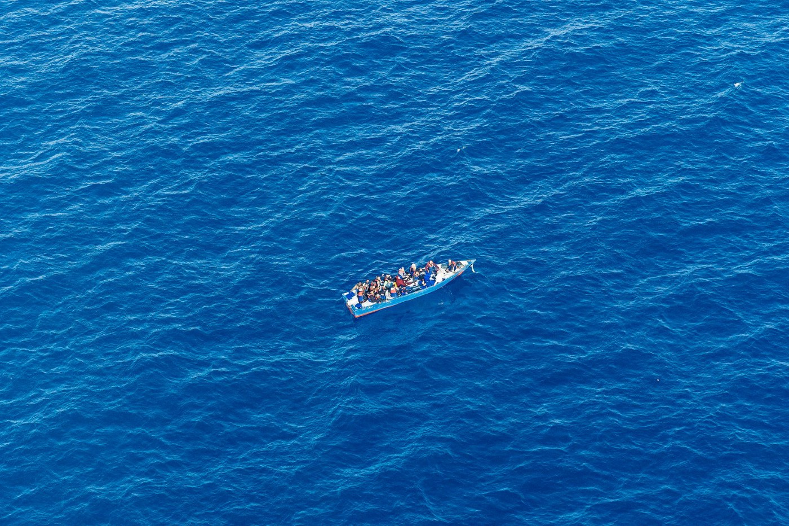
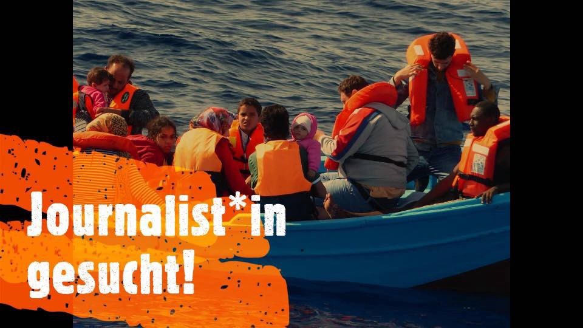
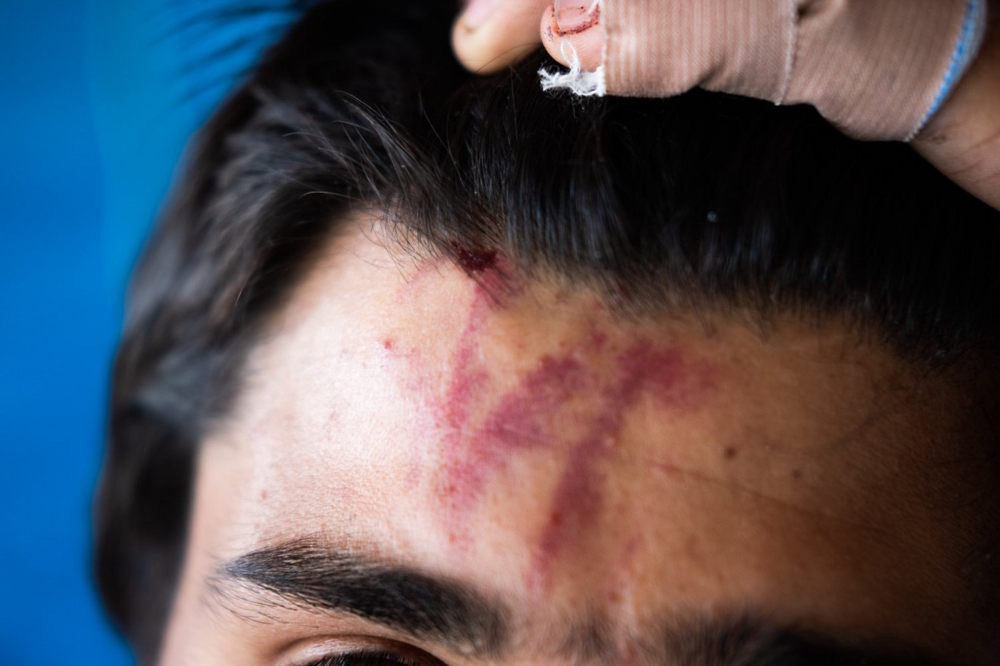
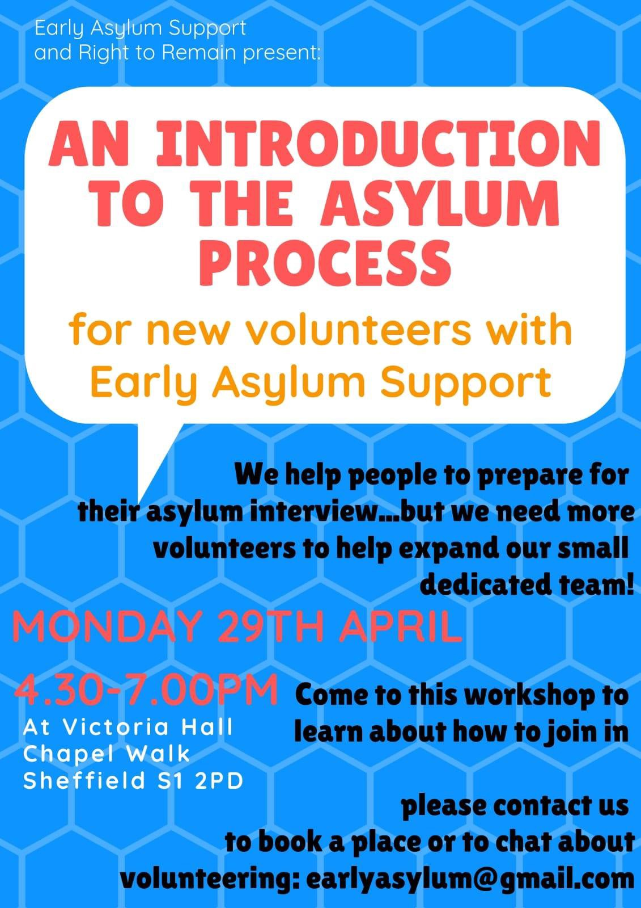

### AYS Daily Digest 10/4/19: Evictions in Athens
#### Greece: evictions, crisis deepens on the islands, help needed in many places / Serbia: more cases of violent pushbacks / Global Detention Project’s report for Croatia / France: Protesting the announced evictions in Paris; organisations against the announced system of registration for minors / & more news

](assets/eab8e2ab9e22/1*7MnjCEXO8tXvOYIIaOgIiw.jpeg)

Photo from [Azadi Squat Athens](https://www.facebook.com/AzadiSquatAthens/?__xts__%5B0%5D=68.ARCcxUOf-YVLt3lFZ84lDPPy2BZMSbkQlMDbLQUwNRrss0mxDwtbde1wM90wnc3GDInVv4Z_m56Rm-5cC553ot4DOKirW7zStMc3Rf3YS3TFpH9vaZFEYk83mL9yMK9hQvICfScG3tLmAhmjn9tZBGPMGG4HLH0Z5zDAzwZ0IEbilxdRRWH58EnprbwKa9PEGhG8IoUCZhZS2al5hpDIC11mbEshp3Qn2_q19X4-6V6ZzzCMYBWdDz8D1wS9oXCTSfT4uACW2m4-9x6ZPLK7eAoruIU84Z0wXnDYGHmn_tqTyr14PFK5g0qmw1HzcqjX1w2fVO8Ve2xAdVK5xVcIomcTHdMD&__tn__=k%2AF&tn-str=k%2AF)
#### FEATURE

Early on Thursday morning, on the day we published this news digest, the police in Athens evicted the Azadi and Babylon refugee squats\.
Later on the officials were on Tzavella street, reportedly closing the premises with metal\.

The [Our house](https://www.facebook.com/ourhousegr/?__xts__%5B0%5D=68.ARDeQUgp81FiBTKNzrzBsmQEhmfvlUXqJuwE3zOVoKGZkxYEaq7JL9f5Sr8Z359FjYYckUdEhu_cYY6lidumukfXxreVC9jMZJjk8WL_gbUJndUIdSeB7BATsyYgm-XiMxg1rvovF1oyTKubOLnk09XHCvV32YN8Z7AnwAMihF5HModO0bwkjSoZ9NvlLaF6Qn5hNEOdJl_XPOHuCU7Yyg0oNPShSwXOaKiwyVpibC1rYGbtA9O29Uw-5vFrYX9UndlOqhDvOVMpUHf9jMDUX5URPqnMeYHeUakoGgr2d5XQtg_zDUZsn8ohs18ReDBxeU7qwB8Q8U5fI6ozXCmO8Sb86x2V) team issued a call for help:

> These squats house families with young children\. 

> Where are they to go? Approximately 200 will swell the already massive homeless community in Athens\. 

> Please help us help them\. Our House will work through the day to give as much support as we can, prioritising women and children\. 

> We are sure emergency shelter will be needed, food will be needed\. 

■■■■■■■■■■■■■■ 
> **[NoBorders](https://twitter.com/Refugees_Gr) @ Twitter Says:** 

> > ΚΑΛΕΣΜΑ ΣΒΕΜΚΟ ΓΙΑ ΑΠΕΡΓΙΑ ΣΤΙΣ ΜΚΟ 16/4 ΕΝΑΝΤΙΑ ΣΤΙΣ ΕΞΩΣΕΙΣ ΠΡΟΣΦΥΓΩΝ-ΣΥΓΚΕΝΤΡΩΣΗ 12:00 ΣΤΟ ΜΟΥΣΕΙΟ
16th of April: NGO Workers’ strike against refugee evictions
12:00 Archaeological Museum 

Get informed: [facebook.com/AgainstRefugee…](https://www.facebook.com/AgainstRefugeeEvictionsGreece/)
[facebook.com/svemko/](https://www.facebook.com/svemko/)

#refugeesgr #antireport https://t.co/xvs4ZbAKQe 

> **Tweeted at [2019-04-11 09:11:24](https://twitter.com/refugees_gr/status/1116267494531059713).** 

■■■■■■■■■■■■■■ 

#### SEA
### Deliberate non\-assistance in distress

A boat with 20 people on board is drifting near the Libyan\-Tunisian border\. Authorities in Tunis, Valletta & Rome are informed but not reacting adequately\.

“This is non assistance\! Already at 6:50 a\.m\. UTC, our SAR\-plane Moonbird was able to localize a distress case that was previously reported by the [Watch The Med — Alarmphone](https://www.facebook.com/watchthemed.alarmphone/?__tn__=%2CdKH-R-R&eid=ARA6BgGg8uBEpatWP76sqcgFj-9ff4K_GIDtfC4puZ8jzEhLTmf57mFLCjSsLH5XX4mIc2jXv4jMIQPJ&fref=mentions) and sparked a mayday relay\. More than 20 people are currently in acute distress, eight people may have already drowned\. No MRCC has taken responsibility for hours\. Although two [Vroon](https://www.facebook.com/VroonGroup/?__tn__=%2CdKH-R-R&eid=ARDamn1N8lg1vgLUMVBvDjG7EpGjMWew6SG-DtGAiD7rwKvrxvO9aiUTdblFRmuPpdT1RJocLkUPYmCB&fref=mentions) ships are nearby, they haven’t helped\. The Vos Triton & Vos Aphrodite must be diverted immediately to respond to the ongoing distress\.” — [Sea\-Watch](https://www.facebook.com/seawatchprojekt/?tn-str=k%2AF)

The [Seebrücke — Schafft sichere Häfen](https://www.facebook.com/SeebrueckeSchafftsichereHaefen/?__xts__%5B0%5D=68.ARCNw2J47djBkUbeMqOfgrkKocXa-FAh9771HwwN-RVpl3y5jklon3Y5Qn8cbQQiuxYdChVvLR0e1BcrCaRogdNSIpiuddLC0PdA3kFYQScRhb4rDmG2Iy7Z4RuX4fctgDKRWox7mVp6jrAQz5A20bwltuGkJ5zos4ryLz9lAwTwmS5cAbgAElyWGkWRUiwhuesbolE9A8vx0p2wON8Q29QDWl6DBmBtmqWJeFb0CVLHZUVMr6xyQ8iYvOsC3uT4dTpnnZ47sTz0MGcfzKx1U451ozRUZn1KubKa15Jck2vKmG1AjR2bUnAftG5CzpzSJpjanGc2SfQ1LaY_LCNhX6w&__tn__=k%2AF&tn-str=k%2AF) observation and documentation mission off the Libyan coast will begin in a few days and they are still looking for a /wo/man journalist to join the crew\.
“This is very important to be able to report in authentic terms about the state\.”

If you are interested, write directly to crewing@resqship\.org

#### GREECE

According to the latest statistics by the Greek Ministry, there are 14,428 people registered on the Aegean islands: 6855 on Lesvos, 1581 on Chios, 3949 on Samos, 1043 on Leros, 932 on Kos and 68 on other islands\.

43 persons are in detention, while 47 people are awaiting in the predeparture detention centres on Lesvos and Kos\.
### Lesvos

The Office of the Mytilene Public Prosecutor has pressed criminal charges against the perpetrators of a [racist attack that took place on 22 April 2018\.](ays-daily-digest-23-04-18-fascists-attack-refugees-on-lesvos-1e65534a5726) However, with the current draft of the new Penal Code, racist crimes like the ones committed on Sappho Square will be impossible to prosecute in principle as such\. Furthermore, the proposed changes will negatively impact the outcome of legal cases that are still pending e\.g\. the case of Golden Dawn, reported [HIAS Greece](https://www.facebook.com/HIASGreece/?__tn__=%2CdkCH-R-R&eid=ARBwe-PtxGBtH8kTVBgzGiXbRtHDFbekcNIKFZrZBbQasLD3WBRE8PnOCBii8fX3cEzWZ6KiTaOkl7MQ&hc_ref=ARR_SM0BXwNXWzHRcnR-8aSPp_D9Kbb6D9-5j-fXLTZytuLIcfX4ZeD4WDxLctSCraA&fref=nf&hc_location=group) \.
#### Moria

Lesvos has been designated a so\-called ‘hotspot’ where identification and asylum requests are concentrated, so therefore people who land on the island must wait for months, sometimes even more than a year, in order to be allowed to move to the mainland and continue on their way\. Sixty percent of the camp’s residents sleep in shipping containers, forty percent in tents\.

> Unaccompanied minors live in a fenced\-in zone designed for their security\. 

Of course, the miserable living conditions are a source of constant criticism by international humanitarian organizations working on Lesvos, but also by those who have only come to inspect the situation with regards to certain elements\. In a recent [article](https://www.infomigrants.net/en/post/16018/anyone-who-thinks-they-can-do-better-than-us-is-welcome-to-try-says-director-of-moria-camp-on-lesbos?fbclid=IwAR04_yfLbb2cQG7ara55SHORp16eWf7NyiMNU41maSw0gATtcfD5MIemJqg) on the subject, InfoMigrants reports that the camp’s director says he and his staff should not be the target of criticism about living conditions and that, at their level, “we are doing our best\.”

> Anyone who thinks they can do better than us is welcome to try\. 

■■■■■■■■■■■■■■ 
> **[Marianna Karakoulaki](https://twitter.com/Faloulah) @ Twitter Says:** 

> > If better means giving #refugeesGR the dignity that #FortressEurope and #Greece took from them through the #EU's hotspot approach then I can think of many. So if this is an open call for bids I can think of plenty I can forward it. 

> **Tweeted at [2019-04-10 14:43:16](https://twitter.com/faloulah/status/1115988623516676096).** 

■■■■■■■■■■■■■■ 

Lesvos Solidarity is undergoing serious financial difficulties\. The team remains committed to keeping the community projects running\. However, with limited resources there will likely be changes in the nature and scope of their work\. You can read in detail what is going on: [here\.](https://lesvossolidarity.org/en/blog/lesvos-solidarity-funding-crisis-a-statement?fbclid=IwAR3EvOD4N39SL7VCuFUIWu399m6VcnixyqFv0jjVstpfdyUMZ5TzOQKCrdA)
### Chios

There was a new landing at Chios port\. Forty\-six people arrived: five children, five women and 36 men from Palestine, Iraq and Syria\.
Some had reportedly arrived without shoes and many very wet, including the young children\. Volunteers working in the area distributed dry clothing, blankets, food and water\.

**“Dangerous bodily injury with racist features”**

For the third time, Mattheos Mermungoussis [was convicted](https://astraparis.gr/triti-katadiki-gia-ton-mermigkoysi-i-deyteri-me-ton-antiratsistiko/?fbclid=IwAR1w4TUc7FCkYmZsxG8Hfbdl-LoN9ZdyKv6GNAP9MWhQPt_0llEUTAIM_gw) of participation in the attacks on Chios\. The racist features of the attack were deliberate, the charges stated, noting that this group, which included Mermungoussis, were the ones who acted to expel the refugees from the harbor of Chios in April 2016\.

The chairman rejected the defense’s request to accept the mitigating justifiable indignation of the situation prevailing in Souda\.

The prosecutor proposed 20 months’ imprisonment, the defense requested the minimum and ultimately imposed a 15\-month prison sentence, namely three months for dangerous personal injury \(the minimum\) and 12 months for the aggravating element of racist features\.
### Athens

The Amurtel team is looking for a female volunteer to join us in Athens from May to August 2019 from Tuesday to Thursday, 10 to 4\.

> Amurtel’s focus is two\-fold : to deliver ante\-natal and postnatal care \(ANC/PNC\) to mothers and babies and to address the critical needs of infant feeding from birth to two years of age \(IYCF — Infant and Young Child Feeding\) \. The target group is refugees and migrants living in urban settings as well those in the many camps accessible to central Athens\. 
 

> The role of this volunteer will be :
 

> \- greeting the visitors, answering questions about the daily schedule, directing people to the appropriate locations
 

> \- maintaining sign\-in sheets with the numbers and details of those visiting
 

> \- make sure appointments and overall organisation of exams are run smoothly 

If you are interested or need more details, please send a mail to amurtel\.gr@amurtel\.org

**Happy Caravan looking for volunteers for May\.** 
They are currently “working to acquire, adapt and transport a container that will be used as a mobile classroom for refugee camps in Greece\. 
Find more information [here](https://happy-caravan.org/volunteers/) and if you have any questions about volunteering, please send an email directly to [info@happy\-caravan\.org](mailto:info@happycaravan.org) \.
#### SERBIA

](assets/eab8e2ab9e22/1*Wj4h7-j2_j9DCZPoHBMagQ.jpeg)

Irsan \(not his real name\) was resting on a bench in the sun after a long sleepless night\. His index finger was bleeding and there was a great bruise at the left side of his head\. Still, he insisted that what made him feel more pain was invisible to the eye: he had been kicked really hard in the ribs and he couldn’t walk or sit down\. He continued muttering the same sentence: “police is a great problem”\. — [No Name Kitchen](https://www.facebook.com/NoNameKitchenBelgrade/?tn-str=k%2AF&hc_location=group_dialog)

The [No Name Kitchen](https://www.facebook.com/NoNameKitchenBelgrade/?tn-str=k%2AF&hc_location=group_dialog) team reported a case of a young man, aged 19, from Afghanistan tried to cross the border to Croatia together with eight more people\. They were spotted by the police and all but he managed to escape\. 
He was reportedly beaten up by a police officer while another police officer watched: “He hit me on the legs with a stick, he kicked me in the ribs and he squashed my head against a wall”\. Later, he was pushed back to Serbia\.

> This is not an isolated case\. People who have suffered police violence when trying to cross the border arrive at the squat every week\. — [No Name Kitchen](https://www.facebook.com/NoNameKitchenBelgrade/?tn-str=k%2AF&hc_location=group_dialog) 

Along with what was recently published, the Belgrade Centre for Human Rights has published the report: [Human Rights in Serbia 2018](http://www.bgcentar.org.rs/bgcentar/eng-lat/wp-content/uploads/2014/01/Human-Rights-in-Serbia-2018.pdf) , the seventh annual [report](http://azil.rs/en/wp-content/uploads/2019/02/Right-to-Asylum-2018.pdf) on the right to asylum in the Republic of Serbia, containing an overview and analysis of the protection of refugees in the country in 2018\. It summarizes relevant figures and offers analyses of access to asylum for children, the application of the ‘Safe Third Country’ concept and material reception conditions in Serbia\.
#### CROATIA
### Shrinking space for independent monitoring

As civil society groups have stepped up their criticism of Croatia’s border policies, authorities have begun restricting their access to detention and reception centres\. People are detained even before they receive their documents that state they should leave\. 
Unaccompanied children above the age of 14 are frequently placed in juvenile public care institutions where they reportedly face hostility from other children\.
There are no provisions protecting non\-citizens who have been released from re\-detention\.
These are only some of the points that we have also been reporting about for a long time, resulting in the Ombudswoman’s recommendations after the 2018 report, and which are stressed in the latest Global Detention Project’s report\.

#### SWITZERLAND
### Amnesty: Authorities must drop absurd charges against priest who showed compassion to asylum\-seeker

Pastor Norbert Valley, who was picked up at his Sunday service by police for questioning, has been charged with “facilitating the illegal stay” of a Togolese man\.
If indicted, Pastor Valley would have to face a criminal trial\.

“Sadly, Pastor Valley’s case is not an isolated one but merely the latest in a series of cases across Europe that have seen authorities using immigration and anti\-smuggling laws to criminalise acts of solidarity,” said Julie Jeannet of AI\.

> By targeting Pastor Valley and criminalizing acts of compassion, the authorities have demonstrated the extreme lengths to which they are prepared to go in order to curb humanitarian activities 

#### FRANCE
### Paris — united against the eviction

150 residents of the centre wrote a letter together that was later translated into French and has now been published in an English version by the AYS team\. It reads:

“We the 150 residents of the centre live in mutual respect, regardless of our religion, our skin color, our race\. Black or white, we are one and there are no problems among us\. To ensure our rights, we are ready to resist, hand in hand\. We demand our rights here\. Why do we want our rights?

Because we lack respect, they have betrayed us, they want to expel us from the camp\. Though we were told they would not throw us out of here, they lied to us\. They want to expel us\. **They cry out for human rights\. Where are they, these human rights?**

In the street, life is very difficult, we want your help\. They say France doesn’t deport, but we are being kicked out in the street, and that is just as good as deportation\.

If we are deported to our countries, this will mean certain death, but the street is another way to kill us\. If the head of the camp and the leaders slept in the street, would they not see death with their own eyes?

We are not goods, sheep, that you buy fat one day and sell the next day\. If the the responsible people of the camp sleep one night in the street, we will stop protesting\.

A Dublin returnee, is he not also a human, so he shouldn’’t sleep in the street? And when we are sick?

In the street, they do not even allow us to sleep\. They gas us, they wake us up with water canons and they destroy our papers and our belongings\. This is torture\. It’s about racism\. The French state is a racist state\. They neglect our rights\. Our families are worried about us\. Once on the street, if we get sick, who will come to help us? If our nerves fray? Forget the cold, how are we going to endure the hot season?

We say to the people of the neighborhood: we are all under pressure and we have been forced out by the police forces and the State\.

We have a many problems at the centre\. The Emmaus organisation and the social workers told us we must leave the place in 20 days\. If we refuse, the police will expel us by force\. At the moment, we are extremely worried about the situation we are in\. We do not know where to go\.

We kindly ask you to collaborate with us and to be our fellow travelers\. If you, respectable neighbors, do not support us, they will take us out of the centre and our lives will be turned upside down\. We ask you to help us by participating in our demonstrations and protest actions\. We ask you to support us\. 
20 days from now, 20 residents will be evicted\.

**All the residents of** **Jean Quarré demand a solution to the problem and oppose the eviction of these people\.**

**Manifestation will be held this Saturday, April 13:** residents of the centre Jean Quarré united against their planned eviction\!
- Meeting point : 10:00 a\.m\. at the Place des Fêtes
- Gathering at 11:00 a\.m\. at the place Armand Carrel, in front of the city hall of the 19th arrondissement\.

### Support the SAR mission activists

### Registration of unaccompanied minors — a question of security and repression

As we have reported earlier, Doctors Without Borders and 18 other associations, organisations and unions in France spoke up about the legality of a recent decree that introduces the registration of unaccompanied minors, by seizing the Council of State\. Priscillia de Corson, Advocacy Officer in the Médecins Sans Frontières program for unaccompanied minors in France, gave an update on the current procedures and the reasons that led the organization to get involved in this fight\.

> It is these young people, particularly vulnerable, who our teams help on a daily basis through the day center and various activities\. These new regulations introduce, for example, a biometric file and a compulsory visit to the prefecture for young people as steps for them to be recognized as minors\. For now this is only practiced in three departments, but it is planned to be implemented nationally before the end of May 2019\. 

Find their press release here:

#### SPAIN
### Barcelona

Our friends at OCC need help to organize a volunteer event in Barcelona and to continue their efforts in supporting refugees in Greece\. Find more info on their Facebook page\.

](assets/eab8e2ab9e22/1*zIYRt28TwheoX-wqSXtxog.jpeg)

[Open Cultural Center — OCC](https://www.facebook.com/OpenCulturalCenter/?tn-str=k%2AF&hc_location=group_dialog)
#### UK

Joint event between Right to Remain and Early Asylum Support Sheffield — find about more about the asylum process, and how to get involved with EAS’s work on helping people to prepare for the asylum substantive interview\.

**Apart from daily news in English, we also publish weekly summaries in Arabic and Persian\. Find specials in both languages on our medium site\.**

**If you think you could contribute to the work of our info team, write us\.**

**We strive to echo correct news from the ground through collaboration and fairness\. Every effort has been made to credit organizations and individuals with regard to the supply of information, video, and photo material \(in cases where the source wanted to be accredited\) \. Please notify us regarding corrections\.**

**If there’s anything you want to share or comment, contact us through Facebook, Twitter or write to: areyousyrious@gmail\.com\.**

_Converted [Medium Post](https://medium.com/are-you-syrious/ays-daily-digest-10-4-19-evictions-in-athens-eab8e2ab9e22) by [ZMediumToMarkdown](https://github.com/ZhgChgLi/ZMediumToMarkdown)._
