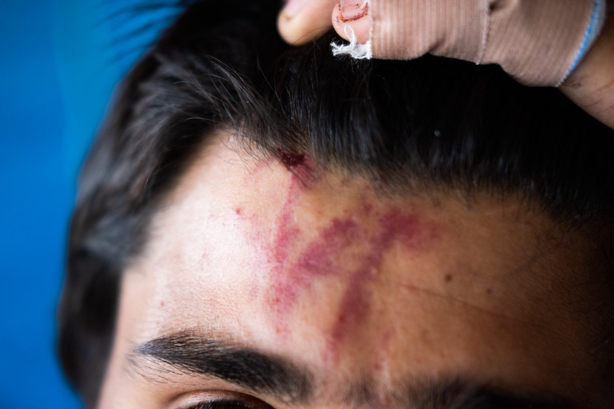
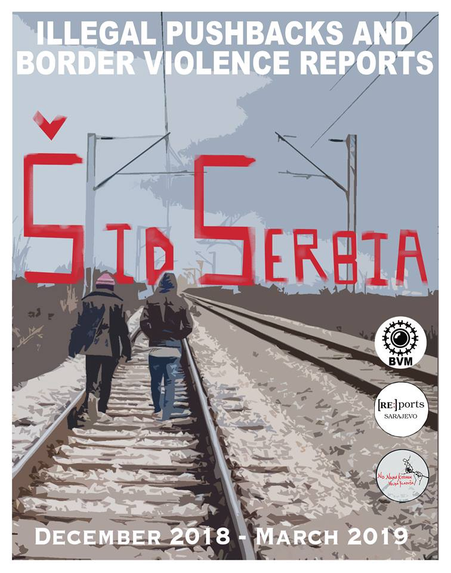
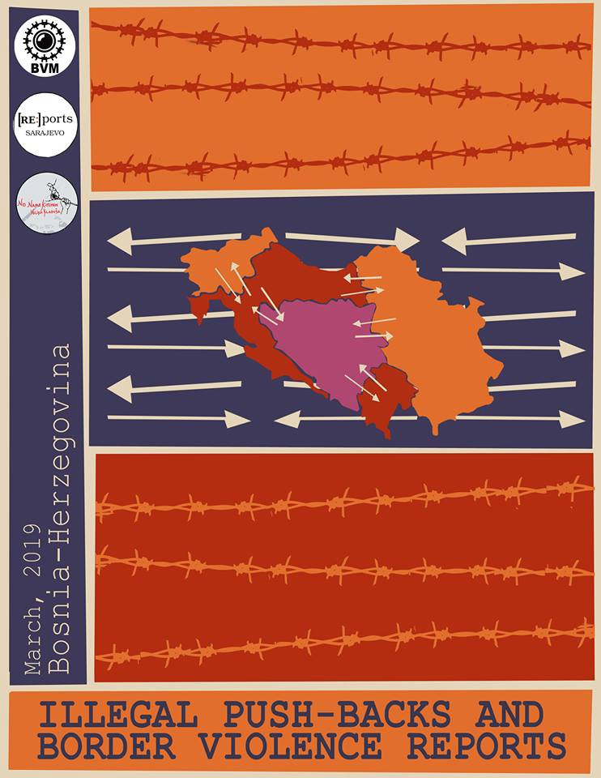
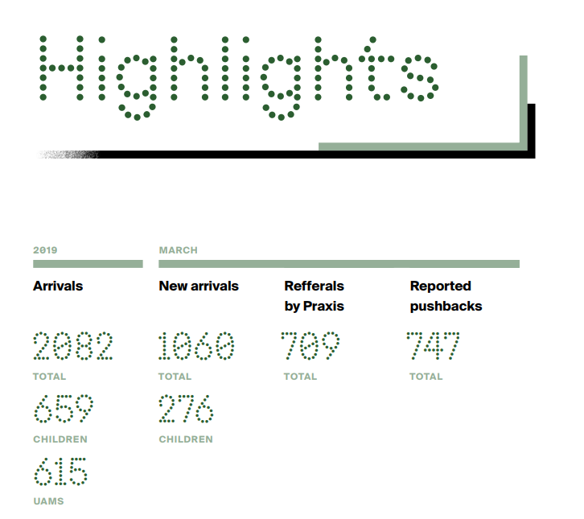

### AYS Daily Digest 12/04/2019: EU Funded\-Systemic\-Race\-Based Violence — The New Normal

Violence Against Minors on the Move in Morocco// Joint Appeal to Malta to Open Ports to Alan Kurdi Ship// Seventeen\-year\-old Boy Commits Suicide in Libya//News from Greece//Italy//France//Denmark

Photo by No Name Kitchen

Border Violence Reports for March have been released by No Name Kitchen
#### FEATURE: The March Border Violence reports have been released by NNK and, much the same as we have reported for the whole of the last year, violence continues at EU borders against people on the move\.
#### But race\-based systemic violence also continues in:
- EU Member States
- The Periphery of Europe
- Countries funded by Europe to keep people on the move out of Europe \(Libya, Morocco, Niger, Turkey\)
- The SEA\!

By all accounts, systemic race\-based violence is the new normal in Europe\. For us to deny this is even more frightening than to accept it\.

**But normal everyday people are fighting against it, and here is a little example taken from the report of what that looks like:**

> The group left on February 24th from Nikšić \(MNE\) with the intention of continuing onwards towards Bosnia and Herzegovina\. From there they took a bus up to the border of BiH to Vilusi \(MNE\) \. They crossed into BiH and slept in the woods several hours\. At around noon on February 25th, they walked into the town of Bileća \(BiH\) \. In Bileća two police officers in blue uniforms, which were described as being similar to uniforms of Republika Srpska police officers, recognized the group\. The four started running away from the police, all in different directions, attempting to escape\. 

> The interviewee ran into a blind alley and accordingly gave up\. The two police officers present were described as handling him roughly, forcing him onto the ground at which point one officer put his foot on the interviewee’s neck and the other began to beat him with a police baton\. 

> They were surrounded by houses\. On one house the window opened and an elderly lady looked out and shouted at the police officers to stop\. 

> “This woman saved me\!” 

#### Below are the links to the Violence reports:

[Report Link for Serbia](http://www.nonamekitchen.org/wp-content/uploads/2019/04/March-Final-Sidreports.pdf?fbclid=IwAR0ua8HZeOucDfHapukV2QtgoDjvzlEeA-qiYoBoA5AtvUgrVtBrWS_fI38) 
[Report Link for BiH](http://www.nonamekitchen.org/wp-content/uploads/2019/04/March_BiH-BVreports-1.pdf?fbclid=IwAR1aIC1FjpACaIk4dtA2rvP5KENQoMsEsfUJxMFtVIWEoHE6DJQyvHNttyQ)
### MOROCCO

[The Association Maakum Ceuta](https://elpueblodeceuta.es/art/37469/denuncian-que-grupos-organizados-de-ceuties-agreden-a-menas-en-el-puerto) has confirmed that groups of citizens from Ceuta have been violently harassing children on the move\. Helena Maleno reports that this is the only request for a thorough investigation into these incidents and the immediate protection of minors\.
### TUNISIA

Tunisia has become a somewhat ‘safe’ haven for people on the move who have been traumatized in Libya\. This report outlines the story of an unaccompanied 16\-year\-old girl, who put her plans of reaching Europe on hold to seek temporary safety in Tunisia\.

> The 16\-year\-old, who fled Eritrea after her parents died, planned to cross the Mediterranean from Libya to Europe\. Instead, the rubber boat on which she attempted the journey was intercepted by the Libyan coast guard and she spent the next six months in smugglers’ warehouses and detention centers, where she says she was abused by militiamen and forced to undergo an abortion\. With the help of a sympathetic guard, she eventually fled to Tunisia\. 

An award winning article, [‘The Dead That Inhabit Me’](https://www.revista5w.com/why/los-muertos-que-me-habitan?fbclid=IwAR3tMaYHRAXfEAGbnWyliBmgo5hBGkiO6WUilDNo1eK8dTqoRHBSuUd4djg) , about a Tunisian volunteer, Chamseddine Marzoug, who buries the bodies of the deceased in the Mediterranean that wash up to the shore\. By Agus Morales and Edu Ponces\. Worth the read\!
### LIBYA

A seventeen\-year\-old boy inside Abu Salim detention centre in Tripoli has taken his own life\.

[https://twitter\.com/sallyhayd/status/1116651279160418304](https://twitter.com/sallyhayd/status/1116651279160418304)

Meanwhile, the escalation of fighting continues\. MSF has reported that so far three doctors and one ambulance driver have been killed, and four other first responders have been injured in the fighting\.

■■■■■■■■■■■■■■ 
> **[Sally Hayden](https://twitter.com/sallyhayd) @ Twitter Says:** 

> > Air strike hit close to Tajoura detention centre three hours ago. Sources telling me wounded &amp; dead fighters were brought inside afterwards. #libya #tripoli 

> **Tweeted at [2019-04-12 16:54:34](https://twitter.com/sallyhayd/status/1116746442033500160).** 

■■■■■■■■■■■■■■ 

[The following is a report](https://reliefweb.int/report/world/conflict-related-sexual-violence-report-secretary-general-s2019280?fbclid=IwAR0QL6iZ8Uu2f-LUBPD3Z8gx3BoCpjz4-bUOSQ_2arNH45VLnjmrn8Qkpn4) by the UN Secretary\-General to the security council on sexual violence\. The report contains a section on Libya, where it documents sexual violence against refugees and migrants\.

> Migrant women and girls are particularly vulnerable to rape and other forms of conflict\-related sexual violence\. Many are exposed to forced prostitution and sexual exploitation in conditions amounting to sexual slavery\. 

Over one hundred children and 600 adults are reported to have been without food for a week so far in Gasar Bin Gashir Detention Centre in Libya\.

■■■■■■■■■■■■■■ 
> **[Sally Hayden](https://twitter.com/sallyhayd) @ Twitter Says:** 

> > A message sent this morning from Qasr bin Ghashir detention centre, where detainees say 600 refugees/migrants (incl women &amp; children) haven't eaten since April 5. 
Yesterday, there were attempts to move them to Zintan or Gharyan, but they refused, &amp; the busses eventually left. https://t.co/JbeQ7wUpHi 

> **Tweeted at [2019-04-12 10:38:58](https://twitter.com/sallyhayd/status/1116651920649859072).** 

■■■■■■■■■■■■■■ 

### SEA

[38 People have been rescued](https://www.europapress.es/andalucia/noticia-rescatados-38-migrantes-patera-navegaba-aguas-cercanas-motril-granada-20190412094419.html) 35 miles southeast of the Granada town of Motril in Spain\.

A joint appeal by 28 organizations has been made to the Maltese Prime Minister, Joseph Muscat, which demands that Malta allows for the disembarkation of the 60 people on the Alan Kurdi Search and Rescue Vessel\.

The rescued survivors have been on board the ship for over 9 days\.
#### GREECE

According to Aegean Boat Report, three boats have arrived on the Aegean Islands\. One boat carrying 30 people arrived on Chios\. While two other boats with 28 and 35 persons have been transferred to Kos\. One of the boats is reported to have been in distress and was picked up and transferred by the Greek Coast Guard\.

A body has washed up on a beach in Chios, close the point where a boat carrying persons on the move was hit\. Two men remain missing from the incident\.

[MSF has started providing vaccinations](https://reliefweb.int/report/greece/humanitarian-mechanism-vaccines-used-first-time-europe-counter-high-prices?fbclid=IwAR2HKJrO7QwJiRbIaySadqPtlF7CqXu2buIIndHeMEMhFXkdtCtPW7ceG7o) to children on the move on the Greek Islands of Chios, Samos\.

Citizen protests in Chios to end geographical restriction between mainland and islands has led to the Minister of Migration Policy announcing a review of the EU\-Turkey deal and the internal borders of Greece that separates the mainland from the islands\. He also said that the hotspot is going to close and another one will open at Zervos area\.

Lifting Hands International are looking for a person to manage their arts and recreation program\. Follow this [link](https://v4r.info/task.list.php?ID=1082) \.
#### SERBIA

[A link to](http://www.praxis.org.rs/images/praxis_downloads/Praxis_Protection_Monitoring_Report_March_2019.pdf) — Praxis Protection Monitoring Report MARCH 2019 Refugee & Migration Situation in Belgrade, Serbia

Taken from Inside the Praxis Report
### ITALY

70 people have been transported to the coasts of Lampedusa… But According to Italy’s Interior Ministry, this was not a relief operation\. Instead, the military intervened to transport the persons rescued to expedite the expulsion procedures\.

The logic of this statement appears somewhat flawed, as the Interior Minister, Matteo Salvini refused the access of the Alan Kurdi SAR vessel, which is still in the Mediterranean with 60 people on board — declaring that ports are closed\.

[A new decree issued by the Italian Government](https://www.infomigrants.net/en/post/16275/italy-issues-decree-to-admit-30-850-non-eu-workers?ref=tw&fbclid=IwAR3DTu1oS7aCl-uQl8Ph57vv4RqslsnfdRdfap1xP739vrIRr9nb_w_OHQs) is said to allow up to 30,850 non\-EU workers the right to enter the country\. 18,000 people will be employed in seasonal work \(agriculture and tourism\) and another 12,850 will be employed in non\-seasonal work \(freelance jobs\) \.
### FRANCE

The UN has described conditions faced by people on the move as harsh\. They have requested that France acts to rectify the dire living conditions, especially in Calais and Grande Synthe\.
### DENMARK

Immigration detention centres in Denmark will start only employing those for ‘unskilled labour’ in the centres, which was previously a job that required three years of training\. This is due to a general lack of prison guards in other regular Danish prisons\.

Whilst the idea of having people trained to work as a prison guard for refugees and migrants obviously raises concerns, having people with no specific skills doing this job, with the authority to ‘exercise power’ is also concerning\.

The manager of Detention camp Kærshovedgaard, Niels Johan Geil says to DR\.dk: “An institutional worker is normally unskilled and has so far only had five days of induction by following another staff member\. That will now be changed to a 12 days course on conflict management, exercise of authority and cultural understanding\. They learn everything that is relevant in order to do the task,” says Niels Johan Geil, who does recognize that these courses have been missing\.

**Apart from daily news in English, we also publish weekly summaries in Arabic and Persian\. Find specials in both languages on our medium site\.**

**If you think you could contribute to the work of our info team, write us\.**

**We strive to echo correct news from the ground through collaboration and fairness\. Every effort has been made to credit organizations and individuals with regard to the supply of information, video, and photo material \(in cases where the source wanted to be accredited\) \. Please notify us regarding corrections\.**

**If there’s anything you want to share or comment, contact us through Facebook, Twitter or write to: areyousyrious@gmail\.com\.**

_Converted [Medium Post](https://medium.com/are-you-syrious/ays-daily-digest-12-04-2019-eu-funded-systemic-race-based-violence-the-new-normal-9a81da10e44d) by [ZMediumToMarkdown](https://github.com/ZhgChgLi/ZMediumToMarkdown)._
