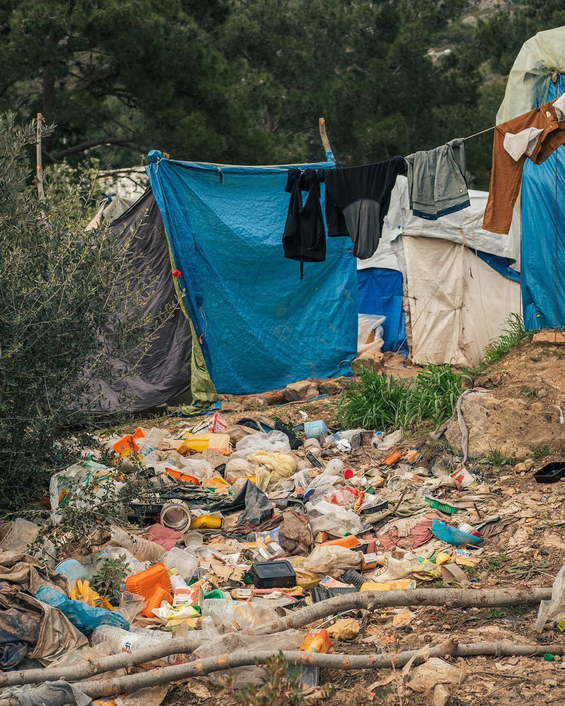
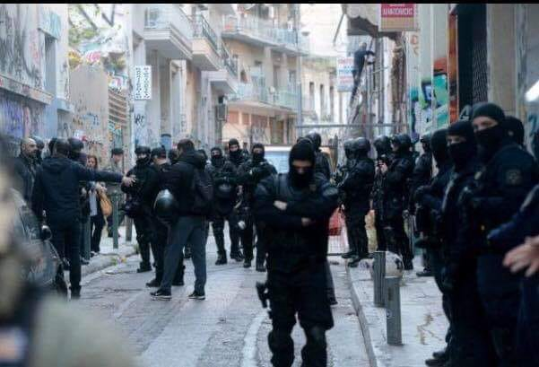
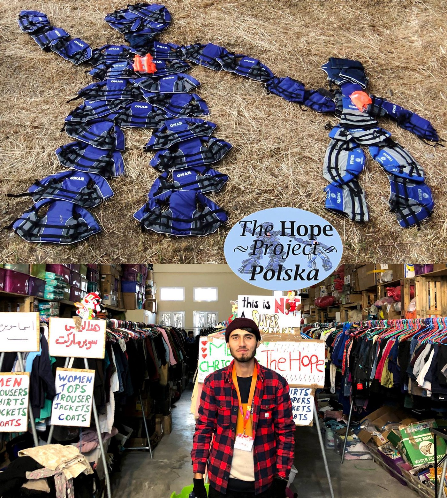
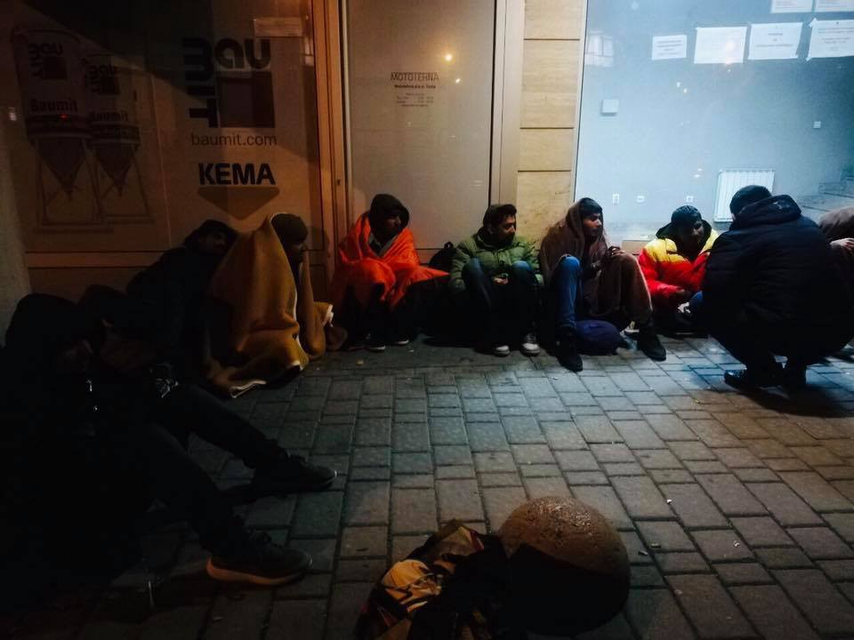
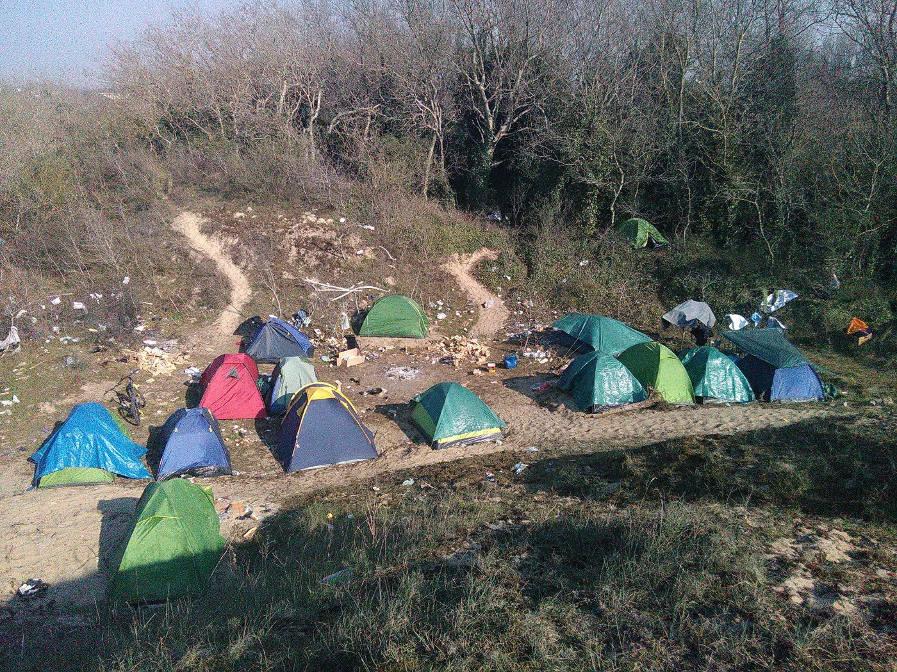

### AYS DAILY DIGEST 13–14/4/2019: Horror for people trapped in Libyan detention centres continues

_Waiting for the UNHCR in Libya // Young girl died on her way to Europe near Greece // Young man died on his way to Europe in Croatia // Life in the jungle around Calais // Life for asylum seekers in Switzerland_

 \.](assets/af5bb05a2aea/1*3ALHB7a4T2zPxYvUg4_2eA.jpeg)

Demonstration in Copenhagen by inhabitants in the immigration detention centres Kærshovedgård and Sjælsmark with the demands of access to medical help and education — and the closing down of the detention centres\. Photo by [Respons](https://www.facebook.com/353248551789309/posts/645309182583243/) \.
### Feature — Libyan Detention Centres

Over 700 people are still trapped in a detention centre at the front line in Qasr bin Ghashir, south of Tripoli\. For the past several days they have been left with no protection or assistance, and the only help available is provided by small local charity Mirgace\.

**All of them have been caught while trying to leave the country, and returned by the Libyan Coast Guards, which is funded by the EU\.**

UNHCR is responsible for the well being of refugees around the world\. In the case of Libya and Qasr bin Ghashir, apparently the people who are trapped inside are registered and they are waiting for who knows how long for relocation, a UNHCR responsibility, again\. They send a dramatic appeal saying, among other things, that they have tried to secure the transfer of vulnerable people from centres to safer locations, in the centre of Tripoli, but were only partially successful\. According to the UNHCR, many people are refusing to be taken to another centre, demanding to leave Libya instead, which is completely understandable\.

Journalist [Anette Kjær Jørgensen](https://www.facebook.com/anettesaw/posts/10219122376555156) has a contact inside of Qasr bin Ghashir\. On her FB profile, she posted a story about the living conditions, saying that people were offered to be moved to Zintan, a centre close to Tripoli\. But, that place is _“feared as a terrible place among the refugees and migrants stranded in Libya”\._

_“The place is overcrowded and people there have to sleep in shifts because there is no room for them to all to lie down at one time\. They never get sun and light, food is limited, mostly just spaghetti and sometimes they get nothing\. What everybody fears the most is tuberculosis that many in Zintan have died off\. In addition, people also die of hunger and simple malnutrition\.”_

One of her contacts told her that Zintan is called a “burial ground”\.

She also published an video from Qasr bin Ghashir\.

Relocation to other countries is something the UNHCR should have done a long time ago\.

_“Since the escalation of the conflict in Libya last week, more than 9,500 people have been forced to flee their homes\. However, more than 1,500 refugees and migrants are believed to be trapped in detention centres where hostilities are raging\. These are people in the most vulnerable and dangerous of circumstances\. They have fled conflict or persecution in their own countries only to be trapped as conflict engulfs them again,”_ said the UN High Commissioner for Refugees, Filippo Grandi\.

His full statement can be read [here](https://www.unhcr.org/en-us/news/press/2019/4/5cb0b5954/unhcr-issues-urgent-appeal-release-evacuation-detained-refugees-caught.html?fbclid=IwAR2dVGn1cCsoUg2cdyOEALsKhRRR6tDQiOjFU5mvOuW_2vMzA5FFg5aXMnU) \. His actions, we hope, we will see soon\.
### Greece

**The body of a young woman was found by a fisherman this weekend near Karlovasi, on the island of Samos** \. Apparently, she was on a boat carrying 51 people\. A young women fell out of the boat close to shore\.

Another boat landed to Samos carrying 41 people\. All people who arrived during the weekend were transferred to Kos, according to the Aegean Boat Report\.

The week in Chios started with a new landing\. On Monday, around 4\.10am, [Chios Eastern Shore Response Team — Info Point](https://www.facebook.com/groups/421759534684819/) participated in the rescue of 26 people\.

Life in camps on the islands continues to be unbearable\. In Samos, piles of garbage are everywhere\. Even worse is outside the camp, and many people are forced to stay there due to the lack of space inside\.

 team cleaning area around camp on Samos\.](assets/af5bb05a2aea/1*BeDiHZn_AgMKmiKCw30osQ.jpeg)

[Refugee4Refugees](https://www.facebook.com/Refugee4Refugees/posts/893825104294499?__xts__%5B0%5D=68.ARCiYtHNjjKRERUgi8aKe4kmNI5FqEyy6DWBb7da81kR_rS06xWshJXjKP3uv6MlEEwl903fYAmaX2MPbbnHCV7YZr-Egj2CyRjbNLQU78_ar-ecsOWxWcVoKWMGCMOAnWudKJCcIFTjWlnOgAKubQt0sEqa4QKa_JBpshdDVGyMdi1OudekOEC9nFNdoNUfABihkca3Vcsfp-TWc2ZyL1cyPRCBSycUuq0K6zqAuIl0m_XbWAu2HRxFc3TUib1pEEIOFK4kLQ_fhp4wWM83KEGuwsGjH_h_f4gCNPuDXpjedjgxpqTD2SbodZf-VTLcm5EqnnikobyzyrfJRvQnt3Q&__tn__=-R) team cleaning area around camp on Samos\.

The eviction of squats in Exarchia is still a cause of rage in Athens\. The [Refugee Hotel City Plaza](https://www.facebook.com/.../a.15696.../2063116393980693/...) issued a statement saying how the “government and police use refugees as scapegoats”\.

_“Refugees have been turned into scapegoats for pre\-election purposes\. Refugee targeting does not harm mafia, but it strengthens the racist stereotype of identifying “foreigners / refugees” with criminal activity and of course, opens the way to fascist violence\.”_

A beautiful act of solidarity with people on the island of Lesvos comes from Poland where a group of activists established [The Hope Project Poland](https://m.facebook.com/story.php?story_fbid=2021253811303054&id=1997736086988160) to support refugees stuck on the island\.

In Poland, people who are supporting this project come from 12 cities\. All detailed information can be found on their website [www\.thppolska\.org](http://www.thppolska.org) \.
### Balkans

A day after they issued another monthy report, the Border Violence Monitoring team received info about another death on the Balkan Route\.

**Another body of a young man was found in Croatia\. He died in an incident which occurred on March 31st near Otočac, close to the national park Plitvička jezera\.**

Young Oussama \(27\) was on the road with 9 more people, all from Algeria\. All of them were detained for 10 days, and after expressing their intention to seek asylum, they were pushed back to Bosnia\.

_“At 3am in the night, the group saw a light and assumed that it was the police\. They ran away and suddenly heard Oussama screaming when he fell into the hole where he died\. After that, 2 of the group walked around 14 km to the next village, where they explained their situation to a Croatian woman around 12 am\. She called the police that arrived 20 minutes later\. As an excuse, the police told them that they had to wait for a train to pass at an intersection\. The Police also ordered a forest\-guide to come\. The group witnessed the forest\-guide taking preparations to recover the dead body \(9 hours after death\) \.”_

Their phones were either taken away or destroyed and their sleeping bags burned\.

_“In “the garage”, where police brought them after they arrived at the place of the incident, they had to sleep in a dark and cold place full of urine\. Police took all the food from the refugees and only after 2 days they gave them a little bit to eat\. They told them to smile in the camera during the process of taking pictures and made fun of them\. Croatian police acted rude and disrespectful towards them, and they felt like they were treated like animals\.”_

Additionally, they all had to sign around 10–12 papers without any translation\.

See the [full report here](https://www.borderviolence.eu/violence-reports/march-30-2019-0000-20km-east-from-otocac-at-the-north-west-end-of-the-national-park-plitvicka-jezera/?fbclid=IwAR1MCUBeI0EPp2DcdHV2G96VMmR0g-1AR5U_haMF5GieT05AapYSKpZCKl4) \.

[Border Violence Monitoring](https://www.facebook.com/borderviolencemonitoring/) group is looking for people who would join their project for at least 2 months\.

_“We cover all travel and accommodation costs for the person\. If necessary, we can talk about further financial support\. Due to the difficult conditions on site and the task demanding a great deal of responsibility, it would be good if the person already has experience working with people on the move and conducting interviews with vulnerable populations\.”_
### Serbia

[Info Park Belgrade](https://www.facebook.com/infoparkserbia/) registered over 50 new arrivals to the Serbian capital this weekend\. Among them were three single men who claimed that their asylum
applications in Greece were rejected\.

_“Reportedly, two of the men had been staying in Greece for 4 years, while one of them had been living in a Greek village as asylum seeker for almost 10 years\. He desires to reach Italy and obtain legal status there, but to come back to the same village in Greece, once documented, as he feels it as his real home\.”_

Info Park also recorded almost 60 push backs from Hungary during this weekend\.

Among those who come to seek assistance in Info Park, was an 18\-year old boy from Iran who is traveling with his violin\. His intention is to continue toward Bosnia\.

■■■■■■■■■■■■■■ 
> **[Miloje Stronky](https://twitter.com/helmutdukadam86) @ Twitter Says:** 

> > 18-godišnji migrant iz Irana nosi na putu do sigurne budućnosti jedino što ima - violinu i ljubav. Danas je bio kod nas u Info Parku i svirao za svoje sapatnike i za one koji im pomažu. Noćas spava pod vedrim nebom. Sutra nastavlja opasan put ka Bosni i dalje ka EU. Poslušajte. https://t.co/M8KOYKsrdI 

> **Tweeted at [2019-04-14 20:42:03](https://twitter.com/gordanpaunovic/status/1117528464117125121).** 

■■■■■■■■■■■■■■ 

In the meantime, more and more people are arriving to Tuzla, crossing over the river Drina, from Serbia\. Local people provide the help, while the government and IOM and UNHCR are, more or less, ignoring the situation\.

Tea with friends in Tuzla\. By Senad Cupo\.
### France

Many people who cross over the Balkans continue their way toward Calais, hoping to arrive to the UK\. The number of people living in the jungle around Calais is constantly rising\.

](assets/af5bb05a2aea/1*ik-YEHDkEMqdSK1RYS5V8g.jpeg)

Calais by [Chiara Lauvergnac](https://www.facebook.com/chiara.lauvergnac/posts/10156581997129092)

_“Some tensions around the zones of passage, some problems with alcohol, lots of underage boys, unaccompanied, a boy around 6 with his father, and a few women, one is 7 months pregnant and trying every night\.”_

To find out more, follow [Chiara Lauvergnac](https://www.facebook.com/chiara.lauvergnac/posts/10156581997129092) FB posts\.

One more beautiful act of solidarity\. [Collectif Appel d’air](https://www.facebook.com/CalaisLibre/posts/797868390586117) organized a gathering on April 12, 2019, in memory of those who died “by wanting to go to the end of their dream”\. There were close to 200 people\.

](assets/af5bb05a2aea/1*PTPwjlNOhXFHiEbdg8Y30Q.jpeg)

By [Collectif Appel d’air](https://www.facebook.com/CalaisLibre/posts/797868390586117)
### Switzerland

In April 2018, the employment rate among asylum seekers ranged from 0% in the cantons of Glarus, Jura, Nidwalden, and Uri to 17\.5% in Graubünden\. According to the Swiss [media reports](https://lenews.ch/2019/04/12/swiss-government-pushes-to-get-refugees-and-asylum-seekers-working/?fbclid=IwAR0Qclupl5r5z4ZKKZlE5OGq176yUxwmgk9qm0QvBi94hReSISh3MuppMq4) , some cantons restrict refugees to work in specified industries, while others require jobs to be offered to locals first\.

Presently, refugees and asylum seekers without work survive on welfare, which cost CHF 988 million in 2017, a sum that has nearly tripled since 2008 when it was CHF 329 million\.

Recently, Switzerland’s federal government launched a new set of initiatives aimed at getting 70% into work that will go into effect on 1 May 2019, according to Le Matin\.

**Apart from daily news in English, we also publish weekly summaries in Arabic and Persian\. Find specials in both languages on our medium site\.**

**If you think you could contribute to the work of our info team, write us\.**

**We strive to echo correct news from the ground through collaboration and fairness\. Every effort has been made to credit organizations and individuals with regard to the supply of information, video, and photo material \(in cases where the source wanted to be accredited\) \. Please notify us regarding corrections\.**

**If there’s anything you want to share or comment, contact us through Facebook, Twitter or write to: areyousyrious@gmail\.com\.**

_Converted [Medium Post](https://medium.com/are-you-syrious/ays-daily-digest-13-14-4-2019-horror-for-people-trapped-in-libyan-detention-centres-continues-af5bb05a2aea) by [ZMediumToMarkdown](https://github.com/ZhgChgLi/ZMediumToMarkdown)._
