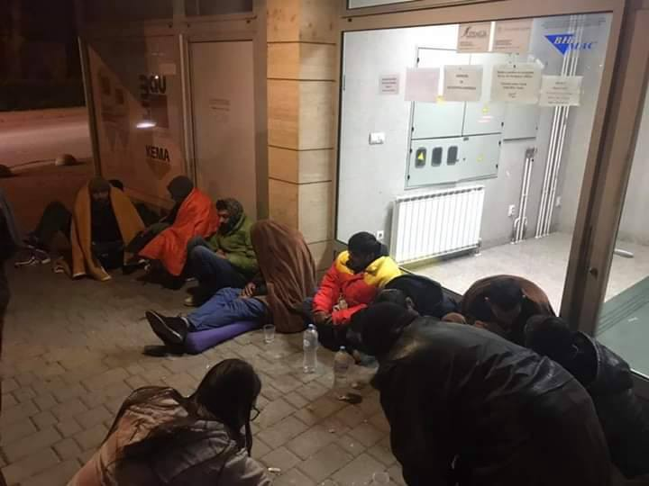
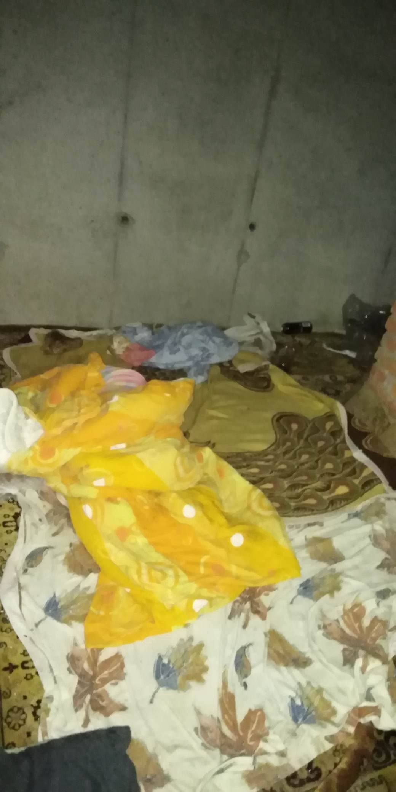
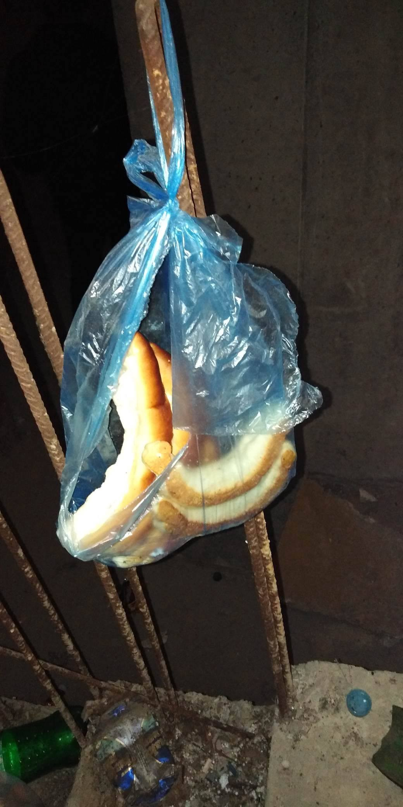

### AYS Daily Digest 16/4/19: How do the EU Commission’s funds manage to bypass those in need? — case: Tuzla
#### Protest held in Athens / surge of arrivals through Serbia / Italy in the midst of legal cases regarding detention and treatment of people arriving to the south / Bone tests disregarded as age evidence / volunteering opportunities

](assets/9a386ccea010/1*wAjJ0b8Jm-WLELkU3D4rzw.jpeg)

Photo from the prottest in Athens by: [Marios Lolos](https://www.facebook.com/marios.lolos.1?__tn__=%2Cd%2AF%2AF-R&eid=ARD7HqZh4La353Qa_5hTn4ifGzec54pd5vrRMezZ1KnENevAQndXmUlrbqoir4FvJl66uhSmWG5cDf9N&tn-str=%2AF&hc_location=group_dialog)
#### FEATURE

In Bosnia and Herzegovina, for a while now people have been arriving from the east part of the country, coming from Serbia to Tuzla\. It has once again become a point of transit for many and, although it has been so for some months now, the problem is ignored by the only authorities who could make possible to assist the people who gather usually around the bus station or in front of the field office of the Service for Foreigners’ Affairs \(SFA\) \. It is responsible for the first step in the process of seeking asylum\. In order to obtain the document from the office, people sleep rough on the pavement, sometime just in front of the lit and heated empty front space of the office that, of course, does not work on weekends and is [open](https://help.unhcr.org/bosniaandherzegovina/where-to-seek-help/the-service-for-foreigners-affairs/) on workdays from 9am to 5pm\.

Photo: AYS

A very well organized small group of volunteers from Tuzla have been handling the situation for these people in transit who are constantly arriving\. They have nowhere to go and there are no official systems of aid or accommodation\. None of the big organisations are present to provide assistance, advice, nor even to research into the situation and the existing problematic in order to push for better solutions as important international stake holders on the issue in Bosnia and Herzegovina\.

Citizens who have been organizing small groups of helpers in the past months have run out of strenghts, options, finances and ways to point to the problem\. They have already asked for an organised reception system, toilets to be made available 24/7, water supply, shower, food, clothes and health assistance, and if possible, an organized 24hour accommodation, as the people usually don’t stay there for logner\.

Photos: AYS

Unfortunately, along with the absence of responsibility by the county, the issue was not officially tackled by the City council, nor made part of the topics of their meetings, according to the local media, in spite of the citizens’ demands and volunteers’ desperation\. To our knowledge, there wasn’t and there currently is no activity of IOM or UNHCR, as we wrote already\. We intend to support their efforts to the best of our abilities, if you wish to come help \(on your own expenses, staying in a hostel or so\) or if you can provide financial support to them, let us know and the local team will estimate if and what sort of help is needed\.

Perhaps some explanations are due on the implementation and control of Asylum, Migration and Integration Fund and Internal Security Fund as these situations become more and more common\.
#### GREECE

](assets/9a386ccea010/1*xJHzSj2BEDyhxTKYdV1nwg.png)

[Refugee Rescue / ‘Mo Chara’](https://www.facebook.com/RefugeeRescueUK/?__xts__%5B0%5D=68.ARD82eKA2IQjj0JWcplSVj-vNNXkNDjWUYFwvPqSbVG2mvh_AzfOCp6UWeYpSdKLbVA9Xiedr52593skJKvbn7qi0vnmFzfB09nn66zDLEyn41xG-BhP7cmZU9Cp0R6ex0TBQfLsvaow3BSS4gGaJT_WQgd8C0Lhb49wc23xPx9ML7Pjm3X6UnopgpmY38VPteFsVrFUzA9IyjwRg-8ydN6bkBaVo7eN47zNT94xv4vL2ieMBhiQsK-26FgBLFeW6PyLUkIhO1jvj_fYUXF-YNYcx4ofHsq1P-M_EwX_AgjVLrAenjtDVQoSMFrj87H3q4GxwwdtRilxVyY3yb0DUgHCflQD&__tn__=k%2AF&tn-str=k%2AF)

5 people were reportedly deported from Lesvos to Turkey in March\.
### Athens protest

Refugees and people in solidarity were in protest against the evictions of people from ESTIA housing\. The protest started by marching from Victoria Square down a main road towards Omonia Square, with everyone chanting “open the borders, open the city”\.

■■■■■■■■■■■■■■ 
> **[OzMa13](https://twitter.com/OzMa13) @ Twitter Says:** 

> > Ξεκίνησε πριν λίγο από Βικτώρια η πορεία της Απεργίας του Σωματείου σε ΜΚΟ ενάντια στις εξώσεις των #RefugeesGR. Σχετικά άμαζα δυστυχώς. Κατεύθυνση τα Γραφεία της ΕΕ, νομίζω. #ergnews https://t.co/mOP5qPFRdj 

> **Tweeted at [2019-04-16 16:10:31](https://twitter.com/ozma13/status/1118184909548457984).** 

■■■■■■■■■■■■■■ 

■■■■■■■■■■■■■■ 
> **[Maged Butter](https://twitter.com/MagButter) @ Twitter Says:** 

> > Municipality of Athens Launches Refugee Integration Program. #Refugeesgr

[greece.greekreporter.com/2019/04/16/mun…](https://greece.greekreporter.com/2019/04/16/municipality-of-athens-launches-refugee-integration-program/) 

> **Tweeted at [2019-04-16 21:53:10](https://twitter.com/magbutter/status/1118271139053228033).** 

■■■■■■■■■■■■■■ 

#### VOLUNTEERING

[Dråpen i Havet](https://www.facebook.com/drapenihavet/?ref=gs&__tn__=%2CdkC-R-R&eid=ARB5VAyeMEes-ozy-K_HLgHQFF9HIOU5K2h7morX9XFLpbHaOJCO8azczRkJekGXEwe9fbFlFr-FAyNH&hc_ref=ART7jqV1IY9NutRRi2lhF7rggSQFI9Gxc3yk06pauJ8m1QhoSdO7CmR2m9am_no73bw&fref=gs&dti=763313107147281&hc_location=group) are looking for volunteers to join their teams on the ground\. 
They accept CVs and applications from people above the age of 23, provided they have relevant backgrounds\. All applicants between 23 and 25 must be interviewed before they are allowed to volunteer with them\. See their page for more info: [www\.drapenihavet\.no](http://www.drapenihavet.no/?fbclid=IwAR0ubelMUrxnWK9qsqnz4Swsi6mu9cTNczRY-UAfC6Dvu1zk3HcUf1S_i_w)

Sea\-Watch is looking for an intern in the Media team:

[](https://l.facebook.com/l.php?u=https%3A%2F%2Fsea-watch.org%2Fmitmachen%2Fpraktikum-medien-pressebereich%2F%3Ffbclid%3DIwAR2Gtk9pQES4fXNXDW7yt5MuY1XuerUJ6hfGk-sCswBzVwSN8VJvYfu9VpQ&h=AT2j8aplxp2QaoOJYYoX9b83y2QQFJMzW8HElkYyEi_N2xYYAiyMIhZND_pJiFwmni-s-bkAqYhMlY6WtBQIHW7AR7QhNncz9m4ILe2-QuvefC4Es2Yq6LuMi95935EpXQrUjZdBIt5m1Qb-QpTFgbP0jEq7rnd5xL0U-5X5CgFa_4H6EqIcW2JSRP0wptwYRSDgq-u5v5-ETiljje-X18zHHyfVKVi1W3l_-MbrGGNYHpyarPZPkxJOolZ07vBOIzbBq_MgMbgADc2iVJ894xrlDJ2po0E8jznU2TjRkLCLcWtIvA-OS2uA4perTFOp0lBwUUkjZXzGhC6LZzRMrqM-Gc3EF2hdBMNPUrj549OEn05eZwXDBdL8lzWQULAUNyx9ObYagK8wNEmdohUTLH6He_pQuhoO6mrIyEdbX3KK8iukV7uRfbXjFLb-L9MFLx-7iymolcBqYyJo0KnjSjS6gSGcoQdOz0-W2o5Dki3TMxkcQliR9gk3VJxXlY7U8GUBC1DXrnnaJAMASgkKO_HKX-7Cq2E7117Ru9hmUqMdMyWevBgieF7Gy1g-Bxu9bWVFHgalhlK02hqLPEhASV4gkoSxyBTeDylcCDHH0e96N4uEGSU7QsR6Pwi8JRumnGnonIRhZ1Qc_vZc)

#### SERBIA

A newly arrived group of 11 persons from Egypt entered Serbia via North Macedonia and got registered in Valjevo police station, Info Park reports\. However, as the other groups \(Palestine\) and individuals \(Pakistan, Bangladesh\), everyone plans to move on with the journey, heading to Bosnia and Herzegovina and further\.

[Escuela Con Alma](https://www.facebook.com/escuelaconalma/?__tn__=%2CdkCH-R-R&eid=ARDPgoEM443osyyhjHR8i1tsZczPaMPqtDo8Y34eaHl6LCUEQG_aq4E-PeDFCuDa-4X6nBZMHLznjMg6&hc_ref=ARSqhUF3IFGprMPslaB7gw65dQWY-2mb-CEHP1SKtun3AcSGV7PYbX4autML53qnocQ&fref=nf&hc_location=group) is looking for volunteers for work with refugees in the north of the country\. If you’re interested, write us to info@escuelaconalma\.com
#### ITALY
### Salvini accused, once again

Italy’s Interior Minister Matteo Salvini announced on Monday he was once again under investigation for alleged false imprisonment after refusing to allow migrants to disembark from a rescue ship\. As there is no written order that can trace with certainty the chain of command and the legislative assumptions on which the decision was based, no only him, but the entire chain up until the prime minister, is mentioned in the accusations\.

The prosecutor said that “this time too it is obvious”, and stated that forcing the 47 people rescued in January by the Sea Watch to stay for ten days on the humanitarian ship before being able to get off at the port of Catania was a precise directive started by the Interior Ministry\.

“The port is assigned by the interior minister, whether you like it or not, Italians pay me to defend them and I am doing it”, Salvini said, adding that the risk of terrorists infiltrating migrant boats from North Africa is a “certainty”\. “This is why I need to stress that no landings are allowed in Italy”, he said\.
### Mayor on trial

Palermo mayor Leoluca Orlando, one of the mayors defying restrictive policies in Europe, said he hoped that Salvini would “not be tempted to try to dodge justice once more with the odious recourse to parliamentary immunity”\.

His colleague, Riace Mayor Domenico ‘Mimmo’ Lucano was indicted along with 26 other people on Thursday in relation to the southern town’s management of migrants\. The trial starts on June 11\.
Lucano’s administration of the small town in the southern region of Calabria has been frequently lauded by commentators for the way migrants were integrated into the local community and made a positive contribution to it\.
#### SWITZERLAND
### Bone test no longer eligible to prove age

[EDAL European Database of Asylum Law](https://www.facebook.com/asylumlawdatabase.eu/?__tn__=%2CdkCH-R-R&eid=ARDBeXCAF5GxF517HgTj_pNZJlBuH5evhLuacjJ6i34K1gF28ULoBbp4MaQOCifbwZQCQg3HWFkMP_Fd&hc_ref=ARRAtyvObdsBHjrKoIlw5fZZ9QCBKIQUCa0F8uhVMSrQ7EvCXtyT3ZId3WOrcAskLF0&fref=nf&hc_location=group) reports:

“The Swiss Federal Administrative Tribunal has found that the bone test cannot call into question the statements of an asylum applicant regarding his/her age unless the difference between the alleged age and the test result was more than 3 years\.

It added that the results of the test can be used to establish that the person is attempting to mislead the authorities regarding their identity but not to officially determine whether the applicant is a minor or not\.”

Access to summary [**here**](https://bit.ly/2Dk4P1D) \.

**Apart from daily news in English, we also publish weekly summaries in Arabic and Persian\. Find specials in both languages on our medium site\.**

**If you think you could contribute to the work of our info team, write us\.**

**We strive to echo correct news from the ground through collaboration and fairness\. Every effort has been made to credit organizations and individuals with regard to the supply of information, video, and photo material \(in cases where the source wanted to be accredited\) \. Please notify us regarding corrections\.**

**If there’s anything you want to share or comment, contact us through Facebook, Twitter or write to: areyousyrious@gmail\.com\.**

_Converted [Medium Post](https://medium.com/are-you-syrious/ays-daily-digest-16-4-19-how-do-the-eu-commissions-funds-manage-to-bypass-those-in-need-9a386ccea010) by [ZMediumToMarkdown](https://github.com/ZhgChgLi/ZMediumToMarkdown)._
