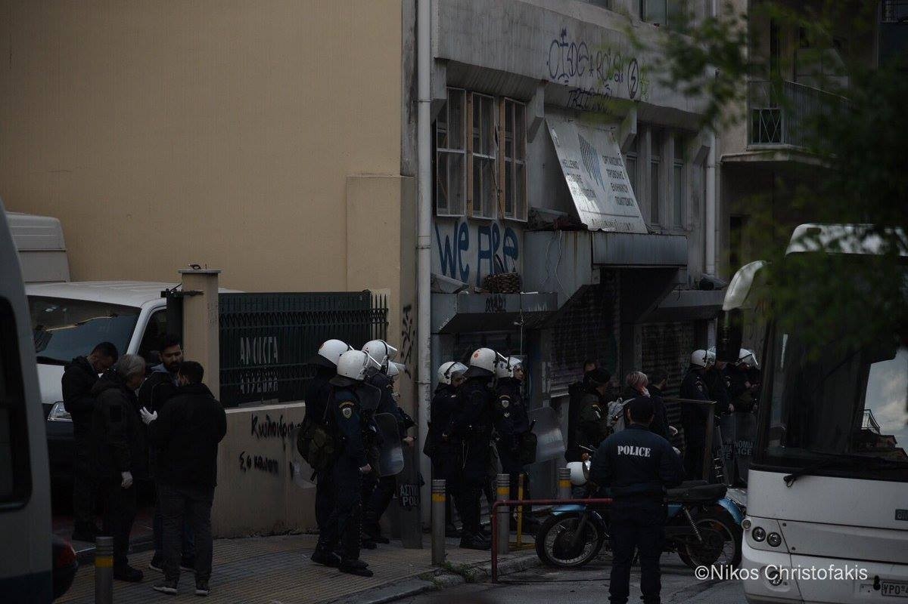
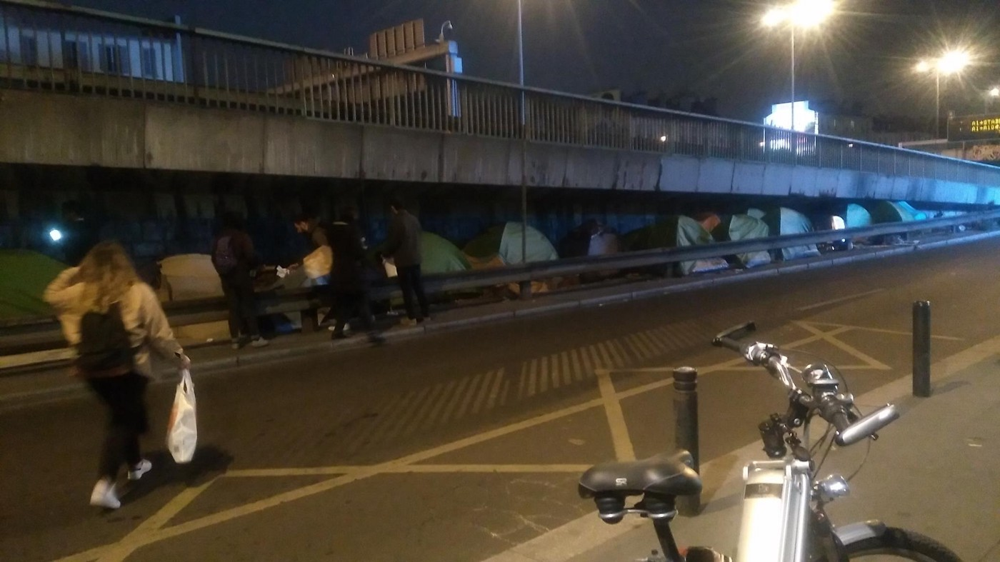

### AYS Daily Digest 17/4/19 German deportation bill to possibly imprison more asylum seekers

_Frontex gains more power // Volunteers needed in France // People still trapped in Libyan detention centers among fighting // Donations needed in Serbia // and more…_

](assets/48d8dfbbb572/1*uAv7tgqvMbKuwJFi5qFd4g.jpeg)

Squat in Sid, Serbia\. No Name Kitchen group, which is helping to people stack in this border city, is in need of clothes for distribution “we try to give decent clothes, that you like and with which you feel at ease\. We do not share the vision that anything goes, because we want to cover a basic need without the loss of dignity on the way\.” Photo by [No Name Kitchen](https://www.facebook.com/NoNameKitchenBelgrade/photos/a.312076942523930/702868060111481/?type=3&theater)
### Feature

On Wednesday, the German Cabinet passed a deportation draft bill designed to speed up the deportation of asylum seekers\. [Supporters](https://www.infomigrants.net/en/post/16378/changes-to-deportation-better-integration-german-cabinet-decides-on-new-draft-of-migration-law?fbclid=IwAR32971fJgZjzkA4svdndgRzgPYWvFgMjrA0cmeAfdy3AUHhRUGWqTNwQV0) of the bill state this will help people who are able to receive asylum gain more access to integration\. Yet the enormous response from critics suggests that more asylum seekers will end up in prison and that the bill contravenes European law\.

■■■■■■■■■■■■■■ 
> **[ECRE](https://twitter.com/ecre) @ Twitter Says:** 

> > Today Germany is likely to pass a law that restricts the rights of asylum seekers and is meant to facilitate deportations  - Pro Asyl's Günter Burkhardt says "There is no justification for such far-reaching interventions" 

> **Tweeted at [2019-04-17 08:03:57](https://twitter.com/ecre/status/1118424845317017600).** 

■■■■■■■■■■■■■■ 

If an asylum seeker’s application is unsuccessful, they could be placed in regular German prisons alongside convicted criminals\. Find out more [here](https://www.politico.eu/article/german-asylum-seekers-deportation-prison/?fbclid=IwAR3lkuMRorZ3-8Ou_EA6bXWMuqvTeCFT8E_ecoFbziX6IMPIp-G1oxEVr2w) \.
### Libya

[UNHCR](https://twitter.com/UNHCRLibya/status/1118569688160702465) is continuing to try and move people from detention centers engulfed in the fighting in Libya\. they are urging for solutions for “all trapped and detained refugees in Libya\.” They say that the most vulnerable need to be transferred out of the country, but really no one should be trapped in Libya in the first place\.

■■■■■■■■■■■■■■ 
> **[UNHCR Libya](https://twitter.com/UNHCRLibya) @ Twitter Says:** 

> > Today we relocated 179 refugees from Abu Salim detention centre, in the middle of crossfire, to safety at our Gathering and Departure Facility in central Tripoli. 
Those relocated today are among those most vulnerable and include women and children. https://t.co/5MG8L4O26I 

> **Tweeted at [2019-04-17 17:39:28](https://twitter.com/unhcrlibya/status/1118569681919664129).** 

■■■■■■■■■■■■■■ 

### Greece

Sad news today from Refugee Rescue, rest in peace Roya\.

[![https://www\.facebook\.com/RefugeeRescueUK/posts/2170628753004563?\_\_xts\_\_\[0\]=68\.ARC3ZcfrGsfIIsGF3Cr3ynHUBwQDeOQQx76pcG5vHFXhmxTArI75pBNvmg2QpA7X\-v3mBlf\_dNTgFhiMNRjNBg0zv2WEZYkbGAI45r2nSu\_fXaoC8EIY0Rf9nGPzdVw06PByiZ8LTqQZxp0sLZGh7bvf5yxEd39b4Te4RUyyzDXJyIKsQuiKc0PTHuMRplRdzGQeQvBEaH8y4k5QmA5x25DOp2Siy5D4ekZ5qBIklNh0JYg0j\-gX52dAIjtIs9\_kuBxzOMkrOwtnrF6eV0LwU17scKSIndR0hGrNx5f3cgUAJf52dnWOQKyu1d2Vgx5DacCKAPxJkvfwkPRoIk9WlWk0k0ju]( "https://www\.facebook\.com/RefugeeRescueUK/posts/2170628753004563?\_\_xts\_\_\[0\]=68\.ARC3ZcfrGsfIIsGF3Cr3ynHUBwQDeOQQx76pcG5vHFXhmxTArI75pBNvmg2QpA7X\-v3mBlf\_dNTgFhiMNRjNBg0zv2WEZYkbGAI45r2nSu\_fXaoC8EIY0Rf9nGPzdVw06PByiZ8LTqQZxp0sLZGh7bvf5yxEd39b4Te4RUyyzDXJyIKsQuiKc0PTHuMRplRdzGQeQvBEaH8y4k5QmA5x25DOp2Siy5D4ekZ5qBIklNh0JYg0j\-gX52dAIjtIs9\_kuBxzOMkrOwtnrF6eV0LwU17scKSIndR0hGrNx5f3cgUAJf52dnWOQKyu1d2Vgx5DacCKAPxJkvfwkPRoIk9WlWk0k0ju")](https://www.facebook.com/RefugeeRescueUK/posts/2170628753004563?__xts__[0]=68.ARC3ZcfrGsfIIsGF3Cr3ynHUBwQDeOQQx76pcG5vHFXhmxTArI75pBNvmg2QpA7X-v3mBlf_dNTgFhiMNRjNBg0zv2WEZYkbGAI45r2nSu_fXaoC8EIY0Rf9nGPzdVw06PByiZ8LTqQZxp0sLZGh7bvf5yxEd39b4Te4RUyyzDXJyIKsQuiKc0PTHuMRplRdzGQeQvBEaH8y4k5QmA5x25DOp2Siy5D4ekZ5qBIklNh0JYg0j-gX52dAIjtIs9_kuBxzOMkrOwtnrF6eV0LwU17scKSIndR0hGrNx5f3cgUAJf52dnWOQKyu1d2Vgx5DacCKAPxJkvfwkPRoIk9WlWk0k0ju)

In an update about Athens, the Skaramangas refugee camp is currently housing 2,624 people, including 300 people who must live in tents outside\. Many people living here are transfers from the islands\. There are about 400 children living in the camp’s squalid conditions as well\. Learn more [here\.](http://www.ekathimerini.com/239576/article/ekathimerini/community/struggle-for-survival-at-skaramangas-refugee-camp?fbclid=IwAR0WSMjfh_lUVZ7QzCbBVT-tKEFN6Wg71QA1Fy_aVVhTLssLOLsZFtyv7Cs)

Additionally, the police continues with squat evictions in Exarchia\. On Thursday early morning, around 6am, two buldings were forcefully evicted\. One of them Clandestina refugee squat with over 70 people inside\. Apparently, some people were arrested\. We will try to have more in tomorrow digest\.

Eviction in Exarchia\. By No Borders Athens

[Melting Pot Europe](https://www.facebook.com/meltingpoteuropa/photos/a.165487516816317/2389285244436522/?type=3&theater) is reporting that the Open Arms:

> “Will be able to leave the port of Barcelona to deliver humanitarian aid to the Greek islands of Lesvos and Samos , but will not be able to reach the Sar Libyan area to continue its missions\.” 

There will be an Estia\-evictions\-resistance open assembly on Thursday 18 April at 6:00 p\.m\. Find out more [here\.](https://twitter.com/Refugees_Gr/status/1118570312805830656?fbclid=IwAR2aUbN8pxIOB2JJ0KR7lhtb1Mk1TlYjG8QQH91sV3DSgHLQBJRr5H6dpS0)
### Serbia

Info Park’s belgrade sources claim that Hungarian authorities prevented 36 people from continuing their trip through the country returning them to Serbia on Wednesday\.

Meanwhile, daily Info park newsletter informs, a joint session between Serbian and Hungarian government was held in Subotica, northern Serbia, on Monday\. During this session, Hungarian Prime Minister Viktor Orbán said that Serbia and his country have jointly “succeeded in stemming illegal migration across the Balkans,” and that Serbian acceptance of the fence Hungary built along the common border had been a “magnificent gesture”\.
### Bulgaria

Bulgaria is tightening their security at their southern border\. They are trying to stop “fake news” that is “encouraging hope” for people wanting to cross\. Learn more [here](https://www.infomigrants.net/en/post/16209/bulgaria-tightens-security-at-southern-border?fbclid=IwAR1M0lTnooTL-G9cy2VQMGzqSoZGhIDg4QQf9WDH26zo74Q-xQNQ29HWjE0) \.
### Belgium

[La Voix Des Sans Papiers Bruxelles](https://www.facebook.com/voixsp1/photos/a.1214771498606077/2184778208272063/?type=3&theater) says the VSP is having to move for housing once again and over the past year they have been made to move 13 times\. “Among us, there are men, women, children, families\.” To find out more about their next occupation, follow the above link\.
### France

On the edge of Nantes, there is a migrant squat located in an abandoned sports hall, housing 250–300 people living in dire conditions\. There is no administrative help and the conditions are only getting worse\. Find out more [here](https://www.infomigrants.net/en/post/16267/life-in-a-migrant-squat-on-the-edge-of-nantes?fbclid=IwAR0WSMjfh_lUVZ7QzCbBVT-tKEFN6Wg71QA1Fy_aVVhTLssLOLsZFtyv7Cs) \.

_There are several organizations in Paris that NEED volunteers\! \! If anyone is currently in the city or knows someone in Paris who can help, please spread the information about the following organizations ↓ below\._

Vestiaire pour les migrants in Paris is in urgent need of medical supplies for scrabies\.

> “We need: Stromectol, flammazine, xyzall, Ascabiol, Ascaflash, dexeryl, a\-by, spregal\.” 

Please check out their pharmacy order [here](https://www.facebook.com/vestiairemigrants/photos/a.828628517317002/1123854601127724/?type=3&theater) \.

[Utopia 56 Paris and Ile\-de\-France](https://www.facebook.com/U56ParisIDF/photos/a.1952115035087947/2081885725444210/?type=3&theater) really needs volunteers to help them with their accommodations for shelter\. Find out more here\.

](assets/48d8dfbbb572/1*X4aySwEvm31zUPIEataLWA.jpeg)

“Skills necessary? None, just know how to take the subway, the tram or the bus\. Small bonus: have a driver’s license to drive the vehicle of the association\. Double bonus: have your own car\!” Photo by [Utopia 56 Paris](https://www.facebook.com/U56ParisIDF/photos/a.1952115035087947/2081885725444210/?type=3&theater)

[L’Autre Cantine Nantes](https://www.facebook.com/lautrecantinenantes/photos/a.250613212194492/391458111443334/?type=3&theater&ifg=1) needs volunteers to help with their food delivery service\. Check them out\.

[Solidarité migrants Wilson](https://www.facebook.com/598228360377940/photos/a.617437478457028/1117413771792727/?type=3&theater) needs volunteers for their breakfast services\.

> “The number of people trying to find a precarious refuge on Wilson Avenue in Saint\-Denis has increased…\(some\) have not eaten in two days…” 

](assets/48d8dfbbb572/1*PKjsV38rRQNN8YJC3TJbRQ.jpeg)

“the hunt of the \#police from Paris to prevent tent relocations have dispersed everyone\. And Force people to seek refuge in places more and more improbable, remote, invisible… and dangerous\!” Photos by [Solidarité migrants Wilson](https://www.facebook.com/Solidarit%C3%A9-migrants-Wilson-598228360377940/?__tn__=kC-R&eid=ARBin6WBDaNJu-HVlOVYPs-wNrx8cuEnV2719F7fopWp0hP3r9R-ecwONUuIB0kdbMTulOR0vaEP7uMJ&hc_ref=ARRvOLnugk_tKTmqNIYw2LSDD0bbw4VeCLKtoCODxNUk7Mrisu2IvTZZWPm9m5XdKNo&fref=nf&__xts__%5B0%5D=68.ARAfWVf8AFAtFmqAUgtDwIuP9jYCFW-DHrz-1WvkasJaTa00Vdw5cfN9RPOxMqTsYQibPxiBUbP4cKygoHjSfi95jwNGu5KO03HYthYwp1hsX6_GVoSfV0EHIkgZzAbViScAx0H_zbcTCz8lFESo_4canRzkSZ1lPjpnSMKilZw6o-Eak8_mYfF3Ws2RpDgoBPg0wuh4-jmBIwjt_QODGAys_93srNsKQlr0MlsBIqkPLyPJR53hy9VXoXLgVy7DETxQun4Rj8H0lGNYuhv6pylixvIkK9b_mjOJxmIp9iOxxPvVQQy94tevHIYFqrksl74grQ65xVo3bnHMy8vTpIsoVw)
### EU

The European Agency for Border and Coast Guard \(EBCG\), aka Frontex, is only getting more powerful ahead of the upcoming EU Parliamentary elections\. In [an interview with Matthias Monroy](https://digit.site36.net/) , an activist specializing in EU police forces, he stated:

> “First of all, there is the establishment of a force of 10,000 troops to prevent border crossings at the external borders or to carry out deportations\. This is something completely new, because so far the Border Agency has only had civilian staff\.” 

The focus of Frontex is still on North Africa, and they have even started **flying planes FOR the Libyan Coast Guard** \. One must only go back to the top of this digest to know why trapping people in Libya, especially given the past few weeks, is despicable\.

**Apart from daily news in English, we also publish weekly summaries in Arabic and Persian\. Find specials in both languages on our medium site\.**

**If you think you could contribute to the work of our info team, write us\.**

**We strive to echo correct news from the ground through collaboration and fairness\. Every effort has been made to credit organizations and individuals with regard to the supply of information, video, and photo material \(in cases where the source wanted to be accredited\) \. Please notify us regarding corrections\.**

**If there’s anything you want to share or comment, contact us through Facebook, Twitter or write to: areyousyrious@gmail\.com\.**

_Converted [Medium Post](https://medium.com/are-you-syrious/ays-daily-digest-17-4-19-german-deportation-bill-to-possibly-imprison-more-asylum-seekers-48d8dfbbb572) by [ZMediumToMarkdown](https://github.com/ZhgChgLi/ZMediumToMarkdown)._
