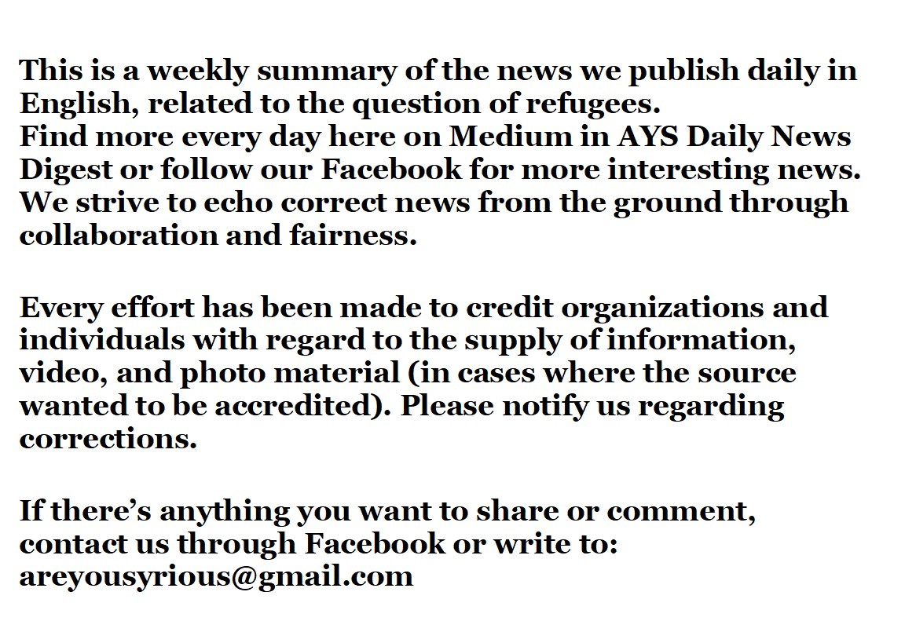

### **افزایش تعداد بازگشت‌های دوبلین**
#### AYS Weekly News Summary in Persian, April 8–14

](../assets/3bda1db922a3/1*IZpaEdYhXIz923I2KApgsA.jpeg)

[**OzMa13‏**](https://twitter.com/OzMa13)

به گزارش اروپا ، آلمان با حدود 55,000 درخواست ، اکثر رویه‌های دوبلین را در سال ۲۰۱۸ به دست آورد \. این ارقام حاکی از آن است که نزدیک به یک نفر از سه پناه‌جو در آلمان و فرانسه تابع یک عمل دوبلین هستند \. در همین زمان ، فرانسه ، ایتالیا، کرواسی ، قبرس ، مالت و لهستان از جمله کشورهایی بودند که استفاده از روند دوبلین را در سال ۲۰۱۸ افزایش دادند \. در بیشتر کشورها این تعداد از سال ۲۰۱۷ کم‌تر بود

> لطفا ً به خاطر داشته باشید که به خاطر بارش زیاد باران در روزهای گذشته ، رودخانه‌ها در مناطق مرزی بسیار بیشتر از همیشه بالاتر هستند و برای هر کسی که بخواهد از آن‌ها عبور کند خطر دارد\. ما اطلاعاتی از حوادث احتمالی در منطقه مرزی کرواسی دریافت کرده‌ایم ، پس لطفا ً هشدار را پخش کرده و مراقب خودتان باشید 

### **لیبی**

با بروز درگیری‌های جدید در لیبی ، مردم در حال فرار و بازداشت شدگان در وسط درگیری گرفتار شده‌اند \. روزنامه‌نگار سالی هایدن در حدود ۶۰۰ نفر را در بازداشتگاه قصر القصر به دلیل نیاز فوری به کمک دریافت کرده‌است چون آن‌ها فاقد غذا و آب هستند

به دلیل این وضعیت ناامن ، ام\.اس\.اف درخواست خود برای تخلیه افراد به‌دام‌افتاده در کشور را تجدید کرد و مردم را به هم‌کاری با گارد ساحلی به اصطلاح گارد ساحلی اعزام نکرد \. طبق گزارش سازمان بین‌المللی مهاجرت ، بیش از 2,800 نفر از آغاز درگیری در طرابلس آواره شده‌اند و بیش از 1,300 نفر از مردم در بازداشتگاه نزدیک این درگیری‌ها در خطر هستند

■■■■■■■■■■■■■■ 
> **[Sally Hayden](https://twitter.com/sallyhayd) @ Twitter Says:** 

> > Here's a recording a refugee in Qasr bin Ghashir detention centre just sent me calling for help. Roughly 600 men, women (including pregnant women) &amp; children are without food &amp; water, trapped in the middle of a conflict zone. [soundcloud.com/user-60656923/…](https://soundcloud.com/user-60656923/080419-qasr-bin-ghashir) 

> **Tweeted at [2019-04-08 15:47:45](https://twitter.com/sallyhayd/status/1115280074524319744).** 

■■■■■■■■■■■■■■ 

### **ترکیه**
#### ۹۵۰ نفر در ادرینه دستگیر شدند

رسانه‌های محلی گزارش داده‌اند که ۹۵۰ نفر در این حرکت که اغلب آن‌ها از افغانستان و ایران بوده‌اند ، در ادرینه دستگیر شده‌اند \. به موازات “ کاروان امید “ که مدعی بود یونان مرز خود را به مقدونیه باز خواهد کرد ، آن‌ها اخبار منتشر شده از طریق گروه‌های اینترنتی را دنبال کرده و ادعا کردند که ترکیه مرز خود را به یونان باز خواهد کرد

با دیدن این که اقدامات پیشگیرانه در بزرگراه‌ها صورت‌گرفته است ، بسیاری تصمیم گرفتند که با راه‌آهن سفر کنند \. افراد دستگیر شده در ایستگاه قطار ادرینه در شب گذشته شامل ۴۰ کودک بودند
#### قایق‌های بیشتری به ترکیه بازگشتند

در شب جمعه نگهبان ساحلی ترکیه ۱۶ نفر را از دریا نجات داد \( ۱۰ کودک ، ۲ زن و ۴ مرد \) \. اکثر آن‌ها جلیقه‌های نجات پوشیده بودند و این همراه با حلقه‌های لاستیکی بود که به احتمال زیاد جانشان را نجات دادند \. شرایط کسانی که به بیمارستان برده شده اند نامعلوم است \. قایق به طرف جنوب در حرکت بوده است

صبح چند روز گذشته ، در ۰۸\.۰۰ ، قایق توسط ت\.س\.ج در خارج از دمیرسیلی ترکیه متوقف شد \. این قایق حامل ۶۰ نفر، ۱۴ کودک ، ۲۸ زن و ۱۸ مرد بود که عازم ساموس بودند \. همه ی آنها دستگیر شدند
### **دریا**
#### کمک کردن آگاهانه به پریشانی و اضطراب

قایقی که ۲۰ سرنشین دارد در نزدیکی مرز لیبی — تونس در حال حرکت است \. مقامات در تونس ، والتا & رم مطلع هستند اما به اندازه کافی واکنش نشان نمی‌دهند

این کمک‌ نیست \! در ساعت 05\.6 صبح به وقت گرینویچ ، هواپیمای س\.ا\.ر ما قادر به بومی‌سازی یک پرونده فلاکت باری بود که قبلا ً توسط سازمان م\.د — گزارش شده‌بود و یک رله را جرقه زد \. بیش از ۲۰ نفر در حال حاضر در فلاکت حاد هستند ، هشت نفر هم اکنون غرق شده‌اند

هیچ‌کس تا چند ساعت، مسئولیت این کار را بر عهده نگرفته بود \. هر چند که دو کشتی وروون در آن نزدیکی هستند ، اما به آن‌ها کمک نکرده اند \. تریتون و ووس باید فورا ً برای پاسخ به پریشانیه در حال پیشرفت هدایت شود — سی\.ب\.ر — و ماموریت مستندسازی در ساحل لیبی ظرف چند روز شروع خواهد شد و آن‌ها هنوز به دنبال یک روزنامه‌نگار / زن / مرد برای پیوستن به خدمه هستند

این بسیار حائز اهمیت است که بتوانیم از عبارات معتبر در مورد دولت گزارش کنیم
### **یونان**
#### **کاروان امید** ، به پایان رسیده‌است

پس از دو روز کاروان امید به پایان رسید\. اکثر افرادی که در منطقه دیاواتا گرد آمده بودند به محل اقامت خود بازگشته و یا این کار را انجام می‌دهند

وزارت مهاجرت بیانیه‌ای را منتشر کرد و به آن‌ها اطمینان داد که بدون نتیجه هیچ‌کس قادر به بازگشت به محل اقامت خود نخواهد بود ، هیچ‌کس هویت یا تبعید خود را از دست نخواهد داد ، هیچ‌کس خانه یا حمایت مالی خود را از دست نخواهد داد و حمل و نقل نیز برای برخی مقاصد فراهم شده‌است

گزارش‌های دیگر هشدار می‌دهند که پلیس از بازگشت مردم به آتن خودداری می‌کند \.

دیدگاه‌های افراد و سازمان‌هایی که به مردم قبل از پیوستن به این جنبش هشدار می‌دهند ، باید توجه خود را بر محکوم کردن خشونت سیستماتیک علیه مردمی که سعی می‌کنند حق خود را به آزادی حرکت در یک قلمرو اعمال کنند ، معطوف کنیم

در دیاواتا ، نیروهای ویژه پلیس یونان از گلوله‌های پلاستیکی ، گاز اشک‌آور و نارنجک دستی علیه صدها تن از مردم استفاده کرده‌اند \. گزارش‌ها حاکی از کتک زدن شایع است و روزنامه نگارانی که این وضعیت را پوشش می‌دهند نیز مورد هدف قرار گرفته‌اند

اطلاعات پناهنده از چگونگی دریافت حمایت مالی از دولت در صورت اعلام مالیات شما ، پشتیبانی می‌کند \. اطلاعات بیشتری در اینجا [پیدا کنید](https://www.facebook.com/refugee.info/posts/2220852227974912?hc_location=ufi)
#### **به‌ روزرسانیه سیستم اخراج آتن**

آرش همپی، گزارش داده‌است که از زمان اخراج از نیو\.ببیلان جدید و فلکه آزادی حدود ۸۰ نفر خانواده در پاسگاه پلیس نگهداری می‌شوند ، در حالی که سایرین به اردوگاه‌ها فرستاده شده‌اند و اجازه خروج ندارند \. اموال این افراد در خانه‌های قدیمی خود باقی می‌مانند و درها مهر و موم شده‌اند \. پلیس گفت که تلاش‌ها در ورود مجدد توسط پلیس پیش‌گیری شده‌است

این اخراج افراد بسیاری را بی‌خانمان کرده‌است ؛ برای حمایت از آن‌ها لطفا ً به اینجا بروید
### **صربستان**

یو\.ان در مارس ۲۰۱۹ مورد به روز رسانی صربیا اعلام کرد :

براساس گزارش کمیساریای عالی پناهندگان سازمان ملل متحد ، دفتر پناهندگیه وزارت داخله در طی ماه مارس، ۱۵ درخواست پناهندگی صادر کرده‌است که این امر موجب حفاظت از ۱۱ کشور و رد ۴ مورد شده‌است

تا کنون تنها ۲۵ نفر در این کشور در حاشیه مرز اتحادیه اروپا پناهنده شده‌اند و میزبان هزاران نفر دیگر هستند که به دنبال پناه‌گاه می‌گردند
### **بوسنی**

دولت بیشتر بازرسان پلیس را در ایستگاه اتوبوس و ایستگاه راه‌آهن در سارایوو و توزلا به دلیل افزایش تعداد افرادی که وارد می‌شوند اعلام کرد

او گفت : “ ما از هر مهاجر اطلاعات بیومتریک می‌گیریم \. ما به کسانی که ثبت‌نام نکرده اند اجازه نخواهیم داد که در سراسر بیهاچ راه بروند \. امشب ما وارد عمل می‌شویم و مردم ما بر روی زمین خواهند بود

با این حال ، مشخص نیست که این کار چگونه انجام خواهد شد \. علاوه بر آن، افرادی که در حال انتقال به مردم در حال حرکت به کشور هستند ، می‌گویند که به ندرت کسی در ورود به کشور ثبت‌نام نکرده است \. ثبت نام به مردم اجازه می‌دهد تا در یک سیستم حمل و نقل عمومی جابه جا شوند یا در هتل‌ها اقامت کنند \. با این حال ، دولت بوسنی به مدت چندین ماه بر این ادعا پافشاری می‌کند که آن‌ها هویت افرادی که در حال آمدن هستند را نمی‌دانند و این که آن‌ها ثبت‌نشده اند \. در عین حال ، آن‌ها در حال انتشار ارقام هستند که نشان می‌دهند چند نفر در آن ثبت‌نام کرده‌اند

این رویکرد بخشی از ارعاب و ترس است که از سوی دولت می‌آید و رسانه‌ها از طرف احزاب سیاسی مورد انتقاد قرار می‌گیرند

در عین حال ، آن‌ها در مورد افزایش جرم مرتبط با مردم در حرکت صحبت می‌کنند \. یک منبع مستقل ، ال\.ز\.ب ولیکا کلادوشا یک مدرک از این تاکتیک ها را ارایه می‌دهد که متاسفانه در حال انجام هستند

ساکنان بیهاچ و ولیکا کلادوشا اغلب شکایت دارند که امنیت جوامع آن‌ها به دلیل بحران مهاجران نقض شده‌است \. با این حال آمار رسمی جنایت نشان می‌دهد که:

ولیکا کلادوشا در وبلاگ خود به نقل از پناهندگان می‌گوید : تعداد جرائم ثبت ‌شده در این مکان‌ها در سال ۲۰۱۸ تقریبا ً برابر با سال ۲۰۱۷ است که مهاجران در آن منطقه حضور نداشتند

یک نفر ، یک پسر جوان از لیبی ، زیر یک اتوبوس در شرایط بحرانی پیدا شد \. ظاهرا ً، در سارایوو، او با پلاک ایتالیا، اتوبوس را دید و فرض کرد که می‌تواند به ایتالیا برسد\. در عوض ، او در شرق بوسنی ، شهر سربرنیتسا ، جایی که گروهی از گردشگران ایتالیایی به آنجا می‌رفتند ، سر در آورد\. او در وضعیت بحرانی پیدا شد و به بیمارستان محلی برده شد\. اطلاعات بیشتری در اینجا پیدا کنید
### **کرواسی**
#### کاهش فضا برای نظارت مستقل

از آنجا که گروه‌های جامعه مدنی انتقاد خود از سیاست‌های مرزی کرواسی را افزایش داده‌اند ، مقامات دسترسی به بازداشت و مراکز پذیرش را محدود کرده‌اند \. مردم حتی قبل از اینکه اسناد خود را دریافت کنند ، بازداشت می‌شوند \.

کودکانی که بیش از ۱۴ سال سن دارند ، اغلب در موسسات مراقبت عمومی نوجوانان قرار می‌گیرند که بنا بر گزارش‌ها ، با خصومت از کودکان دیگر مواجه می‌شوند \.

هیچ قانونی برای حمایت از شهروندانی که از بازداشت مجدد آزاد شده‌اند وجود ندارد \.

اینها تنها برخی از نکاتی هستند که ما برای مدتی طولانی در مورد توصیه‌های کمیسیون اروپا پس از گزارش سال ۲۰۱۸ گزارش کرده‌ایم و در گزارش اخیر گزارش پروژه بازداشت جهانی مورد تاکید قرار گرفته ‌اند
### **ایتالیا**
#### مسافران

دیروز گارد ساحلی ایتالیا یک قایق با ۷۰ سرنشین را در نزدیکیه لمپدوسا نجات داد \. همانطور که بسیاری از منابع گزارش دادند ، ۱۷ لیبیایی در هواپیما بودند و از درگیری فرار می‌کردند \. حالا همه آن‌ها در کانون اصلی جزیره هستند \.
#### به روز رسانی از شمال شرقی

رسانه‌های محلی گزارش دادند که در روز پنج شنبه مقامات ایتالیایی چند گروه کوچک از مردمی که به نظر می‌رسید از مرز اسلوونی عبور کرده‌اند را متوقف کردند \. آن‌ها در جنگل در دره رزاندرا پیدا شدند\. مجموعا ً ۸۰ نفر، همه مردان , با ۷ نوجوان به اداره پلیس مرزی و پلیس مرزی آورده شده‌اند\. به نظر می‌رسد که این افراد سفر خود را در افغانستان و پاکستان آغاز کرده‌اند

■■■■■■■■■■■■■■ 
> **[Sea-Watch Italy](https://twitter.com/SeaWatchItaly) @ Twitter Says:** 

> > 🔴Concluso a #Lampedusa lo sbarco di 70 persone tra cui 17 libici in fuga dal paese in guerra.

Intanto, al largo di #Malta, rimangono bloccati da oltre 9 giorni i 62 naufraghi a bordo di #AlanKurdi. 
Donne, uomini e bambini di cui l’Unione Europea finge di ignorare l’esistenza. https://t.co/FmEZ84wIfr 

> **Tweeted at [2019-04-11 19:58:18](https://twitter.com/seawatchitaly/status/1116430292795953152).** 

■■■■■■■■■■■■■■ 

مجموعه ‌ای از ابتکارها برای چند روز بعد در اعتراض به بازگشایی مجدد CPR مرکز بازداشت درون ساختاری که میزبان در کارا در ایسونزو “ در همبستگی با مردمه در حرکت و کسانی که در همبستگی با سرکوب دولتی ایستاده‌اند , سازماندهی شده‌است

جمعه دوازدهم آوریل ، یک رویداد جمع‌آوری کمک‌های مالی در ۱۸\.۳۰ ، مرکز هرج و مرج در تریست برگزار خواهد شد ،از طریق بوسکو ۵۲، در حمایت از مردمی که اخیرا ً در تورین و ترنتو برای اقدامات خود علیه CPRs دستگیر شده‌اند

شنبه سیزدهم، پریما نخستین راهپیمایی مردم در تریست برگزار خواهد شد\. این نمایش توسط تعدادی از سازمان‌های محلی سازماندهی شده‌است و در لارگو باریرا در ۱۵\.۳۰آغاز خواهد شد

در روز یکشنبه در ۱۶\.۰۰، گروهی از CPR بدون تنفس مصنوعی ، تظاهراتی را در مقابل ساختاری که میزبان احیای قلبی ریوی خواهد بود سازماندهی کردند

منطقه ی گ، برای افرادی است که به وسیله شورای محلی در شمال ایتالیا معرفی شدند

شهر کالوزیوکرته یک شهر کوچک در نزدیکی میلان است که توسط شهردار لگا اداره می‌شود

در طی وحشت اخلاقی که از سیاست‌های دولت گذشته بر علیه مردم در حرکت در کشور آغاز شد ، شورای محلی طرح ادغام ، جدیدی را با انتخاب ۹ منطقه از شهر ،مدارس ، ایستگاه قطار ، کتابخانه و مراکز اجتماعات کلیسایی معرفی کرد که در آن مردم در این حرکت مجاز به اقامت نیستند\. مراکز پذیرش یا هر برنامه مهمان‌نوازی باید

حداقل ۱۵۰ متر دورتر از، مناطق حساس ساخته شوند\. علاوه بر این ، پنج حوزه دیگر انتخاب شده‌اند که برای آن‌ها یک مجوز ویژه مورد نیاز است

کالوزیوکرته با جمعیتی در حدود ۱۳۰۰۰ نفر در حال حاضر ۳۰ پناهنده را به خود اختصاص داده‌ است
### **پاریس**

به نقل از مهاجران سولیداریته ویلسون گزارش داد که ۱۰ اتومبیل پلیس در پورت دو لا شاپل و چهار خودرو در پورته ، آبرویلرز، وجود دارند \. این اخراج در صبح زود بدون توجه قبلی به افراد اخراج شده ، یا تعاونی‌های و سازمان‌هایی که به آن‌ها کمک می‌کنند انجام شد \. مشخص نیست که آن‌ها را کجا برده شده‌اند ، اگرچه یک شهروند گزارش داده‌است که یک باشگاه ورزشی در باگنوکس درخواست شده‌است ، بنابراین به احتمال زیاد برای “ مرتب‌سازی “ به اینجا آورده شده‌اند

این اردوگاه در بخش پاریس بیش از همه قابل‌مشاهده است \. دیگران معمولا ً در حومه پاریس و یا در حاشیه پاریس محبوس می‌شوند، از نظر دور ، خارج از دید …

پس از این اخراج شهروندان برای ذخیره و تمیز کردن چادرها ، کیسه‌خواب و پتوها که مردم مجبور به ترک آن بودند ، آمدند \. با وجود تخلیه مداوم و تخلیه تخلیه، تعداد افراد حاضر به رشد خود ادامه می‌دهد و شهروندان پاریس همچنان در همبستگی با آن‌ها ادامه می‌دهند

**اخبار بیشتری به انگلیسی در صفحه رسانه ما در دسترس است \. در مواردی که شما سوالاتی دارید و یا مایلید برخی اطلاعات مربوط به روند پناهندگی شما یا کشور مورد نظر را منتشر کنید , لطفا ً برای نوشتن پیغام روی فیس بوک یا نوشتن یک ایمیل به آر\.یو\.س تردید نکنید**

[**areyousyrious@gmail\.com**](mailto:areyousyrious@gmail.com)

_Converted [Medium Post](https://medium.com/are-you-syrious/%D8%A7%D9%81%D8%B2%D8%A7%DB%8C%D8%B4-%D8%AA%D8%B9%D8%AF%D8%A7%D8%AF-%D8%A8%D8%A7%D8%B2%DA%AF%D8%B4%D8%AA-%D9%87%D8%A7%DB%8C-%D8%AF%D9%88%D8%A8%D9%84%DB%8C%D9%86-3bda1db922a3) by [ZMediumToMarkdown](https://github.com/ZhgChgLi/ZMediumToMarkdown)._
