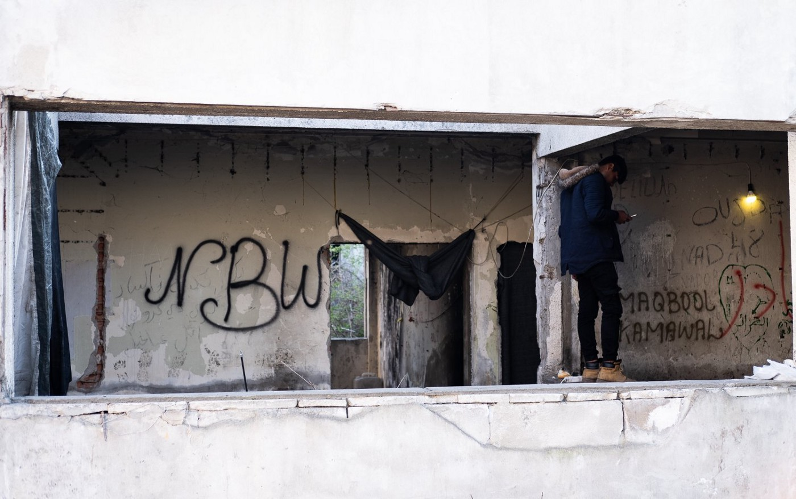

### بعد قافلة الأمل
#### AYS Weekly News Summary in Arabic, April 1–7

![نحن نتفهم أن قافلة الأمل هي دعوة وهمية لوسائل التواصل الاجتماعي للاجئين وطالبي اللجوء للالتقاء في مخيم ديفاتا للاجئين ، بالقرب من سالونيك ، والسير معًا إلى الحدود اليونانية المقدونية الشمالية بسبب شائعات بأنها فتحت ؛ توفير بوابة قانونية لمواصلة الرحلات إلى أوروبا الغربية\. وهذا يعني أن الآلاف من الناس وصلوا إلى الحدود ، وقد اجتذب بالطبع الكثير من الاهتمام من الشرطة التي تطلق الغاز المسيل للدموع\. لكن هذه الحدود لم تفتح ، مما يجعل هذه الرحلة خطيرة جدًا بالنسبة لهؤلاء الأشخاص المستضعفين ، وخاصة الأطفال أو كبار السن\. أصدرت مفوضية الأمم المتحدة لشؤون اللاجئين والمنظمة الدولية للهجرة وشركاؤها بيانًا مشتركًا [https://help\.unhcr\.org/greece/](https://help.unhcr.org/greece/?fbclid=IwAR1vAGm1A3OEPZT3jBt3JX5te1hCvUCUjrdBxdwb0-CzuQUk8INx9o8oM0w) \. ومع ذلك ، فقد تعلمنا من المنظمات والمتطوعين في اليونان أن الأشخاص من جميع الجنسيات — أفغانستان وإيران والدول الإفريقية والعربية — يأتون على أي حال\. إنهم سيصلون من جميع أنحاء اليونان إلى معسكر خارج ديافاتا قبل الانتقال إلى الحدود\. المتطوعون خائفون بشكل طبيعي على سلامة الجميع ومستقبلهم\. بينما نؤمن بحرية الحركة والحق في الاختيار ، نحن نعرف أن الحدود ليست مفتوحة ونتذكر ما حدث من قبل …
“في مخيم Idomeni ، قامت الشرطة بضرب الناس واستخدمت الغاز المسيل للدموع ، وتوفي عدد قليل من الأشخاص أثناء محاولتهم عبور النهر\. ”“إذا تم إلقاء القبض على الأشخاص ، فيمكن إلغاء حق اللجوء في اليونان”\. نأسف جدًا لأن قافلة الأمل ليس أملآ حقيقيآ للناس\. يرجى البقاء في أمان\. يرجى توخي الحذر ، ونحن نشعر بالخجل الشديد من أوروبا لدرجة أن هذا هو ما يحدث عند محاولة السفر\. من الخطأ جدًا عدم قدرتك على السفر — لكن كن حذرًا وكن مدركآ لمدى خطورة ذلك الآن\.](assets/dd25d5012f02/1*M7Ny_Avl46ZBt6JjenvRQw.jpeg)

نحن نتفهم أن قافلة الأمل هي دعوة وهمية لوسائل التواصل الاجتماعي للاجئين وطالبي اللجوء للالتقاء في مخيم ديفاتا للاجئين ، بالقرب من سالونيك ، والسير معًا إلى الحدود اليونانية المقدونية الشمالية بسبب شائعات بأنها فتحت ؛ توفير بوابة قانونية لمواصلة الرحلات إلى أوروبا الغربية\. وهذا يعني أن الآلاف من الناس وصلوا إلى الحدود ، وقد اجتذب بالطبع الكثير من الاهتمام من الشرطة التي تطلق الغاز المسيل للدموع\. لكن هذه الحدود لم تفتح ، مما يجعل هذه الرحلة خطيرة جدًا بالنسبة لهؤلاء الأشخاص المستضعفين ، وخاصة الأطفال أو كبار السن\. أصدرت مفوضية الأمم المتحدة لشؤون اللاجئين والمنظمة الدولية للهجرة وشركاؤها بيانًا مشتركًا [https://help\.unhcr\.org/greece/](https://help.unhcr.org/greece/?fbclid=IwAR1vAGm1A3OEPZT3jBt3JX5te1hCvUCUjrdBxdwb0-CzuQUk8INx9o8oM0w) \. ومع ذلك ، فقد تعلمنا من المنظمات والمتطوعين في اليونان أن الأشخاص من جميع الجنسيات — أفغانستان وإيران والدول الإفريقية والعربية — يأتون على أي حال\. إنهم سيصلون من جميع أنحاء اليونان إلى معسكر خارج ديافاتا قبل الانتقال إلى الحدود\. المتطوعون خائفون بشكل طبيعي على سلامة الجميع ومستقبلهم\. بينما نؤمن بحرية الحركة والحق في الاختيار ، نحن نعرف أن الحدود ليست مفتوحة ونتذكر ما حدث من قبل …
“في مخيم Idomeni ، قامت الشرطة بضرب الناس واستخدمت الغاز المسيل للدموع ، وتوفي عدد قليل من الأشخاص أثناء محاولتهم عبور النهر\. ”“إذا تم إلقاء القبض على الأشخاص ، فيمكن إلغاء حق اللجوء في اليونان”\. نأسف جدًا لأن قافلة الأمل ليس أملآ حقيقيآ للناس\. يرجى البقاء في أمان\. يرجى توخي الحذر ، ونحن نشعر بالخجل الشديد من أوروبا لدرجة أن هذا هو ما يحدث عند محاولة السفر\. من الخطأ جدًا عدم قدرتك على السفر — لكن كن حذرًا وكن مدركآ لمدى خطورة ذلك الآن\.
### **اديومينه الصغيرة**

في شمال اليونان ، يتم تشكيل ما يسمى ب “قافلة الأمل” بجانب معسكر ديافاتا\. غادر العشرات من الأشخاص المخيمات في اليونان خلال اليومين الماضيين وينامون في الميدان في خيام التخييم الآن\.

مساء الخميس ، بدأت الشرطة في هذه المنطقة تمنع الناس من التحرك نحو ديافاتا\. في صباح يوم الجمعة ، كانت المنطقة بأكملها تحت الإغلاق\. في الوقت الحالي ، كنا ننتهي من هذا الملخص \(صباح الجمعة\) ، لم يُسمح لأي حركة بالدخول إلى معسكر ديافاتا أو الخروج منه\.

يقوم متطوعو فريق معلومات \(ا ر س\) في المنطقة بالإبلاغ عن التواجد الواضح للغاية للشرطة والتوترات الواضحة\.

حاول متطوعون من بيتنا إيصال الطعام للنساء والأطفال ، لكن الشرطة رفضتهم\. أخبر بعض الأشخاص الذين شاركوا في “قافلة الأمل” ، كما يسمونها ، \(ا ر س\) أنه لا يوجد أي سيارة إسعاف في المنطقة ، رغم وجود أشخاص قد يحتاجون إلى المساعدة\.

خلال اليوم ، تم الإبلاغ عن عدة اشتباكات بين المتظاهرين والشرطة ، وكذلك استخدام الغاز المسيل للدموع\.

على ما يبدو ، يوجد أكثر من ١٠٠٠شخص في المنطقة

### **سوريا**

الفيضانات في شمال سوريا

جرفت العواصف مئات الخيام التي استخدمتها العائلات النازحة داخلياً ، حيث تسببت مياه الأمطار في إلحاق أضرار بالسلع القليلة والممتلكات التي كانت بحوزتها ، حسبما ذكرت وسائل الإعلام\.

أعلنت الأمم المتحدة أن أكثر من ٤٠٠٠٠ نازح يعيشون في مخيمات للاجئين بالقرب من الحدود التركية
### **تركيا**

وبحسب ما ورد أوقف قارب خارج ياليكوي ، ديديم ، بواسطة ت س ج \. كان القارب متوجهاً إلى أغاثونيسي ، وكان على متنه ٤١ شخصًا و ١٧ طفلاً وسبع نساء و ١٧رجلاً
### **صربيا**

المجر تنشر ١٥ عرضًا للشرطة بين صربيا ومقدونيا الشمالية ، وفقًا لتقارير ب ٩٢\. وسيتم تجهيزها بمركبات على الطرق الوعرة ومعدات الرؤية الليلية والكاميرات الحرارية\.

No Name Kitchen
### **البوسنة**
#### تقرير آخر عن أعمال العنف في فيليكا كلادوسا من قبل الشرطة المحلية\.

وفقا للتقرير ، تم الاتصال بأربعة أشخاص من قبل الشرطة المحلية في الحديقة في وسط المدينة ، دون سبب واضح\. ألقت الشرطة القبض على الأشخاص الأربعة وأخذتهم إلى مركز الشرطة ، حيث أُمروا بالمواجهة على الحائط\. في تلك اللحظة ، بدأت الشرطة في ضرب الناس\. على ما يبدو ، شارك ١٠ من ضباط الشرطة\.

بالإضافة إلى ذلك ، أخذوا كل الأموال التي وجدواها من أشخاص قاموا بضربها ؛ واحد كان ١٥٠ والآخر ١٠٠ يورو\.

تلقى فريق معلومات \(ا س س \) تقارير مماثلة حول العنف من منطقة دوبوي ، موستار ، بوسوسي ، بيهاتش ، بينما تشير المزيد والمزيد من التقارير إلى تراجع العنف من مدينة غورادي ، بالقرب من سراييفو ، وساجنيي\. بعد التراجع في هذه المنطقة ، يضطر الناس إلى العودة إلى الجبل الأسود
### **كرواتــــــــيا**

تم طرد ما لا يقل عن ٧٠٠٠ شخص من قبل شرطة الحدود الكرواتية من كرواتيا إلى البوسنة وصربيا في انتهاك للقوانين الدولية والأوروبية والوطنية\. كنتيجة ونتيجة مباشرة للعديد من تقارير العديد من المنظمات غير الحكومية والعديد من الأفراد الموجودين على أرض الواقع ، في عمل منسق طال انتظاره ، نشر ٣٠ من أعضاء البرلمان الأوروبي خطابًا يشجبون فيه علنًا عمليات نهب اللاجئين وتجريمهم\. المدافعون عن حقوق الإنسان من خلال الضغط على المنظمات غير الحكومية والناشطين\. توضح الرسالة بوضوح حالة متطوع \(ا ي س\) كمثال ، وتشير إلى التقارير التي ساعدنا في تشكيلها والمضي قدمًا بها ، إلى جانب نشطاء من البوسنة والهرسك ، والمنظمات غير الحكومية مطبخ بلا اسم ، ومنظمة أطباء بلا حدود ، ومنظمة العفو الدولية ، وغيرها\.

### **إيطالـــــــــــــيا**

تُظهر السياسة اليمينية في إيطاليا النتائج أيضًا على المستوى المحلي\. وفقًا لـ ريداتوره ، يؤدي إلغاء الحماية الإنسانية إلى زيادة الطلب على الخدمات ذات العتبات المنخفضة مثل الاستحمام والملابس وتعبئة المواد الغذائية\. ويقال إن ٤٠٠٠ شخص في روما و ٩٠٠ في باليرمو يوميًا\. في ترينتو حفل استقبال جديد مطلوب لفتح\.
### **فرنسا**
#### القصر في فرنسا

> تقييمات مثيرة للجدل ومعاملة غير عادلة كما يحكم المجلس الدستوري لصالح اختبار العظام لتحديد عمر الأشخاص على هذه الخطوة 

على الرغم من الانتقادات الواسعة النطاق في فرنسا وفي المجتمع الدولي ، قرر المجلس الدستوري الفرنسي أن اختبارات العظام لتقييم عمر المهاجرين الشباب ليست غير دستورية\. أثبتت العديد من الدراسات والحالات الحديثة عدم كفاية ومثل هذه الممارسة\.

كان تقرير \(ي س رس \)أن القضية المرفوعة إلى المحكمة تتعلق بأداما س\. ، وهو شاب غيني “أعلن نفسه عمره ١٥عامًا عند وصوله إلى فرنسا في عام ٢٠١٦”\. من خلال اختبار العظام ، خلصت السلطات الفرنسية إلى أنه كان يتراوح عمره بين ٢٠و ٣٠ عامًا\.

قدمت أداما س\. ، بدعم من عدد من المنظمات ، القضية إلى المجلس الدستوري ، قائلة إن “الفحص الإشعاعي للعظام ينتهك مبدأ” المصالح الفضلى للطفل “، خاصة بسبب المشهور هامش الخطأ في الاختبار الذي أدى إلى رفض العديد من القصر الاستفادة التي يحق لهم الحصول عليها\.

حوالي ٤٠٠ شخص — الذين ينامون في ظروف صعبة في الوقت الراهن — وتظاهر أنصار خارج معسكر بورت دي لا شابيل اليوم بعد الإخلاء اليوم\. ويقال إن حوالي ٢٠٠ قد بقوا\.

نشرت ويزات دليلاً جديداً حول كيفية التقدم بطلب للحصول على اللجوء في باريس\. يمكن العثور عليها على صفحتهم الرئيسية باللغات الفرنسية والإنجليزية والعربية\. بسبب الظروف القاسية ، تدعو العديد من المنظمات إلى الاحتجاج يوم السبت ٧ أبريل في ساحة بلاسه في باريس\.
### **ألمانيا**

في الأسبوع الماضي ، قامت بافاريا بترحيل كاتب فيتنامي وناشط في مجال حقوق الإنسان وزوجته إلى هانوي ، وفقًا لتقارير تاز\. تم ترشيحه لجائزة نوبل للآداب في عامي ٢٠١٧و ٢٠١٩\. كما تم ترشيحه حاليًا لجائزة روبرت كينيدي لحقوق الإنسان وجائزة فاتسلاف هافيل لحقوق الإنسان\. في فيتنام ، يتعرض الكاتب المعروف للتهديد على نطاق واسع\.

عادة ، لا تتم معالجة طلبات اللجوء للمواطنين الفيتناميين في بافاريا ولكن في برلين وبراندنبورغ وشمال الراين وستفاليا وساكسونيا حيث تكون السلطات والمحاكم الإدارية مؤهلة للبت في أسباب الاضطهاد في فيتنام\. ليس من الواضح سبب معالجة طلب اللجوء لهذه العائلة بشكل استثنائي في بافاريا ولم تتم إحالته إلى إحدى الولايات الفيدرالية الأخرى\.

**يتوفر الكثير من الأخبار باللغة الإنجليزية يوميًا على صفحتنا في موقع الميديوم**

**في حال كان لديك أسئلة أو ترغب في نشر معلومات معينة ذات صلة بإجراءات اللجوء أو بلد اخباره مهمة ، يرجى عدم التردد في الكتابة إلينا — إما عن طريق إرسال رسالة إلينا على فيسبوك أو إرسال بريد إلكتروني إلى [areyousyrious@gmail\.com](mailto:areyousyrious@gmail.com)**

_Converted [Medium Post](https://medium.com/are-you-syrious/%D8%A8%D8%B9%D8%AF-%D9%82%D8%A7%D9%81%D9%84%D8%A9-%D8%A7%D9%84%D8%A3%D9%85%D9%84-dd25d5012f02) by [ZMediumToMarkdown](https://github.com/ZhgChgLi/ZMediumToMarkdown)._
