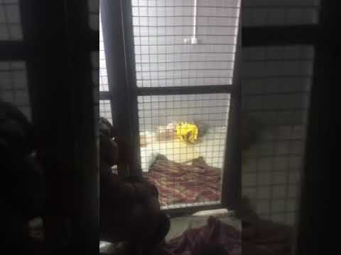
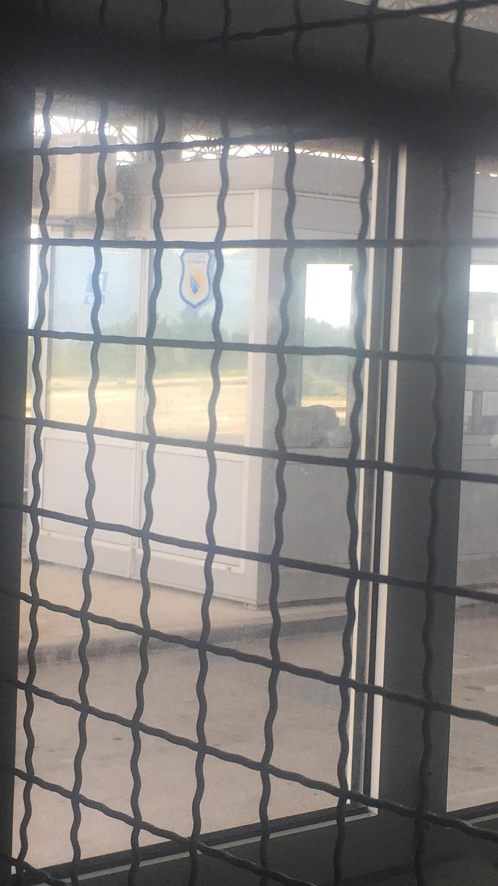

### AYS Daily Digest 22/4/19: Weekend of violent push backs from Croatia and Bosnia & Herzegovina
#### People held in cage detention in Trebinje, Bosnia and Herzegovina / Heavy beatings reported on more than 50 young people pushed back from Croatia / What is the situation like a year after the Sappho square protest? / Important information for those in the UK & more info…

#### FEATURE — Held in a cage?\!

We have received footage and photos displaying two detained families after they were pushed back in the border area between Bosnia and Herzegovina with Montenegro, Klobuk border crossing near Trebinje\.

Video and the photos show people being held in cage\-like detention cells, previously also seen and mentioned with the case of the Houssiny family\. There were reportedly 7 adults and 5 children among the detained people\. The youngest is 3 years old\.

They were detained in this way and stayed over night\. However, the authorities claim everything is “by the book” and in accordance with the EU standards\.

They say since the border crossing where people were later taken to is not a firm building, they have no barred rooms to detain people, so they use this — ironically funded by the European Commission — in order to “provide daylight” to the people and they stress the people were not locked inside\.

Either way, the question remains — is this the standard and a collective decision to treat and detain currently the most vulnerable group in the planet, refugees?

Will anyone finally bring into question and condemn the methods and current human rights breaking detention and push back practice?
### “They play loud music while they beat us”

In neighbouring Serbia, the Asylum Protection Centre published photos and information that more than 50 people were violently pushed back by the Croatian police back to Serbia, near Šid\. They were heavily beaten with police bats on legs and back\. The people describe being beaten, robbed of their belongings, having their phones destroyed, all between April 19 and 22\.

■■■■■■■■■■■■■■ 
> **[Azil u Srbiji Asylum Protection in Serbia](https://twitter.com/APC_CZA) @ Twitter Says:** 

> > U 3 dana Policija Hrvatske nasilno vratila više od 50 ljudi u Srbiju kod Šida.Surovo prebijeni pendrekom po leđima i nogama Marokanci i Avganistanci opisuju batinanja, oduzimanje novca,uništavanje telefona,od 19. do 22.04.19.Tahlab iz Maroka - puštaju glasno muziku dok nas tuku! https://t.co/xTv9RwPeXc 

> **Tweeted at [2019-04-23 09:26:17](https://twitter.com/apc_cza/status/1120619893068636160).** 

■■■■■■■■■■■■■■ 

#### LIBYA

Médecins Sans Frontières is extremely concerned for civilians caught in the ongoing fighting, including refugees and migrants currently trapped in detention centres in or near the affected areas, they have [announced\.](https://www.msf.org/trapped-refugees-must-be-released-and-granted-safety-tripoli-fighting-libya?fbclid=IwAR0qXJ_sqK7DncF3HS5Cq1Xlr3ZjYVRAWJu0VXyNH6dVAIMI4m1D-ZblqX0)

> “Even in times of relative calm, refugees and migrants held in detention are subjected to dangerous and degrading conditions that negatively impact their physical and mental health\. The fighting has made refugees and migrants in detention exceptionally vulnerable and has severely reduced the capacity of the humanitarian community to provide timely lifesaving response and urgently needed evacuations\.” — MSF 

■■■■■■■■■■■■■■ 
> **[Sally Hayden](https://twitter.com/sallyhayd) @ Twitter Says:** 

> > Refugees/migrants there had again gone days without eating &amp; said they're incredibly grateful. 700+ (including children) remain in the centre of clashes. #libya #tripoil. https://t.co/H7MTrVAllh 

> **Tweeted at [2019-04-22 14:30:47](https://twitter.com/sallyhayd/status/1120334134797328384).** 

■■■■■■■■■■■■■■ 

A [petition](https://www.change.org/p/onu-e-ue-corridoi-umanitari-per-quanti-sono-colpiti-dalla-guerra-in-libia-1469a77e-34bc-4b9b-abec-8bc7f4295701?fbclid=IwAR2XYDJzWZJAWb8Kch4tvFC2dKINd6rp7EspmDik4CUNTTS4165syjKbUI4) was started from the Italian side, demanding:

1\) for the weapons use to cease in order to reopen the dialogue 
2\) the United Nations and European countries, starting with Italy, promptly defend the life and dignity of those affected and threatened by war 
3\) to immediately put humanitarian corridors in place and intervene so as to safeguard the civilian population and vulnerable individuals\.

To join the groups behind the letter, write to: segreteria@litaliacheverra\.it
#### SEA
### Rescue is not a crime\!

“The Mediterranean has become the largest mass grave in the world\. More than 18,000 people have died trying to get through in the last five years\.”

■■■■■■■■■■■■■■ 
> **[Instituto República y Democracia](https://twitter.com/RepYDemocracia) @ Twitter Says:** 

> > El Mediterráneo se ha convertido en la fosa común mas grande del mundo. Más de 18.000 personas han muerto intentando atravesarlo en los últimos cinco años. Por eso decimos: #RescueIsNotCrime https://t.co/pRGdGNrSJb 

> **Tweeted at [2019-04-22 17:17:44](https://twitter.com/instituto25m/status/1120376148704337920).** 

■■■■■■■■■■■■■■ 

#### GREECE

1 year since has passed since the protests in Sappho square on Lesvos, when people were attacked by a far\-right mob\.

■■■■■■■■■■■■■■ 
> **[La Gira Zapatista RAZB](https://twitter.com/GiraZapatistaBE) @ Twitter Says:** 

> > #RefugeesGR #Lesvos: One year on from far-right attacks [enoughisenough14.org/2019/04/22/ref…](https://enoughisenough14.org/2019/04/22/refugeesgr-lesvos-one-year-on-from-far-right-attacks/) via @Enough14 https://t.co/iLc9p5kVe4 

> **Tweeted at [2019-04-22 13:06:08](https://twitter.com/strugglenewsbot/status/1120312834896879619).** 

■■■■■■■■■■■■■■ 

Roughly 200 fascists attacked refugees and migrants, as well as those standing in solidarity with them, with projectiles\. Even though the people will answer for the act of protest at the square, the violent attack has so far not been properly addressed by the institutions responsible for the legal investigation\. Even though it was recently announced that the people involved in the attack would be prosecuted for racially\-motivated crimes the suggested proposal of withdrawing racial\-motivation as an aggravating factor in violent crime takes a step back from condemning racially motivated crimes\.

There has been a rise in racist violence since the attacks\.

Now, along with other pressures on people stranded there, [reportedly](https://www.facebook.com/LesvosLegal/posts/2358365367535496?hc_location=ufi) , rumours have been spreading about an alleged plan to attack the weekly military parade, which lead to an increasing presence of the far\-right\.
#### Arrivals

444 people arrived on the Aegean islands in the past week, an increase from the week before \(377\), but a decrease from last year’s 502 arrivals during the same period, according to the UN Weekly report\.

■■■■■■■■■■■■■■ 
> **[Aegean Boat Report](https://twitter.com/ABoatReport) @ Twitter Says:** 

> > Two boats arrived on Lesvos today, total 33 people.

First boat was picked up outside Korakas, Lesvos north, 06.30.
25 people 
15 children 
4 women 
6 men

Second boat was picked up outside Mistegnon, Lesvos south east, by HCG 06.30.
8 people 

> **Tweeted at [2019-04-22 19:06:09](https://twitter.com/boataegean/status/1120403435411660806).** 

■■■■■■■■■■■■■■ 

### 3 years of City Plaza

> The Anniversary of the three years of city plaza is another call to the world of resistance and the society of solidarity\. It is urgent and necessary to fight to stop poverty on the hot spot of the islands, the illegal return in the evros and the Aegean, the establishment and extension of the miserable refugee To fight for the equality and solidarity of the oppressed\. For Freedom of movement and eve with rights\! — [Χώρος Στέγασης Προσφύγων City Plaza](https://www.facebook.com/cityplazaathens/?__xts__%5B0%5D=68.ARAdeygo_1lBCyYDBiS7ROYHfOPW_biJUI0-fVAPlxHOOYCenbmAdrDFt-Hx9iYH50dpNh1T5VhfHW1Izm2p0x1U5ijsmf7Q3QXVhKv3JRJCIGX5oQLduSdam0_ep-N0fqTEgPIWTYJRXkEuCrNlsmi_RetmUpRCnwqYu7gDFJKuBNPBkh8T-rlxVdkKxQVlqY4c09I3alRSZ1UbFQJvaqSc_PZlPaET_8GSD97B2bG9-0T3lmCdLslv6zG_L0wBLJ2YqIzfkUP69jipQ2EQQ3j8tD39lBKJEOYe_5GfmAwd0WljXRLEekUb4zRQIMkjdygXDpi9FByIqpWuuni0Dr2Pp2wC) 

### Croatia, Slovenia, Italy, Austria

Those resettled to Slovenia, Croatia, Austria and Italy can use a recently put up website of a joint project in order to find:
- Useful information for refugees and migrants about EU countries
- Information on relocation and resettlement
- Socio — cultural orientation guidelines
- Croatian and Slovenian Language e\-courses for basic users
- Links to useful Italian and German language e\-courses for all the users

#### FRANCE

An updated version of the short guide _How to support people in detention_ is available on the page [Resources](https://calaismigrantsolidarity.wordpress.com/videos-and-articles-2/) of the following blog:

A new document containing the list of the French deportation centres with their contacts and basic information, is also available\.
#### UK
### 36 people intercepted in the Channel by the Border Force as they attempted to reach the UK

[Reportedly](https://www.itv.com/news/2019-04-22/border-force-intercepts-three-boats-with-36-on-board-in-english-channel/?fbclid=IwAR1tDBFVNc-PBoFDSsaDtHPFCUGgnGRXJMeQS2b8c4TxxE259nMnLIcJ5nw) , a group of 11 men from Iran and Iraq were on board\. They were brought on to the Border Force vessel and then to Dover where they were medically assessed and transferred to immigration officials for interview\. The second boat had men, women and children on board, while the third one had 9 men and a woman on board the boat, all Iranian, who were also brought to Dover\.

**Apart from daily news in English, we also publish weekly summaries in Arabic and Persian\. Find specials in both languages on our medium site\.**

**If you think you could contribute to the work of our info team, write us\.**

**We strive to echo correct news from the ground through collaboration and fairness\. Every effort has been made to credit organizations and individuals with regard to the supply of information, video, and photo material \(in cases where the source wanted to be accredited\) \. Please notify us regarding corrections\.**

**If there’s anything you want to share or comment, contact us through Facebook, Twitter or write to: areyousyrious@gmail\.com\.**

_Converted [Medium Post](https://medium.com/are-you-syrious/ays-daily-digest-23-4-19-weekend-of-violent-push-backs-from-croatia-and-bosnia-herzegovina-e0482309b7f9) by [ZMediumToMarkdown](https://github.com/ZhgChgLi/ZMediumToMarkdown)._
