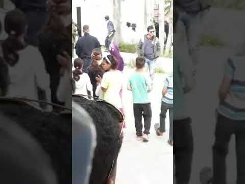
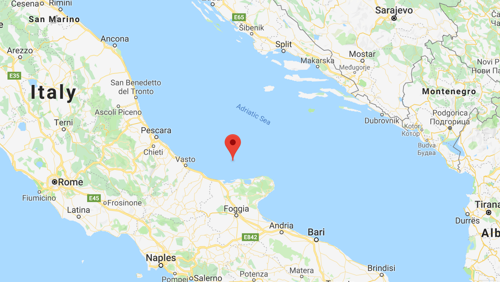

### AYS Daily Digest 23/04/19: As Militias enter Tripoli, People in Detention Pay the Price

_Horrific crimes against people trapped in detention in Tripoli\. / Updates from Greek Islands // Further displacement after the mass squat eviction in Athens, potential deportations // Bosnian police respond to video of detention facility // Unusual arrival to Italy_
### LIBYA

Militants reached the Qasr bin Ghasher detention centre in Tripoli\. In horrific video that is circulating on social media, members of the militia supporting Khalifa Haftar shoot at people in detention, many of them “rescued” from the Mediterranean only to be taken back to horrifying and squalid conditions\.

■■■■■■■■■■■■■■ 
> **[Sally Hayden](https://twitter.com/sallyhayd) @ Twitter Says:** 

> > Today, fighters entered a migrant detention centre outside Tripoli &amp; apparently opened fire on the unarmed &amp; defenceless people inside. Many had been previously returned to Libya, under EU policy, after they tried to escape. 
My report here: [aljazeera.com/news/2019/04/l…](https://www.aljazeera.com/news/2019/04/libya-detained-refugees-shot-clashes-tripoli-continue-190423184222138.html) https://t.co/QDe6H0A4VE 

> **Tweeted at [2019-04-23 20:29:48](https://twitter.com/sallyhayd/status/1120786874098958336).** 

■■■■■■■■■■■■■■ 

In addition to reports of two people being killed in the attack as well as many injuries, the video also shows torture and mutilation of corpses\. Khalifa Haftar previously assisted Muammar Gaddafi in his coup and rise to power, however then later participated in the overthrow of Gaddafi in 2011\. Haftar’s officially focus is on “countering Islamic terrorism” in the ongoing civil war, but has been accused of war crimes himself\.

■■■■■■■■■■■■■■ 
> **[Amnesty MENA](https://twitter.com/AmnestyMENA) @ Twitter Says:** 

> > #Libya: We are shocked by reports that armed fighters randomly shot at migrants &amp; refugees at Qasr bin Ghasher detention centre south of #Tripoli today. Libyan authorities must protect individuals from further attacks &amp; ensure that those injured receive urgent medical care. https://t.co/nNYYFX5YGG 

> **Tweeted at [2019-04-23 18:19:00](https://twitter.com/ainorthafrica/status/1120753958321106945).** 

■■■■■■■■■■■■■■ 

A video shows two men injured and one can hear terrified or pained screams in the background\.

UNHCR offered to evacuate people from the centre in Tripoli to the centre in Zintan, however one might remember that this centre, although far from Tripoli, is criminally negligent in its support to people who are kept there, with no fewer than eight detainees dying due to lack of healthcare or other conditions in the last 8 months\.

Haftar has taken seemingly overwhelming control of Tripoli, and according to some reports over 264 individuals have died, with 1,266 wounded, including civilians\. For Tripoli alone, relief agencies have requested over ten million in flash cash assistance to help manage the humanitarian catastrophe there\. Yet with the EU\-Libya deal, the criminalization of sea rescue, the desire to strengthen the outer border “of Europe”, no matter how many platitudes of how “shocked” and “horrified” officials are, we’ve stated that we think that Libya, a war zone, is “safe enough\.” In fighting against the idea of Libya as a safe country, we not only fight to prevent further horror against vulnerable people, but we also try to challenge what could easily become a legal precedent\. If Libya and Afghanistan are “safe”, then what could possibly constitute “unsafe\.”
### MOROCCO

[Association Marocaine des Droits Humains — Section Nador](https://www.facebook.com/AmdhNador/?__tn__=%2CdkCH-R-R&eid=ARBRo6ZLNX5ttOC9rrq4Dlhzlbve392PWtIJIJiUpLgDcLFpJNm6gAkJ6kjkRa48_pBolDN9DX29tGwk&hc_ref=ARSTfoRqqKs8JvmDqeGukooFptNuKJFvQrwAEFKodC0XLhKR5AHhGM6I-bTJ8Yv31E8&fref=nf&hc_location=group) reports that there was a crackdown on people housed in a total of 8 houses\. 100 people were arrested, of which 26 were women, and 10 of them children\. All 100 were sent away, presumably back across the border
### GREECE

According to [Aegean Boat Report](https://www.facebook.com/AegeanBoatReport/?__tn__=%2CdkCH-R-R&eid=ARBcYP8hOAC1EjBSDCV9zNOaH0uyMu1VyOueJ_Nc61iQOEskQGFoCXKYbjv6u8Oaa57peGHO2TQbdrDp&hc_ref=ARRlS08xMRQ-dP2hV4MJ2L8F1ZlO5Lwt8ADQnAI052Es872h4RA7FTpFhHZ5eq7pcVI&fref=nf) , 122 people arrived to the Greek islands, with 22 people on Chios, 33 people to Kos, another 44 directly to Kos, and 23 to Leros\. Additionally another boat was intercepted heading to Chios by the Turkish Coast Guard and 30 people were arrested\.

Refugee Law Clinic in Berlin is looking for qualified members to join their team on Samos from September to November

“Accommodation will be provided; travel costs are self\-financed \(please note: RLC Berlin may be able to cover travel costs if a stay on Samos would not otherwise be possible\) \.
 Volunteers will receive a training before leaving for Samos\. If you are interested in volunteering please send us a short message describing your counseling experience in migration law and your CV as well as the proposed dates of stay​ to: ​info\.samos@rlc\-berlin\.org”

For more information, go [here](https://www.facebook.com/rlc.berlin/posts/2311134802240396) \.
### Athens

In the aftermath of the mass evictions from squats across Athens, it appears that individuals who were residing in some camps unregistered \(i\.e\. did not have papers\) were evicted in order to make way for families previously in squats, many of whom then protested their eviction publicly\. However conditions in containers in this camp remain appallingly inadequate with many of the kitchens being burned out\. Families newly arrived are disoriented and in dire need of support\. We will be posting updates about ways groups are providing support as it follows\.

The eviction of those in the camp was very violent, with the day starting with administrators calling for police support — then all NGO and non\-residents were kept out, allowing the police to do what they will, often violently\.

■■■■■■■■■■■■■■ 
> **[NoBorders](https://twitter.com/Refugees_Gr) @ Twitter Says:** 

> > Police+riot police entered Elaionas camp after call by admins to calm morning riots, said caused by refugees moved there after squat evictions,also for checking who live with/without permission.Police kept staff out of the camp, 35 #Refugeesgr arrested&gt;to Petrou Ralli #antireport 

> **Tweeted at [2019-04-23 15:46:11](https://twitter.com/refugees_gr/status/1120715496880521217).** 

■■■■■■■■■■■■■■ 

Those who were removed the the camp are presumed to have been taken to a detention centre and individuals are working with those people, affirming them of their rights wherein they cannot be deported without full information on their rights\.

Finally, a reminder that silence is violence as well as people remember that a year ago, after violent attacks on refugees on Lesvos, none of the perpetrators have been brought to justice\.

■■■■■■■■■■■■■■ 
> **[Vassilis Tsarnas](https://twitter.com/VassilisTsarnas) @ Twitter Says:** 

> > #Greece: Exactly a year after the violent attack against 200 #RefugeesGr in Lesvos (incl. children &amp; babies) 26 of the perpetrators (incl. #Nazis) aren't even summoned to answer the charges while the victims will be on trial in May accused for occupying a square...
#HateCrimes 

> **Tweeted at [2019-04-22 18:49:18](https://twitter.com/vassilistsarnas/status/1120399193485520896).** 

■■■■■■■■■■■■■■ 

### BOSNIA

Bosnian police have responded to the release of videos from people stuck in detention after being intercepted by police\. The videos filmed near Trebinje show people in containment cells that resemble cages, much like those that are used as general purpose detention facilities for people apprehended overnight\.

In response to the outcry that the cage\-like conditions are degrading and inhumane, the police stated that they are only a part of larger rooms and that all have air conditioning/heating and video surveillance, arguing that those in detention only spend a few hours out of their whole time in the facility in the cage like conditions\. In a rather preposterous turn, the speaker attempted to redirect the attention to how much worse conditions are in other locations and how these conditions are possibly better than those that officers themselves enjoy in some situations\. The detention facilities according to the report are in full compliance with EU standards, and they are not specially\-made for people apprehended for migration; however, it is clear that there needs to be an alternative to immediately criminalizing someone simply for existing, which is the current situation\. The full response, in Bosnian, is available [here](https://ba.voanews.com/a/reakcije-na-video-migranata-u-kavezima/4888014.html) \.
### ITALY

18 people arrived to the Tremiti island Capraia\. The people were from Iraq, and there were children among them\. There is no sign of where their boat disappeared after they landed\. Two of the children have health problems; one of them is paraplegic and the other appears to be ill\. They are receiving some levels of support\. The full story is available here [in Italian](http://www.foggiatoday.it/cronaca/sbarco-migranti-isole-tremiti-gargano-foggia.html) \. With the location of the islands \(far up Italy’s boot and on the Adriatic\), although it is impossible to confirm at this point, it would appear that this group came via Albania\.

Location of the Island where the people were found

Additionally, [InfoMigrants highlights that an increasing number of people](https://www.infomigrants.net/en/post/16468/refugees-and-migrants-increasingly-attempting-to-reach-eu-through-cyprus) are trying to reach Europe via Cyprus, although there are great difficulties facing them when it comes to entering the workforce and to fulfill the requirements\.

**Apart from daily news in English, we also publish weekly summaries in [Arabic](%D8%A7%D9%84%D8%AA%D8%BA%D9%8A%D9%8A%D8%B1%D8%A7%D8%AA-%D9%81%D9%8A-%D9%82%D8%A7%D9%86%D9%88%D9%86-%D8%A7%D9%84%D9%84%D8%AC%D9%88%D8%A1-%D9%81%D9%8A-%D8%A7%D9%84%D8%AF%D9%86%D9%85%D8%A7%D8%B1%D9%83-b99e429d54ad) and [Persian](%D8%B9%D9%88%D8%B6-%D8%B4%D8%AF%D9%86-%D9%82%D9%88%D8%A7%D9%86%DB%8C%D9%86-%D9%BE%D9%86%D8%A7%D9%87%D9%86%D8%AF%DA%AF%DB%8C-%D8%AF%D8%B1-%D8%AF%D8%A7%D9%86%D9%85%D8%A7%D8%B1%DA%A9-7b984cac7a86) \. Follow the links to read and share the ones from the week of March 4–10\.**

**We strive to echo correct news from the ground through collaboration and fairness\. Every effort has been made to credit organizations and individuals with regard to the supply of information, video, and photo material \(in cases where the source wanted to be accredited\) \. Please notify us regarding corrections\.**

**If there’s anything you want to share or comment, contact us through Facebook or write to: areyousyrious@gmail\.com**

_Converted [Medium Post](https://medium.com/are-you-syrious/ays-daily-digest-23-04-2019-as-militias-enter-tripoli-people-in-detention-pay-the-price-1260a3fb331c) by [ZMediumToMarkdown](https://github.com/ZhgChgLi/ZMediumToMarkdown)._
