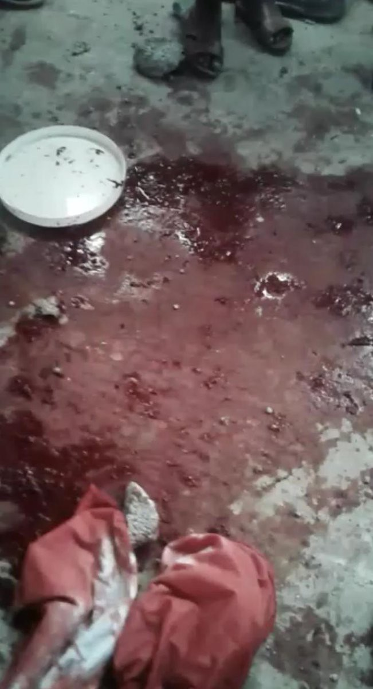
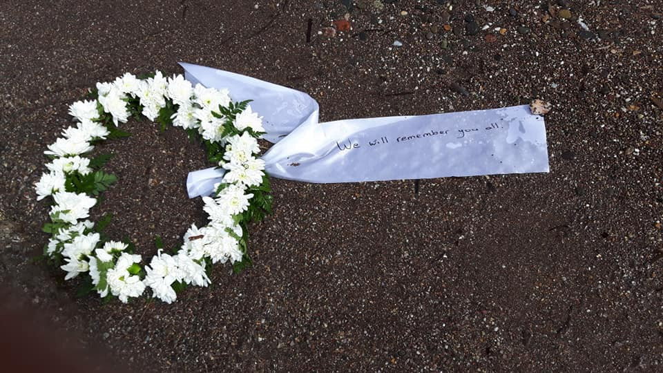

### AYS Daily Digest 24/04/19 Uncertain number of deaths in the Qaser Ben Ghashir in Tripoli

_Remembering those who drowned two years ago today // New human rights report in Denmark // Sea Watch 3 and Mare Jonio, both stopped // German authorities mistakenly deporting an Iranian to Afghanistan // and more…_
### Morocco

Another person has died, Ibrahim Barry, due to the lack of medical care in Nador\. The Moroccan Association of Human Rights — Nador Section reports that arrest prevents people from being able to access medical care around the forest in Nador\. Learn more [here](https://www.facebook.com/AmdhNador/photos/a.1693125780899690/2316140921931503/?type=3&theater) \.
### Libya

■■■■■■■■■■■■■■ 
> **[migrace.org](https://twitter.com/Migrace_Organiz) @ Twitter Says:** 

> > More than 200٫000 #Libyans from Amazigh Cities &amp;Zawiyah, Janzour,#Tripoli, Zintan,Misurata, Zliten,Al Khums are Expected to be displaced in Tunisia &amp;other countries if #LNA takes over Tripoli by War.
It's very important to return to the dialogue under #UNSMIL Before it's too late https://t.co/JgRsMEk3wh 

> **Tweeted at [2019-04-24 15:07:15](https://twitter.com/migrace_organiz/status/1121068090282921984).** 

■■■■■■■■■■■■■■ 

People are [**“screaming with grief”**](https://twitter.com/sallyhayd/status/1120956745038336000) in detention centers in Tripoli\.

The circumstances of the attacks on the [Qaser Ben Ghashir](https://www.infomigrants.net/fr/post/16496/migrants-attaques-en-libye-que-s-est-il-passe-au-centre-de-detention-de-qaser-ben-ghashir) detention center on Tuesday in the south of Tripoli remain unclear\. Some eye witnesses report two to six deaths occurred, and Libyan spokesman said at least six people died\. A person inside the center said he saw two bodies taken away in an ambulance\. Yet somehow the UN has only announced that about a dozen were injured\. UNHCR says those wounded were moved to the hospital\.

](assets/e38cf7151cf3/1*biw6dJ408S9ozpaBqVX39Q.jpeg)

Why one might “scream with grief\.” Photos of Qasr bin Ghashir sent to journalist [Sally Hayden on Tuesday](https://twitter.com/sallyhayd/status/1120970128760422400)

[UNHCR](https://www.unhcr.org/en-us/news/press/2019/4/5cc09a824/unhcr-evacuates-hundreds-detained-refugees-libya-safety.html) was able to move “some 325 refugees” from Qaser Ben Ghashir on Wednesday with IOM\. Yet UNHCR states that they “remain concerned for some 3,000 refugees and migrants who remain in detention centres in Tripoli\.”

](assets/e38cf7151cf3/1*ajdaE_Cfgy4BxaYimb9_1A.jpeg)

Evacuation from Qaser Ben Ghashir Dentention Center\. Photo by [IOM](https://twitter.com/IOM_Libya/status/1121132688482668545?fbclid=IwAR2Vmmbbk5PIlgBWSuIzLagcBE6eirq2RmYfRrb5eBXT3yJN6Z1XQDUJfko)

Despite the violence occurring in Libya with the ongoing fighting, the EU is still justifying its relations with the Libyan Cost Guard\. They repeatedly say they do not provide funding, only training\. One can read more [here](https://twitter.com/sallyhayd/status/1121094261368340481) \.

European governments are trying to predict whether the fighting in Libya will swell the numbers of people fleeing the country to cross the Mediterranean\. MSF’s Craig Kenzie in Tripoli makes the [point](https://twitter.com/MSF_Sea/status/1121010265234071552?fbclid=IwAR2oDjAFfxke5lLcUm2dnfO0KC0NNwjYdNgvGr5rwvtA9AFurmCsQRyp4ds) :

> “There’s a good chance that if people do cross and come into distress there’ll be no option to aid them\.” 

### Sea

**Two rescue ships are being stopped from saving lives at sea: Sea Watch 3 and Mare Jonio\.**

In an update from the captain of Sea Watch 3, he explains how the Dutch decision is ridiculous to block the ship from continuing to rescue people due to the excuse that the ship is unfit to house people for long periods of time\. People are dying every day, and the Dutch government is supposedly concerned about people’s potential safety on a ship meant to provide safety\. You can watch the full video [here](https://twitter.com/seawatch_intl/status/1121127889007673345?fbclid=IwAR1CA3b2KGll8gFjHU-muPHmWuMOlR-5uL0cWSCPvtRO6dHKuXQPT8_3q1o) \.

T [he Mare Jonio ship](http://"Like any vessel - continues the note by Mediterranea Saving Humans - not only has all the right, but the precise duty, also established by articles 489 and 490" rescue obligation "of the Italian Navigation Code, to intervene to rescue boats and people in need to save lives as a priority Since the Ionian Sea rescued 49 castaways on March 18, we have been subjected to every kind of pressure and attempt to hinder our activity, most recently the specious inspection operated last Friday in Marsala. Should we conclude that in the Italian government there are those who would have preferred that those 49 people drowned? ") has also been deemed unfit to save lives at sea, and remains retained [in Sicily](https://twitter.com/evaenlaradio/status/1121107527276683265?fbclid=IwAR20N6MvI662w-MT5jnD-oXFFL0Y9TUgZI38wHenYzIHXHDj8_6L_5xcBZk) \. As part of the Mediterranea Saving Humans imitative, they said in [a letter](https://www.facebook.com/Mediterranearescue/photos/a.275129016441663/355936418360922/?type=3&theater) on their website:

> “Like any vessel, not only has all the right, but the precise duty, also established by articles 489 and 490 ‘rescue obligation’ of the Italian Navigation Code, to intervene to rescue boats and people in need to save lives as a priority\. Since the Ionian Sea rescued 49 castaways on 18 March, we have been subjected to every kind of pressure and attempt to hinder our activity, most recently the specious inspection operated last Friday in Marsala\. Should we conclude that in the Italian government there are those who would have preferred that those 49 people drowned?” 

](assets/e38cf7151cf3/1*faMATqZNNPrirGcYhP4yIw.jpeg)

Photo by [Mediterranea Saving Humans](https://www.facebook.com/Mediterranearescue/photos/a.275129016441663/355936418360922/?type=3&theater)

[Mediterranea Saving Humans](https://www.facebook.com/Mediterranearescue/photos/a.275129016441663/355936418360922/?type=3&theater) articulated this feeling of absolute frustration in these words:

> “While Libya burns and people are being executed in concentration camps, it is disturbing that so much effort is being spent against civil society ships instead of saving the lives of those in danger\.” 

### Greece

[Aegean Boat Report](https://www.facebook.com/AegeanBoatReport/videos/vb.285298881993223/579360712548873/?type=2&theater) states that a boat with 47 people was stopped by the Turkish Coast Guard while it was heading to Samos\. They arrested two children, 12 women and 33 men\. [Another boat](https://www.facebook.com/AegeanBoatReport/videos/vb.285298881993223/676160739470991/?type=2&theater) was stopped on its way to Lesvos with 29 people; so nine children, seven women and 13 men were arrested\.

[ABR](https://www.facebook.com/AegeanBoatReport/posts/562156717640770?hc_location=ufi) is reporting that three boats did make it to the islands:
- The first boat landed close to Chios, with 39 people; 10 children, 10 women, 19 men\.
- The second boat landed close to Lesvos with 48 people; No breakdown\.
- The third boat arrived on Samos with seven people; No breakdown\.

Find ABR’s weekly statistics from 15–21 April [here](https://www.facebook.com/AegeanBoatReport/posts/562211644301944?hc_location=ufi) \.

](assets/e38cf7151cf3/1*wEhsqMag3kxCeTsDXZBH_g.jpeg)

New Arrivals close to Chios\. Photo by [Humanitarian Maritime Rescue](https://www.facebook.com/smhumanitario/photos/pcb.2208305432594628/2208305122594659/?type=3&theater)

MSF is worried about a patient who is severely mentally ill and was deported from Lesvos to Turkey on 18 April\. They are urging the authorities to investigate\. Learn more [here](https://www.efsyn.gr/ellada/dikaiomata/192774_apanthropi-apelasi-sta-oria-toy-nomoy?fbclid=IwAR2geSQS0o5F6kADSTSuFi8kg7I-hWlf5TKMiqBjvO094_jvqQqG_ZAiFY0) \.

Make sure everyone knows that [asylum offices](https://www.facebook.com/permalink.php?story_fbid=1276067145880721&id=481351218685655&hc_location=ufi) in Greece will be closed on 1 May due to the national holiday\. Also [this weekend is Easter](https://www.facebook.com/mobileinfoteam/posts/2421807888047926?hc_location=ufi) , so of course be mindful that a lot of offices will be closed\.

[Refugee Rescue / ‘Mo Chara’](https://www.facebook.com/RefugeeRescueUK/posts/2182129051854533) released this remembrance on Wednesday:

> “Today our team held a remembrance ceremony for the 22 people who lost their lives north of Eftalou on 24 April 2017\. Late at night, on 23 April 2017, a boat sank in the North of Lesvos and 22 travelers lost their lives — among them two Syrian children\. A Search and Rescue operation took place the next morning conducted by the authorities’ vessels and rescue teams\. Sylvie and Joelle were the only ones who survived, after the many hours spent in the sea\. Only one month later, Joelle gave birth to Victoria here in Mytilene — and this little girl reminds us that life continues\.” 

](assets/e38cf7151cf3/1*6oSU_W9vf70lYhTdbeV8Fw.jpeg)

“Today, 2 years later, we went to the beach in Eftalou to remember and never forget\.”
Eftalou team\. Photo by [Tjarda Hope](https://www.facebook.com/permalink.php?story_fbid=647942788983774&id=100013041760314&hc_location=ufi)

People are dying, Europe\.

[Action for Education](https://www.facebook.com/ActionforEdu/posts/883519291994121?hc_location=ufi) need volunteers for the month of May on Samos\! Their key services include:
- A course\-based education programme
- 100\+ meals a day
- Hot showers
- Women\-only day
- ‘The Nest’, dedicated play\-space for children aged two to seven
- IT Centre and Cinema

Hope Cafe needs your help in delivering meals to people\! Find out more [here\.](https://www.facebook.com/ourhousegr/posts/2282993778619122?hc_location=ufi)
### Italy

Doctors for Human Rights \(MEDU\) need a medical doctor to help in their care and research concerning the health and well\-being of seasonal migrant workers in agriculture\. Find out more [here](https://mediciperidirittiumani.org/medico-progetto-terragiusta-2019/?fbclid=IwAR2E4XoI_Sk1JCXlpez_AA724LEz5hO7XpMDWJptoZ-QewQPHk2vYs5EtAY) \.
### Serbia

](assets/e38cf7151cf3/1*uRiOwNV3vO3uFKKuuXbPzQ.jpeg)

“Volunteers from No Name Kitchen have been investigating over the last week about the situation of all the people who don’t have a place to settle in Šid\. Many of them are trying to cross the European Union by hiding on trains heading to Croatia\. We recently heard stories from No Name Kitchen of brutal police violence towards refugees who try to cross the Schengen zone by train and are discovered at the border\.” Photo by [No Name Kitchen](https://www.facebook.com/NoNameKitchenBelgrade/photos/a.312076942523930/706653879732899/?type=3&theater)
### Germany

[German authorities](https://www.facebook.com/photo.php?fbid=10157255541697973&set=a.184902167972&type=3&theater) accidentally deported an Iranian man to Afghanistan about two months ago\. Although they have realized their mistake and have promised to send him back to Germany, he is still waiting in fear, living in a country for months that is not even his own\. Find out how you can help\. AYS stands in solidarity with people wrongly deported in the first place ✊\.
### France

Thirteen mayors are saying to the French government “the street is no place to live\!” For these municipalities the situation is complex, they see what is happening to the people living on the street daily\. Learn more [here](https://www.liberation.fr/france/2019/04/24/treize-maires-interpellent-le-gouvernement-la-rue-n-est-pas-un-lieu-pour-vivre_1723076?fbclid=IwAR3V3s58jFlQatcYVB569WmknemcF-1oeLvMVH0yPVJC91G2QqAJAa61r9s) \.

[The Other Cantine Nantes](https://www.facebook.com/lautrecantinenantes/photos/a.250613212194492/395597724362706/?type=3&theater) shows how they discovered a picture from the Red Cross in France of “recreating” the migrant experience for people as a game\.

> “With disbelief we discovered this image this morning, which proposes to recreate the route of the exiles in a Vendean forest\! But these courses are neither role plays nor reality TV games with sponsors and a winning title\! We can not learn the journey of an Afghan fleeing the Taliban, nor do we know what it means to be a prisoner in Libya\.” 

Find the image here and understand how these imitation exercises only cause more disillusionment; they’re not helpful\.

The Refugee Women’s Centre is in desperate need of donations of women’s and children’s underwear\! Please find out more [here](https://www.facebook.com/refugeewomenscentre/posts/620081755084125?hc_location=ufi) \.
### Denmark

A new report has been published by the Danish Institute for Human Rights about freedom of religion in the Danish reception centers\. The report identifies four challenges for asylum seekers exercising their right to religious freedom:

> 1\. Lack of uniformity in knowledge of and handling of religious practice as well as religious\-related problems and conflicts at the centers 

> 2\. Insufficient protection of asylum seekers against harassment and social control 

> 3\. Limitation of religious practice to the private sphere 

> 4\. Risk of limiting religious practice for certain religious groups 

Read more [here\.](https://menneskeret.dk/udgivelser/tros-religionsfrihed-paa-danske-asylcentre?fbclid=IwAR0_K_2uTOrs5BRwol94pfUh9o73y2eNcr4hrilCKNKnRBDWMCLSew5uaSY)
### UK

A man, [Mahammat Abdullah Moussa](https://metro.co.uk/2019/04/23/migrant-found-dead-coach-heading-uk-body-got-wrapped-round-axle-9290745/?ito=social&fbclid=IwAR2FT2D4iEHCxeTX6XaMX_cekmzQehqgMHNMP3POljj0yh85DDOEeONde9w) , was found dead under the carriage of a bus heading from Brussels to the UK\. It is likely that his death was almost instantaneous considering the position he was found under the bus\. He was identified from his finger prints based in the Interpol system\. AYS stands in solidarity with every person placed in desperate enough situations that putting themselves in grave danger seems the only way out\.

Nine people were picked up in the English Channel on Wednesday, including eight men and one teenager\. They were all brought to Dover for their immigration interviews\. Kentonline has counted this as the 53rd “migrant case” involving a total of 472 people since 8 November\. Find out more [here](https://www.kentonline.co.uk/dover/news/new-migrant-case-nine-in-boat-203342/) \.

**Apart from daily news in English, we also publish weekly summaries in Arabic and Persian\. Find specials in both languages on our medium site\.**

**If you think you could contribute to the work of our info team, write us\.**

**We strive to echo correct news from the ground through collaboration and fairness\. Every effort has been made to credit organizations and individuals with regard to the supply of information, video, and photo material \(in cases where the source wanted to be accredited\) \. Please notify us regarding corrections\.**

**If there’s anything you want to share or comment, contact us through Facebook, Twitter or write to: areyousyrious@gmail\.com\.**

_Converted [Medium Post](https://medium.com/are-you-syrious/ays-daily-digest-24-04-19-uncertain-number-of-deaths-in-the-qaser-ben-ghashir-in-tripoli-e38cf7151cf3) by [ZMediumToMarkdown](https://github.com/ZhgChgLi/ZMediumToMarkdown)._
