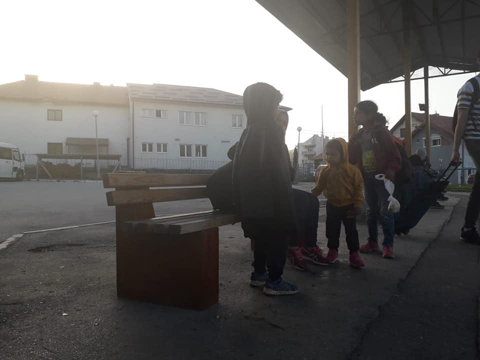
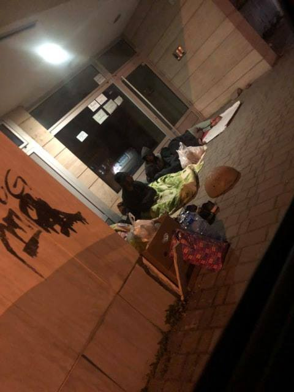
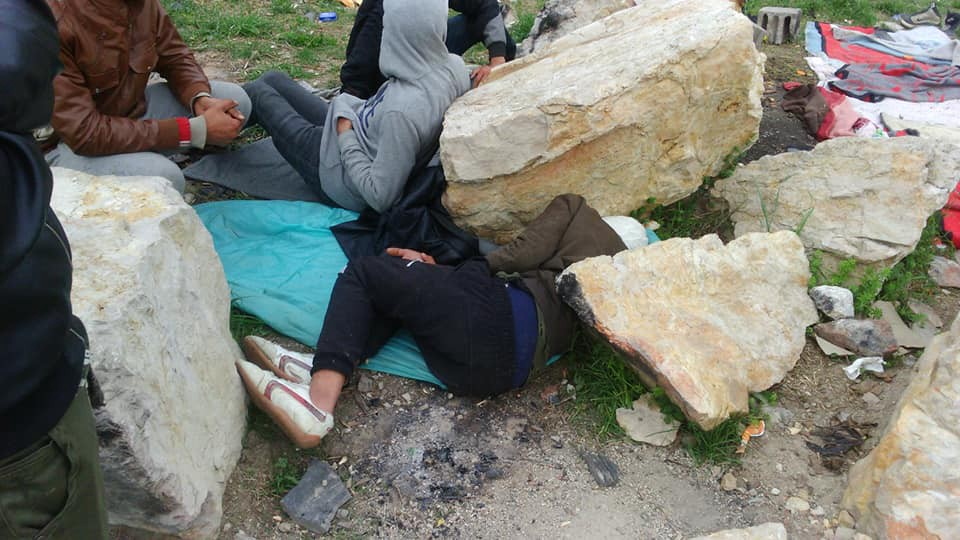

### AYS Daily Digest 25/04/19: Postcard from the Balkans

_Number of children among those arriving to Europe is increasing / In 2018, the EU member states granted protection status to nearly 333,400 people / Amnesty International calls for war crimes investigation in Libya / IOM does not see a cage in Bosnia / Violent death of a child in a centre in Belgium_

](assets/936a6e23e6c4/1*Fm3dsfoSFFikPOOAKaS-ZA.jpeg)

Samos\. By [Ruhi Loren](https://www.facebook.com/donate/282895535963683/)

Pljevlja, Montenegro\. By Bona Fide Pljevlja

Tuzla, Bosnia\. By Samir Cupo

Velecevo, Bosnia\. By Sanella Lepirica

These are all people who arrived to Europe this year looking for safety and the possibility to start an new life\. During the first four months of 2019, 16,000 people arrived in Europe, among them over 3,800 children, or one in every four arrivals\.

At the moment, [UNICEF data shows](https://reliefweb.int/sites/reliefweb.int/files/resources/UNICEF%20Refugee%20and%20Migrant%20Crisis%20in%20Europe%20Humanitarian%20Situation%20Report%2C%20No.%2031%20-%20January%20to%20March%202019.pdf) there are 17,300 unaccompanied and separated children registered in Greece, Italy, Bulgaria, Serbia, and Bosnia and Herzegovina\.

UNICEF reports also that many children on their way to Europe have experienced violence and abuse, while some are kept in detention\.

In Greece — where during this year alone 2,077 children arrived — there are currently about 28,000 child asylum seekers \(of whom 3,535 unaccompanied\) \. The worst situation is for those kept in hot\-spots\.

UNICEF estimates that over half of the unaccompanied minors will turn 18 during this year, which will put them in even more dangerous situation, leaving them without some of the benefits they are entitled to as minors\.

This is also the case for many children who came with their families, and whose parents saw their asylum claims rejected\.

In Bosnia, which is turning into a hot\-spot, over 3,600 people arrived \(in Tuzla alone on Wednesday, over 200 people arrived\) so far this year\. It is estimated that some 6,500 people are in the country at the moment, and out of this number at least 19 per cent are children, and 7 per cent are unaccompanied children\.

Living conditions for children, unaccompanied or not, pose serious safety and health risks\. The number of children sleeping out in the open is high, though many are in temporary accommodation centres run by the IOM, but even there, basic care is limited\.

At the same time, [EUROSTAT published its latest data](https://ec.europa.eu/eurostat/documents/2995521/9747530/3-25042019-BP-EN.pdf/22635b8a-4b9c-4ba9-a5c8-934ca02de496) showing that during 2018, the EU member states granted protection status to nearly 333,400 asylum seekers, which is 40 per cent less than a year before\.

Out of all the persons who were granted protection status in 2018 in the EU, 163,800 persons were granted refugee status \(49% of all positive decisions\), 100,300 were given subsidiary protection \(30%\) and 69,300 were given authorization to stay for humanitarian reasons \(21%\) \.

More than one\-third of asylum decisions granted in the first instance made in the EU resulted in protection status\.

In the same period of time, over 24,800 new asylum claims were filed in the member states\.

Most of the people who were granted asylum in the EU are from Syria \(96,100 persons, or 29% of the total number\), followed by citizens of Afghanistan \(53,500 or 16%\) and those of Iraq \(24,600 or 7%\) \.

Most of the Syrians who got asylum are in Germany \(67,000\) \.
### Libya

[Amnesty International](https://www.amnesty.org/.../libya-horrific-attack.../...) calls for an attack on a Libyan detention center to be investigated as a war crime\.

> “Armed men raided the Qasr Ben Ghashir detention centre, south of Tripoli on 23 April and shot a number of the people being held there\. According to the UN Refugee Agency \(UNHCR\) at least 12 people were hospitalized as a result of their injuries\.” 

Video footage reviewed by Amnesty International shows distressed refugees and migrants in the aftermath of the shooting, some of them screaming\. In one of the videos, three people are shown with apparent gunshot wounds\. Another video shows several injured people lying on the floor, their bandages soaked with blood\.

_“These refugees and migrants should not even be detained in the first place\. This incident demonstrates the urgent need for all refugees and migrants to be immediately released from these horrific detention centres where they are held arbitrarily in inhuman conditions and routinely subjected to abuse,”_ stated Magdalena Mughrabi, Deputy Middle East and North Africa Director at Amnesty International\.

[MSF is warning](https://www.msf.org/time-running-out-evacuations-refugees-tripoli-amid-shooting-libya) that about 3,000 people are locked in centers in Tripoli for over two weeks now\.

_“The international community can only be blamed for its complete and utter inaction,”_ said Karline Kleijer, MSF’s Head of Emergencies\. _“Today MSF is again pleading for their urgent and immediate evacuation out of the country\. Until then, they remain at risk of another attack or caught in the crossfire\.”_

At the same time, eight Associations including Doctors Without Borders France, have decided to [denounce the complicity of France](https://www.msf.fr/…/l-etat-francais-livre-des-bateaux-a-la…) in human rights violations in Libya\.

On Thursday, the UN High Commissioner for Refugees \(UNHCR\) has called on Wednesday for more countries to agree to host some of the 3,600 migrants and refugees who are trapped in detention centres in and around Tripoli due to fighting between the forces of the Libyan Government and those led by General Khalifa Haftar\.
### Sea

UNHCR published the latest data on people who died or gone missing while trying to reach the EU\.

### Greece

On Thursday, one boat landed on Giosonas Beach, Chios, with 22 people on board; two boats arrived on Samos, and one boat was stopped by Turkish Coast Guard outside Seferihisar, carrying 47 people\.

Disappointing news about the European Ombudsperson who confirmed its earlier decision to close the inquiry into the European Asylum Support Office \(EASO\), about the lawfulness and fairness of interviews conducted by the EU agency\.

_“The EASO can continue to act without accountability regarding interviews with asylum seekers in the so\-called Greek Hotspots\. This is the final response of the European Ombudsperson to a complaint against EASO filed in April 2017 by the European Center for Constitutional and Human Rights \(ECCHR\),”_ includes the statement, which came out after the decision was made public\.

More information on the complaint against EASO can be found in these links\.

\[1\] [https://www\.ombudsman\.europa\.eu/en/home](https://www.ombudsman.europa.eu/en/home) 
\[2\] [https://www\.ecchr\.eu/en/migration/](https://www.ecchr.eu/en/migration/) 
\[3\] [https://www\.ecchr\.eu/](https://www.ecchr.eu/) …/greek\-hotspots\-complaint\-against\-eu…/
\[4\] [https://www\.ombudsman\.europa\.eu/de/decision/en/98711](https://www.ombudsman.europa.eu/de/decision/en/98711) 
\[5\] [https://www\.hias\.org/greece](https://www.hias.org/greece) 
\[6\] [https://www\.hias\.org/](https://www.hias.org/) …/de…/files/hias\_greece\_report\_easo\.pdf
\[7\] [https://www\.ombudsman\.europa\.eu/de/decision/en/98711](https://www.ombudsman.europa.eu/de/decision/en/98711) 
\[8\] [https://www\.ecchr\.eu/](https://www.ecchr.eu/) …/greek\-hotspots\-complaint\-against\-eu…/

[Metadrasi](https://www.facebook.com/.../a.14005.../2585442018263840/...) looking for interpreters\.

Volunteers needed on Samos in May for [Action for Education](https://bit.ly/2UyJK9y) , a dynamic new project providing a range of services to meet the basic needs of the refugee community\.

[Glocal Roots](https://www.facebook.com/GlocalRoots/?__tn__=kCH-R&eid=ARCLD_yc8aA6RDc97sPZSFNHkCFf5XNPzqtNCy3PqDimmtp1aK6Zzn9mZmcVdMuDBb1W_K-A08Vncmd-&hc_ref=ARRB9h7h7_B-VZ9LW-ad_b-C60j3DsEN6ByoG6PQZgmirWHeQMnAySyUoXR2RMkca70&fref=nf&__xts__[0]=68.ARBIVBWGIgjs5QQK_wy5L8QbtK9muPmX91FmQufFvfq4vkrTls97_m5NgCIPytoMMKAsyPUCckhs0ah_38AU_27EumUEobc2Lf5-MGjV6uhPqIaZGtJLKBvPRAHBjjAyd2TQX8yIytJzgtFWO9xT-XCLFNUqJv67AYXWwIOkUXpu9abeDvMuI-z86GKwAE0H7x9BqhrbLOQk-_di8p6riP4CEeIZ7CwNhW30GgacJfo9ZNCtuTz6zVEKx7NRjQaumsfwwy4ioBJk4TUfuTVKEiFqBijkiTsEN1WzG5vjCrEuzw1dxC_G5597yuTinQSCHwkVbJ6PM3FmpkJxmwDj) are also looking for more people — a midwife is wanted for the «We are one» women’s center in Samos\.
### Serbia

Radoš Đurović, director of Asylum Protection Center \(APC\), [informed Serbian media](https://beta.rs/vesti/drustvo-migranti/110133-djurovic-hrvatska-policija-nastavlja-da-brutalno-bije-i-ilegalno-vraca-migrante-u-srbiju) that Croatian border police continue with the practice of brutal beatings and illegal pushbacks of people on the move\.

He claims that over the period of five days in April, more than 50 people were pushed back to Serbia\. He also said that the Center is not aware of any official reaction from Serbian authorities, or any kind of measures taken by the state\.
### Bosnia

[IOM head reacted](http://ba.n1info.com/Vijesti/a340308/BiH-moze-biti-ponosna-na-svoje-gradjane-zbog-odnosa-prema-migrantima.html) in the media after the video was published saying: _“I saw the video and photos from the facilities from Trebinje, the place where the Border police accommodate people to sleep \[overnight\] \. From the video, we cannot see if they are forced or they do not have other option\. Having that in mind, I have no idea what is the situation, but I can say that Bosnian institutions, the Border Police and other police agencies, are professional\.”_

However, IOM team are present in the filed in Trebinje, the assistance that is coming from the European Commission to Bosnia is distributed through this agency, and it is hard to believe that they are not aware of the existing conditions\.

The Border police did not deny that people are kept in cage like facilities, but [they claim](http://www.granpol.gov.ba/Publication/Read/937536?title=Informacija%20iz%20GPBiH%20u%20vezi%20objavljenih%20snimaka%20migranata%20u%20prostorijama%20MGP%20Klobuk%20&pageId=57) it is in “accordance with the EU standards,” and that the facilities were built with donations from the EU\.
### France

Denouncing the “outrageous situation” of migrant camps, the mayor of Paris and the mayors of Bordeaux, Grenoble, Lille, Metz, Nantes, Rennes, Strasbourg, and Toulouse are asking to meet quickly with the ministers of the Interior and Housing\.

_“We can no longer accept this situation unworthy of our values and the humanistic tradition of our country,”_ [they wrote](https://fr.news.yahoo.com/migrants-anne-hidalgo-12-maires...) \.
### Belgium

The corpse of a 9\-year\-old Palestinian boy has been found in a reception center for asylum seekers in Broechem, near Ranst \(Antwerp province\), [the media are reporting](https://www.vrt.be/vrtnws/en/2019/04/25/body-of-9-year-old-boy-found-in-asylum-centre-asylum-minister-s/?fbclid=IwAR3fOKpyxWx5BkTYwDSvKZ-WfTdj6stwm-hFycabl_jrlbVBWmSKxxgpWq8) \.

Apparently, the boy died a violent death and five suspects have been apprehended, all of whom are also Palestinian, including one minor\.

**Apart from daily news in English, we also publish weekly summaries in Arabic and Persian\. Find specials in both languages on our medium site\.**

**If you think you could contribute to the work of our info team, write us\.**

**We strive to echo correct news from the ground through collaboration and fairness\. Every effort has been made to credit organizations and individuals with regard to the supply of information, video, and photo material \(in cases where the source wanted to be accredited\) \. Please notify us regarding corrections\.**

**If there’s anything you want to share or comment, contact us through Facebook, Twitter or write to: areyousyrious@gmail\.com\.**

_Converted [Medium Post](https://medium.com/are-you-syrious/ays-daily-digest-25-04-2019-postcard-from-the-balkans-936a6e23e6c4) by [ZMediumToMarkdown](https://github.com/ZhgChgLi/ZMediumToMarkdown)._
