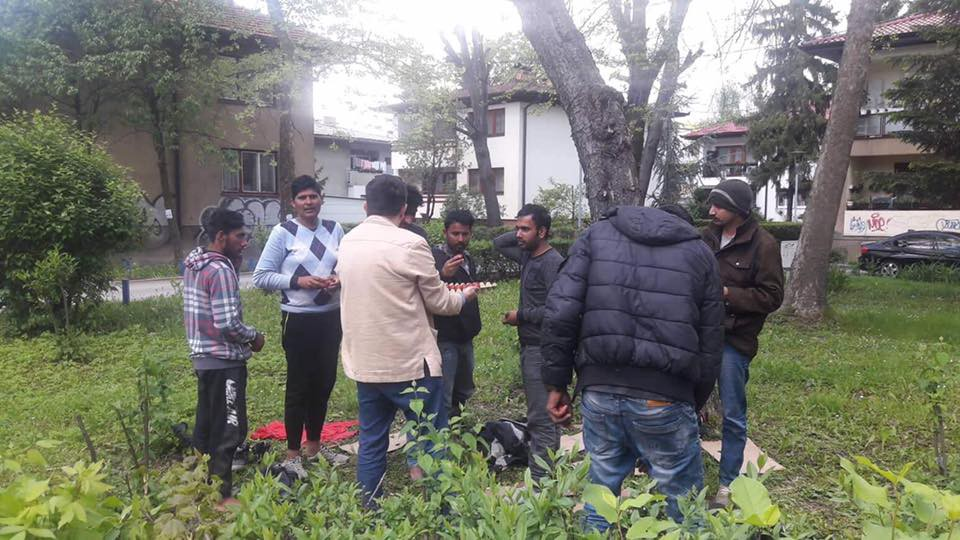
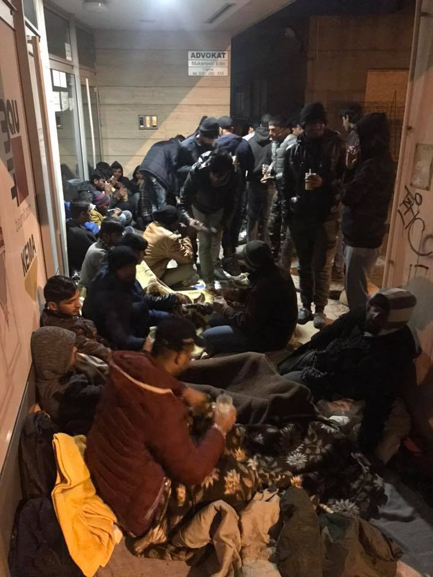
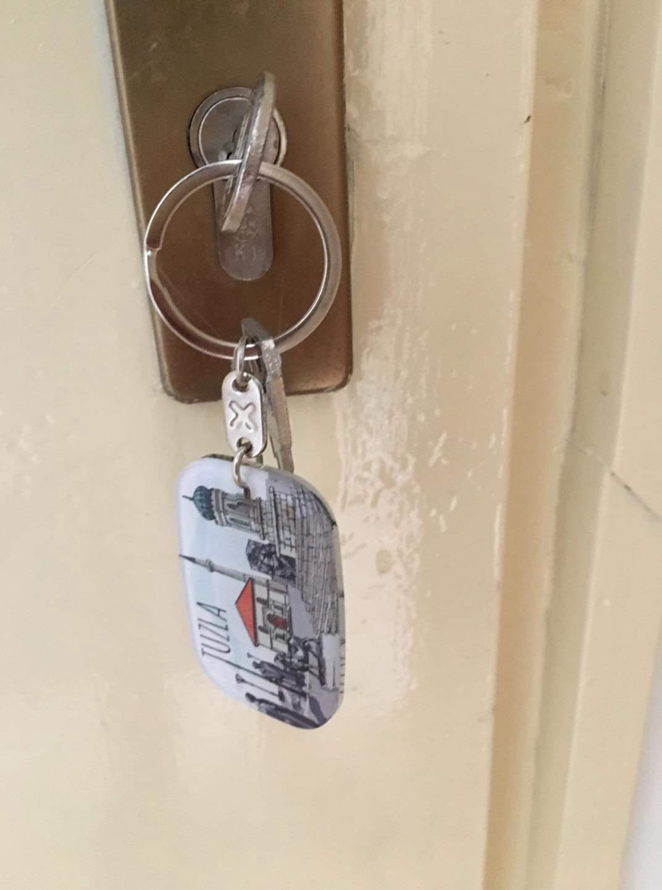
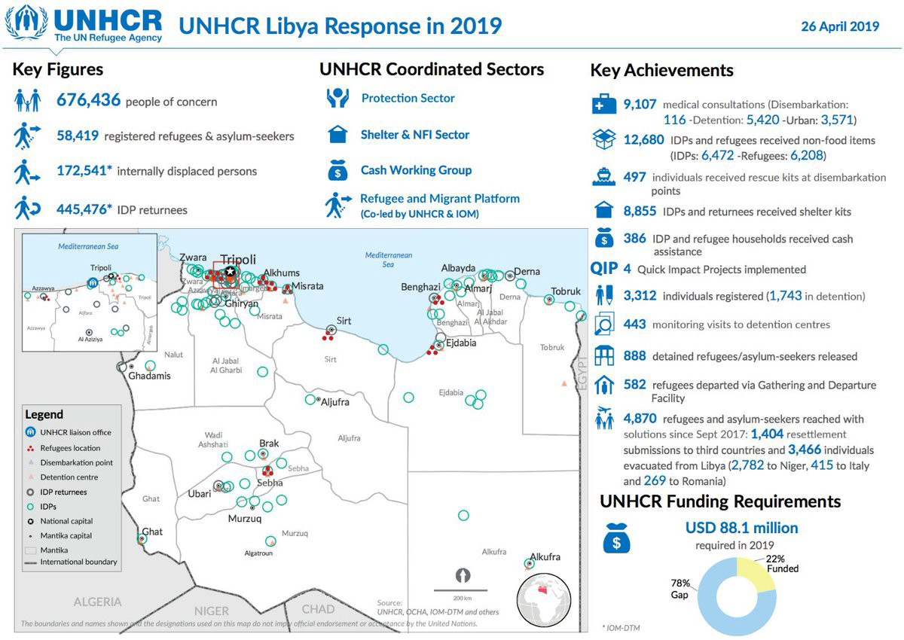
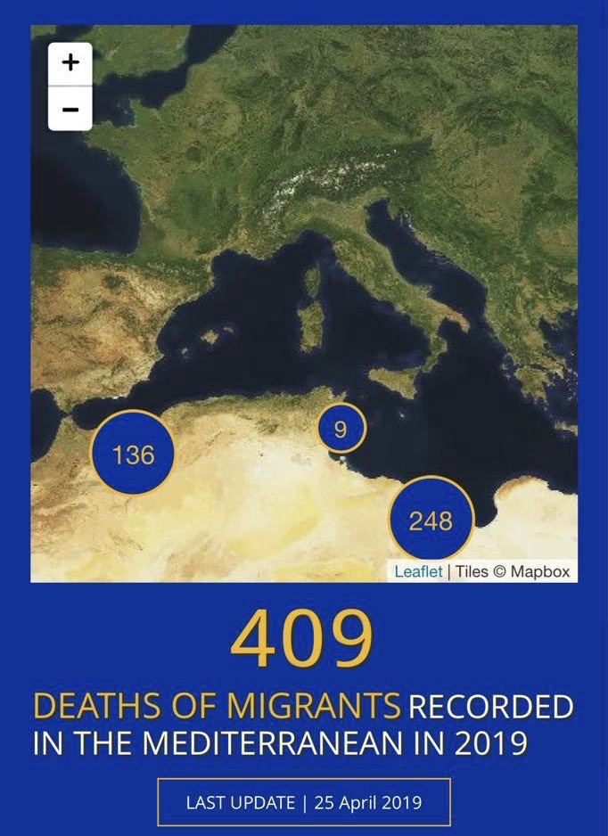

### AYS News Digest 27–28/4/19: At least 16 people died trying to reach the port of departure in Morocco
#### A truck accident causes deaths and serious injuries in Morocco // Volunteers needed in Greece // Pressure builds up on Bosnian local communities, clear strategies and human approach not in sight // Dunkirk awaits for new surge of arrivals, with no drinking water and fears of evictions // Join the protest in the Mediterranean // & more news and updates

By Panos Zacharis, via ArtAgainst
### FEATURED STORIES
#### Deadly roads along the route

**Morocco** — Crossing the Strait of Gibraltar or the western Mediterranean in unstable boats is something that comes at the end of a painful and traumatic journey that for many carries a number of abuses, exploitation from all sides and violent treatment, but also accidents\. Many people don’t even make it to the ports of departure\.

A tragic death happened on the road as a truck with about 50 people of Sub\-Saharan origin on board, in the province of Berkane, crashed\. According to [Association Marocaine des Droits Humains — Section Nador](https://www.facebook.com/AmdhNador/?tn-str=k%2AF) , they were being transferred towards Nador, presumably by a smuggler, who fled the scene\.

18people according to AMDH and at least 16 people, according to other sources, were announced dead\. In two cases of serious injuries, the people were transferred to Oujda University Hospital\. In total, 26 wounded are in Berkane hospital, the hospital reportedly informed\.

> Among the dead was reportedly a man whose two surviving children are now left without parents\. 

](assets/e4026dbe7132/1*eF54JtL5zy5I6sPEJSJejA.jpeg)

Photo: [Association Marocaine des Droits Humains — Section Nador](https://www.facebook.com/AmdhNador/?tn-str=k%2AF)

According to a study by the International Organization for Migration, people on the move from Morocco who arrive to Spain suffer the most\. Physical violence, kidnapping, forced labor, arranged marriage offers and jobs in which they weren’t paid what they were owed, are some of the worst things that reportedly almost half of those who arrived to Spain \(Morocco’s ‘migration strategy’ [partner country](https://elpais.com/elpais/2019/02/21/inenglish/1550736538_089908.html?rel=mas) \) experienced on the way\.

> This violence is usually related to kidnappings perpetrated by nomadic groups in desert areas, as well as beatings in larger cities aimed at stealing migrants’ belongings, and assaults by human traffickers in boarding areas in Algeria and in northern Morocco, _IOM confirmed\._ 

#### Everyone is failing Tuzla

**Bosnia and Herzegovina** — In spite of constant calls for some sort of strategy or at least support in provisional solutions to the late surge of people on the move passing through Tuzla, there seem to be no plans or announcements that some official support might come any time soon\. It seems that neither the regional government, nor the local politicians, and above all \(most likely due to their own strategies\) the international organisations, have done anything concrete, solid and sustainable to support the self organized locals in providing support to those in need\. With the weather getting warmer, there are more and more people arriving and, especially during the weekends when the offices don’t work, people spend the nights outside, sometimes for several nights\.

symbolic support of the local orthodox church on the occasion of their Easter celebrations

Locals are organised in terms of providing food, clothes, blankets and such but the absence of decent toilets \(and showers\) has become a growing problem that is difficult to address without the support of the officials\.

Shoes and blankets are among the most needed items there — Photo by: S\.C\.

During Sunday, there have been several groups with dozens of people arriving\. There were groups of 17, 30 and more people, including older and younger, male and female, all arriving while there are no officials to issue documents or give any sort of direction, information or support\.
The local people coordinating everything have now arranged to rent a floor of one of the houses in order to have a place where people can deliver food donations and where they would take turns in preparing meals\.

It is a matter of urgency to **at least** prolong the working hours of the office for foreigners and to create decent conditions for the people, firstly in regards to hygiene conditions and the reception site\.

#### LIBYA
### Forced to fight on front lines

“Refugees/migrants in five detention centres say they’ve been forced to assist or fight with GNA\-aligned militias since April 4, but detainees in another centre told me they had to assist LNA\-aligned militias during the last bad clashes”, reporter Sally Hayden wrote\.

At the same time, of course, the involvement of detained people in the fights has [been denied](https://aawsat.com/english/home/article/1698671/sarraj-govt-denies-recruiting-migrants-tripoli-battle) by officials\.

MSF medical teams have confirmed previous claims of violence to which the detained people were exposed to and the recent move for some people has not done much for their safety:

■■■■■■■■■■■■■■ 
> **[MSF International](https://twitter.com/MSF) @ Twitter Says:** 

> > #Libya | Evidence shows that refugees and migrants in Qasr Bin Gashir detention centre in #Tripoli were shot at and injured.

Nothing justifies such a violent assault on civilians who are trapped in a conflict zone and acutely vulnerable. 

[bit.ly/2GBCk09](http://bit.ly/2GBCk09) 

> **Tweeted at [2019-04-27 04:09:00](https://twitter.com/msf/status/1121989597548961794).** 

■■■■■■■■■■■■■■ 

■■■■■■■■■■■■■■ 
> **[Sally Hayden](https://twitter.com/sallyhayd) @ Twitter Says:** 

> > Messages from a survivor of the Qasr bin Ghashir dc shooting, who’s upset at what he feels is a cover up of what happened, &amp; wants to reiterate that none of them are safe yet, despite being moved. #libya https://t.co/ryiOMgas9y 

> **Tweeted at [2019-04-27 20:42:35](https://twitter.com/sallyhayd/status/1122239642814881795).** 

■■■■■■■■■■■■■■ 

Some statistics that speak of the situation in Libya can be seen from the UNHCR \(promo\) leaflet in response to the current situation in the country\.

■■■■■■■■■■■■■■ 
> **[Jeff Crisp](https://twitter.com/JFCrisp) @ Twitter Says:** 

> > The Universal Declaration on Human Rights contains 30 Articles. Almost every single one of them has been violated in the case of refugees and migrants detained in Libya: https://t.co/gzxFtRpASx 

> **Tweeted at [2019-04-28 13:37:16](https://twitter.com/jfcrisp/status/1122494994261135360).** 

■■■■■■■■■■■■■■ 

#### THE MEDITERRANEAN — Search and rescue

### Protest in the Mediterranean

To keep witnesses to this practice away from the crime scene, sea rescue organizations like MISSION LIFELINE are criminalized\. Their vessels are stopped, diverted, and even grounded\.

> We do not accept this cruel policy\. It is our duty to oppose such atrocities\! 

That’s why they are planing a protest: The \#YACHTFLEET, a demonstration with ships on the ocean, with the intent to leave a mark “exactly where politicians don’t want us to be — in the Mediterranean Sea\. We will force the EU to pay attention\.”
The possibility of discovering people in distress at sea during this demonstration cannot be ruled out\. **It is essential that all members involved are fully prepared for this situation\.** Therefore, there will be a training and a briefing session with all participants in advance, to be able to react appropriately in an emergency\.

> **Here is the course of action:** 
 

> **By June 10, 2019\- Preparation and individual training complete** 
 

> **June 10–11, 2019\- Meeting of all participants** 
 

> **June 12–15, 2019 — Joint training** 
 

> **June 16–21, 2019 — \#YACHTFLEET Demo in the central Mediterranean** 
 

> **By June 21, 2019\- Return to port and debriefing** 
 

> **June 25, 2019 — Departure of all participants** 

Contact Lifeline if you want to participate: info@mission\-lifeline\.de

■■■■■■■■■■■■■■ 
> **[Matteo Villa](https://twitter.com/emmevilla) @ Twitter Says:** 

> > ⛔️🇪🇸 LA FINE DEI SALVATAGGI.
E anche in Spagna, la ritirata è quasi completa.

Al Salvamento marítimo, a corto di personale, viene sempre più spesso intimato di attendere l’intervento marocchino, anche quando la vita dei #migranti è in pericolo. [europasur.es/campo-de-gibra…](https://www.europasur.es/campo-de-gibraltar/cgt-recorte-personal-salvamento-maritimo_0_1348965460.html) 

> **Tweeted at [2019-04-27 11:43:15](https://twitter.com/emmevilla/status/1122103912461475841).** 

■■■■■■■■■■■■■■ 

The Salvamento Marítimo, short of staff, is more and more often instructed to await the Moroccan intervention, even when lives are in danger\.

■■■■■■■■■■■■■■ 
> **[Sergio Rodrigo](https://twitter.com/SRodrigoruiz) @ Twitter Says:** 

> > #España deja en manos de #Marruecos la búsqueda de una patera con 53 migrantes en Alborán. Frontex y Salvamento han salido a la zona pero aseguran que es el Centro de Coordinación de Rabat el encargado de su búsqueda https://t.co/NlKwTBcwm6 

> **Tweeted at [2019-04-27 17:03:05](https://twitter.com/srodrigoruiz/status/1122184403675959297).** 

■■■■■■■■■■■■■■ 

A reminder of the deal Italy has with Libya, now the MO has transferred to Spain and Morocco — the search and rescue teams were ready to head and find a missing boat with 53 people on it close to the Alboran, but they were told the Rabat official coordination team is in charge of the search and they had to stand down\.

A boat with 15 people \(6 minors among them\) [successfully landed](https://cadenaser.com/emisora/2019/04/27/radio_cartagena/1556399995_338536.html?ssm=tw) to Spain, close to Murcia, while 54 people were [brought safely](https://www.efe.com/efe/andalucia/almeria/rescatan-a-54-subsaharianos-de-una-patera-localizada-en-el-mar-alboran/50001123-3962783) to the coast of Malaga by the Salvamento Maritimo team\.
#### GREECE

\- **1–2 doctors needed in Thessaloniki from this weekend to May 12th** 
**\- a nurse needed in Thessaloniki from May 2nd to May 15th** 
**\- a doctor needed in Athens from May 14th onwards** 
**\- nurses needed in Athens from May 12th onwards** 
**\- a doctor needed on Lesvos from May 5th to May 31st**

[Medical Volunteers International e\.V\.](https://www.facebook.com/medicalvolunteersinternational/?tn-str=k%2AF&hc_location=group_dialog) are urgently looking for volunteers to join them\. If you can fill one of these gaps, please fill in the application form on their website: [https://medical\-volunteers\.org/contact/](https://medical-volunteers.org/contact/?fbclid=IwAR3RshRWTHLqRs91vwppURlIVWiLTJrJRj2gG6Doh_Vw4N4NPGwec-goHqI)

Also, Drop in the Ocean is looking for volunteers to work on **Samos** \! 
They will help to establish an education programme for children aged 7–12\. Find more information [here](https://www.drapenihavet.no/en/volunteer/) \.

[Aegean Boat Report](https://www.facebook.com/AegeanBoatReport/?__tn__=%2CdkCH-R-R&eid=ARBnAdibs5pQ2IY9ezm1n6deQ0PVaBvutcqFBVDsjukoQZu4HShqgV4plSiGxYobyKRfMNMgkuuS6wN6&hc_ref=ARQUnX7uetVfaS0h2pbvVNBd9s8aEkhbO2meegC6JRsYIpTpJzNL-e7Mw1rc7w2lH3g&fref=nf) report on the increased number of arrivals to the Aegean islands, follow their page for more detailed information\.
#### BOSNIA AND HERZEGOVINA
### Bihać — Velika Kladuša

The government of the Una Sana canton has announced that this Monday and Tuesday a delegation will visit the centres in Bihać, Cazin and Velika Kladuša and will communicate their decisions on Tuesday morning, regarding the displacement of the people from the so called camps in Velika Kladuša \(Miral\) and Bihać \(Bira\) \.

> Before the situation worsens, it is time we get out of our comfort zones and expert chairs that hold no responsibility, and to look at the real picture\. Migrants, too, are peoplewith their flaws, virtues and differences between individuals, and the ones to blame for a dysfunctional system are among us\. These are people chosen and paid to run crisis situations\. They must bee the experts who can handle this situation, or — if they don’t — they should resign\. Because they answer to us\. — _Mirnes Ćerimović_ 

A **mobile clinic started running this weekend in Velika Kladuša** , and the doctor who previously already worked in the area, on the first day documented multiple cases of respiratory infections, scabies, otitis media, skin diseases and different wounds on the 74 people he checked\.
The medical help is running alongside other volunteer activities in Kladuša, and setting up of washing machines is next in the plan, activists announce\.
#### AUSTRIA
### Ministry gaining the upper hand

The recently proposed [bill](https://l.facebook.com/l.php?u=https%3A%2F%2Fecre.us1.list-manage.com%2Ftrack%2Fclick%3Fu%3D8e3ebd297b1510becc6d6d690%26id%3D8b9b33bada%26e%3Dc131869ccd%26fbclid%3DIwAR1g5lOc9eI-VHHtECo3O6QJpe8IMnvk9PlY6oFLYv7zeT8NHepIhmG3gGU&h=AT3KXSbwS9oAW8jtfhBzWQtWTvTh8EqQ4QwscvsKz9Dln-5306pJRgHCruUuJ8clSiq7J15Rx_i_BOWHNXKCM4zCl1NyNf83cWIfKCUFhFqr4v6Sqn1sCFiQU5pnutWA1Y0T0rc) on the establishment of a Federal Agency for Supervision and Support Services \(BBU\) is under a lot of criticism\. 
The Agency would be in charge of providing basic care, legal assistance, assistance for returns, monitoring deportations and providing interpreters and translators during the asylum procedure\. In this way they intend “to increase the efficiency of the federal minimum guarantee \(“ _Bundesbetreuung_ ”\), to provide asylum seekers with independent legal assistance and to promote voluntary returns through effective return counselling\.”

Diakonie Austria [raises](https://ecre.us1.list-manage.com/track/click?u=8e3ebd297b1510becc6d6d690&id=d69d6d4fbe&e=c131869ccd&fbclid=IwAR3wTQa_30r72Hmgm24rlUEfY26QTVLj6GtjgaiuTB2nAILntvBX3CwLiV4) serious concerns and criticises that the Agency is not institutionally independent as it falls under the direct responsibility of the Federal government and is influenced by the Ministry of Interior, which is also responsible for the Federal Office for Immigration and Asylum\.
They warn that it will deteriorate the asylum procedure and create an inaccessible asylum system in which civil society organisations can no longer intervene\.
#### FRANCE
### Dunkirk

Over 300 tents are now pitched outside the temporary emergency centre in Dunkirk, [Mobile Refugee Support](https://www.facebook.com/MobileRefugeeSupport/?__tn__=%2CdkCH-R-R&eid=ARCPQy35LaO4T-Dhzy34ZQz25-7cHvpu1BV1aqH42V0lAfAB1A8XIEjYgsh-mLIRRsKb4g-OdEFZ6J0z&hc_ref=ARTu_WUG1_DlACSH5xc2DX4BKh5Virqi3t4T5nXv89PsqtFD4yLcvmGByVxUW6x27Q8&fref=nf&hc_location=group) reports\.
With numbers of displaced people increasing at the rate they are, those on the ground are anxious about what is to come regarding possible new evictions\. On top of that, **tap water in the Dunkirk area has been declared unsafe to drink** over the past week\.
The group invites potential volunteers to contact them and/or support their work on the ground through donations\.

](assets/e4026dbe7132/1*i-1aMR7F-CypCnvEqduU8Q.jpeg)

Photo: [Mobile Refugee Support](https://www.facebook.com/MobileRefugeeSupport/?tn-str=k%2AF&hc_location=group_dialog)
#### AYS and the Daily News Digest — how to get involved?

**We strive to echo correct news from the ground through collaboration and fairness\. Every effort has been made to credit organizations and individuals with regard to the supply of information, video, and photo material \(in cases where the source wanted to be accredited\) \. Please notify us regarding corrections\.**

**Apart from daily news in English, we also publish weekly summaries in Arabic and Persian\. Find specials in both languages on our medium site\.**

**If there’s anything you want to share or comment, contact us through Facebook, Twitter or write to: areyousyrious@gmail\.com\.**

**We’re open to expanding our team of volunteer researchers, editors and info gatherers\.**

_Converted [Medium Post](https://medium.com/are-you-syrious/ays-news-digest-27-28-4-19-at-least-16-people-died-trying-to-reach-the-port-of-departure-in-e4026dbe7132) by [ZMediumToMarkdown](https://github.com/ZhgChgLi/ZMediumToMarkdown)._
