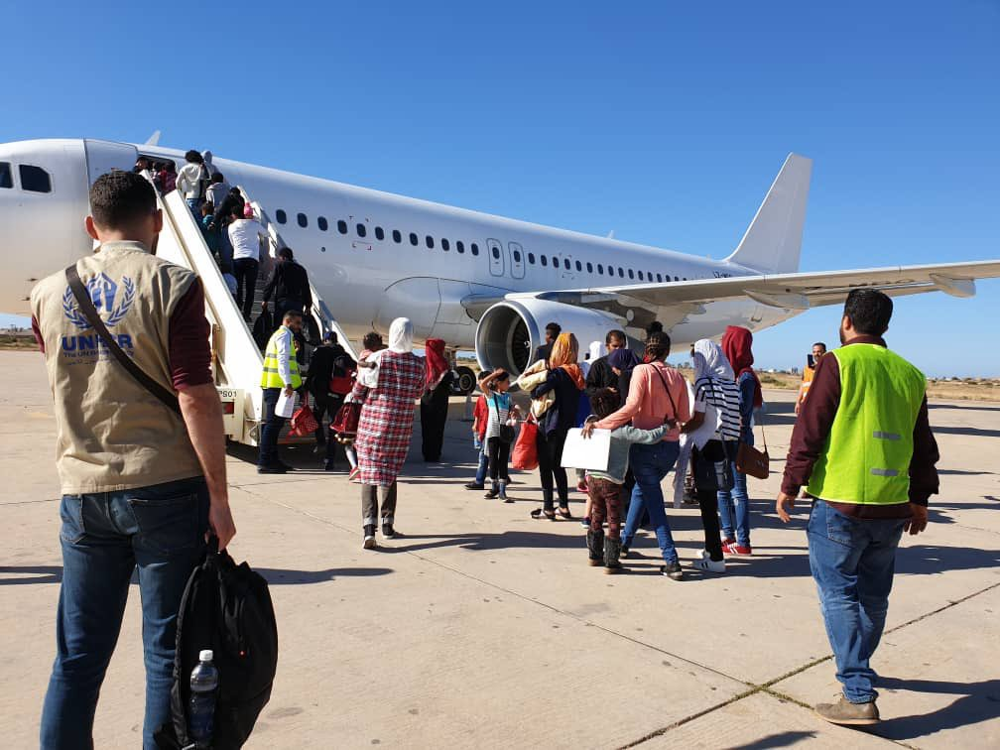
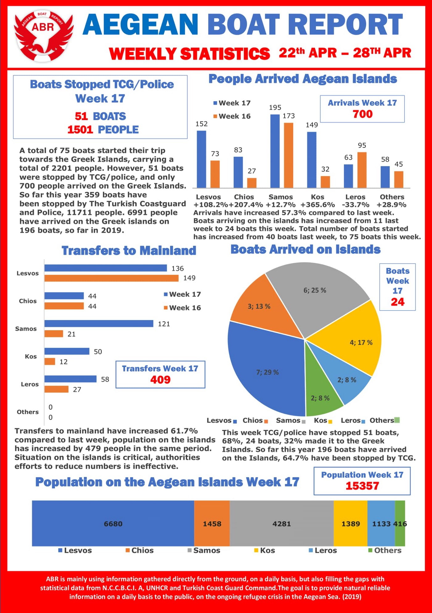
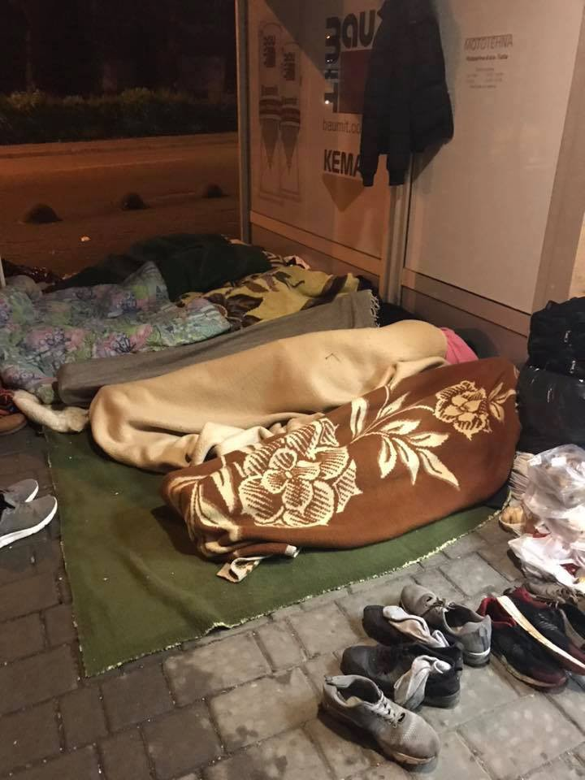

### AYS Daily Digest 30/4/19: People previously pushed back to Libya evacuated to Italy, in bizarre exception…
#### _The aftermath of a deadly accident in Morocco // Masked attackers against Turkish Asylum seekers in Greece // New reception centre in Bosnia // Needs in France, much more…_

Photo Credit: UNHCR Libya

“But you can’t be so idealistic; it’s time to be logical; keep a cool head” I think anyone who has witnessed injustice has had this phrase tossed at them nonchalantly across the table at a dinner party or at a bar\. We are living in a world where ignorance is not only bliss, but rather being rebranded as a kind of intelligence\. “There’s so much fake news out there, it’s hard to know what the real story is…” “I just think it’s too easy to get sucked into echo chambers, so we should hear the other side before jumping to conclusions\.” “You’re just gonna get burned out — time for some self care\!”

Although self care and ensuring that our own mental health doesn’t overshadow the needs in front of us \(which can often mean taking a time out\) are important, we also can recognized when these concerns are being brought up in good faith versus bad faith\. Let us analyse the common request to have faith in the system — this is politics, we can’t be too emotionally invested, right?

IOM, UNHCR, Italy and Libya evacuated nearly [150 individuals from detention centres in Tripoli to Italy on Monday](https://nationalpost.com/pmn/travel-pmn/146-refugees-were-evacuated-from-libya-to-italy-in-a-joint-operation-between-unhcr-the-un-refugee-agency-and-italian-and-libya) \. Due to the fighting and destabilized situation in Tripoli, IOM and UNHCR have been trying to get individuals away from detention facilities\. These 147 \(from Eritrea, Sudan, Somalia, Syria, and Ethiopia\) will be housed in refugee accommodation centres in Italy\.

Excellent analysis provided by Emad Badi

■■■■■■■■■■■■■■ 
> **[Emadeddin Badi](https://twitter.com/emad_badi) @ Twitter Says:** 

> > This does not absolve the #EU from its casual contraventions of non-refoulement &amp; its overall short-termist/securitized/destabilizing approaches to manage migration from #Libya, but at least these 300 people will hopefully be able to start a better life in #Italy, away from war. 

> **Tweeted at [2019-04-29 19:30:30](https://twitter.com/emad_badi/status/1122946276922933248).** 

■■■■■■■■■■■■■■ 

However, let’s take things a bit more slowly — due to the intense conflict in Libya, human rights organizations have been campaigning to declare Libya not a safe third country since at least 2017 when [IOM and media published a report on slave trading and attacks](https://www.iom.int/news/iom-learns-slave-market-conditions-endangering-migrants-north-africa) on people returned to Libya under the EU\-Libya agreement\. People detained in Tripoli repeatedly reported being subjected to shelling as a result of the battle for the city\. Furthermore, Sally Hayden excellently reports on how refugees in these centres have been forced to fight for various militias passing through\. Read more [here](https://twitter.com/emad_badi/status/1122946276922933248)

As of April 26th, the head of the GNA’s Ministry of the Interior stated that the Libyan Coast Guard \(the entity that bears primary responsibility for conducting SAR operations in the Mediterranean near Libya\), is effectively \(for [SAR operations\) completely incapacitated due to the conflict](https://twitter.com/emmevilla/status/1121802052127080450) , meaning that there is effectively no SAR operations happening in Libyan waters since mid\-April\. Yet, in spite of this, a boat was rescued by a fisherman and the 23 people aboard it were returned to Libya\.

■■■■■■■■■■■■■■ 
> **[Alarm Phone](https://twitter.com/alarm_phone) @ Twitter Says:** 

> > BREAKING: Around 6pm CEST we were informed by a relative of one of the 23ppl, that they had been rescued by fishermen &amp; returned to #Libya. We informed @[guardiacostiera](https://twitter.com/guardiacostiera) shortly after. We hope it is true that they all survived, but we worry for their safety in the Libyan warzone. 

> **Tweeted at [2019-04-30 16:52:59](https://twitter.com/alarm_phone/status/1123269023817453574).** 

■■■■■■■■■■■■■■ 

On the 1st, 70 people were rescued, according to the Libyan Coast Guard, and returned, although the details remain very murky\.

■■■■■■■■■■■■■■ 
> **[coast guard libya](https://twitter.com/CoastGuardLIBYA) @ Twitter Says:** 

> > Seventy migrants have been rescued and are now on their way to take them to the receiving points of migrants, details of the operation later https://t.co/6Xbvz78iuH 

> **Tweeted at [2019-04-30 19:23:00](https://twitter.com/coastguardlibya/status/1123306778748424192).** 

■■■■■■■■■■■■■■ 

There _are_ boats with highly trained SAR personnel on board, yet the EU won’t let them into the sea, on the charge of their facilitating illegal migration\. However it was only last year that the former head of the GNA [coast guard was blacklisted by the UN for participation in human trafficking](https://www.maritime-executive.com/article/un-blacklists-libyan-coast-guard-leader-for-migrant-smuggling) \.

So we have IOM and UNHCR flying people who were “rescued” and returned to Libya by the Libyan Coast Guard which had connections to human trafficking rings \(and were not able to be rescued by civilian SAR teams on the basis that these teams are facilitating illegal migration\), then these people returned have to wait out a terrifying ordeal witnessing additional horrors until they are finally evacuated to the place where they had tried to escape to initially…\.all to the tune of countless billions of euros wasted in this pointless back and forth\. Perhaps pointless is actually too charitable a term, as it does have a point — to reduce the movement of people at any cost\*

\*provided that cost is tallied in the deaths of those trying to escape horrible situations\.

■■■■■■■■■■■■■■ 
> **[Flavio Di Giacomo](https://twitter.com/fladig) @ Twitter Says:** 

> > Since January 722 #migrants arrived by boat to Italy,308 to Malta
1092 tried to leave but were returned to Libya
Total number of missing/death is 257
Death rate is abt 12%
In 2018 it was 3,5%
In 2017 it was 2,6%

Crossing the Central Mediterranean is now more dangerous than ever 

> **Tweeted at [2019-04-30 10:51:21](https://twitter.com/fladig/status/1123178018346872832).** 

■■■■■■■■■■■■■■ 

But don’t worry, you need to keep calm — the system makes sense, right?
### MOROCCO

33 people who were in a horrific accident several days prior remain in police custody\. [Human rights advocates](https://www.facebook.com/AmdhNador/posts/2319992091546386) are concerned about the results of keeping already traumatized people in a traumatizing situation\. [Association Marocaine des Droits Humains — Section Nador](https://www.facebook.com/AmdhNador/?tn-str=k%2AF) states that families who are looking for their loved ones in the aftermath of the accident which claimed 19 lives can contact them\.
### SEA

Otherwise Salvamento Maritimo reports that there were two rescues on the 30th, one of 34 people, the other of 46\.

■■■■■■■■■■■■■■ 
> **[Salvamento Marítimo](https://twitter.com/CGTsalvamento) @ Twitter Says:** 

> > La tripulación de la Salvamar Spika recoge a 70 millas de Almería a 34 personas de la patrullera de G.C Rio Segura.Seguimos sin comprender esta nueva estrategia de @[interiorgob](https://twitter.com/interiorgob) @[salvamentogob](https://twitter.com/salvamentogob) @[fomentogob](https://twitter.com/fomentogob) de transbordos en la mar que ponen en riesgo muchas vidas #masmanosmasvidas https://t.co/yqDsP2YxLR 

> **Tweeted at [2019-04-30 20:55:07](https://twitter.com/cgtsalvamento/status/1123329958057738240).** 

■■■■■■■■■■■■■■ 

■■■■■■■■■■■■■■ 
> **[Salvamento Marítimo](https://twitter.com/CGTsalvamento) @ Twitter Says:** 

> > Anoche los 4 tripulantes de la Salvanar Hammal rescataron a 46 personas que viajaban a bordo de una patera . Buen trabajo compañeros!  #masmanosmasvidas 

> **Tweeted at [2019-04-30 20:59:05](https://twitter.com/cgtsalvamento/status/1123330957589778432).** 

■■■■■■■■■■■■■■ 

Aegean Boat Report notes that one boat has arrived to Kos, with 32 people\.

Otherwise, please note their statistics for the [week below](https://www.facebook.com/AegeanBoatReport/posts/565754103947698?hc_location=ufi) \.

### GREECE

Keep Talking Greece reports that Turkish asylum seekers were attacked and pushed back from crossing the Evros river\. The group was originally in total of 15, and initially did cross, but were immediately attacked upon setting foot on Greek soil, retreating across the river where Turkish Security Forces apprehended a family of four\. The remaining eleven attempted another crossing and successfully hid until they were taken into custody by Greek Police after discovery\. For more, go [here](https://www.keeptalkinggreece.com/2019/04/30/turkish-asylum-seekers-evros/) \.
### BOSNIA AND HERZEGOVINA
#### Tuzla

Many people are still coming through Tuzla, where the local community continues to rally and support them, as we reported earlier\. Below is a photo of people sleeping in front of the Foreigners office\. Due to May 1, places where people can register are closed, putting more stress on local support structures made up entirely of local people’s common efforts\. During thee day, a family with 6 children also stayed outside, waiting\.

Tuzla, photo by local volunteers

This comes around the same announcement where another tends of millions of Euros will come from the EU to help support “migration management” in Bosnia\.

■■■■■■■■■■■■■■ 
> **[EU NEAR🇪🇺](https://twitter.com/eu_near) @ Twitter Says:** 

> > 🇪🇺🇧🇦#EU supports #BosniaAndHerzegovina in managing #migration flows with additional €13 million👉 [europa.eu/!Tb33gx](https://europa.eu/!Tb33gx) https://t.co/rvBpfRukZn 

> **Tweeted at [2019-04-30 10:16:06](https://twitter.com/eu_near/status/1123169147557502976).** 

■■■■■■■■■■■■■■ 

Additionally, another reception centre is slated to be built in Bosnia, but this time much more near the border\. Izačić is the location, and it is but 3 kilometres from the Croatian border\. Previous reception centres were located more towards the centre of the country\. This was announced [in a press conference](https://www.ft.com/content/549a94b0-e9f4-11e6-893c-082c54a7f539) also detailing the official statement on the situation in ‘camps’\.
### PORTUGAL

In ECRE’s update for Portugal in 2018, there have been significant improvements in the legal framework as well as important precedents set\.

One judgement supports that an applicant must have time to respond not only to the “statements provided during the Dublin interview, but also to a report containing the information that underlies the transfer decision\.” A transfer decision was anulled on this basis\.

Additionally, there was one case where transfer to Hungary was annulled on the basis of the assessment that the Hungarian legal system would not fairly assess the applicant’s claim\. Similarly, although returns to Italy were varied, there was a case where a transfer was anulled as the authorities failed to properly execute an assessment of if the Italian court system would treat the applicant fairly\.

Other relevant information in the report is that, as expected, the Portuguese refugee reception centre is overcrowded\. For a more detailed report on the situation, please refer to the [original report](https://www.ecre.org/aida-2018-update-portugal/) \.
### FRANCE

[Vestiaire pour les migrants\. Paris](https://www.facebook.com/vestiairemigrants/?__tn__=%2CdkCH-R-R&eid=ARC3PDY6weQPBeaXUmn7Lnv9smPmh2veAnROTh7HP64kkb306YAa7XvLpiR2zpnRH8kPeXh9p4ZBdav9&hc_ref=ARQJHIU7lkiEq4j6RHHKnD5n9sjQwm1nF0ZD_2jZyPyLoT7RWx0ccl0e0JZSczc2NN4&fref=nf&hc_location=group) is requesting that people go to specific pharmacies \(L’envoyer : Église St Bernard de la Chapelle/ Vestiaire pour les Migrants\. 6, rue St Luc 75018 Paris\. You can contact also on 06 03 02 83 72\) \. where they have discounted prescriptions for desperately needed medical supplies\. “stromectol, flammazine, xyzall, ascabiol, ascaflash, dexeryl, A\-par, spregal ou génériques\.”

Side by Side with Refugees reports that women and children who were housed in temporary winter accommodation have been evicted as it is “warm enough” now… presumably to get evicted by whatever shelter they manage to erect within a few months by Police as punishment for not being in housing\. For a longer report, go [here](https://www.facebook.com/SidebySiderefugees/posts/1539892536146018?hc_location=ufi) \.

**Apart from daily news in English, we also publish weekly summaries in [Arabic](%D8%A7%D9%84%D8%AA%D8%BA%D9%8A%D9%8A%D8%B1%D8%A7%D8%AA-%D9%81%D9%8A-%D9%82%D8%A7%D9%86%D9%88%D9%86-%D8%A7%D9%84%D9%84%D8%AC%D9%88%D8%A1-%D9%81%D9%8A-%D8%A7%D9%84%D8%AF%D9%86%D9%85%D8%A7%D8%B1%D9%83-b99e429d54ad) and [Persian](%D8%B9%D9%88%D8%B6-%D8%B4%D8%AF%D9%86-%D9%82%D9%88%D8%A7%D9%86%DB%8C%D9%86-%D9%BE%D9%86%D8%A7%D9%87%D9%86%D8%AF%DA%AF%DB%8C-%D8%AF%D8%B1-%D8%AF%D8%A7%D9%86%D9%85%D8%A7%D8%B1%DA%A9-7b984cac7a86) \. Follow the links to read and share the ones from the week of March 4–10\.**

**We strive to echo correct news from the ground through collaboration and fairness\. Every effort has been made to credit organizations and individuals with regard to the supply of information, video, and photo material \(in cases where the source wanted to be accredited\) \. Please notify us regarding corrections\.**

**If there’s anything you want to share or comment, contact us through Facebook or write to: areyousyrious@gmail\.com**

_Converted [Medium Post](https://medium.com/are-you-syrious/ays-daily-digest-30-4-2019-821663215470) by [ZMediumToMarkdown](https://github.com/ZhgChgLi/ZMediumToMarkdown)._
