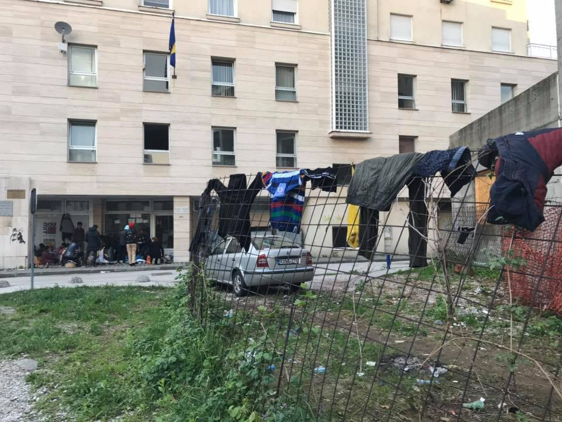
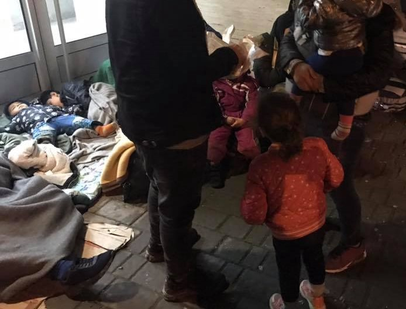
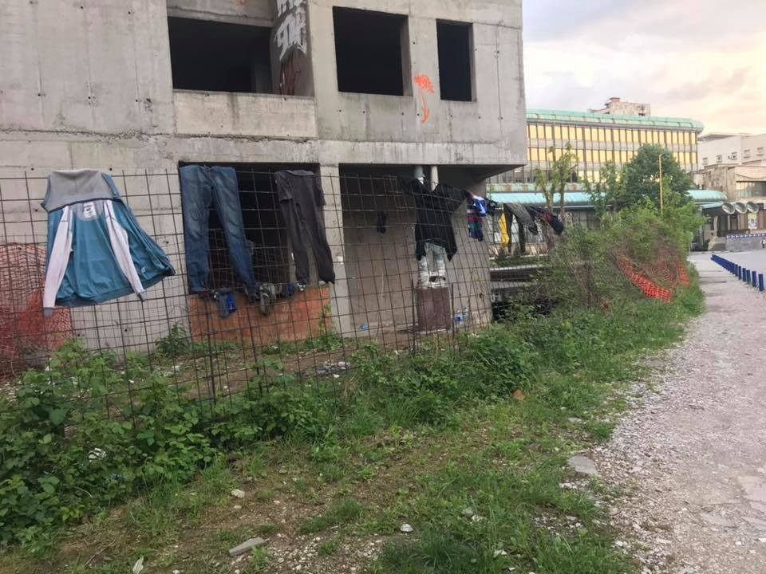
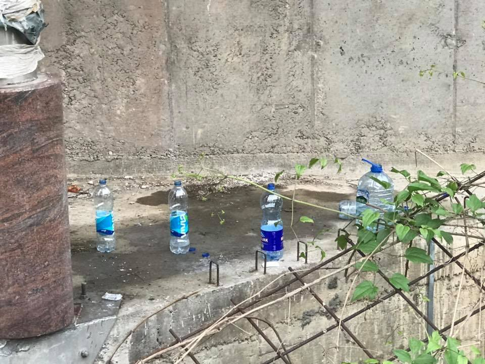
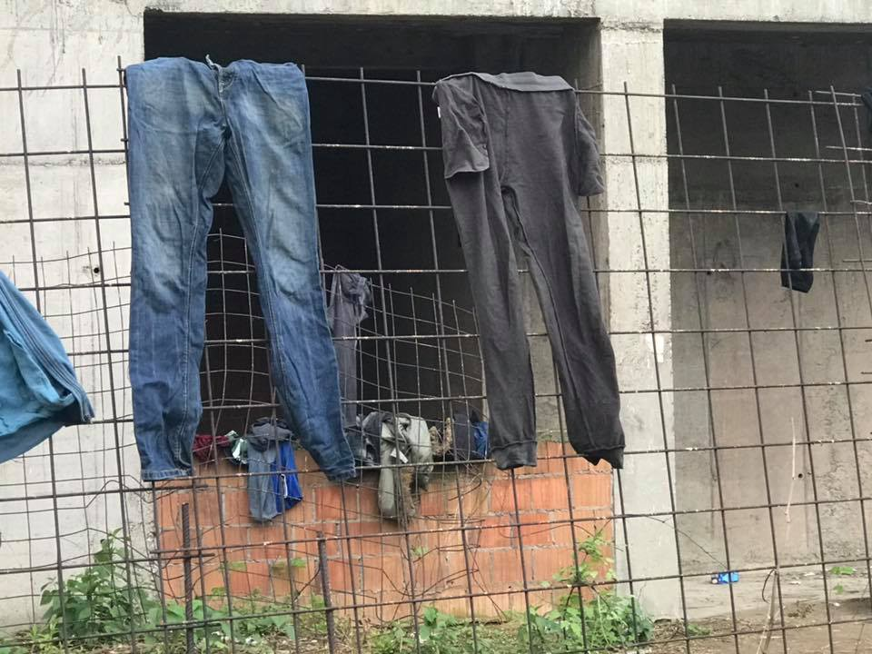
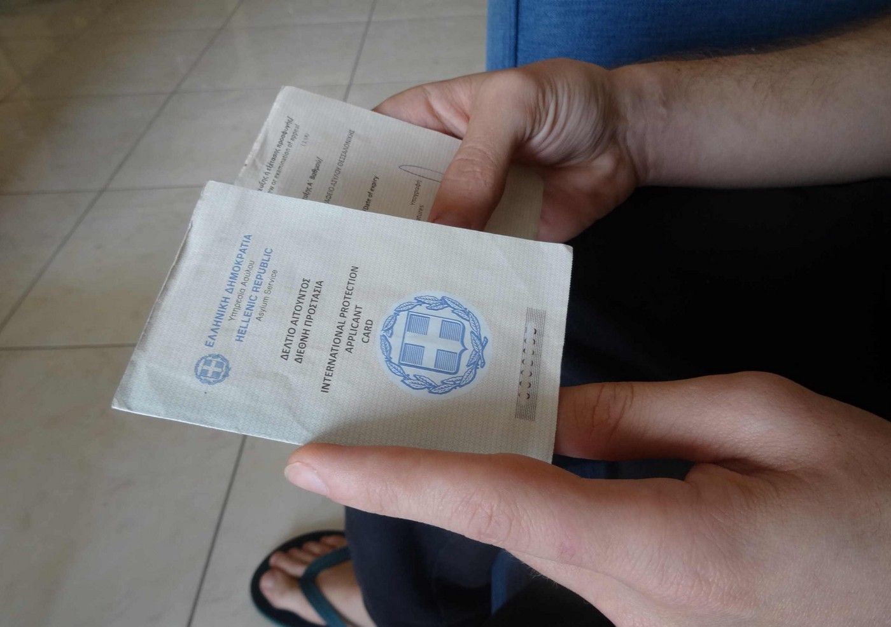

### AYS Daily Digest 1/5/19: \(Save the\) Children Sleeping Rough in Tuzla
#### Things worsen for people arriving and those helping in Tuzla / Slovenia takes part in the push back ‘domino’ / More people are embarking on the overseas journey / Protest in Belgium / updates, news and calls for aid & volunteering

Tuzla \(Photo: local volunteers\)
#### FEATURED STORIES
### Additional pressure piles up on local volunteers

**Tuzla \(Bosnia and Herzegovina\)** — It has been months since a couple of Tuzlans started assisting people on the move passing through their city on their way towards the western part of Bosnia and Herzegovina\. Since then, as we keep reporting, the number of those arriving, as well as the number of locals who joined in helping have risen\. However, despite all efforts, many warnings and calls for help \(as well as taking up responsibility\), none of the addressed institutions or officials have done anything concrete for things to change\. No international organisation comes to support the efforts of locals feeding and supplying people with everything they need, or to check the state of people traveling \(the reason these organisations exist in the first place\), to offer solutions to the growing fear of health hazards, or to influence the ones who can make the crucial decisions\. This is why there are more and more photos and accounts from Tuzla that speak of yet another case of neglect, ignorance and what seems like a deliberate decision to abandon both the ones arriving, and those \(still\) willing to help them\.
A local volunteer wrote this today, perhaps best describing what is happening:

> The migrant story is getting a new dimension, in the centre of Tuzla\. We have warned about this xy times\. Tents come next\. It seems like one would need a special cistern to clean up the feces in the nearby building\. I don’t even look to see what the situation is like around the other buildings, but it’s obvious the neighbors don’t like the whole situation, which is understandable\. What we can’t understand is that they express it from time to time by yelling at some of the volunteers — “take them home\!”\. What they don’t understand is that we didn’t decide to install the Foreigners office here, nor do we bring people here, and they _will_ sit there until they receive their paper\. Speaking of home, we would like to bring them home, but even for that we need an official permission\. This way, we are limited in every possible way\. 
 

> It’s been a long time that we’ve been suggesting 24hour shift of the Office, so people would not have to sleep rough and the number of people would not grow\. Imagine when this office doesn’t work for a few days for the holidays, or during the weekend, and people arrive non stop\. I am sorry for the people who work there, too, because they also suffer due to inadequate reaction\. The fear of the imaginary, hate speech in the social media, superficial reports in the media who don’t focus on the problem, gossips and hear\-say\. \.all of that only deepens and complicates things both for migrants and for us\. 
 

> Imagine those families with children sitting there for two days … 

Children sleeping in front of the Office for foreigners in Tuzla \(All photos taken by local volunteers from Tuzla\)

> In the past months we have managed to prevent more problems, but now it is getting more and more difficult\. We feed them clothe them and direct them to the Office\. These are human beings and this must be in the first place, and not a 1000 times ‘why’\. They are here, whatever someone might think\. Besides, it is also about the principles and reputation of our city and state\. The rules change all the time, only to the damage of migrants, who are already tortured enough, but also for the entire community\. As a result you have the existing situation and you see this: 

All photos taken by local volunteers from Tuzla
### Number of people allowed to ask for asylum downsized, push backs continue in Slovenia

**Slovenia\-Croatia border** — While their Croatian counterparts catch international attention with their inhumane approach towards people at the border, but also those in different cities attempting to realize their human and international rights, the Slovenian police has silently been working hand in hand with them\. According to the official statistics, there were 9,100 illegal border crossings registered last year from Croatia to Slovenia\. Police practice started to change sometime around June last year\. Under the **readmission agreement between Croatia and Slovenia** , the Slovenian police started practicing collective expulsions working in collaboration with their colleagues from Croatia, in mixed police patrols\. 
From May 25, Slovenian activists claim, Slovenian police would return most of the people they encountered at the border\. The Croatian police didn’t confirm existence of such collaboration, but the agreed instruction was such\. People would then be returned by the Croatian police back to Bosnia and Herzegovina, more often than not, in violent push back practices — sometimes after beatings, after burning people’s shoes, taking their possessions and stripping them of the remains of dignity they still were left with\. 
At the Slovenian border police station Črnomelj \(the closest one to Velika Kladuša\) in May 2018, 98% of people who were crossing the border \(a total of 397\), were allowed to apply for asylum, 371 people did so\. Only a month afterwards, in June, just 3% of the people who crossed the border were able to apply for asylum — it means that out of 412 people in total, **only 13 were allowed to ask for international protection** \.

The average percentage of people who were able to apply for asylum in the period from June to December 2018 in the station of Črnomelj was 14% \. There is no official documentation available to us to corroborate this, but the Slovenian police has been using the readmission agreement from 2006 in order to expel people to Croatia, and subsequently to Bosnia and Herzegovina\. **The same practice continues on the border** \.

Activists from Slovenia who have been monitoring and documenting the situation say that on average, people walk from Velika Kladuša or Bihać \(BiH\) to Slovenia for 10–15 days, and due to being very exhausted, many are caught by the border police patrols\. As the police and official pressure piles up, there are fewer activists available to organize help\. 
The people are taken to the police station, their information, photo and fingerprints are taken there and, what is particularly worrying, **the police translators act as interrogators\.** People are held in cells or containers for a few days and the conditions usually depend on the will and wit of the individual police officers deployed in the station\. They are normally afterwards taken by the Croatian police back towards the border with Bosnia and Herzegovina and — pushed back\.

In 2018, out of the 9,100 people who crossed the border to Slovenia, according to the bilateral agreement data, **4,600 were expelled \(pushed back** \) to Croatia\.

This is just a tiny part of the information collected and analyzed by the activists from Slovenia who have managed to establish communication with people on the move, having intervened many times with the police to allow them to ask for asylum\.

**They have documented most of the push back cases that they published in a valuable special report we will publish separately\.**
#### SEARCH AND RESCUE

■■■■■■■■■■■■■■ 
> **[MSF Sea](https://twitter.com/MSF_Sea) @ Twitter Says:** 

> > BREAKING: Less than 48 hrs after UNHCR evacuated 146 #refugees &amp; #migrants out of #Libya, another 98 people were forced back to the country after being intercepted at sea. They disembarked in Khoms around 2am today, where MSF provided medical care. They are now back in detention. 

> **Tweeted at [2019-05-01 06:58:41](https://twitter.com/msf_sea/status/1123481853392977921).** 

■■■■■■■■■■■■■■ 

#### GREECE

Last week, the Alarm Phone was alerted to six groups in distress in the Aegean Sea\. However, many more were intercepted by the Turkish Coast guard:

52 boats were stopped by the Turkish coastguards & **1501 people were arrested\.** Follow [Watch The Med — Alarmphone](https://www.facebook.com/watchthemed.alarmphone/?__xts__%5B0%5D=68.ARDCMNKzlfGn9PfP0z_RndNEPWGViNs2W2We1Ld4AjUjfilAHpWFjJZdgdg45oI6zQTlezrCpaVG6bGoWAVoGSuV9m2No2Vkezrzf2x-PSABkNILx_cFN0KkiXX76_6H4o9Su0W49mHLQF2S1o4lKP8f8PQXCKrkqjhPsTfJums7CSqfboAhRUrsP_acN9yEiZiDvZGle_X63TWyEkcoHt7EPUo_qbs7SntJ2jusqOF6GfSAjI-Xxt2I2p1LrSj8zxKdEO9LjRyZcVz95dR5ON9x3CWWHiJHhA1KQagnD0DcslZrzECWfZcvuXzDoHsmfT4Q9Y-wp0qm9PK4J9SVKSJOsk1F&__tn__=k%2AF&tn-str=k%2AF) for more details\.
#### Importance of correct personal data from the start

[Mobile Info Team for refugees in Greece](https://www.facebook.com/mobileinfoteam/?__xts__%5B0%5D=68.ARCrTuzdxdqqpuVpB3XKuH25OAVlPTJCq2a91Ap2erdvWdykQNdq2q2e0C8onBxmr61Cyy5QCh8CkxTQn-fsqLdw93d0mw6AUQdLCaCFvijuHbf8bjKbgmreBax2tSJmJzGl6mkNuPnvjzXwHNULZJHI1RcaT5lQR9ZPX5jaW36vl9Sz9bv76nMpuD84muvDKvFicJXo8Rvp8_S0MSg_qK6kVCYkxK0-rfvNbGnh2wy_iZqQJ0UnyisV7GZ3Bb9oob99Rg6qeoBPXodkHM0Yax9VIQgzPaexGedIyu1rcH263rn5JtQlFxvj8jpixw_d4u09_2iNpbfbirsaFpsoMvN_10nA&__xts__%5B1%5D=68.ARAocfq72T6Ei0ffjViAHcjm42X2ogzlN36JMU5PszxRNaz8_vmvBc6Jz0Mz-yKH8mjY3oEZIJSs93dFD4rhWuZDdTqN0G3-RMwkVTvcLpbfyfkw9ftHuZFpkzK4qrrMSELWKnlHJVKhXMZCgI-j5AqAIOoj80KblIqYQ09qFmn0irXm8wRXK_s2ssQi5blg-xc8r7WCfN9QFdQeVJytUGNfRI0R9G6CWLrOD98-JfmyB1PxScKanFN9LLaotYywP3LRUZovfKjYC5Vv71ihzCy6CISevW-5e6PCs-qfSvZOzAj8k0lDMKOwghlWllQxMFRgiLZHPUlSXzwVtJrmMx7qR9Oh&__tn__=kC-R&eid=ARCEgfQpM85GZnWDeEWVM7UL_0ubT_3kUSMeZpbFhOFPelClR2WRkwz7N6Gkjr5WEmOch6TK3LcxCrVX&hc_ref=ARTZDwrxdCaEiYF4JV8hcULCgIizRE09tzOXw9QO5Cofp2hNFIJq8-MVzN6VW2QMpEA&fref=nf) reported that they often receive requests from people asking for help with changing the details on their white cards because the name or birth date is wrong\. In general, **it is not easy to change incorrect information on your white card** \.

> Therefore, it is essential to make sure that you give the police your correct details when you get your police note \(“kharti”\) and also most importantly the Asylum Service when they ask for your details\. Please double\-check the information you provide to the authorities and insist that wrong data is corrected\! In case you need to change your details on your white card, you will need an original passport or original ID card from your country of origin\. If you don’t have that you will have to provide a birth certificate or marriage certificate, which will need to be validated and officially translated to Greek\. All documents you bring to provide your correct details need to be original, a picture or copy is not enough\. With the document proving your correct details, you need to go to the Regional Asylum Office responsible for you and make an application to change your data\. 

For help with changing your data please get in contact with your lawyer or social worker or send a message to the [Mobile Info Team for refugees in Greece](https://www.facebook.com/mobileinfoteam/?__xts__%5B0%5D=68.ARCrTuzdxdqqpuVpB3XKuH25OAVlPTJCq2a91Ap2erdvWdykQNdq2q2e0C8onBxmr61Cyy5QCh8CkxTQn-fsqLdw93d0mw6AUQdLCaCFvijuHbf8bjKbgmreBax2tSJmJzGl6mkNuPnvjzXwHNULZJHI1RcaT5lQR9ZPX5jaW36vl9Sz9bv76nMpuD84muvDKvFicJXo8Rvp8_S0MSg_qK6kVCYkxK0-rfvNbGnh2wy_iZqQJ0UnyisV7GZ3Bb9oob99Rg6qeoBPXodkHM0Yax9VIQgzPaexGedIyu1rcH263rn5JtQlFxvj8jpixw_d4u09_2iNpbfbirsaFpsoMvN_10nA&__xts__%5B1%5D=68.ARAocfq72T6Ei0ffjViAHcjm42X2ogzlN36JMU5PszxRNaz8_vmvBc6Jz0Mz-yKH8mjY3oEZIJSs93dFD4rhWuZDdTqN0G3-RMwkVTvcLpbfyfkw9ftHuZFpkzK4qrrMSELWKnlHJVKhXMZCgI-j5AqAIOoj80KblIqYQ09qFmn0irXm8wRXK_s2ssQi5blg-xc8r7WCfN9QFdQeVJytUGNfRI0R9G6CWLrOD98-JfmyB1PxScKanFN9LLaotYywP3LRUZovfKjYC5Vv71ihzCy6CISevW-5e6PCs-qfSvZOzAj8k0lDMKOwghlWllQxMFRgiLZHPUlSXzwVtJrmMx7qR9Oh&__tn__=kC-R&eid=ARCEgfQpM85GZnWDeEWVM7UL_0ubT_3kUSMeZpbFhOFPelClR2WRkwz7N6Gkjr5WEmOch6TK3LcxCrVX&hc_ref=ARTZDwrxdCaEiYF4JV8hcULCgIizRE09tzOXw9QO5Cofp2hNFIJq8-MVzN6VW2QMpEA&fref=nf) team\.

#### Volunteering

Drop in the Ocean is looking for a long\-term volunteer interested in being **Bike Project Team Leader in Nea Kavala** camp in Northern Greece for at least 6 weeks\. They are looking for a volunteer with the following background: 
· Experience in bike fixing, interest in bikes and mechanics\. 
· Good leadership skills 
· Service minded and experienced with problem solving 
· Experience with humanitarian work 
· Patience and interest in teaching skills
· Fluency in English\. Arabic, Kurmanji, French or Farsi skills advantageous\.

To be considered for the volunteer role of Bike Project Team Leader, please send your CV and letter of motivation to frivillig@drapenihavet\.no marked “Bike Project Team Leader”\.
#### Legal info

A **legal information** pamphlet is available in ten different languages: Greek, English, Farsi, Arabic, Somali, French, Kurmanji, Urdu, Sorani and Amharic\.
It aims to improve the access to information about the asylum process and the available legal advisors for asylum applicants residing in Lesvos, but also at supporting other actors to have a better understanding\.
Find it here:

#### BOSNIA AND HERZEGOVINA

Shoes and socks are the most wanted and needed amongst the people returned to Bosnia and Herzegovina or those who are waiting to move on \(in Tuzla and other places\) \. If you can provide support in donations or aid, let us know and we will connect you to the local people who support those on the move, so far almost exclusively through personal efforts and funds\.
#### ITALY
#### New arrivals on the south

The landings in Sicily do not stop\. On the night of the 30th April / 1st May on the beach of Guitgia, Lampedusa, a small boat arrived carrying 20 people \- 15 men and five women\. This one followed a few hours after the landing of about 30 people who arrived on Monday night in Siculiana, in the Agrigento area\.
#### BELGIUM
#### Protest for and by the _sans papiers_

Around 650 people, according to the official police numbers, have protested on Sunday in Brussels, going from the Gare du Nord and Gare du Midi supporting the demands for regulation of the rights of the undocumented people\.

> With the legislation of Chales Micheel, think always of Mawda\. This of the shootings\. With that legislation, think about the visas that are being sold for 10,000 euro\. 

> — Alexis Deswaef, citizens platform for support of the refugees 

> 2019 must be the year of regularisation for the status of people with no documents, so they too can lead a decent life, dignified, next door to us, in this country that has become theirs also\. 

> — Honourable president of the Human rights league\. 

#### FRANCE

[First Aid Support Team — FAST](https://www.facebook.com/FASTFirstAidSupportTeam/?__tn__=%2CdK-R-R&eid=ARCo8Yjc16tiAhSdeb7Q1jpBMq6LvqCBRRI9XAmAP_XN0aMRPbda9Fvcc3bGr_YvdMqWRdTUqDr4gR-m&fref=mentions&hc_location=group) has updated their list of needs — contact them if you can contribute:

**_High need:_** 
Iodine
Saline
Gloves
Strepsils
Socks 
Condoms
Olbas oil
Vasaline
Tongue depressors
Scabies cream
Nail clippers
Small plastic bags \(to give out tablets\)
Lemsip

**_Always needed:_** 
Financial donations: [https://www\.f\-a\-s\-t\.eu/donate\-fast/](https://www.f-a-s-t.eu/donate-fast/) 
Flashlights / headlamps
Drinking cups
Tissues
Rubbish bags
Ducktape

**_Not needed at the moment:_** 
Paracetamol
Ibuprofen
Ibuprofen\-cream
Bandages / dressings
Dressing packs
Aprons
Scalpels, blades, needles, etc\.
**No non\-OTC\-medicine\!** 
**Expired supplies\!**
#### ICELAND

[Refugees in Iceland](https://www.facebook.com/refugeesiniceland/?eid=ARBMDEm3BW512nBXFU3GF8Oq_kgigpW9EFQuikJspyhjOIbVVb_A2mWlt1i6dJROLkW5a9Xoyl2sAf9M) announced there will be a meeting on Friday in the kitchen of Andrými to prepare food for the march on Saturday\. Join us and let’s cook together\. 
More information about the refugees march can be found here:

#### AYS and the Daily News Digest — how to get involved?

**We strive to echo correct news from the ground through collaboration and fairness\. Every effort has been made to credit organizations and individuals with regard to the supply of information, video, and photo material \(in cases where the source wanted to be accredited\) \. Please notify us regarding corrections\.**

**Apart from daily news in English, we also publish weekly summaries in Arabic and Persian\. Find specials in both languages on our medium site\.**

**If there’s anything you want to share or comment, contact us through Facebook, Twitter or write to: areyousyrious@gmail\.com\.**

**We’re open to expanding our team of volunteer researchers, editors and info gatherers\.**

_Converted [Medium Post](https://medium.com/are-you-syrious/ays-daily-digest-1-5-19-save-the-children-sleeping-rough-in-tuzla-cf3fc03d95ad) by [ZMediumToMarkdown](https://github.com/ZhgChgLi/ZMediumToMarkdown)._
