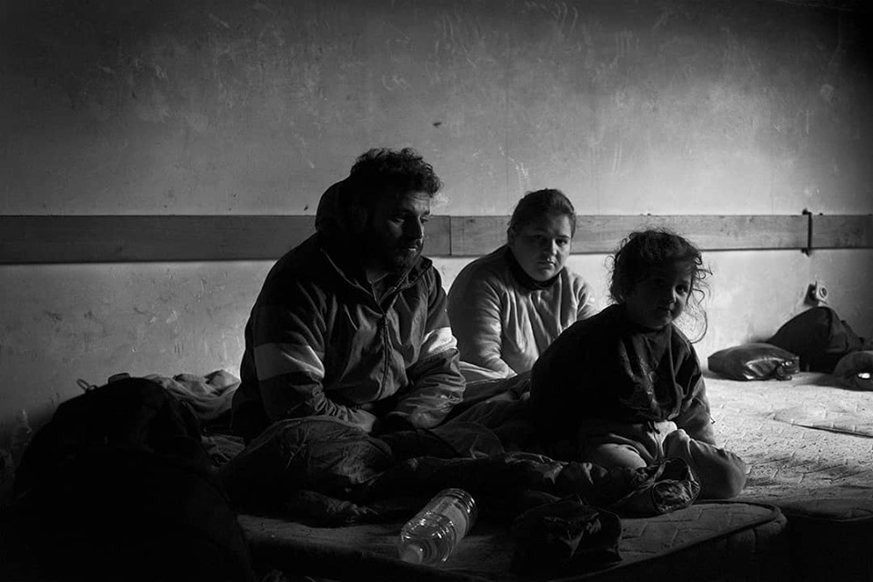

### AYS Daily Digest 02/05/2019: Italy deporting vulnerable cases to inadequate centre
#### Rome not renewing permits to international protection holders//276 people brought back to Libyan hell in two days//More deaths in the Mediterranean//Video showing disturbing living conditions of families between Croatia and Bosnia//German Federal Ministry of Transport blocked Mare Liberum from patrolling the Aegean//Unbelievable story from Serbia//Updates from France…

“The game\.” Credit: Emanuela Zampa
### **FEATURED STORIES**

**The Prefecture of Udine ordered to deport families, children, and vulnerable people** to the former barracks Cavarzerani, which turned into a CAS \(centre for extra\-ordinary reception\) in April 2015, though with an unclear capacity\. Around 300–400 people have been settled in the past months, but that has reached peaks of 1,000 people present at the same time in the structure\.

With unclear, high numbers like these, it is not surprising that living conditions are incredibly harsh, nor that respect for privacy and adequate care for extremely vulnerable cases are not taken into minimum consideration by the authorities managing the structure, namely the Italian Red Cross\.

It is, therefore, shocking to hear that the Prefect of Udine ordered to move 70 people, people in need of psychiatric cures — some of them suicidal too, single moms with children \(one of them with disabilities\), pregnant women and families with children in schooling age — to the structure with as little notice as one month\.

These people were hosted by local centers OIKOS and Centro Balducci, which were excluded from presenting themselves as candidates for the official renewal of the contracts to manage the structures and who have been trying, for a month now, to guarantee better solutions for the people hosted in their centers, but with no success\.

They will start a legal battle to guarantee minimum living conditions and adequate care to those forced to move, despite the institutional violence perpetrated by the Prefecture\.

It is important to underscore that not only are we talking about people who have specific vulnerabilities, but also about people who are already integrated in the local system and who are at the very end of their asylum process; this decision, in line with the Salvini decree, which decided to cut the number of secondary reception centers and maintaining only major hubs with hundreds of people, is a clear step backward\. It denotes a will to marginalize migrants to the very end of societal systems\.

> A clear plan to erase quality reception practices, creating social inclusion, avoiding ghettoisation of people, producing social cohesion and using carefully public resources\. 

Read original source [here](https://friulisera.it/migranti-la-prefettura-di-udine-ordina-di-deportare-intere-famiglie-donne-bambini-e-persone-vulnerabili-alla-ex-caserma-cavarzerani/?fbclid=IwAR07DPaiLci8grrF3Qx8QdqkIzt4Gcd3pwsAzQPIzfZen0OVdTD8-W5jbTI) \.

The Prefecture has ordered to move not only the 70 people, but [245 more asylum seekers](https://www.rainews.it/tgr/fvg/video/2019/05/fvg-oikos-balducci-773c7f68-353d-46cd-b6b6-aecec32d3679.html?wt_mc=2.www.fb.tgrfvgita_ContentItem-773c7f68-353d-46cd-b6b6-aecec32d3679.&wt&fbclid=IwAR0oihFy_CVB2ItectGoi-EBgLZwXUkyyHJZH9_lc7KUs-0JS5kCJhPBzW0) originally hosted by the Red Cross in different small hotels of the area to the same center, a total of 315 people who will be moved to the structure in the next few days\. Who will provide for their needs? How can the structure guarantee minimum standards of living with such high numbers and a limited budget, cut to 21 euro/day per person as imposed by the Ministry of Interior?

[**The story of Khaled**](https://www.facebook.com/NoNameKitchenBelgrade/photos/a.312076942523930/710485509349736/?type=3&theater) **\.**

> Khaled fled from the deadly war in Libya a couple of years ago and in August 2017, after crossing the Balkans, he reached Zagreb \(Croatia\) and applied for asylum\. He spent almost a year living in a camp waiting for his case to be resolved, but received no answer\. On July 2018 he was told that his mother had died in Libya and he was referred to a mental hospital where he says he was prescribed “very strong pills”\- in the camps, psychological support is only provided in extreme situations, and there is no mental\-health monitoring for refugee people\. 

> After taking the pills, Khaled got onto a train, fell asleep and — unintentionally — turned up in Sid again\. He had accidentally gone one step back in his now eternal journey\. “I tried explaining the Serbian police that I was already registered with the asylum system in Croatia and that I had been living in Zagreb for a year, but they didn’t listen to me,” he says\. \[…\] 

> Since he came back to Sid, Khaled has tried crossing back to Croatia many times, clinging to the bottom of trains\. \[…\] he has managed to reach Croatia twice, but once there, when he tried to get to the police station or to the camp to explain that he was already registered with the asylum system there, nobody listened to him and he was pushed back again to Serbia\. In Croatia, if you spend more than 48 hours outside an official camp, your application is no longer valid\. So, eight important months for Khaled, but invisible to the Croatian asylum system\. 

**Living conditions of families in the woods between Croatia and Bosnia\.**

### **SEA RESCUE**

The 12 people in distress in the Western Mediterranean since Wednesday have, thankfully, been found, but four of the 12 people on board died before rescuers could reach them\.

■■■■■■■■■■■■■■ 
> **[Alarm Phone](https://twitter.com/alarm_phone) @ Twitter Says:** 

> > Sad news. According to activist Helena Maleno, the missing boat was found but 4 of the 12 people have died. The others were rescued by fishermen. We will send updates once we have further information. We send our condolences to the friends and families of the deceased. 

> **Tweeted at [2019-05-02 16:26:21](https://twitter.com/alarm_phone/status/1123987099454251008).** 

■■■■■■■■■■■■■■ 

**Unsettling news coming from [Mare Jonio](https://mediterranearescue.org/en/news-en/breaking-news-from-mare-jonio-engaged-in-patrolling-and-monitoring-operations-in-the-central-mediterranean/?fbclid=IwAR1fammFDyoxdCusgS4XJc9tKkQrA9gLKNhWCts9gA6cZhkJxUBh4GioHbY) , patrolling and monitoring the Mediterranean\.**

80 people, whose boat was intercepted 65 miles off the coast of Al Khoms, have been brought back to Libya\.

The LCG concluded the operation between 18\.30 and 19\.00 today, despite all international laws declaring that it is illegal to bring back asylum seekers to conflict zones\.

The operation was carried on in total collaboration with Maltese authorities, who intercepted another boat in distress with 100 people on board\. It is a matter of time now for them to be brought back to the Libyan hell\.

> Mare Jonio, besides informing Italian authorities, is heading toward the position of this second boat\. It has asked MRCC Italy for instructions, pointing out that there is an explicit prohibition to deport refugees to war zones\. Libyan vessels are also heading toward the boat, while the Maltese military aircraft is getting away\. 

In [recent updates](https://www.repubblica.it/cronaca/2019/05/03/news/migranti_la_mare_jonio_denuncia_due_barconi_presi_dai_libici_-225357197/?fbclid=IwAR1oU3JKIM5ytlOkH8Xjf2BTqrY140rzX8hBnQvU7XLiBYj8wXe4LsFydJI) , the boat with 100 people has been intercepted by the LCG\.

For a full breakdown of the events, see [here](https://twitter.com/scandura/status/1124005894268837893?fbclid=IwAR2AWEiPLx89SQouG_MmY4mDzOOMm5ouI0BD1P5TNGpYV7gC3pBOuwTdOSk) \.

**These 180 people are to be added to the [96 migrants](https://twitter.com/IOM_Libya/status/1123526190285848576?fbclid=IwAR3nm-JUaTIRc8z1kO_C4XUCsGgIIeDyF6UH4c-kjQ3OG0896Savne5qDqA) who were already pushed back on Tuesday** and placed in detention centers after basic medical aid was provided\.

### **LIBYA**

■■■■■■■■■■■■■■ 
> **[Sally Hayden](https://twitter.com/sallyhayd) @ Twitter Says:** 

> > Urgent update from Triq al Sikka dc: I have information that the 22 (including minors) who have been isolated &amp; tortured for two months are now being forcibly returned to their countries. Reps from Eritrea &amp; Ethiopia allegedly visited Sikka today with IOM. [twitter.com/sallyhayd/stat…](https://twitter.com/sallyhayd/status/1102302428618285056) 

> **Tweeted at [2019-05-02 15:06:36](https://twitter.com/sallyhayd/status/1123967026224148480).** 

■■■■■■■■■■■■■■ 

**Not only people are being forcibly returned to their countries of origin, but they are left starving** , due to prices of food doubling only in the last month, according to Sally Hayden’s last [report](https://www.aljazeera.com/news/2019/05/tripoli-conflict-continues-detained-migrants-run-food-190502135744216.html) from Abu Salim Detention Centre, where more than 400 people \(including 30 children\) are secluded\.

> “We are hungry, but at this time we don’t care about food, only how we can survive \[with\] our life,” an Eritrean teenager told Al Jazeera through WhatsApp messages sent from a hidden phone he will sell once the flour runs out\. 

Due to the constant clashes, it is impossible to get food from external sources and also to receive money from their families\. Some of them are still able to work and bring some money for the basic necessities, but this will soon run out; no NGO is providing for them\.

For how long will European authorities close their eyes on the situation in Libya? How many people should starve, drown, or be tortured?

> In other Tripoli detention centers, detainees using hidden phones told Al Jazeera they have gone for days without food and are drinking dirty water, causing some to get diarrhoea\. 

20 people with tuberculosis are the ones who are mostly affected by the scarcity of food, as they are already extremely weak\.
### **GREECE**

[28 people](https://www.facebook.com/AegeanBoatReport/posts/566733480516427?hc_location=ufi) , including five children, have reached Chios early on Thursday morning\.

■■■■■■■■■■■■■■ 
> **[RSA](https://twitter.com/rspaegean) @ Twitter Says:** 

> > 10 Greek refugee NGOs urge for the immediate investigation of reports of collective expulsions in Evros region  [efsyn.gr/node/193572](https://www.efsyn.gr/node/193572) 

> **Tweeted at [2019-05-02 20:27:34](https://twitter.com/rspaegean/status/1124047800717774848).** 

■■■■■■■■■■■■■■ 

[Demo against fascism](https://twitter.com/sol2refugees/status/1124003308874739712?fbclid=IwAR0aDOLPWb2AmJLqRvTIzpL1uc8jaLPR0IMbdY34tQGggp9QBmDE4UixalE) and extreme right to be hold on Sunday at 1 PM at Kotzia Square — Athens\.
### **ITALY**

The Immigration Office at the Questura in Rome has not renewed resident permits to holders of international protection who present a certificate of residence by a “conventional” address, meaning that all those who hold an international protection paper, but are homeless or do not have a stable residency nor a renting contract, are de facto excluded from the renewal of the permit\. This decision was apparently taken because of public security measures, making those without a “conventional” address nearly untraceable\.

A Buon Diritto, together with CIR, Consiglio Italiano per i Rifugiati, already presented legal appeals against this decision by the Immigration Office and, in one of the urgent cases, the Court ordered the immediate release of the new permit\.

See original source [here](https://www.facebook.com/abuondiritto/posts/2407234219506882?hc_location=ufi) \.

On the other hand, the Court in Bologna ruled that asylum seekers have [the right to “residenza anagrafica,”](https://www.avvocatodistrada.it/i-richiedenti-asilo-hanno-diritto-alla-residenza-anagrafica-anche-dopo-il-decreto-salvini-il-tribunale-di-bologna-accoglie-il-ricorso-dellassociazione-avvocato-di-strada/?fbclid=IwAR1NgAvkvjF7lo48zRnTdzCED-OjnwS3Tu4xar9izP3NNg2CL0w7r_snv9M) being registered in the county of residence, even after the Salvini decree abolished it\. This will guarantee asylum seekers to be legally registered as residing in the county/city, even though they are homeless or can not provide authorities with a permanent address\.

[**New arrivals**](http://www.ansa.it/sito/notizie/topnews/2019/05/02/migranti-nuovi-sbarchi-nel-sud-sardegna_382a32f5-e834-40a8-9065-259c743a55ef.html?fbclid=IwAR0qnx8eeCwNusTst_j61_MuDz_t6T1w0sGEofC6q3C9pfAUCDX628589Zo) **to the southern coast of Sardinia\.**

Between Wednesday and Thursday, two boats coming from Algeria landed on Italian shores carrying a total of 15 people who, after medical and identification checks, were brought to the local reception centre of Monastir \(Cagliari\) \.

**Donations and room to rent\.**

Baobab is looking for a room to rent in Rome, even in shared spaces, to use as legal and administrative office\. [Get in touch](https://www.facebook.com/BaobabExperience/) with them if you can help\!

On Saturday, May 4th from 11 AM until 1 PM, Baobab will collect clothes and supplies in via della Marsica, 15\. Please, respect the list of items needed\.

They are mainly in need of winter blankets, sleeping bags, mats and clothing items for men \(T\-shirts, winter jackets, hoodies, sweaters, jeans\), sizes S to M, training shoes sizes 41–45, belts, backpacks, hats\.

Hygiene products are also needed: hair gel, razors, deodorants, perfumes, hydrating creams, toothbrushes\.

Olive oil, tuna cans, whole milk are also appreciated\.
### **FRANCE**

Another [evacuation in Saint Denis](https://www.facebook.com/permalink.php?story_fbid=1126907864176651&id=598228360377940) , Paris, occurred with no notice to people on the move, nor the associations working in the area\. The authorities did not explain where people will be moved and what will happen to them, but destroyed all personal belongings of those who did not want to get on buses\.

Even though authorities do not know where they will move the asylum seekers living in Saint Denis, people were still identified and probably moved to reception centers in the area, but procedures remain unclear\.

> With the support of the Auberge des Migrants, Cimade, DROP Solidarité, Fondation Abbé Pierre, GISTI, the League for Human Rights, Médecins du Monde, Refugee Women’s Center and Salam Nord / Pas\-de\-Calais, two migrants \(an Iraqi and a Pakistani\) denounced their living conditions, as well as those of a hundred people living in Grande\-Synthe\. They call for emergency measures\. 

> According to the associations concerned, some 600 migrants would live in the commune\. They conducted a survey, which reveal that, “more than half of people do not eat enough,” and that, “almost 60% do not have sufficient access to drinking water,” \[…\] According to them, the “feeling of insecurity” is reinforced by intensified deportation operations, “often accompanied by the destruction of personal effects”\. 

See original source [here](https://france3-regions.francetvinfo.fr/hauts-de-france/pas-calais/grande-synthe/migrants-grande-synthe-procedure-justice-contre-prefecture-du-nord-1663279.html?fbclid=IwAR1pCf3OVXjimtttg0KqBu6JalAcQtg0SZJxPFCT2kIe_FwQ5TDv8q9VYsk) \.

[**Updates from Grande\-Synthe**](https://www.facebook.com/refugeewomenscentre/photos/a.178973875861584/624642414628059/?type=3&theater) **\.**

> Around 25 families are sleeping in tents outside the gym \(an indoor space for men provided by the Grande\-Synthe City Hall\) alongside 400 men and unaccompanied minors\. 

> Many families hesitate to sleep inside the gym in the designated family area due to the lack of beds and the metal barriers that make up each family’s space\. 

> The women sleeping outside also hesitate to use the facilities the gym has, such as the showers and toilets, as the number of men inside and around the facilities creates an uncomfortable atmosphere for them\. 

> A further 20 families are accommodated by City Hall in CCP \(an indoor space\) which we have been told will be closed shortly\. 

### **SPAIN**

31 people fleeing from political persecution in Morocco have been held in a pre\-deportation centre in Valencia for 10 days\.

More information can be found [here](https://twitter.com/Arrif_Tweets) \.
### **UK**

■■■■■■■■■■■■■■ 
> **[Lancashire Sanctuary Homes Project](https://twitter.com/HomesLancashire) @ Twitter Says:** 

> > H is in desperate need for a host to come forward. He is a quiet, polite, kind and considerate university professor from Iraq. He is keen to stay in Blackburn to continue his voluntary interpreter work with a local charity. If you think you could help please get in touch. 

> **Tweeted at [2019-04-30 12:04:25](https://twitter.com/homeslancashire/status/1123196406620094465).** 

■■■■■■■■■■■■■■ 

### NO COMMENT

> In a video taken during his flight and posted on his Facebook page, Salvini said the fence \[between Serbia and Hungary\] was built to block illegal migration and that entry into Europe was only possible with permission\. 

> Another video showed Salvini and Orban embracing and touring a stretch of the border fence together\. 

#### AYS and the Daily News Digest — How to Get Involved?

**We strive to echo correct news from the ground through collaboration and fairness\. Every effort has been made to credit organizations and individuals with regard to the supply of information, video, and photo material \(in cases where the source wanted to be accredited\) \. Please notify us regarding corrections\.**

**Apart from daily news in English, we also publish weekly summaries in Arabic and Persian\. Find specials in both languages on our medium site\.**

**If there’s anything you want to share or comment, contact us through Facebook, Twitter or write to: areyousyrious@gmail\.com\.**

**We’re open to expanding our team of volunteer researchers, editors, and info gatherers\.**

_Converted [Medium Post](https://medium.com/are-you-syrious/ays-daily-digest-02-05-2019-italy-deporting-vulnerable-cases-to-inadequate-centre-1ff892d073f0) by [ZMediumToMarkdown](https://github.com/ZhgChgLi/ZMediumToMarkdown)._
