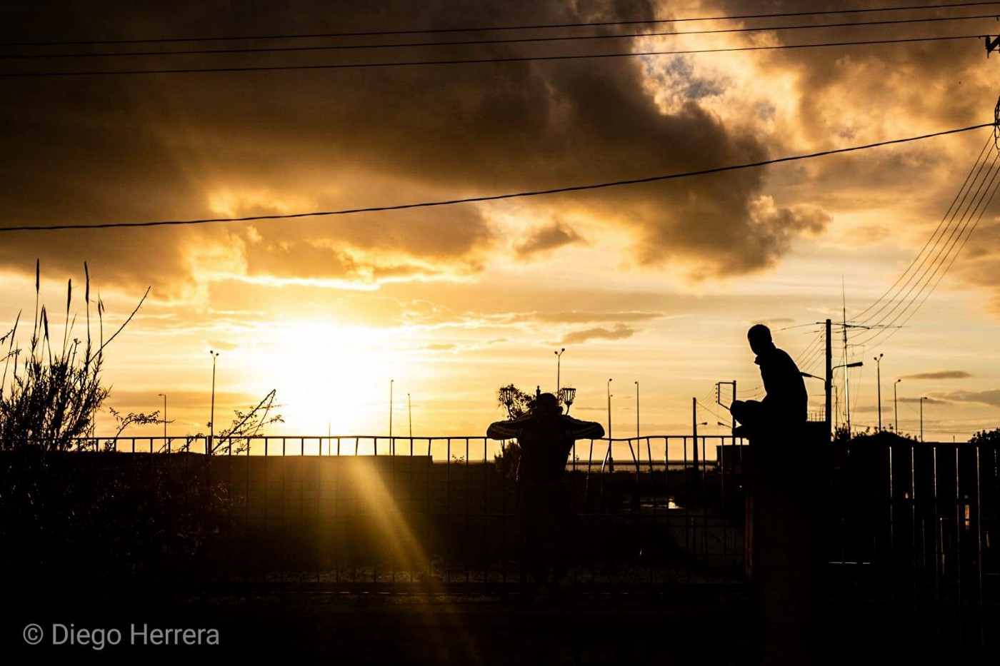
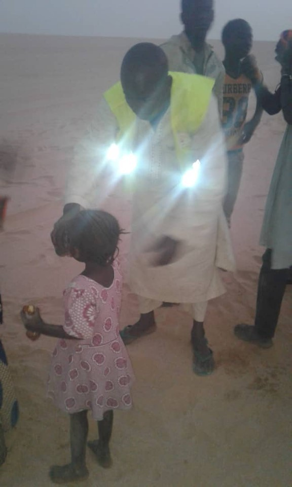

### AYS Daily Digest 03/05/2019: Deliberate Denial of Food in Hungarian Detention Centres
#### 28 people rescued from Desert in Niger// Five children and four women drowned off the coast Turkey// Greek Police Violence// 250 people returned to Libya in last 72 hours

[Are You Syrious?](https://medium.com/@AreYouSyrious)

May 4

Patras Greece by Diego Herrera

[The UN Human Rights Office \(UNHRO\)](https://www.ohchr.org/SP/HRBodies/HRC/Pages/NewsDetail.aspx?fbclid=IwAR2CKN-do13dKzTDpVUtTBIxwXShVqVuZXomiqDVQj_aj6yW1tqEI0Dxn38) has reported that people detained in Hungarian detention centers have been deliberately deprived of food if their application for asylum is denied\.

In Hungary, anybody who enters the country without a right to stay there is immediately detained during their asylum procedure\. The asylum procedure is reported to be substandard by UNHRO and is described as lacking ‘meaningful individualized procedures\.’

Consequently, most people are denied asylum and are subsequently subjected to deportation procedures to expel them from Hungary\. At this point in time, the immigration authorities deny further access to food — with the only exception to this rule being pregnant or breastfeeding women\.

Under all International standards, this is a grotesque violation of Human Rights and has detrimental consequences to the psychological and physical health of people on the move\.

AYS first reported on this back in [August of 2018](ays-daily-digest-17-08-2018-asylum-seekers-with-inadmissibility-claims-denied-food-in-hungarian-85df8a72ee7b) , after it was revealed by the Hungarian Helsinki Committee\. Since then, this new report states that ‘at least 21 people awaiting deportation have been deprived of food by the Hungarian authorities — some for up to five days\.’

The [Hungarian Helsinki Committee](https://www.helsinki.hu/wp-content/uploads/Denial-of-food-for-inadmissible-claims-HHC-info-update-17August2018.pdf) says that the Hungarian Immigration and Asylum Office refuses to provide food to people in “alien policing procedures” in the transit zones, with the aim of dissuading them from pursuing court appeals and to make them abandon their asylum applications by returning to Serbia\. It should be noted that Hungary denies that people on the move are ‘detained’ in the country as “voluntary returns” to Serbia are permitted\.

> The UN Human Rights Office reminds states that they have an obligation and heightened duty of care towards migrants who are deprived of their liberty, including through the provision of food\. The deliberate deprivation of food is prohibited under the Mandela Rules\*, and violates the rights to food and to health, as well as the prohibition of torture or other cruel, inhuman or degrading treatment or punishment\. 

> We reiterate the right of all migrants to seek asylum, as well as the fundamental human rights principle of ‘non\-refoulement’, which prohibits the return of any person to a situation where they would face a real and foreseeable risk of persecution, death, torture, and other cruel, inhuman, and degrading treatment or punishment, or other irreparable harm\. 

### NIGER

A member of the Alarm Phone Sahara Team has helped to rescue 28 people from Niger Republic who got stranded in the desert on their way to Libya when their car broke down\. A woman and a little girl were part of the group that was rescued between the villages of Achinouma and Latai\.

### LIBYA

Sally Hayden reports that a survivor of the Qasr bin Ghashir dc shooting, who fled to Tripoli with his pregnant wife had attempted to plead for help from [UN Refugee Agency](https://medium.com/u/75f2bdd89854) and [IOM Office UN](https://medium.com/u/fd286a6ae9c2) by going to their offices, but has been denied any assistance\. The woman is in need of medication and protection\.

Almost ironically, a new campaign launched by [UN Refugee Agency](https://medium.com/u/75f2bdd89854) is asking for solutions to be found for refugees detained in Libya\. The appeal has, understandably, been met with criticism\. The campaign appeals to the international community to identify solutions for all refugees in Libya so that they can be evacuated from the war\-torn country and find security abroad\.

■■■■■■■■■■■■■■ 
> **[Jeff Crisp](https://twitter.com/JFCrisp) @ Twitter Says:** 

> > This appeal is pointless unless UNHCR also calls on the EU to stop its support for the process of interception, return and incarceration. 

> **Tweeted at [2019-05-03 21:01:52](https://twitter.com/jfcrisp/status/1124418821631168513).** 

■■■■■■■■■■■■■■ 

### GREECE

Five children and four women have drowned in a shipwreck off the coast of Turkey

#### Arrivals:

According to The Aegean Boat Report, three boats have arrived on the Greek Aegean Islands, carrying at least 120 people\.

Proactiva Open Arms has been denied access to the port of Myteline Lesvos and so is unable to offload a container full of donated aid and supplies from Spain, The Hope Project reports\.

_Converted [Medium Post](https://medium.com/are-you-syrious/ays-daily-digest-03-05-2019-deliberate-denial-of-food-in-hungarian-detention-centres-3ffaa72db3ce) by [ZMediumToMarkdown](https://github.com/ZhgChgLi/ZMediumToMarkdown)._
