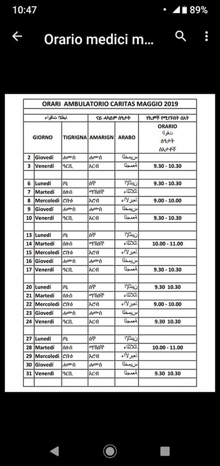
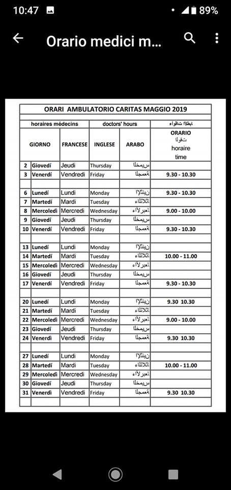
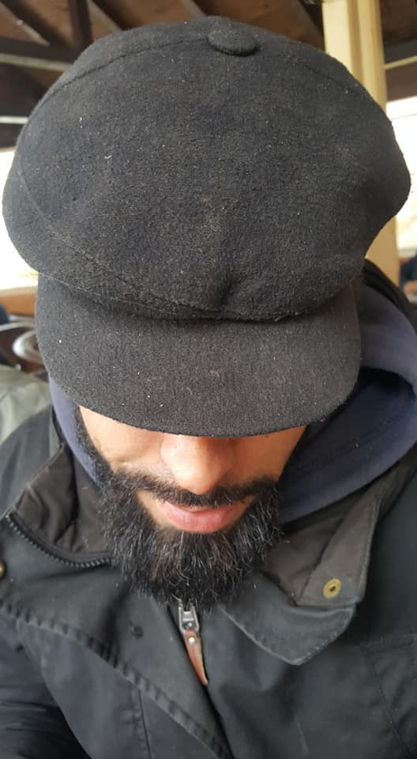

### AYS Daily Digest 03/05/2019: Deliberate Denial of Food in Hungarian Detention Centres
#### 28 people rescued from Desert in Niger// Five children and four women drowned off the coast Turkey// Greek Police Violence// 250 people returned to Libya in last 72 hours

Patras Greece by Diego Herrera

[The UN Human Rights Office \(UNHRO\)](https://www.ohchr.org/SP/HRBodies/HRC/Pages/NewsDetail.aspx?fbclid=IwAR2CKN-do13dKzTDpVUtTBIxwXShVqVuZXomiqDVQj_aj6yW1tqEI0Dxn38) has reported that people detained in Hungarian detention centers have been deliberately deprived of food if their application for asylum is denied\.

In Hungary, anybody who enters the country without a right to stay there is immediately detained during their asylum procedure\. The asylum procedure is reported to be substandard by UNHRO and is described as lacking ‘meaningful individualized procedures\.’

Consequently, most people are denied asylum and are subsequently subjected to deportation procedures to expel them from Hungary\. At this point in time, the immigration authorities deny further access to food — with the only exception to this rule being pregnant or breastfeeding women\.

Under all International standards, this is a grotesque violation of Human Rights and has detrimental consequences to the psychological and physical health of people on the move\.

AYS first reported on this back in [August of 2018](ays-daily-digest-17-08-2018-asylum-seekers-with-inadmissibility-claims-denied-food-in-hungarian-85df8a72ee7b) , after it was revealed by the Hungarian Helsinki Committee\. Since then, this new report states that ‘at least 21 people awaiting deportation have been deprived of food by the Hungarian authorities — some for up to five days\.’

The [Hungarian Helsinki Committee](https://www.helsinki.hu/wp-content/uploads/Denial-of-food-for-inadmissible-claims-HHC-info-update-17August2018.pdf) says that the Hungarian Immigration and Asylum Office refuses to provide food to people in “alien policing procedures” in the transit zones, with the aim of dissuading them from pursuing court appeals and to make them abandon their asylum applications by returning to Serbia\. It should be noted that Hungary denies that people on the move are ‘detained’ in the country as “voluntary returns” to Serbia are permitted\.

> The UN Human Rights Office reminds states that they have an obligation and heightened duty of care towards migrants who are deprived of their liberty, including through the provision of food\. The deliberate deprivation of food is prohibited under the Mandela Rules\*, and violates the rights to food and to health, as well as the prohibition of torture or other cruel, inhuman or degrading treatment or punishment\. 

> We reiterate the right of all migrants to seek asylum, as well as the fundamental human rights principle of ‘non\-refoulement’, which prohibits the return of any person to a situation where they would face a real and foreseeable risk of persecution, death, torture, and other cruel, inhuman, and degrading treatment or punishment, or other irreparable harm\. 

### NIGER

A member of the Alarm Phone Sahara Team has helped to rescue 28 people from Niger Republic who got stranded in the desert on their way to Libya when their car broke down\. A woman and a little girl were part of the group that was rescued between the villages of Achinouma and Latai\.

### LIBYA

Sally Hayden reports that a survivor of the Qasr bin Ghashir dc shooting, who fled to Tripoli with his pregnant wife had attempted to plead for help from [UN Refugee Agency](https://medium.com/u/75f2bdd89854) and [IOM Office UN](https://medium.com/u/fd286a6ae9c2) by going to their offices, but has been denied any assistance\. The woman is in need of medication and protection\.

Almost ironically, a new campaign launched by [UN Refugee Agency](https://medium.com/u/75f2bdd89854) is asking for solutions to be found for refugees detained in Libya\. The appeal has, understandably, been met with criticism\. The campaign appeals to the international community to identify solutions for all refugees in Libya so that they can be evacuated from the war\-torn country and find security abroad\.

■■■■■■■■■■■■■■ 
> **[Jeff Crisp](https://twitter.com/JFCrisp) @ Twitter Says:** 

> > This appeal is pointless unless UNHCR also calls on the EU to stop its support for the process of interception, return and incarceration. 

> **Tweeted at [2019-05-03 21:01:52](https://twitter.com/jfcrisp/status/1124418821631168513).** 

■■■■■■■■■■■■■■ 

### GREECE

Five children and four women have drowned in a shipwreck off the coast of Turkey

#### Arrivals:

According to The Aegean Boat Report, three boats have arrived on the Greek Aegean Islands, carrying at least 120 people\.

Proactiva Open Arms has been denied access to the port of Myteline Lesvos and so is unable to offload a container full of donated aid and supplies from Spain, The Hope Project reports\.

**Greek Police Violence reported at Evros River border with Turkey**

■■■■■■■■■■■■■■ 
> **[Crackdown Chronicles](https://twitter.com/CrackdownReport) @ Twitter Says:** 

> > 🇬🇷 On the #Greek border, two #Pakistani irregular #migrants were found half naked and battered. 

▪️Immigrants claimed that the Greek border security forces beat them and forcibly returned them to #Turkey. https://t.co/Pge4LPeE8C 

> **Tweeted at [2019-05-02 16:30:00](https://twitter.com/crackdownreport/status/1123988016584744960).** 

■■■■■■■■■■■■■■ 

### ITALY
#### Clinic Hours Ventimiglia

### SLOVENIA

Report of Pushback from Slovenia\.

> No Madonna and no God protected them after they found shelter from the persistent rains inside the abandoned church\. 

The group was captured by Frontex a few kilometres from Italy; they were rejected \(despite the request for asylum\) in Croatia, where the police robbed them, beat them and broke their cell phones at 3am, 25km from the border of Velika Kladusa\.

### SEA

Correction to yesterday’s digest: nine people died in the shipwreck that occurred in the Mediterranean sea from Tangier/Morocco, not four people, as was previously stated\.

A survivor has reported to Alarm Phone that the deceased were from the same village: “They did everything together, to me they seemed like brothers and sisters\.

**Details of the Shipwreck:**

> According to the survivor, their boat left from Tangier at 1am on April 30\. The weather was rough throughout their journey\. When they called the Alarm Phone and tried to send us their GPS, a large wave broke, the boat capsized, and they had no possibility to reach out anymore\. Some seemed able to get back into the boat, but large waves took one after the other\. According to the survivor, when, on May 1, a big white boat with what appeared to be Spanish writing on it found them, only 4 people were left on the boat\. They were told to wait for the Moroccans\. 

> In the afternoon on May 1, the rescue took place\. The Moroccan Navy threw a rope, the survivor we spoke to was the first to be rescued\. During the rescue, the boat turned over again\. A woman couldn’t hold on to the rope\. Someone jumped into the water but came too late, she drowned\. 

> The three survivors were brought to the hospital, suffering from hypothermia\. Knowing that the police would search for them, they fled the hospital and are now in hiding\. The survivor we spoke to knew none of the names of the deceased\. 

> With the very little information given by the Moroccan Navy, we cannot verify if the shipwreck in which 4 people died as reported by Helena Maleno yesterday is indeed this or another case\. This could mean that there were in fact 2 shipwrecks, with a total of 13 fatalities\. 

■■■■■■■■■■■■■■ 
> **[MSF Sea](https://twitter.com/MSF_Sea) @ Twitter Says:** 

> > In the last 72 hours, over 250 #refugees & #migrants were forcibly returned to #Libya after being intercepted at sea. These vulnerable people, many with the same international protection needs as those evacuated to #Italy earlier in the week, are now in detention. 

> **Tweeted at [2019-05-03 18:42:55](https://twitter.com/msf_sea/status/1124383856105263104).** 

■■■■■■■■■■■■■■ 

MSF Sea reports that in the last 72 hours, 250 people have been forcibly returned to Libya after being intercepted at sea\. They are all now detained\.

[Mediterranea Saving Humans](http://www.ansamed.info/ansamed/en/news/sections/generalnews/2019/05/03/ngo-mediterranea-vows-to-document-libyan-captures-at-sea_d4299968-b806-4d9c-b6f9-2e9fac1a7aad.html?fbclid=IwAR0j0KxDuRHf-8sMVDvjRPN3Mw5oKZtY0nRMHBuo_4A_6tYfrwk_6iuM7Xo) has reported on Facebook that it plans to begin documenting operations by the Libyan Coast Guard in the Mediterranean\.
### FINLAND

A Finnish man who has never before set foot in Afghanistan has been deported there from Finland\.

> AMASO has been contacted by an Afghan asylum seeker deported from Finland back to Afghanistan on Wednesday\. He was the only person deported\. 

He reported that he had trouble finding accommodation but is now in a temporary accommodation ‘panicked and traumatized\.’
#### AYS and the Daily News Digest — How to Get Involved?

**We strive to echo correct news from the ground through collaboration and fairness\. Every effort has been made to credit organizations and individuals with regard to the supply of information, video, and photo material \(in cases where the source wanted to be accredited\) \. Please notify us regarding corrections\.**

**Apart from daily news in English, we also publish weekly summaries in Arabic and Persian\. Find specials in both languages on our medium site\.**

**If there’s anything you want to share or comment, contact us through Facebook, Twitter or write to: areyousyrious@gmail\.com\.**

**We’re open to expanding our team of volunteer researchers, editors, and info gatherers\.**

_Converted [Medium Post](https://medium.com/are-you-syrious/ays-daily-digest-03-05-2019-deliberate-denial-of-food-in-hungarian-detention-centres-a39965bd7d46) by [ZMediumToMarkdown](https://github.com/ZhgChgLi/ZMediumToMarkdown)._
