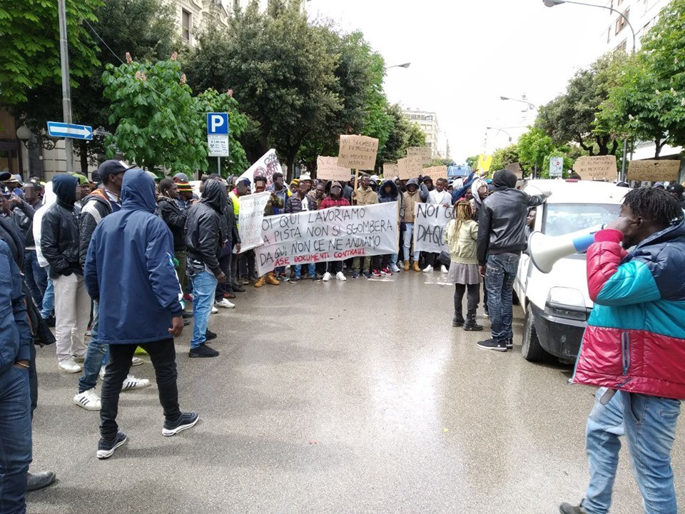
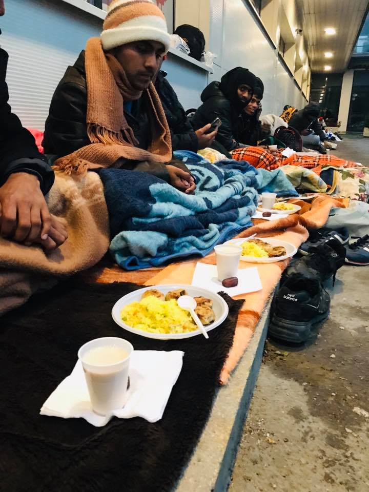
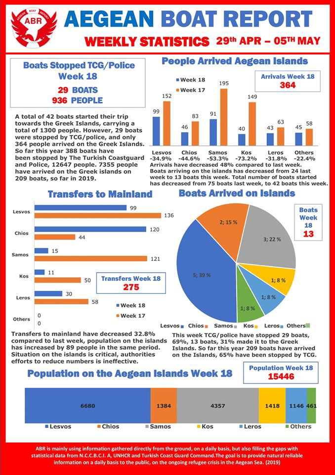

### AYS Daily Digest 06/05/2019: Field workers striking to demand housing rights and regular contracts
#### Abuses and lack of food and water continue for migrants in Libya//Greece overloaded with asylum applications//New data published on arrivals in Greece and Greek islands//New figures for Serbia and Italy//202 people rescued in the Western Mediterranean just this weekend//Updates from Tuzla//Legal action in Hungary to prevent deportation//Call for volunteers and donations//…

Strike of field workers in Foggia, Italy\. Credit: Comitato Lavoratori delle Campagne
#### FEATURED STORIES

**More than 700 field workers [striking](https://www.facebook.com/comitatolavoratoridellecampagne/posts/2467977146601729) against the threat of yet another useless evacuation in Borgo Mezzanone, Foggia\.** They demand housing solutions, safe working contracts and official documents for all those forced to accept unbearable working conditions in Italian fields, exploited by the “caporali” and ignored by institutions, including Confagricoltura and Coldiretti, the two major organisations representing field workers nation\-wide\.

The Prefect of the city kept offering the same answer to the various demands of those present, mainly stating that some of the workers, with regular permit of stay, could be moved to “containers”, built too far away from the work place and unreachable via public transport, with no security of contract\.

The very same containers that will get too hot in summer and too cold in winter, far from city centres and forbidden to all those workers without a regular permit of stay\.

[Further actions will be taken to assure human and workers’ rights](https://www.facebook.com/comitatolavoratoridellecampagne/posts/2468466759886101?hc_location=ufi) \.

**Greece struggling to examine the 62,418 asylum applications lodged between 2015 and 2019** , while 5,500 new applications are submitted every year on average by the newly arrived people\.

In the same time bracket, Greece granted asylum or subsidiary protection to 36,683 applicants, [according to Ekathimerini](http://www.ekathimerini.com/240118/article/ekathimerini/news/greek-asylum-service-grappling-with-backlog-of-applications?fbclid=IwAR2gTkdv4b8HvCCrMV6cmm9FgwYzdQefjPgLaqcCDVddt35vr5hnD8nkOv4) \.

> The bulk of asylum applications are made at the service’s offices the eastern Aegean islands of Lesvos, Samos and Chios, as well as in Attica and Thessaloniki, with the latter also responsible for arrivals through the Evros border\. One asylum\-seeker who recently turned up at the Thessaloniki bureau was given an interview date for December 2023\. 

Just in 2019 \(up until the end of April\), 10,892 people arrived to Greece either by sea or land states [UNHCR](https://data2.unhcr.org/en/situations/mediterranean/location/5179?fbclid=IwAR2f2o0Uom1Bw8kqDxUhG3I49h4gqV658GwsAxsGoBRVR-WAjcvgDmOppYM) , mainly from Afghanistan, Iraq and Syria\.

**Solidarity in Tuzla continues, thanks to the tireless work of locals**

People are coming mainly from Bangladesh and Pakistan, according to volunteers; even though no clear number has yet been published on how many people are there \(an estimate of 50 people are sleeping outside the town’ police station\), it was reported that over the weekend a family with three children arrived and had to sleep in the rough\.

**Donations are constantly needed** , mainly for winter clothing, shoes, blankets, sleeping bags and any item that could keep people warm, as temperatures are very low\. Food is also necessary\.

Credit: Senad Cupo

Read [yesterday’s digest](https://medium.com/are-you-syrious/ays-weekend-digest-04-05-5-2019-border-agreement-with-albania-now-operational-cef3237366b5?fbclid=IwAR2DJtyzq41pmDx8yYSPoD1j2LyAZs3PZFm6iNbl81SwOB_HH1Q6LX1zV0Y) for more information on the situation in the area\.
#### SYRIA

Three hospitals were bombed and put out of service today in Northern Syria\.

[Sources](https://reliefweb.int/report/syrian-arab-republic/breaking-3-hospitals-bombed-today-syria?fbclid=IwAR30CpQx7AxOgL2ITUMqzSY1iRW5ricoZqM3Q1AbxCEIaUnDKM6Dtnn05xs) report that, since 28 April, 10 medical facilities have been targeted and three medical staff lost their lives\.

> The recent surge in attacks has caused a mass displacement\. Since 21 April, 231,087 people have fled their homes, 462,496 are under attack in 61 communities\. Many of these families are without shelter, living in open spaces, exposed to the elements, and are in need of medical care\. At least 100 civilians were killed, including three medical staff, and at least 300 were wounded\. A large number of the causalities were women and children\. 

#### LIBYA

The latest [OCHA statement](https://reliefweb.int/sites/reliefweb.int/files/resources/sitrep_libya_en_05_may.pdf) on the situation in Libya reports at least 102 casualties among civilians, 23 deaths and 79 injured, including medical staff, between 2 and 5 May only\.

Lack of food and access to electric power/water are major concerns\.

> IOM and UNHCR report that many refugees and migrants in Azzawya Al Nasr DC \[west of Tripoli\], particularly those previously transferred from Qasr Bin Ghasheer, are extremely distressed and in need of psychosocial support \(PSS\) \. 

> 655 individuals \(519 men, 108 women and 28 children\) were transferred to Azzawya Al Nasr DC following an incident on 23 April, in which 12 individuals sustained injuries that required hospitalization when an armed group entered Qasr Bi Ghasheer DC \[south of Tripoli\] \. 

More on the incident is reported by Sally Hayden:

■■■■■■■■■■■■■■ 
> **[Sally Hayden](https://twitter.com/sallyhayd) @ Twitter Says:** 

> > Urgent situation in Zawiya dc, where survivors of the Qasr bin Ghashir shooting say they’re being forced to leave after two days without food. They say management has been abusive &amp; threatening since they arrived, &amp; now hundreds are outside with no idea what to do. https://t.co/OFaQHtHWNv 

> **Tweeted at [2019-05-06 20:00:25](https://twitter.com/sallyhayd/status/1125490519323348994).** 

■■■■■■■■■■■■■■ 

> Sources there also have all repeatedly said that the detention centre is being run by human traffickers\. The head of the militia that runs the centre, Mohammed Kachalf, was sanctioned in 2018 for human trafficking\. 

#### SEA

AlarmPhone reports the [dreadful testimony](https://alarmphone.org/en/2019/05/06/witness-testimony-shipwreck-alarm-phone-migrants-morocco-spain/) of one person who survived last week’s shipwreck, where nine people lost their lives\.

> We contacted you \[Alarm Phone\] in the early morning of 30 April\. When I tried to send GPS data from my smartphone, a big wave capsized the boat\. We fell in water and the cell phone got wet\. So I couldn’t use it any more\. We’ve managed to turn the boat around and to climb into the boat again\. We lost three people and also our paddles\. The boat capsized again\. We lost two more people\. Again, we were able to turn the boat around and to climb into it\. \[…\] 

> In the morning we saw big container ships, which did not notice us, despite my red clothes, waving and shouting\. Again, the boat capsized\. We had no strength anymore to turn the boat around and we were sitting on the turned around backside of our zodiac\. Two other people died\. We were fighting for our lives\. \[…\] 

202 people have been rescued from seven different boats by Salvamento Marítimo and the Guardia Civil on Saturday, all of them between the Strait and the island of Alborán\. Among those rescued are also 29 women and 13 children\.

The people rescued were mainly from Morocco and sub\-Saharan countries\.

Original source [here](https://www.lavanguardia.com/sucesos/20190505/462040866446/rescate-inmigrantes-pateras-estrecho-isla-alboran.html?utm_campaign=botones_sociales&utm_source=whatsapp&utm_medium=social&fbclid=IwAR0eJ9pd2IJThJA36R4sJgQhODGJEF2YCeEQ9DHyCWVPo-4SdZw52apPuMQ) \.

59 people, including 16 women and three children were [rescued](https://twitter.com/cremalaga/status/1125507001906335744?s=21&fbclid=IwAR1LkqH4EUQ2zHqIgKJPJqwZHxdPik3EmbkWYfAMuNOPML_odLCuHM5JXxI) by Salvamento Marítimo off the Alborán coast\.
#### GREECE

Credit: Aegean Boat Report

For additional breakdowns on the countries of origin of those who landed in Greece, see [here](https://data2.unhcr.org/en/documents/download/69319?fbclid=IwAR042z8lxlkS2uW3A6ApecJAg9vOZ5k0GpVu5NG0SOwQWEvV6V-6JiPpZt0) \.

The No Name Kitchen team in Patras will be changing [time of food distribution](https://www.facebook.com/NoNameKitchenBelgrade/photos/a.312076942523930/713215969076690/?type=3&theater) , starting at sunset, in order to adjust to Ramadan\.

Volunteers kitchen coordinators needed in Khora\!

If you want to get involved, [get in touch](https://www.facebook.com/KhoraAthens/posts/1141274146045192) with them\.
#### HUNGARY

Updates on legal actions taken to prevent the deportation of three of the families starved by the IAO, Hungarian Immigration and Asylum Office, in transit zones\.

Between February and April 2019 alone, 13 people were left without food when detained in transit zones\.

■■■■■■■■■■■■■■ 
> **[HunHelsinkiCommittee](https://twitter.com/hhc_helsinki) @ Twitter Says:** 

> > Just rqsted #rule39 emergency order to stop deportation to AFG 3 previously starved families, some with grave medical conditions by @[Frontex](https://twitter.com/Frontex). Asylum claim was never examined on merits, no proper analysis of risk of return conducted.Warned this could happen [helsinki.hu/en/hungary-con…](https://www.helsinki.hu/en/hungary-continues-to-starve-detainees-in-the-transit-zones/) https://t.co/4zzKoGBxbO 

> **Tweeted at [2019-05-06 17:41:27](https://twitter.com/hhc_helsinki/status/1125455549502509056).** 

■■■■■■■■■■■■■■ 

#### SERBIA

To clarify that the numbers we reported yesterday of arrivals to Serbia refer only to arrivals and transit in Belgrade; however, given the difficulties of “counting” people on the move, all statistics are to be taken as estimates\.
#### ITALY

#### FRANCE

Call for volunteers for food distributions during Ramadan\.

Solidarité migrants Wilson is looking for [volunteers](https://www.facebook.com/permalink.php?story_fbid=1129742530559851&id=598228360377940&hc_location=ufi) to prepare food kits and distribute them during Ramadan around Saint Denis in Paris\.

> April 2019: the fences now completely close off the field from the street Rue des Verrotières to the street Chemin du Pont Trouille, preventing access to facilities and stopping anyone from entering the space\. \[…\] 

> People don’t know where to go anymore, and no sustainable, unconditional and adapted solution to the situation has been proposed\. 

> They have put Calais and humanity in cage\. 

After the last evacuation on 12th March, [people on the move in Calais have nowhere to go](https://www.facebook.com/permalink.php?story_fbid=338864876770542&id=258099198180444&hc_location=ufi) and no place to rest, while fences keep being built\.

Réseau Vichy Solidaire published a petition, asking the local Prefect of Allier \(south of France\) to issue working permits for the unaccompanied minors in the area, currently training at local companies\.

Without this permit, the young boys are forced to leave their training companies, dashing any possible hope of building a stable future in the area\.

To know more about the petition, see [here](https://www.change.org/p/préfète-de-l-allier-03-pour-le-respect-des-droits-à-la-formation-des-mineurs-isolés-dans-l-allier?recruiter=957187539&utm_source=share_petition&utm_medium=copylink&utm_campaign=share_petition&fbclid=IwAR00WETVe4pOvGqJuzACvkJJq2f__QulLfyY1i2YPj6PR5TcIrIiM4pqrFA) \.
#### AYS and the Daily News Digest — how to get involved?

**We strive to echo correct news from the ground through collaboration and fairness\. Every effort has been made to credit organizations and individuals with regard to the supply of information, video, and photo material \(in cases where the source wanted to be accredited\) \. Please notify us regarding corrections\.**

**Apart from daily news in English, we also publish weekly summaries in Arabic and Persian\. Find specials in both languages on our medium site\.**

**If there’s anything you want to share or comment, contact us through Facebook, Twitter or write to: areyousyrious@gmail\.com\.**

**We’re open to expanding our team of volunteer researchers, editors and info gatherers\.**

_Converted [Medium Post](https://medium.com/are-you-syrious/ays-daily-digest-06-05-2019-field-workers-striking-to-demand-housing-rights-and-regular-contracts-cdef07284050) by [ZMediumToMarkdown](https://github.com/ZhgChgLi/ZMediumToMarkdown)._
