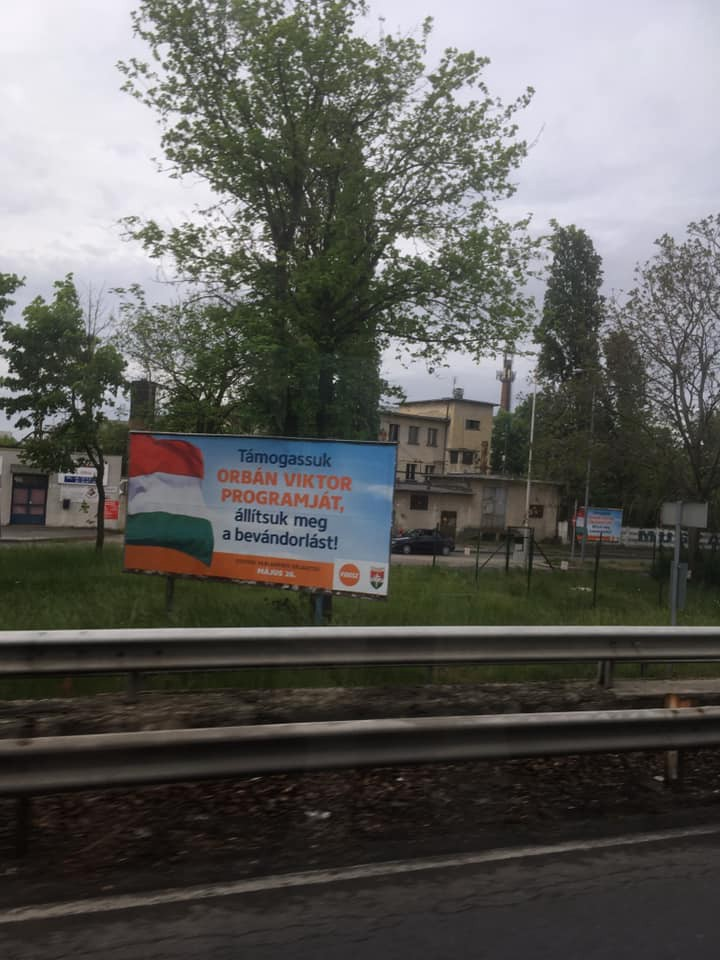
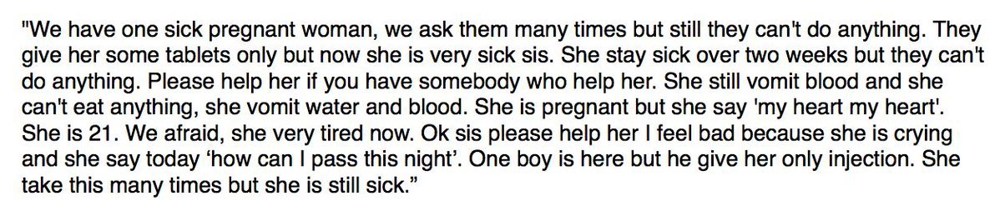
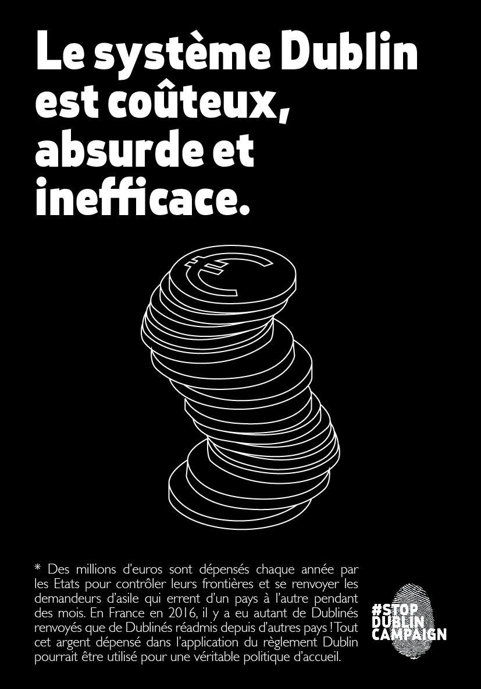

### AYS Daily Digest 8/5/19: Deportation straight to danger, violence and humiliation — widely practiced by Europe
#### EU continues funding and supporting Libya’s inhumane treatment through deportations to detention surrounded by shootings / Hungary ignores duty to examine asylum claims, keeps deporting people to war zones / German detention and deportation treatment under the criticism of the European Council / Calls for aid and help, invitations to protests & more

](assets/dbb23e380772/1*N_ylGqv7jf3Hk6hKfycmWg.jpeg)

“Shrapnel from the blast tore through the roof of the women’s hangar and nearly hit an infant\. “My baby was asleep on this bed when it came through the roof,” says one of the women\. “— source: [**MSF Sea** ‏](https://twitter.com/MSF_Sea)
#### FEATURED STORIES
### Night deportation from Hungary

Hungary’s infamous policies and failing to respect the common laws and principles of the European Union are already widely known\. However, lately ahead of the upcoming elections and in the generally heated discussion on all questions regarding migration and international protection, the country’s official actions are touching a new low\.

“In Budapest from the airport, on the side of the road, I stopped counting after 20 billboards\. <Let’s support Orban Victor’s program\. Let’s stop immigration\.>” — Photo and comment: Orsi Hardi

Several strands of electrified wiring in front of the multiple barbed wire fences still stand on the border with Serbia, where one of the recently expelled families was returned in an event that grabbed many people’s attention\. 
A family’s hopes were crushed after they had spent more than three months at Hungary’s border migrant camp, having waited for over two years for an answer to their request and later for their appeal to be considered\.

> _In the transit zone, not only is starvation a common practice, but the experiences of those who stayed there are horrid, described in more detail [here](https://dex.hu/x.php?id=index_kulfold_cikklink&url=https%3A%2F%2Findex.hu%2Fbelfold%2F2017%2F06%2F12%2Ftranzitzona_roszke_tompa_borton_menekultek_terhes_no_hatosagi_tulkapas_gyerekek%2F) \._ 

Hungary rejected the families’ asylum requests and gave them the choice of being expelled to Serbia or being flown back to Afghanistan\. 
 “The treatment of these families, including their removal from Hungarian territory with no serious effort to look at their claims to refugee status, is deeply regrettable,” U\.N\. High Commissioner for Refugees Filippo Grandi reportedly said\. Still, obviously nobody did anything to prevent their expulsion and Hungary’s methods continue\. 
**A family of six was deported to Serbia, having to cross a gate in the border fence in the dark, with no one waiting for them on the Serbian side\.**

UNHCR workers witnessed the whole thing\.

“Hungary never examined their asylum claims on merit,” said Andras Lederer, of the Helsinki Committee\. It was **the Helsinki Committee** who took the three cases of Afghan families who were about to be expelled to the European Court of Human Rights\. **The ECHR suspended Hungary’s plan to deport a family\.** 
The activists said they had secured an interim measure to stop the deportation of one of two other families awaiting a similar fate\.

> According to Eurostat, there have been deportations to all major countries of origin, even Syria\. 

> **In 2018, Hungary deported 45 people to Iran, 80 to Afghanistan, 95 to Iraq and 25 to Syria\.** 

### Urgent action needed in Libya to prevent a disaster

As the death toll from the fighting in Tripoli rises to 443, last night’s airstrikes directly hit the Tajoura detention centre compound in Tripoli, a mere 80m from where refugee women are trapped, reports MSF\. However, the EU is still cooperating with the Libyan coast guard to send people who are seeking asylum in Europe back to war\-torn Libya\.

■■■■■■■■■■■■■■ 
> **[Matteo Villa](https://twitter.com/emmevilla) @ Twitter Says:** 

> > (⛔🚢🇬🇧) THE VANISHING LIBYAN COAST GUARD.

In the first four months of 2019, for every 8 #migrants who departed from #Libya-n shores, 1 died or went missing.

And the more Europe delegated search and rescue to the Libyan Coast Guard, the more the risk of death at sea has risen. https://t.co/W2WVWr6ECQ 

> **Tweeted at [2019-05-08 09:55:08](https://twitter.com/emmevilla/status/1126062973477376001).** 

■■■■■■■■■■■■■■ 

> An immediate evacuation of these people is necessary\! 

“Utilising civilian infrastructure in this manner constitutes a violation of international humanitarian law and must be avoided at all costs”, says the UN\. At the same time, at the UNHCR Gathering & Departure Facility a 21\-year old pregnant woman is very sick, she has been vomiting blood for the past two weeks\.

Refugees in contact with the journalist Sally Hayden say they’re worried she won’t survive the night\.

■■■■■■■■■■■■■■ 
> **[Sally Hayden](https://twitter.com/sallyhayd) @ Twitter Says:** 

> > Non-Muslim refugees at Tripoli's UNHCR GDF centre say this today was the first meal they've been given since Monday night. Among them are pregnant women &amp; children. [twitter.com/sallyhayd/stat…](https://twitter.com/sallyhayd/status/1125832935771443200) https://t.co/TZzsOHTlWG 

> **Tweeted at [2019-05-08 12:06:20](https://twitter.com/sallyhayd/status/1126095987926237185).** 

■■■■■■■■■■■■■■ 

■■■■■■■■■■■■■■ 
> **[MSF Sea](https://twitter.com/MSF_Sea) @ Twitter Says:** 

> > "We're trying empower people to show them the coping mechanisms, the activities they can do to survive. The most important thing is to survive.”

#MSF medics treat both the physical &amp; mental health needs for people trapped in #Tripoli detention centres. 

[msf.org/more-medicine-…](https://www.msf.org/more-medicine-look-mental-health-needs-detention-libya) 

> **Tweeted at [2019-05-09 10:00:00](https://twitter.com/msf_sea/status/1126426587019091970).** 

■■■■■■■■■■■■■■ 

#### GREECE

[Proactiva Open Arms](https://www.facebook.com/proactivaservice/?__tn__=%2CdkCH-R-R&eid=ARCnHtbOCTAEv6Y5k5suffV7I1BiNpAYEPnA4k52REBNcoPQ0w0hIf-EomSozgxS_fqu0kYmXMXgsV6M&hc_ref=ARRbF_MK5S3bnf9SeMBb-VZjlhBz8pDx-4ZbD3BHjir-0OSAsIXL-xER7GH68aog5as&fref=nf) is still being prevented from delivering roughly 20 tons of material donations to Greek islands\.

#### SLOVENIA
### Report of collective expulsions

> Processed under the readmission agreement, many people were denied their right to asylum procedure by the Slovenian police, still conducting systematic expulsions to Croatia under the guise of the readmission\. 

Threats, violence, abuse of power and denial of basic rights has became a common practice in other border police stations, collective expulsions to Croatia are happening daily with the knowledge and support of high police and government officials despite high risk of further violence and theft done by police in Croatia\.

A report was written by the Slovenian activists, documenting the continuing unlawful police practice at the border between Croatia and Slovenia\.

Read about it in [**AYS Special: Report on illegal practice of collective expulsion on Slovene\-Croatian border**](report-on-illegal-practice-of-collective-expulsion-on-slovene-croatian-border-e1210bf7dd8f)
#### AUSTRIA
### Deportation warning

We remind once again that a deportation in reportedly scheduled for **16 May from Vienna to Lagos, Nigeria\.**

The activists warn people who might be concerned to be aware the police will search for people at their known home addresses\. Police raids are also common at shops, clubs, restaurants, barber shops etc\., popular meeting points of African communities\.
They report that most recently, people get picked up just one or two days before the scheduled deportation charter flight so there’s no time for protest or similar actions\.
#### FRANCE

### Help needed in Grande Synthe

Raids have been the main cause of the ongoing damage to the camp in Grande Synthe, at least twice a week — tents and clothes are destroyed and taken away, and now allegedly also food\. 
In the last few weeks, dozens of Kurdish families and many children have joined the mostly Pakistani community there and the groups supporting these people need help\.

They are looking for:
Hygiene Products — Shower Gel, Shampoo, Shaving Foam, razors, Combs, Toothbrush, toothpaste, Towels
Blankets
Tents
Floor Mattress

Clothes: Children’s clothes from zero to five years old in good condition\.
Adult clothes sizes S, M and L in good condition and clean\.
Dark color jeans or joggings
T\-shirts, pullovers, socks, underpants
Walking shoes or basketball, priority sizes: 42, 43 and 44
No female clothing is currently needed\.

Bring all you can contribute to L’Epicerie Solidarity on **Thursday and Friday \(10 am / 12 pm / 6 pm\) and on Saturday Morning \(10 am\-12 pm\) \.** 
**Address: 9 rue des Platanes, Coudekerque\-Branche next to the old church of Saint Pierre \(close to Dunkirk\)** \.
If you would like to join the volunteer teams, [contact them](https://www.facebook.com/groups/123081368042139/permalink/866660147017587/?hc_location=ufi) \.
#### [Care4Calais](https://www.facebook.com/care4calais/?__tn__=kC-R&eid=ARBext1eakSv05IhrfGfjIvznb7gb7WWJJDCUfzUscsdpnAmZ-PtXzOxE-2g5x9YQupc-6ukiDmYzkYF&hc_ref=ARS_bfIMUfMrrHyA6zFdXH52bHGe5QpfD0Zygii8vck9qJi-IFzWzTOme2DX89ck0Xo&__xts__%5B0%5D=68.ARCRDSWnPrNFkJ7eeIAOJbMqLEwYPzgkebaZ5rRSmHZSat4QELQOEYhkjOpVY372Sc6EZ6nMIx6cjQmHOpy-Nf7S9c3lHFie29pDSh8jGB6IdJhKYOg3zm4R8jiu5AeHo06y9Bv5eaFcq95G1S8rl7kC1o82eHzNBnmVWyUBy6U9y_7t25EgGGSm0CTYXJ0mrMxDdke0zQOiWUKmn4FtvaN7I6d5qZ2lYBvQElwqqpW-SaLoHwzIB2hyZVHCHVYEl9HmgTjwpyCB1W0UUB1sTWxfC1O4tcoQzABkkV963pSrYn75_wvjwbsxcRgk5_Eb9ZFlAEIi6KXNSwHjyhzjGfalx0tf) is asking for help in donations to support those fasting in Calais area:

> Ramadan is hard for the Muslim refugees in Calais and across Europe\. Many are sleeping in the rough, living in the woods or in abandoned buildings\. Few have the facility to cook\. 

> We are doing all we can to help make this time a little brighter but we need your help\. We need volunteers to come and share their Ramadan by working with Care4Calais, and lots and lots of DATES — for when the refugees break their fast\. 

> If you can donate or bring over dates please get in touch with clare@care4calais\.org, or you can donate to help us buy them 

#### GERMANY
### European Council criticizes deportations from Germany

> “Methods that cause a suffocating feeling” and the squeezing of genitals need to be prohibited\. 

This is only the tip of the iceberg, as police beatings during deportations happen on a regular basis, the newest report concludes\.
The Council of Europe’s Committee for the Prevention of Torture and Inhuman or Degrading Treatment or Punishment has published the report on its ad hoc visit to Germany carried out from 13 to 15 August 2018\.

Among other recommendations, they state that it is crucial that no person is removed from Germany while appeal proceedings that have a suspensive effect are still pending before a court; this should be verified in practice by means of a “last call procedure”\. 
They seem to be critical of the practice of late or even last\-minute notification of returnees of their impending removal on the day of their scheduled flight\. We have written many times about the practice of night deportations, including those expelled under the Dublin agreement, even when there was no documentation for it and for example Croatia was tacitly accepting families to its Reception centre in Zagreb, unaware ad unprepared and — not asking questions on how and why it happened\.

Persons at risk of self\-harm and/or suicide or with mental health problems should undergo a comprehensive medical assessment, the report adds\. Moreover, the existing complaints mechanism should be made **accessible and effective in practice** , including by providing adequate information to returnees on how to make a complaint\. This, of course, is far from being practiced and many are still struggling to receive full and clear information on a process that concerns them\.

Find the full report [here](https://rm.coe.int/1680945a2d) , while the official answer is available [here](https://rm.coe.int/1680945a30) \.

“It takes as long as this video to drown\.” It’s a campaign video of the German Satire party “Die Partei” for the EU parliament elections in collaboration with Sea\-Watch\.
#### AYS and the Daily News Digest — how to get involved?

**We strive to echo correct news from the ground through collaboration and fairness\. Every effort has been made to credit organizations and individuals with regard to the supply of information, video, and photo material \(in cases where the source wanted to be accredited\) \. Please notify us regarding corrections\.**

**Apart from daily news in English, we also publish weekly summaries in Arabic and Persian\. Find specials in both languages on our medium site\.**

**If there’s anything you want to share or comment, contact us through Facebook, Twitter or write to: areyousyrious@gmail\.com\.**

**We’re open to expanding our team of volunteer researchers, editors and info gatherers\.**

_Converted [Medium Post](https://medium.com/are-you-syrious/ays-daily-digest-8-5-19-deportation-straight-to-danger-violence-and-humiliation-widely-dbb23e380772) by [ZMediumToMarkdown](https://github.com/ZhgChgLi/ZMediumToMarkdown)._
