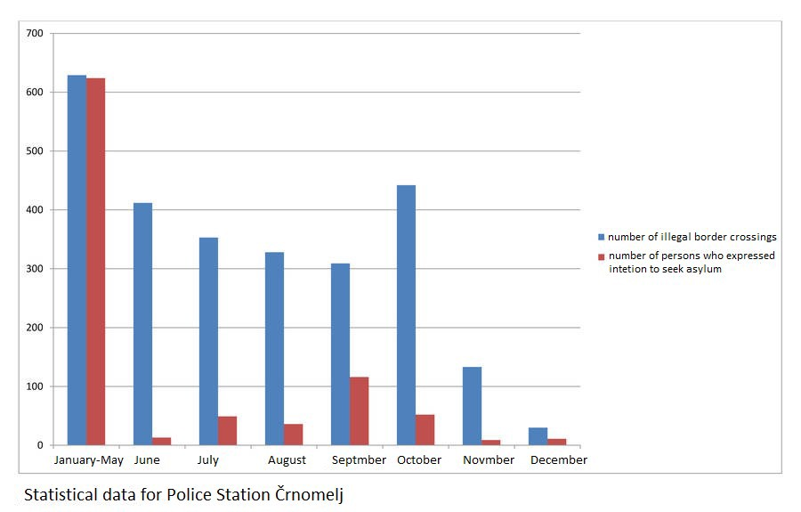

### **Report on illegal practice of collective expulsion on Slovene\-Croatian border**
#### **Processed under the readmission agreement, many people were denied their right to asylum procedure by the Slovenian police, still conducting systematic expulsions to Croatia under the guise of the readmission\. This is a report written by Slovenian activists documenting the continuing unlawful police practice at the border between Croatia and Slovenia**

Photo source: push\-forward\.org

**Last year Slovenian police officially deported 4653 people to Croatia under the regulation of the readmission agreement\. This is means that more than half of 9149 people who were processed for illegally crossing the border were handed over to Croatian police and in further expelled to Bosnia and Herzegovina\. Large majority of people who were processed under the readmission agreement were denied their right to asylum procedure by Slovenian police who is still conducting systematic expulsions to Croatia under the guise of the readmission\. This practice of denial of right to seek asylum has become systematic with the issue of general police instructions on end of May 2018 when official number of readmission increased dramatically\. For example, in police station Črnomelj which is the closest from Velika Kladuša in May out of 379 people who were processed for illegally crossing the border 371 applied for asylum, but after the issue of police commands in June out of 412 people who crossed the border illegally only 13 officially asked for asylum\.**

**Threats, violence, abuse of power and denial of basic rights has became a common practice in other border police stations, collective expulsions to Croatia are happening daily with the knowledge and support of high police and government officials despite high risk of further violence and theft done by police in Croatia\.**
### Introduction

This report is the result of a civil society initiative InfoKolpa, which started in the spring of 2018\. The civil initiative was a response to an alarming number of reported illegal actions through which Slovenian police started systematically denying people the right to seek asylum in Slovenia\. The number of people who were denied asylum procedure and were collectively pushed back to Croatia under readmission agreement increased drastically after May last year\. Reports of rejected migrants implied that the Slovenian police are treating migrants in way that is indicating a serious abuse of power\. Many of those who managed to cross the border and expressed intention to seek asylum in Slovenia were denied their right and were handed over to the Croatian police, without going through the adequate legal procedures\. The police in border police stations has been and still is falsifying interviews with asylum seekers, trying to show as if people do not wish to seek asylum in Slovenia, which gives the police a legal option to process people through the procedure enacted by the bilateral agreement for readmission that was signed by Slovenia and Croatia in 2006\.

4653 people were officially pushed back in this way from Slovenia to Croatia during last year\.

> Many of those who were brought to Slovenian police stations also reported violence, threats, being asked for bribes and being forced to sign documents without any translation\. 

Many who were returned to the Croatian police from Slovenia were also victims of abuse and violence later on the Croatian\-Bosnian border in form of beating and having their money and personal belongings stolen\. Slovenian police is carrying out systematic readmission on the border while being fully aware that there is high risk of torture and abuse being done by Croatian police in the process of collective expulsions to Bosnia and Herzegovina\.

> This violence is undeniable, has been documented, reported and is under investigation for some time now\. By denying the right to asylum and conducting collective expulsion of thousands of people Slovenian authorities are directly involved in a systematic abuse of human rights in the Balkan region\. 

With the knowledge of existence of this illegal police practices, a phone number was established for migrants who were located on the territory of Slovenia and had the intention to apply for asylum\. The phone number was then distributed through flyers in Velika Kladuša in June\. The flyers also contained basic information on asylum rights, Dublin regulation, the issue of push backs and what to expect when contacting the above mentioned phone number\. The purpose was to have a _mediator_ between the people on the move and the police units, which would hopefully reduced the number of illegal expulsions of people who could not access their right to asylum procedures\. When people would cross to Slovenia, they could contact the number and explain the situation, and if they wished to claim asylum in Slovenia, they would send information about their names and country of origin on the said phone number\. When the wish to deal with police was expressed, the local police station would be informed either by email or phone\. This practice of mediation was successful when the _mediator_ was a lawyer of an NGO\. After the pressure from the ministry with threats of criminal charges, the NGO discontinued the phone number, but a group of volunteers continued this practice with a different phone number from September to November\. Even though some groups of people were able to successfully express their asylum request, the majority was still pushed back to Croatia\.

> After two months it became apparent that police are ignoring the mediation and are acting illegally even with full knowledge that the asylum process is monitored by a third party\. 

This report is a collection of data regarding abuse of power and systematic violence of Slovenian police against migrants\. It includes a data analysis made available from public sources as well as existing reports prepared by various field organizations, and of information gathered by the phone line Info Kolpa\. The telephone line was originally set up by the Pravno\-Informacijski Center — PIC, an NGO specialized on legal assistance to migrants in mid\-July 2018\. In this time it became clear on the basis of numerous testimonies that the Slovenian police started systematically violating the right to asylum procedure in form of collective expulsion to Croatia under the pretext of readmission agreement\. In early September, PIC withdrew from their interventions to police stations, while the InfoKolpa continued with a different phone number\. **This report covers the period between 11th September and 7th November 2018\.** The telephone number was intended to inform migrants about their rights, mediate in asylum procedures and monitor the work of police\.

The phone line was used when migrants who contacted the phone number were on the territory of the Republic of Slovenia with the intention to seek asylum and would express a desire for the volunteers to inform the police about their location\. In such cases the nearest was informed\. The phone line volunteers would send the geographical location, information on people seeking asylum and a clear statement that people are in dire need of help and wish to apply for international protection in Slovenia to the regional police station\. This was done via phone or an email sent to the police station in jurisdiction\. Also the Office of Ombudsman in Slovenia and different NGOs involved with protection of human rights were informed\.

> **_This report contains 20 such recorded cases \(106 persons\); in 6 cases, persons were admitted to the asylum procedure in Slovenia \(27 persons\); in 7 cases they were pushbacked to Croatia and then illegally expelled to Bosnia and Herzegovina \(39 persons\); only one person was able to initiate the procedure for international protection after extradition to Croatia and was not expelled to Bosnia and Herzegovina\. In 7 cases \(39 people\) there is no information of what had happened with the people, as they haven’t made any contact after they were apprehended by Slovenian police\. There are three reasons for this:_** 

> **_\- The people did not want further communication;_** 

> **_\- Police officers seized their phones for the purpose of conducting an investigation;_** 

> **_\- The phones were destroyed or stolen either by Slovenian or Croatian police\._** 

Towards the end of 2018, the phone communication had died down\. It became apparent that the police insist on practicing systematic rejection and expulsion of asylum seekers, despite being made aware of people’s intention to apply for asylum in the Republic of Slovenia\. The situation was not improved even though state institutions and NGOs dealing with human rights protection had been informed about the police’s actions\. Hence, the telephone number was no longer serving its original purpose of helping people in need\. The purpose of setting up the number was to intervene in the illegal and unethical police practice, as they deliberately and systematically hold plenty of people in inhuman conditions and expose them to brutal violence\. The aforementioned police violence also contributes to the fact that people are hiding from the police in forests and are crossing dangerous river current, which lead to cases of death due to exhaustion, hypothermia and drowning\.

Recently, it has become clear that even responsible and competent state institutions refuse to clearly identify and condemn systematic violations of human rights by the police and the Ministry of Interior Affairs\. Considering the large number of readmission which started happening overnight in June 2018 it is safe to suspect that the illegal practices of police in border police station were ordered and coordinated from top police officials who still remain in power\. The purpose of this report is therefore to draw attention to concrete violations, collective expulsions, the systematic rejection of the right to asylum procedure, misuse of power at police stations and violence against migrants that takes place during police procedures on both the Slovenian and Croatian sides of the border\.
### Systematic rejection of the right to asylum by the Slovenian police and Cooperation with police in Croatia on border externalization

Slovenia and Croatia represent the border of the Schengen area, inside which border controls are supposed to be minimal\. In consequence, the control on the external Schengen border is reinforced and militarized in forms of higher police presence, legal measures to reduce illegal border crossings \(such as readmission agreements\), technology to control movement, expulsions and systemic police violence against migrants\. Slovenia started with systematic illegal denial of the right to asylum procedure and collective expulsions in the end of May 2018\.

> **_On May 25th 2018, police stations received an order signed by ex Director General of Slovenian Police Simon Velički which instructed that when in mixed patrols of Slovenian and Croatian police, if a person is caught illegally crossing the border, he/she should be returned to Croatia\. It is worth mentioning that [Croatian police denied any such cooperation and knowledge of these instructions](https://www.dnevnik.si/1042845762) \. It seems that the order was a pretext for illegal expulsions, since many parts of the police instructions on asylum procedures remain unavailable for the public_** _\. **This instruction by itself has not yet been recognised as unlawful by any court, but after this order was introduced, the number people who were given the right to an asylum procedure reduced drastically**_ \. 

At the Police Station Črnomelj in May 2018, 379 people were apprehended for illegal border crossing and 371 of them \(98%\) expressed the intention to seek asylum\. In June, after these police instructions were introduced, 412 people were apprehended for illegal border crossing, but only 13 of them _managed to express their intention_ to seek asylum in Slovenia\. 
**This means that from May to June the percentage of people who crossed to Slovenia and sought asylum with police in Črnomelj [dropped from 98% to only 3%](http://www.varuh-rs.si/medijsko-sredisce/novinarske-konference/iz-novinarskih-konferenc/novice/detajl/varuh-o-zahtevi-za-oceno-ustavnosti-uredbe-o-hrupu-in-ravnanju-policistov-na-juzni-meji/?cHash=01f3753d10cfc268a8ef4d79dce85363) \. The percentage of people who were accepted to an asylum procedure increased only slightly in the following months\.**

Number of illegal border crossings and number of persons who were able to express intention to seek asylum in Police Station Črnomelj in 2018\.

Those who were denied their right to seek asylum were then eligible to be processed by the readmission agreement between Slovenia and Croatia that was introduced in 2006\.

**Out of 9149 people who were in procedure for illegally crossing the border to Slovenia, police has expelled at least 4653 persons to Croatia under this agreement, with full knowledge that there is high chance that they would be then further expelled to Bosnia and Herzegovina with a high risk of torture and abuse by the Croatian police\.** The same practice of systematic denial of the right to asylum is also present in other police stations along the southern border region such as Police Station Metlika, Police Station Ilirska Bistrica, Police Station Kočevje and Border Police Station Dragonja\.

**It is safe to assume that the instruction for systematic ilegal denial of the right to asylum and the introduction of collective expulsions came from the top police officials in Slovenia under the former minister of interior affairs Vesna Györkös Žnidar\. Directly responsible for the systematic violation of human rights on border police station are former chief of police Simon Velički and former deputy and current chief of police Tatjana Bobnar, both of whom have signed documents which contain instructions and guidelines on dealing with migrants who have been apprehended for illegal border crossing\.** 
The start of the systematic practice of denying the access to the right to seek asylum and the commencement of mass returns can be traced to late May last year when the instructions dated with May 25th 2018 were signed by former Director General of Police Simon Velički\. Drastic increase of readmissions, changes in the management of procedures and numerous testimonies of people who were chain pushbacked to Bosna and Herzegovina show evidence that Slovenian police is in involved in mass falsification of official documentation, malversation, violence and abuse of power in asylum procedures conducted at police station\. Regardless of the clarity of the data indicating obvious changes in the conduct of proceedings, the Ombudsman in Slovenia is not ready to deny or confirm allegations of unlawful police conduct\. The Ombudsman also has the authority to obtain the full content of censored police instructions that coincide with a drastic increase of readmission, but has not done this yet\. In spite of the obvious evidence of systematic violation of human rights at police stations, the office of Ombudsman in Slovenia is to this day unwilling to start an investigation, condemn the systematic abuse of human rights or press for criminal charges against those responsible\. On 26th and 27th of September 2018, UNCHR delegation visited police stations in Ilirska Bistrica, Črnomelj and Metlika\. The delegation commended the work of the police and did not detect any procedural violations\.

According to the testimonies of people who were expelled to Croatia and then to Bosnia and Herzegovina, the procedures at Slovenian police stations are in many cases accompanied by violence, threats, signing of documents in Slovene without translations, and in some cases with beatings\. After arrest, people are brought to the police station, where the police officer takes their fingerprints and photos of faces; this is followed by a quick and superficial interview with the help of a translator\. [No Name Kitchen \(NNK\) reports](http://www.nonamekitchen.org/en/violence-reports) also provide evidence of apparent aggression, racism and bias of some translators\. Often, translators also interrogate asylum seekers, for which they are not authorized\. This is followed by the acquisition of 250–500 euros for the offence of illegal border crossing\. Sometimes dry clothes, water and some food are provided; sometimes people are forced to sleep in wet clothes on the ground, without food or water\.

**_After several hours or days, they are handed to Croatian police and [processed under the readmission agreement](https://www.uradni-list.si/glasilo-uradni-list-rs/vsebina/2006-02-0040?sop=2006-02-0040) \. It is worth noting that the procedures of this agreement, which have been in force since 2006, are not in line with the basic legal principles, since they do not allow minimum legal protection standards in the form of counselling or complaint_** _\._

In the vast majority of cases, the people go again through identification process at the Croatian police station, which is followed by an expulsion across the green border in Bosnia and Herzegovina\. In many cases the expulsion is accompanied by beatings, as well as theft of phones and money\.

The [UNHCR’s Desperate Journeys report](https://www.unhcr.org/desperatejourneys/) , published in September 2018, recorded 1500 cases of refusal of the right to access to asylum and 700 cases of violence in the form of beatings and theft out of 2500 questioned people who were forcibly returned from Croatia to Bosnia and Herzegovina\. As of June, the Slovenian police are consciously in large number handing over migrants to the Croatian police, despite knowing that they will be exposed to brutal violence by Croatian state authorities\. In this way, Slovenian police actively and in full knowledge violates the principle of non\-refoulement in the event of a threat of torture\. It is therefore necessary to terminate the validity of this bilateral agreement, under the guise of which systematic and gross violations of human rights take place\.

Slovenian and Croatian police cooperate under the conditions set by the bilateral agreement on readmission\. When a person is caught in the territory of Slovenia for illegally crossing the border he is taken to police station\. In most of the cases if a person expresses his intention to seek asylum in Slovenia his claim is ignored and usually replied with threats from police\. His belongings \(phone, money…\) are taken away\. The person is usually fined for offence of illegal for illegal border crossing in the sum of 250–500 EUR\. There is also theft and beatings done by police but less regular\. In the process of readmission the belongings of a migrant are usually handed over to Croatian police and not to the migrant despite numerous testimonies of money theft and destructions of phones\. Large number of envelopes and wristbands that were used in process of readmission were found in the border area near Bihać\.

Envelopes used in readmission procedure from Slovenia to Croatia found near Bihać\.

Ripped envelopes and wristbands additionally prove illegal practice of collective expulsion that has become common police procedure in dealing with migrants in Croatia and Slovenia\.

Wristbands used in readmission procedure from Slovenia to Croatia found near Bihać\.

The police in Slovenia and Croatia are performing the role of externalization of the European border\. In order for undisturbed movement of capital and goods across EU and continuous economic growth, the outside border of the EU is strengthened with increased number of national and international \(Frontex\) police units\. Excessive violence, criminalization of migrants and solidarity and expulsions are means to prevent people’s movement in search of survival and better living conditions\. The Balkan migration route has been going through this territory for many years now\. It is one of the points of illegal entry into Europe for people who are prevented from legally crossing borders simply because of their nationality or poverty\. The journey starts in Greece, where most people arrive from Turkey on boats directed toward the islands of the Aegean\. Five of these islands have concentration camps financed by European funds: [leaving the islands is prevented and demonstrations due to unliveable conditions are muted with batons, deportations and court proceedings\.](http://legalcentrelesvos.org/category/news/moria-35/) The other two major routes to the European Union are from Morocco to Spain, and from Libya to Italy\. The authorities in Libya and Morocco already have an agreement with the countries of the European Union for the financing of border police in the form of delivery of boats, jeeps, fences and control equipment for the tasks of restricting migration by all means\. The externalization of European borders is taking place in the Balkans as well as in North Africa, Turkey and Greece\. It takes form of large financial grants, bilateral agreements on accelerated deportations, biometric scanning and the creation of fingerprint databases, training of police, construction of fences, the financing of deportation centres, introduction of repressive legislation and violent and unlawful police practices directed towards migrants\.
### The telephone number for asylum assistance

In mid\-July 2018, the NGO Pravno\-informacijski center \(PIC\) set up a telephone line aimed at providing information to migrants regarding their rights as well as informing the competent police authorities about persons who were located on Slovenian territory and had the intention to apply for international protection in Slovenia\. The establishment of a 24\-hour telephone line was a response to the increasing number of worrying testimonies of persons who were prevented from gaining access to the right to apply for international protection and were subjected to police violence\. In testimonies people claimed that minors, families and other vulnerable persons were also denied their claims to asylum procedure\. During visits to Velika Kladuša, some volunteers distributed leaflets to migrants with information on asylum procedure in Slovenia: what is the procedure, which are the competent authorities, what are their rights and obligations in the individual stages of the procedure\. Volunteers also gave the people a telephone number they could turn to if they wished to seek asylum in Slovenia\. The telephone number operated according to the [“alarmphone” principle](https://alarmphone.org/en/) , which has already proved somewhat effective in some other parts of Europe \(Croatia, Spain, Greece, Italy\) in fighting the unlawful practices of police\. The purpose of this telephone number was to independently monitor border crossings and monitor police procedures\.

The operation of the phone involved the provision of basic information to persons regarding their right to international protection and getting information on the controversial functioning of the police at the border, as well as getting information about the situation in Velika Kladusa\. People mostly called or wrote to the number after crossing the Slovenian\-Croatian border\. In the cases when they themselves wanted to, they also reported their name, age, country of origin, location and the number of persons in their group\. Then, with their confirmation that they wish to apply for international protection and to call the police, volunteer would inform the authorities of the location of the persons and their intention to seek asylum\. Members of Pravno\-informacijski center — PIC \(NGO offering legal assistance to migrants\) were thus informing police stations via telephone or e\-mail about the intention of people to seek asylum in Slovenia\. Based on the talks with PIC, in July and August 16 interventions were carried out in cases of groups that had declared their intention to apply for asylum in Sloveni\. In 13 cases, the police complied with the legislation and the people were allowed to start asylum procedures, while in 3 cases the police claimed that the groups were never located in that area\. Later it turned out that they were pushed back across the border\.

On 7th of September 2018, a joint press conference was held by the Ministry of the Interior and the Human Rights Ombudsman in Slovenia\. During this press conference now former interior minister Vesna Györkös Žnidar publicly accused an unnamed non\-governmental organization with allegedly disputed activity in informing police stations about persons wishing to seek help and tagged the notification that police officers have to comply with legislation as problematic\. It did not take long for the media to discover that the unnamed non\-governmental organization is PIC\. This discovery was followed by a media lynch of the said NGO by Delo newspaper\. Members of PIC withdrew from the practice of operating a telephone line because of the fear of endangerment of the organization, while the Info Kolpa continued with the practice with a different telephone number\.

The purpose of setting up “alarmphone” phone practices was to prevent illegal police conduct and prevent additional casualties due to the repressive EU border regime which prevents any possibility of safe and legal border crossings for many people\. The point was to prevent the illegal practice of expulsion by acting as a third party and a mediator in asylum procedure\. The Info Kolpa phone’s secondary purpose was to record possible illegal police conduct\. Between the 11th and 7th of November 2018, Info Kolpa has intervened 20 times \(106 persons\) at police stations with e\-mails or phone calls\. Apart from the police, the presence of people wishing to apply for asylum in Slovenia was also communicated by email to the Ombudsman, Amnesty International Slovenia and, in some cases, the General Police Station\. In 6 cases, the police accepted groups to asylum procedure \(27 persons\), in 6 cases, persons were collectively deported and have later replied to us from Bosnia \(39 persons\), and only 1 person was able to apply for asylum in Croatia after he was deported from Slovenia\. In 7 cases, the persons did not reply after they were apprehended by Slovenian police and it is not known what happened to them \(39 persons\) \. Possible reasons why people did not respond are: they themselves did not want to continue the communication, the police took their mobile phones because of the purpose of the investigation or the phones were stolen or destroyed by police in Slovenia or Croatia\.
### Conclusions

Findings of this report and already existent research and testimonies show a violent and worrying nature of police procedures with migrants on Slovene police stations on the southern border area\. The violations are not sporadic or depended on whims of individual police officers but are systematic\. The mass denial of right to seek asylum was ordered and coordinated from top officials in Slovenian police while the Ministry of Interior had full knowledge of this illegal instructions and silently supported them\. Testimonies of people who were chain pushed back from Slovenia through Croatia to Bosnia and Herzegovina describe police violence, beatings, threats and forced signing of documents without translations\. With expulsion of more than 4500 people across the border the Slovenian state has put many in danger of torture and theft and thus exposed already marginalized group of people to additionally trauma\.

**Considering the situation on the border, living condition in camps in Bosnia and police violence it is necessary to demand:**

> \- Immediate ending to collective expulsions from Slovenia to Croatia under the guise of bilateral readmission agreement\. Immediate suspension of the said bilateral agreement which does not follow basic standards of legal protection\. Immediate ending of systematic violations of right to claim asylum\. 

> \- Introduction of civil surveillance of police work and procedures when dealing with migrants 

> \- Full disclosure of police instructions on dealing with migrants and a full investigation for abuse of power against former Director General of Police Simon Velički, current Director General of Police Tatjana Bobnar, former interior minister Vesna Györkös Žnidar and former employee of Ministry of Interior Affairs Boštjan Šefic 

> \- Investigation against individual police officers who were involved in cases where there was proven excessive use of physical violence in forms of beating and theft towards people who were apprehended for illegal border crossing\. 

This report was written by civil initiative Info Kolpa and is supported by Border Violence Monitoring\. 
The original document is available for download [**here**](https://push-forward.org/porocilo/report-illegal-practice-collective-expulsion-slovene-croatian-border) \.
#### AYS and the Daily News Digest — how to get involved?

**We strive to echo correct news from the ground through collaboration and fairness\. Every effort has been made to credit organizations and individuals with regard to the supply of information, video, and photo material \(in cases where the source wanted to be accredited\) \. Please notify us regarding corrections\.**

**Apart from daily news in English, we also publish weekly summaries in Arabic and Persian\. Find specials in both languages on our medium site\.**

**If there’s anything you want to share or comment, contact us through Facebook, Twitter or write to: areyousyrious@gmail\.com\.**

**We’re open to expanding our team of volunteer researchers, editors and info gatherers\.**

_Converted [Medium Post](https://medium.com/are-you-syrious/report-on-illegal-practice-of-collective-expulsion-on-slovene-croatian-border-e1210bf7dd8f) by [ZMediumToMarkdown](https://github.com/ZhgChgLi/ZMediumToMarkdown)._
