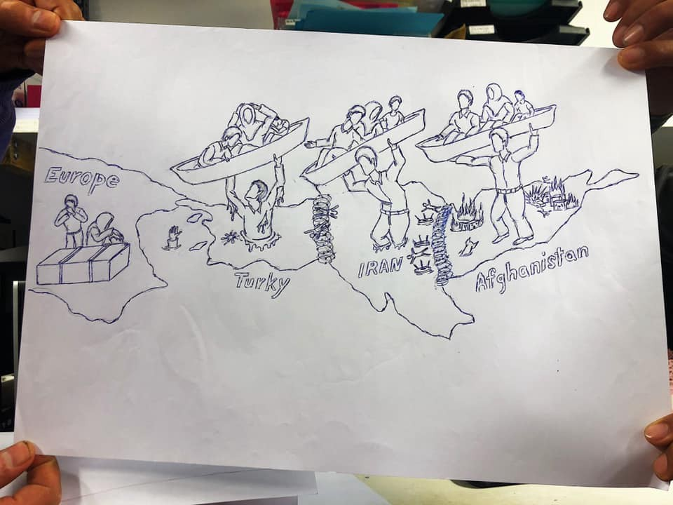
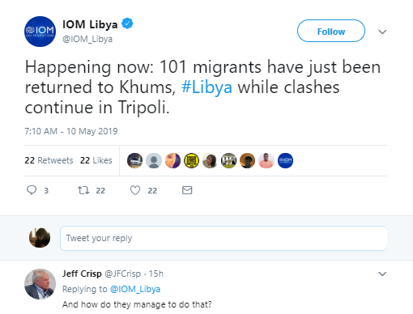

### AYS Daily Digest 10/05/2019: 70 People Died at Sea, 100 Others Sent to Death in Libya\.
#### At least 70 people have died in a shipwreck off the coast of Tunisia// Airstrikes are hitting close to detention centres in Libya// 420 people arrested in Turkey as they attempt to flee to Greece// 70 people rescued at sea disembarked in Italy// Croatian Interior Minister still denying push\-backs// Complicated Swedish laws leave children without food

[Are You Syrious?](https://medium.com/@AreYouSyrious)

May 11

Source: Samos Volunteers
#### FEATURE

At least 70 people have died in the Mediterranean, off the coast of Tunisia today\. It is the deadliest incident in the Mediterranean since January\. 443 deaths have been recorded in the Mediterranean in 2019, but unfortunately the actual figure is much higher\. It should be noted that the proportion of deaths versus attempted crossings has risen from 1\.2% in 2018 to 1\.6% in 2019, as reported by The Missing Migrants project\.

Alarm Phone reports that the boat most likely departed from Libya and the numbers of deceased are likely to rise\. 16 people were saved by fishermen\.

In another incident that occurred off the coast of Libya, 100 people, including 24 women and 8 children, have been intercepted and returned to Libya by the Libyan Coast Guard\. Their boat was in distress due to engine failure, reports Alarm Phone\.

[_Today a report was released by Channel 4 News \(UK\)_](Revealed: human rights abuses in Libyan migrant camps As many as 70 people have died trying to reach Europe after their boat capsized in the Mediterranean Sea on the way…www.channel4.com) that showed an attack that occurred on a detention center in Libya\. Truly horrific scenes are witnessed as at least two refugees were killed and dozens injured by gunfire in the detention center\.

In this report, Dimitris Avramopolous, the EU Migration Commissioner has admitted to the hypocrisy of EU policy in Libya, but the question remains… What will be done to stop these EU funded and EU orchestrated atrocities? What policies will be changed to stop people being sent back to Libya where they risk death? When will rescue boats be allowed to operate in the Mediterranean to save the lives of people fleeing to Europe via the sea? When will Europe stop funding the Libyan Coast Guard?

UNHCR and IOM are quick to denounce the conditions in Libya and deaths in the Mediterranean, but fail to offer any practical solutions that are of much value to the people affected\. Their outrage on social media platforms is no consolation to the people who die at sea while trying to flee Libya, while rescue boats are criminalized and prevented from saving lives by EU Authorities\. Are these genuine advocacy efforts or well\-developed government approved PR stunts?

#### LIBYA

141 people have been transferred from Zawiya Detention centre yesterday to the UNHCR GDF Centre\. Sally Hayden reports that people described feelings of guilt as they had to leave others behind\.

People stuck in Tajoura detention centre in Tripoli are terrified due to an airstrike that occurred very close to where they are staying\.

■■■■■■■■■■■■■■ 
> **[Sally Hayden](https://twitter.com/sallyhayd) @ Twitter Says:** 

> > Breaking: Another air strike in or very close to Tajoura detention centre. People there are terrified &amp; asking if there's any hope of help for them. 

> **Tweeted at [2019-05-10 16:58:26](https://twitter.com/sallyhayd/status/1126894275625660416).** 

■■■■■■■■■■■■■■ 

■■■■■■■■■■■■■■ 
> **[Sally Hayden](https://twitter.com/sallyhayd) @ Twitter Says:** 

> > Got sent this video showing what detainees could see from Sabaa detention centre, Tripoli, last night. 
"Hits the military camp located few meters from behind our wall" - a refugee there messaged me.
[twitter.com/sallyhayd/stat…](https://twitter.com/sallyhayd/status/1126611425663881216) https://t.co/wIpe0ZM7YJ 

> **Tweeted at [2019-05-10 19:25:09](https://twitter.com/sallyhayd/status/1126931199094611974).** 

■■■■■■■■■■■■■■ 

Meanwhile, the UN Security Council has called for the warring side to commit to a ceasefire in Tripoli\. Furthermore, the ICC prosecutor Fatou Bensouda has issued a warning that her office is prepared to investigate and prosecute anyone responsible for war crimes or crimes against humanity\.
#### MOROCCO

■■■■■■■■■■■■■■ 
> **[Ali Zoubeidi](https://twitter.com/DrAZoubeidi) @ Twitter Says:** 

> > Moroccan authorities had prevented 25,000 illegal crossings  From January 1st  to April 30th 
#migration #morocco #borders #spain #EU 

> **Tweeted at [2019-05-10 20:43:18](https://twitter.com/alzoubeidi/status/1126950863992446976).** 

■■■■■■■■■■■■■■ 

#### TURKEY

#### SEA

_Converted [Medium Post](https://medium.com/are-you-syrious/ays-daily-digest-10-05-2019-70-people-died-at-sea-100-others-sent-to-death-in-libya-4d3b74bd373) by [ZMediumToMarkdown](https://github.com/ZhgChgLi/ZMediumToMarkdown)._
