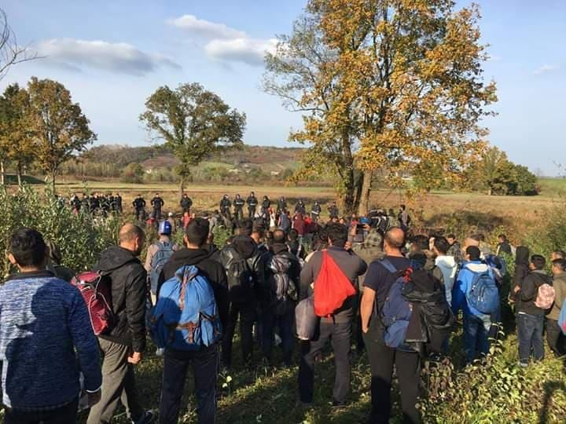

### عملیات های در جریان برای مقابله با اخراج پناهندگان
#### AYS Weekly News Summary in Persian, May 6\-12

 \-Photo](../assets/4d2f3ed5d612/1*Np0UpE8fZs7Iy_BcWLM8iA.jpeg)

[Refugees in Iceland](https://www.facebook.com/refugeesiniceland/?tn-str=k%2AF) \-Photo
### **جزیره**
#### اعتراضات علیه اخراجی ها

فعالان پناهندگان این گروه در ایسلند و گروه بدون‌مرز، راهپیمایی طولانی ۴۸ کیلومتری خود را از اردوگاه پناهندگان اسبرو به اینگول ، ،کوپاووگور به پایان رساندند \. این راهپیمایی بدنبال چندین اقدام برای پاسخ به تعداد زیادی از اخراج‌ها به یونان و ایتالیا بود \. وزیر دادگستری ، Þordis Kolbrun Reykfjorð ، هفته گذشته طی یک جلسه ۳۰ دقیقه‌ای در مورد آن دو ماه پیش بیانیه‌ای صادر نکرد و گفت که این کافی است \.

آن‌ها خواستار این هستند :

۱\. اخراج های بیشتری اتفاق نیوفتد — با پایان تبعید به ایتالیا و یونان آغاز نمی‌شود \. این کشورها مملو از پناهندگانی هستند که به دنبال پناهندگی هستند\. در نتیجه مردم در خیابان‌ها به سمت زندگی سوق داده می‌شوند \.

۲\. بازبینی قابل‌توجهی برای همه — شروع با پناهندگان که واکنش منفی به جای دیگر داده بودند — در غیر این صورت آن‌ها به کشور مبدا خود تبعید شدند — و به آزار و اذیت و مرگ محکوم شدند \.

۳\. یک مجوز کار در طول فرآیند درخواست \.

۴\. دسترسی برابر به مراقبت‌های بهداشتی \.

۵\. تعطیلی اردوگاه پناهندگان منزوی در اسبرو \.

### **دریا**
#### تلفات بیشتر در این هفته

گروه ا\.م\.پ گزارش داد که ۹ تن از دوازده نفر در اثر واژگونی قایق خود در ۳۰ آوریل در مدیترانه غربی کشته شدند \. این گروه از یک روستا در سنگال بود \. وقتی آن‌ها زنگ هشدار را صدا کردند و سعی کردند GPS شان را برای ما بفرستند ، یک موج بزرگ شکست خورد و قایق واژگون شد و آن‌ها هیچ راهی برای رسیدن به آنجا نداشتند \. “ بعد از آن که به آن‌ها گفتند که احتمالا ً یک قایق اسپانیایی برای کمک به مراکش برای کمک ، آن‌ها در بعد از ظهر ۱ ماه می نجات یافتند \. یکی از نه نفری که در طول روز پنجشنبه حادثه دیگری را گزارش کردند ، هنگامی که چهار نفر در تنگه جبل‌الطارق کشته شدند\. آسوشیتدپرس گفته‌است که ماهیگیران موفق به نجات دست‌کم هشت نفر شده‌اند \.

در همان حال ، طبق گفته Publico گارد ساحلی اسپانیا ۳۵۹ نفر را نجات داده‌است \. پس از ۴۸ ساعت گذشته ، چهار صد و پنج نفر در اسپانیا وارد اسپانیا شدند \. او می‌گوید که نه نفر در آب‌های ترکیه نزدیک Ayvalik غرق شده‌اند \. Alarmphone یک راند ۵۱ نفری را در شمال غربی ساموس یافت \. همه آن‌ها اهل سوریه بودند \.” با این کار ، بنزین و موتور مان را نابود کردند \. قایق ما دیگر نمی‌توانست حرکت کند \. امواج ، ما را به سوی ترکیه حمل می‌کردند \. پس از حدود ۳۰ دقیقه گارد ساحلی ترک رسید و ما را دستگیر کرد \.

■■■■■■■■■■■■■■ 
> **[Canarias Ahora](https://twitter.com/Cahora) @ Twitter Says:** 

> > 🔴🔴 Una patera con 26 migrantes a bordo llega a la playa grancanaria de Meloneras #Sucesos #Canarias
[eldiario.es/canariasahora/…](https://www.eldiario.es/canariasahora/sociedad/patera-migrantes-bordo-grancanaria-Meloneras_0_895910473.html) https://t.co/FZgmjkOCZk 

> **Tweeted at [2019-05-05 09:25:00](https://twitter.com/cahora/status/1124968224267726848).** 

■■■■■■■■■■■■■■ 

### **بریتانیا**

Bail برای زندانیان مهاجرت راهنمای افراد در رزرو بلیط و یا در معرض خطر بازداشت شدگان را منتشر کردند \. این کتاب به عربی موجود است \.

### **سوریه**

سه بیمارستان نیز امروز در شمال سوریه بمب‌گذاری و از خدمت مرخص شدند \.

منابع گزارش داده‌اند که از ۲۸ آوریل تا کنون ۱۰ مرکز پزشکی هدف قرار گرفته‌اند و سه تن از کارکنان پزشکی جانشان را از دست داده‌اند \.

> موج اخیر در حملات باعث جابجایی گروهی شده‌است \. از ۲۱ آوریل ، 231,087 نفر از خانه‌های خود فرار کرده‌اند و 462,496 در ۶۱ جامعه مورد حمله قرار گرفته‌اند \. بسیاری از این خانواده‌ها بدون سرپناه هستند ، در فضاهای باز زندگی می‌کنند ، در معرض عناصر هستند، و به مراقبت‌های پزشکی نیاز دارند \. حداقل ۱۰۰ غیرنظامی از جمله سه پرسنل پزشکی کشته شدند و حداقل ۳۰۰ تن زخمی شدند \. تعداد زیادی از تلفات زنان و کودکان بودند \. 

### **مجارستان**

به روز رسانی اقدامات قانونی برای جلوگیری از اخراج سه نفر از خانواده‌هایی که از گرسنگی تلف شدند ، اداره مهاجرت و مهاجرت مجارستان در مناطق ترانزیت \.

بین ماه‌های فوریه و آوریل ۲۰۱۹ به تنهایی ، ۱۳ نفر در هنگام بازداشت در مناطق ترانزیت ، بدون غذا مانده‌اند \.

■■■■■■■■■■■■■■ 
> **[HunHelsinkiCommittee](https://twitter.com/hhc_helsinki) @ Twitter Says:** 

> > Just rqsted #rule39 emergency order to stop deportation to AFG 3 previously starved families, some with grave medical conditions by @[Frontex](https://twitter.com/Frontex). Asylum claim was never examined on merits, no proper analysis of risk of return conducted.Warned this could happen [helsinki.hu/en/hungary-con…](https://www.helsinki.hu/en/hungary-continues-to-starve-detainees-in-the-transit-zones/) https://t.co/4zzKoGBxbO 

> **Tweeted at [2019-05-06 17:41:27](https://twitter.com/hhc_helsinki/status/1125455549502509056).** 

■■■■■■■■■■■■■■ 

### **اتریش**

از وین تا لاگوس \( نیجریه \) در ۱۶ می برنامه‌ریزی شده‌است \.
#### **هشدار به اخراج**

ما یک‌بار دیگر یادآوری می‌کنیم که تبعید به مدت ۱۶ مه از وین تا لاگوس ، نیجریه برنامه‌ریزی شده‌است \.

این فعالان به افرادی هشدار می‌دهند که ممکن است نگران باشند که پلیس در آدرس‌های داخلی خود به دنبال افراد بگردد \. یورش‌های پلیس نیز در مغازه‌ها ، باشگاه‌ها ، رستوران‌ها ، مغازه‌های سلمانی و غیره متداول است \.

آن‌ها گزارش می‌دهند که اخیرا ً مردم فقط یک یا دو روز قبل از پرواز چارتر لغو شده‌اند ، بنابراین زمانی برای اعتراض و یا اقدامات مشابه وجود ندارد \.
### **سوءد**
#### اخراج

گفته می‌شود که حداقل ۱۰ نفر از پناهندگان افغان در عصر سه‌شنبه از کشور اخراج شده‌اند \.

> وی افزود : “ افرادی که به وطن بازگشته اند، با فهرستی از هتل‌هایی که بازگشته اند ، از جمله هتل اقامت قبلی که به وطن بازگشته اند ، تحویل داده خواهند شد \. آن‌ها مجبورند با پولی که از سوی مقامات سوئدی دریافت می‌کنند ، بپردازند \. 

### **آلمان**

شورای اروپا اخراج آلمان را مورد انتقاد قرار داد \.

“ روش‌هایی که باعث ایجاد احساس خفه‌کننده و فشار کم کردن اندام‌های جنسی می‌شوند باید ممنوع شوند \.

جدیدترین گزارش نتیجه‌گیری می‌کند : این تنها نوک کوه‌یخ است ، همان طور که پلیس در حین تبعید به طور مرتب مورد ضرب و شتم قرار می‌گیرد \.

**کمیته پیش‌گیری از شکنجه و رفتار غیر انسانی یا تحقیرآمیز این گزارش را در مورد دیدار خود از آلمان از ۱۳ تا ۱۵ اوت ۲۰۱۸ منتشر کرده‌است \.**

در میان توصیه‌های دیگر ، آن‌ها بیان می‌کنند که هیچ فردی از آلمان برکنار نخواهد شد در حالی که دادگاه استیناف که دارای تاثیر suspensive است هنوز قبل از دادگاه در حال تعلیق است ؛ این امر باید با استفاده از “ روش فراخوانی آخر “ در عمل تایید شود \.

به نظر می‌رسد که آن‌ها از تمرین دیر یا حتی آخرین لحظه عزیمت افراد به وطن خود در روز پرواز برنامه‌ریزی‌شده خود انتقاد می‌کنند \. ما بارها در مورد عمل تبعید شبانه نوشته شده‌ایم ، از جمله آن‌هایی که تحت قرارداد دوبلین اخراج شدند ، حتی زمانی که هیچ مدرکی برای آن وجود نداشت و برای مثال کرواسی به طور ضمنی خانواده‌ها را به مرکز پذیرش خود در زاگرب ، بی‌خبر از عدم آمادگی و عدم ارائه پرسش‌هایی در مورد این که چگونه و چرا اتفاق افتاد ، پذیرفته بود \.

این گزارش می‌افزاید که افراد در معرض خطر آسیب و یا خودکشی یا با مشکلات سلامت روانی باید یک ارزیابی جامع پزشکی را انجام دهند \. علاوه بر این ، مکانیسم شکایات موجود باید در عمل در دسترس و موثر قرار گیرد ، از جمله ارائه اطلاعات کافی برای افرادی که به وطن بازگشته اند تا شکایت کنند \. البته این موضوع بسیار دور از تمرین است و بسیاری هنوز در تلاش برای دریافت اطلاعات کامل و شفاف از فرآیندی هستند که به آن‌ها مربوط می‌شود \.

گزارش کامل را در اینجا پیدا کنید، در حالیکه پاسخ رسمی در اینجا موجود است \.

### **لیبی**

۱۴۱ نفر از مرکز بازداشت زاویا به مرکز GDF کمیساریای عالی پناهندگان سازمان ملل منتقل شده‌اند \. سالی هایدن گزارش می‌دهد که مردم احساس گناه را توصیف می‌کنند چون مجبور بودند دیگران را پشت سر بگذارند \.

■■■■■■■■■■■■■■ 
> **[Sally Hayden](https://twitter.com/sallyhayd) @ Twitter Says:** 

> > Breaking: Another air strike in or very close to Tajoura detention centre. People there are terrified &amp; asking if there's any hope of help for them. 

> **Tweeted at [2019-05-10 16:58:26](https://twitter.com/sallyhayd/status/1126894275625660416).** 

■■■■■■■■■■■■■■ 

افرادی که در بازداشتگاه Tajoura در طرابلس گیر کرده بودند به خاطر حمله هوایی که بسیار نزدیک به جایی که آن‌ها در آنجا بسر می‌برند ، وحشت دارند ، شورای امنیت سازمان ملل خواهان آتش‌بس در طرابلس است \. علاوه بر این ، دادستان دادگاه جنایی بین‌الملل Fatou Bensouda هشدار داده‌است که دفتر وی آماده بررسی و تعقیب هر کسی است که مسئول جنایات جنگی یا جنایت علیه بشریت است \.

■■■■■■■■■■■■■■ 
> **[Sally Hayden](https://twitter.com/sallyhayd) @ Twitter Says:** 

> > Got sent this video showing what detainees could see from Sabaa detention centre, Tripoli, last night. 
"Hits the military camp located few meters from behind our wall" - a refugee there messaged me.
[twitter.com/sallyhayd/stat…](https://twitter.com/sallyhayd/status/1126611425663881216) https://t.co/wIpe0ZM7YJ 

> **Tweeted at [2019-05-10 19:25:09](https://twitter.com/sallyhayd/status/1126931199094611974).** 

■■■■■■■■■■■■■■ 

### بوسنی

وزارت امنیت بوسنی اعلام کرده‌است که حدود 30,000 نفر بین دوره‌های ژانویه ۲۰۱۸ و آوریل ۲۰۱۹ به بوسنی رسیدند \. این یک افزایش عظیم در مقایسه با ۷۵۵ تازه‌وارد در دوره مشابه در سال ۲۰۱۷ — ۲۰۱۸ است \.
### کرواسی

وزیر کشور کرواسی در سخنرانی خود در کنفرانس مطبوعاتی در طی دیداری با همتای وزیر باواریا خود گفت که ورود مردم به کرواسی باید به روش قانونی و قانونی انجام شود \. او گفت که آن‌ها باید خواهان حمایت بین‌المللی باشند ، در حالی که می‌گویند \( و تکرار \) که به نظر می‌رسد او نسبت به این حقیقت بی‌توجه است که مردم باید حق درخواست پناهندگی داشته باشند \. با این حال ، این حق مورد احترام نیست و در عمل مردم هنوز به بوسنی و هرزگوین ، حتی از ایستگاه‌های پلیس در کشور ، برده می‌شوند \. وزیر همچنین ادعا می‌کند که هیچ نشانه‌ای از اتهامات مربوط به خشونت پلیس و رفتار نادرست وجود ندارد \. با این حال ، اینها صرفا ً یک اتهام نیستند : در حال حاضر انبارهای بزرگی از آمار وجود دارد که در آن‌ها دوره‌های مختلف ضرب و شتم ، دزدی ، و شکنجه وجود دارد که توسط پلیس کرواسی به مهاجران تحمیل شده‌است \.

این حساب‌ها با تمرین پلیس اسلوونی هم در ارتباط هستند ، که اخراج یکی از گام‌هایی است که به طور واضح MO را براساس سیاست‌هایی قرار می‌دهد \. در اینجا گزارشی در مورد حمایت از اسلوونی آورده شده‌است

### [هیچ طرحی برای حمایت از مادران تنها در افغانستان وجود ندارد](https://www.dw.com/fa-af/%D9%87%DB%8C%DA%86-%D8%B7%D8%B1%D8%AD%DB%8C-%D8%A8%D8%B1%D8%A7%DB%8C-%D8%AD%D9%85%D8%A7%DB%8C%D8%AA-%D8%A7%D8%B2-%D9%85%D8%A7%D8%AF%D8%B1%D8%A7%D9%86-%D8%AA%D9%86%D9%87%D8%A7-%D8%AF%D8%B1-%D8%A7%D9%81%D8%BA%D8%A7%D9%86%D8%B3%D8%AA%D8%A7%D9%86-%D9%88%D8%AC%D9%88%D8%AF-%D9%86%D8%AF%D8%A7%D8%B1%D8%AF/a-48707722)

جنگ، ناامنی و حوادث در افغانستان همه روزه مادران بیشتری را مجبور می کند سرپرستی خانواده شان را به دوش بگیرند\. اما وزارت امور زنان می گوید هیچ میکانیسم مشخصی برای حمایت از این زنان وجود ندارد\. گزارش را بخوانید

**اخبار بیشتری به انگلیسی در صفحه رسانه ما در دسترس است \. در مواردی که شما سوالاتی دارید و یا مایلید برخی اطلاعات مربوط به روند پناهندگی شما یا کشور مورد نظر را منتشر کنید , لطفا ً برای نوشتن پیغام روی فیس بوک یا نوشتن یک ایمیل به آر\.یو\.س تردید نکنید**

[**areyousyrious@gmail\.com**](mailto:areyousyrious@gmail.com)

_Converted [Medium Post](https://medium.com/are-you-syrious/%D8%B9%D9%85%D9%84%DB%8C%D8%A7%D8%AA-%D9%87%D8%A7%DB%8C-%D8%AF%D8%B1-%D8%AC%D8%B1%DB%8C%D8%A7%D9%86-%D8%A8%D8%B1%D8%A7%DB%8C-%D9%85%D9%82%D8%A7%D8%A8%D9%84%D9%87-%D8%A8%D8%A7-%D8%A7%D8%AE%D8%B1%D8%A7%D8%AC-%D9%BE%D9%86%D8%A7%D9%87%D9%86%D8%AF%DA%AF%D8%A7%D9%86-4d2f3ed5d612) by [ZMediumToMarkdown](https://github.com/ZhgChgLi/ZMediumToMarkdown)._
