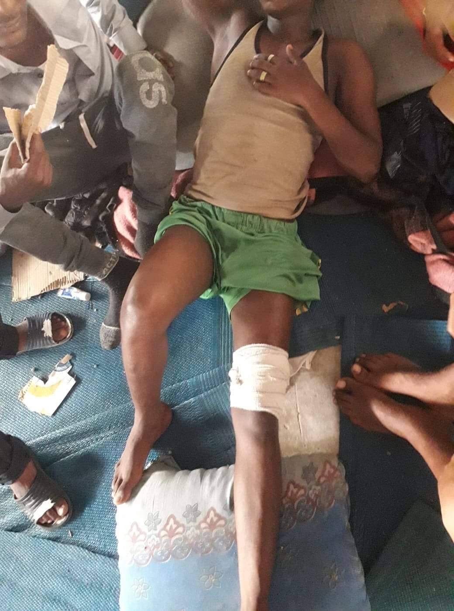
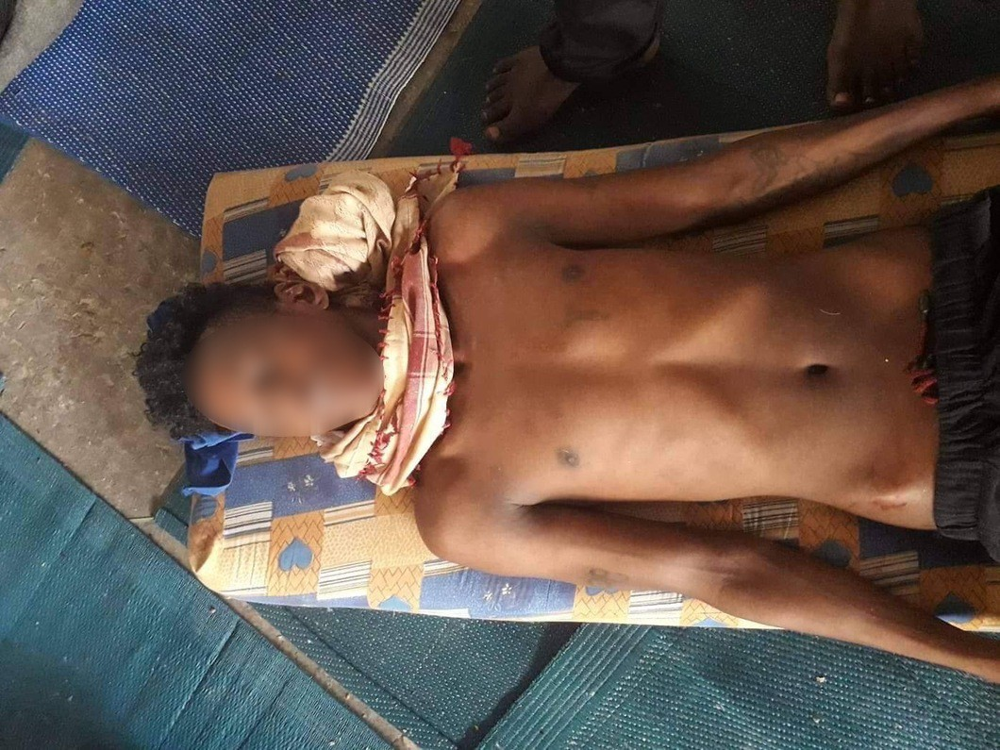
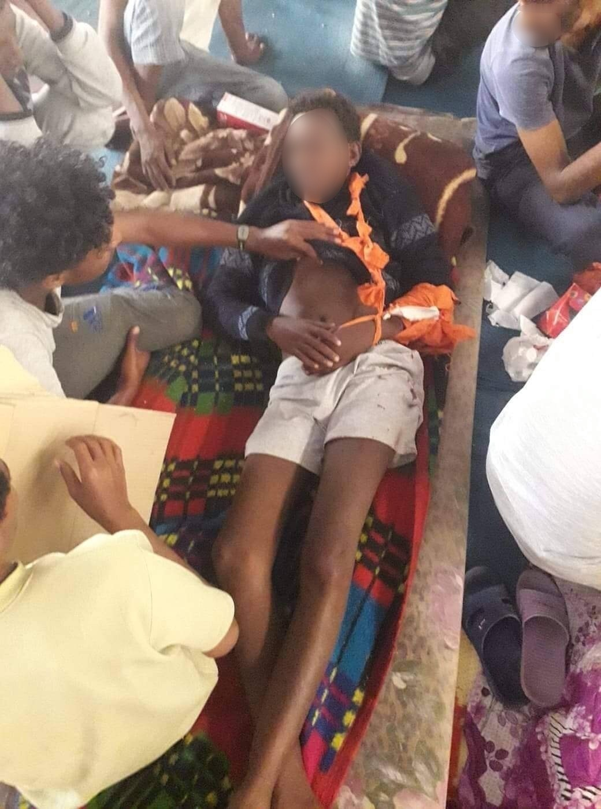
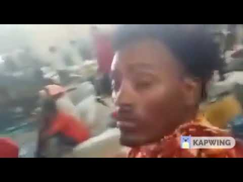
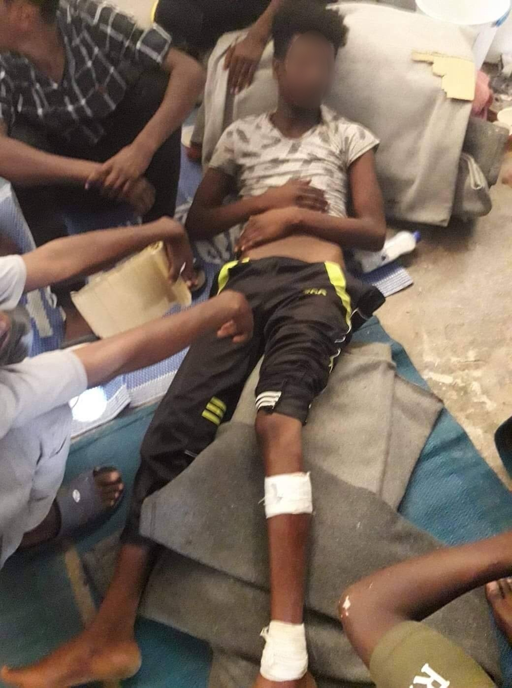
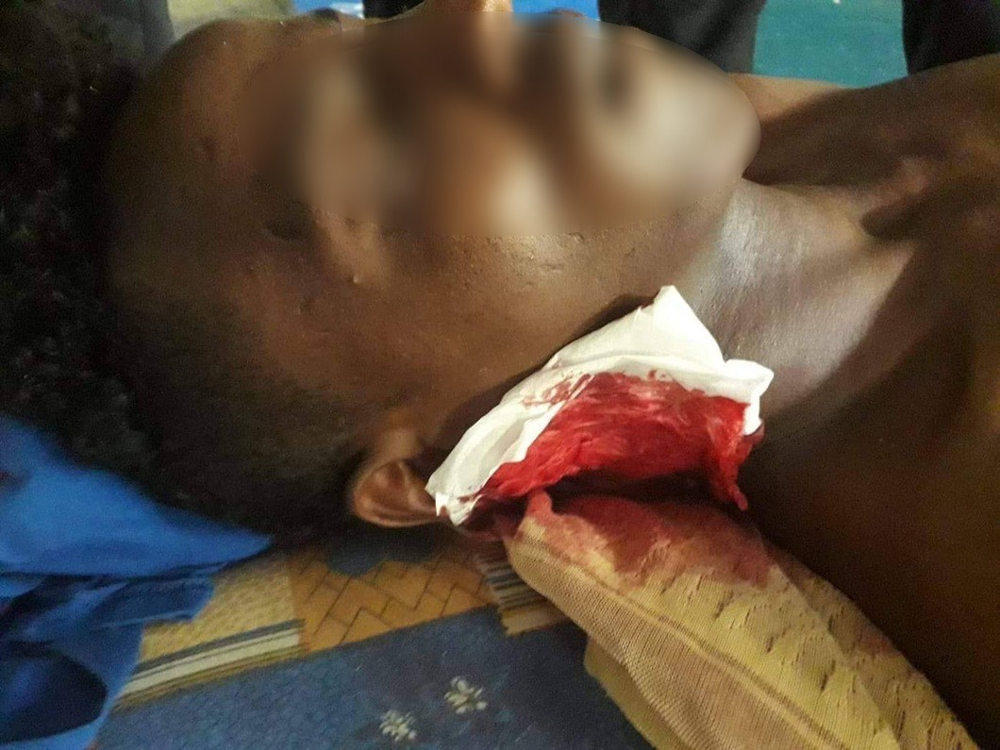

### AYS SPECIAL from Libya: On the Ben Ghasr Shooting
#### As the EU keeps supporting the Libyan Coast Guard in order to stem arrivals to Europe — in spite of all the reports of abuse and criminal activities on the Libyan side — thousands of people are being returned to what is now also a war zone\. One of the journalists who have been following the story through contact with detainees in immigration detention centres shared for AYS the testimonies of people who were trapped inside during an attack on the detention center Qasr ben Ghasir\.

Photos taken by detainees at Qasr ben Ghasir

Two weeks ago, soldiers forced their way into the detention center Qasr ben Ghasir outside of Tripoli in Libya\. They asked the refugees for their phones but when they refused, the soldiers started shooting into the crowd killing three people and wounding several\.

In a statement, UNHCR\-Libya wrote that the soldiers only fired their guns in the air and nobody was hurt by bullets, but Amnesty International has called for it to be investigated as a war crime, shooting at innocent and unprotected refugees\. MSF \(Medecins Sans Frontieres\) have documented evidence of recorded videos and images that people were shot at and that they were hit by the bullets\.

**This article is partly based on conversations through WhatsApp, Messenger and IMO with refugees and migrants in detention centers in Libya\. Because of their vulnerable situation, the people spoken to remain anonymous\.**

> Emergency\! Emergency\! Emergency\! 

> “Soldiers came into our prison and started shooting into the halls\. Many refugees have been shot\. Some of them were taken to hospital in ambulances\. The soldiers did not care what happened to us\.” 

Desperate words ticked into my instant messenger a week ago written by a twenty\-something year old man being held in the Qasr ben Ghasir detention center,south of Tripoli in Libya\. Seven hundred refugees, many of them Eritrean people, have been held in detention there for over two weeks, caught in the battlefield between marshal Khalifa Haftar’s rebel forces and soldiers from Libya’s UN recognized government\.

**Access to food and clean drinking water had been sporadic\.** 
Among the 700 people being held there were many women, including several pregnant women, and children under five years\.

Sexual violence and rape are common in the Libyan detention centers\. “Some of the women undressed and started screaming rolling around on the floor but it did not stop the soldier’s evil deeds\. They just beat them and pulled them across the concrete floor and forced them back into their rooms,” he wrote **\.**

Other refugees in Qasr ben Ghasir are confirming the events\. Human Rights and Migration lawyer Giulia Tranchina, and a number of other journalists, myself included, have received photos and videos smuggled out and sent on IMO, Messenger and WhatsApp\. The pictures and videos taken in aftermath of this shooting show wounded and screaming people\. In the background you can clearly hear shooting\.

The 700 refugees have now been evacuated to another detention center, Zawiyah, located outside of Tripoli on the coast\.

Giula Tranchina and Amnesty International do not hesitate calling the shooting to be investigated as a war crime\. According to Tranchina, three people were killed and nineteen injured\. The dead bodies and the most wounded were immediately taken away by ambulances, my contacts in the detention center write\.

UNHCR\-Libya and the government of Libya previously tried to evacuate the 700 refugees away from Qasr ben Ghasir to a “safer” place\. They wanted to bring people to a prison in the city Zintan, 150 kilometers from Tripoli, but out of fear of where they would be taken, the refugees refused to enter the buses when they arrived at Qasr ben Ghasir\.

> _”Zintan is a graveyard\. We do not want to go to Zintan,” a contact wrote me\. The prison in Zintan is notorious, known among the stranded refugees and migrants in Libya because many have died there of tuberculosis and hunger\._ 

The English [media said](https://www.theguardian.com/world/2019/apr/25/libya-detention-centre-attack-footage-refugees-hiding-shooting) it is probably the first time a Libyan militia entered into a building filled with refugees and open fired\. According to witnesses, the soldiers storming the detention center were recognized as belonging to renegade forces of General Khalifa Haftar\. They ordered the refugees to hand over their phones and when they refused, the soldiers started firing their guns directly at the people\.

The phones are the only way refugees captured in Libya are able to communicate with the outside world\. According to Amnesty, one witness described seeing the symbols of the Libyan National Army on the trucks of the attackers, but other victims said it was unclear who the attackers were\.

**Amnesty international calls the shooting to be investigated as a war crime, requiring further immediate investigations\.** UNHCR\-Libya said in a statement that shots were fired in the air, and twelve people had to go the hospital because of what the UNHCR called ”physical damage”\. According to UNHCR, there is no evidence of people being shot\.

MSF workers present in Libya has made an investigation into the existing videos and photos from the incident in Qasr ben Ghasir\. In a press release on 24 April they said that videos and other photographic evidence proves that refugees were shot at and injured when the soldiers entered Qasr ben Ghasir:

> ”Not all details can be proved, but an analysis of the existing videos and images by MSF tells that the wounds are from gunshots,” _MSF said in a press release\._ 

”To say, we were outraged is an understatement,” says Karline Kleijer, MSF’s Head of Emergencies\.

> ”Nothing justifies such a violent assault on civilians who are trapped in a conflict zone and are acutely vulnerable\.The international community must immediately evacuate the remaining thousands of refugees and migrants to safety\.” 

Many of the accounts of the attack describe the gunmen firing at people as they were praying together, explained Tranchina: ”The accounts provided by witnesses directly **to** us on social media, as well as to other international organisations such as Amnesty International and Medecins Sans Frontieres consistently describe how the armed men opened fire on the detained refugees who were praying, shooting at them in cold blood, seriously injuring about nineteen people\. It appears that three of them have died\.”

> ”This shocking attack follows weeks during which militias had been intentionally preventing refugees in Qasr ben Ghasir from receiving food and beating up two refugees who had tried to get out to find food for the starving children\.” 

There are 26 detention centers in Libya hosting 6,000 refugees, most of them registered with UNHCR for protection\. Among the 6,000 there are many children, pregnant women \(often as a result of rapes\) and newborn babies\. According to Amnesty International, there are at least 3\.600 refugees and migrants caught in detention centers and prisons in the middle of conflict zones\. Refugees and migrants in Libya are exposed to torture, rape, extortion and human trafficking\. The UN organisation IOM \(International Organization for Migration\) has managed to send a large number of stranded migrants back to their home countries, but refugees from countries like Eritrea, sometimes called “Africa’s North Korea,” cannot simply return home\.

> It has never been more dangerous to be a refugee or migrant in Tripoli than now\. 
 

> It is important that refugees at risk are released and evacuated to a safe country\. 

### **Kidnapped**

The day after the violent shootings, the remaining refugees were evacuated from Qasr ben Ghasir to the Zawiyah detention center, 50 miles **n** orthwest of Tripoli **on** the coast\. According to one of the people I spoke to, some refugees tried to escape from Qasr ben Ghasir before the evacuation\.

”But they were taken by kidnappers and robbed from all their belongings, including phone and money\. Then they contacted our brothers and told them\. They have now been released after being blackmailed and is with friends somewhere else,” he texted\.

Some of the detention centers in Libya are run by the government, others are controlled by different militias or traffickers\. Zawiyah detention center, where the 700 refugees from Qasr ben Ghasir were evacuated, is run by human traffickers, according to human rights activist Andrea Gagne\. Gagne is also a researcher?\) in women in exile and refugees from the Horn of Africa\.

> ”Just a reminder, Zawiyah detention center is headed by traffickers,” _she writes on Twitter\._ 

In 2018, a group of migrants from Nigeria managed to smuggle a video out of Zawiyah showing the horrible conditions they lived in\. The video was sent to France 24 Observers, an international news media, who then contacted IOM and the migrants were returned to Nigeria\.

> The IOM has shown that it can act when faced with media scrutiny, but its general approach seems to be to try and cover up the killings and abuses in Libyan detention centers\. 

One person wrote from Zawiyah:

”It is safe here now because of the war, but it is also one of the toughest places to stay in in Libya\.”

”Zawiyah was the prison where many African people were killed in 2016 when they tried to escape\. Almost 100 died at that time\. Until now it’s OK\. We are allowed outside during daytime\. Only at night we are locked up\.”

”And the Eritreans were allowed to celebrate Easter yesterday\. The boss went to get some living chickens and vegetables and we had fun\. Currently UNHCR arrives every day to register the refugees who are not yet registered\.”

> ”I just hope that UNHCR do not forget us\. We are scared that they will after some days and we will be left on our own\.” 

He explained that when they arrived at Zawiyah, the women and men who were already there told them that here, y **ou will have to pay 8000 Libyan dinars in ransom if you are from Eritrea, Somalia or Ethiopia** \. If you are from Nigeria, Cameroon or Ghana you have to pay 4000, while if you are from Niger or Sudan it is 2000 dinars\.

> ”If you pay, you are free and can walk into the street\. If you do not pay, you will be locked up for a year, and the boss will ask you if you want to work for him\.” 

— Reported by: Anette Kjær Jørgensen, independent journalist
#### AYS and the Daily News Digest — how to get involved?

**We strive to echo correct news from the ground through collaboration and fairness\. Every effort has been made to credit organizations and individuals with regard to the supply of information, video, and photo material \(in cases where the source wanted to be accredited\) \. Please notify us regarding corrections\.**

**Apart from daily news in English, we also publish weekly summaries in Arabic and Persian\. Find specials in both languages on our medium site\.**

**If there’s anything you want to share or comment, contact us through Facebook, Twitter or write to: areyousyrious@gmail\.com\.**

**We’re open to expanding our team of volunteer researchers, editors, and info gatherers\.**

_Converted [Medium Post](https://medium.com/are-you-syrious/ays-special-from-libya-on-the-ben-ghasr-shooting-85070b9532af) by [ZMediumToMarkdown](https://github.com/ZhgChgLi/ZMediumToMarkdown)._
