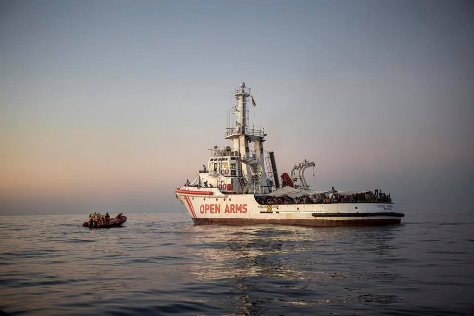
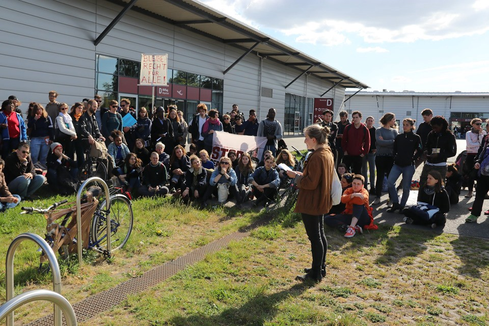

### AYS Daily Digest 14/05/19: Open Arms dismissed of charge for aiding illegal immigration
#### Captain of Mission Lifeline to be fined 10\.000 euros//Expulsions and push\-backs from and to Morocco continue//Aid agencies and EU call for a ceasefire and a UN Resolution for Libya//One more death in Bosnia//EU not to return people to their countries of origin if the risk of death and torture is high//2018 report on Greece for AIDA released//Story of solidarity from Italy//…

Credit: Proactiva Open Arms
### FEATURED STORIES
#### The public prosecutor of Catania has asked for the dismissal of the charges against Open Arms’ captain and head of mission, Marc Reig Creus e Ana Isabel Montes Mier\. The main charge for them was aiding illegal immigration\.

■■■■■■■■■■■■■■ 
> **[angela caponnetto](https://twitter.com/AngiKappa) @ Twitter Says:** 

> > La procura di Catania ha chiesto l'archiviazione per il reato di associazione finalizzata al favoreggiamento dell'immigrazione clandestina nei confronti di Marc Reig Creus e Ana Isabel Montes Mier comandate e capo missione della nave #Proactiva della ong @[openarms_fund](https://twitter.com/openarms_fund) @[RaiNews](https://twitter.com/RaiNews) https://t.co/6dcbfsnnpu 

> **Tweeted at [2019-05-14 18:24:57](https://twitter.com/angikappa/status/1128365599959207936).** 

■■■■■■■■■■■■■■ 

The ship was ceased after the crew refused to hand over 218 people on the move to the LCG, between March 15th and 18th 2018\. The operation was conducted in Libyan waters and the ship was ceased in the first place as Open Arms conducted the rescue operation even if aware of the responsibility of the Libyan authorities\.

Read a very detailed analysis of the events [here](https://openmigration.org/en/analyses/the-prosecutors-case-against-the-rescue-ship-open-arms/) \.
#### On the other hand, [Malta is fining the captain of Mission Lifeline with a 10\.000 euros bill](https://www.timesofmalta.com/mobile/articles/view/20190514/local/lifeline-captain-fined-10000-over-migrant-rescue-vessel-registration.709936?fbclid=IwAR2grMIBE3WrD7dwEc0LYdvUGP8R11aPfha-8UNQLfRBNmwyPOsNhJP3L5o) , as the vessel is, apparently, not properly registered\.

> The _Lifeline_ is registered as a pleasure craft in the Netherlands, but Dutch authorities said this constituted only a certificate of ownership and did not grant the right to fly the Dutch flag\. The defence argued that the certification indicated Holland as the vessel’s flag state and therefore constitutes recognition by the Dutch authorities\. 

> The court concluded that the registration “was not to the satisfaction of the Dutch authorities” when the vessel entered Maltese waters\. 

The lawyer of the NGO announced the will to appeal the decision and that another vessel has been bought to continue SAR operations\.

■■■■■■■■■■■■■■ 
> **[Marc Tilley](https://twitter.com/TilleyMarc) @ Twitter Says:** 

> > "Mission Lifeline will submit an appeal against the judgment, but if the price to pay for saving 234 lives is €10,000, then the cost of a life is €43 and I will pay it every time." https://t.co/1V8Fghxsa1 

> **Tweeted at [2019-05-14 09:00:51](https://twitter.com/tilleymarc/status/1128223639806128129).** 

■■■■■■■■■■■■■■ 

#### As [local volunteers report](https://www.facebook.com/groups/459851131106164/permalink/652413915183217/?hc_location=ufi) , one of the 3 Iranian men who were sleeping rough outside Bihać, in Bosnia, died at the hospital, after falling from the building where they were sleeping\.

Less than a month ago, a small group of Iranians was in Tuzla for 3 days, sleeping outside, as the volunteers group was overloaded with work and not able to host the 3 in a hostel or similar accommodation\.

One of the volunteers managed to get bus tickets to Bihać, so they succeeded to reach Bihać\. Upon arrival, they understood the real and dire situation presently in Bihać, where even food is lacking for those who don’t get a place in the infamous camp Bira\. For a few days they were asking for a place to stay\. They found a building that was in construction and slept there\. One of the boys fell from the building, ending up in a hospital until yesterday, when he died\. Even the locals didn’t know about it until the Tuzlan volunteers informed them about it\.

Similar as in the previous case of death in Tuzla, and most of the other cases, nobody interested is able to receive proper information, nobody investigates the circumstances of those deaths nor do the media report thoroughly on the deaths… the locals, taking care of these people and establishing contact with them to make sure they’re ok later on, are desperate over everyone’s treatment of these young people\.

Please, read more about conditions in Bosnia [here](https://medium.com/are-you-syrious/ays-weekend-digest-11-12-2019-price-per-head-salvini-proposes-5-500-euro-fine-per-person-saved-6824c5e82443?fbclid=IwAR2jj7LKJ_eC1Nxdx3-3PUhZp4p9-O5uTtlMjcM34B83FxO57GOFWzKnMmw) \.
#### Solidarity stories need to be supported and reach the wider public\.

An Italian missionary, Biagio Conte, has been carrying on a hunger strike since 15 days in order to prevent the expulsion of Paul, a 51\-year\-old plumber from Ghana, hosted by Conte in his “Speranza and Carità” mission in Palermo, Sicily\.

The man also put some shackles at his feet and wrote to the Pope, announcing his will to comply with his mission until the very end\.

Paul has been in Italy for 10 years and now his permit to stay has expired; it cannot be renewed due to the new policies introduced by the Salvini decree\.

His expulsion is planned for 26th May\.

See original source [here](https://www.open.online/primo-piano/2019/05/13/video/biagio_conte_a_digiuno_da_15_giorni_non_cacciate_paul_dall_italia_salviamolo-212997/?fbclid=IwAR2x_DlA43EGzpvpTYHx8j2cDAUAu_rWwZpA3EBKKDvPIl7XqveyhRSZ8yI) \.

**UPDATES** : The regional administrative court of Palermo has cancelled, at least for the moment, the expulsion order for Paul\.
### MOROCCO

The detention centre of Kariat Arkmane, east of Nador, has been re\-opened since last Saturday, hosting around 80 people, [according to AMDH — Nador](https://www.facebook.com/AmdhNador/photos/a.1693125780899690/2328684060677189/?type=3&theater) \.

The majority of the people in the centre were captured after attempting to jump the fence separating Morocco from Melilla, but 15 of them were pushed back from Spain after having their asylum application rejected\.

Expulsions to countries of origin through the airport in Casablanca are systematically happening\.
### LIBYA

65 people drowned\. 871 people were returned to detention centres in Libya, where they live in unbearable conditions\. And this happened just in the past few days\.

Not only people are suffering from deprivations and human rights violations on a daily basis, but also their lives are threatened constantly, due to the indiscriminate bombings around detention centres, as [reported by MSF](https://twitter.com/MSF_Prensa/status/1128332438613168128?fbclid=IwAR1Td-yevhFVYUiY3GE2vvScKXfumVj58LCDU9h0JsgZfWspn6mGiDAJHKU) \.

In [AYS latest special on Libya](https://medium.com/are-you-syrious/ays-special-from-libya-on-the-ben-ghasr-shooting-85070b9532af?fbclid=IwAR14iP-heNT-saWSE6BmJEh5JwjdAplLHjn7kVX6NB0O_5hhflkzTUv03p8) , we reported about the Qasr ben Ghasr shooting, where 3 people lost their lives and several were wounded after police opened fire on the people detained in the centre, just because they refused to hand over their phones — the only way they have to communicate and denounce their living conditions to journalists and the external world\.

> ”Nothing justifies such a violent assault on civilians who are trapped in a conflict zone and are acutely vulnerable\. The international community must immediately evacuate the remaining thousands of refugees and migrants to safety\.” 

The EU called for a ceasefire in Libya, adding that the constant bombings represent a threat to international security, not realising that the very same European policies and “deals” are the ones causing such escalations of violence, permitting extreme human rights violations\.

■■■■■■■■■■■■■■ 
> **[MSF Sea](https://twitter.com/MSF_Sea) @ Twitter Says:** 

> > Yesterday, the EU called for a ceasefire in #Libya, citing a threat to international security.

Discussion at EU level cannot ignore the harmful repercussions of EU policies in Libya. The zero tolerance approach for #migrants &amp; #refugees has led to today's horrifying reality. https://t.co/VBQC6cNAQO 

> **Tweeted at [2019-05-14 16:40:00](https://twitter.com/msf_sea/status/1128339188665991168).** 

■■■■■■■■■■■■■■ 

Aid agencies have also called for a UN Resolution to protect people living in the targeted areas\. Read more [here](http://news.trust.org/item/20190514104340-eg93g/?fbclid=IwAR2RNGnsrR604KyqaaBGQ9FnwFbHhr2doTNZZNHeRf7RC4Jxcn1jnXxW0-w) \.
### GREECE

The Greek Council for Refugees has published the 2018 report for the Asylum Information Database, including issues on asylum applications, deprivation of liberty and detention conditions\.

> This report indicates, for instance, that asylum seekers on the Greek islands wait an average of 42 days after their pre\-registration procedure to have their application fully registered\. In addition, in 2018, 91% of asylum requests received on appeal were rejected\. Furthermore, the report states that the reception conditions in the Greek islands are insufficient and may have reached the threshold of inhuman and degrading treatment\. 

A particular focus is given also to detention of vulnerable people and unaccompanied children \(3\.741 at the end of 2018\), stating that “ _persons belonging to vulnerable groups are detained in practice, without a proper identification of vulnerability and individualised assessment prior to the issuance of a detention order_ ”\.

> \- An Afghan citizen suffering from psychosis, who was detained in a police station immediately after his release from a psychiatric hospital without being given access to his medicine during the first two days due to administrative shortcomings\. He was released after a two\-month detention period following an order of the Administrative Court of Athens; \[…\] 

> \- An asylum seeker applying for protection on the basis of his sexual orientation, who was detained for 3\.5 months in a pre\-removal centre together with male adults, constantly expressing fears for his physical integrity; 

> \- A female detainee with HIV who was held in a pre\-removal centre for 5 months; 

> \- An Iranian asylum seeker victim of torture who was detained for 1\.5 month in a pre\-removal centre, without his asylum application being registered, until he was released upon the order of the Administrative Court of Kavala\. 

The average duration of detention is 3 months\.

See the full report at this [link](http://www.asylumineurope.org/sites/default/files/report-download/aida_gr_2018update.pdf?fbclid=IwAR3bowzculk_xV9_eb_p1VNuKDwBMxIRXXm2Ml99iXa1uOwPVe-YYXipGTs) \.

Moreover, you can watch this interesting [documentary](https://www.youtube.com/watch?v=4LAe_pMn4dA&feature=youtu.be&fbclid=IwAR1pmUIQq2W7T5LAls3E-kN38KiZXqK4ciUSO5pKzD2JUUIS2v7pbt0uor4) , including personal testimonies, to witness the unbearable living conditions in Greek camps\.
#### Where to report if you are a victim of a racist attack\.

#### Arrivals

A total of 108 people landed on Greek islands today\.

See [this source](https://www.facebook.com/AegeanBoatReport/posts/573414239848351?hc_location=ufi) for breakdowns\.

[3 years anniversary](https://www.facebook.com/events/2353844014847207/) for the City Plaza in Athens on Saturday 18th\. Discussions and different activities are planned\.
### BOSNIA

No Iftar is possible for the people stranded in Bihać, Bosnia\. Due to lack of food and resources, 320 people are forced not to fast\.

Donations are needed to allow them to buy food and cook themselves\.

Or if you can donate food directly, you can buy oil, rice, potatoes, onions, milk, eggs, tomato sauce, spices\.

The need is also for clothing \(jackets mainly\) and training shoes\.

See more details [here](https://www.facebook.com/solidarnostbosnia/posts/2680903945254107) \.
### ITALY

The Cara di Mineo \(Catania, Sicily\) could be closed by the end of the summer, following the policies introduced by the Salvini Decree\. By doing so, 277 people still in the structure will have nowhere to go\. The remaining people hosted there were either taken to other centres in the island or decided “voluntarily” to flee, exiting the national reception system\.

Not only people on the move are paying the consequences of such decision, but also workers employed by the cooperative managing the structure; in fact, more than 150 people lost their job in the past months\.

The quality of services is therefore decreased and the migrants hosted in the structure protested in various ways, refusing to eat the food served or occupying buildings after the cut on the number of travel tickets they could use to move outside the centre\.

MEDU, offering psychological support, was also initially denied entry; now they agreed on continuing their activities until the complete closure of the centre\.

52 men, among which 12 minors, [landed](http://www.strettoweb.com/foto/2019/05/migranti-sbarco-calabria-clandestini-scappano-ss106-foto/839156/) on the coast of Catanzaro this morning\. They are all in good conditions and were identified and taken care by the authorities\. They will now be moved to other structures in order to proceed with the checks\.
### FRANCE

A sad reminder\. \.

### GERMANY

> Last Sunday, we protested together and loudly with Corasol, Flüchtlingsrat Brandenburg, Feminist strike, Schlafplatzorga, Women in Exile & Friends, Rote Hilfe e\.V\., We demand: Family Reunion for All, Refugee Council Berlin, Seebrücke Berlin, Solidarity City Berlin and Citizens Asylum Berlin against the inhuman practice of detention pending deportation at Berlin Schönefeld Airport \(SXF\) \. There the Brandenburg state government plans to open an additional detention centre in June\. 

](assets/e9fc82e22851/1*at1hZnmXQ9LLbpD2ri51cQ.jpeg)

Credit: [borderline europe — Menschenrechte ohne Grenzen e\.V\.](https://www.facebook.com/borderlineeurope/?__xts__%5B0%5D=68.ARB5zA2A4GUoo7cEtdPjUsUCaw6IT11_B6h82Pe8moGgfqlihSGhDtXgmbDuBEJpnr6rLf2pB_3ZZV8uahx2vVAF-Ub6l4seMHycV5aPYYMu3GAzRUbH86rYNsOy2yk-xZx1xAMqFhHFuXplFnk_aEU4NSTBmg29tDZzFyV08-9L_jl0G85JmRVBrRai7cQ_qsgSoV9KhH854lyVBtWO5bEnNRdgkqx7zFxS2TLnpK0CC0e3Oh3JxwoWQFgoI0530qbZ1a-Cd7kbHcNqA-OutLyDb4kxHS7dpAvarhm165c6XqP8WdmnlPlWpP7oJ_qnMclYZ-j8Jr9E7jFPDWqJ1sfLfY0qMAlLxoTsoAKAQgzVX1yUs8_ivpK5y-ehtrm4d2-6dEtRnlGVWUE4o38tSdenYuN945yR5zPUKzPGipzP7vk&__tn__=k%2AF&tn-str=k%2AF)

[Protest](https://www.facebook.com/events/2336627733263643/) against new draft law that will be discussed on Thursday in the Parliament\.
### DENMARK

Three right wing parties might make it to Folketinget\. Besides Dansk Folkeparti, Stram Kurs \(founded in 2017 by Rasmus Paludan\) and Nye borgerlige \(founded in 2015 by Pernille Vermund\) will get more than the mandatory 2 percent\. None of the two new parties, described as even more far\-right than Dansk Folkeparti, will participate in the EU\-election\.

Last year Denmark gave asylum to 1600 people, which is the lowest number in 10 years\. In the Danish debate, Sweden is used as a bad example: “Swedish conditions” equals areas with big alienation and suburbs with a lot of violence\. Denmark also stopped accepting and receiving UN\-quota refugees\.

In the upcoming election migration and refugees will be a core issue, despite fairly successful integration processes the past years\.

See original source [here](https://www.svd.se/danmark-tar-taten-i-det-framlingsfientliga-europa?fbclid=IwAR3qWuVUA6IY0v1eX2w7QmnkzTSAYr5XUQlCG6s1IIYLvigKVnwFqg2L6xA) \.
### EU

The European Court of Justice has sentenced today that even if a person is not granted asylum or even if his/her asylum status is revoked for public security reasons, this person must not be returned to his/her country of origin if there are high chances for him/her to suffer torture or other ill\-treatments\.

See more details [here](http://www.ansa.it/europa/notizie/rubriche/altrenews/2019/05/14/rifugiati-corte-ue-no-a-rimpatri-in-paesi-dorigine_05093f86-f3bd-4a08-85be-8d076710bb30.html?fbclid=IwAR1cS72CnUeYjOcFnSXhdWUetYOjlkQhc0j-N0Jup8uE446kkJpW6Iu_uZQ) \.
#### AYS and the Daily News Digest — how to get involved?

**We strive to echo correct news from the ground through collaboration and fairness\. Every effort has been made to credit organizations and individuals with regard to the supply of information, video, and photo material \(in cases where the source wanted to be accredited\) \. Please notify us regarding corrections\.**

**Apart from daily news in English, we also publish weekly summaries in [Arabic](%D8%A7%D9%84%D8%AA%D8%BA%D9%8A%D9%8A%D8%B1%D8%A7%D8%AA-%D9%81%D9%8A-%D9%82%D8%A7%D9%86%D9%88%D9%86-%D8%A7%D9%84%D9%84%D8%AC%D9%88%D8%A1-%D9%81%D9%8A-%D8%A7%D9%84%D8%AF%D9%86%D9%85%D8%A7%D8%B1%D9%83-b99e429d54ad) and [Persian](%D8%B9%D9%88%D8%B6-%D8%B4%D8%AF%D9%86-%D9%82%D9%88%D8%A7%D9%86%DB%8C%D9%86-%D9%BE%D9%86%D8%A7%D9%87%D9%86%D8%AF%DA%AF%DB%8C-%D8%AF%D8%B1-%D8%AF%D8%A7%D9%86%D9%85%D8%A7%D8%B1%DA%A9-7b984cac7a86) \. Follow the links to read and share the ones from the week of May 6th to 12th\. Find specials in both languages on our medium site\.**

**If there’s anything you want to share or comment, contact us through Facebook, Twitter or write to: areyousyrious@gmail\.com\.**

**We’re open to expanding our team of volunteer researchers, editors, and info gatherers\.**

_Converted [Medium Post](https://medium.com/are-you-syrious/ays-daily-digest-14-05-2019-open-arms-dismissed-of-charge-for-aiding-illegal-immigration-e9fc82e22851) by [ZMediumToMarkdown](https://github.com/ZhgChgLi/ZMediumToMarkdown)._
