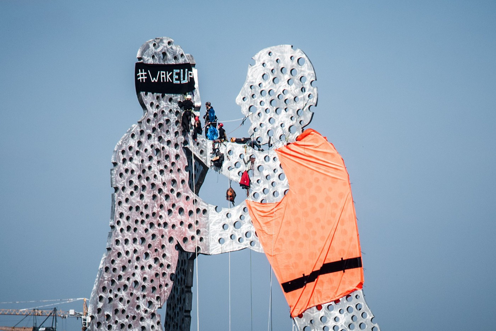
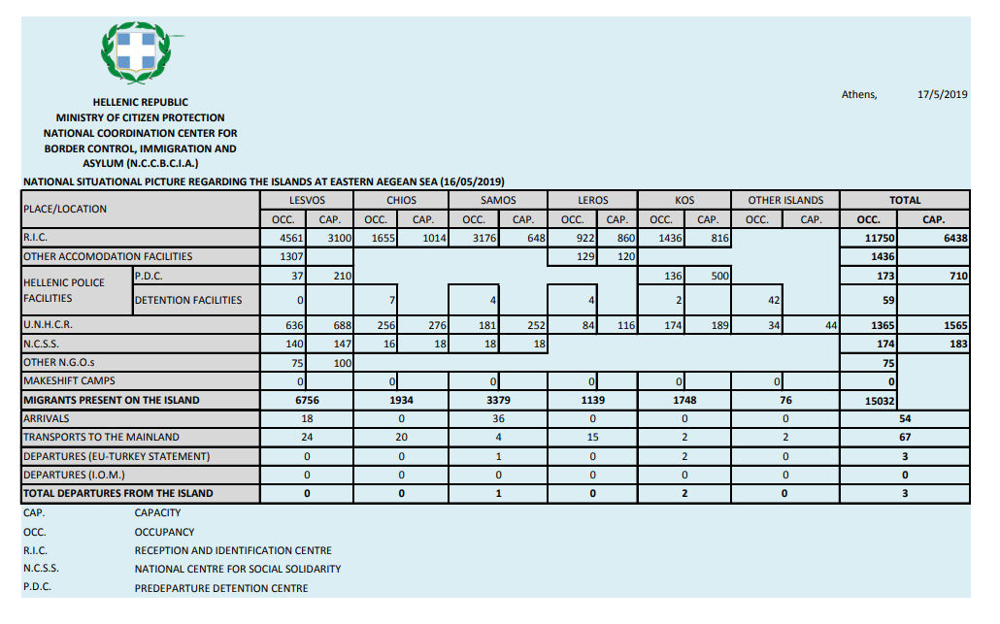
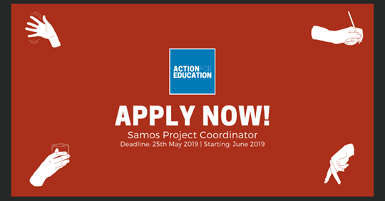
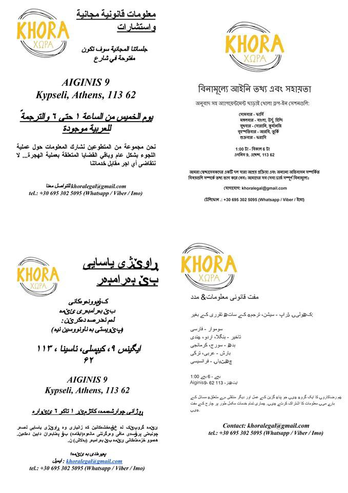
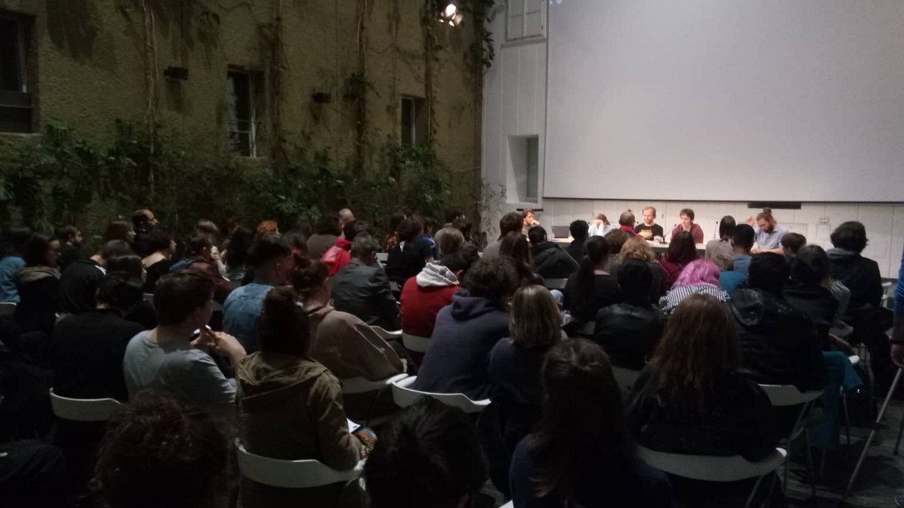
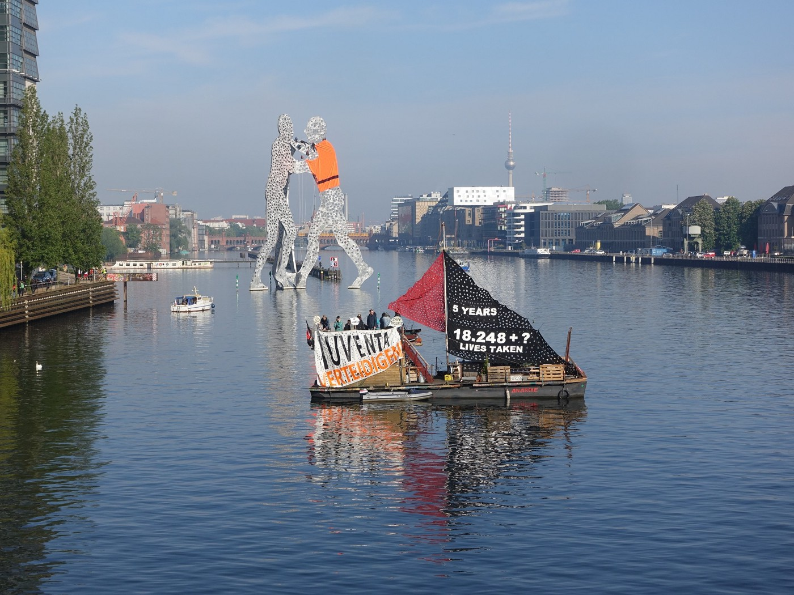
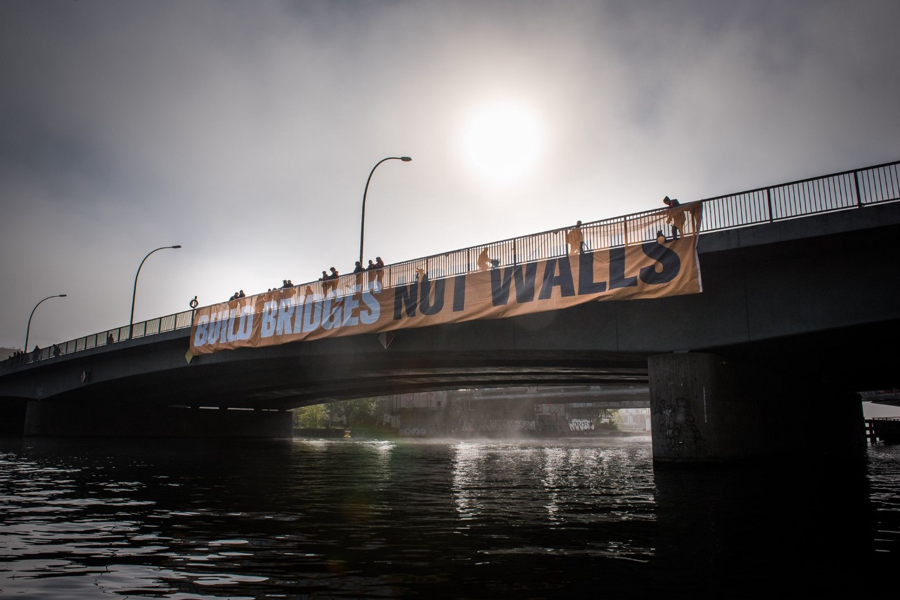
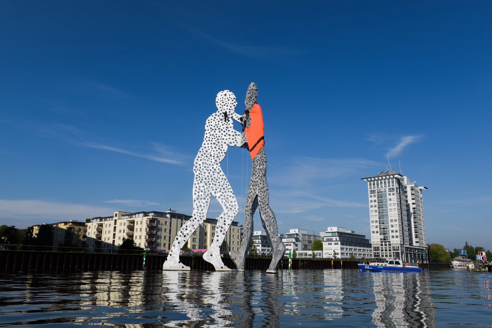
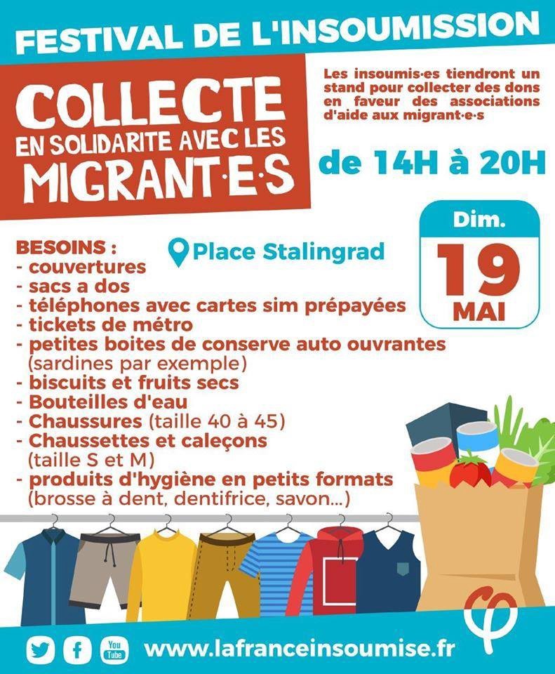

### AYS Daily Digest 17/05/2019: A Secret Document Could Prove Turkey Is Not A Safe Third Country

**Joint Letter demanding the immediate abolition of Unsuitable Detention Facilities in Greece** // Families Evacuated from Sea\-Watch 3 vessel in Lampedusa// 61 people intercepted and returned to Detention Centre in Libya that was hit by an airstrike last week// 26 people arrive in Chios// Rog solidarity space in Ljubljana raided after a public Pushback Report // Activists Put a Life vest on Molecule man in Berlin

Wake UP\! Activists put a life vest on Molecule man in Berlin\! \!
#### FEATURE:

[PRO ASYL and Refugee Support Aegean \(RSA\) urge EASO to release a crucial report on the Turkish Asylum system from 15th June 2016\.](http://PRO ASYL and Refugee Support Aegean urge EASO to release crucial report on asylum system in Turkey… 17 May 2019 Refugee Support Aegean (RSA) and PRO ASYL urge the European Asylum Support Office (EASO) to release a…rsaegean.org)

The document is believed to include information that would show that Turkey is not a safe third country and cannot be considered as such\. This would have implications on rejected asylum claims that are made based on inadmissibility grounds\.

The full document was never published due to the reason that it brought to light many facts about Turkey that went against the political agenda of the EU Commission and other key players such as EASO and EU member states\. All of these actors have promoted the EU\-Turkey deal and considered it to be a “big success\.”

RSA reports that they have requested to access the documents from EASO, but the agency responded by providing a heavily redacted version of the report\.

> It is alleged that the document has been downgraded because it documented that Turkey cannot be considered as a safe third country\. Some traces indicating that Turkey does not fulfil the criteria of a safe country are existent already in the redacted version of the document\. 

> “According to the agency’s assessment — based on [Regulation 1049/2001](https://eur-lex.europa.eu/legal-content/EN/ALL/?uri=celex%3A32001R1049) — a disclosure of the non\-redacted report “could seriously undermine the protection of privacy and integrity of individuals \(in particular it could lead to identifying of the non\-public sources\), and international relations with a third country; as well as the protection of the agency’s decision making process”\. 

**However, RSA and PRO ASYL very appropriately point out that the same regulation mentioned by EASO is “explicit on the agency’s obligation to release a document when there is an [overriding public interest in disclosure](https://eur-lex.europa.eu/legal-content/EN/ALL/?uri=celex%3A32001R1049) \.”**

They argue that in this case, there is a very strong public interest in clarifying the content of the report, and therefore it should be released in the interest of transparency\.

The EU\-Turkey Deal has had dire consequences since it was implemented over 3 years ago\. Over the last three years, AYS has reported on the consequences of the deal that sealed the borders of Europe and put peoples’ lives in extreme danger\.

Nobody has benefited from the deal, apart from smugglers and criminal networks that were constructed in the wake of the deal, making lucrative profits out of games played with human lives\.

For the locals on the Aegean Islands, life has also been difficult to manage because of the deal\. The Greek government disregards their concerns and protests, and continues to support internal borders that keep thousands of people stranded on the small tourist islands, prevented from reaching the mainland\.

For the people that are stuck on Samos, Lesvos, Chios, and Leros because of the deal, life is unbearable\. It has been unbearable for months and even years\.

At the 3 year anniversary of the deal that occurred in March 2016, MSF’S Head of Mission in Greece, Emmanuel Goué stated — **“ _The EU and Greek authorities continue to rob vulnerable people of their dignity and health, seemingly in an effort to deter others from coming\. This policy is cruel, inhumane and cynical, and it needs to end\.”_**

Contrary to what the EU Commission claims, the deal has not been successful\. You can read about its failings in our Special on the [EU\-Turkey deal from March 21, 2018\.](ays-special-about-the-eu-turkey-deal-an-error-in-the-system-2415621d4973)
#### SEA

MSF reports that the medical situation for the people on board the Sea\-Watch 3 vessel remains a big concern\.

■■■■■■■■■■■■■■ 
> **[Sea-Watch International](https://twitter.com/seawatch_intl) @ Twitter Says:** 

> > The medical situation on board is a cause of great concern. Many people suffer from sea sickness and are at risk of dehydration. A woman with burns needs medical treatment. Children are traumatized by remaining in Libyan prisons and risk further psychological harm. #WakeEUp https://t.co/NeAFJT760J 

> **Tweeted at [2019-05-17 09:09:44](https://twitter.com/seawatch_intl/status/1129313036915888129).** 

■■■■■■■■■■■■■■ 

The Italian authorities have since allowed for the disembarkation of the families on board the Sea Watch 3 Vessel\.

Children, mothers, fathers and a wounded woman \(8 Women, 3 Men, 7 children\) are all on board\.

61 other people have been intercepted and returned to Libya, sent to the Tajoura detention center in Tripoli, that was hit by an airstrike a week ago\. MSF reports that more people are going into the detention centre than are being evacuated\.

■■■■■■■■■■■■■■ 
> **[MSF Sea](https://twitter.com/MSF_Sea) @ Twitter Says:** 

> > If tables were turned and the government of #Italy were charged €5,500 for each of the 2,329 people they've left stranded at sea over the past year (including the 65 onboard #SeaWatch3 today), that would amount to a grand total of €12,809,500.

[hrw.org/news/2019/05/1…](https://www.hrw.org/news/2019/05/16/italy-reject-anti-rescue-proposals) 

> **Tweeted at [2019-05-17 06:45:02](https://twitter.com/msf_sea/status/1129276622631329792).** 

■■■■■■■■■■■■■■ 

#### GREECE
#### Arrivals:

26 people arrived on Lilikas Beach on Chios yesterday\. 
8 children, 13 women and 5 men\.
#### Statistics:

\\

Samos Project Coordinater Needed — [Find out more\.](https://www.actionforeducation.co.uk/press/coordinatorsamos?fbclid=IwAR3CtyxQLD0p73zTBVhFpPhexsuFo4dPDPoqNclH_IywYohxENrUhgTxeqo)

#### Mainland

Khora Asylum support team run casework interviews and advice sessions from Monday to Friday\. People are free to come between 1pm\-6pm \(no appointment is needed\) \.

Location: Aiginis 9, Athens, 113 6

Mondays — Farsi
Tuesdays — Bangla, Urdu, Hindi
Wednesdays — Sorani, Kurmanji
Thursdays — Arabic, Turkish
Fridays — French

**\! \!ABOLITION OF UNSUITABLE DETENTION CENTRES IN GREECE\! \!**

A joint open letter has been addressed to the Greek Ministry of Citizen Protection and the Chief of Hellenic Police to demand the immediate abolition of the use of unsuitable detention facilities:

> **We are writing to express our deep concern at the continued detention of irregular migrants and asylum seekers in unsuitable detention facilities\.** 

> **Civil society organizations and the European Committee for the Prevention of Torture and Inhuman or Degrading Treatment or Punishment \(the CPT\) have repeatedly exposed through their reports the deficiencies of Greece’s administrative detention of irregular migrants and asylum seekers\.** 

The letter addresses various themes that relate to
- The procedures applied by the authorities
- Detention conditions

Please find [the letter here\.](https://greekhelsinki.wordpress.com/2019/05/16/2-68/?fbclid=IwAR1zMcXbpTNILv2ogXEm7wsghvv4qfnYvdZsy8h1mtzbq8a8F0WK2-9PCTk)

Below is an excerpt from our [Daily Digest From the 29/03/2019](http://For more information about detention in Greece - please see our digest From the 29/03/2019) that provides some more information about the detention of asylum seekers in Greece:
#### 2018 saw extremely concerning developments in Greek Detention centres:
- 8 pre\-removal detention centres were active in Greece in 2018\.
- 31,126 orders for detention were made in 2018\.

#### 18,205 people were detained throughout the year\. This is almost double the number of people detained through 2017 \(9,534\) \.
- Police centres are still being used for prolonged immigration detention\.
- Many of the centres have a prison\-like design and are not considered suitable for detention exceeding 24 hours, as they fall short of basic standards\. Medical care is considered inadequate; there are no psychiatrists or provision for mental health; medical services were not provided at police stations\. AYS has also received reports that people in detention were forced to take prescription drugs three times daily\.

#### SLOVENIA
### Raid following the Report on pushbacks

On Friday 17th, Slovenian activists published a detailed report on the commitment of Slovenian police to the questionable methods of “border protection\.” On the same evening, the police raided Rog, the solidarity squat in Slovenian capital Ljubljana\. The unannounced and unpleasant event, fortunately ended with no serious consequences for those who were inside\. However, it does pose a question, and very likely leaves a message to those who are vocal about the unjust treatment of people at the borders \(and within them\) \.

Presentation of the Report at the Slovenian Academy of Science and Arts \(Photo: AYS\)
#### GERMANY

Anarchist Collective activists in Berlin have attached a life jacket onto the molecule man\. It was taken down shortly after by police\.

> WAKE UP\! Over the past five years, more than 18,248 people have drowned in the Mediterranean\. In the morning, climbing activists set an unmistakable sign in Berlin\. Now the Molecule Man in the Spree is calling for: BUILD BRIDGES NOT WALLS\! Let’s build bridges instead of walls around Europe\! 

The German Parliament is discussing a bill, dubbed “the orderly return law” that will make it more likely that rejected asylum seekers will be deported\. The bill would mean that anyone rejected will be put in prison, together with people convicted of crimes\.

Although Germany did review the security situation of Syria in March 2018, it is reported that the status of Syrian asylum seekers in Germany will not change\. This put at ease fears that Syrians asylum seekers will have their applications rejected\.
#### FRANCE

[Solidarité migrants Wilson](https://www.facebook.com/Solidarit%C3%A9-migrants-Wilson-598228360377940/?__xts__%5B0%5D=68.ARA9LaKQBk6scdx_qvjm7WADcSe8IQJz09bBnzMAFEjj_aaOQMwPGEdbhKaslqpgdbPVXadzQpM2UywVW-ANysshmgyyWSTUknE1wPWYp229-_0viNh06jIJWahyCqQHe5hxs59E63mMfT5-DZlINHZvmEtUzlR71BAVassWIhquQPzESim3j9fWiVB1imEZg8G3hCwfHq_Z1P4juMt5Z8FnwOYFraAkRGkjwb8_8Mg74tz32YGv299LOwNuqGmJ4hDRuaotUEVUzkrTOIpv7KDbkk4Rd4nMNGo0ZRvjqW0p7KxEhwtgFiZ0kgC_PXRJlqCUhxAAdv1c41THpfGeF4CMpg&__tn__=k%2AF&tn-str=k%2AF) report of a fundraiser that will be occurring on Sunday the 19th of May\. It will be a festive action and they invite you to participate\. See below\.

[A decision was made in relation to a law that would see the modification of the evaluation procedure of unaccompanied minors in France](https://www.gisti.org/spip.php?article6161&fbclid=IwAR2ttaAUhqrqT1TeNXTFK7bcganrgCnu7HDGykLgAX86Q2MIY4xx_m1QWIs) \. The change would have seen a biometric file created for unaccompanied minors\. The Council of State has agreed to the demands of 19 organisations and has passed the matter on to the Constitutional Council for review\.

> **We reaffirm our opposition to the creation of this file and the purposes it pursues\.** Unaccompanied minors must be protected from the impact of a law that should never have affected them\. **They are above all children and they must be protected as such\.** 

#### AYS and the Daily News Digest — how to get involved?

**We strive to echo correct news from the ground through collaboration and fairness\. Every effort has been made to credit organizations and individuals with regard to the supply of information, video, and photo material \(in cases where the source wanted to be accredited\) \. Please notify us regarding corrections\.**

**Apart from daily news in English, we also publish weekly summaries in [Arabic](%D8%A7%D9%84%D8%AA%D8%BA%D9%8A%D9%8A%D8%B1%D8%A7%D8%AA-%D9%81%D9%8A-%D9%82%D8%A7%D9%86%D9%88%D9%86-%D8%A7%D9%84%D9%84%D8%AC%D9%88%D8%A1-%D9%81%D9%8A-%D8%A7%D9%84%D8%AF%D9%86%D9%85%D8%A7%D8%B1%D9%83-b99e429d54ad) and [Persian](%D8%B9%D9%88%D8%B6-%D8%B4%D8%AF%D9%86-%D9%82%D9%88%D8%A7%D9%86%DB%8C%D9%86-%D9%BE%D9%86%D8%A7%D9%87%D9%86%D8%AF%DA%AF%DB%8C-%D8%AF%D8%B1-%D8%AF%D8%A7%D9%86%D9%85%D8%A7%D8%B1%DA%A9-7b984cac7a86) \. Follow the links to read and share the ones from the week of May 6th to 12th\. Find specials in both languages on our medium site\.**

**If there’s anything you want to share or comment, contact us through Facebook, Twitter or write to: areyousyrious@gmail\.com\.**

**We’re open to expanding our team of volunteer researchers, editors, and info gatherers\.**

_Converted [Medium Post](https://medium.com/are-you-syrious/ays-daily-digest-17-05-2019-a-secret-document-could-prove-turkey-is-not-a-safe-third-country-4fd0632a93f3) by [ZMediumToMarkdown](https://github.com/ZhgChgLi/ZMediumToMarkdown)._
